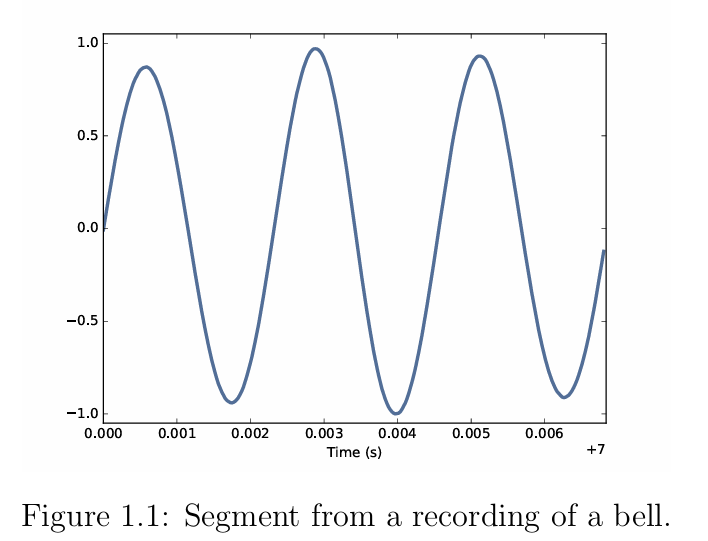
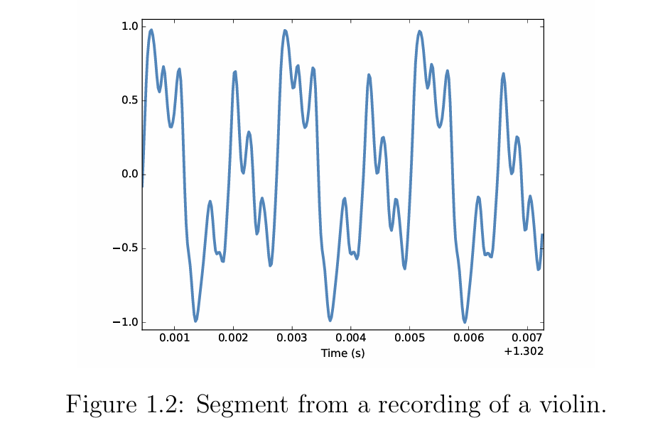
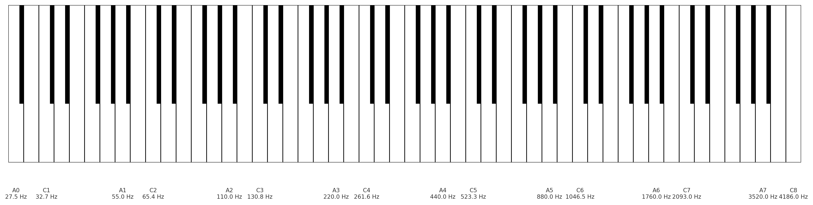

## 1.1 周期信号

### 1.1.1 什么是周期信号？

周期信号是指在某段时间后重复自身的信号。

- 示例：敲钟的钟声



- 示例：小提琴声音




### 1.1.2 Cycle, Duration, Frequency, Waveform, Timbre

上述图片 Figure 1.1 中：

- 信号重复了3次，每一次是一个 **cycle** ，每一圈 cycle 的时长称为 **duration** 。

- 一秒内 cycle 重复的次数叫做**频率** ，单位是赫兹（Hertz），赫兹实际上是每秒的含义。

- 周期信号的形状称为 **waveform** ，波形
- 波形决定**音色** timbre ，是对声音质量的感知。


### 1.1.3 科学音高记谱法（SPN）

1. 定义

**Scientific Pitch Notation (SPN)** 是一种用来表示音高的记谱方法，它结合了 **音名（C, D, E...）** 和 **八度数（0, 1, 2...）** 来唯一确定一个音。

例子：

- **C4** → 中音 C（通常称为“中央 C”）。
- **A4** → 国际标准音高 A（440 Hz）。

---

2. 结构

SPN 的基本格式是：

```
[音名][升降号][八度数]
```

- **音名**：C, D, E, F, G, A, B
- **升降号**：`#`（升半音）或 `b`（降半音），可选
- **八度数**：整数，表示音在哪个八度范围

---

3. 八度划分规则

在 SPN 中：

- **C** 是每个八度的起点。
- 例如：
    - **C4 到 B4** → 属于第 4 八度
    - **C5** 就是进入第 5 八度

也就是说，每遇到一个 C，八度数就会加一。

---

4. 常见参考音

- **C4**：中央 C（钢琴键盘的正中间）
- **A4**：标准音 A，频率 = **440 Hz**（常用于乐器调音）
- **C0**：钢琴上最低的音（32.70 Hz）
- **C8**：钢琴最高音（4186 Hz）

---

5. 与钢琴键盘的对应

如果你看钢琴：

- 键盘最左边的 A 是 **A0**
- 中央 C 是 **C4**
- 最右边的最高 C 是 **C8**




