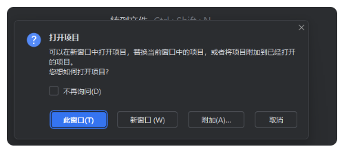
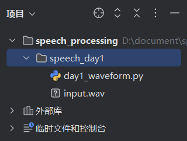

## 1. 创建音频及py文件

### 1.1 准备音频文件

找一个格式为 wav 的音频文件，放在合适的文件夹中。

例如我放在了这个文件夹 `D:\document\speech_processing\speech_day1`，命名为 `iuput.wav` 。

### 1.2 准备环境

PyCharm: `文件-打开-选择音频所在文件夹` 。

会提示：



这是 PyCharm 在问你：**你现在要打开的这个文件夹/项目，要怎么和你当前已经打开的项目窗口共存**。

你看到的几个按钮含义是：

- **此窗口**：用**当前这个 PyCharm 窗口**打开新文件夹（原来打开的项目会被替换掉）。
- **新窗口**：另外再开一个 PyCharm 窗口打开它（原来的项目窗口保留）。
- **附加…**：把你要打开的这个文件夹**附加到当前项目里**（相当于把它作为一个“模块/子项目”加进来，左侧项目树会多出来一个目录）。
- **取消**：不打开。
- **不再询问**：以后默认按你选的方式来，不再弹这个框（不建议现在就勾，等你确定习惯再勾）。

我选择了此窗口，PyCharm 会自动帮你匹配好环境，我这里用的是 `base` ，没有单独创建一个专用的环境。

### 1.3 创建 py 文件

因为我们需要音频和 py 运行文件在同一目录下，因此直接新建即可。



## 2. 程序编写

### 2.1 安装需要的库

PyCharm 左下角打开终端，运行命令：

```python
python -m pip install numpy scipy matplotlib soundfile
```

### 2.2 分析GPT给出的程序代码

::: tabs

@tab Part 1

```python
import numpy as np
import soundfile as sf
from scipy.signal import resample_poly
import matplotlib.pyplot as plt
from pathlib import Path
import csv
from datetime import datetime

# ====== 输入文件 ======
INPUT_WAV = "input.wav"     # 输入音频的文件名
TARGET_SR = 16000           # 统一采样率到 16k
# ========================

out_dir = Path(".")                          
wav_in = Path(INPUT_WAV)              
```

`"."` 的意思是：当前工作目录（运行的脚本所在文件夹），所以 `out_dir` 就表示：输出文件要保存到哪里。

`Path(INPUT_WAV)`  就把这个字符串变成一个“路径对象”，所以 `wav_in` 表示：输入音频文件的路径。


@tab Part 2

```python
if not wav_in.exists():
    raise FileNotFoundError(f"找不到输入文件：{wav_in.resolve()}")

# 读音频
x, sr = sf.read(str(wav_in), always_2d=False)
```

逐个拆开讲：

### 1) `sf.read(...)` 是什么？

`sf` 是 `soundfile` 这个库（前面一般写了 `import soundfile as sf`）。
 `sf.read(文件路径)` 会**返回两个东西**：

- **x**：音频数据本身（一个数组）
    - 单声道：`x` 是一维数组，比如 `[0.01, -0.02, ...]`
    - 双声道：`x` 是二维数组，比如 `[[L0, R0], [L1, R1], ...]`
- **sr**：采样率（单位 Hz），比如 `16000`、`44100`、`48000`

所以左边用 `x, sr = ...` 来接收这两个返回值。

------

### 2) 为什么要 `str(wav_in)`？

`wav_in` 是 `Path` 对象。
 有些库能直接接收 `Path`，但为了兼容性更稳，这里把它转成字符串路径。

------

### 3) `always_2d=False` 是什么意思？

它控制 `x` 的形状：

- `always_2d=False`：
    - 如果是单声道，`x` 就是一维（更方便画波形、处理）
    - 如果是多声道，`x` 才是二维
- 如果写成 `always_2d=True`：
    - 单声道也会强制变成二维（形状像 `N×1`）


@tab Part 3

```python
# 如果是双声道/多声道，转单声道（取平均）
if x.ndim > 1:
    x = x.mean(axis=1)
```

### 1）`x.ndim > 1` 是什么意思？

- `x` 是音频数组
- `ndim` 是“维度数”
    - 单声道一般是 **一维**：形状像 `(N,)`，所以 `x.ndim == 1`
    - 双声道/多声道一般是 **二维**：形状像 `(N, C)`
        - N = 采样点数量
        - C = 声道数（2=左右声道）

所以：

- `x.ndim > 1` 就是在判断：**是不是多声道**。

### 2）`x.mean(axis=1)` 在干什么？

当 `x` 是 `(N, C)` 时：

- `axis=1` 表示沿着“声道那一维”求平均
- 结果就变成 `(N,)`，也就是单声道

举个简单例子：
 假设某个采样点左右声道分别是 L=0.2, R=0.4
 取平均就是 (0.2+0.4)/2 = 0.3
 这样每个时间点都合成一个值。

### 3）取其中一个声道

如果你想更“保险”一点，也可以不平均，改成只取一个声道（比如左声道）：

```
if x.ndim > 1:
    x = x[:, 0]
```


@tab Part 4

```python
# 重采样到 16k（若本来就是16k就不动）
if sr != TARGET_SR:
    # 用有理数重采样：up/down
    # 例如 48000 -> 16000 就是 down=3
    # 这里用最大公约数自动简化
    import math
    g = math.gcd(sr, TARGET_SR)
    up = TARGET_SR // g
    down = sr // g
    x_rs = resample_poly(x, up, down)
    sr_rs = TARGET_SR
else:
    x_rs = x
    sr_rs = sr
```

### 1）`if sr != TARGET_SR:`：先判断要不要重采样

- `sr` 是你读出来的原采样率（比如 48000、44100）
- `TARGET_SR` 是你想统一到的采样率（这里是 16000）

如果不同，就进入重采样；相同就直接用原音频。

------

### 2）为什么要算 `g = gcd(sr, TARGET_SR)` 最大公约数 ？

因为重采样可以理解成两步：

- **先上采样**（插值）
- **再下采样**（抽取）

用 `resample_poly(x, up, down)` 需要两个整数：

- `up`：上采样倍数
- `down`：下采样倍数

但直接写成 `up=16000, down=48000` 太大了，没必要。
 所以用最大公约数 `g` 把比例约分成最简：

例子：`48000 -> 16000`

- `gcd(48000, 16000) = 16000`
- `up = 16000/16000 = 1`
- `down = 48000/16000 = 3`
     所以就是：**不插值（×1），每3个点取1个（÷3）**，这就是注释里写的 `down=3`。

再比如：`44100 -> 16000`

- `gcd(44100, 16000) = 100`

- `up = 16000/100 = 160`

- `down = 44100/100 = 441`
     表示用一个合理的整数比例去变换采样率。

    > **重采样不是只能“整倍数”变化** 
    >
    > 像 `48000 -> 16000` 很爽，是整除（÷3）。
    >  但很多音频是 **44100Hz**（音乐/部分录音常见），它跟 16000 **不整除**。
    >
    > 这时候你还是可以重采样，只是要用一个**分数比例**：
    > $$
    > \frac{16000}{44100}=\frac{160}{441}
    > $$
    > 所以程序用：
    >
    > - `up = 160`
    > - `down = 441`
    >
    > 意思是：**先把采样点“插值变密”160倍，再按 441 倍抽取回去**（实际实现会用滤波器高效完成，不是傻乎乎真的把点扩大160倍存起来）。

此外，代码内部进行 **重采样时会做一个“抗混叠低通滤波”** 。是 `resample_poly` **内部自动帮你做的**，目的只有一个：**不让重采样把高频搞乱**。

**为什么重采样必须“顺带滤波”？** 

当把采样率从高变低（比如 48k → 16k），相当于以后最多只能正确表示到 **8kHz** 的内容。
 那原来 48k 里可能存在 **8kHz 以上**的部分怎么办？

如果直接“隔点取样/抽取”，这些高频会**折回来伪装成低频**（这就是混叠），声音会变脏、出现奇怪的失真。

所以正确流程是：

> **先低通滤波，把新采样率承受不了的高频切掉 → 再抽取（降采样）**

**它到底滤掉了什么？** 

以 48k → 16k 为例：

- 16k 的最高安全频率大约是 **8kHz**
- 所以内部低通会把 **8kHz 以上**逐渐压掉（不是一刀切，但大概这个意思）

这样降到 16k 后，信号不会出现“高频折回”的假成分。

------

### 3）`x_rs = resample_poly(x, up, down)` 做了什么？

它会把音频从 `sr` 变成 `TARGET_SR`，并且**自动做低通滤波**来避免重采样带来的失真（比简单“隔点取样”靠谱很多）。

输出 `x_rs` 就是重采样后的波形数组。

------

### 4）`sr_rs = TARGET_SR` / `else` 分支

- 如果做了重采样：`sr_rs` 就是 16000
- 如果没做：`x_rs = x`，`sr_rs = sr`，保持原样


@tab Part 5

```python
# 保存重采样后的 wav（方便后续都用这个，不用每次都重采样）
out_wav = out_dir / "input_16k.wav"
sf.write(str(out_wav), x_rs, sr_rs)
```

### 1）`out_wav = out_dir / "input_16k.wav"`

- `out_dir` 是当前目录（ 我们命名过的当前路径 `Path(".")`）
- `out_dir / "input_16k.wav"` 这是一种 `Path` 的写法，表示：
     **在当前目录下创建/指向一个叫 `input_16k.wav` 的文件路径**
- 如果你当前目录是 `D:\speech_day1\`，那它就是：
     `D:\speech_day1\input_16k.wav`

### 2）`sf.write(str(out_wav), x_rs, sr_rs)`

- `sf.write(路径, 数据, 采样率)` 用来写/存储 wav 文件
- `x_rs` 是重采样后的波形数组
- `sr_rs` 是对应的采样率（这里应该是 16000）
- `str(out_wav)` 同样是把 Path 转成字符串给 soundfile 用


@tab Part 6

```python
# 计算时长
duration = len(x_rs) / sr_rs

# 画波形
t = np.arange(len(x_rs)) / sr_rs
plt.figure(figsize=(10, 3))
plt.plot(t, x_rs)
plt.xlabel("Time (s)")
plt.ylabel("Amplitude")
plt.title(f"Waveform (sr={sr_rs} Hz, duration={duration:.2f} s)")
plt.tight_layout()

out_png = out_dir / "waveform.png"
plt.savefig(str(out_png), dpi=160)
plt.close()
```

### 1) 生成时间轴（为了画图横坐标是秒）

```
t = np.arange(len(x_rs)) / sr_rs
```

- `np.arange()` 的设计规则是：**从 0 开始，按步长 1 递增，直到（但不包含）给定的终点**。因此 `np.arange(len(x_rs))` 会生成 `[0, 1, 2, ..., N-1]`
- 再除以 `sr_rs`，就变成秒：
     `[0/sr, 1/sr, 2/sr, ..., (N-1)/sr]`
- 这样画出来的横轴就是 **Time (s)**。

### 2) 画图（波形图）

```
plt.figure(figsize=(10, 3))
plt.plot(t, x_rs)
plt.xlabel("Time (s)")
plt.ylabel("Amplitude")
plt.title(f"Waveform (sr={sr_rs} Hz, duration={duration:.2f} s)")
plt.tight_layout()
```

- `figsize=(10,3)`：图的大小（宽10英寸，高3英寸）
- `plt.plot(t, x_rs)`：横轴时间 t，纵轴幅度 x_rs（波形）
- `title`：标题里把采样率和时长写上，方便你截图/写报告
- `tight_layout()`：自动整理边距，避免标题或坐标被挤掉


### 3) 保存成图片并关闭

```
out_png = out_dir / "waveform.png"
plt.savefig(str(out_png), dpi=160)
plt.close()
```

- `out_png`：输出文件路径（当前目录下的 waveform.png）
- `savefig(..., dpi=160)`：保存图片，dpi 越高越清晰
- `close()`：关掉这张图，避免后面画更多图时叠在一起、占内存


@tab Part 7

```python
# 写 log.csv（追加一行，更适合实验记录）
log_csv = out_dir / "log.csv"
new_file = not log_csv.exists()

with log_csv.open("a", newline="", encoding="utf-8") as f:
    writer = csv.writer(f)

    # 第一次创建文件时写表头
    if new_file:
        writer.writerow(["time", "input_file", "output_file", "sr_in", "sr_out", "duration_s"])

    writer.writerow([
        datetime.now().strftime("%Y-%m-%d %H:%M:%S"),
        wav_in.name,          # 输入文件名
        out_wav.name,         # 输出文件名
        sr,                   # 原采样率
        sr_rs,                # 重采样后采样率
        f"{duration:.2f}"     # 时长（秒）
    ])
    

print("✅ Day 1 完成！输出：")
print(" -", out_png.resolve())
print(" -", (out_dir / "log.csv").resolve())
print(" -", out_wav.resolve())
```

### 1）打开文件（追加模式）并起个名字叫 `f`

```
with log_csv.open("a", newline="", encoding="utf-8") as f:
```

- `log_csv` 是一个路径对象（比如 `./log.csv`）

- `.open("a", ...)` 表示打开文件：

    - `"a"` = append（追加）：**不会覆盖原内容，只会在末尾继续写**

- `encoding="utf-8"`：用 UTF-8 编码写，中文不容易乱码

- `newline=""`：这是写 CSV 时的常见写法，避免 Windows 上出现“空行”的问题

    > CSV 模块会自己处理换行；如果文件打开时又让系统默认再处理一次换行，就可能变成“双重换行”，于是你看到文件里就隔一行空一行。把 `newline=""` 交给 `csv.writer` 统一管理换行，就不会出这个坑了。

- `with ... as f:`：这是 Python 的“上下文管理”

    - 好处：**写完自动关闭文件**，不怕你忘记 `close()`，也不容易把文件占用住

一句话：**打开 log.csv，准备往后面追加内容，文件句柄叫 f，写完自动关掉。**

------

### 2）创建一个 CSV 写入器

```
writer = csv.writer(f)
```

- `csv.writer(f)` 会返回一个“写入器”

- 以后就可以用：

    ```
    writer.writerow([...])
    ```

    把一行数据写进 CSV（自动用逗号分隔、自动处理引号等细节）

一句话：**writer 是专门负责“把列表写成 CSV 一行”的工具。**

------

### 一个很直观的类比

- `open(...) as f`：打开一个记账本（log.csv）
- `csv.writer(f)`：拿到一支“会自动排版成表格格式”的笔
- `writer.writerow([...])`：往记账本里写一行记录

:::

全部代码如下：

```python
import numpy as np
import soundfile as sf
from scipy.signal import resample_poly
import matplotlib.pyplot as plt
from pathlib import Path
import csv
from datetime import datetime

# ====== 你只改这里 ======
INPUT_WAV = "input.wav"     # 输入音频的文件名
TARGET_SR = 16000           # 统一采样率到 16k
# ========================

out_dir = Path(".")                          # "." 的意思是：当前工作目录（运行的脚本所在文件夹），所以 out_dir 就表示：输出文件要保存到哪里
wav_in = Path(INPUT_WAV)                     # Path(INPUT_WAV) 就把这个字符串变成一个“路径对象”，所以 wav_in 表示：输入音频文件的路径

if not wav_in.exists():
    raise FileNotFoundError(f"找不到输入文件：{wav_in.resolve()}")

# 读音频
x, sr = sf.read(str(wav_in), always_2d=False)

# 如果是双声道/多声道，转单声道（取平均）
if x.ndim > 1:
    x = x.mean(axis=1)

# 重采样到 16k（若本来就是16k就不动）
if sr != TARGET_SR:
    # 用有理数重采样：up/down
    # 例如 48000 -> 16000 就是 down=3
    # 这里用最大公约数自动简化
    import math
    g = math.gcd(sr, TARGET_SR)
    up = TARGET_SR // g
    down = sr // g
    x_rs = resample_poly(x, up, down)
    sr_rs = TARGET_SR
else:
    x_rs = x
    sr_rs = sr

# 保存重采样后的 wav（方便后续都用这个）
out_wav = out_dir / "input_16k.wav"
sf.write(str(out_wav), x_rs, sr_rs)

# 计算时长
duration = len(x_rs) / sr_rs

# 画波形
t = np.arange(len(x_rs)) / sr_rs
plt.figure(figsize=(10, 3))
plt.plot(t, x_rs)
plt.xlabel("Time (s)")
plt.ylabel("Amplitude")
plt.title(f"Waveform (sr={sr_rs} Hz, duration={duration:.2f} s)")
plt.tight_layout()

out_png = out_dir / "waveform.png"
plt.savefig(str(out_png), dpi=160)
plt.close()

# 写 log.csv（追加一行，更适合实验记录）
log_csv = out_dir / "log.csv"
new_file = not log_csv.exists()

with log_csv.open("a", newline="", encoding="utf-8") as f:
    writer = csv.writer(f)

    # 第一次创建文件时写表头
    if new_file:
        writer.writerow(["time", "input_file", "output_file", "sr_in", "sr_out", "duration_s"])

    writer.writerow([
        datetime.now().strftime("%Y-%m-%d %H:%M:%S"),
        wav_in.name,          # 输入文件名
        out_wav.name,         # 输出文件名
        sr,                   # 原采样率
        sr_rs,                # 重采样后采样率
        f"{duration:.2f}"     # 时长（秒）
    ])


print("✅ Day 1 完成！输出：")
print(" -", out_png.resolve())
print(" -", (out_dir / "log.csv").resolve())
print(" -", out_wav.resolve())

#-------output-------
✅ Day 1 完成！输出：
 - D:\document\speech_processing\speech_day1\waveform.png
 - D:\document\speech_processing\speech_day1\log.csv
 - D:\document\speech_processing\speech_day1\input_16k.wav
```


