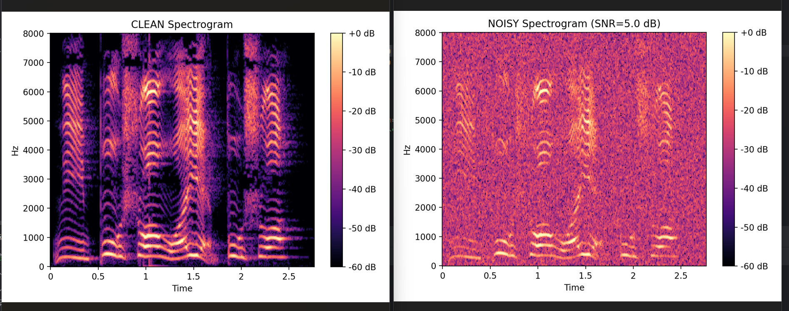

## 1. 目标

用 `scipy.signal.stft` 或 `librosa.stft` 画谱图（干净/带噪各一张）

## 2. 准备干净语料

准备干净的语音文件 `clean.wav` 放在合适的文件夹中。


### 3. 生成噪声语料并画出谱图

安装前一天没有安装，今天又需要的包：`librosa` 。

终端输入命令 `pip install librosa` 。

分析 GPT 给出的代码。

::: tabs

@tab Part 1

```python
from pathlib import Path
import numpy as np
import librosa
import librosa.display
import soundfile as sf
import matplotlib.pyplot as plt

# ===== 路径设置 =====
ROOT = Path(__file__).resolve().parent
IN_WAV = ROOT / "clean.wav"

NOISY_WAV = ROOT / "noisy.wav"
FIG_CLEAN = ROOT / "spec_clean.png"
FIG_NOISY = ROOT / "spec_noisy.png"

if not IN_WAV.exists():
    raise FileNotFoundError(f"找不到：{IN_WAV}（cwd={Path.cwd()}）")
```

`Path(__file__).resolve().parent` 表示 **.py 文件所在的文件夹**

好处：

让程序**以脚本所在文件夹为“基准点”**去找文件。
 所以你不管：

- 用 PyCharm 跑

- 用 VS Code 跑

- 直接在 CMD / PowerShell 跑

- 甚至从别的目录跑

    > 在终端里如果这样跑：
    >
    > ```
    > cd /d D:\document
    > python speech_processing\speech_day2\make_noisy_and_specs.py
    > ```
    >
    > - **cwd = D:\document**
    > - Day1 写法会去 `D:\document\clean.wav` 找（当然找不到）
    > - 脚本目录写法会去 `D:\...\speech_day2\clean.wav` 找（能找到）

只要你的音频文件**确实放在脚本同一个目录**，一般就不会出现“因为运行目录不同导致找不到文件”。

---

**与前一天代码对比：**

```python
# ====== 输入文件 ======
INPUT_WAV = "input.wav"     # 输入音频的文件名
TARGET_SR = 16000           # 统一采样率到 16k
# ========================

out_dir = Path(".")                          
wav_in = Path(INPUT_WAV)              
```

`Path("xxx.wav")`：相对 **cwd** 当前工作路径，因此会到当前工作路径下找文件。

同理，输出文件位置 `Path(".")` 也是当前工作路径。

因此一旦当前工作路径和文件所在文件路径不匹配，则容易出现问题。


@tab Part 2

```python
# ===== Step A：读取 clean，并统一采样率 =====
SR = 16000
y, sr = librosa.load(str(IN_WAV), sr=SR, mono=True)
print("Loaded:", IN_WAV, "len:", len(y), "sr:", sr)
```

**`SR = 16000` ：** 先设定“目标采样率”为 16k。后面读入时会按这个来。

**`y, sr = librosa.load(str(IN_WAV), sr=SR, mono=True)` ：** 

这行做了三件事：

1. **从 IN_WAV 读音频**（IN_WAV 是文件路径）
2. `mono=True`：把音频变成**单声道**
    - 如果原来是双声道，librosa 会把左右声道做平均/合并
3. `sr=SR`：把音频**重采样到 16k**
    - 如果原来不是 16k（比如 44.1k），librosa 会自动 resample
    - 如果原来就是 16k，它就不改

返回值：

- `y`：一维 numpy 数组（波形，浮点数，通常范围在 [-1,1]）
- `sr`：实际返回的采样率（因为你传了 `sr=16000`，所以基本就是 16000）

**`print("Loaded:", IN_WAV, "len:", len(y), "sr:", sr)` ：** 

打印确认：读到了哪个文件、样本点数是多少、采样率是多少。 `len(y)` 是“采样点数”，如果想看“秒数”可以再算：`len(y)/sr` 。


@tab Part 3

```python
# ===== Step B：按目标 SNR 加白噪声 =====
def add_white_noise_to_snr(clean: np.ndarray, snr_db: float, seed: int = 0):
    rng = np.random.default_rng(seed)
    noise = rng.standard_normal(size=clean.shape)

    p_sig = np.mean(clean**2) + 1e-12
    p_noise = np.mean(noise**2) + 1e-12

    scale = np.sqrt(p_sig / (p_noise * (10 ** (snr_db / 10))))
    noisy = clean + noise * scale

    # 防削波：超过[-1,1]就整体缩放
    peak = np.max(np.abs(noisy))
    if peak > 0.99:
        noisy = noisy / peak * 0.99      # 这里没有括号，实际上是 noisy × （0.99/peak）

    return noisy.astype(np.float32)
```

**给 clean 波形加一段白噪声，并把噪声强度调到你指定的 SNR（比如 5 dB）**，然后把合成后的 `noisy.wav` 保存出来。

**`def add_white_noise_to_snr(clean: np.ndarray, snr_db: float, seed: int = 0):` ：**

定义一个函数：输入干净语音 `clean`、目标 `snr_db`，输出带噪语音。

`np.ndarray` 指的是 **NumPy 的数组类型**（n-dimensional array，n 维数组）

`seed` 是随机种子：让你每次运行得到同一段噪声，方便复现实验。

> ### 1）seed 在代码里到底控制了什么？
>
> ```
> rng = np.random.default_rng(seed)
> noise = rng.standard_normal(size=clean.shape)
> ```
>
> - `default_rng(seed)`：用 seed 初始化一个随机数生成器
> - `standard_normal(...)`：从这个生成器里抽样，生成噪声
>
> 所以 **seed 直接决定了 noise 长什么样**（哪一串随机数）。
>
> ------
>
> ### 2）常见 4 种使用场景
>
> #### 情况 A：固定 seed
>
> 目的：每次运行结果一致，方便你判断“代码改动带来的变化”。
>
> 做法：
>
> ```
> seed = 0  # 固定
> ```
>
> 改 STFT 参数/画图参数时，噪声不变，变化就只来自你的改动。
>
> ------
>
> #### 情况 B：要做“稳健结果”（论文实验更严谨）
>
> 目的：结果不依赖某一条噪声的“运气”，而是对多个随机噪声平均。
>
> 做法：跑多个 seed，取平均/方差：
>
> ```
> seeds = [0, 1, 2, 3, 4]
> for s in seeds:
>     noisy = add_white_noise_to_snr(clean, 5.0, seed=s)
>     # 跑算法 -> 算指标 -> 记录
> ```
>
> 最后汇报：平均提升多少 dB、标准差多少（哪怕只做 3 个 seed 也比 1 个强）。
>
> ------
>
> #### 情况 C：要“每次都生成不同 noisy”（不想重复）
>
> 目的：每次运行都想得到新的噪声样本。
>
> 做法 1：用时间相关的随机种子（最简单：不传 seed）
>  在 NumPy 里你可以让它自动用系统熵初始化：
>
> ```
> rng = np.random.default_rng()  # 不给seed
> ```
>
> 对应此处的函数，可以把 seed 默认值改成 `None`：
>
> ```
> def add_white_noise_to_snr(clean, snr_db, seed=None):
>     rng = np.random.default_rng(seed)
> ```
>
> - `seed=None` → 每次噪声都不一样（更“随机”）
>
> 做法 2：手动换 seed（更可控）
>  比如用当前日期/实验编号：
>
> ```
> seed = 20251224
> ```
>
> ------
>
> #### 情况 D：想“可复现 + 可追踪”（最像论文工程）
>
> 目的：既能生成不同 noisy，又能以后完全复现同一个 noisy。
>
> 做法：把 seed 写进文件名/日志：
>
> - `noisy_snr5_seed0.wav`
> - `noisy_snr5_seed1.wav`
>
> 这样“这张图对应哪条 noisy”，就能立刻复现。
>
> ------
>
> ### 3）几个可能会踩的坑
>
> #### 坑 1：同 seed ≠ 同结果（如果改了 noise 的长度）
>
> 同一个 seed 生成的是“随机序列”，但你取多少个点会影响结果：
>
> - 音频长度变了（更长/更短）
> - `size=clean.shape` 就变了
>      → 得到的噪声也会不同（因为截取的序列长度不一样）
>
> 所以做“严格对比”时，**输入长度最好固定**。
>
> ------
>
> #### 坑 2：同 seed 在不同库/不同算法里不一定完全一致
>
> 现在用的是 NumPy 的 `default_rng`，它在 NumPy 内部是稳定的。
>  但如果你换成别的库的随机数（Python `random`、PyTorch、TF），seed 机制不通用。

---

**`rng = np.random.default_rng(seed)` ：**
创建一个随机数生成器对象 rng。

`default_rng` 是 `Numpy` 推荐的新接口，比老的 `np.random.seed()` 更好用、更可控。

seed 一样 → 生成的随机序列就一样。

---

**`noise = rng.standard_normal(size=clean.shape)` ：**
生成一段噪声数组 noise，长度和 clean 完全一致。

`standard_normal` 生成的是 高斯噪声：均值 0、标准差 1。

之所以叫“白噪声”：它的频谱在各频率上（理想情况下）平均分布，不偏向某个频段。

此时的 noise 强度是“默认的”，跟你的 clean 的强度没关系，所以还不能直接加。

---

**`p_sig = np.mean(clean**2) + 1e-12` ：**
这行在算干净语音的平均功率（power）。

clean**2：每个采样点平方（类似能量）

np.mean(...)：对整段取平均，得到“每个采样点平均能量”，在信号处理中常用作功率估计。

+ 1e-12：避免极端情况下 clean 全是 0 导致后面除 0。

你可以把 p_sig 理解成：这段语音整体有多“响”（更准确说是平均能量大小）。

---

**`p_noise = np.mean(noise**2) + 1e-12` ：**

同理，这行算的是刚生成的那段噪声的平均功率。

因为 noise 是标准高斯，理论上它功率大约接近 1，但实际会有波动，所以这里也算一下更稳。

---

**我们知道了 “信号有多强” 和 “当前噪声有多强”** 

接下来关键问题：**要把噪声乘多少倍，才能达到所需的 snr_db？**

**`scale = np.sqrt(p_sig / (p_noise * (10 ** (snr_db / 10))))` ：** 

算出噪声要乘多少倍，才能让加到 clean 上后的信噪比等于 snr_db（dB）

> ### 1）分贝的正式定义
>
> 对两个**功率** $P_2, P_1$ 的比值，分贝定义为：
> $$
> L_{dB} = 10\log_{10}\left(\frac{P_2}{P_1}\right)
> $$
> 这就是“对数单位 = 分贝”的来源：**dB 就是这样定义出来的**。
>
> ### 2）为什么定义里有 log？
>
> 因为很多实际系统（听觉、通信、放大器级联等）涉及的比值跨度很大。用对数有两个好处：
>
> - **把很大的范围压缩**：比值从 1 到 1,000,000，用 dB 变成 0 到 60
> - **把乘法变加法**：
>      两级增益相乘 $G=G_1G_2$
>      在 dB 下变成 $G_{dB}=G_{1,dB}+G_{2,dB}$
>      做系统分析很方便
>
> ### 3）那为什么是 10，而不是别的？
>
> 这也是定义的一部分：历史上先有 “Bel（贝尔）”：
> $$
> L_{Bel} = \log_{10}\left(\frac{P_2}{P_1}\right)
> $$
> 但 1 Bel 单位还是太大了，不好用，所以改用 **十分之一 Bel**，叫 **deci-bel（分贝）**：
> $$
> 1\,dB = 0.1\,Bel
> \Rightarrow L_{dB}=10\,L_{Bel}
> $$
> 所以就变成了：
> $$
> L_{dB} = 10\log_{10}\left(\frac{P_2}{P_1}\right)
> $$
> 要注意：这里面的贝尔和分贝都是单位，单位大小变为原来的十分之一，那么数值就是原来的十倍（参考厘米和毫米）。
>
> ### 4）为什么有时是 20log？
>
> 因为此时比的不是功率，而是**幅度/振幅**（电压、声压、波形幅度等）。功率跟幅度的平方成正比：
> $$
> P \propto A^2
> $$
> 代进去：
> $$
> 10\log_{10}\left(\frac{P_2}{P_1}\right)
> =10\log_{10}\left(\frac{A_2^2}{A_1^2}\right)
> =20\log_{10}\left(\frac{A_2}{A_1}\right)
> $$
> 所以：
>
> - **功率比** → $10\log_{10}$
> - **幅度比** → $20\log_{10}$

**Step 1: 先明确你想达到的目标** 

你希望最终满足：
$$
\text{SNR}_{dB}=10\log_{10}\left(\frac{P_{sig}}{P_{noise,target}}\right)
$$
把它变回线性比率：
$$
\frac{P_{sig}}{P_{noise,target}} = 10^{\text{SNR}_{dB}/10}
$$
令
$$
R = 10^{\text{snr\_db}/10}
$$
那么目标噪声功率应该是：
$$
P_{noise,target}=\frac{P_{sig}}{R}
$$
现在手里有一段“原始噪声” noise

我们生成的 `noise` 是标准高斯白噪声，它自身有一个功率，但这个功率一般不是我们想要的，所以要缩放。

**Step 2: 缩放噪声会怎么改变功率？**

你把噪声乘一个系数 `scale`：
$$
noise_{scaled} = scale \cdot noise
$$
功率会变成：
$$
P_{noise,scaled} = \mathbb{E}[(scale\cdot noise)^2]
= scale^2 \cdot \mathbb{E}[noise^2]
= scale^2 \cdot P_{noise}
$$
**Step 3: 让“缩放后的噪声功率”正好等于目标噪声功率**

你要：
$$
scale^2 \cdot P_{noise} = P_{noise,target}=\frac{P_{sig}}{R}
$$
解出 `scale`：
$$
scale^2 = \frac{P_{sig}}{P_{noise}\cdot R}
\quad\Rightarrow\quad
scale = \sqrt{\frac{P_{sig}}{P_{noise}\cdot R}}
$$
把 $R$ 换回 $10^{\text{snr\_db}/10}$：
$$
scale = \sqrt{\frac{P_{sig}}{P_{noise}\cdot 10^{\text{snr\_db}/10}}}
$$
这就对应代码：

```
scale = np.sqrt(p_sig / (p_noise * (10 ** (snr_db / 10))))
```

---

**`return noisy.astype(np.float32)` ：** 

**把 `noisy` 这个 NumPy 数组转换成 `float32` 类型再返回**。float32 每个数 4 字节，音频很长时，内存/写文件都更省。

@tab Part 4

```python
TARGET_SNR_DB = 5.0  # 0更吵，10更干净
noisy = add_white_noise_to_snr(y, TARGET_SNR_DB, seed=0)

sf.write(str(NOISY_WAV), noisy, SR)
print("Saved:", NOISY_WAV)
```

刚才的函数实例化，带入需要的信噪比 5dB 。`y` 是干净语音的信号数组。

`sf.write(str(NOISY_WAV), noisy, SR)` 将函数返回的加过噪声的语音数组存储下来。三个参数分别为：文件路径, 数据, 采样率。

@tab Part 5

```python
# ===== Step C：STFT -> dB（两张图统一参考，保证可比）===== 这里自己按照逻辑调整了顺序
WINDOW = "hann"
WIN_LENGTH = 400   # 25ms @ 16k
HOP_LENGTH = 160   # 10ms @ 16k
N_FFT = 512

def stft_mag(x):
    D = librosa.stft(x, n_fft=N_FFT, hop_length=HOP_LENGTH,
                     win_length=WIN_LENGTH, window=WINDOW)
    return np.abs(D)

S_clean = stft_mag(y)
S_noisy = stft_mag(noisy)
```

Step C 做的事可以概括成一句话：**把时域波形变成“随时间变化的频谱”（STFT），然后取幅度得到谱图的原材料。** 

**WINDOW（窗函数）**

- `"hann"`：把每帧边缘逐渐压小，减少频谱泄漏
- 语音任务里 Hann 是默认常用选择。

每帧其实是在“截取一小段信号”。直接硬截会在两端突然断开，相当于乘了一个“矩形窗”，会导致频谱泄漏更明显。

Hann 窗做的事：**把帧的两端缓慢压到 0**，让截断更平滑 → 泄漏更小 → 谱图更干净。

**WIN_LENGTH（窗长 / 每一帧取多长）**

- `WIN_LENGTH=400`：每帧取 400 个采样点
- 采样率 16k 时：400/16000 = 0.025s = **25ms**
- 25ms 是语音谱图常用帧长：能看到谐波结构，也不会太糊。

**HOP_LENGTH（帧移 / 两帧之间隔多少点）**

- `HOP_LENGTH=160`：相邻两帧起点相隔 160 个点
- 160/16000 = **10ms**
- 也很常用：时间分辨率够，谱图不会太稀。

**FFT 点数 N_FFT（每帧用多少点来算频谱）**

`N_FFT = 512` 的意思是：**每一帧做 STFT 时，用 512 点 FFT 来把这一帧从时域变到频域**。它主要带来三件事：

1）它决定“频率格子（bin）有多少”和“每格多宽”

采样率 `SR=16000` 时：

- **频率间隔**

$$
\Delta f=\frac{SR}{N\_FFT}=\frac{16000}{512}=31.25\text{ Hz}
$$

意思是：相邻两个频率 bin 的中心频率差 31.25 Hz。

- **非负频率 bin 数**（音频是实数，通常只留 0～SR/2，负频率部分与正频率是镜像的，信息是重复的）

$$
\frac{N\_FFT}{2}+1=\frac{512}{2}+1=257
$$

所以你的谱图矩阵在频率方向通常是 **257 行**，有256个间隔。

2）它决定谱图频率轴的“最高频”

最高频是 Nyquist：
$$
f_{max}=\frac{SR}{2}=8000\text{ Hz}
$$
所以谱图频率范围是 **0～8000Hz**（这对 16k 语音足够了）。

3）为什么常用 512（这套参数下的原因）

现在 `WIN_LENGTH=400`（25ms）。FFT 点数一般取：

- **不小于窗长**（否则信息会被截断/不合理）
- **常取 2 的幂**（FFT 计算更高效、也更常用）

400 不是 2 的幂，最近的 ≥400 的 2 的幂就是 **512**。
 所以设 `N_FFT=512` 等价于：**每帧先用 400 点窗取出有效数据，再补零到 512 点做 FFT**。

补零：**让频率轴网格更密、谱图更平滑**（但不会凭空增加真正的分辨能力）。

> **把每帧长度不够的部分用 0 填满，让 FFT 计算用固定的 512 点长度**。
>
> 具体到这组参数：
>
> - 每帧真正取出来的是 `WIN_LENGTH=400` 个点（25ms）
> - 但让 FFT 用 `N_FFT=512` 点来算
>
> 所以库会做一件事：
>
> > 把这 400 个点后面再接上 112 个 0，变成 512 点，然后对这 512 点做 FFT
>
> 用符号写就是：
> $$
> x_{512} = [x_0,\dots,x_{399},0,\dots,0] \quad (\text{后面补 }112\text{ 个0})
> $$
>
> ------
>
> ### 为什么要补零？
>
> #### 1）让频率轴更“细”（bin 更密）
>
> 频率间隔是：
> $$
> \Delta f = \frac{SR}{N\_FFT}
> $$
>
> - 用 400 点做 FFT：$\Delta f=16000/400=40$ Hz
> - 用 512 点做 FFT：$\Delta f=16000/512=31.25$ Hz
>
> 所以补零后，你的频率格子更密，谱图看起来更平滑、更像“高分辨率的网格”。
>
> #### 2）计算更方便/更快（2 的幂 FFT）
>
> 512 是 $2^9$，FFT 算法对 2 的幂长度通常更高效、实现也更成熟。
>
> ------
>
> ### 重要：补零不会“凭空增加信息”
>
> 补零只是让频谱在频率轴上**插值更密**，看起来更平滑；
>  **真正能分辨多细的频率细节，主要还是由窗长 400 点决定的**。
>
> 可以把它类比成：
>
> - 窗长 400：你用 25ms 的“观察时间”
> - N_FFT 512：你把频率坐标尺刻得更细，但观察时间没变
>
> **补零 = 把频谱“画得更细”，不是“听得更细”。**

---

```python
def stft_mag(x):
    D = librosa.stft(x, n_fft=N_FFT, hop_length=HOP_LENGTH,
                     win_length=WIN_LENGTH, window=WINDOW)
    return np.abs(D)
```

`D` 是 **复数矩阵**（complex）

形状：

- 行：`N_FFT/2 + 1`（因为输入是实数，只保留非负频率）
- 列：由音频长度和 hop 决定的帧数

`np.abs(D)` 为什么是谱图？

`D` 每个元素是复数：
$$
D[f,t] = a + jb
$$
复数包含两部分信息：

- **幅度（强度）**：$|D[f,t]|$
- **相位（角度）**：$\angle D[f,t]$

`np.abs(D)` 就是在做：
$$
|D[f,t]| = \sqrt{a^2 + b^2}
$$
这就是谱图最常画的东西：**能量/强度随时间和频率的分布**。

---

```python
S_clean = stft_mag(y)
S_noisy = stft_mag(noisy)
```

将干净和噪声的谱图实例化。

@tab Part 6

```python
# 关键：两张图用同一个 ref（用 clean 的最大值）
ref = np.max(S_clean) + 1e-12
S_clean_db = librosa.amplitude_to_db(S_clean, ref=ref)
S_noisy_db = librosa.amplitude_to_db(S_noisy, ref=ref)
```

这段代码是在把“线性幅度谱”转换成 **dB（对数刻度）**，并且确保 **clean 和 noisy 两张图用同一把尺子**，这样颜色深浅才可直接比较。

**`ref = np.max(S_clean) + 1e-12` ：**

- `S_clean` 是 clean 的幅度谱矩阵（都是非负数）。
- `np.max(S_clean)` 取的是 **clean 全部时频点里最大的幅度**。
- `+ 1e-12` 是为了防止极端情况 ref=0（避免除 0 或 log(0)）。

所以 `ref` 就是一个标尺：**把 clean 的最大幅度当作 0 dB 的基准**。

**`librosa.amplitude_to_db(S, ref=ref)` 在算什么？** 

它做的本质是：
$$
S_{dB} = 20\log_{10}\left(\frac{S}{ref}\right)
$$
所以：

- 当 `S == ref` 时：$20\log_{10}(1)=0$ dB
     → **最大幅度点是 0 dB**
- 当 `S` 比 `ref` 小 10 倍：
     $20\log_{10}(0.1)=-20$ dB
- 小 100 倍：-40 dB
- 小 1000 倍：-60 dB

> 这就是为什么谱图常用 dB：能把很大的动态范围压缩，细节更容易看见。

**优化小建议（更稳、更“论文范”）** 

有时 clean 的最大值可能是某个瞬时尖峰，导致整体都偏暗。更稳的做法是用百分位数做 ref：

```
ref = np.percentile(S_clean, 99.9) + 1e-12
```

取 `S_clean` 里**99.9% 分位数**对应的值，这样 0 dB 对应“接近最大但不被极端点支配”的能量，更好看、更稳定。

@tab Part 7

```python
VMIN, VMAX = -80, 0

plt.figure()       # 新建一张空画布（一个 figure）
librosa.display.specshow(S_clean_db, sr=SR, hop_length=HOP_LENGTH,
                         x_axis="time", y_axis="linear", vmin=VMIN, vmax=VMAX)
plt.colorbar(format="%+2.0f dB")
plt.title("CLEAN Spectrogram")
plt.tight_layout()
plt.savefig(str(FIG_CLEAN), dpi=200)
plt.close()
print("Saved:", FIG_CLEAN)

plt.figure()
librosa.display.specshow(S_noisy_db, sr=SR, hop_length=HOP_LENGTH,
                         x_axis="time", y_axis="linear", vmin=VMIN, vmax=VMAX)
plt.colorbar(format="%+2.0f dB")
plt.title(f"NOISY Spectrogram (SNR={TARGET_SNR_DB} dB)")
plt.tight_layout()
plt.savefig(str(FIG_NOISY), dpi=200)
plt.close()
print("Saved:", FIG_NOISY)

```

后面画谱图一般会写（无论是 `specshow` 还是 `imshow`）：

```
librosa.display.specshow(S_db, vmin=VMIN, vmax=VMAX)
```

- `vmax=0`：把 **0 dB** 显示成最亮/最热的颜色
- `vmin=-80`：把 **-80 dB** 以及更低的部分都压到最暗（当成背景）

> 超过 `vmax` 的值会“饱和为最亮”，低于 `vmin` 的值会“饱和为最暗”。
>
> `VMIN`  决定你想显示到“多弱的能量”：
>
> - **VMIN 越小（更负，如 -90）**
>      → 把更弱的东西也显示出来
>      → 细节更多，但背景/噪声也更容易“脏、雾”
> - **VMIN 越大（不那么负，如 -60）**
>      → 把弱能量直接压黑
>      → 背景更干净、对比更强，但会丢掉一些弱细节
>
> 一般经验：
>
> - **-60 ~ 0**：更突出主要结构（适合论文图、清晰）
> - **-80 ~ 0**：更全面（能看到更多弱能量）
> - **-100 ~ 0**：适合看非常弱的背景，但容易显得“雾蒙蒙”

**`plt.colorbar(format="%+2.0f dB")` :**
加一个颜色条，并用 dB 的格式显示刻度（比如 -80、-60、-40、-20、0）。

**`plt.tight_layout()`** 
自动调整边距，避免标题/坐标轴/色条挤在一起或被裁掉。

**`plt.savefig(str(FIG_CLEAN), dpi=200)`** 
把当前这张图保存成文件：

`FIG_CLEAN` 是输出路径（比如 spec_clean.png）

`dpi=200` 表示清晰度（论文一般 200–300 都可以）

**`plt.close()`**
关闭这张图，释放内存（脚本批量画图时很重要，否则会越占越多内存）。


:::

完整代码：

调整了 vmin 到 -60

```python
from pathlib import Path
import numpy as np
import librosa
import librosa.display
import soundfile as sf
import matplotlib.pyplot as plt

# ===== 路径设置 =====
ROOT = Path(__file__).resolve().parent
IN_WAV = ROOT / "clean.wav"

NOISY_WAV = ROOT / "noisy.wav"
FIG_CLEAN = ROOT / "spec_clean.png"
FIG_NOISY = ROOT / "spec_noisy.png"

if not IN_WAV.exists():
    raise FileNotFoundError(f"找不到：{IN_WAV}（cwd={Path.cwd()}）")

# ===== Step A：读取 clean，并统一采样率 =====
SR = 16000
y, sr = librosa.load(str(IN_WAV), sr=SR, mono=True)
print("Loaded:", IN_WAV, "len:", len(y), "sr:", sr)

# ===== Step B：按目标 SNR 加白噪声 =====
def add_white_noise_to_snr(clean: np.ndarray, snr_db: float, seed: int = 0):
    rng = np.random.default_rng(seed)
    noise = rng.standard_normal(size=clean.shape)

    p_sig = np.mean(clean**2) + 1e-12
    p_noise = np.mean(noise**2) + 1e-12

    scale = np.sqrt(p_sig / (p_noise * (10 ** (snr_db / 10))))
    noisy = clean + noise * scale

    # 防削波：超过[-1,1]就整体缩放
    peak = np.max(np.abs(noisy))
    if peak > 0.99:
        noisy = noisy / peak * 0.99

    return noisy.astype(np.float32)

TARGET_SNR_DB = 5.0  # 0更吵，10更干净
noisy = add_white_noise_to_snr(y, TARGET_SNR_DB, seed=0)

sf.write(str(NOISY_WAV), noisy, SR)
print("Saved:", NOISY_WAV)

# ===== Step C：STFT -> dB（两张图统一参考，保证可比）=====
WINDOW = "hann"
WIN_LENGTH = 400   # 25ms @ 16k
HOP_LENGTH = 160   # 10ms @ 16k
N_FFT = 512


def stft_mag(x):
    D = librosa.stft(x, n_fft=N_FFT, hop_length=HOP_LENGTH,
                     win_length=WIN_LENGTH, window=WINDOW)
    return np.abs(D)

S_clean = stft_mag(y)
S_noisy = stft_mag(noisy)

# 关键：两张图用同一个 ref（用 clean 的最大值）
ref = np.percentile(S_clean, 99.9) + 1e-12
S_clean_db = librosa.amplitude_to_db(S_clean, ref=ref)
S_noisy_db = librosa.amplitude_to_db(S_noisy, ref=ref)

VMIN, VMAX = -60, 0

plt.figure()       # 新建一张空画布（一个 figure）
librosa.display.specshow(S_clean_db, sr=SR, hop_length=HOP_LENGTH,
                         x_axis="time", y_axis="linear", vmin=VMIN, vmax=VMAX)
plt.colorbar(format="%+2.0f dB")
plt.title("CLEAN Spectrogram")
plt.tight_layout()
plt.savefig(str(FIG_CLEAN), dpi=200)
plt.close()
print("Saved:", FIG_CLEAN)

plt.figure()
librosa.display.specshow(S_noisy_db, sr=SR, hop_length=HOP_LENGTH,
                         x_axis="time", y_axis="linear", vmin=VMIN, vmax=VMAX)
plt.colorbar(format="%+2.0f dB")
plt.title(f"NOISY Spectrogram (SNR={TARGET_SNR_DB} dB)")
plt.tight_layout()
plt.savefig(str(FIG_NOISY), dpi=200)
plt.close()
print("Saved:", FIG_NOISY)
```





