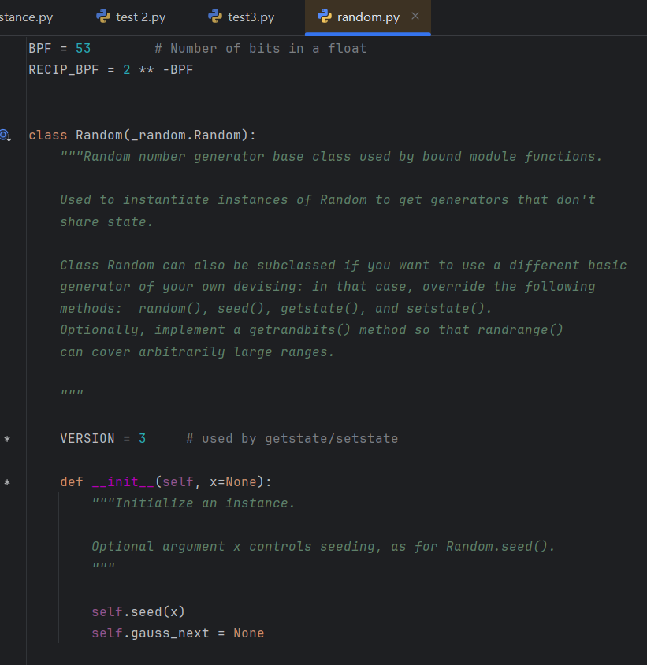
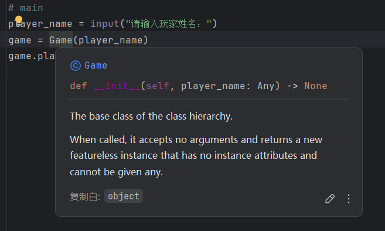
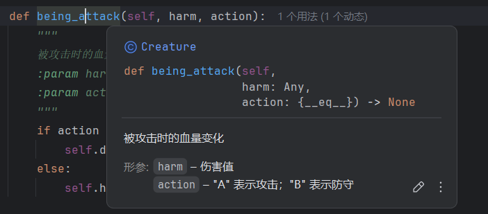
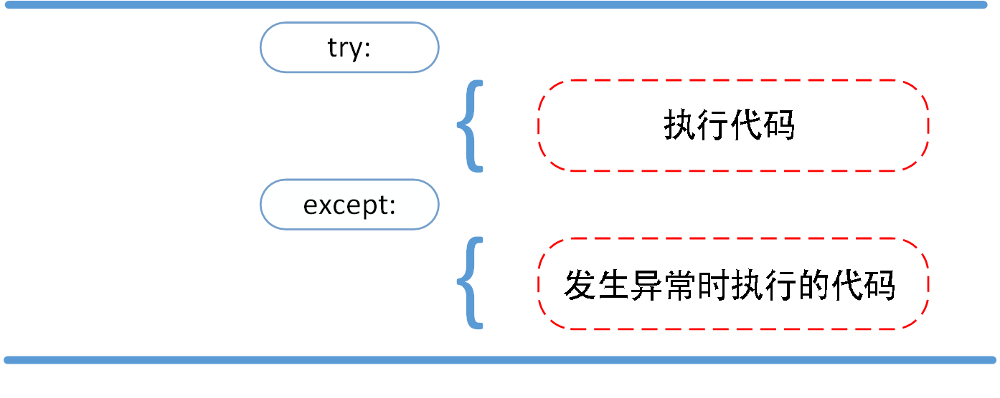
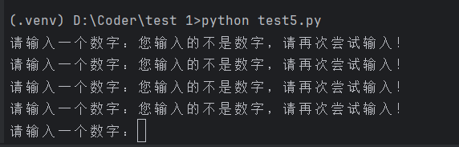

## 1. 代码注释

- 单行注释：输入井号 `#` ，井号后即为注释。
- 多行注释：选中多行代码，`Ctrl + /`  即可多行同时注释掉


## 2. 清理c盘空间

清理 Windows C 盘空间可以显著提升系统运行速度和稳定性，以下是一些**快速有效的清理方法**：

✅ 1. 使用系统自带的“磁盘清理”工具

**操作步骤：**

1. 打开“此电脑”，右键点击 C 盘 → 选择【属性】
2. 点击【磁盘清理】
3. 可勾选选项包括：

   * 下载的程序文件
   * 临时 Internet 文件
   * 回收站
   * 临时文件
4. 点击【清理系统文件】，可以释放更多空间（包括 Windows 更新文件）

📌 **建议重点清理：**

* Windows 更新清理（可能释放几 GB）
* 以前的 Windows 安装（Win10升级后通常存在）


 ✅ 2. 删除临时文件

**快速命令法：**

1. Win + R 输入 `%temp%` → 删除全部文件（Ctrl+A 然后 Delete）
2. Win + R 输入 `temp` → 也是临时文件夹，清空
3. Win + R 输入 `prefetch` → 清空里面的文件（提示需要权限，允许即可）

⚠️ 注意：有些文件可能正在被使用，跳过即可。


✅ 3. 清理回收站

别忘了回收站占用 C 盘空间！

* 桌面右键回收站 → 点击【清空回收站】

✅ 4. 删除无用的应用程序

**路径：** 设置 → 应用 → 应用和功能
卸载不常用或预装的软件（如游戏、试用版软件等）


✅ 5. 关闭休眠文件（hiberfil.sys）

休眠功能会占用 C 盘大量空间，可关闭节省数 GB。

**操作：**

1. 以管理员身份运行命令提示符（CMD）
2. 输入命令：

   ```bash
   powercfg -h off
   ```

这将自动删除 `hiberfil.sys` 文件。

✅ 6. 移动大型文件或更改默认路径

* 将【下载】【文档】【桌面】等用户文件夹右键属性 → 位置 → 更改路径到 D 盘或其他分区。
* 移动安装在 C 盘的大文件（如游戏、视频等）到其他分区。

📌 小提示：

* C 盘保持至少 **10GB** 的空余空间有助于系统稳定运行。
* 可以定期设定【磁盘清理计划】或使用任务计划自动清理。


## 3. 类及函数使用技巧

### 3.1 详情查看

编写代码过程中，可以按住 `ctrl` 键，点击对应的库名，即可打开该库的文件，以 `random` 举例：

```python
harm = random.randint(0, 50)
```

按键点击后，即可查看 `random.py` 文件，可以从中学习一些类的书写技巧及习惯，了解该库内各个函数的用法。例如：在函数下一行用三个引号添加对函数的描述，对参数的介绍等信息。



### 3.2 函数跳转

在主程序中，当鼠标移动到某一个类上时，会缩略显示该类的 `initial` 函数，按 `Ctrl` 并点击即可跳转。

 

若该类/函数存在参数的描述部分，则会同时显示对该参数的描述：



## 4. 自动调整代码格式快捷键

`Ctrl` + `Alt` + `L` 即可自动调整代码格式


## 5. Pycharm 中使用 Jupyter Notebook

1. 打开 pycharm 终端（其他终端也可），输入以下代码安装：

    ```python
    pip install jupyter notebook
    ```


## 6. try … except

在链接大模型的时候，我们需要了 `try … except` ，这一部分进行详细讲解。

### 6.1 区分语法错误和异常

#### 6.1.1 语法错误

Python 的语法错误称之为解析错，是初学者经常碰到的，如下实例：

```python
>>> while True print('Hello world')

#------ output ------
File "D:\Coder\test 1\test5.py", line 1
    while True print('Hello world')
               ^
SyntaxError: invalid syntax
```

这个例子中，`print()` 函数检查有错误，前面缺少了一个冒号 `:` 。

语法分析器指出了出错的一行，并且在最先找到错误的地方标记了一个小箭头 `^` 。

#### 6.1.2 异常

即使 Python 程序的语法是正确的，在运行时也可能发生错误。运行期间检测到的错误被称为异常。

大多数异常都不会被程序处理，都以错误信息的形式展现在这里：

```python
>>> 10 * (1/0)    # 0 不能作为除数，报异常

Traceback (most recent call last):
  File "D:\Coder\test 1\test5.py", line 1, in <module>
    10 * (1/0)
ZeroDivisionError: division by zero

>>> 4 + spam*3    # spam 未定义，触发异常

Traceback (most recent call last):
  File "D:\Coder\test 1\test5.py", line 1, in <module>
    4 + spam*3
NameError: name 'spam' is not defined

>>> 2 + '2'      # int 不能与 str 相加，触发异常

Traceback (most recent call last):
  File "D:\Coder\test 1\test5.py", line 1, in <module>
    2 + '2'
TypeError: unsupported operand type(s) for +: 'int' and 'str'
```

>  上述代码是为了演示异常情况，故意写的语法正确但是运行会报错的例子。实际开发过程中，有时会忽略某种特殊情况，当用户输入超出了我们开发时预测的情况，程序会报错。

异常以不同的类型出现，这些类型都作为输出信息的一部分显示出来：例子中的异常类型有：ZeroDivisionError， NameError， TypeError 。

> 错误类型不需要记忆，只要在报错时查看报错类型，接着用 try/except 进行匹配处理即可！

错误信息的前面部分展示了发生异常的上下文，并以调用栈的形式显示具体信息。


### 6.2 异常处理

异常捕捉可以用 try/except 语句。



以下例子中，让用户输入一个合法的整数，但是允许用户中断这个程序（使用 `ctrl + c` 或者操作系统提供的方法）。用户中断的信息会引发一个 Keyboardinterrupt 异常。

```python
while True:
    try:
        x = int(input("请输入一个数字："))
        break
    except KeyboardInterrupt:
        print("您输入的不是数字，请再次尝试输入！")
```

上述代码，右键 `打开于` - `终端` 。在终端内运行，结果如下：



我们按 `Ctrl + c`无法退出程序，只会触发 `KeyboardInterrupt` ，因此只能关闭终端解决。

`int()` 将字符串强制转换为数字型，什么时候会报错？ ——非纯数字就会触发报错！

在不使用 try/except 的时候如何避免此类报错？

#### 6.2.1 原始方法

```python
while True:
        x = input("请输入一个数字：").strip()
        if x.isdigit():
            x = int(x)
            break
        else:
            print("您输入的不是数字，请再次尝试输入！")
```

像上面这样的代码，本质上需要考察：预判+避免，也就是把有可能的错误进行预判，预判之后进行规避。

> 预判：我们预判用户输入的有可能不是纯数字；
>
> 避免：使用 if 来判断是否是纯数字的情况；
>
> 缺点：总有意想不到、百密一疏，造成报错。（总有考虑不到的情况）

#### 6.2.2 try/except 方法

except 需要匹配报错类型，如何获取呢？  —— 直接写一个代码，故意让其报错，就可以从输出的报错获得报错类型：

```python
int('1a')

ValueError: invalid literal for int() with base 10: '1a'
```

得到 `ValueError` 的错误类型后，即可用 try/except 实现：

```python
while True:
    try:
        x = int(input("请输入一个数字："))
        break
    except ValueError:
            print("您输入的不是数字，请再次尝试输入！")
```

::: tip 小贴士

try/except 进行接纳与控制；

不论什么报错，都可以匹配控制。

:::


