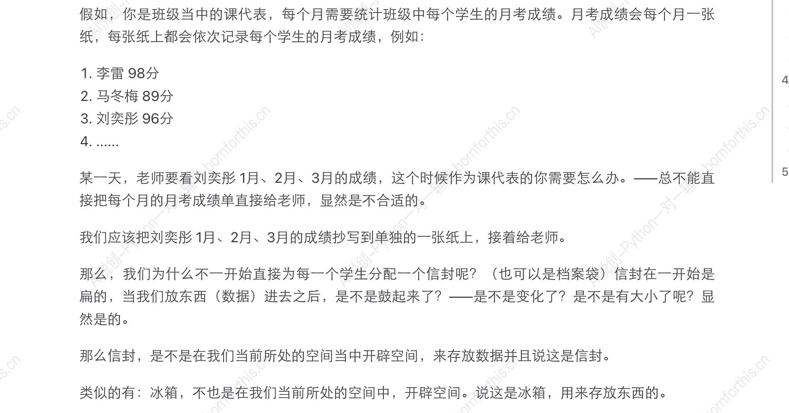

## 1. 理解变量——生活中的例子

### 1.1 从字面意思去理解

- 变：变化
- 量：大小

### 1.2 举个例子



——所以，**变量不就是在计算机的内存中开辟空间，来储存数据**。 （`ctrl + B` 加粗）

### 1.3 变量的特点

特点：变量的值会被覆盖，只会记得最后一个值。

## 2. 如何创建变量——赋值语句

1. 变量：通过 变量名 代表或引用某个值。

    - 女娲捏了泥人，泥人没有生命，女娲挥了挥柳条，赋予给泥人生命，此时，泥人可以代表女娲的后人。

         [变量：泥人，值（表达式）：女娲， `泥人 = 女娲`]

    - 全国人大中的人大代表，是由广大人民群众投票选举出来的。他们的权利不是自己获取的，所以可以说：我代表的是广大人民群众的意志。

        [变量：人大代表，值（表达式）：人民群众，`人大代表 = 人民群众`]

2. 初始化赋值语句：**变量名 = 表达式** [`=` 叫做赋值运算符]

    - 变量名：就是这个空间，我们叫它XX名字；
    - 表达式：类似数学表达；

    程序的运行逻辑：**从上到下，从右向左（此处“右”指的是 = 右边的表达式），最后才是赋值。**

    **栗子**：如果右侧是明确的结果（值），则直接赋值给左侧变量，如果右侧是个复杂的表达式，则需要先运算出最精简的结果或值，再进行赋值。

    - 代码实现：

        1. 打开 PyCharm ，新建目录 `directory`，在其中再新建 `python file`;
        2. 代码如下：

        ```python
        x = 1  #1赋值给了 X ， X 代表 1
        x = x + 10  # x + 10 等价于 1 + 10 最后得出 11， 11 再赋值给 X
        print(x)    # print 打印 输出
        # 井号用来注释、注解，解释某一行代码的功能或作用
        
        #————output————
        11
        ```

        3. 右键选择 `run` 运行代码

    - 相关代码实现：

    ```python
    #变量值的传递
    
    name1 = "hanmeimei"
    name2 = name1
    print(name2)
    
    #————output————
    hanmeimei
    ```

    ```python
    #变量值会被覆盖
    
    name1 = "lilei"
    name1 = "hanmeimei"
    print(name1)
    
    #————output————
    hanmeimei
    ```

    

## 3. 探究 print

### 3.1 同时输出多个数据

```python
a = 1
b = 2
c = 3
print(a, b, c)

#————output————
1 2 3
```

`print`  输出多个变量，默认以空格间隔。

### 3.2 sep 修改多个变量同时输出的间隔

```python
a = 1
b = 2
c = 3
print(a, b, c, sep=' 间隔 ')

#————output————
1 间隔 2 间隔 3
```

`‘ 间隔 ’`都可以修改，如：`print(a, b, c, sep=' & ')`，结果为`1 & 2 & 3` ， `print(a, b, c, sep='间隔'`，结果为`1间隔2间隔3` 。

注意：`sep`只有在输出多个变量时才有效果。

### 3.3 end的使用

单独输出一个变量时，末尾会自动换行，即 `end = '\n'` ，其中 `\n` 表示换行，引号内的字符可以修改，**空格也有意义**。

```python
a = 1
b = 2
c = 3
print(a, end="\n")
print(b, end="hhhh")
print(c, end="最后一行")  

#————output————
1
2hhhh3最后一行
```


```python
a = 1
b = 2
c = 3
print(a, end="n love\npython ")
print(b, end=" 哈哈哈哈")
print(c)


#————output————
1n love
python 2 哈哈哈哈3
```


### 3.4 end 和 sep 可以同时使用

```python
a = 1
b = 2
c = 3
print(a, b, c, sep="~", end=" love Python")

#————output————
1~2~3 love Python
```


### 3.5 输出时添加提示

```python
# 输出时可以添加提示，其实就是基于 print 同时输出多个变量的特点
a = 1
print("a 的值是: ", a)

#————output————
a 的值是:  1
```


### 3.6 多个变量同时赋予同一个值

```py
a = b = c = 1
print(a)
print(b)
print(c)

#————output————
1
1
1
```


### 3.7 同时给多个变量赋予不同的值

```python
a, b, c = 1, 2, 3
print(a, b, c)

#————output————
1 2 3
```


## 4. 练习

```python
Austin_cup = "Coke"  # 该赋值可以理解为从饮料瓶倒果汁的过程
Jaden_cup = "juice"  # 该赋值可以理解为从饮料瓶倒果汁的过程
print("Austin 杯子现在装的饮料", Austin_cup)
print("Jaden 杯子现在装的饮料", Jaden_cup)

# ---------------
# 这里编写什么代码才能使上下相同输出的 print 代码，输出的结果是交换过来的。
# ---------------

Austin_cup, Jaden_cup = Jaden_cup, Austin_cup

print("交换之后......")
print("Austin 杯子现在装的饮料", Austin_cup)
print("Jaden 杯子现在装的饮料", Jaden_cup)

# # ---目标输出结果---
# Austin 杯子现在装的饮料 Coke
# Jaden 杯子现在装的饮料 juice
# 交换之后......
# Austin 杯子现在装的饮料 juice
# Jaden 杯子现在装的饮料 Coke
```

Python 特有的 **“从上到下，从右向左，最后赋值”** 的特点：

step 1：先给 `Jaden_cup` 和 `Austin_cup`分别赋值 `juice` 和`Coke`;

step 2：将`Jaden_cup`取到的值，和 `Austin_cup`取到的值再分别赋给 `Austin_cup`和`Jaden_cup`

因此可以通过这种方式实现。


## 5. 变量命名的规则

- 大小写英文、数字和_的结合，且不能用数字开头；

    ::: code-tabs

    @tab 区分大小写

    ```Python
    n = "A"
    N = "a"
    print(n)
    
    #————output————
    A                    #输出A证明区分大小写，若不区分大小写，则应该输出a
    ```

    @tab 开头不能用数字

    ```Python
    1name = "meng"        #此处要加引号
    print(1name)
    
    #————output————
     File "D:\Coder\test 1\test 1.1.py", line 1
        1name = meng
        ^
    SyntaxError: invalid decimal literal           #变量不能以数字开头
    ```

    @tab 数字可以出现在变量名中

    ```Python
    n1a1m1e1 = "meng"   #此处要加引号
    print(n1a1m1e1)
    
    #————output————
    meng                                           #但是数字可以出现在后面的任何地方
    ```

    :::

- 系统关键词不能做变量名；

    ​	获取关键词列表： `help('keywords')`

    ```Python
    Here is a list of the Python keywords.  Enter any keyword to get more help.
    
    False               class               from                or
    None                continue            global              pass
    True                def                 if                  raise
    and                 del                 import              return
    as                  elif                in                  try
    assert              else                is                  while
    async               except              lambda              with
    await               finally             nonlocal            yield
    break               for                 not                 
    ```

    若一定要用关键词做变量名，可以更改大小写，因为 Python 区分大小写。

    ```Python
    As = 1
    sA = 2
    AS = 3
    print(As, sA, AS)
    
    #————output————
    1 2 3
    ```

- Python 中的变量名区分大小写（示例见上文）；

- 变量名不能包含 空格 ，但是可以使用下划线来分隔其中的单词；

    ```Python
    user_name = "meng"
    ```

- 不要使用 Python 的内置函数名称做变量名。

    ```Python
    print = "12345"
    print(print)
    
    #————output————
    Traceback (most recent call last):
      File "D:\Coder\test 1\test 1.1.py", line 2, in <module>
        print(print)
    TypeError: 'str' object is not callable
    ```

## 6. tips

选中代码，`crtl + /` 注释掉选中的代码


