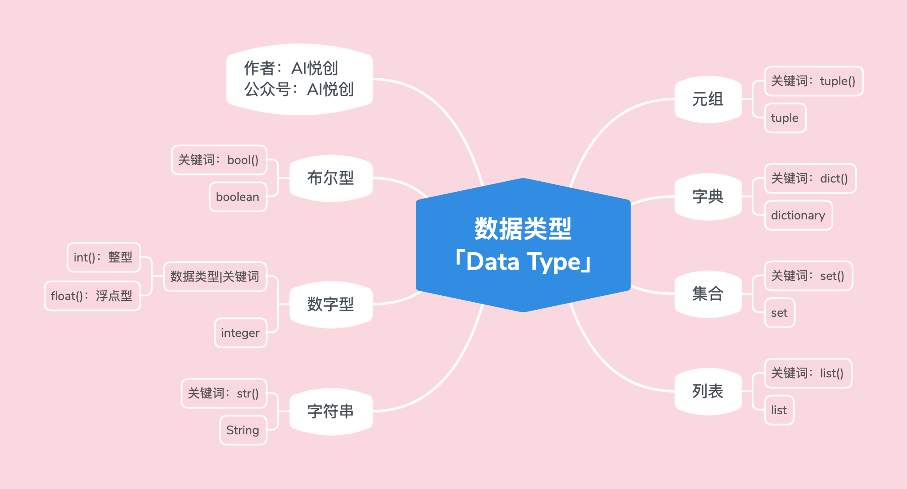
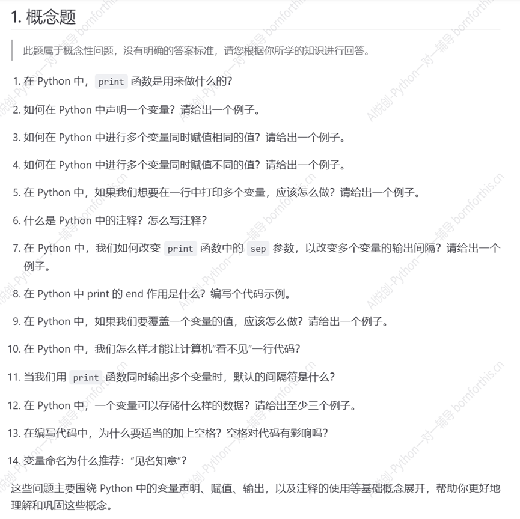
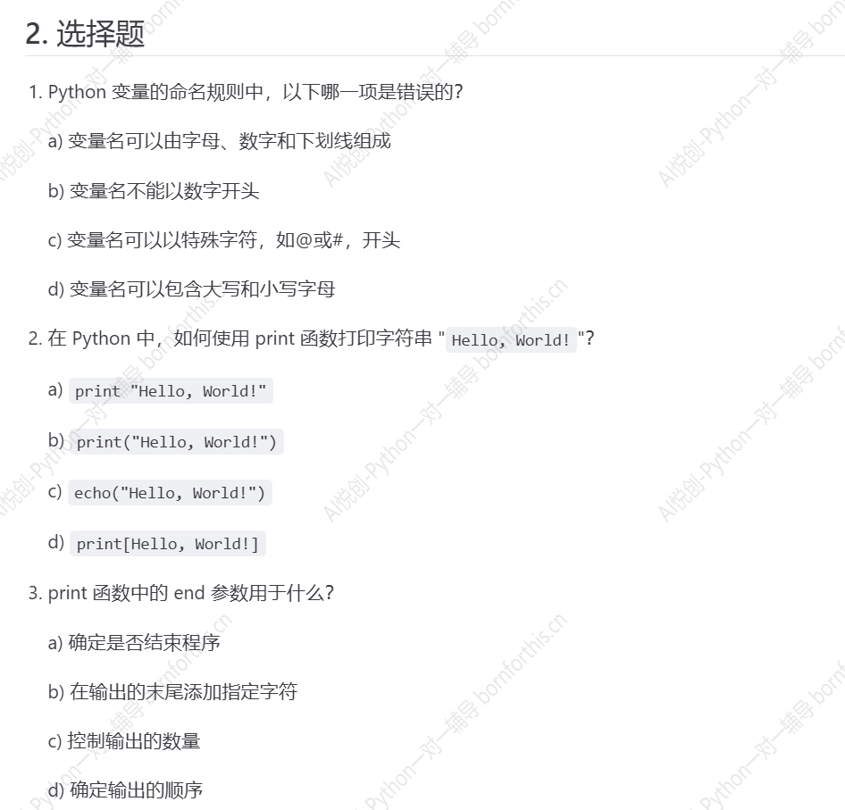
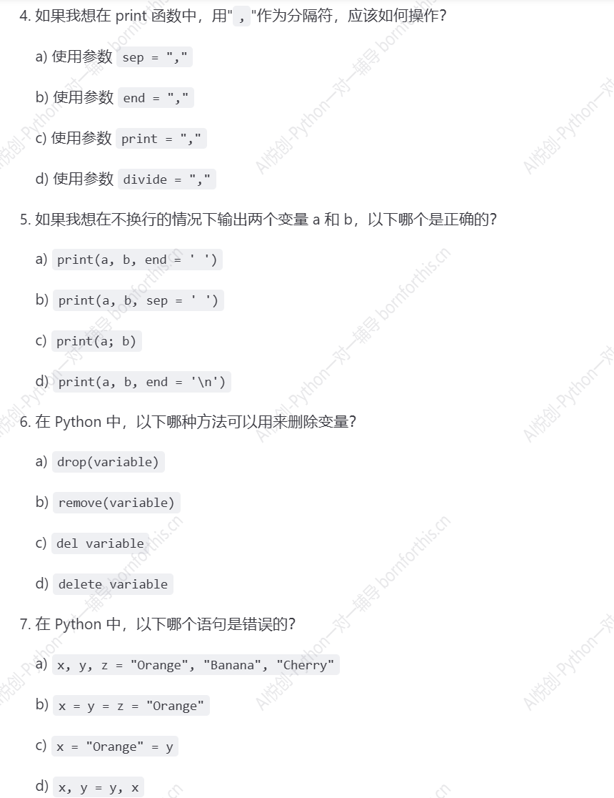
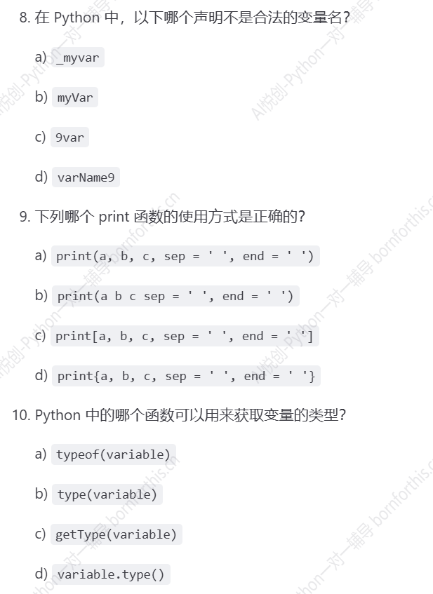
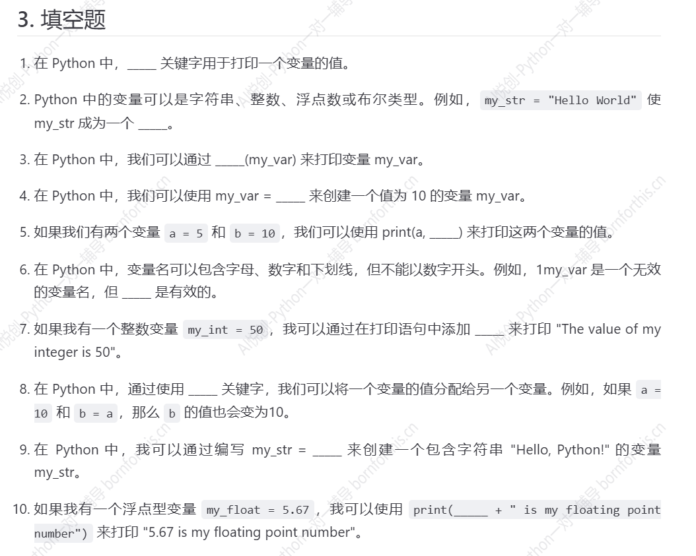
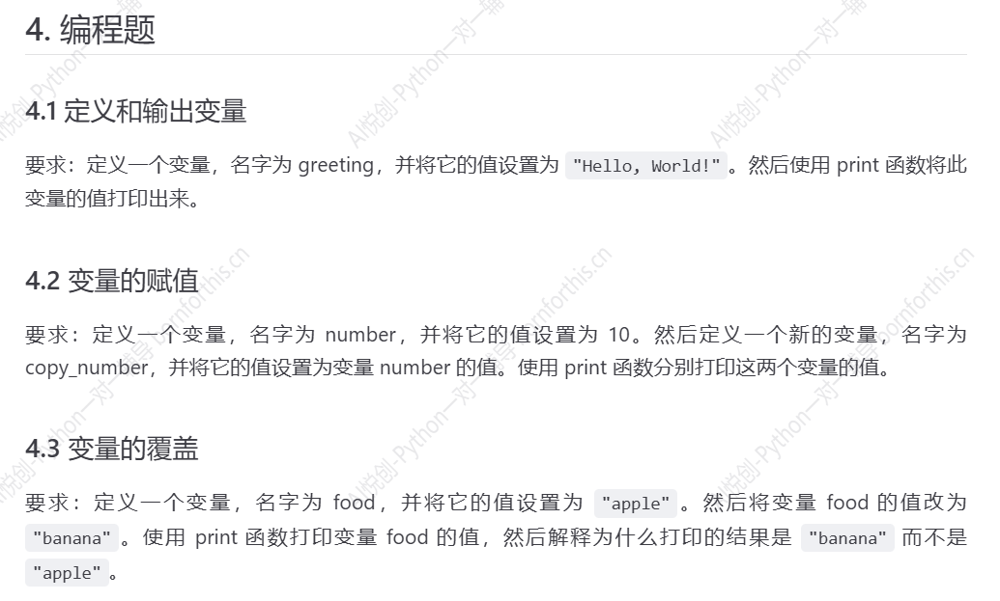
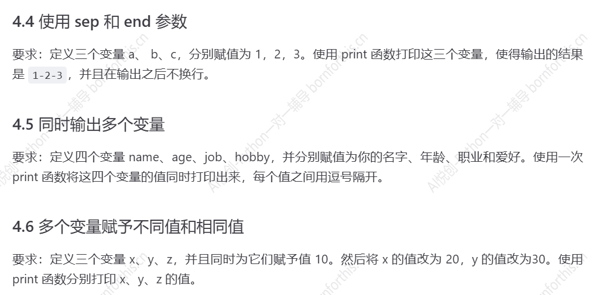

## 1.  数字型 [int, float]

::: code-tabs

@tab int

```Python
int_num = 1
t = type(int_num)
print(int_num)
print("int num type is:>>>", t)
print("直接检测数据类型，并输出：>>>", type(int_num))

#-------output-------
1
int num type is:>>> <class 'int'>
直接检测数据类型，并输出：>>> <class 'int'>
```

@tab float

```Python
float_num = 1.5
t = type(float_num)
print(float_num)
print("float num type is:>>>", t)
print("直接检测数据类型，并输出：>>>", type(float_num))

#-------output-------
1.5
float num type is:>>> <class 'float'>
直接检测数据类型，并输出：>>> <class 'float'>
```

:::

## 2. 字符串

```Python
string = "hello world"
t = type(string)
print(string)
print("string type is:>>>", t)
print("直接检测数据类型，并输出：>>>", type(string))

#-------output-------
hello world
string type is:>>> <class 'str'>
直接检测数据类型，并输出：>>> <class 'str'>
```

**字符串的性质**

1. 有序性

    - 从左到右的索引方法，下标是从 0 开始；
    - 从右到左的索引方法，下标是从 -1 开始；
    - 引号里面出现的每个字符都算一个下标，空格也算。

2. 不可变性

    不同的编程语言处理字符串的方式可能有所不同，但在大多数语言中，字符串都是不可变的，这意味着一旦创建，字符串的内容就不能改变。

    ::: important

    我们说的不可变，是指在代码运行过程中（如中间有 input ），不能对字符串修改、添加、删除之类的操作。

    :::

3. 任意字符

    - 键盘上可以输入的字符，都可以是字符串的元素；
    - 字符放到字符串中，都将成为字符串类型，即：里面的每一个元素都可以称为：子字符（子字符串）。

## 3. 列表

```Python
lst = ["Hello World", 1, 1.1, ("look", "book", 11), [12, "汉堡包"], True, False]
t = type(lst)

print(lst)
print("lst type is:>>>", t)

print("直接检测数据类型，并输出：>>>", type(lst))

#-------output-------
['Hello World', 1, 1.1, ('look', 'book', 11), [12, '汉堡包'], True, False]
lst type is:>>> <class 'list'>
直接检测数据类型，并输出：>>> <class 'list'>
```

**列表的性质**

1. 有序性

    - 从左到右的索引方法，下标是从 0 开始；

    - 从右到左的索引方法，下标是从 -1 开始；

    - 列表里的每个元素算一个；

        比如：lst = [“aiyuechuang”, 12];

        上面 lst 有两个元素，下标分别是：

        ​	`aiyuechuang` 是下标 0 （从左到右）， 也是下标 -2 （从右到左）；

        ​	`12` 是下标 1 （从左到右）， 也是下标 -1 （从右到左）；

2. 可变性：在程序运行过程中（如中间有 input ），列表可以修改、添加、删除；

3. 任意数据类型：**指的是 Python 所拥有的数据类型**。

## 4. 元组

```Python
tup = (1, 2, 3, 4, "aivc", 1.1, [1, 2, 3, 4])
t = type(tup)
print(tup)
print("tup type is: >>>", t)
print("直接检测数据类型，并输出：>>>", type(tup))

#-------output-------
(1, 2, 3, 4, 'aivc', 1.1, [1, 2, 3, 4])
tup type is: >>> <class 'tuple'>
直接检测数据类型，并输出：>>> <class 'tuple'>
```

**元组的性质**

1. 有序性

    - 从左到右的索引方法，下标是从 0 开始；

    - 从右到左的索引方法，下标是从 -1 开始；

    - 元组里的每个元素算一个；

        比如：`tup = ("aiyuechuang", 12)`;

        上面 `tup`有两个元素，下标分别是：

        ​	`aiyuechuang` 是下标 0 （从左到右）， 也是下标 -2 （从右到左）；

        ​	`12` 是下标 1 （从左到右）， 也是下标 -1 （从右到左）；

2. 不可变性

    元组被创建出来之后，就不能被改变；

    ::: important

    我们说的不可变，是指在代码运行过程中（如中间有 input ），不能对元组修改、添加、删除之类的操作。

    :::

3. 任意数据类型：**指的是 Python 所拥有的数据类型**。

    

## 5. 列表 or 元组

::: info 为什么有列表后还需要元组

:::

1. 如果储存的数据或者数量是**可变**的，比如社交平台上的一个日志功能，是统计一个用户在一周之内看了哪些用户的帖子，那么用**列表**更合适（需要一个仓库管理员）；
2. 如果储存的数据或者数量**不变**，比如一个系统/软件，用来返回一个地点的经纬度，然后直接传给用户看，那么选择**元组**更合适（不需要仓库管理员）。

## 6. 练习



1. 输出内容，字符，变量均可

2. ```python
    mint = 123         # 数字、下划线、字母组合，区分大小写，不能数字开头，不能空格
    ```

3. ```python
    mint1 = mint2 = 123  
    ```

4. ```python
    mint1, mint2 = 123, "一二三"
    ```

5. ```python
    print(mint1, mint2)
    ```

6. ```python
    # 井号加注释，Ctrl+/ 整行或选中部分注释
    ```

7. ```python
    print(mint1, mint2, sep=" is ")
    ```

8.  end 用来修改输出结尾，默认是 `\n` 换行。

    ```python
    print(mint1, mint2, end = " done here\n")
    ```

9.  覆盖一个变量的值，就重新赋值呗，或者用其他变量赋值

    ```python
    mint = 123 
    mint2 = "一二三"
    mint = 456
    mint = mint2
    ```

10. 注释掉

11.  默认间隔符是空格

12. 变量可以储存数字、字符串、列表、元组

    ```python
    a = 123
    b = "hello"
    c = [123, "hello", (1, 2, 3, "tuple"), [4.1, 5.1, 6.12, "list"]]
    d = ("world", 2, 4, 6, (1.1, 2.2, "unchangeable"), [8, 10, "try"])
    ```

13. 适当加空格，清楚，变量命名中出现空格会报错，有些情况缺少空格也会报错，空格是有意义的。

14. 变量名清楚，省去查找和再理解。




**1c  2b 3b**



**4a 5a 6c 7c**



**8c 9a 10b**



1. `print`
2. 字符串
3. `print` 
4. 10
5. b
6. `my_var1`、`m1y_var` 等
7. `“The calue of my integer is", my_int`
8. `=` 赋予
9. `“hello, Python!”`
10. `str(my_float) `




4.1

```python
greeting = "Hello, World!"
print(greeting)

#-------output-------
Hello, World!
```

4.2

```python
number = 10
copy_number = number
print(number, copy_number)

#-------output-------
10 10
```

4.3

```python
food = "apple"
food = "banana"
print(food)

#-------output-------
banana            #变量内容可以覆盖
```



4.4

```python
a, b, c = 1, 2, 3
print(a, b, c, sep = "-", end = "")

#-------output-------
1-2-3
Process finished with exit code 0
```

4.5

```python
name, age, job, hobby = "ran", "29", "student", "jazz"
print(name, age, job, hobby, sep = ", ")

#-------output-------
ran, 29, student, jazz
```

4.6

```python
x = y = z = 10
x = 20
y = 30
print("x =", x, "\n","y =", y, "\n", "z =", z)

#-------output-------
x = 20, y = 30, z = 10

# 问题问题
```


## 7. 练习总结

1. `print` 使用，将浮点型输出为字符串。

    :::code-tabs

    @tab print输出多个变量

    ```python
    my_float = 5.67
    print(my_float, "is my float")
    
    #-------output-------
    5.67 is my float    #此处为 print 输出多个变量，因此浮点型变量和字符串变量输出，中间自动用空格隔开
    ```

    @tab 将浮点型输出为字符串

    ```python
    my_float = 5.67
    print(str(my_float) + " is my floating number")    # 加号+ 将两部分拼接，因此中间不会自动用空格隔开，需要手动补充
    
    #-------output-------
    5.67 is my floating number     #此处以字符串形式输出
    ```

    :::

2. 输出格式问题

    - `print` 输出换行缩进问题

        :::code-tabs

        @tab 输出换行缩进问题

        ```python
        x, y, z = 1, 2, 3
        print("x=", x, "\n", "y=", y, "\n", "z=", z)
        
        #-------output-------
        x= 1 
         y= 2 
         z= 3
        ```

        @tab 解决方法

        ```python
        x, y, z = 1, 2, 3
        print("x=", x, "\n", "y=", y, "\n", "z=", z，sep = "")
        
        #-------output-------   出现缩进的原因在于 print 输出多个变量，间隔默认空格，那么用 sep 将空格去掉即可解决
        x=1
        y=2
        z=3
        ```

        :::

    - `print` 输出达到 “x=1, y=2, z=3” 效果

        :::code-tabs

        @tab 问题

        ```python
        x, y, z = 1, 2, 3
        print("x=", x, "y=", y, "z=", z, sep = ",")
        
        #-------output-------
        x=,1,y=,2,z=,3
        ```

        @tab 解决方法

        ```python
        x, y, z = 1, 2, 3
        print("x=" + str(x), "y=" + str(y), "z=" + str(z), sep = ",")
        
        #-------output-------   
        #原因在于不同变量间都有间隔，则将 x=1 变成一个类型的变量作为一个整体，用 + 拼接，加号左右变量类型要一致
        x=1,y=2,z=3
        ```

        

        :::

        

## 8. 字典

```python
d = {"name": "ran", "age": 29, 1: "int", 1.1: 1, "tup": (1, 2, 3)}
t = type(d)
print(d)
print("d type is: >>>", t)
print("直接检测数据类型，并输出：>>>", type(d))

#-------output-------  
{'name': 'ran', 'age': 29, 1: 'int', 1.1: 1, 'tup': (1, 2, 3)}
d type is: >>> <class 'dict'>
直接检测数据类型，并输出：>>> <class 'dict'>
```

**字典的性质**

1. 无序性 [python 3.6+ 之后有序]

    - 先以无序理解即可；

    - 字典的有序，并不是上面（字符串、列表、元组……）的那种常规有序；

    - 字典的有序是指：字典中的键值对是有序的，有序前期基本用不到；

        ```python
        d = {"name": "ran", "age": 29, 1: "int", 1.1: 1, "tup": (1, 2, 3), "name": 10000}
        print(d)
        
        #-------output-------
        {'name': 10000, 'age': 29, 1: 'int', 1.1: 1, 'tup': (1, 2, 3)}
        # name 出现在第一个位置，哪怕后面再出现同样的 key 组成的键值对 "name": 10000，也不会改变 name 的位置，只会进行值的覆盖。
        ```

        

2. 字典的组成：

    是由一系列的 key 和 value 组成；

    `d = {"key1": "value1", "key2": "value2", ......}`

3.  key

    不可变的数据类型才可以当做字典 key；

    如：字符串、数字、布尔、元组；

4. value：

    任意数据类型，python 拥有的数据类型；

5. 可变性：可以添加、修改、删除键值对。

    

## 9. 集合

```python
set1 = {1, 2, "ran", 1.1, "book", (1, 2, 3), False}
t = type(set1)
print(set1)
print("set1 type is: >>>", t)
print("直接检测数据类型， 并输出：>>>", type(set1))

#-------output-------
{False, 1, 2, 1.1, 'ran', (1, 2, 3), 'book'}
set1 type is: >>> <class 'set'>
直接检测数据类型， 并输出：>>> <class 'set'>
```

**集合的性质**

1. 无序性

    指的是集合没有下标，每次重新运行后，集合内的元素顺序都会发生改变，但会出现多次运行后集合内元素顺序不再改变，此时依旧是无序的（e.g. 骰子连续扔出 6 次 6 点）；

2. 确定性

    集合内的元素不能变动，因此集合内**可以出现元组**，但无**法出现列表**，原因在于列表具有**可变性**，列表内部的元素可以增删变动。

    :::code-tabs

    @tab 出现列表

    ```python
    set1 = {1, 2, "ran", 1.1, "book", (1, 2, 3), False, [11, 2, 3]}
    print(set1)
    
    #-------output-------
    Traceback (most recent call last):
      File "D:\Coder\test 1\test 1.1.py", line 1, in <module>
        set1 = {1, 2, "ran", 1.1, "book", (1, 2, 3), False, [11, 2, 3]}
    TypeError: unhashable type: 'list'
    ```

    @tab 出现元组

    ```python
    set1 = {1, 2, "ran", 1.1, "book", (1, 2, 3), False, (11, 2, 3)}
    print(set1)
    
    #-------output-------
    {False, 1, 2, 1.1, 'book', (1, 2, 3), 'ran', (11, 2, 3)}
    ```

    :::

3. 互异性

    指的是出现重复的元素会删除。

## 10. 布尔型

```python
condition = True       #False
print(condition)
print(type(condition))

#-------output-------
True
<class 'bool'>
```


