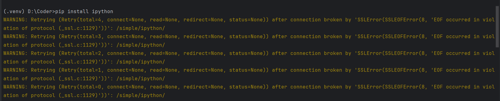
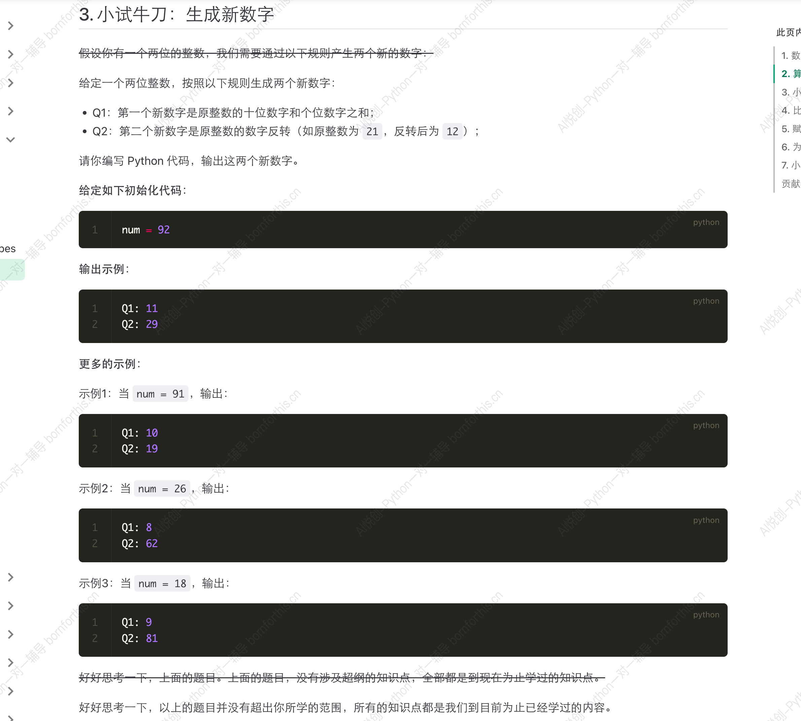

## 1. 安装 ipython

1.  pycharm 中点击左边栏下侧 terminal，输入命令 `pip install ipython` 。

2. 如果遇到无法安装，提示如下报错，则需要关闭代理（首页或设置处虚拟代理开关），安装成功后再打开。

    

3. 启动 ipython， 终端输入 ipython 即可，退出输入 exit。
4. 使用 ipython 优点：输入和输出一一对应，方便查找，不需要用 print 就可以输出结果。


## 2. 数字型的特点

四则运算

- 如果其中有一个浮点数，结果就会得到浮点数（优先级最高）；

- 除法涉及精度问题，所以最后结果类型：就是浮点数类型；

    ```python
    In [1]: 1 + 1
    Out[1]: 2
    
    In [2]: 1 + 1.0
    Out[2]: 2.0
    
    In [3]: 2 - 1
    Out[3]: 1
    
    In [4]: 2 - 1.0
    Out[4]: 1.0
    
    In [5]: 9 / 3
    Out[5]: 3.0
    
    In [6]: 2 * 3
    Out[6]: 6
    
    In [7]: 2 * 3.0
    Out[7]: 6.0
    ```

## 3. 算术运算符

::: md-demo

| 运算符 | 描述                                   | 例子        |
| ------ | -------------------------------------- | ----------- |
| +      | 加法运算符                             | 1 + 1 = 2   |
| -      | 减法运算符                             | 2 - 1 = 1   |
| *      | 乘法运算符                             | 2 * 3 = 6   |
| /      | 除法运算符                             | 9 / 3 = 3.0 |
| **     | 指数运算符                             | 2 ** 3 = 8  |
| %      | 取余运算符，计算余数                   | 9 % 2 = 1   |
| //     | 除法取整运算符，计算商并去除其小数部分 | 9 // 2 = 4  |

tips: 加行 `ctrl + enter`，加列则在表格内鼠标右键 `表格→在左侧/右侧插入` 。

:::

小试牛刀




```python
num = 92
m =  num // 10
n = num % 10
Q1 = m + n
Q2 = n * 10 + m
print ("Q1: ", Q1,"\n", "Q2: ", Q2, sep = "")

#-------output-------
Q1: 11
Q2: 29
```

## 4. 比较运算符：比较值的大小

运行结果是**布尔类型**。

| 运算符 | 描述                                           | 例子          |
| ------ | ---------------------------------------------- | ------------- |
| >      | 判断第一个运算对象是否大于第二个运算对象       | print(1 > 2)  |
| <      | 判断第一个运算对象是否小于第二个运算对象       | print(1 < 2)  |
| >=     | 判断第一个运算对象是否大于或等于第二个运算对象 | print(3 >= 3) |
| <=     | 判断第一个运算对象是否小于或等于第二个运算对象 | print(3 <= 4) |
| ==     | 判断两个运算符是否相同                         | print(2 == 2) |
| !=     | 判断两个运算符是否不相同                       | print(2 != 1) |

## 5. 赋值运算符

| 运算符 | 描述                                 | 例子     |
| ------ | ------------------------------------ | -------- |
| =      | 把右侧的运算对象赋值给左侧的运算对象 | a = 1    |
| +=     | a += b 等同于 a = a + b              | a += 10  |
| -=     | a -= b 等同于  a = a - b             | a -= 10  |
| *=     | a *= b 等同于 a = a * b              | a *= 10  |
| /=     | a /= b  等同于 a = a / b             | a /= 10  |
| **=    | a \** = b 等同于 a = a \** b         | a **= 10 |
| //=    | a //= b 等同于 a = a // b            | a //= 10 |
| %=     | a %= b  等同于 a = a % b             |          |

```python
a = 1
a += 10
a -= 10
a *= 10
a /= 10            #这一步变成浮点型
a **= 10
a //= 10           #这一步之保留整数部分，但依旧是浮点型
print(a)

#-------output-------
0.0
```

```python
x = 4.5
y = 2
print(x // y)      #涉及除法考虑浮点型

#-------output-------
2.0
```


