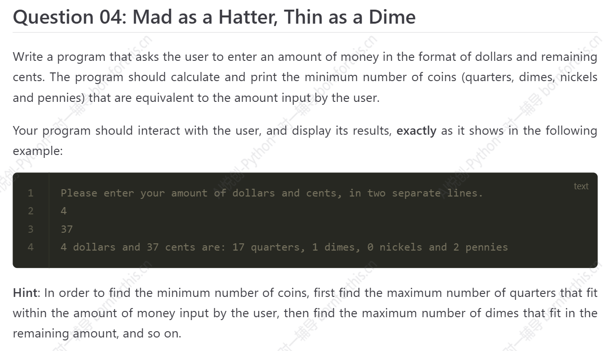

## 1. 字符串的创建

三种方法：

1. 单引号
2. 双引号
3. 三个单引号（三个双引号）

- 单引号、双引号

```python
string = 'I am born for this.'    #英文表达
#string = 'I'm born for this.'     # I am 缩写成 I‘m，与表示字符串的引号冲突，错误。
string = "I'm born for this."     # 正确表达
print(string)

#-------output-------
I'm born for this.
```

问题：无法直接输出段落。

```python
string = "我们有时候不仅仅要看选择项以内的答案，也要去思考选择项以外的答案。——AI悦创\
\
浅者见浅，深者见深——黄家宝\
\
起的最早的是理想主义者，跑的最快的是骗子，而胆子最大的是那些冒险家，害怕错过一切，疯狂往里冲的是韭菜，而真正的成功者，可能还没有入场。\
\
先实现功能，再去优化，否则一切会很乱。——AI悦创\
\
凡是你不能清晰写下来的东西，都是你还没有真正理解的东西"
print(string)

#-------output-------    在每行末尾增加反斜杠，虽然能解决单/双引号无法输出段落的问题，但输出的内容没有格式。
我们有时候不仅仅要看选择项以内的答案，也要去思考选择项以外的答案。——AI悦创浅者见浅，深者见深——黄家宝起的最早的是理想主义者，跑的最快的是骗子，而胆子最大的是那些冒险家，害怕错过一切，疯狂往里冲的是韭菜，而真正的成功者，可能还没有入场。先实现功能，再去优化，否则一切会很乱。——AI悦创凡是你不能清晰写下来的东西，都是你还没有真正理解的东西
```

- 三个单引号（三个双引号）

    特点：段落**原样输出**。

    ```python
    string = """我们有时候不仅仅要看选择项以内的答案，也要去思考选择项以外的答案。——AI悦创
    
    浅者见浅，深者见深——黄家宝
    
    起的最早的是理想主义者，跑的最快的是骗子，而胆子最大的是那些冒险家，害怕错过一切，疯狂往里冲的是韭菜，而真正的成功者，可能还没有入场。
    
    先实现功能，再去优化，否则一切会很乱。——AI悦创
    
    凡是你不能清晰写下来的东西，都是你还没有真正理解的东西"""
    print(string)
    
    #-------output-------
    我们有时候不仅仅要看选择项以内的答案，也要去思考选择项以外的答案。——AI悦创
    
    浅者见浅，深者见深——黄家宝
    
    起的最早的是理想主义者，跑的最快的是骗子，而胆子最大的是那些冒险家，害怕错过一切，疯狂往里冲的是韭菜，而真正的成功者，可能还没有入场。
    
    先实现功能，再去优化，否则一切会很乱。——AI悦创
    
    凡是你不能清晰写下来的东西，都是你还没有真正理解的东西
    ```

## 2. 字符串的长度 `len()`

```python
paragraph = "Hello, Ran!"
print(len(paragraph))

#-------output-------
11
```

字符串是从1开始数，下标从左到右是从0开始，==注意区分==。因此，字符串长度 - 1 = 下标最大值。

## 3. 字符串的获取

1. 获取单个字符

    ```python
    string = "bornforthis"
    select = string[10]                 # 方法一： 1. 注意是方括号；2. 方括号内为字符串下标；3. 从左向右的下标
    select = string[-1]                 # 方法二： 从右向左的下标
    select = string[len(string)-1]      # 方法三： 取最后一位，可以参考长度和下标的转换
    print(select)
    
    #-------output-------
    s
    ```

2. 获取一串连续字符

    - 方法一：从左向右取下标

        ```python
        string = "bornforthis"
        select = string[0: 4]      #中括号内第一位数字表示字符串开始位置的下标，第二位数字表示结束位置的下标+1，用数学解释即 [0, 4)
        print(select)
        
        #-------output-------
        born
        ```

    - 方法二：从右向左取下标（右数第一位下标是 ``-1` 如何实现 `end + 1`？）

        ::: code-tabs

        @tab 错误取负数下标

        ```python
        string2 = "bornforthis"
        select2 = string2[-4:-1]
        print(select2)
        
        #-------output-------
        thi
        ```

        @tab 正确取负数下标

        ```python
        string2 = "bornforthis"
        select2 = string2[-4:]      #-4 是负数下标，end 处空白默认从左向右取到字符串的最后，就不需要考虑 end + 1 没有对应下标的问题，end 部分未指定，则默认从左向右取
        print(select2)
        
        #-------output-------
        this
        ```

        :::

3. 获取等间隔的字符

    ```python
    string = "0123456789"
    select = string[1: len(string): 2]      #语法：select = string[start: end: step] step指步长，即走几步 or 两相邻字符下标相减
    print(select)
    
    string2 = "bornforthis"
    select2 = string2[0: len(string2): 3]
    print(select2)
    
    select3 = string2[1: len(string2): 3]
    print(select3)
    
    #-------output-------
    13579
    bnri
    ofts
    ```

    若要取的字符串开头/结尾是整段的字符串的开头/结尾，则可以省略 start 和 end，不是整段字符串开头/结尾则不能省略下标。

    ```python
    string = "0123456789"
    select = string[1:: 2]
    print(select)
    
    string2 = "bornforthis"
    select2 = string2[:: 3]
    print(select2)
    select3 = string2[1:: 3]
    print(select3)
    
    #-------output-------
    13579
    bnri
    ofts
    ```

    负数下标的提取（下标从右向左）

    ```python
    string = "0123456789"
    select = string[-1: -11: -1]    #可简写成 select = string[:: -1] 步长 -1 表示从右向左取（-），每次走1步，只有步长方向和start-end方向一致时才能输出结果
    print(select)
    
    #-------output-------
    9876543210
    ```

    思考流程：

    

## 4. 字符串的内置方法

### 4.1 .upper()

将字符串内容全部变为大写。

```python
string = "bornforthis"
upper_string = string.upper()
print(upper_string)

#-------output-------
BORNFORTHIS
```

### 4.2 .lower()

将字符串内容全部变为小写。

```python
string = "BORNFORTHIS"
lower_string = string.lower()
print(lower_string)

#-------output-------
bornforthis
```

### 4.3 .capitalize()

将字符串首字母大写。（只对第一个字母大写，其他后面的字母变为小写）

```python
string = "bornForthis to Aivc"
capitalize_string = string.capitalize()
print(capitalize_string)

#-------output-------
Bornforthis to aivc
```

### 4.4 .title()

将字符串中每个单词的==首字母大写==，其余字符都转换成小写。

::: code-tabs

@tab 1. 每个单词首字母大写

```python
string = "bornforthis to aivc"
title_string = string.title()
print(title_string)

#-------output-------
Bornforthis To Aivc
```

@tab 2. 各种分隔符依旧首字母大写

```python
string = "bornforthis-to-aivc"
title_string = string.title()
print(title_string)

#-------output-------
Bornforthis-To-Aivc
```

@tab 3. 大小写字母混合，除首字母外其余均小写

```python
string = "boRnforThis to aIvc"
title_string = string.title()
print(title_string)

#-------output-------
Bornforthis To Aivc
```


:::

### 4.5 .startswith()

检测字符串是否以特定字符或单词开头，返回布尔值（若是该字符开头，则返回 True ，若不是则返回 False 。

::: code-tabs

@tab 1. 是否 b 开头

```python
string = "bornforthis"
startswith_string= string.startswith("b")
print(startswith_string)

#-------output-------
True
```

@tab 2. 是否 bo 开头

```python
string = "bornforthis"
startswith_string= string.startswith("bo")
print(startswith_string)

#-------output-------
True
```

@tab 3. 是否 p 开头

```python
string = "bornforthis"
startswith_string= string.startswith("p")
print(startswith_string)

#-------output-------
False
```

@tab 4. 是否 b1 开头

```python
string = "bornforthis"
startswith_string= string.startswith("b1")
print(startswith_string)

#-------output-------
False
```


:::

### 4.6 .endswith()

检测字符串是否以特定的字符或单词结尾，返回布尔值。

::: code-tabs

@tab 1. 是否 s 结尾

```python
string = "bornforthis"
endswith_string= string.endswith("s")
print(endswith_string)

#-------output-------
True
```

@tab 2. 是否 is 结尾

```python
string = "bornforthis"
endswith_string= string.endswith("is")
print(endswith_string)

#-------output-------
True
```

@tab 3. 是否 i 结尾

```python
string = "bornforthis"
endswith_string= string.endswith("i")
print(endswith_string)

#-------output-------
False
```

@tab 4. 是否 s6 结尾

```python
string = "bornforthis"
endswith_string= string.endswith("s6")
print(endswith_string)

#-------output-------
False
```


:::

### 4.7 .count()

统计特定字符或单词在目标字符串中存在的次数，若在目标字符串中不存在，则输出 0。

::: code-tabs

@tab 1. 字母 r 出现的次数

```python
string = "bornforthis"
count_string= string.count("r")
print(count_string)

#-------output-------
2
```

@tab 2. 字母 or 出现的次数

```python
string = "bornforthis"
count_string= string.count("or")
print(count_string)

#-------output-------
2
```

@tab 3. 字母 a 出现的次数（字符串中无）

```python
string = "bornforthis"
count_string= string.count("a")
print(count_string)

#-------output-------
0
```

@tab 4. 字符串 ap 出现的次数

```python
string = "bornforthis"
count_string= string.count("ap")
print(count_string)

#-------output-------
0
```


:::

### 4.8 .find()

寻找目标字符或单词在特定字符串中，第一次出现的下标。也就是说，有重复，也之返回==第一次出现==的下标；

若查找单词，则返回==目标单词第一个字符==的下标；

若查询的内容不存在，则返回 `-1`  。

::: code-tabs

@tab 1. 字符 o 第一次出现的位置

```python
string = "bornforthis"
find_string= string.find("o")
print(find_string)

#-------output-------
1
```

@tab 2. 字符 a 第一次出现的位置

```python
string = "bornforthis"
find_string= string.find("a")
print(find_string)

#-------output-------
-1
```

@tab 3. 子字符串 for 第一次出现的位置

```python
string = "bornforthis"
find_string= string.find("for")
print(find_string)

#-------output-------
4
```

@tab 4. 子字符串 aivc 第一次出现的位置

```python
string = "bornforthis"
find_string= string.find("aivc")
print(find_string)

#-------output-------
-1
```


:::

### 4.9 .index()

寻找目标字符或单词在特定字符串中，第一次出现的下标。如果是查找单词，那么 `index()` 返回==目标单词的第一个字符==下标。

如果查询的字符或单词==不存在==，则==报错==。

::: info index()  vs.  find()

`index()` 在找不到指定字符/字符串时会报错，提供文件信息和位置，便于定位被搜索的字符串的位置，那么在文件或代码较多的情况下，使用 `index()` 可以帮助精准定位。但报错会引发程序运行停止，若不希望程序中止，则需要确保检索的字符/字符串一定存在于被检索的字符串中。


`find()` 的可控性更强，搜索不到时，会返回值 `-1` ，但是程序不会停止，在发布或面向用户场景下更为合适。

:::


::: code-tabs

@tab 1. 查找字符 o 第一次出现的位置

```python
string = "bornforthis"
index_result = string.index("o")
print(index_result)

#-------output-------
1
```

@tab 2. 查找字符 a 第一次出现的位置

```python
string = "bornforthis"
index_result = string.index("a")
print(index_result)

#-------output-------
Traceback (most recent call last):
  File "D:\Coder\test 1\test 1.1.py", line 2, in <module>
    index_result = string.index("a")
ValueError: substring not found
```

:::


::: code-tabs

@tab 3. 子字符串 for 第一次出现的位置

```python
string = "bornforthis"
index_result = string.index("for")
print(index_result)

#-------output-------
4
```

@tab  4. 子字符串 aivc 第一次出现的位置

```python
string = "bornforthis"
index_result = string.index("aivc")
print(index_result)

#-------output-------
Traceback (most recent call last):
  File "D:\Coder\test 1\test 1.1.py", line 2, in <module>
    index_result = string.index("aivc")
ValueError: substring not found
```


:::


:::  note 使用场景

```python
# 通过符号 . 的下标提取文件名和后缀

string = "Experiment-record.xlsx"
index_result = string.index('.')
filename = string[:index_result]
suffix = string[index_result+1:]
print(filename)
print(suffix)

#-------output-------
Experiment-record
xlsx
```

:::

::: note 使用场景练习

```python
# 根据要提取的内容，检索左侧和右侧内容下标，确定提取的 start 和 end

line = "ID=1234;NAME=Tom;AGE=25"
name_start = line.index('NAME=')
name_end = line.index(';AGE')
name = line[name_start+5:name_end]

print(name_start)
print(name_end)
print(name)

#-------output-------
8
16
Tom
```


:::

### 4.10 .isdigit()

判断字符串是不是纯数字字符串，字符串中但凡有个字符是非数字，则返回 False （若输入的是负数，依旧带负号 `-` ，因此会判断为 False ）。


::: code-tabs

@tab 判断是否纯数字

```python
string = "12345678"
isdigit_result = string.isdigit()
print(isdigit_result)

#-------output-------
True
```

@tab 若数字中出现空格

```python
string = "1234 5678"
isdigit_result = string.isdigit()
print(isdigit_result)

#-------output-------
False
```


:::


### 4.11 .isalpha()

判断字符串是不是纯字母字符串，字符串中但凡有一个非字母的，则返回 False 。

::: code-tabs

@tab 判断是否全为字母

```python
string = "Impeppapig"
isalpha_result = string.isalpha()
print(isalpha_result)

#-------output-------
True
```

@tab 出现空格

```python
string = "Im peppa pig"
isalpha_result = string.isalpha()
print(isalpha_result)

#-------output-------
False
```


:::


### 4.12 .isalnum()

判断字符串是否纯数字、纯字母、纯数字字母字符串，字符串中如果包含任何非数字或字母字符，则返回 False 。

::: code-tabs

@tab 判断是否全为数字字母

```python
code = "peppapig1"
valid_code = code.isalnum()
print(valid_code)

#-------output-------
True
```

@tab 出现空格

```python
code = "peppa pig1"
valid_code = code.isalnum()
print(valid_code)

#-------output-------
False
```


:::

### 4.13 .isupper()

判断字符串是否全大写字母组成。

::: code-tabs

@tab 1. 判断是否全大写字母

```python
name = "PEPPERPIG"
isupper_name = name.isupper()
print(isupper_name)

#-------output-------
True
```

@tab 2. 出现空格、其他符号

```python
name = "PEPPER PIG1-"
isupper_name = name.isupper()
print(isupper_name)

#-------output-------
True
```

@tab 3. 混合大小写

```python
name = "PEPPERpig"
isupper_name = name.isupper()
print(isupper_name)

#-------output-------
False
```

@tab 4. 全小写字母

```python
name = "pepperpig"
isupper_name = name.isupper()
print(isupper_name)

#-------output-------
False
```


:::

### 4.14 .islower()

判断字符串是否全小写字母组成。

::: code-tabs

@tab 1. 是否全小写

```python
name = "pepper pig1-=、"
islower_name = name.islower()
print(islower_name)

#-------output-------
True
```

@tab 2. 大小写混合

```python
name = "PEPPERpig"
islower_name = name.islower()
print(islower_name)

#-------output-------
False
```

@tab 3. 全部大写

```python
name = "PEPPERPIG"
islower_name = name.islower()
print(islower_name)

#-------output-------
False
```


:::

### 4.15 .isspace()

判断字符串是否全部由空格组成，注意区分==空格==字符串和==空==字符串。

::: code-tabs

@tab 空格字符串

```python
input1 = "   "
isspace_input1 = input1.isspace()
print(isspace_input1)

#-------output-------
True
```

@tab 空 字符串

```python
input1 = ""
isspace_input1 = input1.isspace()
print(isspace_input1)

#-------output-------
False
```

@tab 非空格字符串

```python
input1 = "123asd-=["
isspace_input1 = input1.isspace()
print(isspace_input1)

#-------output-------
False
```


:::

### 4.16 .strip()

- 字符串前后需要清除的内容相同

::: code-tabs

@tab 1. 清除字符串前后（两侧）空格

```python
string = "     I'm pepper pig.     "
strip_string = string.strip()
print("Original string:", string)
print("String after stripping:", strip_string)

#-------output-------
Original string:      I'm pepper pig.     
String after stripping: I'm pepper pig.
```

@tab 2. 指定两侧需要清除的字符串（需连续）

```python
string = "----I'm pepper pig.----"
strip_string = string.strip("-")
print("Original string:", string)
print("String after stripping:", strip_string)

#-------output-------
Original string: ----I'm pepper pig.----
String after stripping: I'm pepper pig.
```


:::


- 需要清除的内容不同

::: code-tabs

@tabs 1. 清除两侧指定字符串，且指定的字符串中间间隔其他字符

```python
string = "---  -I'm pepper pig.--  ?--"
strip_string = string.strip("-")
print("Original string:", string)
print("String after stripping:", strip_string)

#-------output-------
Original string: ---  -I'm pepper pig.--  ?--
String after stripping:   -I'm pepper pig.--  ?
```

@tab 2. 解决方案

```python
string = "---  -I'm pepper pig.--  ?--"
strip_string = string.strip(" -?")      #把要去掉的都扔在里面，不分先后顺序
print("Original string:", string)
print("String after stripping:", strip_string)

#-------output-------
Original string: ---  -I'm pepper pig.--  ?--
String after stripping: I'm pepper pig.
```


:::


### 4.17 .lstrip()

去掉左侧，()内包含的所有字符的连续字符串。

::: code-tabs

@tab 1. 去掉左侧空格

```python
string = "    I'm pepper pig.    "
lstrip_string = string.lstrip()
print("Original string:", string)
print("String after stripping:", lstrip_string)

#-------output-------
Original string:     I'm pepper pig.    
String after stripping: I'm pepper pig.    
```

@tab 2. 去掉左侧字符

```python
string = "-----I'm pepper pig.-----"
lstrip_string = string.lstrip("-")
print("Original string:", string)
print("String after stripping:", lstrip_string)

#-------output-------
Original string: -----I'm pepper pig.-----
String after stripping: I'm pepper pig.-----
```

@tab 去掉左侧多种字符

```python
string = "--!--?-I'm pepper pig.-!---?-"
lstrip_string = string.lstrip("?-!")
print("Original string:", string)
print("String after stripping:", lstrip_string)

#-------output-------
Original string: --!--?-I'm pepper pig.-!---?-
String after stripping: I'm pepper pig.-!---?-
```


:::

### 4.18 .rstrip()

去掉右侧，()内包含的所有字符的连续字符串。

使用方法同 `lstrip()`


### 4.19 .replace()

`.replace(old, new count)` 括号内第一个位置传入需要替换的 ”旧字符“ ，第二个位置传入要替换的 ”新字符“ ，默认替换全部，count 控制替换次数。

::: code-tabs

@tab 全部替换

```python
string = "I'm pepper pig."
replace_result = string.replace(" ", "!")
print("原本的字符串:", string)
print("替换后的字符串:", replace_result)

#-------output-------
原本的字符串: I'm pepper pig.
替换后的字符串: I'm!pepper!pig.
```

@tab count 控制替换次数

```python
string ="ai-peppapig-ai"
replace_result = string.replace ("ai", "love", 1)
print("原本的字符串:", string)
print("替换后的字符串:", replace_result)

#-------output-------
原本的字符串: ai-peppapig-ai
替换后的字符串: love-peppapig-ai
```


:::


### 4.20 .split()

`.split(sep, maxsplit)` 以特定字符进行分割，==默认空格分割==。

若传入参数 `sep` ，则以参数进行分割。

返回的为分割后的列表。

`maxsplit` 用于控制分割次数。

::: code-tabs

@tab 1. 默认空格分割

```python
string ="I'm peppa pig."
split_result = string.split()
print("原本的字符串:", string)
print("替换后的字符串:", split_result)

#-------output-------
原本的字符串: I'm peppa pig.
替换后的字符串: ["I'm", 'peppa', 'pig.']
```

@tab 2. 指定字符分割

```python
string ="I'm-peppa-pig."
split_result = string.split('-')
print("原本的字符串:", string)
print("替换后的字符串:", split_result)

#-------output-------
原本的字符串: I'm-peppa-pig.
替换后的字符串: ["I'm", 'peppa', 'pig.']
```

@tab 3. 控制次数分割

```python
string ="I'm-peppa-pig."
split_result = string.split( "-", 1)
print("原本的字符串:", string)
print("替换后的字符串:", split_result)

#-------output-------
原本的字符串: I'm-peppa-pig.
替换后的字符串: ["I'm", 'peppa-pig.']
```

@tab 4. 返回空字符串

```python
string ="I'm--------peppa--------pig."
split_result = string.split("-")
print("原本的字符串:", string)
print("替换后的字符串:", split_result)

#-------output-------
原本的字符串: I'm--------peppa--------pig.
替换后的字符串: ["I'm", '', '', '', '', '', '', '', 'peppa', '', '', '', '', '', '', '', 'pig.']
```


:::

注意：第4种情况，遇到连续的分割字符时，若指定分割字符，则会返回空字符串，因此需要注意，因为默认是空格分割，因此不需要空字符串时直接默认即可。

具体使用中遇到的情况参见： https://pythiaroot.com/programming/python/08-set.html#_16-%E5%B0%8F%E8%AF%95%E7%89%9B%E5%88%80

### 4.21 .rsplit()

`.rsplit(sep, maxsplit)` 从字符串右边开始分割。

可以传入参数 `sep` 来指定分隔符。

返回为分割后的列表。

`maxsplit` 用于控制分割次数，默认值为 -1，表示不限制分割次数。

```python
string ="I'm-peppa-pig."
rsplit_result = string.rsplit("-",1)
print("原本的字符串:", string)
print("替换后的字符串:", rsplit_result)

#-------output-------
原本的字符串: I'm-peppa-pig.
替换后的字符串: ["I'm-peppa", 'pig.']
```


### 4.22 .join()

`.join(iterable)` 将可迭代（指可以继续拆分）对象（如列表、元组等）中的字符串元素连接成一个新的字符串，可以指定连接符。


::: code-tabs

@tab 拼接字符串

```python
string ="peppapig"
join_result = '-'.join(string)      #注意语法与前文不同，join括号里是字符串变量，前面为连接符
print("原本的字符串:", string)
print("替换后的字符串:", join_result)

#-------output-------
原本的字符串: peppapig
拼接后的字符串: p-e-p-p-a-p-i-g
```

@tab 列表中元素拼接

```python
string_list = ["I", "am", "peppa", "pig"]
join_result = "-".join(string_list)
print("原本的列表:", string_list)
print("拼接后的列表:", join_result)

#-------output-------
原本的列表: ['I', 'am', 'peppa', 'pig']
拼接后的列表: I-am-peppa-pig
```


:::

### 4.23 Quiz

统计下面字符串中的字数，不包含标点符号、空格、换行，字符串内容如下：

亲爱的黄艳医生：

新年好！时光飞逝，婉棠已经满满长大，我们永远感激您在龙年时给予我们的那份守护和祝福。是您的细心和专业，让我们的家庭迎来了最珍贵的礼物。

蛇年的钟声已敲响，愿新年的每一天都像您的微笑一样温暖，每个夜晚都如您的双手一样安心。感谢您让我们的家充满了欢笑与爱。祝您和家人龙腾虎跃、岁岁平安、幸福安康！

此致
敬祝新春快乐
婉棠一家敬上


答案：

```python
#[!code focus:13]
#[!code word:黄艳医生]
para = """
亲爱的黄艳医生：

新年好！时光飞逝，婉棠已经满满长大，我们永远感激您在龙年时给予我们的那份守护和祝福。是您的细心和专业，让我们的家庭迎来了最珍贵的礼物。

蛇年的钟声已敲响，愿新年的每一天都像您的微笑一样温暖，每个夜晚都如您的双手一样安心。感谢您让我们的家充满了欢笑与爱。祝您和家人龙腾虎跃、岁岁平安、幸福安康！

此致
敬祝新春快乐
婉棠一家敬上

"""
replace_para1 = para.replace("：", "")
replace_para2 = replace_para1.replace("！", "")
replace_para3 = replace_para2.replace("，", "")
replace_para4 = replace_para3.replace("。", "")
replace_para5 = replace_para4.replace("、", "")
replace_para6 = replace_para5.replace("\n", "")
print(len(replace_para6))

#-------output-------
153
```


## 4.24 字符串格式化（按照一定的格式输出）

格式化：按照一定的格式输出。

1. 解决重复创建问题

```python
string = "Hello, peppa pig, I come from China."
print(string)

string1 = "Hello, "
name = "peppa pig"
string2 = ", I come from "
region = "China"
string3 = "."
welcome_sentence = string1 + name + string2 + region + string3
print(welcome_sentence)

#-------output-------
Hello, peppa pig, I come from China.
Hello, peppa pig, I come from China.
```

但采用上述方法存在**”不同数据类型无法相加“**的问题，会报错。

::: code-tabs

@tab 不同数据类型无法相加

```python
string1 = "Hello, "
name = "peppa pig"
string2 = ", I come from "
region = "China"
string3 = "."
age = 18
welcome_sentence = string1 + name + string2 + region + string3 + age
print(welcome_sentence)
```

@tab 数据类型转换解决

```python
string1 = "Hello, "
name = "peppa pig"
string2 = ", I come from "
region = "China"
string3 = "."
age = 18
welcome_sentence = string1 + name + string2 + region + string3 + str(age)
print(welcome_sentence)

#-------output-------
Hello, peppa pig, I come from China.18
```


:::

2. 更好的解决办法：字符串格式化，有三种方法，如下。

    

### 4.24.1 .format()

**方法一：** 语法：`string = "Hi {}， Welcome to China.".format("peppa pig")` 

::: code-tabs

@tab 1. 直接使用

```python
#直接使用
string = "Hi {}， Welcome to China.".format("peppa pig")
print(string)


#借助变量，定好模板
template_string = "Hi {}， Welcome to China."
formatted_string = template_string.format("peppa pig")
print(formatted_string)

#-------output-------
Hi peppa pig， Welcome to China.
Hi peppa pig， Welcome to China.
```

@tab 2. 填两个值，多个值类似

```python
string = "Hi {}， Welcome to {}.".format("peppa pig", "China")
print(string)

template_string = "Hi {}， Welcome to {}."
formatted_string = template_string.format("peppa pig", "China")
print(formatted_string)
```

@tab 3.  填多个值容易混淆，花括号内写上输入的下标

```python
string = "Hi {1}， Welcome to {0}.".format("China", "peppa pig")   # 花括号里为输入的下标
print(string)

template_string = "Hi {1}， Welcome to {0}."
formatted_string = template_string.format("China", "peppa pig")
print(formatted_string)

#-------output-------
Hi peppa pig， Welcome to China.
Hi peppa pig， Welcome to China.
```

@tab 4. 花括号内填入变量名更直观

```python
string = "Hi {name}， Welcome to {region}.".format(region = "China", name = "peppa pig")   # 花括号里为输入的下标
print(string)

template_string = "Hi {name}， Welcome to {region}."
formatted_string = template_string.format(region = "China", name = "peppa pig")
print(formatted_string)

#-------output-------
Hi peppa pig， Welcome to China.
Hi peppa pig， Welcome to China.
```

@tab 4. 不同类型的数据不会报错

```python
string = "Money is {}.".format(300)   #可以输入多种数据类型，如列表、元组、字典等。
# string = "This is {}. Money is {}.".format("apple", 300)
# string = "This is {}. Money is {}.".format("apple", [1, 2, 3])
# string = "This is {}. Money is {}.".format("apple", (1, 2, 3))
# string = "This is {}. Money is {}.".format("apple", {"name": "ran", "age": 29, 1: "int"})
# string = "This is {}. Money is {}.".format("apple", True)
print(string)

#-------output-------
Money is 300.
# This is apple. Money is 300.
# This is apple. Money is [1, 2, 3].
# This is apple. Money is (1, 2, 3).
# This is apple. Money is {"name": "ran", "age": 29, 1: "int"}.
# This is apple. Money is True.
```

@tab 5. 输入数字型保留几位小数

```python
string = "This is {}. Money is {number:.3f}.".format("apple", number = 300)   # :.3f 表示保留3位小数
print(string)

#-------output-------
This is apple. Money is 300.000.
```


:::


### 4.24.2 f-string

Python 3.6+ 及以上版本引入了 `f-string` ，可以直接将变量嵌入到字符串中，更加简洁。

通过直接在字符串中嵌入变量来生成格式化字符串。

::: code-tabs

@tab 动态插入变量

```python
name = "peppapig"
region = "China"
string = f"Hi {name}, welcome to {region}!"
print(string)

#-------output-------
Hi peppapig, welcome to China!
```

@tab格式化数值并保留指定小数位

```python
money = 300
string = f"Money is {money:.3f}"      #保留3位小数
print(string)

#-------output-------
Money is 300.000
```


:::


### 4.24.3 % 格式化

**方法三：**

在 Python 中，`%` 字符串格式化是一种较老的字符串格式化方式，它虽然已经被更强大和灵活的 `.format()` 方法和 `f-string` 所取代，但在某些场景中仍然会被使用。特别是在一些特殊代码指令中使用的较为频繁，并且处理模板语言、日志格式、旧代码时，`%` 仍然是一个有效选择。


::: code-tabs

@tab 1. 输入单个数据

```python
string = "Money is %d."
new_string = string % 13     # 格式化填写后赋值给变量 new_string
print(new_string)


print(string % 19)           # 直接格式化后输出


string = "Money is %d." %300
print(string)

#-------output-------
Money is 13.
Money is 19.
Money is 300.
```

@tab 2. 输入多个数据

```python
string = "Money is %d %s."     #两个百分号中间不需要空格也是可以的，如："Money is %d%s."
new_string = string % (13, "发大财")
print(new_string)


print(string % (168, "一直发"))        


string = "Money is %d%s." % (888, "暴富")
print(string)

string = "Money is %d %s." % (888, "暴富")
print(string)

#-------output-------
Money is 13 发大财.
Money is 168 一直发.
Money is 888暴富.
Money is 888 暴富.
```

@tab 3. 保留小数位

```python
string = "Money is %.3f."     #两个百分号中间不需要空格也是可以的，如："Money is %d%s."
new_string = string % 168
print(new_string)

print(string % 999)


string = "Money is %.3f." % (888)
print(string)

#-------output-------
Money is 168.000.
Money is 999.000.
Money is 888.000.
```


:::


### 4.24.4 .format() vs. %格式化

::: code-tabs

@tab 问题：语法要求保留{}，.format 做不到

```python
template = "SELECT * FROM table WHERE column = {}"
formatted = template.format("value")    # 因为 format 语法中含有{}，因此会被解析，结果中不显示{}
print(formatted)

#-------output-------
SELECT * FROM table WHERE column = value    #结果 value 没有{}
```

@tab 解决：用 %

```python
template = "SELECT * FROM table WHERE column = {%s}" % "value"
print(template)

#-------output-------
SELECT * FROM table WHERE column = {value}
```


:::


### 4.24.5 .format()、%、f-string 优缺点

`.format()` 需要先建立模板，先写好整个句子，将需要填的内容留空，如：`"Hi {}， Welcome to China."`

% 与 `.format()` 类似，也都需要先建立模板。

`f-string` 则不同，需要先给出内容，如：`money = 200`, 然后再建立整个句子 `string = f"Money is {money:.3f}" ` 。


## 4.25 字符串的不可变性

在不用 `replace` 的情况下，如何修改字符串：

```python
s = "Hello peppa pig!"
s[0] = "a"       #由于字符串不可修改，这么写代码会报错

#解决方法：拼接
s = "Hello peppa pig!"
new_s = "a" + s[1:]
print(new_s)

#-------output-------
aello peppa pig!
```

## 4.26 转义字符


::: code-tabs

@tab 

```python
s = "born\nforthis"
print(s)

#-------output-------
born
forthis
```

@tab

```python
s = "born\\nforthis"
print(s)

#-------output-------
born\nforthis
```

@tab

```python
s = "born!!!\b\b\bforthis"
print(s)

#-------output-------
bornforthis
```

@tab

```python
s = "born\tfor\tthis"
print(s)

#-------output-------
born	for	this
```

@tab

```python
print('It\'s a beautiful day!')

#-------output-------
It's a beautiful day!
```

@tab

```python
s = r'born\nfor\tthis'
print(s)

#-------output-------
born\nfor\tthis
```


:::

## 4.27 字符串的拼接

```python
s1 = 'peppa'
s2 = 'pig'
print(s1 + s2)
print(s1, s2)

#-------output-------
peppapig
peppa pig
```


## 4.28 字符串的乘法

```python
s = '*-love'
print(s * 10)

#-------output-------
*-love*-love*-love*-love*-love*-love*-love*-love*-love*-love
```

quiz:

```python
# 输出*-love*-love*-love*-love*-love*-love*-love*-love*-love*-love*

#三种方法

s = '*-love'
print(s * 10 + '*')

print(s * 10 + s[0])

print(s * 10, end = "*")

```


## 4.29 input()

### 4.29.1 input 的使用

1.  input 的使用

::: code-tabs

@tab 基础用法

```python
user_input = input()
print(user_input)

#-------output-------
1234      #此处为输入的内容
1234
```

@tab 增加输入提示

```python
user_input = input("Enter your name: ")
print(user_input)

#-------output-------
Enter your name: Ran
Ran
```


:::

2. input 性质：使用``input()` 得到的返回值的类型始终是字符串，无论输入是什么数据类型，以下用 ipython 展示。

```python
In [1]: type(input(':>>>'))
:>>>1234
Out[1]: str

In [2]: type(input(':>>>'))      #使用 type 检测 input 获取用户输入之后的数据类型
:>>>peppapig
Out[2]: str

In [3]:  type(input(':>>>'))
:>>>(1, 2, 3, 4)
Out[3]: str

In [4]:  type(input(':>>>'))
:>>>[q, w, e, r]
Out[4]: str

In [5]:  type(input(':>>>'))
:>>>True
Out[7]: str

```

### 4.29.2 输入的数据类型转换

解决方法：

- 方法一：强制转换

经过下方测试发现，强制转换时，只会将输入的全部内容按照字符串处理，分解成单独的字符，按照需要转换的格式输出。若输入是带有格式的，如列表、元组、包含符号等，也会全部按照元素输出。因此，能直接转换的只有数字型、布尔型。但是布尔型成功的原因在于：有输入就会输出 `True` ，没有输入就会显示 `False` 。

（清空前面的输入：Windows：`cls`  ）

```python
In [2]: n = int(input('>>>:'))
>>>:123

In [3]: type(input(':>>>'))
:>>>123
Out[3]: str

In [4]: type(n)                        #整型
Out[4]: int

In [5]: n = float(input('>>>:'))
>>>:1.2

In [6]: type(n)                         #浮点型
Out[6]: float

In [7]: n = list(input('>>>:'))
>>>:[1, 2, 'hello world']

In [8]: type(n)
Out[8]: list

In [9]: print(n)                        #列表
['[', '1', ',', ' ', '2', ',', ' ', "'", 'h', 'e', 'l', 'l', 'o', ' ', 'w', 'o', 'r', 'l', 'd', "'", ']']

In [10]:  n = list(input('>>>:'))
>>>:123helloworld   

In [11]: print(n)
['1', '2', '3', 'h', 'e', 'l', 'l', 'o', 'w', 'o', 'r', 'l', 'd']

In [12]: n = tuple(input('>>>:'))
>>>:(1, 2, 3, 4, "aivc", 1.1, [1, 2, 3, 4])

In [13]: type(n)
Out[13]: tuple

In [14]: print(n)                       #元组
('(', '1', ',', ' ', '2', ',', ' ', '3', ',', ' ', '4', ',', ' ', '"', 'a', 'i', 'v', 'c', '"', ',', ' ', '1', '.', '1', ',', ' ', '[', '1', ',', ' ', '2', ',', ' ', '3', ',', ' ', '4', ']', ')')

In [16]:  n = bool(input('>>>:'))
>>>:True

In [17]: type(n)
Out[17]: bool

In [18]: print(n)                       #布尔型
True

In [19]: n = bool(input('>>>:'))        #布尔型输入为空，输出为 False
>>>:

In [20]: print(n)
False
```


- 方法二：使用 `eval()` 

 `eval()` 可以判断输入的数据类型，但是需要用户输入时带响应的格式，如字符串需要用引号括起来，列表需要方括号 `[]` 等，但交互/发布时，若用户不懂编程语言，则无法输入。

```python
In [22]: s = eval(input('>>>:'))
>>>:123

In [23]: type(s), s
Out[23]: (int, 123)

In [24]: s = eval(input('>>>:'))
>>>:[1,2,3,4]

In [25]: type(s), s
Out[25]: (list, [1, 2, 3, 4])

In [26]: s = eval(input('>>>:'))
>>>:(1, 2, 3, 4, "aivc", 1.1, [1, 2, 3, 4])

In [27]: type(s), s
Out[27]: (tuple, (1, 2, 3, 4, 'aivc', 1.1, [1, 2, 3, 4]))

In [28]: s = eval(input('>>>:'))
>>>:{"name": "ran", "age": 29, 1: "int", 1.1: 1, "tup": (1, 2, 3)}

In [29]: type(s), s
Out[29]: (dict, {'name': 'ran', 'age': 29, 1: 'int', 1.1: 1, 'tup': (1, 2, 3)})

In [30]: s = eval(input('>>>:'))
>>>:{1, 2, "ran", 1.1, "book", (1, 2, 3), False}

In [31]: type(s), s
Out[31]: (set, {(1, 2, 3), 1, 1.1, 2, False, 'book', 'ran'})

In [32]: s = eval(input('>>>:'))
>>>:True

In [33]: type(s), s
Out[33]: (bool, True)

In [34]: s = eval(input('>>>:'))
>>>:peppapig
---------------------------------------------------------------------------
NameError                                 Traceback (most recent call last)
Cell In[34], line 1
----> 1 s = eval(input('>>>:'))

File <string>:1

NameError: name 'peppapig' is not defined

In [35]: s = eval(input('>>>:'))
>>>:'peppapig'

In [36]: type(s), s
Out[36]: (str, 'peppapig')
```

::: important 探究

为何用 `eval()` 转换数据类型时，输入字符串时需要加引号？

:::

```python
In [38]: s = input(">>>:")
>>>:peppapig                      #输入不带引号的字符串，并赋给变量 s

In [39]: s
Out[39]: 'peppapig'               # s 输出

In [40]: eval(s)                  #假设 eval 能转换的原因在于去掉 'peppapig' 的引号，那么去掉后的 s 是 peppapig 
---------------------------------------------------------------------------
NameError                                 Traceback (most recent call last)
Cell In[40], line 1
----> 1 eval(s)

File <string>:1

NameError: name 'peppapig' is not defined           # peppapig 是变量，因此用 eval 转换时，此处报错

In [41]:  s = input(">>>:")              #输入带引号的字符串，并赋给变量 s
>>>:"peppapig"

In [42]: s
Out[42]: '"peppapig"'                    # s 输出

In [43]: eval(s)
Out[43]: 'peppapig'                      # 用 eval 转换时去掉了引号

In [44]: type(s), s
Out[44]: (str, '"peppapig"')              # 虽然进行了转换，但还未赋值给 s ，因此输出的还是原本的 s 

In [45]: type(eval(s)), eval(s)
Out[45]: (str, 'peppapig')                #转换后的

In [46]: peppapig = "我是粉色吹风机"         # 若不加引号，peppapig 则是一个变量，先给它赋值

In [47]:  s = input(">>>:")
>>>:peppapig                               # 输入变量 peppapig

In [48]: s
Out[48]: 'peppapig'                        # s 只输出 peppapig，并不会输出变量值"我是粉色吹风机"，因为没有转换时 
                                           # peppapig 只是个字符串，而不是变量名

In [49]: eval(s)                      
Out[49]: '我是粉色吹风机'                     # 用 eval 进行转换后才会输出变量值

```

`eval()` 小技巧：

获取用户输入，实现两位数加减乘除。

```python
In [65]: eval(input('>>>:'))
>>>:1+1
Out[65]: 2

In [66]: eval(input('>>>:'))
>>>:1*2
Out[66]: 2

In [67]: eval(input('>>>:'))
>>>:3-2
Out[67]: 1

In [68]: eval(input('>>>:'))
>>>:9/3
Out[68]: 3.0
```


**为什么不推荐使用 eval ？安全性！**


**小试牛刀**


**Answer:**

::: code-tabs

@tab split 解决

```python
num = input()
num_split = num.split()          #这一步将操作代码命名为一个变量，方便后续重复调用
num1, num2 = int(num_split[0]), int(num_split[1])
print(num1 + num2)

#-------output-------
7 8
15
```

@tab eval() 解决

```python
num = input()
num_replace = num.replace(' ', "+")
print(eval(num_replace))

#-------output-------
7 8
15
```

@tab split + eval 解决

```python
string = input()
num1, num2 = string.split()                 # split 的返回值是列表，可以直接赋值多个变量，但注意此时仍是字符串数据
print(eval('int(num1) + int(num2)'))        # eval 的特性是去掉引号进行还原，若不强制改变数据类型，则 + 起到的是拼接
                                            # 作用，因此需要先强制转换，但其实eval()此处可以去掉

#-------output-------
7 8
15
```


:::


## 4.30 Assignment


**Answer 01:**

```python
#拼接方法
name = input('Please enter your name: ')
age = input('Please enter your age: ')
print(name, 'is a', age+'-year-old Siamese cat.')

#-------output-------
Please enter your name: Luna
Please enter your age: 2
Luna is a 2-year-old Siamese cat.
```


```python
# f 方法
name = input('Please enter your name: ')
age = input('Please enter your age: ')
sentence = f'{name} is a {age}-year-old Siamese cat.'
print(sentence)

#-------output-------
Please enter your name: Luna
Please enter your age: 2
Luna is a 2-year-old Siamese cat.
```


```python
# 。format() 方法
template_s = "{name} is a {age}-year-old cat."
formatted_s = template_s.format(name = input('Please enter your name:'), age = input('Please enter your age:'))
print(formatted_s)

#优化
name = input('Please enter your name: ')
age = input('Please enter your age: ')
print("{} is a {}-year-old cat.".format(name, age))   #此处应该填入变量，不能加引号，加引号是字符串，无法引用input的内容

#-------output-------
Please enter your name: Luna
Please enter your age: 2
Luna is a 2-year-old Siamese cat.
```


**Answer 02:**

```python
year = input('Please enter a year you want to estimate (>=2023): ')
secs = (int(year)-2023)*365*24*60*60
birth = secs/7
death = secs/15
immigrant = secs/42
emigrant = secs/(1.25*60)
estimated_population = int(330109174+birth-death+immigrant-emigrant)
print('The population in the year', year, 'will be', estimated_population)

#-------output-------
Please enter a year you want to estimate (>=2023): 2042
The population in the year 2042 will be 382038454       #出现误差
```

纠正优化：

```python
# 获取用户输入的年份
year = int(input('Please enter a year greater than 2023:\n'))

#常量定义，便于之后对当前年份和人口数进行修改
current_year = 2023
current_population = 330109174
seconds_in_year = 365 * 24 * 60 * 60

#变化率
secs = (year-2023)*365*24*60*60
birth = secs//7                      #人口是整数，因此此处最好取整
death = -secs//15
immigrant = secs//42
emigrant = -secs//(1.25*60)
estimated_population = int(current_population+birth+death+immigrant+emigrant)
print(f'The population in the year {year} is {estimated_population}.')

#-------output-------
Please enter a year greater than 2023:
2042
The population in the year 2042 is 382038453.
```


**Answer 03:**

```python
print('Please enter the number of the coins:')
num_quarters = int(input('quarters:'))
num_dimes = int(input('dimes:'))
num_nickels = int(input('nickels:'))
num_pennies = int(input('pennies:'))
total_c = 25*num_quarters + 10*num_dimes + 5*num_nickels + num_pennies
print('The total is', total_c//100, 'dollar(s)', 'and', total_c%100, 'cent(s).')

#-------output-------
Please enter the number of the coins:
quarters:13
dimes:4
nickels:11
pennies:17
The total is 4 dollar(s) and 37 cent(s).
```

注意：代码逻辑清晰

修改优化：

```python
#用户输入提示语
print('Please enter the number of the coins:')

#获得用户输入，并将其转化为整数
num_quarters = int(input('quarters:'))
num_dimes = int(input('dimes:'))
num_nickels = int(input('nickels:'))
num_pennies = int(input('pennies:'))

#定义每种硬币的价值（单位：美分）
value_quarters = 25        #价值25美分
value_dimes = 10
value_nickels = 5
value_pennies = 1

#根据每种硬币的数量和价值计算总价值（单位：美分）
total_c = value_quarters*num_quarters + value_dimes*num_dimes + \
          value_nickels*num_nickels + value_pennies*num_pennies

#计算总美元数和美分数
dollars = total_c//100
cents = total_c%100

#输出总金额
print(f'The total is {dollars} dollar(s) and {cents} cent(s).')


#-------output-------
Please enter the number of the coins:
quarters:13
dimes:4
nickels:11
pennies:17
The total is 4 dollar(s) and 37 cent(s).
```




**Answer 04:**

```python
print('Please enter your amount of dollars and cents, in two separate lines.')
dollars = int(input())
cents = int(input())
total_c = 100*dollars + cents
num_quarters = total_c// 25
num_dimes = (total_c % 25) // 10
num_nickels = ((total_c % 25) % 10) // 5
num_pennies = total_c - (25*num_quarters + 10*num_dimes + 5*num_nickels)
print(dollars, 'dollars and', cents, 'cents are:', num_quarters, 'quarters,', num_dimes, 'dimes,', num_nickels, 'nickels, and', num_pennies, 'pennies.')

#-------output-------
Please enter your amount of dollars and cents, in two separate lines.
4
37
4 dollars and 37 cents are: 17 quarters, 1 dimes, 0 nickels, and 2 pennies.
```


修改优化：

```python
#用户输入提示语
print('Please enter your amount of dollars and cents, in two separate lines.')

#获取用户输入，并转换为整数
dollars = int(input())
cents = int(input())

#计算输入总价值 （单位：美分）
total_c = 100*dollars + cents


#计算四种硬币总和最少数量
num_quarters = total_c// 25
remaining = total_c % 25

num_dimes = remaining // 10
remaining = remaining % 10

num_nickels = remaining // 5
num_pennies = remaining % 5

#输出结果
print(f'{dollars} dollars and {cents} cents are: {num_quarters} quarters, {num_dimes} dimes, {num_nickels} nickels and {num_pennies} pennies.')


#-------output-------
Please enter your amount of dollars and cents, in two separate lines.
4
37
4 dollars and 37 cents are: 17 quarters, 1 dimes, 0 nickels, and 2 pennies.
```


**Answer 05 PART A:**

```python
weight = float(input('Please enter weight in kilograms:'))
height = float(input('Please enter height in meters:'))
BMI = weight / (height * height)
print('BMI is:', round(BMI, 7))

#-------output-------
Please enter weight in kilograms:50
Please enter height in meters:1.58
BMI is: 20.0288415
```

其他保留小数点的方法：

```python
#保留几位小数可以多种方法

print('BMI is: %.7f' % BMI)
print(f'BMI is: {BMI:.7f}')
```

修改优化：

```python
#请求用户输入体重 （千克）
weight_kg = float(input('Please enter weight in kilograms:'))
#请求用户输入身高 （米）
height_m= float(input('Please enter height in meters:'))
#调用函数计算BMI
BMI = weight_kg / (height_m ** 2)
print(f'BMI is: {BMI}')

#-------output-------
Please enter weight in kilograms:50
Please enter height in meters:1.58
BMI is: 20.028841531805796
```


**Answer 05 PART B:**

```python
weight_pounds = float(input('Please enter weight in pounds:'))
height_inches = float(input('Please enter height in inches:'))
weight_kg = weight_pounds * 0.453592
height_m = height_inches * 0.0254
BMI = weight_kg / (height_m * height_m)
print('BMI is:', round(BMI, 8))

#-------output-------
Please enter weight in pounds:135
Please enter height in inches:71
BMI is: 18.82846971  
```

修改优化：

```python
#请求用户输入体重
weight_pounds = float(input('Please enter weight in pounds:'))
#请求用户输入身高
height_inches = float(input('Please enter height in inches:'))

#将磅转换为千克
weight_kg = weight_pounds * 0.453592
#将英寸转换成米
height_m = height_inches * 0.0254

BMI = weight_kg / (height_m ** 2)
print(f'BMI is:{BMI}')

#-------output-------
Please enter weight in pounds:135
Please enter height in inches:71
BMI is: 18.828469714070952 
```


**Answer 06:**

```python
import random

level = int(input('What is your level?\n'))
chance_max = 100-20*(level-1)
random_num = random.randint(0,100)
print('Your loot box contains a rare item:', random_num<=chance_max)

#-------output-------
What is your level?
5
Your loot box contains a rare item: True
```


其他参考：

```python
方法一：
import random
level = int(input("What is your current level? >>> "))
# 1 - 100% (5/5), 2 - 80% (4/5), 3 - 60% (3/5), 4 - 40% (2/5), 5 -20% (1/5)
target = random.randint(1, 6)
result = target % 5 > (level - 1)
print(f"Your hoot box contains a rare item: {result}")


方法二：
import random
random_num = random.randint(1, 100)
user_message =int(input("What is your level? "))
possibility = (5 - user_message + 1) * 20
camparison = random_num <= possibility
print(f"Your loot box contains a rare item: {camparison}")
```


```python
Semi_days = int(input('Please enter the number of days Semi has worked:'))
Semi_hours = int(input('Please enter the number of hours Semi has worked:'))
Semi_mins = int(input('Please enter the number of minutes Semi has worked:'))
Ollie_days = int(input('Please enter the number of days Ollie has worked:'))
Ollie_hours = int(input('Please enter the number of hours Ollie has worked:'))
Ollie_mins = int(input('Please enter the number of minutes Ollie has worked:'))
Semi_total_mins = Semi_days*24*60 + Semi_hours*60 + Semi_mins
Ollie_total_mins = Ollie_days*24*60 +Ollie_hours*60 + Ollie_mins
total_days = (Semi_total_mins + Ollie_total_mins)//(24*60)
total_hours = ((Semi_total_mins + Ollie_total_mins)%(24*60))//60
total_mins = (Semi_total_mins + Ollie_total_mins)-total_days*24*60-total_hours*60
print('The total time both of them worked together is:', total_days, 'days', total_hours, 'hours and', total_mins, 'minutes.')

#-------output-------
Please enter the number of days Semi has worked:2
Please enter the number of hours Semi has worked:12
Please enter the number of minutes Semi has worked:15
Please enter the number of days Ollie has worked:3
Please enter the number of hours Ollie has worked:15
Please enter the number of minutes Ollie has worked:20
The total time both of them worked together is: 6 days 3 hours and 35 minutes.
```


修改优化：

```python
#获取Semi输入，并转化为整数
Semi_days = int(input('Please enter the number of days Semi has worked:'))
Semi_hours = int(input('Please enter the number of hours Semi has worked:'))
Semi_mins = int(input('Please enter the number of minutes Semi has worked:'))

#获取Ollie输入，并转化为整数
Ollie_days = int(input('Please enter the number of days Ollie has worked:'))
Ollie_hours = int(input('Please enter the number of hours Ollie has worked:'))
Ollie_mins = int(input('Please enter the number of minutes Ollie has worked:'))

#将Semi的工作时间转换成分钟
Semi_total_mins = Semi_days*24*60 + Semi_hours*60 + Semi_mins
#将Ollie的工作时间转换成分钟
Ollie_total_mins = Ollie_days*24*60 +Ollie_hours*60 + Ollie_mins

#计算Semi和Ollie的工作总时间（单位：分钟）
total_minutes = Ollie_total_mins + Semi_total_mins


total_days = total_minutes // (24*60)
total_hours = total_minutes % (24*60) // 60
total_mins = total_minutes % (24*60) % 60


print(f'The total time both of them worked together is:{total_days} days, {total_hours} hours and {total_mins} minutes.')


#-------output-------
Please enter the number of days Semi has worked:2
Please enter the number of hours Semi has worked:12
Please enter the number of minutes Semi has worked:15
Please enter the number of days Ollie has worked:3
Please enter the number of hours Ollie has worked:15
Please enter the number of minutes Ollie has worked:20
The total time both of them worked together is:6 days, 3 hours and 35 minutes.
```


