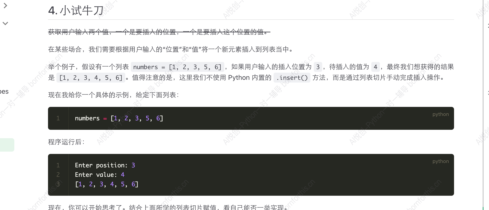
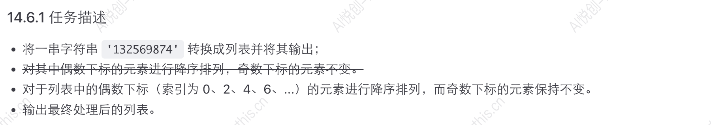
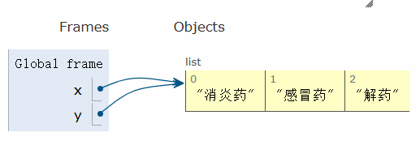
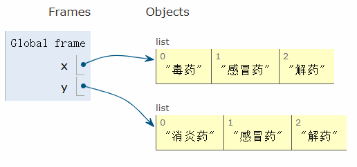

## 1. 列表的基本语法

- 使用中括号 `[]` 表示列表
- 列表内元素用逗号 `,` 隔开（注意：逗号为英文输入法下的逗号 `,` ）

```python
student1 = ['Ran', 'class1', 18, 20250417]
student2 = ['Peppa', 'class2', 8, 20250418]
```

## 2. 列表的三大性质

- 有序性
- 可变性
- 支持任意数据类型

（详见：2. 数据类型 中的列表部分）

## 3. 字符串强制转换成列表

当字符串被强制转换成列表时，每个字符都会被拆分成单独的元素，示例如下：

```python
user_input = input('>>>:')
print(list(user_input))

#-------output-------
>>>:[123, 456, peppa, Gorge]
['[', '1', '2', '3', ',', ' ', '4', '5', '6', ',', ' ', 'p', 'e', 'p', 'p', 'a', ',', ' ', 'G', 'o', 'r', 'g', 'e', ']']
```

上述示例可看出，字符串 `[123, 456, peppa, Gorge]` 转换成列表后，每个字符都被拆分成单独的元素。

可以利用这个特性，将字符串内容强制转换成列表。

```python
string_to_list = list('peppapig')
print(string_to_list)

#-------output-------
['p', 'e', 'p', 'p', 'a', 'p', 'i', 'g']
```


## 4. 列表元素的提取

```python
grade = [98, 99, 95, 80]

#98
print(grade[0])

#178
print(grade[0]+grade[3])

# [98, 95]
print(grade[::2])

# [99, 80]
print(grade[1::2])

# [80, 95, 99, 98]
print(grade[::-1])

#-------output-------
98
178
[98, 95]
[99, 80]
[80, 95, 99, 98]
```

```python
numbers = [0,1,2,3,4,5,6,7,8,9]
print(numbers[2:6])

print(numbers[1:7:2])

#-------output-------
[2, 3, 4, 5]
[1, 3, 5]
```


## 5. 列表的切片赋值

::: code-tabs 

@tab 对列表中部分元素增删

```python
In [1]: list('Python')
Out[1]: ['P', 'y', 't', 'h', 'o', 'n']

In [2]: name = list('Python')

In [3]: name
Out[3]: ['P', 'y', 't', 'h', 'o', 'n']

In [4]: name[2:]
Out[4]: ['t', 'h', 'o', 'n']

In [5]: list('abc')
Out[5]: ['a', 'b', 'c']

In [6]: name[2:] = list('abc')

In [7]: name
Out[7]: ['P', 'y', 'a', 'b', 'c']      #新赋值的内容将旧内容覆盖，并非按照元素个数填充

```

@tab 在相邻的两元素间插入/删除元素

```python
In [9]: numbers = [1, 5]

In [10]: numbers[1:1]                    #指 1 和 5 中间空的位置
Out[10]: []

In [11]: numbers[1:1] = [2, 3, 4]

In [12]: numbers
Out[12]: [1, 2, 3, 4, 5]

In [13]: numbers[1:4] = []

In [14]: numbers
Out[14]: [1, 5]

```


:::




**Answer:**

```python
numbers = [1,2,3,5,6]
position = input("Enter position:")
value = input("Enter value:")
numbers[int(position):int(position)] = [int(value)]      #注意数据类型
print(numbers)

#-------output-------
Enter position:3
Enter value:4
[1, 2, 3, 4, 5, 6]
```

## 6. 列表的特定位置插入元素 `.insert(index, element)`

前面小试牛刀部分实现了数据插入，现用  `.insert(index, element)` 实现。

- `index` 指定要插入元素的位置。索引从 0  开始。若指定的索引超过了列表的当前长度，不会报错，元素会被添加到列表的末尾。
- `element` 是想到插入列表中的元素。

```python
numbers = [1,2,3,5,6]
numbers.insert(3, 4)            #此处只能在一个位置插入，也不可跳着插入，插入的元素作为一个整体，即，可以插入[4, 4, 4]                                 #得到结果 [1, 2, 3, [4, 4, 4], 5, 6]，而不能得到 [1, 2, 3, 4, 4, 4, 5, 6]
print(numbers)

#-------output-------
[1, 2, 3, 4, 5, 6]
```


## 7. 列表的长度

在 Python 中，列表是一种可变的数据结构。要获取列表中国的元素个数，可以使用内置函数 `len()` 。

```python
student_list = ['peppa', 'gorge', 'mummy', 'daddy', 1, 3, 5]
print(len(student_list))

#-------output-------
7
```


## 8. 列表元素的修改

### 8.1 列表元素的增加

1. 按照下标增加

```python
name = ['peppa', 'gorge', 'mummy', 'daddy']
print('before:', name)

name[0] = 'peppapig'
print('after:', name)

#-------output-------
before: ['peppa', 'gorge', 'mummy', 'daddy']
after: ['peppapig', 'gorge', 'mummy', 'daddy']
```

- 可放入修改的数据类型

::: code-tabs

@tab 列表

```python
numbers = [0, 1, 2, 3, 4, 5, 6, 7, 8, 9, 10]
print('before:', numbers)

numbers[1:3] = ['peppa', 'pig', True]
print('after:', numbers)

#-------output-------
before: [0, 1, 2, 3, 4, 5, 6, 7, 8, 9, 10]
after: [0, 'peppa', 'pig', True, 3, 4, 5, 6, 7, 8, 9, 10]
```

@tab 字符串

```python
numbers = [0, 1, 2, 3, 4, 5, 6, 7, 8, 9, 10]
print('before:', numbers)

numbers[1:3] = 'this is string'
print('after:', numbers)

#-------output-------
before: [0, 1, 2, 3, 4, 5, 6, 7, 8, 9, 10]
after: [0, 't', 'h', 'i', 's', ' ', 'i', 's', ' ', 's', 't', 'r', 'i', 'n', 'g', 3, 4, 5, 6, 7, 8, 9, 10]
```

@tab 数字型(×)

```python
numbers = [0, 1, 2, 3, 4, 5, 6, 7, 8, 9, 10]
print('before:', numbers)

numbers[1:3] = 300, 500, 900                       #此处将多个数字按照元组插入进去，若单独的数字 300 则会报错
                                                   #插入的内容需要能够迭代（能进一步拆分）
print('after:', numbers)

#-------output-------
before: [0, 1, 2, 3, 4, 5, 6, 7, 8, 9, 10]
after: [0, 300, 500, 900, 3, 4, 5, 6, 7, 8, 9, 10]
```

@tab 元组

```python
numbers = [0, 1, 2, 3, 4, 5, 6, 7, 8, 9, 10]
print('before:', numbers)

numbers[1:3] = (300, 500, '暴富')
print('after:', numbers)

#-------output-------
before: [0, 1, 2, 3, 4, 5, 6, 7, 8, 9, 10]
after: [0, 300, 500, '暴富', 3, 4, 5, 6, 7, 8, 9, 10]
```

@tab 字典

```python
numbers = [0, 1, 2, 3, 4, 5, 6, 7, 8, 9, 10]
print('before:', numbers)

numbers[1:3] = {"name": "ran", "age": 29, 1: "int"}
print('after:', numbers)

#-------output-------
before: [0, 1, 2, 3, 4, 5, 6, 7, 8, 9, 10]
after: [0, 'name', 'age', 1, 3, 4, 5, 6, 7, 8, 9, 10]    #字典只放 key 到列表
```

@tab 集合

```python
numbers = [0, 1, 2, 3, 4, 5, 6, 7, 8, 9, 10]
print('before:', numbers)

numbers[1:3] = {1, 2, "ran", 1.1, "book", (1, 2, 3), False}
print('after:', numbers)

#-------output-------
before: [0, 1, 2, 3, 4, 5, 6, 7, 8, 9, 10]
after: [0, False, 1, 2, 'ran', 1.1, 'book', (1, 2, 3), 3, 4, 5, 6, 7, 8, 9, 10]     #因为集合是无序的，放入也是无序的
```

@tab 布尔(×)

```python
numbers = [0, 1, 2, 3, 4, 5, 6, 7, 8, 9, 10]
print('before:', numbers)

numbers[1:3] = True
print('after:', numbers)

#-------output-------
before: [0, 1, 2, 3, 4, 5, 6, 7, 8, 9, 10]
Traceback (most recent call last):
  File "D:\Coder\test 1\test 1.1.py", line 4, in <module>
    numbers[1:3] = True
TypeError: can only assign an iterable
```


:::


2. 用 `.append()`在列表末尾增加一个元素

该命令只能在末尾增加一个内容，增加多个元素需要执行多个 `.append()` ，若增加的内容为列表、元组、字典、集合、布尔，则会将其作为一个元素加入到列表中。

```python
inventory = ['钥匙', '毒药']
print('before:', inventory)

inventory.append('解药')      #在列表末尾添加内容，只能增加一个内容
print('after:', inventory)

#-------output-------
before: ['钥匙', '毒药']
after: ['钥匙', '毒药', '解药']
```

**数字型和布尔型可以插入。**

```python
inventory = ['钥匙', '毒药']
print('before:', inventory)

inventory.append(False)      #在列表末尾添加内容
print('after:', inventory)

#-------output-------
before: ['钥匙', '毒药']
after: ['钥匙', '毒药', False]
```


3. 用 `.extend()` 在列表末尾增加多个元素

`.extend()` 需要增加的内容可解析，比如将列表中两个元素拆开再插入到原始列表中，因此数字型、布尔型的数据无法使用，并且与根据下标的插入不同，`.extend()` 也无法插入多个数字型（只能插入一个内容）。

::: code-tabs

@tab 增加列表

```python
inventory = ['钥匙', '毒药', '解药']
print('before:', inventory)

inventory.extend(['迷药', '感冒药'])
print('after:', inventory)

#-------output-------
before: ['钥匙', '毒药', '解药']
after: ['钥匙', '毒药', '解药', '迷药', '感冒药']
```

@tab 增加多个元素(×)

```python
inventory = ['钥匙', '毒药', '解药']
print('before:', inventory)

inventory.extend(123, 123)
print('after:', inventory)

#-------output-------
Traceback (most recent call last):
  File "D:\Coder\test 1\test 1.1.py", line 4, in <module>
    inventory.extend(123, 123)
TypeError: list.extend() takes exactly one argument (2 given)
before: ['钥匙', '毒药', '解药']
```


:::

### 8.2 列表元素的删减

1. 用 `del` 根据下标删除元素

::: code-tabs

@tab 删除一个元素

```python
student_list = ['李雷', '韩梅梅', '马冬梅', '李华']
print('before:', student_list)
del student_list[0]                 #删除下标为 0 的元素
print('after:', student_list)

#-------output-------
before: ['李雷', '韩梅梅', '马冬梅', '李华']
after: ['韩梅梅', '马冬梅', '李华']
```

@tab 删除连续的多个元素

```python
student_list = ['李雷', '韩梅梅', '马冬梅', '李华']
print('before:', student_list)
del student_list[0:2]                 #删除下标为 0,1 的元素
print('after:', student_list)

#-------output-------
before: ['李雷', '韩梅梅', '马冬梅', '李华']
after: ['马冬梅', '李华']
```

@tab 按照固定间隔删除

```python
student_list = ['李雷', '韩梅梅', '马冬梅', '李华']
print('before:', student_list)
del student_list[::2]                 
print('after:', student_list)

#-------output-------
before: ['李雷', '韩梅梅', '马冬梅', '李华']
after: ['韩梅梅', '李华']
```

@tab 删除整个列表

```python
student_list = ['李雷', '韩梅梅', '马冬梅', '李华']
print('before:', student_list)
del student_list
print('after:', student_list)

#-------output-------
before: ['李雷', '韩梅梅', '马冬梅', '李华']
Traceback (most recent call last):
  File "D:\Coder\test 1\test 1.1.py", line 4, in <module>
    print('after:', student_list)
NameError: name 'student_list' is not defined
```


:::

2. 用 `.pop()` 删除元素

::: code-tabs

@tab 删除末尾元素

```python
student_list = ['李雷', '韩梅梅', '马冬梅', '李华']
print('before:', student_list)
removed = student_list.pop()      #不传参则表示删除列表末尾元素

print('after:', student_list)
print(removed)

#-------output-------
before: ['李雷', '韩梅梅', '马冬梅', '李华']
after: ['李雷', '韩梅梅', '马冬梅']
李华
```

@tab 删除指定下标的某个元素

```python
student_list = ['李雷', '韩梅梅', '马冬梅', '李华']
print('before:', student_list)
removed = student_list.pop(0)      #删除列表末尾元素

print('after:', student_list)
print(removed)

#-------output-------
before: ['李雷', '韩梅梅', '马冬梅', '李华']
after: ['韩梅梅', '马冬梅', '李华']
李雷
```


:::

3. 用`.remove()` 删除指定内容的元素

若有重复内容，则只会删除第一次出现的元素。

```python
student_list = ['李雷', '韩梅梅', '马冬梅', '李华', '韩梅梅']
print('before:', student_list)
student_list.remove('韩梅梅')
print('after:', student_list)

#-------output-------
before: ['李雷', '韩梅梅', '马冬梅', '李华', '韩梅梅']
after: ['李雷', '马冬梅', '李华', '韩梅梅']
```


## 9. 列表的拼接

```python
number1 = [1, 2, 3, 4]
number2 = [5, 6, 7, 8]
print(number1 + number2)

#-------output-------
[1, 2, 3, 4, 5, 6, 7, 8]
```


## 10. 判断某个元素是否在列表中 （Value in Sequence)

想要判断某个元素是否在列表中，可以使用 `in` 关键词来判断， 格式 `Value in Sequence` ，这个方法也适用于其他序列，结果会返回 `True` 或 `False` 。

```python
inventory = ['钥匙', '毒药', '解药']
print ('解药' in inventory)
print ('感冒药' in inventory)

#-------output-------
True
False
```


## 11. 统计元素在列表中出现的次数 `.count()`

```python
numbers = [0, 1, 1, 2, 2, 3, 4, 2, 1]
print(numbers.count(1))

#-------output-------
3
```


## 12. 某一元素第一次出现的下标 `.index()`

```python
numbers = [0, 1, 1, 2, 2, 3, 4, 2, 1]
print(numbers.index(1))

#-------output-------
1
```


## 13. 列表的排序

Python 提供了多种方法对列表进行排序，常见的有 `list.sort()` 和 内置函数`sorted()` 。两者最大的区别在于：

-  `list.sort()` ：**原地**排序，会直接修改调用该方法的列表本身，不返回新列表。
- `sorted(iterable)` ：**非原地**排序，会新建一个列表，并返回排序后的结果，原列表或可迭代对象不变。


### 13.1  `list.sort()` 

- 数字的排序

::: code-tabs

@tab 默认升序排列

```python
numbers = [0, 1, 1, 2, 2, 3, 4, 2, 1]
numbers.sort()
print(numbers)

#-------output-------
[0, 1, 1, 1, 2, 2, 2, 3, 4]
```

@tab 降序排列

```python
numbers = [0, 1, 1, 2, 2, 3, 4, 2, 1]
numbers.sort(reverse=True)
print(numbers)

#-------output-------
[4, 3, 2, 2, 2, 1, 1, 1, 0]
```


:::

- 字母的排序

默认：按照 **ASCII码** 排序，大写字母在前，ASCII码见链接 https://bornforthis.cn/posts/29.html  。

```python
letter = ['m', 'e', 'n', 'g', 'p', 'e', 'p', 'p', 'a', 'P', 'I', 'G']
letter.sort()
print(letter)

#-------output-------
['G', 'I', 'P', 'a', 'e', 'e', 'g', 'm', 'n', 'p', 'p', 'p']
```


### 13.2 `sorted(iterable)` 

`sorted(list, reverse=False)` 函数可以传入任意可迭代对象，将可迭代对象进行升序排序，然后返回一个新的、排列好的列表，原列表不变。 `reverse` 默认 `False` ，如果设置为 `True` 则返回降序排列。

- 数字的排序

::: code-tabs

@tab 升序排列

```python
lst = [9, 8, 10, 7, 6, 5, 4, 3, 2, 1, 0]
new_lst = sorted(lst)
print(new_lst)

#-------output-------
[0, 1, 2, 3, 4, 5, 6, 7, 8, 9, 10]
```

@tab 降序排列

```python
lst = [9, 8, 10, 7, 6, 5, 4, 3, 2, 1, 0]
new_lst = sorted(lst, reverse=True)
print(new_lst)

#-------output-------
[10, 9, 8, 7, 6, 5, 4, 3, 2, 1, 0]
```


:::

- 字母的排序

默认：按照 **ASCII码** 排序，大写字母在前，ASCII码见链接 https://bornforthis.cn/posts/29.html  。

```python
lst = ['a', 'b', 'c', 'd', 'A', 'B', 'C', 'D']
new_lst = sorted(lst, reverse=True)
print(new_lst)

#-------output-------
['d', 'c', 'b', 'a', 'D', 'C', 'B', 'A']
```


**Quiz:**



**Answer:** 

```python
str = '132569874'

# 强制转化成列表
lst = list(str)

# 提取下标为偶数的元素，并命名为odd_lst
odd_lst = lst[::2]

# 将提取出来的 下标为偶数的元素 降序排列
odd_lst.sort(reverse=True)

# 将降序排列的元素 赋值 原 lst 中偶数下标 （重新赋值）
lst[::2] = odd_lst

# 输出结果
print(lst)

#-------output-------
['8', '3', '6', '5', '4', '9', '2', '7', '1']
```

注意：切片赋值是将旧的元素直接替换。

**Quiz 变体：** 将字符串改为用户随意输入一段数字字符串，按照相同规则实现。

```python
str = input('请输入任意长度的数字字符串：')

# 强制转化成列表
lst = list(str)

# 提取下标为偶数的元素，并命名为odd_lst
odd_lst = lst[::2]

# 将提取出来的 下标为偶数的元素 降序排列
odd_lst.sort(reverse=True)

# 将降序排列的元素 赋值 原 lst 中偶数下标
lst[::2] = odd_lst

# 输出结果
print(lst)
```


### 13.3 切片与排序：小心“一闪而过”的结果

使用  `list.sort()` 常见的坑需要特别注意：切片后得到的是一个全新的列表，而非原列表的某个子列表。因此，如果在一段代码中对切片后的列表调用，即使本身排序完成了，但不会对原列表有任何改变，需要将切片后的列表储存为新的变量，才能使用排序后的列表。

```python
numbers = [0, 1, 1, 2, 2, 3, 4, 2, 1]
numbers[::2].sort()      #等价于 [0, 1, 2, 4, 1].sort() ，实际在对 [0, 1, 2, 4, 1] 排序
print(id(numbers), id(numbers[::2]))

#-------output-------
2505235857984 2505235857920          #说明他们存储在不同位置，是两个变量
```


## 14. 列表的倒序 `.reverse`

将一个列表元素倒序，并不局限于字母、数字。

```python
# 定义一个药品列表
lst = ['毒药', '解药', '感冒药']

# 使用 reverse() 方法进行反转
lst.reverse()

# 输出结果
print(lst)

#-------output-------
['感冒药', '解药', '毒药']
```

不使用 `reverse()` 如何进行倒序排列？参考 4. 字符串和input 章节中 “字符串的获取”。

```python
# 定义一个药品列表
lst = ['毒药', '解药', '感冒药']

# 使用 “字符串的获取” 方法进行反转
reversed_lst = lst[::-1]

# 输出结果
print(reversed_lst)
```


## 15. 列表的深浅拷贝

### 15.1 `y = x` 所存在的问题，是真的备份吗？`.copy()`

阅读下方代码，思考两个问题：

Q1. 这段代码的目的是什么？希望实现什么效果？

Q2. 代码的输出结果是什么？是否符合预期？


```python
x = ['毒药', '感冒药', '解药']
y = x
print(f'Original:\n\tx: {x}\n\ty: {y}\n\tid_x: {id(x)}\n\tid_y: {id(y)}')   # id() 用来获取变量的物理地址
y[0] = '消炎药'
print(f'After:\n\tx: {x}\n\ty: {y}\n\tid_x: {id(x)}\n\tid_y: {id(y)}')

#-------output-------
Original:
	x: ['毒药', '感冒药', '解药']
	y: ['毒药', '感冒药', '解药']
	id_x: 2618313748416
	id_y: 2618313748416
After:
	x: ['消炎药', '感冒药', '解药']
	y: ['消炎药', '感冒药', '解药']
	id_x: 2618313748416
	id_y: 2618313748416
```

 

A1. 

这段代码为了实现数据备份，减少重复代价。

从 line 2 可知， `y=x` 想要将列表 `x`  赋值给变量 `y` ，从而创建一个副本进行备份，对 `x` 修改的时候 `y` 不会发生变化。

需求场景：

假设有一个100万条数据的 Excel 文件，获取这个文件的代价极高：

- 花费1000元
- 下载需3小时
- 1000元只能下载一次，再次下载需重复付费。


A2.

- 这段代码的输出的 id 可以看出，`x` 和 `y` 的地址相同，其实为同一变量，对 `x` 修改时，`y` 也会发生相应的变化，没有起到备份的作用。

- 另一个验证方式可以利用代码可视化，链接如下： https://pythontutor.bornforthis.cn/visualize.html#mode=edit

在框内复制这段代码，点击 Visualize Execution 进行可视化，forward 是进行下一步，点击 last 可直达结果。


从结果可以看出，`x`和 `y` 指向的同一个列表。




解决方法 `.copy()` 

```python
x = ['毒药', '感冒药', '解药']
y = x.copy()
print(f'Original:\n\tx: {x}\n\ty: {y}\n\tid_x: {id(x)}\tid_y: {id(y)}')   # id() 用来获取变量的物理地址
y[0] = '消炎药'
print(f'After:\n\tx: {x}\n\ty: {y}\n\tid_x: {id(x)}\tid_y: {id(y)}')

#-------output-------
Original:
	x: ['毒药', '感冒药', '解药']
	y: ['毒药', '感冒药', '解药']
	id_x: 1286604533696	id_y: 1286604533632
After:
	x: ['毒药', '感冒药', '解药']
	y: ['消炎药', '感冒药', '解药']
	id_x: 1286604533696	id_y: 1286604533632
```


从上述代码可以看出， `x` 和 `y` 的地址不同，为不同变量，备份成功，可视化结果也可佐证。




