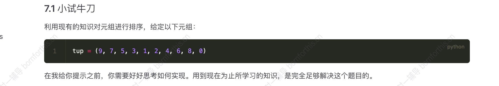
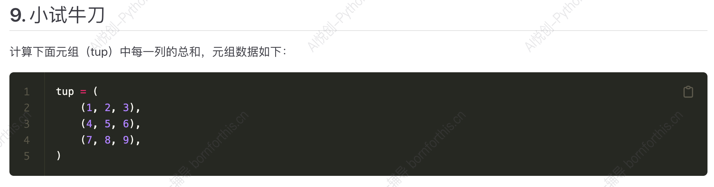
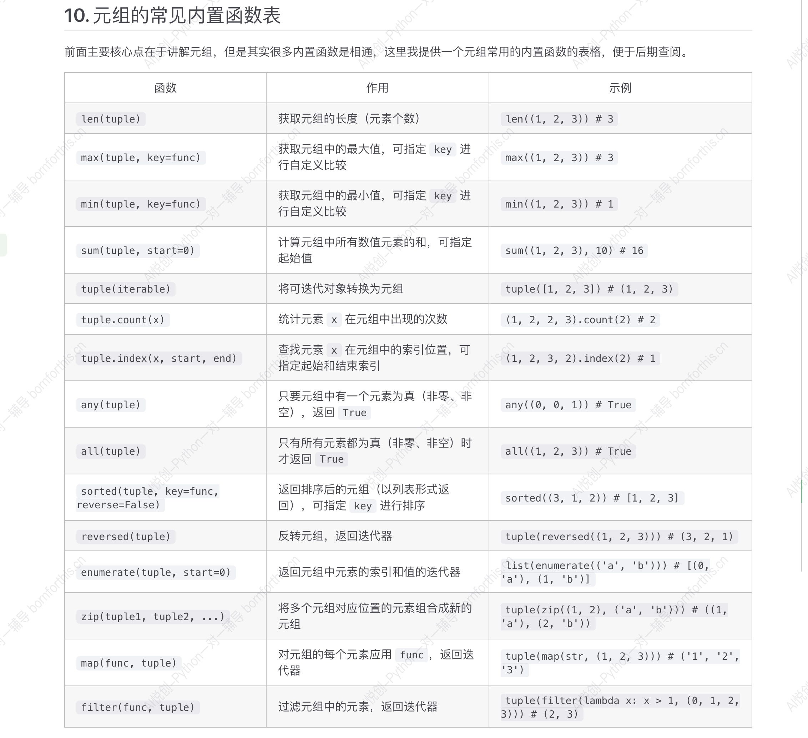

## 1. 创建元组

```python
tup = ('毒药', '感冒药', '解药')
print(tup, type(tup))

#-------output-------
('毒药', '感冒药', '解药') <class 'tuple'>
```

::: important 元组和列表的区别

- 列表的元素用 `[]` 包裹，元组的元素用 `()` 包裹。
- 可变性：列表的元素可以修改、添加或删除；元组不可变，创建后无法修改。

:::


## 2. 元组的拼接

```python
tup1 = (1, 2, 3)
tup2 = (4, 5, 6)
new_tup = tup1 + tup2
print(new_tup)

#-------output-------
(1, 2, 3, 4, 5, 6)
```


## 3. 元组的获取

```python
tup = (3, 'bornforthis', 22, 'aiyuechuang', 12, 'huangjiarongbao', 8)

# Q1 提取字符串 bornforthis
print(tup[1])

# Q2 提取 8，三种方法
print(tup[-1])
print(tup[6])
print(tup[len(tup)-1])

# Q3 提取 （'bornforthis'， 22）
print(tup[1:3])

# Q4 提取 (3, 22, 12, 8)
print(tup[::2])

# Q5 提取 ('bornforthis','aiyuechuang', 'huangjiarongbao')
print(tup[1::2])

# Q6 提取 (22, 'huangjiarongbao')
print(tup[2::3])

# Q7 提取 (8, 'huangjiarongbao', 12, 'aiyuechuang', 22, 'bornforthis', 3)
print(tup[::-1])

# Q8 提取 ('huangjiarongbao', 12, 'aiyuechuang')
print(tup[-2:-5:-1])
```


## 4. 只有一个元素的元组

当元组内只有一个元素时，如 `tup = (1)`  ， `tup = (‘a’)` ，查看该变量的数据类型，会显示出该元素本身的数据类型 `int` ，`string` ，原因在于计算机将外面的括号识别为运算符号的括号（如： `(1+2) * (2+1) = 3*3 = 9` ， `3` 的括号被省略了）。解决方法就是在该元素后加一个逗号 `,` 进行区分，代码如下：

```python
tup = ('a', )
print(type(tup), len(tup))

#-------output-------
<class 'tuple'> 1
```

## 5. 元组是不可变的

元组是不可变的，一但创建，元组中的元素不可修改。如果尝试修改元组中的元素，会抛出 `TypeError` 错误。

```python
tup = ('毒药', '感冒药', '解药')
tup[0] = 1

#-------output-------
Traceback (most recent call last):
  File "D:\Coder\test 1\test 1.1.py", line 2, in <module>
    tup[0] = 1
TypeError: 'tuple' object does not support item assignment
```

### 5.1 元组的“修改”


思考1：元组不可以修改，但是可以提取，把需要的部分提取出来，和修改的元素以元组拼接（加法）的方式再结合成新的元组。

```python
tup = ('毒药', '感冒药', '解药')
tup_new = ('泻药', ) + tup[1:]
print(tup_new)

#-------output-------
('泻药', '感冒药', '解药')
```


思考2：元组不可以修改，但列表可以修改，可以把元组转化成列表修改后，再转化回元组。

```python
tup = ('毒药', '感冒药', '解药')
lst = list(tup)
lst[0] = '泻药'
tup_new = tuple(lst)
print(tup_new)

#-------output-------
('泻药', '感冒药', '解药')
```


### 5.2 在元组的正中间插入元素

```python
tup = ('毒药', '感冒药', '解药', 'aiyc', 'peppa')
lst = list(tup)

# 考虑奇数偶数，若是偶数直接除2， 奇数取整后，下标为中间位的左侧
position = len(lst) // 2

lst.insert(position, '泻药')
tup_new = tuple(lst)
print(tup_new)

#-------output-------
('毒药', '感冒药', '泻药', '解药', 'aiyc', 'peppa')
```


## 6. 元组的排序




```python
tup = (9, 7, 5, 3, 1, 2, 4, 6, 8, 0)
lst = list(tup)

# 用 .sort 实现
# lst.sort()
# tup_new = tuple(lst)
# print(tup_new)

# 用 sorted 实现
sorted_lst = sorted(lst)
tup_new = tuple(sorted_lst)
print(tup_new)

#-------output-------
(0, 1, 2, 3, 4, 5, 6, 7, 8, 9)
```


## 7. zip()

`zip()` 是一个内置函数，用于将多个可迭代对象（如列表、元组、字符串）的相应元素配对并 **返回一个元组** 的迭代器。如果有两个或更多的列表，并且想要根据他们的相应元素创建一个新的迭代器（指里面的内容可以进一步拆分提取），那么`zip()` 函数就非常有用。

```python
list1 = [1, 2, 3]
list2 = ['a', 'b', 'c']
zipped = zip(list1, list2)
print(zipped)
print(list(zipped))

#-------output-------
<zip object at 0x0000028C886BAC00>
[(1, 'a'), (2, 'b'), (3, 'c')]
```

如果元素个数不匹配，多出来的元素不会进行压缩。

```python
list1 = [1, 2, 3, 4]
list2 = ['a', 'b', 'c']
zipped = zip(list1, list2)
print(zipped)
print(list(zipped))

#-------output-------
<zip object at 0x0000018EC5A09740>
[(1, 'a'), (2, 'b'), (3, 'c')]
```

`zip()` 被创建出来后，只能被解包一次。

```python
list1 = [1, 2, 3, 4]
list2 = ['a', 'b', 'c']
zipped = zip(list1, list2)
print(zipped)
print(list(zipped))
print(tuple(zipped))


#-------output-------
[(1, 'a'), (2, 'b'), (3, 'c')]
()                                  # 由于 zipped 已经被解包成 list 了，那么后面再解包成 tuple 就会显示空
```

查看 zip 操作后的内容。

```python
list1 = [1, 2, 3, 4]
list2 = ['a', 'b', 'c']
zipped = zip(list1, list2)
print(zipped)

# for 循环查看 zip 后的内容
for num, letter in zipped:
    print(f'Number: {num}, letter: {letter}')
    
#-------output-------
<zip object at 0x000001FCE71C9940>
Number: 1, letter: a
Number: 2, letter: b
Number: 3, letter: c
```

## 8. Quiz



```python
tup = (
    (1, 2, 3),
    (4, 5, 6),
    (7, 8, 9)
)

zipped = tuple(zip(tup[0], tup[1], tup[2]))
print(sum(zipped[0]), sum(zipped[1]), sum(zipped[2]))

#-------output-------
12 15 18
```


## 9. 元组常见的内置函数




