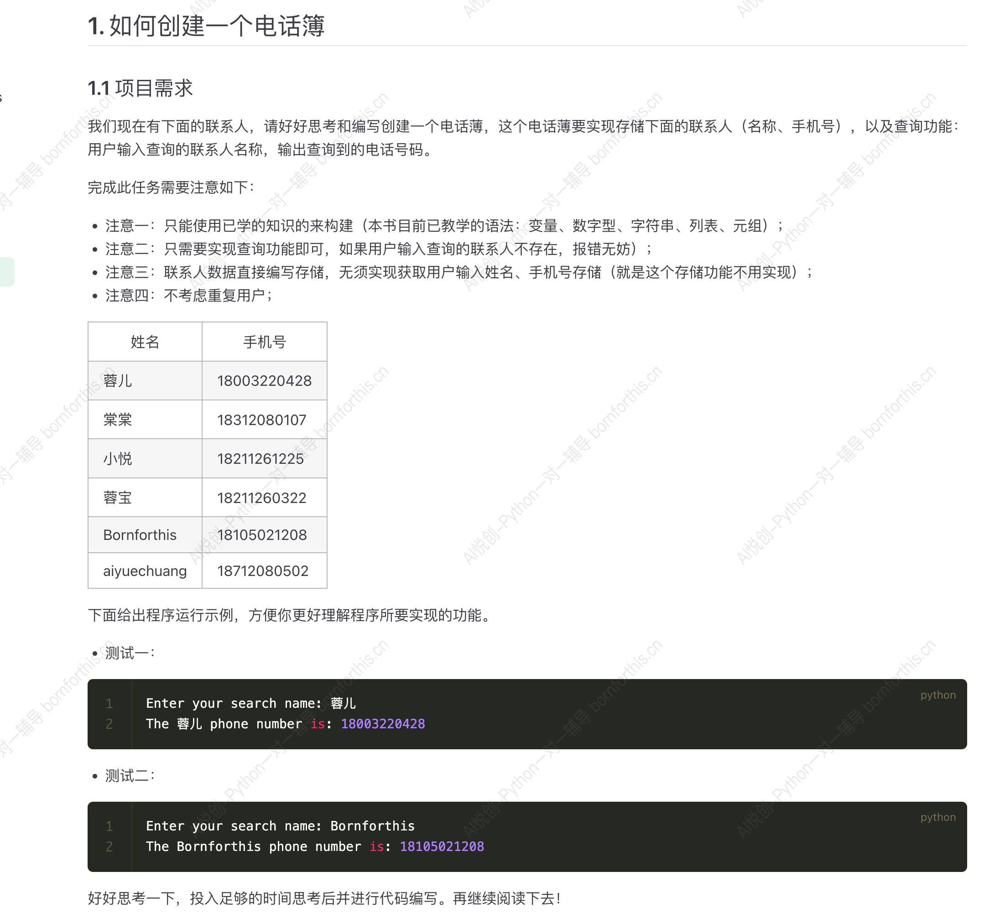

## 1.如何创建一个电话簿

### 1.1 使用列表进行成对数据的存储和获取



```python
name = ['蓉儿', '棠棠', '小悦', '蓉宝', 'aiyuechuang', 'Bornforthis']
phone_number = [18000000000, 18100000000, 18200000000, 18300000000, 18400000000, 18500000000]

# 获取输入
name_input = input('Enter your search name: ')

name_index = name.index(name_input)
phone_get = phone_number[name_index]

print(f'The {name_input} phone number is: {phone_get}.')

#-------output-------
Enter your search name: aiyuechuang
The aiyuechuang phone number is: 18400000000.
```


思考：如何用一个列表实现呢？

```python
phone_book = ['蓉儿', 18000000000, '棠棠', 18100000000, '小悦', 18200000000, '蓉宝', 18300000000, 'aiyuechuang', 18400000000, 'Bornforthis', 18500000000]

# 获取输入
name_input = input('Enter your search name: ')
name_index = phone_book.index(name_input)
phone_get = phone_book[name_index+1]

print(f'The {name_input} phone number is: {phone_get}.')

#-------output-------
Enter your search name: aiyuechuang
The aiyuechuang phone number is: 18400000000.
```

以上是利用 **列表** 进行数据存储和获取。

### 1.2 使用字典储存用户名和手机号

```python
phonebooks = {
    '蓉儿': '18000000000',
    '棠棠': '18100000000',
    '小悦': '18200000000',
    '蓉宝': '18300000000',
    'bornforthis': '18400000000',
    'aiyuechuang': '18500000000',
}

search_name = input('Enter your search name: ')

phones = phonebooks[search_name]

print(f'The {search_name} phone number is: {phones}')

#-------output-------
Enter your search name: 蓉宝
The 蓉宝 phone number is: 18300000000
```


## 2. 字典的结构

- 字典使用 <span style="color:orange">花括号</span>  `{}` 来表示；
- 字典中的每一项由 键 `key` 和 值 `value` 组成，格式为： `{key: value, key: value}` ；
- 各个键值对之间用 逗号 `,` 隔开。

```python
phonebooks = {'蓉儿': '18000000000', '棠棠': '18100000000', '小悦': '18200000000'}
```


## 3. 字典的 键 `key` 和 值 `value`  

- 每一个 键（key）都对应一个 值（value），他们是一一对应关系，每个键只对应一个值；
- 字典中的 键（key）必须是不可变类型，如字符串、数字或元组等；
- 字典中的 值（value）可以是任何类型，包括可变类型（如：列表、数字、布尔型，甚至是另一个字典等）；
- 字典的有序是指：字典中的键值对是有序的；
- 如果在字典中出现重复的键，后出现的键值对会覆盖前一个相同的键的值。

下面给出字典出现相同的 key name 时，会出现的效果：

```python
dictionary = {'name': '李雷', 'age': 18, 'numbers': '0233', 'name': 'aiyuechuang', True: 'bool', 2: 'int'}
print(dictionary)

#-------output-------
{'name': 'aiyuechuang', 'age': 18, 'numbers': '0233', True: 'bool', 2: 'int'}
```

如果 键 出现列表这种可变的元素，则会报错：

```python
dictionary = {['name']: '李雷', 'age': 18, 'numbers': '0233', 'name': 'aiyuechuang', True: 'bool', 2: 'int'}
print(dictionary)

#-------output-------
Traceback (most recent call last):
  File "D:\Coder\test 1\test 1.1.py", line 1, in <module>
    dictionary = {['name']: '李雷', 'age': 18, 'numbers': '0233', 'name': 'aiyuechuang', True: 'bool', 2: 'int'}
TypeError: unhashable type: 'list'
```


## 4. 创建字典的方法

1. 直接按照格式，用花括号创建。
2. 使用键值对序列（列表、元组等）

```python
massage1 = [('分数', '98'), ('性别', '男')]
massage2 = (('姓名', 'bornforthis'), ('班级', 1))
list_to_dict1 = dict(massage1)
list_to_dict2 = dict(massage2)
print(f'list_to_dict1: {list_to_dict1}')
print(f'list_to_dict2: {list_to_dict2}')

#-------output-------
list_to_dict1: {'分数': '98', '性别': '男'}
list_to_dict2: {'姓名': 'bornforthis', '班级': 1}

```

3. 根据关键字参数新建字典

```python
d = dict(lilei = 98, hanmeimei = 99)
print(d)

#-------output-------
{'lilei': 98, 'hanmeimei': 99}
```


::: important 方法2和方法3的区别

方法2中，元组的0号位可以放多种类型的数据；

方法3中，`lilei = 98` 是一个变量赋值，因此作为 key 的数据只能是字符串，但是字典的 `key` 可以是任意不可变的数据类型，因此方法3存在局限。

:::


