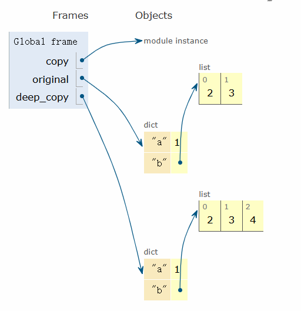

## 1.如何创建一个电话簿

### 1.1 使用列表进行成对数据的存储和获取


```python
name = ['蓉儿', '棠棠', '小悦', '蓉宝', 'aiyuechuang', 'Bornforthis']
phone_number = [18000000000, 18100000000, 18200000000, 18300000000, 18400000000, 18500000000]

# 获取输入
name_input = input('Enter your search name: ')

name_index = name.index(name_input)
phone_get = phone_number[name_index]

print(f'The {name_input} phone number is: {phone_get}.')

#-------output-------
Enter your search name: aiyuechuang
The aiyuechuang phone number is: 18400000000.
```


思考：如何用一个列表实现呢？

```python
phone_book = ['蓉儿', 18000000000, '棠棠', 18100000000, '小悦', 18200000000, '蓉宝', 18300000000, 'aiyuechuang', 18400000000, 'Bornforthis', 18500000000]

# 获取输入
name_input = input('Enter your search name: ')
name_index = phone_book.index(name_input)
phone_get = phone_book[name_index+1]

print(f'The {name_input} phone number is: {phone_get}.')

#-------output-------
Enter your search name: aiyuechuang
The aiyuechuang phone number is: 18400000000.
```

以上是利用 **列表** 进行数据存储和获取。

### 1.2 使用字典储存用户名和手机号

```python
phonebooks = {
    '蓉儿': '18000000000',
    '棠棠': '18100000000',
    '小悦': '18200000000',
    '蓉宝': '18300000000',
    'bornforthis': '18400000000',
    'aiyuechuang': '18500000000',
}

search_name = input('Enter your search name: ')

phones = phonebooks[search_name]

print(f'The {search_name} phone number is: {phones}')

#-------output-------
Enter your search name: 蓉宝
The 蓉宝 phone number is: 18300000000
```


## 2. 字典的结构

- 字典使用 <span style="color:orange">花括号</span>  `{}` 来表示；
- 字典中的每一项由 键 `key` 和 值 `value` 组成，格式为： `{key: value, key: value}` ；
- 各个键值对之间用 逗号 `,` 隔开。

```python
phonebooks = {'蓉儿': '18000000000', '棠棠': '18100000000', '小悦': '18200000000'}
```


## 3. 字典的 键 `key` 和 值 `value`  

- 每一个 键（key）都对应一个 值（value），他们是一一对应关系，每个键只对应一个值；
- 字典中的 键（key）必须是不可变类型，如字符串、数字或元组等；
- 字典中的 值（value）可以是任何类型，包括可变类型（如：列表、数字、布尔型，甚至是另一个字典等）；
- 字典的有序是指：字典中的键值对是有序的；
- 如果在字典中出现重复的键，后出现的键值对会覆盖前一个相同的键的值。

下面给出字典出现相同的 key name 时，会出现的效果：

```python
dictionary = {'name': '李雷', 'age': 18, 'numbers': '0233', 'name': 'aiyuechuang', True: 'bool', 2: 'int'}
print(dictionary)

#-------output-------
{'name': 'aiyuechuang', 'age': 18, 'numbers': '0233', True: 'bool', 2: 'int'}
```

如果 键 出现列表这种可变的元素，则会报错：

```python
dictionary = {['name']: '李雷', 'age': 18, 'numbers': '0233', 'name': 'aiyuechuang', True: 'bool', 2: 'int'}
print(dictionary)

#-------output-------
Traceback (most recent call last):
  File "D:\Coder\test 1\test 1.1.py", line 1, in <module>
    dictionary = {['name']: '李雷', 'age': 18, 'numbers': '0233', 'name': 'aiyuechuang', True: 'bool', 2: 'int'}
TypeError: unhashable type: 'list'
```


## 4. 创建字典的方法

1. 直接按照格式，用花括号创建。
2. 使用键值对序列（列表、元组等）

```python
massage1 = [('分数', '98'), ('性别', '男')]
massage2 = (('姓名', 'bornforthis'), ('班级', 1))
list_to_dict1 = dict(massage1)
list_to_dict2 = dict(massage2)
print(f'list_to_dict1: {list_to_dict1}')
print(f'list_to_dict2: {list_to_dict2}')

#-------output-------
list_to_dict1: {'分数': '98', '性别': '男'}
list_to_dict2: {'姓名': 'bornforthis', '班级': 1}

```

3. 根据关键字参数新建字典

```python
d = dict(lilei = 98, hanmeimei = 99)
print(d)

#-------output-------
{'lilei': 98, 'hanmeimei': 99}
```


::: important 方法2和方法3的区别

方法2中，元组的0号位可以放多种类型的数据；

方法3中，`lilei = 98` 是一个变量赋值，因此作为 key 的数据只能是字符串，但是字典的 `key` 可以是任意不可变的数据类型，因此方法3存在局限。

:::


4. 用 `zip()` 函数创建（注意：超出长度会被截断）

```python
list1 = [1, 2, 3]
list2 = ['a', 'b', 'c']
zipped = zip(list1, list2)
print(dict(zipped))

#-------output-------
{1: 'a', 2: 'b', 3: 'c'}
```


## 5. 访问字典的数据

### 5.1通过 `key` 访问数据

通过 `key` 访问数据，不存在的会报错。

```python
grade = {'李雷': '98', '韩梅梅': '99'}
print(grade['李雷'])

#-------output-------
98
```

报错举例：

```python
grade = {'李雷': '98', '韩梅梅': '99'}
print(grade['马冬梅'])

#-------output-------
Traceback (most recent call last):
  File "D:\Coder\test 1\test 1.1.py", line 2, in <module>
    print(grade['马冬梅'])
KeyError: '马冬梅'
```

### 5.2 使用 `.get()` 避免错误

当使用 `.get()` 方法时，需要提供一个键（key），方法会返回与该键关联的值。如果该键在字典中不存在，  `.get()` 方法将返回 `None` ，或者可以自行指定一个默认值，如果键不存在，则返回这个默认值。

基本语法： `value = dictionary.get(key, default_value)`  

其中：

- `key` 是想要检索的键；
- `default_value`  是键不存在时返回的值（可选）。如果未提供该参数，默认值为 `None` 。

```python
# 创建字典
grade = {'李雷': '98', '韩梅梅': '99'}

# 使用 get 访问一个存在的键
print(grade.get('李雷'))

# 使用 get 访问不存在的键，返回默认值 None
print(grade.get('马冬梅'))

# 使用 get 访问不存在的键，指定返回值
print(grade.get('马冬梅', '无结果'))

#-------output-------
98
None
无结果
```


## 6. 更新字典的数据

```python
grade = {'李雷': '98', '韩梅梅': '99'}
grade['李雷'] = 'aaaaa'
print(grade)

#-------output-------
{'李雷': 'aaaaa', '韩梅梅': '99'}
```


## 7. 字典元素的添加

同更新字典数据的语法相同，存在的键为修改，不存在的键为添加。

```python
grade = {'李雷': '98', '韩梅梅': '99'}
grade['name'] = 'aaaaa'
print(grade)

#-------output-------
{'李雷': '98', '韩梅梅': '99', 'name': 'aaaaa'}
```


## 8. 字典元素的删除

1. 字典元素删除

```python
grade = {'李雷': '98', '韩梅梅': '99'}
grade['name'] = 'aaaaa'
del grade['李雷']
print(grade)

#-------output-------
{'韩梅梅': '99', 'name': 'aaaaa'}
```

2. 删除整个字典

```python
grade = {'李雷': '98', '韩梅梅': '99'}
del grade
print(grade)

#-------output-------
Traceback (most recent call last):
  File "D:\Coder\test 1\test 1.1.py", line 3, in <module>
    print(grade)
NameError: name 'grade' is not defined
```

3. 清空字典

```python
grade = {'李雷': '98', '韩梅梅': '99'}
grade.clear()
print(grade)

#-------output-------
{}
```

​	清空字典的场景：

```python
shopping_cart = {'banana': 2, 'apple': 1, 'orange': 3}

print(f'购物车里有： {shopping_cart}')

shopping_cart.clear()    # 清空购物车

print(f'结账后购物车变成： {shopping_cart}')

#-------output-------
购物车里有： {'banana': 2, 'apple': 1, 'orange': 3}
结账后购物车变成： {}
```


## 9. 字典结构嵌套字典

在字典当中，我们不仅可以将单一的键值对储存在字典中，还可以将更复杂的数据结构放入字典，比如列表、另一个字典，甚至是字典的列表。这种结构被称为“嵌套”。

Python 中的嵌套结构主要包括：

- 字典列表：将多个字典放在一个列表中。
- 字典中存储列表：字典的某个键对应的值是一个列表。
- 字典中存储字典：字典中某个键对应的值是另一个字典。

1. 字典列表

```python
# 字典列表
student1 = {'name': '李雷', 'age': 18, 'grade': 98}
student2 = {'name': '韩梅梅', 'age': 19, 'grade': 99}
student3 = {'name': '马冬梅', 'age': 18, 'grade': 95}
students = [student1, student2, student3]
print(students)

# 提取马冬梅的 grade
print(students[2].get('grade'))

#-------output-------
[{'name': '李雷', 'age': 18, 'grade': 98}, {'name': '韩梅梅', 'age': 19, 'grade': 99}, {'name': '马冬梅', 'age': 18, 'grade': 95}]
95
```


2. 字典中存储列表

```python
favorite_class = {
    '李雷': ['数学', '英语'],
    'hanmeimei': ['语文'],
    'madongmei': ['计算机', '物理', '数学']
}

# 得到 madongmei 的数学
print(favorite_class.get('madongmei')[2])

#-------output-------
数学
```


3. 字典中存储字典

```python
# 用一个字典表示一个学生信息
student1 = {'name': 'lilei', 'grade': '98', "实验班": True}

# 用一个字典表示全班学生信息
class1 = {
    '李雷': {'grade': '98', '实验班': True},
    '韩梅梅': {'grade': '95', '实验班': False},
}
# 提取韩梅梅实验班信息
print(class1.get('韩梅梅').get('实验班'))

#-------output-------
False
```


## 10. `.pop(key)` 删除指定键值对

`.pop(key)` 方法用于从字典中删除指定的键，并**返回该键对应的值**。

- 如果指定的键存在，它会将该键值对从字典中移除，并返回该键对应的值；
- 如果指定的键不存在，会抛出 `KeyError` 异常（除非提供默认值）。

键存在：

```python
class1 = {
    '李雷': {'grade': '98', '实验班': True},
    '韩梅梅': {'grade': '95', '实验班': False},
}

r = class1.pop('李雷')
print(r)
print(class1)

#-------output-------
{'grade': '98', '实验班': True}
{'韩梅梅': {'grade': '95', '实验班': False}}
```

键不存在

```python
class1 = {
    '李雷': {'grade': '98', '实验班': True},
    '韩梅梅': {'grade': '95', '实验班': False},
}

r = class1.pop('马冬梅', '无结果')
print(r)
print(class1)

#-------output-------
无结果
{'李雷': {'grade': '98', '实验班': True}, '韩梅梅': {'grade': '95', '实验班': False}}
```


## 11. `.popitem()`

`popitem()` 用于移除并返回字典中的最后一个键值对。该方法会修改原字典，且删除的是最后插入的键值对。

**关键点： **

- 删除最后一项： `popitem` 从字典中移除并返回最后插入的键值对；
- 返回值：返回一个包含键和值的元组 `(key, value)` ；
- 修改原字典：使用 `popitem`  会修改原字典；
- 空字典报错：如果字典为空，调用 `popitem`  会引发 `KeyError` 异常。


```python
student = {'name': 'lilei', 'grade': '98', "实验班": True}

# 使用 popitem 移除并返回最后一个键值对
del_value = student.popitem()
print(f'删除的键值对是： {del_value}')
print(f'删除后的字典是： {student}')

# 在进行删除，原列表也会变化
del_value = student.popitem()
print(f'再删除后的字典是： {student}')

#-------output-------
删除的键值对是： ('实验班', True)
删除后的字典是： {'name': 'lilei', 'grade': '98'}
再删除后的字典是： {'name': 'lilei'}
```


## 12. `.keys()`

`.keys()` 用来获取字典中全部的键。

```python
student = {'name': 'lilei', 'grade': '98', "实验班": True}

keys = student.keys()
print(keys)
print(list(keys))

#-------output-------
dict_keys(['name', 'grade', '实验班'])
['name', 'grade', '实验班']
```


## 13. `.values()`

 `.values()`  用来获取字典中全部的值。

```python
student = {'name': 'lilei', 'grade': '98', "实验班": True}

values = student.values()
print(values)
print(list(values))

#-------output-------
dict_values(['lilei', '98', True])
['lilei', '98', True]
```

## 14. `.items()`

`.items()` 用来获取字典中的键值对。

```python
student = {'name': 'lilei', 'grade': '98', "实验班": True}

student_items = student.items()
print(student_items)
print(list(student_items))

#-------output-------
dict_items([('name', 'lilei'), ('grade', '98'), ('实验班', True)])
[('name', 'lilei'), ('grade', '98'), ('实验班', True)]
```


## 15. `XX in dictionary` 判断键是否在字典内

```python
student = {'name': 'lilei', 'grade': '98', "实验班": True}
print('name' in student)
print('lilei' in student)

#-------output-------
True
False
```

因此 `value in dictionary`  判断的是**键** 是否在字典内。

？如何判断值是否在字典内？

```python
student = {'name': 'lilei', 'grade': '98', "实验班": True}
print('lilei' in student.values())

#-------output-------
True
```


## 16. `.update()` 批量更新

- 用法一

```python
student = {'name': 'lilei', 'age': 19}

# 单个添加
student['gender'] = 'male'
student['class'] = 'class 1'
print(student)

# 批量添加
dict1 = {'name': 'lilei', 'age': 19}
dict2 = {'age': 20, 'gender': 'male', 'class': '1班'}
dict1.update(dict2)
print(dict1)

#-------output-------
{'name': 'lilei', 'age': 19, 'gender': 'male', 'class': 'class 1'}
{'name': 'lilei', 'age': 20, 'gender': 'male', 'class': '1班'}
```

- 用法二

```python
dict1 = {'name': 'lilei', 'age': 19}
dict1.update(name = 'aiyuechuang', age = 20)
print(dict1)

#-------output-------
{'name': 'aiyuechuang', 'age': 20}
```

- 用法三

```python
student = {'name': 'lilei', 'age': 19}
data_lst = [('age', 20), ('class', '1班'), ('gender', 'male')]   # 也可以用元组嵌套或zip
student.update(data_lst)
print(student)

#-------output-------
{'name': 'lilei', 'age': 20, 'class': '1班', 'gender': 'male'}
```

用 zip 的示例：

```python
student = {'name': 'lilei', 'age': 19}
pairs = zip(['name', 'age'], ['李雷', 20])
student.update(pairs)
print(student)

#-------output-------
{'name': '李雷', 'age': 20}
```

注意：值相同会覆盖。

使用场景：

```python
# 默认配置
default_config = {
    'theme': 'light',
    'front_size': 12,
    'language': 'zh-cn',
    'auto_save': True
}


# 用户配置
user_config = {
    'theme': 'dark',
    'front_size': 14
}

# 合并配置：用户配置覆盖默认配置
default_config.update(user_config)

print(default_config)

#-------output-------
{'theme': 'dark', 'front_size': 14, 'language': 'zh-cn', 'auto_save': True}
```


## 17. Quiz:


Answer:

```python
# 获取用户输入
lst_input = input('Please enter your list: ')
value_input = input('Please enter your value: ')

# 将 lst 和 value 转化成列表和元组
lst = lst_input.split('/')
value_mid = tuple(value_input.split('-'))
value = tuple(map(int, value_mid))


# 用 zip 将两组数据合并成一个字典
dict_new = dict(zip(lst, value))

# 创建原字典
dict_original = {'a': 1, 'b': 2, 'c': 3, 'd': 4, 'e': 5, 'f': 6}

# 更新原字典
dict_original.update(dict_new)

# 输出更新过的原字典
print(f'updated dictionary: {dict_original}')

#-------output-------
Please enter your list: a/b/c
Please enter your value: 13-14-19
updated dictionary: {'a': 13, 'b': 14, 'c': 19, 'd': 4, 'e': 5, 'f': 6}
```


优化：

```python
# 上方代码 line 7-8 可合并
value = tuple(map(int，value_input.split('-'))
```


## 18. 字典的排序

1. 用 `sorted`  默认排序

```python
dict1 = {'a': 1, 'b': 2, 'c': 3}
sorted_dict = sorted(dict1.items())      # 默认升序排序（以 key 排序）
print(sorted_dict)

#-------output-------
[('a', 1), ('b', 2), ('c', 3)]
```

用 控制变量法 验证按照 key 并非 value 排序，即修改 value 使其无序。

2. 指定按照 `key` 排序

```python
# 指定以 key 排序
dict1 = {'a': 1, 'd': 4, 'b': 2, 'c': 3}
sorted_dict = sorted(dict1.items(), key=lambda x: x[0])
print(sorted_dict)

to_dict = dict(sorted_dict)
print(to_dict)

#-------output-------
[('a', 1), ('b', 2), ('c', 3), ('d', 4)]
{'a': 1, 'b': 2, 'c': 3, 'd': 4}
```

`key=lambda x: x[0]` 的结构讲解：

`x` 表示 `sorted()` 之后得到的嵌套列表中的每个元组，也可以用其他符号表示；因此 `x[0]` 指的是元组的 0 号位，即 `key` 。（需要注意，代码中的  `key`  指的不是字典里的  `key`  。

3. 指定按照 `value` 排序

```python
# 指定以 key 排序
dict1 = {'a': 1, 'd': 4, 'b': 2, 'c': 3}
sorted_dict = sorted(dict1.items(), key=lambda x: x[1])
print(sorted_dict)

to_dict = dict(sorted_dict)
print(to_dict)

#-------output-------
[('a', 1), ('b', 2), ('c', 3), ('d', 4)]
{'a': 1, 'b': 2, 'c': 3, 'd': 4}
```

4. 字典的降序排列

将上述代码中的 line 3 修改如下：

```python
sorted_dict = sorted(dict1.items(), key=lambda x: x[1], reverse=True)
```

或者增加代码，用来倒序取列表，如下：

```python
sorted_dict = sorted(dict1.items(), key=lambda x: x[1])
reversed_sorted_dict = sorted_dict[::-1]
```


Quiz:


```python
lst = [('a', 'dog'), ('c', 'blue'), ('b', 'cat'), ('e', 'eye'), ('d', 'apple')]
sorted_lst = sorted(lst, key=lambda x: x[1])
print(sorted_lst)

#-------output-------
[('d', 'apple'), ('c', 'blue'), ('b', 'cat'), ('a', 'dog'), ('e', 'eye')]
```

若列表嵌套的元组有三个元素 `lst = [('a', 5, 'Apple'), ('c', 3, 'Cat'), ('b', 4, 'Blue'), ('e', 1, 'Eye'), ('d', 2, 'Dog')]` ，需要按照元组中的第三项排序，则将上述代码中 line 2 的 `x[1]` 修改为 `x[2]` ，即按照几号位排序，就将方括号内的数字改为几号位。修改后的代码如下：

```python
sorted_lst = sorted(lst, key=lambda x: x[2])
```

## 19. 字典的深浅拷贝

### 19.1 浅拷贝

```python
original = {'a': 1, 'b': [2,3]}
after = original

original_id = id(original)
after_id = id(after)

after['a'] = 19
print(f'original = {original}')
print(f'after = {after}')
print(f'original_id: {original_id}, after_id: {after_id}')
print(f'original == after: {original == after}')

#-------output-------
original = {'a': 19, 'b': [2, 3]}
after = {'a': 19, 'b': [2, 3]}
original_id: 2847364977472, after_id: 2847364977472
original == after: True
```


`.copy()` 的浅拷贝

```python
original = {'a': 1, 'b': [2,3]}
after = original.copy()
after['a'] = 19
print(f'original = {original}')
print(f'after = {after}')

#-------output-------
original = {'a': 1, 'b': [2, 3]}
after = {'a': 19, 'b': [2, 3]}
```

上述代码看似修改 after 没有影响 original ，但是其中的列表部分依旧是浅拷贝。

修改前如下：


修改后如下：


修改列表中的元素时就会出现问题：

```python
original = {'a': 1, 'b': [2,3]}
shallow_copy= original.copy()
shallow_copy['b'].append(4)
print(f'original: {original}')
print(f'shallow copy: {shallow_copy}')

#-------output-------
original: {'a': 1, 'b': [2, 3, 4]}
shallow copy: {'a': 1, 'b': [2, 3, 4]}
```


### 19.2 深拷贝

```python
import copy

original = {'a': 1, 'b': [2,3]}
deep_copy= copy.deepcopy(original)
deep_copy['b'].append(4)
print(f'original: {original}')
print(f'deep copy: {deep_copy}')

#-------output-------
original: {'a': 1, 'b': [2, 3]}
deep copy: {'a': 1, 'b': [2, 3, 4]}
```




Quiz:


```python
students = {
    'Alice': (20, 85),       # 'name': (age, grade)
    'Bob': (22, 90),
    'Charlie': (21, 88),
}
sorted_students = dict(sorted(students.items(), key=lambda x: x[1][1]))
sorted_names = sorted_students.keys()
print(list(sorted_names))

#-------output-------
['Alice', 'Charlie', 'Bob']
```


```python
scores = {
    'Alice': 78,
    'Bob': 85,
    'Charlie': 92,
    'Dennis': 88,
}
sorted_scores = sorted(scores.items(), key=lambda x: x[1], reverse=True)
print(sorted_scores[0][0])

#-------output-------
Charlie
```

课后作业：


Answer：

```python
population = {
    'cityA': 15000,
    'cityB': 30000,
    'cityC': 12000
}
sorted_population = sorted(population.items(), key=lambda x: x[1])
print(sorted_population[0])

#-------output-------
('cityC', 12000)
```


Answer:

```python
prices = {
    'apple': 10,
    'banana': 8,
    'cherry': 12,
    'date': 6
}
sorted_prices = sorted(prices.items(), key=lambda x: x[1])
del prices[sorted_prices[-1][0]]
print(prices)

#-------output-------
{'apple': 10, 'banana': 8, 'date': 6}
```

