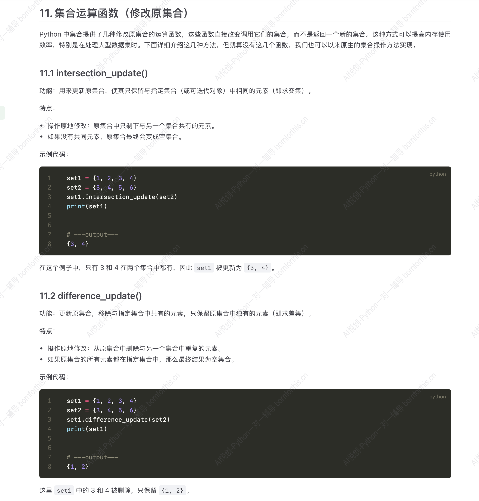

## 1. 如何创建集合

集合的创建主要有两种方式，可以看具体情况选择使用。

### 1.1 直接使用花括号 `{}` 创建集合

当我们知道集合中的元素时，可以直接使用花括号 `{}` 来定义集合。需要注意的是，集合中的元素是无序的，每次打印时显示的顺序可能不同。

```python
set = {1, 2, 4, 5, 8}
print(set)

#-------output-------
{1, 2, 4, 5, 8}
```

### 1.2 使用 `set()` 函数创建集合

如果我们有一个列表或者其他可迭代对象，想要将其转化为集合，可以使用 `set()` 函数。这样做不仅可以创建集合，还能自动去除重复的元素。

```python
set1 = set([1, 2, 4, 1, 2, 8, 5, 5])
set2 = set([1, 9, 3, 2, 5])
print(set1)
print(set2)

#-------output-------
{1, 2, 4, 5, 8}
{1, 2, 3, 5, 9}
```

## 2. 集合的交集

交集（Intersection）：交集操作返回两个集合中都出现的元素，Python 中集合的交集使用 `&` 运算符来实现。

```python
set1 = {1, 2, 4, 5, 8}
set2 = {1, 2, 3, 5, 9}
print(set1 & set2)

#-------output-------
{1, 2, 5}
```

交集的函数：

```python
# 交集 .intersection() 或运算符 &
# 返回多个集合的交集，即所有集合共有的元素

a = {1, 2, 3}
b = {2, 3, 4}
c = a.intersection(b)
print(c)

#-------output-------
{2, 3}
```


## 3. 集合的并集

并集（Union) ：并集操作返回两个集合中所有的元素，相同的元素只保留一次，可以使用 `|` 运算符来求并集。

```python
set1 = {1, 2, 4, 5, 8}
set2 = {1, 2, 3, 5, 9}
print(set1 | set2)

#-------output-------
{1, 2, 3, 4, 5, 8, 9}
```


```python
basket1= {'生花生', '盐焗花生', '蜂蜜花生'}
basket2 = {'盐焗花生', '香辣花生', '烤花生'}
all_peanuts = basket1 | basket2
print(all_peanuts)

#-------output-------
{'烤花生', '蜂蜜花生', '生花生', '香辣花生', '盐焗花生'}
```


并集的函数：

```python
# 并集 .union() 或运算符 |
# 返回一个新集合，包含所有参与运算的集合中的元素

a = {1, 2, 3}
b = {4, 5, 6}
c = a.union(b)
print(c)

#-------output-------
{1, 2, 3, 4, 5, 6}
```


## 4. 集合的差集

差集（Difference）：差集操作返回存在于第一个集合中，但不存在于第二个集合中的元素，用 `-` 运算符实现差集运算。

```python
set1 = {1, 2, 4, 5, 8}
set2 = {1, 2, 3, 5, 9}
print(set1-set2)


basket1= {'生花生', '盐焗花生', '蜂蜜花生'}
basket2 = {'盐焗花生', '香辣花生', '烤花生'}
unique_to_basket1 = basket1 - basket2
print(unique_to_basket1)

#-------output-------
{8, 4}
{'生花生', '蜂蜜花生'}
```


差集的函数

```python
# 差集 .difference() 或运算符 -
# 返回集合与其他集合的差集，即只在该集合中存在，不在其他集合中的元素。

a = {1, 2, 3, 4}
b = {3, 4, 5}
c = a.difference(b)
print(c)

#-------output-------
{1, 2}
```


## 5. 对称差集

对称差集（Symmetric Difference)：对称差集返回那些只存在于其中一个集合的元素（即不同时出现在两个集合中的元素）。使用 `^` 运算符来求对称差集。

```python
set1 = {1, 2, 4, 5, 8}
set2 = {1, 2, 3, 5, 9}
print(set1^set2)


# 偶像A的粉丝团
fans_A = {'张三', '李四', '王五', '赵六'}

# 偶像B的粉丝团
fans_B = {'王五', '赵六', '孙七', '周八'}

# 得到只在一个粉丝团中出现的忠诚粉丝，排除墙头草
loyal_fans = fans_A ^ fans_B
print(loyal_fans)

#-------output-------
{3, 4, 8, 9}
{'张三', '周八', '孙七', '李四'}
```


对称差集的函数

```python
# 对称差集 .symmetric_difference() 或运算符 ^
# 返回两个集合的对称差集，即那些只出现在其中一个集合的元素

a = {1, 2, 3}
b = {3, 4, 5}
c = a.symmetric_difference(b)
print(c)

#-------output-------
{1, 2, 4, 5}
```


## 6. 对称差集的其他实现方法

对称差集是两个集合的并集除去两个集合的交集。

```python
set1 = {1, 2, 4, 5, 8}
set2 = {1, 2, 3, 5, 9}
print((set1 | set2) - (set1 & set2))


# 偶像A的粉丝团
fans_A = {'张三', '李四', '王五', '赵六'}

# 偶像B的粉丝团
fans_B = {'王五', '赵六', '孙七', '周八'}

# 得到只在一个粉丝团中出现的忠诚粉丝，排除墙头草
loyal_fans = (fans_A | fans_B) - (fans_A & fans_B)
print(loyal_fans)

#-------output-------
{3, 4, 8, 9}
{'张三', '周八', '孙七', '李四'}
```


## 7. 如何创建空集

python 中用 `set()` 来表示空集 

```python
#如何创建空集
set1 = set()
print(set1, type(set))

#-------output-------
set() <class 'set'>
```

直接用花括号创建，类型会默认为字典，例子如下：

```python
e = {}
print(e, type(e))

#-------output-------
{} <class 'dict'>
```


## 8. `.add()`  添加元素

集合是可变的数据结构，可以通过 `.add()` 的方法在集合中添加元素。若添加的元素已经存在，则集合不变。

```python
set1 = {1, 2, 3, 5, 8}
set1.add(10)
print(set1)

#-------output-------
{1, 2, 3, 5, 8, 10}
```


## 9. `.update()` 批量添加

`.update()` 可以将其他可迭代对象（如：列表、集合、元组等）中所有的元素添加到原集合中。

特点：

- 自动去重：如果目标集合中已经出现某个元素，则不会重复添加。
- 操作原地修改：指修改后的结果直接保存在原集合中，而不返回新的集合。

```python
set1 = {1, 2, 3}
set1.update([4, 5, 6])
print(set1)

#-------output-------
{1, 2, 3, 4, 5, 6}
```


## 10. `.remove()` 移除元素

`.remove()` 可以从集合中删除指定元素。

```python
set1 = {1, 2, 3, 4, 5}
set1.remove(2)
print(set1)

#-------output-------
{1, 3, 4, 5}
```

若该元素不存在，则会抛出 `KeyError` 异常，因此可以在使用前判断元素是否存在，或者使用 `discard()` 方法避免异常。

```python
set1 = {1, 2, 3, 4, 5}
set1.remove(10)
print(set1)

#-------output-------
Traceback (most recent call last):
  File "D:\Coder\test 1\test 1.1.py", line 2, in <module>
    set1.remove(10)
KeyError: 10
```


## 11. `.discard()` 移除元素

`.discard()` 用来移除集合中的指定元素，若元素存在则删除，**若元素不存在则不会报错，也不会对原集合产生任何影响** 。

```python
set1 = {1, 2, 3, 4, 5}
set1.discard(10)
print(set1)

#-------output-------
{1, 2, 3, 4, 5}
```


## 12. `.pop()` 随机删除元素

`.pop()` 只能随机删除集合中的一个元素，如果集合为空，则会抛出 `KeyError` 。

但这种方法不推荐，因为集合无序，我们无法确定删除的是哪一个数据。

```python
set1 = {1, 2, 3}
item = set1.pop()
print(item)
print(set1)

#-------output-------
1
{2, 3}
```

使用场景举例：

```python
# 场景一：随机提取并移除集合中的元素
# 当想从集合中随机抽取元素进行后续处理，并要保证该元素不被重复使用，就可以用 .pop()。
tasks = {'taskA', 'taskB', 'taskC'}

while tasks:
    task = tasks.pop()
    print(f'正在处理：{task}')
    
#-------output-------
正在处理：taskC
正在处理：taskA
正在处理：taskB
```


```python
# 场景二：逐一处理并清除集合内元素
# 有时需要逐个处理并从集合中删除元素，并不关心具体的处理顺序，直到集合为空时

tasks = {'吃饭', '睡觉', '打代码', '看电影'}

while tasks:
    task = tasks.pop()
    print(f'正在处理任务：{task}')

print(f'所有任务处理完毕：{tasks}')

#-------output-------
正在处理任务：看电影
正在处理任务：打代码
正在处理任务：吃饭
正在处理任务：睡觉
所有任务处理完毕：set()
```


## 13. `.clear()` 清空集合

```python
tasks = {'吃饭', '睡觉', '打代码', '看电影'}
tasks.clear()
print(tasks)

#-------output-------
set()
```


## 14. 关系判断

### 14.1  `.issubset()` 判断子集

判断当前集合是否为其他集合的子集，即集合中所有元素是否都包含在另一个集合中。

```python
a = {1, 2}
b = {1, 2, 3}
result = a.issubset(b)
print(result)

#-------output-------
True
```


### 14.2 `.issuperset()` 判断超集

判断当前集合是否为其他集合的超集，即是否包含另一个集合的所有元素。

```python
a = {1, 2, 3}
b = {1, 2}
result = a.issuperset(b)
print(result)

#-------output-------
True
```


### 14.3 `.isdisjoint()` 判断交集

判断两个集合是否没有交集（即交集为空），没有交集则为 `True` 。

```python
a = {1, 2}
b = {3, 4}
result = a.isdisjoint(b)
print(result)

#-------output-------
True
```


## 15. 集合运算函数




## 16. 小试牛刀


Answer:

```python
# 获取输入
s_input = input('请输入一个英文句子： ')

# 将标点符号删除
s_input_replace = s_input.replace(',', '').replace('.', '').replace('?', '').replace('!', '')

# 把大写都转化成小写
s_input_lowercase = s_input_replace.lower()

# split
s_split = s_input_lowercase.split(' ')

# 转换成集合剔除重复
s_set = set(s_split)

print(s_set)
print(len(s_set))

#-------output-------
请输入一个英文句子： The quick brown fox jumps over the lazy dog. . . , !
{'lazy', '', 'brown', 'jumps', 'over', 'quick', 'fox', 'dog', 'the'}
9
```


**注意：遇到连续的分割字符时，若指定分割字符，则会返回空字符串，因此需要注意，因为默认是空格分割，因此不需要空字符串时直接默认即可。** 


修改：(line13)

```python
# 获取输入
s_input = input('请输入一个英文句子： ')

# 将标点符号删除
s_input_replace = s_input.replace(',', '').replace('.', '').replace('?', '').replace('!', '')

# 把大写都转化成小写
s_input_lowercase = s_input_replace.lower()


# split
s_split = s_input_lowercase.split()

# 转换成集合剔除重复
s_set = set(s_split)

print(s_set)
print(len(s_set))

#-------output-------
请输入一个英文句子： The quick brown fox jumps over the lazy dog. . . , !
{'over', 'brown', 'fox', 'the', 'dog', 'quick', 'jumps', 'lazy'}
8
```


