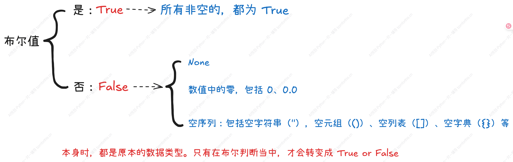

## 1. 条件判断（布尔值）

```python
temperature = 30
is_hot = temperature > 25
print(f'Is it hot? {is_hot}')

weather = 'sunny'
is_sunny = (weather == 'sunny')
print(f'Is it sunny? {is_sunny}')

should_go_swimming = is_hot and is_sunny
print(f'Should go swimming? {should_go_swimming}')

#-------output-------
Is it hot? True
Is it sunny? True
Should go swimming? True
```


## 2. 布尔运算中的空

在判断时，需要注意：




示例如下：

```python
# 当做正常变量使用时，虽然数据是空的，但是都是原本的数据类型
string = ''
dictionary = {}
lst = []
tup = ()
set_1 = set()

print(f'空字符串："{string}", type: {type(string)}')
print(f'空字典：{dictionary}, type: {type(dictionary)}')
print(f'空列表：{lst}, type: {type(lst)}')
print(f'空元组：{tup}, type: {type(tup)}')
print(f'空集合：{set_1}, type: {type(set_1)}')

# 只有在布尔运算或者强制转换中，空序列等都会得到 False：
# 以下为空数据结构通过 bool() 转换后的类型和值
string = bool('')
print(f"'' → type: {type(string)}, value: {string}")


dictionary = bool({})
print(f"{{}} → type: {type(dictionary)}, value: {dictionary}")

lst = bool([])
print(f'[] → type: {type(lst)}, value: {lst}')

tup = bool(())
print(f'() → type: {type(tup)}, value: {tup}')

set_1 = bool(set())
print(f'set() → type: {type(set_1)}, value: {set_1}')

#-------output-------
空字符串："", type: <class 'str'>
空字典：{}, type: <class 'dict'>
空列表：[], type: <class 'list'>
空元组：(), type: <class 'tuple'>
空集合：set(), type: <class 'set'>
'' → type: <class 'bool'>, value: False
{} → type: <class 'bool'>, value: False
[] → type: <class 'bool'>, value: False
() → type: <class 'bool'>, value: False
set() → type: <class 'bool'>, value: False
```


## 3. 逻辑运算符

逻辑运算只存在于布尔类型中。

`and`  逻辑 “与”，当运算符两边的运算对象都为 True 时，结果为 True；

`or`  逻辑“或”，当运算符两边的运算对象的其中一个为 True 时，结果为 True；

`not` 逻辑“非”，用于反转运算对象的状态（一个运算对象即可）。

```python
In [1]: not False
Out[1]: True

In [2]: not True
Out[2]: False

In [3]: not False and True or False
Out[3]: True

In [4]: not True or not False
Out[4]: True

In [5]: not True or False and True
Out[5]: False

In [6]: (not False and True) or False
Out[6]: True

In [7]: not (True or False) and (False or True)
Out[7]: False

In [8]: not (True and  False) and (False or True)
Out[8]: True
```


- 逻辑运算符的优先级：not 优先于 and， 而 and 又高于 or。
- 短路求值：在 and 中，如果左侧为 False ，右侧不会被求值；在 or 中，如果左侧为 True，则右侧不会被求值。
- 通过加括号可以明确表达式的求值顺序，从而使代码更易读、更不容易出错。


## 4. 运算结果与短路求值


| 3 and 5         | True and True      | True      | 5              |
| --------------- | ------------------ | --------- | -------------- |
| **3 or 5**      | **True or True**   | **True**  | **3**          |
| **0 or 5**      | **False or True**  | **True**  | **5**          |
| **3 and not 5** | **True and False** | **False** | **返回值为空** |


短路求值：

```python
# 如何证明出现了短路求值
# 运行了 10/0 时会报错
# print(10/0)

print(True or (10/0))

#-------output-------
True
```

```python
condition = False or print('我被执行了！')
print(condition)

#-------output-------
我被执行了！
None       # 因为 print('我被执行了！') 是执行代码，没有返回值，所以 condition 输出了 None
```


## 5. 表达式应用——条件测试

在编程中，表达式常用于条件测试，帮助我们根据不同情况执行不同代码。常见应用场景包括：

- 比较操作：检查一个变量是否等于或不等于某个特定值，或比较两个数字的大小。
- 成员资格测试：判断一个特定值是否存在于某个序列（如列表、字符串、元组）中。


### 5.1 使用 and 检查多个条件

```python
age_lilei = 17
age_hanmeimei = 18
result1 = age_lilei >= 18 and age_hanmeimei >= 18
print(result1)

result2 = age_lilei >= 15 and age_hanmeimei >= 15
print(result2)

#-------output-------
False
True
```


### 5.2 使用 or 检查多个条件

```python
age_lilei = 17
age_hanmeimei = 18
result1 = age_lilei >= 18 or age_hanmeimei >= 15
print(result1)

result2 = age_lilei >= 20 or age_hanmeimei >= 20
print(result2)

#-------output-------
True
False
```


