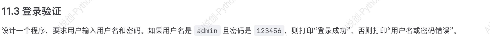
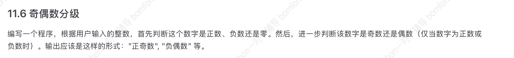
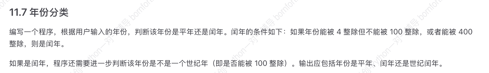

## 1. Python 代码缩进问题

缩进可以四个空格，也可以是 Tab，但是不可以混用，否则会报错。

缩进逻辑不对也会报错。

## 2. if 判断用户输入

- 判断性别：

```python
user_gender = input("Enter your gender(F/M): ")
if user_gender == "F":
    print('你是萌妹子')
elif user_gender == "M":
    print('你是糙汉子')
else:
    print('输入不正确，请输入F或M')

#-------output-------
Enter your gender(F/M): F
你是萌妹子
```

- 判断数字奇偶：

```python
number_input = int(input("Enter a number: "))
if number_input % 2 == 0:
    print('该数字是偶数')
else:
    print('该数字是奇数')
    
#-------output-------
Enter a number: 10
该数字是偶数
```

## 3. if 检查数字范围：

```python
number_input = int(input("Enter a number: "))

# 检查数字范围
if number_input < 0:
    print('这是一个负数')
elif number_input == 0:
    print('数字是零')
elif number_input >0 and number_input <= 10:
    print('数字在 1 到 10 之间')
elif number_input > 10 and number_input <= 20:
    print('数字在 11 到 20 之间')
elif number_input > 20 and number_input <= 30:
    print('数字在 20 到 30 之间')
else:
    print('数字大于 30')
    
#-------output-------
Enter a number: 35
数字大于 30
```

可以简化成如下形式：

```python
number_input = int(input("Enter a number: "))

# 检查数字范围
if number_input < 0:
    print('这是一个负数')
elif number_input == 0:
    print('数字是零')
elif 0 < number_input <= 10:
    print('数字在 1 到 10 之间')
elif 10 < number_input <= 20:
    print('数字在 11 到 20 之间')
elif 20 < number_input <= 30:
    print('数字在 20 到 30 之间')
else:
    print('数字大于 30')
```

最终优化（上一个条件没满足才会进入下一个条件，所以“与上一个条件未满足”等价的代码可以省略）：

```python
number_input = int(input("Enter a number: "))

# 检查数字范围
if number_input < 0:
    print('这是一个负数')
elif number_input == 0:
    print('数字是零')
elif number_input <= 10:
    print('数字在 1 到 10 之间')
elif number_input <= 20:
    print('数字在 11 到 20 之间')
elif number_input <= 30:
    print('数字在 20 到 30 之间')
else:
    print('数字大于 30')
```


## 4. 理解条件判断：if 连写 vs. if…elif…else

多个 if 使用可能存在问题：

```python
score = 90
if score >= 90:
    print("优秀")
if score >= 80:
    print("良好")
if score >= 60:
    print("及格")
else:
    print("不及格")
    
#-------output-------
优秀
良好
及格
```

`if…elif…else` 使用：

```python
score = 90
if score >= 90:
    print("优秀")
elif score >= 80:
    print("良好")
elif score >= 60:
    print("及格")
else:
    print("不及格")
    
#-------output-------
优秀
```


###  多个 if 连写和  if…elif…else 如何选择

需要的结果互斥，选择 `if…elif…else` ，若不需要互斥，则可以考虑多个 if 连写。 

- 选择多个 if ：

例子一：

疫情期间判断是否阳性/高风险/红码

```python
is_positive = False    # 是否阳性
from_high_risk_area =  True     # 是否来自高风险地区
is_health_code_green = False    # 健康码是否绿码

# 单独检查是否阳性
if is_positive:
    print('你是阳性患者，请立即隔离！')

# 单独检查是否来自高风险地区
if from_high_risk_area:
    print('你来自高风险地区，请进行核酸检测并报备！')

# 单独检查健康码是否绿码
if not is_health_code_green:
    print('你的健康码不是绿码，暂时无法进入公共场所！')
    
#-------output-------
你来自高风险地区，请进行核酸检测并报备！
你的健康码不是绿码，暂时无法进入公共场所！
```

为何不能使用 and ？

```python
is_positive = False    # 是否阳性
from_high_risk_area =  True     # 是否来自高风险地区
is_health_code_green = False    # 健康码是否绿码

# 检查是否需要隔离
if is_positive and from_high_risk_area and is_health_code_green:
    print('隔离')
else:
    print('不隔离')

#-------output-------
不隔离
```

上述例子中，该人员需要隔离，但是用 `and` 需要左右两个条件都满足，因此输出结果为 `不隔离` ，出现错误。

那么什么情况下可以使用 and ?

```python
username = 'admin'
password = '123456'

if username == 'admin' and password == '123456':
    print('Login Successful')
else:
    print('Login Failed')

#-------output-------
Login Successful
```


例子二：

检查一个数字的多个属性

```python
number = 12

if number % 2 == 0:
    print('是偶数')
if number % 3 == 0:
    print('能被3整除')
if number > 10:
    print('大于10')
    
#-------output-------
是偶数
能被3整除
大于10
```


- 选择 `if…elif…else` 

观影：

```python
age = 70

if age < 5:
    print('小朋友你可以免费观影哦~')
elif age <= 18:
    print('青少年半价票，请支付25元！')
elif age <= 60:
    print('全价票，请支付50元！')
else:
    print('老人家，您可以免费观影哦~')

#-------output-------
老人家，您可以免费观影哦~
```


Quiz:

优化下列代码使其可以忽视用户的大小写：

```python
user_gender = input('请输入您的性别（F/M）：')

if user_gender == 'F':
    print('你是萌妹子')
elif user_gender == 'M':
    print('你是糙汉子')
else:
    print('输入错误，请输入 F 或 M ')
    
```

Answer:

```python
user_gender = input('请输入您的性别（F/M）：').upper()

if user_gender == 'F':
    print('你是萌妹子')
elif user_gender == 'M':
    print('你是糙汉子')
else:
    print('输入错误，请输入 F 或 M ')
```


不用内置函数的方法：

```python
user_gender = input('请输入您的性别（F/M）：')

if user_gender == 'F' or user_gender == 'f':
    print('你是萌妹子')
elif user_gender == 'M' or user_gender == 'm':
    print('你是糙汉子')
else:
    print('输入错误，请输入 F 或 M ')
```


易错点：

line 3 和 line5

注意在 `or` 判断时，左右两边有一边为 `True` 就成功执行，因此 `line3` 判断的不是性别是 `F` 或 `f`  ，而是判断出 `f`  为 `True` ，因此恒成立，因此不管输入什么都会输出“你是萌妹子”。

```python
user_gender = input('请输入您的性别（F/M）：')

if user_gender == 'F' or 'f':
    print('你是萌妹子')
elif user_gender == 'M' or 'm':
    print('你是糙汉子')
else:
    print('输入错误，请输入 F 或 M ')
```


## 5. if 的嵌套

```python
user_gender = input('请输入您的性别（F/M）：')
user_is_student = input('您是学生吗？（Y/N）：')

if user_gender == 'F':
    if user_is_student == 'Y':
        print('你是萌妹子学生')
    elif user_is_student == 'N':
        print('你是萌妹子')
    else:
        print('输入不正确')
elif user_gender == 'M':
    print('你是糙汉子')
else:
    print('输入错误，请输入 F 或 M ')

#-------output-------
请输入您的性别（F/M）：F
您是学生吗？（Y/N）：Y
你是萌妹子学生
```


## 6. 站位语句 pass

`pass` 可以理解为“站位语句”。例如，编写程序时暂时不知道这个位置需要写什么代码，或者还没实现具体的逻辑，需要先让代码结构完整，能够运行（否则会报错），就用 `pass` 来填充，类似“此处待写”的意思。


### 6.1 为什么需要 pass

在 python 中，只写了一个空的函数/循环/条件语句，而什么都不做时会报错，因此需要一个东西保证结构存在，但又不执行任何操作，那么 `pass` 就可以派上用场。

例如： 

待办清单

- 早上：____
- 中午：____
- 晚上：____

```python
def future_function():
    pass    # 占位，表示日后这里会实现具体功能

x = 10
if x > 5:
    pass    # 之后再写具体操作
else:
    print('x <= 5，直接进行处理')
```


## 6.2 判断用户输入奇偶

### 6.2.1 初始版及遇到的问题

判断数字的奇偶，[原代码](2-if-判断用户输入)如下，会出现输入非数字报错的情况，如何修改使其遇到非数字情况也能正常运行？

```python
number_input = int(input("Enter a number: "))
if number_input % 2 == 0:
    print('该数字是偶数')
else:
    print('该数字是奇数')
    
#-------output-------
Enter a number: 10
该数字是偶数
```

Answer:

```python
number_input = input("Enter a number: ")
digit = number_input.isdigit()

if not digit:
    pass
elif int(number_input) % 2 == 0:
     print('该数字是偶数')
else:
    print('该数字是奇数')
```


### 6.2.2 优化1：去掉冗余判断

```python
number_input = input("Enter a number: ")

if number_input.isdigit() == True:             # 判断输入是否纯数字，这步可简化为if number_input.isdigit()
    number_input = int(number_input)
    if number_input % 2 == 0:
        print('该数字是偶数')
    else:
        print('该数字是奇数')
else:
    print('不是纯数字')  
```


### 6.2.3 优化2：减少嵌套，提高可读性

```python
number_input = input("Enter a number: ")

if not number_input.isdigit():
    print('不是纯数字')
elif int(number_input) % 2 == 0:
     print('该数字是偶数')
else:
    print('该数字是奇数')
```


## 6.3 最大数判断

编写一个程序，接收三个整数作为输入，并输出其中的最大值。

Answer:

```python
number1 = int(input('请输入第一个整数：'))
number2 = int(input('请输入第二个整数：'))
number3 = int(input('请输入第三个整数：'))

if number1 > number2 and number1 > number3:
    print(number1)
elif number2 > number3:
    print(number2)
elif number3 > number2:
    print(number3)
```

上述回答存在风险：

因为用的是`and` ，如果左侧判断是 `False` ，那么 `and` 右侧的代码则不会执行，该题目下可能可以实现，但需要多次测试保证没有遗漏。

更稳妥的方法如下：

```python
number1 = int(input('请输入第一个整数：'))
number2 = int(input('请输入第二个整数：'))
number3 = int(input('请输入第三个整数：'))

if number1 >= number2 and number1 >= number3:
    print(number1)
elif number2 >= number1 and number2 >= number3:
    print(number2)
else:
    print(number3)
```


## 7. 课后作业









