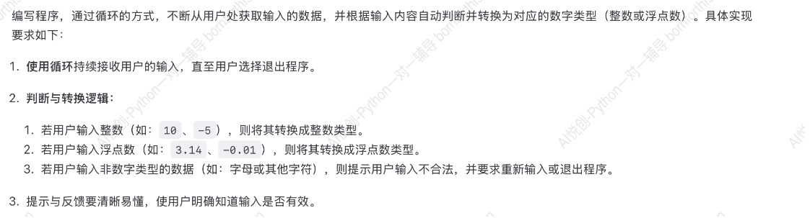

## 1. 检查用户输入

不用循环满足用户输入错误2次：

```python
user_gender = input('Enter your gender(F/M): ')
if user_gender == "F":
    print('你是萌妹子')
elif user_gender == "M":
    print('你是糙汉子')
else:                                                    # else 后面不能跟条件，但是可以跟多条代码
    user_gender = input("输入错误请重新输入F或M: ")
    if user_gender == "F":
        print('你是萌妹子')
    elif user_gender == "M":
        print('你是糙汉子')
    else:
        print('输入错误，请重新输入F或M')
        
#-------output-------
Enter your gender(F/M): N
输入错误请重新输入F或M: N
输入错误，请重新输入F或M

Enter your gender(F/M): F
你是萌妹子
```

问题：错误超过2次要继续嵌套。


## 2. 使用 while 循环解决用户输入问题

 `while` 循环 当…一直循环


while 条件表达式：             (while 后是 True 的时候才能执行)

​	循环体 （缩进的代码块）

```python
user_answer_correct = False

while not user_answer_correct:
    user_gender = input("Please enter your gender (M/F): ")
    if user_gender == "F":
        print("你是萌妹子")
        user_answer_correct = True
    elif user_gender == "M":
        print("你是糙汉子")
        user_answer_correct = True
    else:
        print("输入不正确，请输入正确的性别（F/M）")
```


A1: 当程序输出 “你是萌妹子” 或 “你是糙汉子” 或 ”输入不正确，请输入正确的性别（F/M）“ 时停止。


A2+A3：如果不用单独变量，用 `while True` 时，程序会变成：

```python
while True:
    user_gender = input("Please enter your gender (M/F): ")
    if user_gender == "F":
        print("你是萌妹子")
        user_answer_correct = True
    elif user_gender == "M":
        print("你是糙汉子")
        user_answer_correct = True
    else:
        print("输入不正确，请输入正确的性别（F/M）")
```

那么条件一直是`True` ，就会一直循环下去，因此需要一个变量来改变这个条件的状态：

```python
user_answer_correct = True

while user_answer_correct:
    user_gender = input("Please enter your gender (M/F): ")
    if user_gender == "F":
        print("你是萌妹子")
        user_answer_correct = False
    elif user_gender == "M":
        print("你是糙汉子")
        user_answer_correct = False
    else:
        print("输入不正确，请输入正确的性别（F/M）")
```

但上述代码还存在一个问题，当输入正确时，`user_answer_correct` 的状态是 `False` ，与输入正确这个状态相反，为了统一，因此用`while not` 。


## 3. while 循环中的逆向思维

思考下面的代码输出是什么？

```python
i = 1

while i < 10:
    print(i)
    i = i + 1
```

思路：

用结果倒推：什么时候 `i < 10` 是 `False` ？ i = 10 的时候，倒推回去 10 = i + 1，上一个输出的 i 就是 9 ，因此输出结果为 1到 9。


## 4. while 循环实现求和

用 while 循环实现计算 0 ~ 100 的和。

## 4.1 循环的次数问题

先思考如何输出0 ~ 100 的数？

```python
num = 0

while num < 100:
    num += 1
    print(num)
```

上述代码的输出是 1 到 100，这样会将 num = 0 的这一次略掉，相当于跳过了一次循环。

修改 `print(num)` 和 `num += 1` 的顺序：

```python
num = 0

while num < 100:
    print(num)
    num += 1
```

输出为 0 到 99 ，可以将 line3 修改为 `while num <= 100:` 或者 `while num < 101:` 来解决100的输出。

综上，`执行代码` 和 `循环次数代码` 的顺序问题需要格外注意。

### 4.2 固定边界循环求和

```python
i = 0                 # 当前要加的数字从0开始
total = 0             # 存储每次相加后的结果

while i <= 100:
    total += + i      # 将 i 的值加入 total
    i = i + 1         # 准备下一个数字

print(total)

#-------output-------
5050
```


### 4.3 用户输入边界循环求和

```python
# 获取用户输入
min_num = int(input("请输入连续相加的最小值："))           # 要加的数字从 min_num 开始
max_num = int(input("请输入连续相加的最大值："))           # 要加的数字到 max_num 结束

i = min_num           # 循环中要加的初始数字
total = 0             # 存储每次相加后的结果

while i <= max_num:
    total += i            # 从 min_num 开始将逐次递增的值加入 total
    i = i + 1             # 准备下一个数字

print(f"从{min_num}到{max_num}的和是{total}")

#-------output-------
请输入连续相加的最小值：0
请输入连续相加的最大值：100
从0到100的和是5050
```


## 5. 小试牛刀

### 5.1 实现更灵活的数字转换



 

#### 5.1.1 **尝试解决过程出现的错误**

**错误1：** 

以下为尝试阶段的代码，出现不停循环的问题：

```python
num_input = input("请输入数字：")

is_digit = False

while not is_digit:
    if num_input.isdigit():
        print("输入不合法，请重新输入数字或退出程序")
    elif num_input.find(".") == -1:
        num_input = int(num_input)
        print(f"该数字是整数: {num_input}, 类型为{type(num_input)}")
        is_digit = True
    elif num_input.find(".") != -1:
        num_input = float(num_input)
        print(f"该数字是浮点数：{num_input}，类型为 {type(num_input)}")
        is_digit = True
```

原因在于，获取用户输入写在最开始，若输入的不是数字，则会执行 `print("输入不合法，请重新输入数字或退出程序")` ，因为 `while` 循环中不包括重新输入 `input` 这条命令，`num_input.isdigit()` 的状态不变，`is_digit` 的状态也不变，就会一直循环下去。

修改如下：

```python
is_digit = False

while not is_digit:
    num_input = input("请输入数字：")
    if not num_input.isdigit():
        print("输入不合法，请重新输入数字或退出程序")
    else:
        print("是数字")
        is_digit = True
```


**错误2：** 

`.isdigit()` 只能判断字符串内是否全是数字，若用户输入的是负数，则出现负号，也会判定为非数字。


**错误3：** 

按照上述逻辑通过小数点判断浮点数，若输入出现两个小数点或者输入的字符串中带有小数点？

---


**Answer:**

```python
is_digit = False

while not is_digit:
    num_input = input("请输入数字：").strip()      # 获得输入，并清除字符串左右两侧的空格
    if num_input.isdigit() or num_input[0] == '-' and num_input[1:].isdigit():    
        # 判断字符串是否全是整数或负整数
        print(f'该数字是整数：{int(num_input)}')
        is_digit = True
    elif '.' in num_input:
        if num_input.split('.')[0].isdigit() and num_input.split('.')[1].isdigit() and len(num_input.split('.')) == 2\
            or num_input[0] == '-' and num_input[1:].split('.')[0].isdigit() and num_input[1:].split('.')[1].isdigit() and len(num_input.split('.')) == 2:
            print(f'该数字是浮点数：{float(num_input)}')
            is_digit = True
        else:
            print('该输入不合法，请重新输入或退出程序！')
    else:
        print('该输入不合法，请重新输入或退出程序！')
```


---


**其他代码可选/优化：** 

- **建议一：** 原代码 line5 需要加括号保证优先级，防止出现错误：

```python
if num_input.isdigit() or (num_input[0] == '-') and (num_input[1:].isdigit()):  
```


- **建议二：** 判断是否为负数的时候，可以用内置函数 `.startswith()` 判断，因此 line5 可修改如下：

```python
    if num_input.isdigit() or num_input.startswith('-') and num_input[1:].isdigit():    
```


- **建议三：** line7 直接输出 `print(f'该数字是整数：{int(num_input)}')` ，可以将 `int(num_input)` 命名为一个变量。

```python
number = int(num_input)
print(f'该数字是整数：{number}')
```

- **建议四：** 代码逻辑：先成功运行一遍，再在外面套上一个 `while` 实现多次。

    前面加上 `is_digit = False` 和 `while not is_digit` 

    后面需要放到 `while` 循环里的直接全选，按 `tab`  键即可。

    

- **建议五：** 浮点数解决办法：

    原代码中 line9  `elif '.' in num_input:`  条件过泛，不能直指浮点数的特点。

    浮点数里面只有一个点，多于一个点的情况就不成立，那么考虑用 `count()` 来限制点出现的次数：

```python 
elif num_input.count('.') == 1       # 输入中只有一个点
```


- **建议六：** line 10 - line 11 中 `num_input.split('.')` 需要多次使用，可以在运行一次后直接赋值为变量，不仅简化了代码的长度，还减少了重复操作。

```python 
num_split = num_input.split('.')                          # 正数
        num_split2 = num_input[1:].split('.')             # 负数
        if num_split[0].isdigit() and num_split[1].isdigit() and len(num_split) == 2\
            or num_input.startwith('-') and num_split2[0].isdigit() and num_split2[1].isdigit() and len(num_split) == 2:
```

因为 line9 在上文进行了优化，对按照点分割得到的列表长度的判断可以去掉，得到代码如下：

```python 
if num_split[0].isdigit() and num_split[1].isdigit() or num_input.startswith('-') and num_split2[0].isdigit() and num_split2[1].isdigit():
```


- **建议七：** 返璞归真：不需要 split 就可判断是否为浮点数。

浮点数的小数点作祟，那把小数点去掉，就可以按照整数的逻辑来判断了：

```python
num_replace = num_input.replace('.','')
        if num_replace.isdigit() or num_replace.startswith('-') and num_replace[1:].isdigit():
```


#### 5.1.2 参考答案

##### 5.1.2.1 Luna&Friday 代码实现分析

::: tip 添加日期：2025-06-10 15:22:40

:::

学员 Luna&Friday 实现的代码如下：

```python
is_digit = False

while not is_digit:
    num_input = input("请输入数字：").strip()      # 获得输入，并清除字符串左右两侧的空格
    if num_input.isdigit() or num_input[0] == '-' and num_input[1:].isdigit():    
        # 判断字符串是否全是整数或负整数
        print(f'该数字是整数：{int(num_input)}')
        is_digit = True
    elif '.' in num_input:
        if num_input.split('.')[0].isdigit() and num_input.split('.')[1].isdigit() and len(num_input.split('.')) == 2\
            or num_input[0] == '-' and num_input[1:].split('.')[0].isdigit() and num_input[1:].split('.')[1].isdigit() and len(num_input.split('.')) == 2:
            print(f'该数字是浮点数：{float(num_input)}')
            is_digit = True
        else:
            print('该输入不合法，请重新输入或退出程序！')
    else:
        print('该输入不合法，请重新输入或退出程序！')
```

##### 5.1.2.2 整数判断分析

Luna 的代码如下：

```python
if num_input.isdigit() or num_input[0] == '-' and num_input[1:].isdigit():
```

- **建议一**：适当的添加括号，使逻辑、优先级更加明确；

    ```python
    if num_input.isdigit() or (num_input[0] == '-') and num_input[1:].isdigit():
    ```

- **建议二**：`num_input[0] == '-'` 代码，可以改进成使用 `num_input.startswith('-')` 来实现。

- **表扬👍**：想到使用 `num_input[0] == '-'` 这个非常好，很多人不一定想得到。并且在未来编程中，很多时候没有现成的方法实现，只不过现在刚好有 `.startswith()` 这个函数来实现。原本的 `num_input[0] == '-'` 实现，为未来独自实现解决代码，打下基础。


##### 5.1.2.3 浮点数判断分析

**Q1**

Luna 的代码如下：

```python
elif '.' in num_input:
```

这样的判断方法存在什么问题？

在说存在的问题时，我们先来说这行代码所要实现的目的：判断用户输入的数字，是不是小数。那么，小数有什么要求？——只有一个小数点。

但是上面👆的代码中，可以实现只有一个小数点的判断吗？——不行！

> 条件范围过泛，目标字符串中：存在 1 个点及以上都为 True。

推荐使用如下判断：

```python
elif num_input.count('.') == 1:  # 明确目标
```

这样的判断方法目标明确。

**Q2**

Luna 的代码如下：

```python
if num_input.split('.')[0].isdigit() and num_input.split('.')[1].isdigit() and len(num_input.split('.')) == 2 or num_input[0] == '-' and num_input[1:].split('.')[0].isdigit() and num_input[1:].split('.')[1].isdigit() and len(num_input.split('.')) == 2:
```

- **建议一**：重复使用 `num_input.split('.')` 结果，可以直接操作一次 spilt 后，把结果进行赋值，简化代码长度；
- **建议二**：使用创建变量这个方法，不是单纯的代码长度减少。根本优化是：减少了重复操作；

**优化代码如下：**

```python
nums_split = num_input.split('.')
if nums_split[0].isdigit() and nums_split[1].isdigit() and len(nums_split) == 2 or num_input[0] == '-' and num_input[1:].split('.')[0].isdigit() and num_input[1:].split('.')[1].isdigit() and len(num_input.split('.')) == 2:
```

后半部分判断重复出现：`num_input[1:].split('.')`

```python
nums_split = num_input.split('.')
nums_split2 = num_input[1:].split('.')
if nums_split[0].isdigit() and nums_split[1].isdigit() and len(nums_split) == 2 or num_input[0] == '-' and nums_split2[0].isdigit() and nums_split2[1].isdigit() and len(nums_split2) == 2:
```

接着进一步优化：`len(nums_split) == 2` 用来判断分割后的浮点数的数据，正常的浮点数以小数点分割后会得到列表，列表拥有小数点左右两个数据，故而 len 长度必须为 2。

而现在使用 `elif num_input.count('.') == 1:` 来作为先决条件，则不用再判断分割后的列表长度。

优化如下：

```python
if nums_split[0].isdigit() and nums_split[1].isdigit() or num_input[0] == '-' and nums_split2[0].isdigit() and nums_split2[1].isdigit():
```


**Q3 返璞归真** 

::: center

**浮点数的不一定要拆分小数点，才可以判断是否为正常小数（浮点数）。**

:::

Luna 的代码逻辑使用的是 split 拆分浮点数，来判断浮点数是否合法。那么接下来，试一试不使用 split 方法。

具体逻辑，前面讲解此题的时候已经讲过。直接放代码：

```python
elif user_input.count('.') == 1:
    if user_input.replace('.', '').isdigit() or (user_input.startswith('-') and user_input[1:].replace('.', '').isdigit()):
        number = float(user_input)
        print(f"你输入的是浮点数：{number}")
    else:
        print("输入不合法，请重新输入！")
```

::: center

**浮点数的小数点在作祟，那咱们就把小数点去掉！**

:::


##### 5.1.2.4 老师答案

```python
condition = False
while not condition:
    user_input = input("请输入一个数字：")

    if user_input.isdigit() or (user_input.startswith('-') and user_input[1:].isdigit()):
        number = int(user_input)
        print(f"你输入的是整数：{number}")
        condition = True
    elif user_input.count('.') == 1:
        if user_input.replace('.', '').isdigit() or (user_input.startswith('-') and user_input[1:].replace('.', '').isdigit()):
            number = float(user_input)
            print(f"你输入的是浮点数：{number}")
            condition = True
        else:
            print("输入不合法，请重新输入！")
    else:
        print("输入不合法，请重新输入！")
```

添加退出选择：

```python
condition = False
while not condition:
    user_input = input("请输入一个数字（输入 q 退出）：")
    if user_input.lower() == 'q':
        condition = True
    elif user_input.isdigit() or (user_input.startswith('-') and user_input[1:].isdigit()):
        number = int(user_input)
        print(f"你输入的是整数：{number}")
        condition = True
    elif user_input.count('.') == 1:
        if user_input.replace('.', '').isdigit() or (user_input.startswith('-') and user_input[1:].replace('.', '').isdigit()):
            number = float(user_input)
            print(f"你输入的是浮点数：{number}")
            condition = True
        else:
            print("输入不合法，请重新输入！")
    else:
        print("输入不合法，请重新输入！")
```


### 5.2 🎮 猜数字游戏

#### 5.2.1 📋 题目描述

编写一个 Python 程序，模拟“猜数字”游戏：

- 程序随机生成一个 1 到 100 之间的整数作为“目标数字”。
- 玩家每次输入一个猜测的数字。
- 程序根据玩家输入，提示：
    - “太大了”；
    - “太小了”；
    - 或“恭喜你猜对了！”。
- 玩家可以无限次猜，直到猜中为止。

#### 5.2.2 🛠️ 基本功能要求

1. 使用 `random.randint(1, 100)` 生成目标数字。
2. 使用 `input()` 接收玩家输入。
3. 使用 `while` 循环不断让玩家猜，直到猜对。
4. 每次猜错时输出提示，帮助玩家调整方向。
5. 猜中后，输出总共猜了几次。

#### 5.2.3 🌟 进阶挑战（选做）

1. **增加重玩功能：**
    - 在猜中后询问是否“再来一局”（输入 `y` 或 `n` ）；
    - 若选择 `y`，重新开始一轮游戏。
2. **添加最多猜 10 次的限制：**
    - 若 10 次内未猜中，输出失败信息和正确答案；
    - 若中途猜中则提前结束。
3. **美化输出，加入 emoji 或横线分隔提示：**
    - 如 `🎯 欢迎来到猜数字游戏！`；
    - 用 `print("="*30)` 来分割内容。

#### 5.2.4 ✅ 示例运行效果

```
🎯 欢迎来到猜数字游戏！
请输入你猜的数字（1-100）：50
太小了，再试试！
请输入你猜的数字（1-100）：75
太大了，再试试！
请输入你猜的数字（1-100）：65
恭喜你猜对了！你一共猜了 3 次！
是否再来一局？(y/n)：n
游戏结束，感谢游玩！
```


提示：

```python
import random
print(random.randint(1, 100))
```


**Answer:** 

```python
import random

while True:
    answer = random.randint(1, 100)          # 系统随机生成一个 1-100 的数字

    is_correct = False
    while not is_correct:
        user_input = input('请输入 1-100 的整数：')
        if user_input.isdigit() and 1 <= int(user_input) <= 100:
            if int(user_input) == answer:
                print('恭喜答对！')
                print('开始新一轮游戏。。。')
                is_correct = True
            elif int(user_input) < answer:
                print('小了！')
            else:
                print('大了！')
        else:
            print('输入错误，请输入 1-100 的整数！')
```


#### 5.2.5 参考答案

```python
import random

print('欢迎来到猜字游戏！')
print('=' * 30)

condition = False

while not condition:
    print('我已经想好了一个 1 到 100 之间的数字，你能猜中吗？')
    target = random.randint(1, 100)          # 系统随机生成一个 1-100 的数字
    max_attempts = 10
    attempts = 0
    
    while attempts < max_attempts:
        guess = input(f'请输入第 {attempts + 1} 次猜测：')
        attempts += 1
        
        if guess < target:
            print('太小了，再试试！\n')
        elif guess > target:
            print('太大了，再试试！\n')
        else:
            print(f'恭喜你猜对了！你一共猜了 {attempts} 次！')     # 内层猜数字循环结束（10次机会）
            attempts = 10                                     # 结束循环方法一
    else:
        print(f'很遗憾，你已经猜了 {max_attempts} 次都没猜中，正确答案是： {target}')
    
    again = input('是否再来一局？（Y/N）').strip().lower()
    if again != 'y':
        print('游戏结束，感谢游玩！')
        condition = True

print('\n' + '=' * 30 + '\n')    
```


line 24 结束循环方法二：

在外面加上一个条件：

```python
game_player_condition = False
    while (not game_player_condition) and (attempts < max_attempts):
        guess = input(f'请输入第 {attempts + 1} 次猜测：')
        attempts += 1

        if guess < target:
            print('太小了，再试试！\n')
        elif guess > target:
            print('太大了，再试试！\n')
        else:
            print(f'恭喜你猜对了！你一共猜了 {attempts} 次！')     # 内层猜数字循环结束（10次机会）
            game_player_condition = True
```


