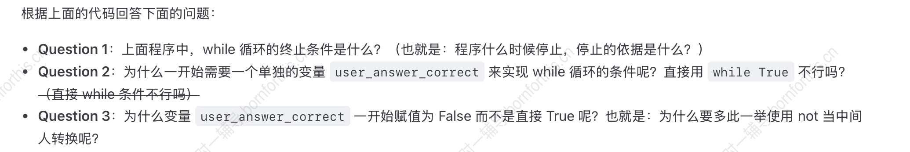
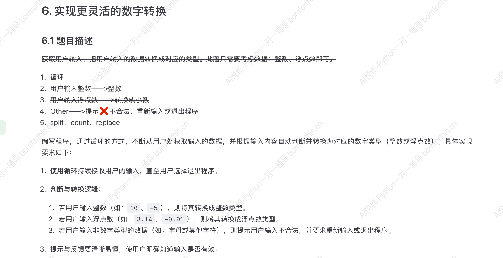

## 1. 检查用户输入

不用循环满足用户输入错误2次：

```python
user_gender = input('Enter your gender(F/M): ')
if user_gender == "F":
    print('你是萌妹子')
elif user_gender == "M":
    print('你是糙汉子')
else:                                                    # else 后面不能跟条件，但是可以跟多条代码
    user_gender = input("输入错误请重新输入F或M: ")
    if user_gender == "F":
        print('你是萌妹子')
    elif user_gender == "M":
        print('你是糙汉子')
    else:
        print('输入错误，请重新输入F或M')
        
#-------output-------
Enter your gender(F/M): N
输入错误请重新输入F或M: N
输入错误，请重新输入F或M

Enter your gender(F/M): F
你是萌妹子
```

问题：错误超过2次要继续嵌套。


## 2. 使用 while 循环解决用户输入问题

 `while` 循环 当…一直循环


while 条件表达式：             (while 后是 True 的时候才能执行)

​	循环体 （缩进的代码块）

```python
user_answer_correct = False

while not user_answer_correct:
    user_gender = input("Please enter your gender (M/F): ")
    if user_gender == "F":
        print("你是萌妹子")
        user_answer_correct = True
    elif user_gender == "M":
        print("你是糙汉子")
        user_answer_correct = True
    else:
        print("输入不正确，请输入正确的性别（F/M）")
```



A1: 当程序输出 “你是萌妹子” 或 “你是糙汉子” 或 ”输入不正确，请输入正确的性别（F/M）“ 时停止。


A2+A3：如果不用单独变量，用 `while True` 时，程序会变成：

```python
while True:
    user_gender = input("Please enter your gender (M/F): ")
    if user_gender == "F":
        print("你是萌妹子")
        user_answer_correct = True
    elif user_gender == "M":
        print("你是糙汉子")
        user_answer_correct = True
    else:
        print("输入不正确，请输入正确的性别（F/M）")
```

那么条件一直是`True` ，就会一直循环下去，因此需要一个变量来改变这个条件的状态：

```python
user_answer_correct = True

while user_answer_correct:
    user_gender = input("Please enter your gender (M/F): ")
    if user_gender == "F":
        print("你是萌妹子")
        user_answer_correct = False
    elif user_gender == "M":
        print("你是糙汉子")
        user_answer_correct = False
    else:
        print("输入不正确，请输入正确的性别（F/M）")
```

但上述代码还存在一个问题，当输入正确时，`user_answer_correct` 的状态是 `False` ，与输入正确这个状态相反，为了统一，因此用`while not` 。


## 3. while 循环中的逆向思维

思考下面的代码输出是什么？

```python
i = 1

while i < 10:
    print(i)
    i = i + 1
```

思路：

用结果倒推：什么时候 `i < 10` 是 `False` ？ i = 10 的时候，倒推回去 10 = i + 1，上一个输出的 i 就是 9 ，因此输出结果为 1到 9。


## 4. while 循环实现求和

用 while 循环实现计算 0 ~ 100 的和。

## 4.1 循环的次数问题

先思考如何输出0 ~ 100 的数？

```python
num = 0

while num < 100:
    num += 1
    print(num)
```

上述代码的输出是 1 到 100，这样会将 num = 0 的这一次略掉，相当于跳过了一次循环。

修改 `print(num)` 和 `num += 1` 的顺序：

```python
num = 0

while num < 100:
    print(num)
    num += 1
```

输出为 0 到 99 ，可以将 line3 修改为 `while num <= 100:` 或者 `while num < 101:` 来解决100的输出。

综上，`执行代码` 和 `循环次数代码` 的顺序问题需要格外注意。

### 4.2 固定边界循环求和

```python
i = 0                 # 当前要加的数字从0开始
total = 0             # 存储每次相加后的结果

while i <= 100:
    total += + i      # 将 i 的值加入 total
    i = i + 1         # 准备下一个数字

print(total)

#-------output-------
5050
```


### 4.3 用户输入边界循环求和

```python
# 获取用户输入
min_num = int(input("请输入连续相加的最小值："))           # 要加的数字从 min_num 开始
max_num = int(input("请输入连续相加的最大值："))           # 要加的数字到 max_num 结束

i = min_num           # 循环中要加的初始数字
total = 0             # 存储每次相加后的结果

while i <= max_num:
    total += i            # 从 min_num 开始将逐次递增的值加入 total
    i = i + 1             # 准备下一个数字

print(f"从{min_num}到{max_num}的和是{total}")

#-------output-------
请输入连续相加的最小值：0
请输入连续相加的最大值：100
从0到100的和是5050
```


## 5. 小试牛刀




