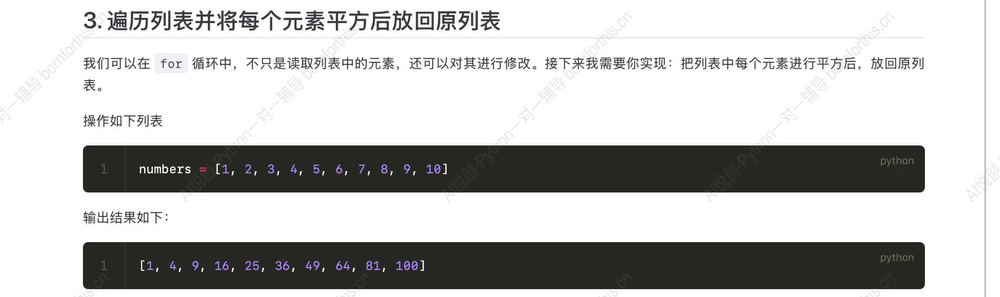
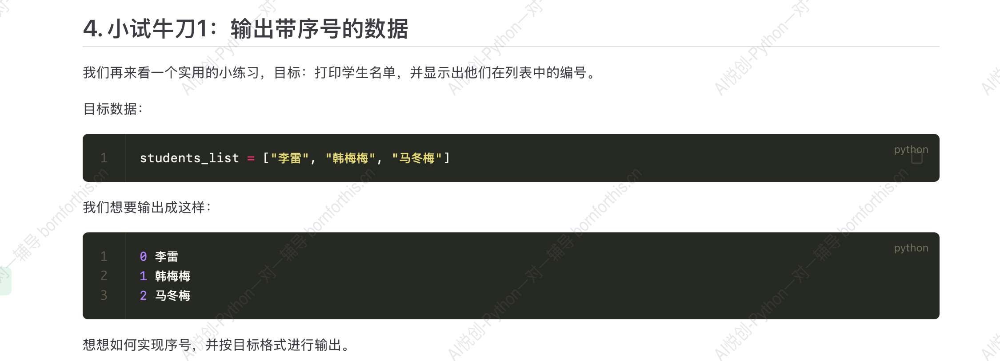
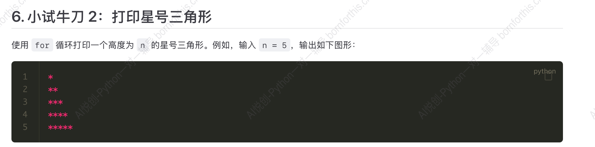
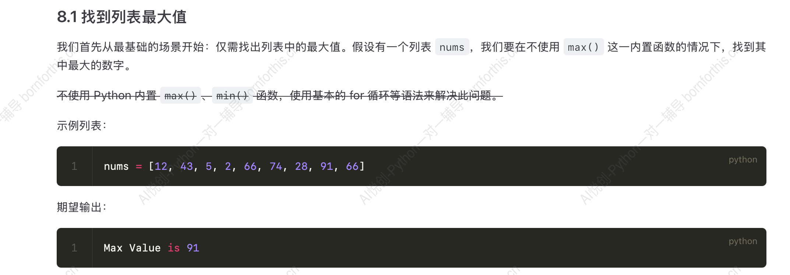

## 1. for 的语法

```python
for 变量 in 可迭代对象：
	循环体代码
```


代码：

代码中 `x` 是**临时变量**。

```python
for x in [1, 2, 3]:
    print(x)

print('循环结束后，x 的值为：', x)

#-------output-------
1
2
3
循环结束后，x 的值为： 3
```

例子：

```python
student_list = ['李雷', '韩梅梅', '马冬梅']
for student in student_list:
    print(student)
    
#-------output-------
李雷
韩梅梅
马冬梅
```

## 2. while 循环实现 for 循环

上述代码用 while 循环如何实现？

```python
student_list = ['李雷', '韩梅梅', '马冬梅']
i = 0

while i < len(student_list):
    print(student_list[i])
    i += 1
```


## 3. 小试牛刀



**Answer:** 

```python
numbers = [1, 2, 3, 4, 5, 6, 7, 8, 9, 10]

index = 0
for num in numbers:
    new_num = num ** 2
    numbers[index] = new_num
    index += 1

print(numbers)

#-------output-------
[1, 4, 9, 16, 25, 36, 49, 64, 81, 100]
```

思路：问题拆解

step1: 明确提取方法：取下标

step2: 下标如何生成

step3: 提取





**Answer:**

方法一：

```python
student_list = ['李雷', '韩梅梅', '马冬梅']

for student in student_list:
    print(student_list.index(student), student)
    
#-------output-------
0 李雷
1 韩梅梅
2 马冬梅
```

方法二：

```python
student_list = ['李雷', '韩梅梅', '马冬梅']

index = 0
for st in student_list:
    print(index, st)
    index += 1
```

优化：

若需要输出

```python
stid_0 李雷
stid_1 韩梅梅
stid_2 马冬梅
```

则代码可以改为：

```python
student_list = ['李雷', '韩梅梅', '马冬梅']

index = 0
for st in student_list:
    print(f'stid_{index} {st}')
    index += 1
```


## 4. range()

当需要生成一系列连续数字时，例如遍历列表、控制循环次数等。Python 提供了一个简单又高效的工具—— `range()` 函数，专门用于生成 ==不可变==（immutable）的数字序列，尤其配合 `for` 循环进行迭代操作。

### 4.1 基本用法

`range()` 函数最多可以接收三个参数：`start` 起始值，`stop` 终止值， `step` 步长，下面详细解释这些参数：

- `start` ：数字序列的起始值，默认是 0 ；
- `stop` ：数字序列停止的地方，但注意**不包含这个值**；
- `step` ：每个数字之间的差值（步长），默认值是 1.

代码如下：

```python
for i in range(5):
    print(i)
    
#-------output-------
0
1
2
3
4
```

指定开始结束：

```python
for i in range(2, 6):
    print(i)
    
#-------output-------
2
3
4
5
```

指定间隔：

```python
for i in range(1, 10, 2):
    print(i)

#-------output-------
1
3
5
7
9
```

### 4.2 例子：生成一个列表包含 0 到 100

方法一：

```python
lst = []

for i in range(0, 101):
    lst.append(i)                # 注意不能用 lst = lst.append(i) ，因为 .append() 是直接修改原列表
print(lst)
```

方法二：

```python
print(list(range(0, 101)))
```


因此上文输出带序号的元素可以用 `range()` 完成：

```python
student_list = ['李雷', '韩梅梅', '马冬梅']

for student in range(len(student_list)):
    print(student_list[student])
```




**Answer:** 

```python
n = input('请输入高度：')

for i in range(1, int(n)+1):
    print(i*'*')
    
#-------output-------
请输入高度：3
*
**
***
```

思路：

先输出一次，再考虑循环

`n = int(input('请输入三角形的高度'))` 

第一行 `print(*)` 

第二行 `print(**)` 

第三行 `print(***)` 

转化为：

`print(1 * '*')` 

`print(2 * '*')` 

`print(3 * '*')` 

转化为前面获得 1-3 的数字的问题。


## 5. enumerate

任务：按照索引得到水果：

```python
fruits = ["apple", "banana", "cherry"]

# 方法一：
index = 0
for fruit in fruits:
    print(f'索引为 {index} 的水果是 {fruit}')
    index += 1
    
# 方法二
for index in range(len(fruits)):
    print(f'索引为 {index} 的水果是 {fruits[index]}')

#-------output-------
索引为 0 的水果是 apple
索引为 1 的水果是 banana
索引为 2 的水果是 cherry
```

### 5.1 基本用法

引入新函数`enumerate`

```python
fruits = ["apple", "banana", "cherry"]

for index, fruit in enumerate(fruits):
    print(index, fruit)

#-------output-------
0 apple
1 banana
2 cherry
```

那么 `enumerate(fruits)` 的结果是什么？如何理解 `enumerate` 语句？

```python
fruits = ["apple", "banana", "cherry"]

# print(enumerate(fruits))
# 得到地址 <enumerate object at 0x0000020D811399C0>
# 考虑转化为 list
fruits_list = list(enumerate(fruits))
# 用循环实现
for item in fruits_list:
    print(item)
# item 是元组的形式
#     index, fruit = item
#     print(index, fruit)
# 可以将 for 循环语句中的 item 用 index, fruit 替换掉
# 即
for index, fruit in fruits_list:
# 即
for index, fruit in enumerate(fruits)
```

### 5.2 指定起始索引

默认情况下， `enumerate` 是从 0 开始计数，可以通过添加一个可选的 `start` 参数来指定起始索引。

```python
fruits = ["apple", "banana", "cherry"]

for index, fruit in enumerate(fruits, start=1):
    print(index, fruit)
    
#-------output-------
1 apple
2 banana
3 cherry
```

### 5.3 使用场景

1. 需要同时对索引和元素处理；
2. 需要修改原列表或数组的某些特定位置（修改或替换某些元素时拿到索引比较必要，在循环内可以完成索引和元素的映射）；
3. 减少硬编码，提升可读性。


### 5.4 找到列表的最大值



```python
nums = [12, 43, 5, 2, 66, 74, 28, 91, 66]

max_num = nums[0]
for n in nums:
    if n > max_num:
        max_num = n

print(f'Max Value is {max_num}')

#-------output-------
Max Value is 91
```

思路：从篮子里拿桃子比较，先拿出一个假设是最大的，然后再从篮子里拿桃子比较，大的留下。

因此，该代码思路一样，先假设第一个元素最大，穷举列表中的元素比大小，把比较出来的大的值覆盖掉上一个最大值。


### 5.5 找到列表最大值的下标

```python
nums = [12, 43, 5, 2, 66, 74, 28, 91, 66]

max_num = nums[0]
for index, n in enumerate(nums):
    if n > max_num:
        max_num = n
        max_index = index


print(f'The index of max value is {max_index}')

#-------output-------
The index of max value is 7
```


### 5.6 多个最大值多个下标


```python
nums = [12, 43, 5, 2, 66, 74, 91, 28, 91, 66]

# 第一次循环找到最大值
max_value = nums[0]
for n in nums:
    if n > max_value:
        max_value = n

# 第二次循环：找到所有等于这个最大值的元素的下标
max_indices = []
for index, value in enumerate(nums):
    if value == max_value:
        max_indices.append(index)

# 把下标列表转换成元组
max_indices_tuple = tuple(max_indices)
print(max_indices_tuple)

#-------output-------
(6, 8)
```


思考：如何一个循环实现？

其他思考：不用enumerate，用其他比如range, 下标，max之类的实现


