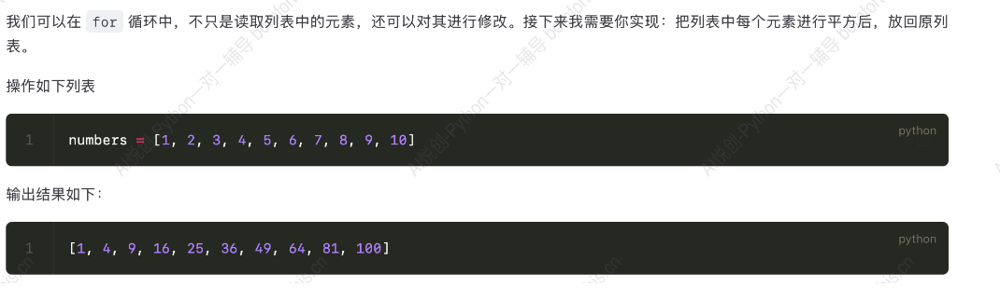
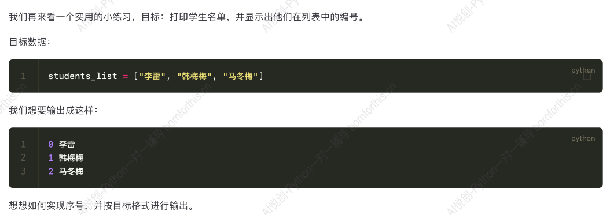
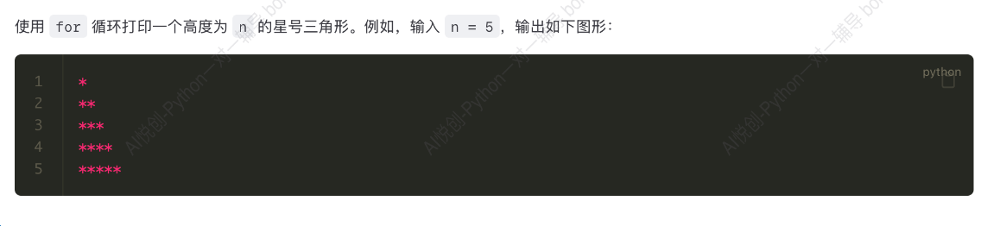
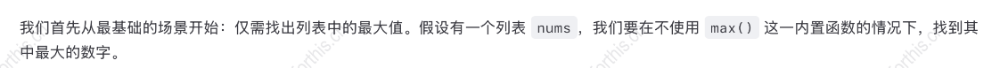
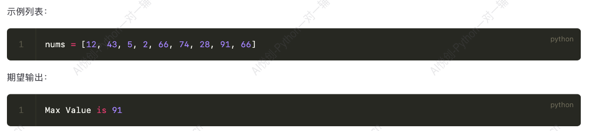

## 1. for 的语法

```python
for 变量 in 可迭代对象：
	循环体代码
```


代码：

代码中 `x` 是**临时变量**。

```python
for x in [1, 2, 3]:
    print(x)

print('循环结束后，x 的值为：', x)

#-------output-------
1
2
3
循环结束后，x 的值为： 3
```

例子：

```python
student_list = ['李雷', '韩梅梅', '马冬梅']
for student in student_list:
    print(student)
    
#-------output-------
李雷
韩梅梅
马冬梅
```

## 2. while 循环实现 for 循环

上述代码用 while 循环如何实现？

```python
student_list = ['李雷', '韩梅梅', '马冬梅']
i = 0

while i < len(student_list):
    print(student_list[i])
    i += 1
```


## 3. 小试牛刀

### 3.1 遍历列表并将每个元素平方后放回原列表




**Answer:** 

```python
numbers = [1, 2, 3, 4, 5, 6, 7, 8, 9, 10]

index = 0
for num in numbers:
    new_num = num ** 2
    numbers[index] = new_num
    index += 1

print(numbers)

#-------output-------
[1, 4, 9, 16, 25, 36, 49, 64, 81, 100]
```

思路：问题拆解

step1: 明确提取方法：取下标

step2: 下标如何生成

step3: 提取


### 3.2 输出带序号的数据




**Answer:**

方法一：内置函数 `.index()` 

```python
student_list = ['李雷', '韩梅梅', '马冬梅']

for student in student_list:
    print(student_list.index(student), student)
    
#-------output-------
0 李雷
1 韩梅梅
2 马冬梅
```

方法二：创建储存下标的变量

```python
student_list = ['李雷', '韩梅梅', '马冬梅']

index = 0
for st in student_list:
    print(index, st)
    index += 1
```

优化：

若需要输出

```python
stid_0 李雷
stid_1 韩梅梅
stid_2 马冬梅
```

则代码可以改为：

```python
student_list = ['李雷', '韩梅梅', '马冬梅']

index = 0
for st in student_list:
    print(f'stid_{index} {st}')
    index += 1
```


## 4. range()

当需要生成一系列连续数字时，例如遍历列表、控制循环次数等。Python 提供了一个简单又高效的工具—— `range()` 函数，专门用于生成 ==不可变==（immutable）的==数字序列==，尤其配合 `for` 循环进行迭代操作。

### 4.1 基本用法

`range()` 函数最多可以接收三个参数：`start` 起始值，`stop` 终止值， `step` 步长，下面详细解释这些参数：

- `start` ：数字序列的起始值，默认是 0 ；
- `stop` ：数字序列停止的地方，但注意**不包含这个值**；
- `step` ：每个数字之间的差值（步长），默认值是 1.

代码如下：

```python
for i in range(5):
    print(i)
    
#-------output-------
0
1
2
3
4
```

指定开始结束：

```python
for i in range(2, 6):
    print(i)
    
#-------output-------
2
3
4
5
```

指定间隔：

```python
for i in range(1, 10, 2):
    print(i)

#-------output-------
1
3
5
7
9
```

### 4.2 例子：生成一个列表包含 0 到 100

方法一：

```python
lst = []

for i in range(0, 101):
    lst.append(i)                # 注意不能用 lst = lst.append(i) ，因为 .append() 是直接修改原列表
print(lst)
```

方法二：

```python
print(list(range(0, 101)))
```


因此上文输出元素可以用 `range()` 完成，此处用 `len(student_list)` ，若有两个相关联的列表，则可以用另一个列表的长度来提取该列表的元素。

```python
student_list = ['李雷', '韩梅梅', '马冬梅']

for student in range(len(student_list)):
    print(student_list[student])
    
#-------output-------
李雷
韩梅梅
马冬梅
```

## 5. 小试牛刀2：打印星号三角形



**Answer:** 

```python
n = input('请输入高度：')

for i in range(1, int(n)+1):
    print(i*'*')
    
#-------output-------
请输入高度：3
*
**
***
```

**思路：**

先输出一次，再考虑循环

`n = int(input('请输入三角形的高度'))` 

第一行 `print(*)` 

第二行 `print(**)` 

第三行 `print(***)` 

转化为：

`print(1 * '*')` 

`print(2 * '*')` 

`print(3 * '*')` 

转化为前面获得 1-3 的数字的问题。


## 6. enumerate()

任务：按照索引得到水果。

```python
fruits = ["apple", "banana", "cherry"]

# 方法一：
index = 0
for fruit in fruits:
    print(f'索引为 {index} 的水果是 {fruit}')
    index += 1
    
# 方法二
for index in range(len(fruits)):
    print(f'索引为 {index} 的水果是 {fruits[index]}')

#-------output-------
索引为 0 的水果是 apple
索引为 1 的水果是 banana
索引为 2 的水果是 cherry
```

### 6.1 基本用法

引入新函数`enumerate()`

```python
fruits = ["apple", "banana", "cherry"]

for index, fruit in enumerate(fruits):
    print(index, fruit)

#-------output-------
0 apple
1 banana
2 cherry
```

那么 `enumerate(fruits)` 的结果是什么？如何理解 `enumerate` 语句？

```python
fruits = ["apple", "banana", "cherry"]

# print(enumerate(fruits))
# 得到地址 <enumerate object at 0x0000020D811399C0>
# 考虑转化为 list
fruits_list = list(enumerate(fruits))
# 用循环实现
for item in fruits_list:
    print(item)
# item 是元组的形式
#     index, fruit = item
#     print(index, fruit)
# 可以将 for 循环语句中的 item 用 index, fruit 替换掉
# 即
for index, fruit in fruits_list:
# 即
for index, fruit in enumerate(fruits)
```

### 6.2 指定起始索引

默认情况下， `enumerate` 是从 0 开始计数，可以通过添加一个可选的 `start` 参数来指定起始索引。

```python
fruits = ["apple", "banana", "cherry"]

for index, fruit in enumerate(fruits, start=1):
    print(index, fruit)
    
#-------output-------
1 apple
2 banana
3 cherry
```

### 6.3 使用场景

1. 需要同时对索引和元素处理；
2. 需要修改原列表或数组的某些特定位置（修改或替换某些元素时拿到索引比较必要，在循环内可以完成索引和元素的映射）；
3. 减少硬编码，提升可读性。


## 7. 找到列表的最大值






**Answer:** 

```python
nums = [12, 43, 5, 2, 66, 74, 28, 91, 66]

max_num = nums[0]             # 先假设第一个元素是最大的
for n in nums:
    if n > max_num:
        max_num = n

print(f'Max Value is {max_num}')

#-------output-------
Max Value is 91
```

思路：从篮子里拿桃子比较，先拿出一个假设是最大的，然后再从篮子里拿桃子比较，大的留下。

因此，该代码思路一样，先假设第一个元素最大，穷举列表中的元素比大小，把比较出来的大的值覆盖掉上一个最大值。


## 8. 找到列表最大值的下标

```python
nums = [12, 43, 5, 2, 66, 74, 28, 91, 66]

max_num = nums[0]
for index, n in enumerate(nums):
    if n > max_num:
        max_num = n
        max_index = index


print(f'The index of max value is {max_index}')

#-------output-------
The index of max value is 7
```


## 9. 找到列表的多个最大值以及对应的多个下标

### 9.1 两次循环结合 `enumerate()` 方法

```python
nums = [12, 43, 5, 2, 66, 74, 91, 28, 91, 66]

# 第一次循环找到最大值
max_value = nums[0]
for n in nums:
    if n > max_value:
        max_value = n

# 第二次循环：找到所有等于这个最大值的元素的下标
max_indices = []
for index, value in enumerate(nums):
    if value == max_value:
        max_indices.append(index)

# 把下标列表转换成元组
max_indices_tuple = tuple(max_indices)
print(max_indices_tuple)

#-------output-------
(6, 8)
```

### 9.2 两次循环结合下标赋值方法

思考：用下标方法如何实现？

```python
nums = [12, 43, 5, 2, 66, 74, 91, 28, 91, 66]

# 初始化最大值和最大值下标的列表
max_value = nums[0]
max_indices = []

# 第一次循环，找到最大值
for num in nums:
    if num > max_value:
        max_value = num
        
# 第二次循环，找到所有最大值的下标
n = 0
for num in nums:
    if num == max_value:
        max_indices.append(n)
        n += 1
    else:
        n += 1

# 将列表转化为元组
max_indices_tuple = tuple(max_indices)
print(max_indices_tuple)

#-------output-------
(6, 8)
```

优化：将 `n += 1` 这一句提出来到 `if`  外即可。

```python
# 第二次循环，找到所有最大值的下标
n = 0
for num in nums:
    if num == max_value:
        max_indices.append(n)
    n += 1
```

### 9.3 两次循环结合 `range()` 方法

思考：如何用 `range` 实现？

```python
nums = [12, 43, 5, 2, 66, 74, 91, 28, 91, 66]

# 初始化最大值和最大值下标的列表
max_value = nums[0]
max_indices = []

# 第一次循环，找到最大值
for index in range(len(nums)):
    if nums[index] > max_value:
        max_value = nums[index]

# 第二次循环，找到所有最大值的下标
for index in range(len(nums)):
    if nums[index] == max_value:
        max_indices.append(index)


# 将列表转化为元组
max_indices_tuple = tuple(max_indices)
print(max_indices_tuple)

#-------output-------
(6, 8)
```

### 9.4 一个循环结合 `enumerate()`  实现

思考：如何一个循环实现？

```python
nums = [12, 43, 5, 2, 66, 74, 91, 28, 91, 66]

# 假设第一个元素最大，那么第一个元素的下标也最大
max_num = nums[0]
max_indices = [0]

for index, num in enumerate(nums):
    if num > max_num:
        max_num = num
        max_indices = [index]
    elif num == max_num:
        max_indices.append(index)

print(f'最大的元素是 {max_num}，对应的下标为 {max_indices}')

#-------output-------
最大的元素是 91，对应的下标为 [6, 8]
```


优化：

`line 5` 代码 `max_indices = [0]` 不需要在列表中填一个 0 了，修改为：

```python
max_indices = []
```


### 9.5 一个循环结合 `range()` 实现

```python
nums = [12, 43, 5, 2, 66, 74, 91, 28, 91, 66]

# 假设第一个元素最大，那么第一个元素的下标也最大
max_num = nums[0]
max_indices = []

for index in range(len(nums)):
    if nums[index] > max_num:
        max_num = nums[index]
        max_indices = [index]
    elif nums[index] == max_num:
        max_indices.append(index)

print(f'最大的元素是 {max_num}，对应的下标为 {max_indices}')

#-------output-------
最大的元素是 91，对应的下标为 [6, 8]
```


### 9.6 一个循环结合下标实现（纠错）

某同学代码：

```python
nums = [12, 43, 5, 2, 66, 74, 91, 28, 91, 66]

# 初始化最大值和最大值下标的列表
max_value = nums[0]
max_indices = []

# 思考下面代码所存在的问题
n = 0
for num in nums:
    if num > max_value:
        max_value = num
        max_indices = [n]
        n += 1
    elif num == max_value:
        max_indices.append(n)
        n += 1

max_indices_tuple = tuple(max_indices)
print(max_indices_tuple)
```


修改：少了小于的情况

```python
nums = [12, 43, 5, 2, 66, 74, 91, 28, 91, 66]

# 初始化最大值和最大值下标的列表
max_value = nums[0]
max_indices = []

# 思考下面代码所存在的问题
n = 0
for num in nums:
    if num > max_value:
        max_value = num
        max_indices = [n]
        n += 1

    elif num == max_value:
        max_indices.append(n)
        n += 1

    else:
        n += 1

max_indices_tuple = tuple(max_indices)
print(max_indices_tuple)
```


不加 `else` 如何修改？

将 `n += 1` 从 if 中提取出来。

```python
nums = [12, 43, 5, 2, 66, 74, 91, 28, 91, 66]

# 初始化最大值和最大值下标的列表
max_value = nums[0]
max_indices = []

# 思考下面代码所存在的问题
n = 0
for num in nums:
    if num > max_value:
        max_value = num
        max_indices = [n]


    elif num == max_value:
        max_indices.append(n)
    n += 1


max_indices_tuple = tuple(max_indices)
print(max_indices_tuple)
```


## 10. 嵌套 for 循环

### 10.1 基本结构

一个嵌套的 `for` 循环通常的书写形式如下：

```python
for 变量1 in 可迭代对象1：
	for 变量2 in 可迭代对象2：
    	#执行代码块
```

例子：

```python
for i in range(2):
    print(f'外层循环执行了第 {i+1} 次')
    for j in range(3):
        print(f'\t内层循环执行了第 {j+1}次')
        
#-------output-------
外层循环执行了第 1 次
	内层循环执行了第 1次
	内层循环执行了第 2次
	内层循环执行了第 3次
外层循环执行了第 2 次
	内层循环执行了第 1次
	内层循环执行了第 2次
	内层循环执行了第 3次
```

外层代码每执行一次，内层代码都要全部执行一遍。


### 10.2 遍历求和

将下列矩阵中所有的元素相加。

```python
matrix = [
    [1, 2, 3],
    [4, 5, 6],
    [7, 8, 9]
]
```

原始思路：（不好）

```python
matrix = [
    [1, 2, 3],
    [4, 5, 6],
    [7, 8, 9]
]

sum_rows = []
for rows in matrix:
    sum_rows.append(sum(rows))
sum_all = sum(sum_rows)

print(sum_all)
```


思考：如何从0加到100？

首先需要设置一个 total 的变量为 0 ，然后提出一个数字，在 total 上加一个数字。

```python
total = 0
for i in range(101):
    total = total + i
print(total)
```


同样的逻辑：

```python
matrix = [
    [1, 2, 3],
    [4, 5, 6],
    [7, 8, 9]
]

total = 0
for rows in matrix:            # 提出每个列表
    for row in rows:           # 提出每个列表里的元素
        total += row           # 往 total 里加
print(total)

#-------output-------
45
```


### 10.3 求每一单独列的和

```python 
# 手动方法
col1 = 0
col2 = 0
col3 = 0

for row in matrix:
    col1 += row[0]
    col2 += row[1]
    col3 += row[2]
print([col1, col2, col3])

#-------output-------
[12, 15, 18]
```

用循环方法：

思路：

- 仿照手动解决，第`1` 列的和是自增下标为 `0`  的 `row` ，第`2` 列的和是自增下标为 `1`  的 `row` ，以此类推，可以初始化一个列表，专门放第`1、2、3`  列的和，而这个列表的长度，就是 `matrix`  含有的列表元素的个数，因此，初始化一个列表，长度为 `matrix`  的列数（即每个列表元素的长度），每个元素的初始值为 `0` 。

- 原本的 `col1`  就是 `column_sums[0]` ， `col2`  就是 `column_sums[1]`  ， `col3`  就是 `column_sums[2]` ，那么上述代码中的 `line 7-9`  

    ```python 
    col1 += row[0]
    col2 += row[1]
    col3 += row[2]
    ```

    就变为

    ```python 
    column_sums[0] += rows[0]
    column_sums[1] += rows[1]
    column_sums[2] += rows[2]
    ```

    发现两者的下标一致，即可遍历 `matrix` 包含的列表元素的个数（`matrix` 的长度）。


最终代码如下：

```python 
matrix = [
    [1, 2, 3],
    [4, 5, 6],
    [7, 8, 9]
]

# 初始化一个列表，长度为 matrix 的列数（即每个列表元素的长度），每个元素的初始值为0
column_sums = [0] * len(matrix[0])


for rows in matrix:
    for i in range(len(rows)):
        column_sums[i] += rows[i]

print(column_sums)

#-------output-------
[12, 15, 18]
```


 
