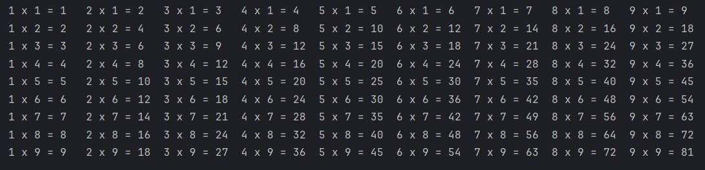

## 1. for 的语法

```python
for 变量 in 可迭代对象：
	循环体代码
```


代码：

代码中 `x` 是**临时变量**。

```python
for x in [1, 2, 3]:
    print(x)

print('循环结束后，x 的值为：', x)

#-------output-------
1
2
3
循环结束后，x 的值为： 3
```

例子：

```python
student_list = ['李雷', '韩梅梅', '马冬梅']
for student in student_list:
    print(student)
    
#-------output-------
李雷
韩梅梅
马冬梅
```

## 2. while 循环实现 for 循环

上述代码用 while 循环如何实现？

```python
student_list = ['李雷', '韩梅梅', '马冬梅']
i = 0

while i < len(student_list):
    print(student_list[i])
    i += 1
```


## 3. 小试牛刀

### 3.1 遍历列表并将每个元素平方后放回原列表


**Answer:** 

```python
numbers = [1, 2, 3, 4, 5, 6, 7, 8, 9, 10]

index = 0
for num in numbers:
    new_num = num ** 2
    numbers[index] = new_num
    index += 1

print(numbers)

#-------output-------
[1, 4, 9, 16, 25, 36, 49, 64, 81, 100]
```

思路：问题拆解

step1: 明确提取方法：取下标

step2: 下标如何生成

step3: 提取


### 3.2 输出带序号的数据


**Answer:**

方法一：内置函数 `.index()` 

```python
student_list = ['李雷', '韩梅梅', '马冬梅']

for student in student_list:
    print(student_list.index(student), student)
    
#-------output-------
0 李雷
1 韩梅梅
2 马冬梅
```

方法二：创建储存下标的变量

```python
student_list = ['李雷', '韩梅梅', '马冬梅']

index = 0
for st in student_list:
    print(index, st)
    index += 1
```

优化：

若需要输出

```python
stid_0 李雷
stid_1 韩梅梅
stid_2 马冬梅
```

则代码可以改为：

```python
student_list = ['李雷', '韩梅梅', '马冬梅']

index = 0
for st in student_list:
    print(f'stid_{index} {st}')
    index += 1
```


## 4. range()

当需要生成一系列连续数字时，例如遍历列表、控制循环次数等。Python 提供了一个简单又高效的工具—— `range()` 函数，专门用于生成 ==不可变==（immutable）的==数字序列==，尤其配合 `for` 循环进行迭代操作。

### 4.1 基本用法

`range()` 函数最多可以接收三个参数：`start` 起始值，`stop` 终止值， `step` 步长，下面详细解释这些参数：

- `start` ：数字序列的起始值，默认是 0 ；
- `stop` ：数字序列停止的地方，但注意**不包含这个值**；
- `step` ：每个数字之间的差值（步长），默认值是 1.

代码如下：

```python
for i in range(5):
    print(i)
    
#-------output-------
0
1
2
3
4
```

指定开始结束：

```python
for i in range(2, 6):
    print(i)
    
#-------output-------
2
3
4
5
```

指定间隔：

```python
for i in range(1, 10, 2):
    print(i)

#-------output-------
1
3
5
7
9
```

### 4.2 例子：生成一个列表包含 0 到 100

方法一：

```python
lst = []

for i in range(0, 101):
    lst.append(i)                # 注意不能用 lst = lst.append(i) ，因为 .append() 是直接修改原列表
print(lst)
```

方法二：

```python
print(list(range(0, 101)))
```


因此上文输出元素可以用 `range()` 完成，此处用 `len(student_list)` ，若有两个相关联的列表，则可以用另一个列表的长度来提取该列表的元素。

```python
student_list = ['李雷', '韩梅梅', '马冬梅']

for student in range(len(student_list)):
    print(student_list[student])
    
#-------output-------
李雷
韩梅梅
马冬梅
```

## 5. 小试牛刀2：打印星号三角形


**Answer:** 

```python
n = input('请输入高度：')

for i in range(1, int(n)+1):
    print(i*'*')
    
#-------output-------
请输入高度：3
*
**
***
```

**思路：**

先输出一次，再考虑循环

`n = int(input('请输入三角形的高度'))` 

第一行 `print(*)` 

第二行 `print(**)` 

第三行 `print(***)` 

转化为：

`print(1 * '*')` 

`print(2 * '*')` 

`print(3 * '*')` 

转化为前面获得 1-3 的数字的问题。


## 6. enumerate()

任务：按照索引得到水果。

```python
fruits = ["apple", "banana", "cherry"]

# 方法一：
index = 0
for fruit in fruits:
    print(f'索引为 {index} 的水果是 {fruit}')
    index += 1
    
# 方法二
for index in range(len(fruits)):
    print(f'索引为 {index} 的水果是 {fruits[index]}')

#-------output-------
索引为 0 的水果是 apple
索引为 1 的水果是 banana
索引为 2 的水果是 cherry
```

### 6.1 基本用法

引入新函数`enumerate()`

```python
fruits = ["apple", "banana", "cherry"]

for index, fruit in enumerate(fruits):
    print(index, fruit)

#-------output-------
0 apple
1 banana
2 cherry
```

那么 `enumerate(fruits)` 的结果是什么？如何理解 `enumerate` 语句？

```python
fruits = ["apple", "banana", "cherry"]

# print(enumerate(fruits))
# 得到地址 <enumerate object at 0x0000020D811399C0>
# 考虑转化为 list
fruits_list = list(enumerate(fruits))
# 用循环实现
for item in fruits_list:
    print(item)
# item 是元组的形式
#     index, fruit = item
#     print(index, fruit)
# 可以将 for 循环语句中的 item 用 index, fruit 替换掉
# 即
for index, fruit in fruits_list:
# 即
for index, fruit in enumerate(fruits)
```

### 6.2 指定起始索引

默认情况下， `enumerate` 是从 0 开始计数，可以通过添加一个可选的 `start` 参数来指定起始索引。

```python
fruits = ["apple", "banana", "cherry"]

for index, fruit in enumerate(fruits, start=1):
    print(index, fruit)
    
#-------output-------
1 apple
2 banana
3 cherry
```

### 6.3 使用场景

1. 需要同时对索引和元素处理；
2. 需要修改原列表或数组的某些特定位置（修改或替换某些元素时拿到索引比较必要，在循环内可以完成索引和元素的映射）；
3. 减少硬编码，提升可读性。


## 7. 找到列表的最大值


**Answer:** 

```python
nums = [12, 43, 5, 2, 66, 74, 28, 91, 66]

max_num = nums[0]             # 先假设第一个元素是最大的
for n in nums:
    if n > max_num:
        max_num = n

print(f'Max Value is {max_num}')

#-------output-------
Max Value is 91
```

思路：从篮子里拿桃子比较，先拿出一个假设是最大的，然后再从篮子里拿桃子比较，大的留下。

因此，该代码思路一样，先假设第一个元素最大，穷举列表中的元素比大小，把比较出来的大的值覆盖掉上一个最大值。


## 8. 找到列表最大值的下标

```python
nums = [12, 43, 5, 2, 66, 74, 28, 91, 66]

max_num = nums[0]
for index, n in enumerate(nums):
    if n > max_num:
        max_num = n
        max_index = index


print(f'The index of max value is {max_index}')

#-------output-------
The index of max value is 7
```


## 9. 找到列表的多个最大值以及对应的多个下标

### 9.1 两次循环结合 `enumerate()` 方法

```python
nums = [12, 43, 5, 2, 66, 74, 91, 28, 91, 66]

# 第一次循环找到最大值
max_value = nums[0]
for n in nums:
    if n > max_value:
        max_value = n

# 第二次循环：找到所有等于这个最大值的元素的下标
max_indices = []
for index, value in enumerate(nums):
    if value == max_value:
        max_indices.append(index)

# 把下标列表转换成元组
max_indices_tuple = tuple(max_indices)
print(max_indices_tuple)

#-------output-------
(6, 8)
```

### 9.2 两次循环结合下标赋值方法

思考：用下标方法如何实现？

```python
nums = [12, 43, 5, 2, 66, 74, 91, 28, 91, 66]

# 初始化最大值和最大值下标的列表
max_value = nums[0]
max_indices = []

# 第一次循环，找到最大值
for num in nums:
    if num > max_value:
        max_value = num
        
# 第二次循环，找到所有最大值的下标
n = 0
for num in nums:
    if num == max_value:
        max_indices.append(n)
        n += 1
    else:
        n += 1

# 将列表转化为元组
max_indices_tuple = tuple(max_indices)
print(max_indices_tuple)

#-------output-------
(6, 8)
```

优化：将 `n += 1` 这一句提出来到 `if`  外即可。

```python
# 第二次循环，找到所有最大值的下标
n = 0
for num in nums:
    if num == max_value:
        max_indices.append(n)
    n += 1
```

### 9.3 两次循环结合 `range()` 方法

思考：如何用 `range` 实现？

```python
nums = [12, 43, 5, 2, 66, 74, 91, 28, 91, 66]

# 初始化最大值和最大值下标的列表
max_value = nums[0]
max_indices = []

# 第一次循环，找到最大值
for index in range(len(nums)):
    if nums[index] > max_value:
        max_value = nums[index]

# 第二次循环，找到所有最大值的下标
for index in range(len(nums)):
    if nums[index] == max_value:
        max_indices.append(index)


# 将列表转化为元组
max_indices_tuple = tuple(max_indices)
print(max_indices_tuple)

#-------output-------
(6, 8)
```

### 9.4 一个循环结合 `enumerate()`  实现

思考：如何一个循环实现？

```python
nums = [12, 43, 5, 2, 66, 74, 91, 28, 91, 66]

# 假设第一个元素最大，那么第一个元素的下标也最大
max_num = nums[0]
max_indices = [0]

for index, num in enumerate(nums):
    if num > max_num:
        max_num = num
        max_indices = [index]
    elif num == max_num:
        max_indices.append(index)

print(f'最大的元素是 {max_num}，对应的下标为 {max_indices}')

#-------output-------
最大的元素是 91，对应的下标为 [6, 8]
```


优化：

`line 5` 代码 `max_indices = [0]` 不需要在列表中填一个 0 了，修改为：

```python
max_indices = []
```


### 9.5 一个循环结合 `range()` 实现

```python
nums = [12, 43, 5, 2, 66, 74, 91, 28, 91, 66]

# 假设第一个元素最大，那么第一个元素的下标也最大
max_num = nums[0]
max_indices = []

for index in range(len(nums)):
    if nums[index] > max_num:
        max_num = nums[index]
        max_indices = [index]
    elif nums[index] == max_num:
        max_indices.append(index)

print(f'最大的元素是 {max_num}，对应的下标为 {max_indices}')

#-------output-------
最大的元素是 91，对应的下标为 [6, 8]
```


### 9.6 一个循环结合下标实现（纠错）

某同学代码：

```python
nums = [12, 43, 5, 2, 66, 74, 91, 28, 91, 66]

# 初始化最大值和最大值下标的列表
max_value = nums[0]
max_indices = []

# 思考下面代码所存在的问题
n = 0
for num in nums:
    if num > max_value:
        max_value = num
        max_indices = [n]
        n += 1
    elif num == max_value:
        max_indices.append(n)
        n += 1

max_indices_tuple = tuple(max_indices)
print(max_indices_tuple)
```


修改：少了小于的情况

```python
nums = [12, 43, 5, 2, 66, 74, 91, 28, 91, 66]

# 初始化最大值和最大值下标的列表
max_value = nums[0]
max_indices = []

# 思考下面代码所存在的问题
n = 0
for num in nums:
    if num > max_value:
        max_value = num
        max_indices = [n]
        n += 1

    elif num == max_value:
        max_indices.append(n)
        n += 1

    else:
        n += 1

max_indices_tuple = tuple(max_indices)
print(max_indices_tuple)
```


不加 `else` 如何修改？

将 `n += 1` 从 if 中提取出来。

```python
nums = [12, 43, 5, 2, 66, 74, 91, 28, 91, 66]

# 初始化最大值和最大值下标的列表
max_value = nums[0]
max_indices = []

# 思考下面代码所存在的问题
n = 0
for num in nums:
    if num > max_value:
        max_value = num
        max_indices = [n]


    elif num == max_value:
        max_indices.append(n)
    n += 1


max_indices_tuple = tuple(max_indices)
print(max_indices_tuple)
```


## 10. 嵌套 for 循环

### 10.1 基本结构

一个嵌套的 `for` 循环通常的书写形式如下：

```python
for 变量1 in 可迭代对象1：
	for 变量2 in 可迭代对象2：
    	#执行代码块
```

例子：

```python
for i in range(2):
    print(f'外层循环执行了第 {i+1} 次')
    for j in range(3):
        print(f'\t内层循环执行了第 {j+1}次')
        
#-------output-------
外层循环执行了第 1 次
	内层循环执行了第 1次
	内层循环执行了第 2次
	内层循环执行了第 3次
外层循环执行了第 2 次
	内层循环执行了第 1次
	内层循环执行了第 2次
	内层循环执行了第 3次
```

外层代码每执行一次，内层代码都要全部执行一遍。


### 10.2 遍历求和

将下列矩阵中所有的元素相加。

```python
matrix = [
    [1, 2, 3],
    [4, 5, 6],
    [7, 8, 9]
]
```

原始思路：（不好）

```python
matrix = [
    [1, 2, 3],
    [4, 5, 6],
    [7, 8, 9]
]

sum_rows = []
for rows in matrix:
    sum_rows.append(sum(rows))
sum_all = sum(sum_rows)

print(sum_all)
```


思考：如何从0加到100？

首先需要设置一个 total 的变量为 0 ，然后提出一个数字，在 total 上加一个数字。

```python
total = 0
for i in range(101):
    total = total + i
print(total)
```


同样的逻辑：

```python
matrix = [
    [1, 2, 3],
    [4, 5, 6],
    [7, 8, 9]
]

total = 0
for rows in matrix:            # 提出每个列表
    for row in rows:           # 提出每个列表里的元素
        total += row           # 往 total 里加
print(total)

#-------output-------
45
```


### 10.3 求每一单独列的和

```python 
# 手动方法
col1 = 0
col2 = 0
col3 = 0

for row in matrix:
    col1 += row[0]
    col2 += row[1]
    col3 += row[2]
print([col1, col2, col3])

#-------output-------
[12, 15, 18]
```

用循环方法：

思路：

- 仿照手动解决，第`1` 列的和是自增下标为 `0`  的 `row` ，第`2` 列的和是自增下标为 `1`  的 `row` ，以此类推，可以初始化一个列表，专门放第`1、2、3`  列的和，而这个列表的长度，就是 `matrix`  含有的列表元素的个数，因此，初始化一个列表，长度为 `matrix`  的列数（即每个列表元素的长度），每个元素的初始值为 `0` 。

- 原本的 `col1`  就是 `column_sums[0]` ， `col2`  就是 `column_sums[1]`  ， `col3`  就是 `column_sums[2]` ，那么上述代码中的 `line 7-9`  

    ```python 
    col1 += row[0]
    col2 += row[1]
    col3 += row[2]
    ```

    就变为

    ```python 
    column_sums[0] += rows[0]
    column_sums[1] += rows[1]
    column_sums[2] += rows[2]
    ```

    发现两者的下标一致，即可遍历 `matrix` 包含的列表元素的个数（`matrix` 的长度）。


最终代码如下：

```python 
matrix = [
    [1, 2, 3],
    [4, 5, 6],
    [7, 8, 9]
]

# 初始化一个列表，长度为 matrix 的列数（即每个列表元素的长度），每个元素的初始值为0
column_sums = [0] * len(matrix[0])


for rows in matrix:
    for i in range(len(rows)):
        column_sums[i] += rows[i]

print(column_sums)

#-------output-------
[12, 15, 18]
```


 方法二：全部用下标索引

```python 
matrix = [
    [1, 2, 3],
    [4, 5, 6],
    [7, 8, 9]
]

# 初始化一个列表，长度为 matrix 的列数（即每个列表元素的长度），每个元素的初始值为0
column_sums = [0] * len(matrix[0])

# 遍历每一列（外层循环）
for i in range(len(matrix[0])):
    # 遍历每一行（内层循环），逐行取出对应列的数字
    for j in range(len(matrix)):
        column_sums[i] += matrix[j][i]

print(column_sums)
```


### 10.4 输出九九乘法表


**思路：** 

**方法一：拆解** 

step 1：首先需要得到 1到9 的数字

step 2：进行乘法运算

发现每一列等式，乘号左边的数字都是不变的，因此将乘号左侧的数字设为变量 `i` ，为外层循环；乘号右侧的为变量 `j` ，为内层循环（原理：每运行一次外层循环，内层循环都全部循环一次）。

==注意：乘号左侧和右侧虽然都是 1到9，但是最好设为两个变量。== 

那么可以得到如下代码：

```python 
for i in range(1, 10):
    for j in range(1, 10):
        print(f'{i} x {j} = {i*j}')

#-------output-------
1 x 1 = 1
1 x 2 = 2
1 x 3 = 3
1 x 4 = 4
1 x 5 = 5
1 x 6 = 6
1 x 7 = 7
1 x 8 = 8
1 x 9 = 9
2 x 1 = 2
2 x 2 = 4
2 x 3 = 6
2 x 4 = 8
2 x 5 = 10
2 x 6 = 12
2 x 7 = 14
2 x 8 = 16
2 x 9 = 18
3 x 1 = 3
3 x 2 = 6
3 x 3 = 9
3 x 4 = 12
3 x 5 = 15
3 x 6 = 18
3 x 7 = 21
3 x 8 = 24
3 x 9 = 27
4 x 1 = 4
4 x 2 = 8
4 x 3 = 12
4 x 4 = 16
4 x 5 = 20
4 x 6 = 24
4 x 7 = 28
4 x 8 = 32
4 x 9 = 36
5 x 1 = 5
5 x 2 = 10
5 x 3 = 15
5 x 4 = 20
5 x 5 = 25
5 x 6 = 30
5 x 7 = 35
5 x 8 = 40
5 x 9 = 45
6 x 1 = 6
6 x 2 = 12
6 x 3 = 18
6 x 4 = 24
6 x 5 = 30
6 x 6 = 36
6 x 7 = 42
6 x 8 = 48
6 x 9 = 54
7 x 1 = 7
7 x 2 = 14
7 x 3 = 21
7 x 4 = 28
7 x 5 = 35
7 x 6 = 42
7 x 7 = 49
7 x 8 = 56
7 x 9 = 63
8 x 1 = 8
8 x 2 = 16
8 x 3 = 24
8 x 4 = 32
8 x 5 = 40
8 x 6 = 48
8 x 7 = 56
8 x 8 = 64
8 x 9 = 72
9 x 1 = 9
9 x 2 = 18
9 x 3 = 27
9 x 4 = 36
9 x 5 = 45
9 x 6 = 54
9 x 7 = 63
9 x 8 = 72
9 x 9 = 81
```


观察发现，第三行代码每运行一次都会换行，不符合我们的格式，那么将末尾换行修改为空格`\t` ，而外层循环每次结束后再进行换行，可得到如下代码：

```python 
for i in range(1, 10):
    for j in range(1, 10):
        print(f'{i} x {j} = {i*j}', end='\t')
    print()
    
#-------output-------
1 x 1 = 1	1 x 2 = 2	1 x 3 = 3	1 x 4 = 4	1 x 5 = 5	1 x 6 = 6	1 x 7 = 7	1 x 8 = 8	1 x 9 = 9	
2 x 1 = 2	2 x 2 = 4	2 x 3 = 6	2 x 4 = 8	2 x 5 = 10	2 x 6 = 12	2 x 7 = 14	2 x 8 = 16	2 x 9 = 18	
3 x 1 = 3	3 x 2 = 6	3 x 3 = 9	3 x 4 = 12	3 x 5 = 15	3 x 6 = 18	3 x 7 = 21	3 x 8 = 24	3 x 9 = 27	
4 x 1 = 4	4 x 2 = 8	4 x 3 = 12	4 x 4 = 16	4 x 5 = 20	4 x 6 = 24	4 x 7 = 28	4 x 8 = 32	4 x 9 = 36	
5 x 1 = 5	5 x 2 = 10	5 x 3 = 15	5 x 4 = 20	5 x 5 = 25	5 x 6 = 30	5 x 7 = 35	5 x 8 = 40	5 x 9 = 45	
6 x 1 = 6	6 x 2 = 12	6 x 3 = 18	6 x 4 = 24	6 x 5 = 30	6 x 6 = 36	6 x 7 = 42	6 x 8 = 48	6 x 9 = 54	
7 x 1 = 7	7 x 2 = 14	7 x 3 = 21	7 x 4 = 28	7 x 5 = 35	7 x 6 = 42	7 x 7 = 49	7 x 8 = 56	7 x 9 = 63	
8 x 1 = 8	8 x 2 = 16	8 x 3 = 24	8 x 4 = 32	8 x 5 = 40	8 x 6 = 48	8 x 7 = 56	8 x 8 = 64	8 x 9 = 72	
9 x 1 = 9	9 x 2 = 18	9 x 3 = 27	9 x 4 = 36	9 x 5 = 45	9 x 6 = 54	9 x 7 = 63	9 x 8 = 72	9 x 9 = 81	
```

此时观察代码发现，乘号左右的数字与图片上不同，乘号左侧的数字应不变，乘号右侧的数字变化，因此输出时，可以将 `i` 和`j` 调换位置。

```python 
for i in range(1, 10):
    for j in range(1, 10):
        print(f'{j} x {i} = {i*j}', end='\t')
    print()
    
#-------output-------
1 x 1 = 1	2 x 1 = 2	3 x 1 = 3	4 x 1 = 4	5 x 1 = 5	6 x 1 = 6	7 x 1 = 7	8 x 1 = 8	9 x 1 = 9	
1 x 2 = 2	2 x 2 = 4	3 x 2 = 6	4 x 2 = 8	5 x 2 = 10	6 x 2 = 12	7 x 2 = 14	8 x 2 = 16	9 x 2 = 18	
1 x 3 = 3	2 x 3 = 6	3 x 3 = 9	4 x 3 = 12	5 x 3 = 15	6 x 3 = 18	7 x 3 = 21	8 x 3 = 24	9 x 3 = 27	
1 x 4 = 4	2 x 4 = 8	3 x 4 = 12	4 x 4 = 16	5 x 4 = 20	6 x 4 = 24	7 x 4 = 28	8 x 4 = 32	9 x 4 = 36	
1 x 5 = 5	2 x 5 = 10	3 x 5 = 15	4 x 5 = 20	5 x 5 = 25	6 x 5 = 30	7 x 5 = 35	8 x 5 = 40	9 x 5 = 45	
1 x 6 = 6	2 x 6 = 12	3 x 6 = 18	4 x 6 = 24	5 x 6 = 30	6 x 6 = 36	7 x 6 = 42	8 x 6 = 48	9 x 6 = 54	
1 x 7 = 7	2 x 7 = 14	3 x 7 = 21	4 x 7 = 28	5 x 7 = 35	6 x 7 = 42	7 x 7 = 49	8 x 7 = 56	9 x 7 = 63	
1 x 8 = 8	2 x 8 = 16	3 x 8 = 24	4 x 8 = 32	5 x 8 = 40	6 x 8 = 48	7 x 8 = 56	8 x 8 = 64	9 x 8 = 72	
1 x 9 = 9	2 x 9 = 18	3 x 9 = 27	4 x 9 = 36	5 x 9 = 45	6 x 9 = 54	7 x 9 = 63	8 x 9 = 72	9 x 9 = 81	
```

需要的最终结果是左下角的三角形，则第一次外层循环时，不输出`2 x 1 = 2	3 x 1 = 3	4 x 1 = 4	5 x 1 = 5	6 x 1 = 6	7 x 1 = 7	8 x 1 = 8	9 x 1 = 9	` ，第二次外层循环时，不输出`3 x 2 = 6	4 x 2 = 8	5 x 2 = 10	6 x 2 = 12	7 x 2 = 14	8 x 2 = 16	9 x 2 = 18	` 以此类推，控制`j` 的范围即可实现，即外层第一次循环时，`j` 只取到1，外层第二次循环时，`j` 只取到2，代码如下：

```python 
for i in range(1, 10):
    for j in range(1, i+1):
        print(f'{j} x {i} = {i*j}', end='\t')
    print()

#-------output-------
1 x 1 = 1	
1 x 2 = 2	2 x 2 = 4	
1 x 3 = 3	2 x 3 = 6	3 x 3 = 9	
1 x 4 = 4	2 x 4 = 8	3 x 4 = 12	4 x 4 = 16	
1 x 5 = 5	2 x 5 = 10	3 x 5 = 15	4 x 5 = 20	5 x 5 = 25	
1 x 6 = 6	2 x 6 = 12	3 x 6 = 18	4 x 6 = 24	5 x 6 = 30	6 x 6 = 36	
1 x 7 = 7	2 x 7 = 14	3 x 7 = 21	4 x 7 = 28	5 x 7 = 35	6 x 7 = 42	7 x 7 = 49	
1 x 8 = 8	2 x 8 = 16	3 x 8 = 24	4 x 8 = 32	5 x 8 = 40	6 x 8 = 48	7 x 8 = 56	8 x 8 = 64	
1 x 9 = 9	2 x 9 = 18	3 x 9 = 27	4 x 9 = 36	5 x 9 = 45	6 x 9 = 54	7 x 9 = 63	8 x 9 = 72	9 x 9 = 81	
```


**方法二：** 

观察发现我们需要的左下角数据，乘号左面的数都是 ≤ 乘号右面的数字，即 `j<=i` ，那么可以增加一个条件来决定内层循环何时停止。



代码如下：

```python 
for i in range(1, 10):
    for j in range(1, 10):
        if j <= i:
            print(f'{j} x {i} = {i*j}', end='\t')
    print()
```


若需要实现保留右上角的式子，如何完成：

```python 
for i in range(1, 10):
    # 在每行的开头添加足够的制表符，以形成缩进
    print("\t\t\t" * (i - 1), end='')
    for j in range(i, 10):
        print(f"{j} * {i} = {i * j}\t", end='')
    print()  # 每完成一行乘法后换行
    
#-------output-------
1 * 1 = 1	2 * 1 = 2	3 * 1 = 3	4 * 1 = 4	5 * 1 = 5	6 * 1 = 6	7 * 1 = 7	8 * 1 = 8	9 * 1 = 9	
			2 * 2 = 4	3 * 2 = 6	4 * 2 = 8	5 * 2 = 10	6 * 2 = 12	7 * 2 = 14	8 * 2 = 16	9 * 2 = 18	
						3 * 3 = 9	4 * 3 = 12	5 * 3 = 15	6 * 3 = 18	7 * 3 = 21	8 * 3 = 24	9 * 3 = 27	
									4 * 4 = 16	5 * 4 = 20	6 * 4 = 24	7 * 4 = 28	8 * 4 = 32	9 * 4 = 36	
												5 * 5 = 25	6 * 5 = 30	7 * 5 = 35	8 * 5 = 40	9 * 5 = 45	
															6 * 6 = 36	7 * 6 = 42	8 * 6 = 48	9 * 6 = 54	
																		7 * 7 = 49	8 * 7 = 56	9 * 7 = 63	
																					8 * 8 = 64	9 * 8 = 72	
																								9 * 9 = 81	
```


### 10.5 小技巧：time 的使用

在探究过程中，我们从最开始的整列实现，到后面转化为一行一行实现，辅助探究和理解的好工具是 `time` 库。

**使用 time 库，实现等待效果**：

代码如下：

```python 
import time      #导入 time 库
for i in range(1, 10):
    print(f'第 {i} 次循环：', end=' ')
    for j in range(1, 10):
        time.sleep(1)         # 等待，睡眠 1s，结果会以 1s 的间隔出现
        print(f'{i} x {j} = {i*j}', end='\t')
    print()
    
#-------output-------   
第 1 次循环： 1 x 1 = 1	1 x 2 = 2	1 x 3 = 3	1 x 4 = 4	1 x 5 = 5	1 x 6 = 6	1 x 7 = 7	1 x 8 = 8	1 x 9 = 9	
第 2 次循环： 2 x 1 = 2	2 x 2 = 4	2 x 3 = 6	2 x 4 = 8	2 x 5 = 10	2 x 6 = 12	2 x 7 = 14	2 x 8 = 16	2 x 9 = 18	
第 3 次循环： 3 x 1 = 3	3 x 2 = 6	3 x 3 = 9	3 x 4 = 12	3 x 5 = 15	3 x 6 = 18	3 x 7 = 21	3 x 8 = 24	3 x 9 = 27	
第 4 次循环： 4 x 1 = 4	4 x 2 = 8	4 x 3 = 12	4 x 4 = 16	4 x 5 = 20	4 x 6 = 24	4 x 7 = 28	4 x 8 = 32	4 x 9 = 36	
第 5 次循环： 5 x 1 = 5	5 x 2 = 10	5 x 3 = 15	5 x 4 = 20	5 x 5 = 25	5 x 6 = 30	5 x 7 = 35	5 x 8 = 40	5 x 9 = 45	
第 6 次循环： 6 x 1 = 6	6 x 2 = 12	6 x 3 = 18	6 x 4 = 24	6 x 5 = 30	6 x 6 = 36	6 x 7 = 42	6 x 8 = 48	6 x 9 = 54	
第 7 次循环： 7 x 1 = 7	7 x 2 = 14	7 x 3 = 21	7 x 4 = 28	7 x 5 = 35	7 x 6 = 42	7 x 7 = 49	7 x 8 = 56	7 x 9 = 63	
第 8 次循环： 8 x 1 = 8	8 x 2 = 16	8 x 3 = 24	8 x 4 = 32	8 x 5 = 40	8 x 6 = 48	8 x 7 = 56	8 x 8 = 64	8 x 9 = 72	
第 9 次循环： 9 x 1 = 9	9 x 2 = 18	9 x 3 = 27	9 x 4 = 36	9 x 5 = 45	9 x 6 = 54	9 x 7 = 63	9 x 8 = 72	9 x 9 = 81	

```

::: tabs

@tab 使用 time 获取当前时间戳

```python
import time

# 每个时间戳都以自从 1970 年 1 月 1 日午夜（历元）经过了多长时间来表示。
print(time.time())  # 获取当前时间戳

# ---output---
1763122477.926872
```

使用 time 获取当前时间：

```python
import time

t = time.localtime()
print(t)

# ---output---
time.struct_time(tm_year=2025, tm_mon=12, tm_mday=1, tm_hour=11, tm_min=6, tm_sec=45, tm_wday=0, tm_yday=335, tm_isdst=0)
```

提取具体的时间值：

```python
import time

t = time.localtime()
print(t.tm_year)
print(t.tm_mday)

# ---output---
2025
1
```

**格式化时间 → 字符串**：

```python
import time

print(time.strftime("%Y-%m-%d %H:%M:%S"))
print(time.strftime("%Y 年 %m 月 %d 日 当前时间：%H:%M:%S"))

# ---output---
2025-12-01 11:09:53
2025 年 12 月 01 日 当前时间：11:09:53
```

@tab 使用 datetime 获取当前日期

```python
from datetime import datetime

now = datetime.now()
print(now)

# 按格式输出当前时间

now = datetime.now()
print(now.strftime("%Y-%m-%d %H:%M:%S"))

# ---output---
2025-12-01 11:13:06.605800
2025-12-01 11:13:06
```

**常用格式：**

| 格式 | 含义      | 示例 |
| ---- | --------- | ---- |
| `%Y` | 年(4位)   | 2025 |
| `%m` | 月        | 12   |
| `%d` | 日        | 1    |
| `%H` | 小时(24h) | 11   |
| `%M` | 分钟      | 13   |
| `%S` | 秒        | 06   |

@tab time 设定的历史

time 关注的是“从 1970 年过了多少秒”，是系统级时间。（系统更喜欢时间戳！）

datetime 关注的是“现在的年月日时分秒”，是人类时间。（人类更喜欢这样的时间表达！）

两者解决的不是同一个问题，因此必须共存。

为什么会是 1970 年开始？——因为 **Unix 系统把“1970-01-01 00:00:00 UTC” 定义为时间的起点（Epoch）**。

这个时间称为：**Unix Epoch（Unix 纪元）**，所有计算机时间戳（包括 Python 的 `time.time()`）都是在计算：

```python
从 1970-01-01 00:00:00 UTC 到现在一共过了多少秒？
```

**举个例子🌰**：不同的新能源汽车厂商，使用的汽车充电器是不一样！未来必然统一充电器接口，所以当时那个年代就类似于提出：大家做计算机，就都以这个时间为起点吧！不然每台计算机各用各的时间起点，会导致数据、工作等无法同步或者兼容！

**那为什么偏偏选 1970？**

1. Unix 系统诞生时间附近；

    相关信息

    Unix 诞生于 **1969–1970 年**，当时创造 Unix 的工程师（Ken Thompson、Dennis Ritchie）需要设定一个统一的时间起点，方便计算时间差。

    所以他们非常自然地设定为：

    ✔ 1970 年初；

    ✔ 世界标准 UTC；

    ✔ 干净整整齐齐从 0 点开始；

2. 1970 年前的数据非常少；

    相关信息

    在 1960 年代末，计算机刚兴起，几乎没有跨年历史数据需要对齐。

    选择 1970 年可以保证：

    - 不会因为历史数据缺乏造成麻烦；
    - 从“现在”往后记录就足够用了；

3. 方便计算机内部存储（二进制、32 位整数）；

    相关信息

    Unix 早期使用 **32 位整数**存储秒数。

    如果从 1970 开始：

    - 所有秒数都是 **正整数**（没有负号）；
    - 用 32 位整数够用几十年；
    - 符号位也能正常利用；

    如果往前推时间，秒数会变成负数（很不方便）。

4. 避免“闰秒”、“闰年”等历史问题；

    相关信息

    1970 之后的世界协调 UTC 时间体系已经比较稳定。

    在此之前：

    - 不同地区的时区乱七八糟；
    - 夏令时没有统一规则；
    - UTC 还没完全标准化；
    - 闰秒制度 1972 年才确立；

    所以从 1970 开始最省心。

    **用一句最精确的话概括**：Unix 开发者选择 1970-01-01 作为统一的时间起点（Epoch），是因为它接近系统诞生时间、不会产生历史计算问题、且便于使用 32 位整数记录秒数。

    > **计算机是靠“秒”来理解时间的。** 为了统一标准，工程师们规定： “所有时间都从 1970 年的开头算起，往后每多一秒就 +1。” 这样全世界所有程序都能用同一套时间计数规则，不会混乱。

:::


## 11. continue——跳过这一步，直接奔向下一轮

`continue` 用于跳过当前循环的剩余部分，并直接进入下一次循环的判断。也就是说，当循环体内遇到`continue` 语句时，会跳过该次循环中 `continue` 之后的代码，并直接进入下一次循环。

### 11.1 现实生活中的例子

检查一篮苹果，挑出好的苹果防在袋子里。如果发现苹果坏了，不会放到袋子里，而是直接跳过它，检查下一个苹果。这种情况就可以使用 `continue` 表示。

`for`  例子：

```python
for i in range(1, 6):
    if i == 3:
        continue
    print(i)
    
#-------output-------  
1
2
4
5
```

`while` 例子：

```python
num = 0
while num < 5:
    num += 1          # 为什么写在if之前，因为如果等于3， continue了之后会跳过
    if num == 3:
        continue
    print(num)
    
#-------output-------  
1
2
4
5    
```


### 11.2 continue只会影响当前循环

1. `continue` 只会影响当前循环，不会影响外部或其他循环。
2. 在嵌套循环中，如果你想控制外层循环的运行，需要在外层循环的层级写相应的判断或语句，而不是简单的在内层调用 `continue` 。

```python
for i in range(2):
    print(f'外层循环: i = {i}')
    for j in range(3):
        if j == 1:
            continue
        print(f'内层循环： j = {j}')
    print('内层循环结束，外层循环继续。')
print('所有循环结束。')

#-------output-------  
外层循环: i = 0
内层循环： j = 0
内层循环： j = 2
内层循环结束，外层循环继续。
外层循环: i = 1
内层循环： j = 0
内层循环： j = 2
内层循环结束，外层循环继续。
所有循环结束。
```


## 12. break ——提前结束循环的“紧急刹车”

在编程中，可能遇到这样的场景：一但满足了某个条件，就不需要浪费时间在接下来的循环操作上。Python 提供的 `break` 语句，正是用来在循环中“紧急刹车”的指令。一但执行到 `break` ，循环会被立刻打断，无论循环原本还需要跑多久。**`break` 只能终止当前所在的那一层循环，循环结束以后，程序会继续往下执行。** 

```python
for i in range(10):
    print(i)
    if i > 5:
        break
        
#-------output------- 
0
1
2
3
4
5
6
```


```python
for i in range(10):
    if i == 3:
        break
    print(i)
print('for 循环结束之后的代码，当你看见这句话时，表明这个print正常执行~')

#-------output------- 
0
1
2
for 循环结束之后的代码，当你看见这句话时，表明这个print正常执行~
```


### 12.1 `break`  只会影响当前循环，不影响外层循环。

```python
for i in range(3):
    print(f'外层循环: i = {i}')
    for j in range(3):
        if j == 1:
            break
        print(f'内层循环： j = {j}')
    print('内层循环结束，外层循环继续。')
    
#-------output-------
外层循环: i = 0
内层循环： j = 0
内层循环结束，外层循环继续。
外层循环: i = 1
内层循环： j = 0
内层循环结束，外层循环继续。
外层循环: i = 2
内层循环： j = 0
内层循环结束，外层循环继续。
```


### 12.2 如何实现内层循环结束，外层循环也随之结束

修改如下代码，使内层循环结束，外层循环也随之结束。

```python
for i in range(5):
    for j in range(5):
        print(f"i={i}, j={j}")
        if (i + j) == 3:
            print("触发条件，准备终止所有循环！")
            break  # 先结束内层循环
print("外层循环结束，这里才是程序真正的结束点。")
```


**Answer:**

```python
for i in range(5):
    for j in range(5):
        print(f"i={i}, j={j}")
        if (i + j) == 3:
            print("触发条件，准备终止所有循环！")
            break  # 先结束内层循环
    if (i + j) == 3:
        break 
print("外层循环结束，这里才是程序真正的结束点。")

#-------output-------
i=0, j=0
i=0, j=1
i=0, j=2
i=0, j=3
触发条件，准备终止所有循环！
外层循环结束，这里才是程序真正的结束点。
```


优化：

```python
should_break = False

for i in range(5):
    for j in range(5):
        print(f"i={i}, j={j}")
        if (i + j) == 3:
            print("触发条件，准备终止所有循环！")
            should_break = True
            break  # 先结束内层循环
    if should_break:
        break
print("外层循环结束，这里才是程序真正的结束点。")

#-------output-------
i=0, j=0
i=0, j=1
i=0, j=2
i=0, j=3
触发条件，准备终止所有循环！
外层循环结束，这里才是程序真正的结束点。
```


## 13. while 与 for 如何选择

### 13.1 while 循环的特点

`while`  是基于条件判断（是否满足某个条件）的循环结构。只要满足给定的条件，循环就会一直执行，适合==循环次数不确定==的情况。

**例子：抄写《红豆》**

安排任务，我出门一下，你在家里抄写《红豆》这首诗。当我出门以后，你就开始不停地抄写，直到我回家。在这个过程中，不知道具体要写多少遍，只能根据“我是否回家“来判断是否停止抄写，只知道循环结束的条件，不知道循环的次数（抄几遍），所以此时用 `while` 循环比较合适。

### 13.2 for 循环的特点

`for` 循环能在循环开始前就确定循环几次，是基于**序列或计数**的循环结构。`for` 循环的语法为`for 变量 in 可迭代对象：` 这里的可迭代对象是有一定范围的。并且前文中学到的`range()`、 `enumerate`  等都是给定了范围，确认了循环的次数。因此，当你明确知道需要执行多少次循环，或者需要遍历一个固定集合时，for 循环会让代码显得更加直观和简洁

**例子：跑步**

去操场跑步减肥，计划跑 10 圈。此时非常清楚循环的次数是 10 。当 10 圈跑完以后，自然停止，循环也相应的结束了，此时用 `for` 循环就非常合适。

若是计划跑步 30 分钟，那么 30 分钟内需要跑多少圈不得而知，此时则用 `while` 循环更合适。

### 13.3 如何选择 while 和 for？

主要依据以下两个方面：

1. 循环次数的确定性
    1. 已知次数：事先清除循环需要执行的次数，或利用一个已知序列来遍历数据，可以考虑使用 `for` 循环。
    2. 未知次数：如果循环的终止条件是动态的，依赖于程序运行时的状态而非一个固定的次数，那么就可以考虑 `while` 循环。例如：不断获取用户输入直到合法；不断读取文件数据直到文件末尾。
2. 代码的简洁性和灵活性
    1. `for`  循环：将初始化、条件判断和更新迭代变量整合到一行代码中，代码结构清晰、紧凑。
    2. `while` 循环：提供了更大的灵活性，但需要额外关注循环条件和退出机制，防止出现无限循环的问题。

**小提示：** 

尽管所有的 `while` 循环都可以通过 `for` 循环实现，反之亦然。但在实际编程中，选择最直观、最能反应问题本质的循环结构，会让代码更容易理解和维护。


## 14. 程序循环的逐步实现

### 14.1 for 循环实现0到100的总和

```python
total = 0

for i in range(101):
    total += i
print(total)
```

### 14.2 增加用户输入功能，用户指定开始整数和结束整数

```python
total = 0
print('现在需要求和')
start = int(input('请输入开始整数：'))
end =  int(input('请输入结束整数：'))


for i in range(start, end+1):
    total += i
print(total)

#-------output-------
现在需要求和
请输入开始整数：0
请输入结束整数：100
5050
```

获取一次用户输入：

```python
user_input = input('请输入两个数字，用空格分隔：').split()
total = 0


for i in range(int(user_input[0]), int(user_input[1]) + 1):
    total += i
print(total)

#-------output-------
请输入两个数字，用空格分隔：0 100
5050
```

### 14.3 防止用户先输入结束整数

```python
user_input = input('请输入两个数字，用空格分隔：').split()
start_num, end_num = int(user_input[0]), int(user_input[1])

# 检查起始数字是否小于结束数字
if start_num >= end_num:
    print('输入不合法，程序停止~')
else:
    total = 0
    for i in range(start_num, end_num+1):
        total += i
    print(f'{start_num} 到 {end_num} 之间的总和 =  {total}')
    
#-------output-------
请输入两个数字，用空格分隔：100 0
输入不合法，程序停止~
```


### 14.4 防止用户输入的非纯数字

```python
user_input = input('请输入两个数字，用空格分隔：')
user_input_replace = user_input.replace(' ', '')
if user_input_replace.isdigit():
    start_num, end_num = int(user_input.split()[0]), int(user_input.split()[1])
    # 检查起始数字是否小于结束数字
    if start_num >= end_num:
        print('输入不合法，请先输入开始整数，再输入结束整数，程序停止~')
    else:
        total = 0
        for i in range(start_num, end_num+1):
            total += i
        print(f'{start_num} 到 {end_num} 之间的总和 =  {total}')
else:
    print('输入不合法，需要输入纯数字~')
    
#-------output-------
请输入两个数字，用空格分隔：abc 98
输入不合法，需要输入纯数字~
```

注意：也可将 `line3` 改为 `if not` ，将核心内容放在`else` 里。

```python
# 获取用户输入
user_input = input('请输入两个数字（用空格分隔）：')
# 判断输入是否为纯数字（忽略空格）
if not user_input.replace(' ', '').isdigit():
    print('输入不合法，需要输入纯数字～')
else:
    # 拆分输入，转换为整数
    str_to_nums = user_input.strip().split()
    start_num, end_num = int(str_to_nums[0]), int(str_to_nums[1])
    if start_num >= end_num:
        print('输入不合法，程序停止～')
    else:
        total = 0
        for num in range(start_num, end_num + 1):
            total += num
        print(f"{start_num} 到 {end_num} 之间的总和 = {total}")
```


### 14.5 实现输入不合法重新输入

输入错误后，用户往往需要再试一次，而不是直接停止运行，这就用到 `while` 循环来反复检查。

思路：

在上述代码外侧加一个`while` 循环判断输入是否合法

```python
is_valid = False

while not is_valid:
    # 获取用户输入
    user_input = input('请输入两个数字（用空格分隔）：')
    # 判断输入是否为纯数字（忽略空格）
    if not user_input.replace(' ', '').isdigit():
        print('输入不合法，需要输入纯数字～')
    else:
        # 拆分输入，转换为整数
        str_to_nums = user_input.strip().split()
        start_num, end_num = int(str_to_nums[0]), int(str_to_nums[1])
        if start_num >= end_num:
            print('输入不合法，程序停止～')
        else:
            total = 0
            for num in range(start_num, end_num + 1):
                total += num
            print(f"{start_num} 到 {end_num} 之间的总和 = {total}")
            is_valid = True

#-------output-------            
请输入两个数字（用空格分隔）：x y
输入不合法，需要输入纯数字～
请输入两个数字（用空格分隔）：3 1
输入不合法，程序停止～
请输入两个数字（用空格分隔）：1 3
1 到 3 之间的总和 = 6
```

发现问题：如果用户没输入完不小心按了回车，输入中不包含空格，那么程序会报错，可以再加一句 `if` 判断。

```python
is_valid = False

while not is_valid:
    # 获取用户输入
    user_input = input('请输入两个数字（用空格分隔）：')
    # 判断输入是否为纯数字（忽略空格）
    if not user_input.replace(' ', '').isdigit():
        print('输入不合法，需要输入纯数字～')
    elif not (' ' in user_input.strip()):          # 加括号确保括号内的语句先执行
        print('输入不合法，请重新输入～')
    else:
        # 拆分输入，转换为整数
        str_to_nums = user_input.strip().split()
        start_num, end_num = int(str_to_nums[0]), int(str_to_nums[1])
        if start_num >= end_num:
            print('输入不合法，程序停止～')
        else:
            total = 0
            for num in range(start_num, end_num + 1):
                total += num
            print(f"{start_num} 到 {end_num} 之间的总和 = {total}")
            is_valid = True
```


不用嵌套如何实现？

方法一：

```python
is_valid = False

while not is_valid:
    # 获取用户输入
    user_input = input('请输入两个数字（用空格分隔）：')
    # 判断输入是否为纯数字（忽略空格）
    if not user_input.replace(' ', '').isdigit():
        print('输入不合法，需要输入纯数字～')
        continue
    # 拆分输入，转换为整数
    str_to_nums = user_input.strip().split()
    start_num, end_num = int(str_to_nums[0]), int(str_to_nums[1])
    if start_num >= end_num:
        print('输入不合法，请重新输入～')
        continue
    total = 0
    for num in range(start_num, end_num + 1):
        total += num
    print(f"{start_num} 到 {end_num} 之间的总和 = {total}")
    is_valid = True

#-------output-------       
请输入两个数字（用空格分隔）：3 1
输入不合法，请重新输入～
请输入两个数字（用空格分隔）：x y
输入不合法，需要输入纯数字～
请输入两个数字（用空格分隔）：1 3
1 到 3 之间的总和 = 6
```

上述循环结束是根据 `is_valid` 的状态判断的。

方法二：

```python
while True:
    user_input = input('请输入两个数字（用空格分隔）：')

    # 判断输入是否只含空格和数字
    if not user_input.replace(' ', '').isdigit():
        print('输入不合法，需要输入纯数字～')
        continue

    # 拆分输入,判断输入是否为两个数字
    parts = user_input.strip().split()
    if len(parts) != 2:
        print('输入不合法，需要输入两个数字！')
        continue

    # 判断输入是否是单独的数字
    if not (' ' in user_input.strip()):
        continue
        
    # 将分割后的字符串转换为整数
    start_num = int(parts[0])
    end_num = int(parts[1])
    
    # 验证起始和结束数字的关系
    if start_num >= end_num:
        print('开始数字需要小于结束数字，请重新输入～')
        continue
        
    # 若输入合法则开始计算并输入结果，然后跳出循环
    count = end_num - start_num + 1
    total = (start_num + end_num) * count / 2
    print(f'{start_num} 到 {end_num} 之间的总和 = {total}')
    break
```

注意：`continue` 的使用之存在于 `while` 或 `for` 循环中，虽然看起来 `continue` 是处于 `if` 判断中，但实际是处于 `while` 循环中，因此 `if` 只是用来确定 `continue` 执行的条件，`continue` 执行后，所在循环中，该语句后的代码均不执行。

该方法用 `break` 来结束循环，因此前面是 `while True` 也并不会一直循环下去。


## 15. 练习


```python
import random

# 运势库
fortunes = {
    'F': {
        'young': [
            "你会考上清华并找到一个完美的男朋友",
            "你会变得更漂亮，大家都羡慕你",
            "会遇到志同道合的好朋友",
            "你的成绩会突飞猛进，老师都表扬",
            "爸妈会给你买新手机",
            "暗恋的人可能也喜欢你哦"
        ],
        'adult': [
            "事业顺利，爱情美满，钱包鼓鼓",
            "有人暗恋你，要留意身边的人哦",
            "会遇到贵人相助，烦恼一扫光",
            "投资理财有收获，生活更自在",
            "家庭和睦，福气满满",
            "今年会有一趟说走就走的旅行"
        ]
    },
    'M': {
        'young': [
            "学习进步，勇夺年级第一",
            "打游戏运气爆棚，开箱必出金",
            "人缘爆棚，朋友都挺你",
            "体育表现优异，拿到好名次",
            "暗恋的女生会和你说话",
            "爸妈可能给你奖励零花钱"
        ],
        'adult': [
            "升职加薪，迎娶白富美，走上人生巅峰",
            "投资顺利，钱包鼓鼓",
            "事业稳定，家庭幸福",
            "兄弟朋友助力多，心想事成",
            "工作顺利，老板赏识",
            "有机会实现小目标，换车买房不是梦"
        ]
    }
}

is_stop = False
while not is_stop:
    while True:
        # 获取性别输入并判断是否合法
        gender = input('请输入您的性别（F/M）：')
        if gender.strip() != 'F' and gender != 'M':
            print('性别输入不合法，请输入 F 或 M ！')
            continue
        break
    while True:
        # 获取年龄输入并判断是否合法
        age = input('请输入您的年龄：')
        if not age.strip().isdigit():
            print('年龄输入不合法，请输入纯数字！')
            continue
        if int(age) >= 120:
            print('请输入合适的年龄！')
            continue
        break

    # 输入合法，判断什么运势
    if int(age) < 18:
        if gender == 'F':
            fortune = random.choice(fortunes['F']['young'])
            print(fortune)
            choice = input('是否继续测运势（Y/N）：')
            if choice == 'N':
                is_stop = True
        else:
            fortune = random.choice(fortunes['M']['young'])
            print(fortune)
            choice = input('是否继续测运势（Y/N）：')
            if choice == 'N':
                is_stop = True
    elif int(age) <= 120:
        if gender == 'F':
            fortune = random.choice(fortunes['F']['adult'])
            print(fortune)
            choice = input('是否继续测运势（Y/N）：')
            if choice == 'N':
                is_stop = True
        else:
            fortune = random.choice(fortunes['M']['adult'])
            print(fortune)
            choice = input('是否继续测运势（Y/N）：')
            if choice == 'N':
                is_stop = True
```

注意：

判断输入是否合法的时候，可以建立两个循环，性别的时候一个循环，年龄的时候一个循环。


优化：

1. 多次判断是否继续，可以全部提出来 （line 78-80）。

```python
import random

# 运势库
fortunes = {
    'F': {
        'young': [
            "你会考上清华并找到一个完美的男朋友",
            "你会变得更漂亮，大家都羡慕你",
            "会遇到志同道合的好朋友",
            "你的成绩会突飞猛进，老师都表扬",
            "爸妈会给你买新手机",
            "暗恋的人可能也喜欢你哦"
        ],
        'adult': [
            "事业顺利，爱情美满，钱包鼓鼓",
            "有人暗恋你，要留意身边的人哦",
            "会遇到贵人相助，烦恼一扫光",
            "投资理财有收获，生活更自在",
            "家庭和睦，福气满满",
            "今年会有一趟说走就走的旅行"
        ]
    },
    'M': {
        'young': [
            "学习进步，勇夺年级第一",
            "打游戏运气爆棚，开箱必出金",
            "人缘爆棚，朋友都挺你",
            "体育表现优异，拿到好名次",
            "暗恋的女生会和你说话",
            "爸妈可能给你奖励零花钱"
        ],
        'adult': [
            "升职加薪，迎娶白富美，走上人生巅峰",
            "投资顺利，钱包鼓鼓",
            "事业稳定，家庭幸福",
            "兄弟朋友助力多，心想事成",
            "工作顺利，老板赏识",
            "有机会实现小目标，换车买房不是梦"
        ]
    }
}

is_stop = False
while not is_stop:
    while True:
        # 获取性别输入并判断是否合法
        gender = input('请输入您的性别（F/M）：')
        if gender.strip() != 'F' and gender != 'M':
            print('性别输入不合法，请输入 F 或 M ！')
            continue
        break
    while True:
        # 获取年龄输入并判断是否合法
        age = input('请输入您的年龄：')
        if not age.strip().isdigit():
            print('年龄输入不合法，请输入纯数字！')
            continue
        if int(age) >= 120:
            print('请输入合适的年龄！')
            continue
        break

    # 输入合法，判断什么运势
    if int(age) < 18:
        if gender == 'F':
            fortune = random.choice(fortunes['F']['young'])
            print(fortune)
        else:
            fortune = random.choice(fortunes['M']['young'])
            print(fortune)
    elif int(age) <= 120:
        if gender == 'F':
            fortune = random.choice(fortunes['F']['adult'])
            print(fortune)
        else:
            fortune = random.choice(fortunes['M']['adult'])
            print(fortune)
    choice = input('是否继续测运势（Y/N）：')
    if choice == 'N':
        is_stop = True
```


2. `int(age)` 多次出现，在判断完它是否合法以后可以存成一个变量，在 `line 62` 加入代码 `age = int(age)`  。

```python
age = int(age)
    # 输入合法，判断什么运势
    if age < 18:
        if gender == 'F':
            fortune = random.choice(fortunes['F']['young'])
            print(fortune)
        else:
            fortune = random.choice(fortunes['M']['young'])
            print(fortune)
    elif age <= 120:
        if gender == 'F':
            fortune = random.choice(fortunes['F']['adult'])
            print(fortune)
        else:
            fortune = random.choice(fortunes['M']['adult'])
            print(fortune)
    choice = input('是否继续测运势（Y/N）：')
    if choice == 'N':
        is_stop = True
```


其他方法：

```python
import random

# 运势库
fortunes = {
    'F': {
        'young': [
            "你会考上清华并找到一个完美的男朋友",
            "你会变得更漂亮，大家都羡慕你",
            "会遇到志同道合的好朋友",
            "你的成绩会突飞猛进，老师都表扬",
            "爸妈会给你买新手机",
            "暗恋的人可能也喜欢你哦"
        ],
        'adult': [
            "事业顺利，爱情美满，钱包鼓鼓",
            "有人暗恋你，要留意身边的人哦",
            "会遇到贵人相助，烦恼一扫光",
            "投资理财有收获，生活更自在",
            "家庭和睦，福气满满",
            "今年会有一趟说走就走的旅行"
        ]
    },
    'M': {
        'young': [
            "学习进步，勇夺年级第一",
            "打游戏运气爆棚，开箱必出金",
            "人缘爆棚，朋友都挺你",
            "体育表现优异，拿到好名次",
            "暗恋的女生会和你说话",
            "爸妈可能给你奖励零花钱"
        ],
        'adult': [
            "升职加薪，迎娶白富美，走上人生巅峰"
            "投资顺利，钱包鼓鼓",
            "事业稳定，家庭幸福",
            "兄弟朋友助力多，心想事成",
            "工作顺利，老板赏识",
            "有机会实现小目标，换车买房不是梦"
        ]
    }
}

while True:
    gender = input('请输入您的性别（F/M），输入 Q 退出：').strip().upper()
    if gender == 'Q':
        print('已退出程序。')
        break
    
    age_input = input('请输入您的年龄：').strip()
    if not age_input.isdigit():
        print('输入年龄无效，请输入正确数字！\n')
        continue
        
    age = int(age_input)
    
    if gender in fortunes:
        if age < 18:
            age_group = 'young'
        else:
            age_group = 'adult'
        
        # age_group = 'young' if age < 18 else 'adult'    （简写形式）
        
        fortune_list = fortunes[gender][age_group]
        print('***您今年的运势***')
        print(random.choice(fortune_list))
        print()
    else:
        print('输入性别无效，请输入 F 或 M！\n')
```


