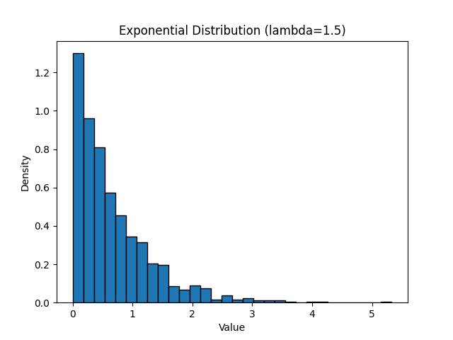
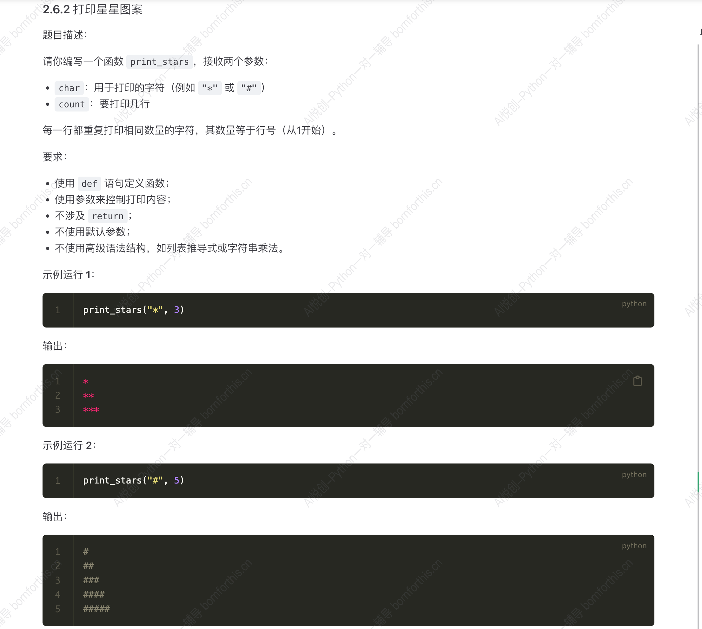
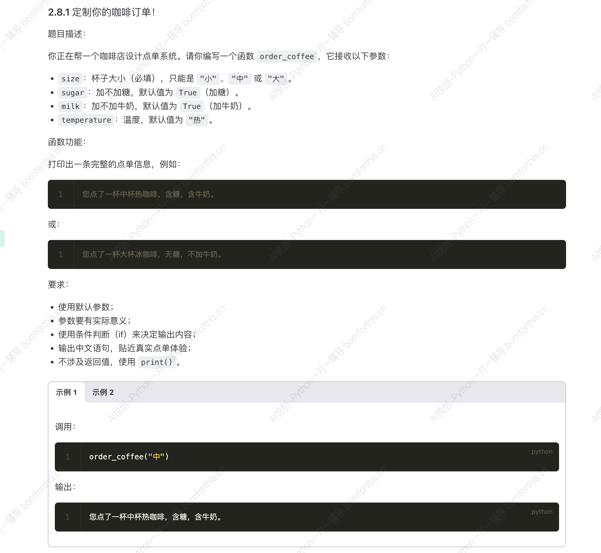
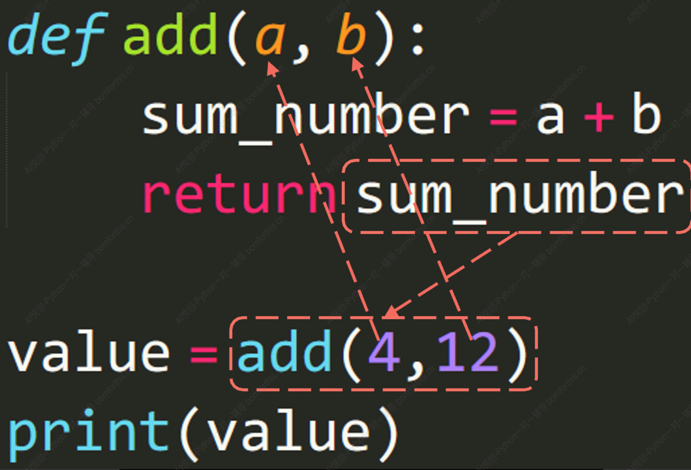

## 1. 函数的概念

### 1.1 数学函数与计算机函数

数学函数：y = f(x)

计算机函数：代码片段

- 一段具有特定功能的、可重复使用的代码。
- 用函数名表示并通过函数名完成调用。

### 1.2 使用函数的意义

- 代码的重复利用（实际上也会把代码导入进来，但是肉眼上看只需要函数名）；
- 减少程序中代码的重复量，使代码更加容易被理解；
- 让代码更易于维护与更新，只需修改封装的函数代码，其他调用的地方都会随之修改。

## 2. 函数的使用

函数可分为内置函数和用户自定义函数：

内置函数：

- Python 编程语言中已经被定好功能的函数。
- 可以直接调用来执行特定的任务。

用户自定义函数：

- 函数的功能和使用方法都由用户决定。

### 2.1 内置函数

输出函数：`print()` 

获取用户输入的函数：`input()` 

类型转换函数：`int()` , `float()` , `str()` 等。


```python
a = abs(-1)
print(a)

b = int('12')
c = 13
print(b+c)

#-------output-------
1
25
```


### 2.2 内置标准函数库— math 函数

除了内置函数外，Python 还有内置的标准函数库。

当我们把这些额外的函数库导入到我们的程序里时，我们可以用这些函数库中提供的方法。

访问这些函数时需要以 **库名.函数名**  的方式来应用。


**常用 math 函数总结**

| 常用函数               | 作用          | 常见用途       |
| ---------------------- | ------------- | -------------- |
| `pi`, `e`              | 常数          | 圆形、指数运算 |
| `sqrt`                 | 平方根        | 几何、方差     |
| `pow`                  | 幂运算        | 计算 x^y       |
| `exp`                  | e 的幂        | 指数增长       |
| `log`                  | 对数          | 信息论、熵     |
| `factorial`            | 阶乘          | 排列组合       |
| `gcd`                  | 最大公约数    | 分数约简       |
| `fabs`                 | 绝对值        | 距离           |
| `floor`, `ceil`        | 向下/向上取整 | 分段           |
| `trunc`                | 截断          | 舍去小数       |
| `sin`, `cos`, `tan`    | 三角函数      | 角度、波形     |
| `asin`, `acos`, `atan` | 反三角        | 计算角度       |
| `radians`, `degrees`   | 度 ↔ 弧度     | 单位转换       |
| `isclose`              | 浮点数比较    | 相等判断       |
| `hypot`                | 斜边          | 距离           |


#### 2.2.1 `math.pi`  和  `math.e` 

```python
import math

print('π = ', math.pi)     # π =  3.141592653589793
print('e = ', math.e)      # e =  2.718281828459045
```

`math.pi` 在计算圆面积、圆周长时常用。

 `math.e`  在指数运算、自然对数等场景常用。


#### 2.2.2 `math.sqrt(x)` 开平方

```python
import math

x = 16
result = math.sqrt(x)
print(f'{x} 的平方根是 {result}')    # 4.0
```

等价于 `x ** 0.5` ，但是`math.sqrt(x)` 的可读性更好。


#### 2.2.3 `math.pow(x, y)` 幂

```python
import math

result = math.pow(2, 3)
print('2 的 3 次幂 = ', result)      # 8.0
```

与内置的 `**` 运算符类似，但 `math.pow()` 总是返回   **`float`**   。


#### 2.2.4 `math.exp(x)`  e 的几次幂

```python
import math

result = math.exp(2)
print('e 的 2 次幂 = ', result)      # 7.38905609893065
```

计算指数增长很常用，比如复利、连续增长。


#### 2.2.5 `math.log(x[ , base])` （源代码显示，实际 `math.log(x, base)` ）

```python
import math

print(math.log(8, 2))      # 3.0 以2为底， 2^3 = 8
print(math.log(10))        # ln(10) 自然对数，不写以 e 为底
```

`math.log(x)` → 自然对数（以 e 为底）

`math.log10(x)` → 以 10 为底

`math.log2(x)` → 以 2 为底 （Python 3.3+）


#### 2.2.6 `math.factorial(x)` 阶乘

```python
import math

print(math.factorial(5))    # 120， 指的是 5！ = 5 * 4 * 3 * 2 * 1 
```

常用于组合、排列、概率


#### 2.2.7 `math.gcd(a, b)`  最大公约数

```python
import math

print(math.gcd(12, 18))    # 6
```

求最大公约数，常用于分数约简等。


#### 2.2.8 `math.fabs(x)` 绝对值，返回浮点数

```python
import math

print(math.fabs(-7))    # 7.0
```

类似内置 `abs()` ，只是 `math.fabs` 返回浮点数。


#### 2.2.9 `math.floor(x)` 和 `math.ceil(x)` 

```python
import math

x = 3.7

print(math.floor(x))     # 3
print(math.ceil(x))      # 4
```

`floor` 常用于取不超过给定值的最大整数。

`ceil` 用于取不小于给定值的最小整数。


#### 2.2.10 `math.trunc(x)` 截断小数部分

```python
import math

x = -3.7

print(math.trunc(x))     # -3
```

类似 `int()` 转换，直接去掉小数部分，**不四舍五入**。


#### 2.2.11 三角函数 sin cos tan

```python
import math

angle = math.pi / 2        # 90度
print(math.sin(angle))     # 1.0
print(math.cos(angle))     # 6.123233995736766e-17 ≈ 0
print(math.tan(angle))     # 非常大，趋于无穷
```


注意角度要先转换成弧度：`radians = degrees(角度) × π / 180` 。

遵循数学库的通用标准

π/2 弧度 = 90 度

π 弧度 = 180 度

因此利用公式， `line4` 也可以写为 `print(math.sin(90 * math.pi / 180))     # 1.0` 。

也可以利用函数 `angle = math.radians(degress)` ，将度数转化为弧度 `print(math.sin(math.radians(90)))  `。


#### 2.2.12 反三角函数 asin acos atan

```python
import math

x = 0.5
angle = math.asin(x)
print('asin(0.5) = ', angle, '弧度')
print('≈', math.degrees(angle), '度')

#-------output-------
asin(0.5) =  0.5235987755982989 弧度
≈ 30.000000000000004 度
```


#### 2.2.13 `math.hypot(x, y)` 

```python
import math

print(math.hypot(3, 4))    # 5.0
```

常用于2D平面距离计算。


### 2.3  内置标准函数库— random 函数


#### 2.3.1 1️⃣ 基础随机数生成


| 函数                             | 用途                                         | 解释                 |
| -------------------------------- | -------------------------------------------- | -------------------- |
| `random()`                       | 生成 0.0 \~ 1.0 之间的随机小数               | 左闭右开 \[0.0, 1.0) |
| `uniform(a, b)`                  | 生成 a \~ b 之间的随机小数                   | 左闭右闭 \[a, b]     |
| `randint(a, b)`                  | 生成 a \~ b 之间的随机整数                   | 左闭右闭 \[a, b]     |
| `randrange(start, stop[, step])` | 从 range(start, stop, step) 中随机选一个整数 | 类似 `range()`       |


```python
import random

print(random.random())

print(random.uniform(1, 10))

print(random.randint(1, 10))

print(random.randrange(0, 100, 5))

#-------output-------
0.7533060472818913
4.265715521633123
8
5
```


保留小数时，可以用前面学到的格式化方法，也可以用`round` 。

```python
print(round(10.111, 2)) # 四舍五入，保留两位小数

#-------output-------
10.11
```


#### 2.3.2 2️⃣ 随机选择与打乱


| 函数                | 用途                          | 解释                   |
| ------------------- | ----------------------------- | ---------------------- |
| `choice(seq)`       | 从序列中随机选 1 个元素       | 列表、元组、字符串都行 |
| `choices(seq, k=N)` | 从序列中随机选 N 个（可重复） | 有放回抽样             |
| `sample(seq, k=N)`  | 从序列中随机选 N 个（不重复） | 无放回抽样             |
| `shuffle(seq)`      | 将序列原地打乱                | 修改原列表             |


```python
import random

items = ['apple', 'banana', 'orange', 'pear']

print(random.choice(items))     # 随机选一个

print(random.choices(items, k=3))    # 随机选 3 个，可重复

print(random.sample(items, 3))     # 随机选 3 个，不重复

#-------output-------
orange
['orange', 'pear', 'orange']
['orange', 'apple', 'pear']
```


```python
import random

numbers = [1, 2, 3, 4, 5]
random.shuffle(numbers)     # 原地打乱
print(numbers)

#-------output-------
[4, 1, 3, 5, 2]
```


#### 2.3.3 3️⃣ 随机分布函数（稍进阶）


| 函数                         | 用途           | 解释 |
| ---------------------------- | -------------- | ---- |
| `betavariate(alpha, beta)`   | Beta 分布      |      |
| `expovariate(lambd)`         | 指数分布       |      |
| `gauss(mu, sigma)`           | 高斯正态分布   |      |
| `normalvariate(mu, sigma)`   | 正态分布       |      |
| `lognormvariate(mu, sigma)`  | 对数正态分布   |      |
| `vonmisesvariate(mu, kappa)` | von Mises 分布 |      |
| `gammavariate(alpha, beta)`  | Gamma 分布     |      |


```python
import random

print(random.gauss(0, 1))            # 均值0，标准差1的正态分布
print(random.normalvariate(0, 1))    # 同样生成正态分布，与上一个生成的正态分布的方法不一样
print(random.expovariate(1.5))       # 指数分布

#-------output-------
0.28990359456330556
0.18178579651038132
0.27150452972659767
```

输出的结果是一组数据中随机选了一个输出，如果需要输出多个数据，可以借助 for 循环：

```python
import random

lst = []
for _ in range(5):      # 生成 5 个数据，因为 i 后续用不到，可以用下划线代替
    lst.append(random.gauss(0, 1))
print(lst)

#-------output-------
[1.7322778531816645, 1.5177947097095652, -1.4917899545932514, 0.7663045647487722, -0.0974832602527749]
```


**场景使用：**

需要安装 `matplotlib` 包，安装失败的话需要关闭代理后再尝试。

```python
import random
import matplotlib.pyplot as plt

# 生成 1000 个指数分布随机数
expo_nums = [random.expovariate(1.5) for _ in range(1000)]

# 画直方图
plt.hist(expo_nums, bins=30, density=True, edgecolor='black')
plt.title('Exponential Distribution (lambda=1.5)')
plt.xlabel('Value')
plt.ylabel('Density')
plt.show()
```

输出结果如下：



## 3. 函数的定义

### 3.1 定义一个函数

`def` 是 `define` 的缩写，表示定义一个函数。

格式如下：

`def 函数名称():` 

​	`函数内的语句` 

当我们需要这个函数的时候，直接写 `函数名称+()` 即可。

**注意函数名称中间不要有空格，可以用下划线代替。**

```python
def HelloUser():
    print("Hello")

HelloUser()

#-------output-------
Hello
```


### 3.2 利用参数向函数传递信息

#### 3.2.1 传递一个参数

函数名称后的括号内可以输入参数，定义函数时可以对参数进行命名，调用函数时在括号内输入该参数的内容即可。

```python
def HelloUser(username):             #括号内为参数
    print("Hello! " + username)

HelloUser("lilei")                   #调用函数

#-------output-------
Hello! lilei
```


#### 3.2.2 传递多个参数

```python
def TestGrade(name, grade):
    print(name + '的成绩是' + grade + '。')

TestGrade('李雷', '99')

#-------output-------
李雷的成绩是99。
```


解决参数可能传反的问题：

若调用参数时，输入的是 `TestGrade(99, '李雷')` ，那么在执行 `print(name + '的成绩是' + str(grade) + '。')` 的时候就会报错，因为 `name` 中传入的是整型而非字符串，没有进行强制转换就无法拼接，那么为了防止传错参数，我们在调用的时候可以在参数前加上变量名。

```python
def TestGrade(name, grade):
    print(name + '的成绩是' + str(grade) + '。')

TestGrade(grade=99, name= '李雷')

#-------output-------
李雷的成绩是99。
```

类似的将变量名引入进行指定，参见 `format` 部分。


注意：开始指定参数变量后，后面的参数都需要指定，但前面的参数可以不指定。

```python
def TestGrade(age, name, grade):
    print(f'{age}岁的{name}的成绩是{grade} 。')

TestGrade(18, name = '李雷', grade = 99)     # 从第2个位置开始指定变量名了，之后的参数都需指定，但是可以看到第1个位置的无需指定。

#-------output-------
18岁的李雷的成绩是99。
```


### 3.3 Quiz

定义一个函数，含有三个参数，前两个是数字，第三个是运算符，需要得到前两个数字通过输入的运算符得到的结果。

方法一：

`if … elif`

```python
def calculate(num1, num2, operator):
    if operator == '+':
        print(f'{num1}加{num2}是{num1 + num2}')
    elif operator == '-':
        print(f'{num1}减{num2}是{num1 - num2}')
    elif operator == '*':
        print(f'{num1}乘{num2}是{num1 * num2}')
    elif operator == '/':
        print(f'{num1}除{num2}是{num1 / num2}')
    else:
        print('输入错误，请重新输入！')

calculate(1,2, '+')

#-------output-------
1加2是3
```


方法二：

`eval()` 

```python
def calculate(num1, num2, operator):
    print(num1, operator, num2, '=', eval(str(num1) + operator + str(num2)))

calculate(1, 2, '/')

#-------output-------
1 / 2 = 0.5
```

如何优化？

```python
def calculate(num1, num2, operator):
    result = f'{num1} {operator} {num2}'        # 利用 f 将其拼接
    print(f'{result} = {eval(result)}')         # 将拼接好的直接用 eval 计算

calculate(1, 2, '/')

#-------output-------
1 / 2 = 0.5
```

用 `eval` 的问题：只能进行简单的加减乘除运算。


### 3.4 函数设置默认值

一般我们在写函数时，可以设置默认值，便于用户在不提供具体参数值时正常使用函数，避免发生因为没有传入参数而产生的报错。另一种情况就是：函数的参数可选，此时也需要设置默认参数。

主要用途：

- 为函数提供一个逻辑兜底：如果调用者不传递参数或者不满足某些条件，我们也希望函数能有一个合理的“默认行为”。
- 使参数具有可选性：有些参数并不是每次都需要提供，这时给它们设置默认值能简化函数的调用。

示例如下：

```python
def greet(name='小明'):    # 简单的问候函数，如果不传入 name 参数，则使用默认值“小明”。
    print(f'你好，{name}!')

# 调用示例
greet()
greet('张三')

#-------output-------
你好，小明!
你好，张三!
```


注意：若只需要设置部分参数的默认值，则和前面调用函数时，引入变量的逻辑相同，未设置默认值的放前，设置默认值的放后，否则会报错。

错误示例：

```python
def greet(name='小明', age):   
    print(f'你好，{age}岁的{name}!')
```

正确用法：

```python
def greet(age, name='小明',):
    print(f'你好，{age}岁的{name}!')

# 调用示例
greet(18)
greet(20, '张三')

#-------output-------
你好，18岁的小明!
你好，20岁的张三!
```


用 `None` 作为默认值：

- 有时我们想要将某个参数设置为可选，但不清除具体应该给它设置哪个默认值。
- 希望在函数内部通过判断是否真的传递这个参数。

```python
def process_data(data=None):                          # 若没有传入数据，使用默认文件的数据，否则处理传入的数据
    if data is None:
        print("未提供 data 参数，使用默认数据！")
        # 这里就可以读取默认文件或默认数据
        data = [1, 2, 3, 4]
    print(f'正在处理：{data}')

# 调用示例
process_data()                       # 未提供 data 参数，使用默认数据
process_data(['a', 'b', 'c'])

#-------output-------
未提供 data 参数，使用默认数据！
正在处理：[1, 2, 3, 4]
正在处理：['a', 'b', 'c']
```


问题：参数是可变的数据类型，若用户没有传入参数，使用默认值，那么多次调用时会互相影响。

```python
def append_item(item, my_list=[]):
    my_list.append(item)
    return my_list

# 调用函数
result1 = append_item(1)   # 第一次调用，my_list=[1]
print(result1)

result2 = append_item(2)    # 第二次调用，列表里已经有 [1] 了
print(result2)              # 输出为 [1, 2]，意外的把第一次调用追加进来了

result3 = append_item(3)    # 第三次调用，继续累加
print(result3)              # 输出 [1, 2, 3]

#-------output-------
[1]
[1, 2]
[1, 2, 3]
```


**如何解决这个问题？** 

尝试一：错误

```python
def append_item(item, my_list=[]):
    my_list = []                # 增加这一步
    my_list.append(item)
    return my_list
```

如果在函数内更改，那么不管是使用默认值和自定义值都会被这句命令覆盖掉。

**解决方法：** 

```python
def append_item(item, my_list=None):
    if my_list is None:                 # 先判断用户有没有传入参数，若没有传入参数，再设置默认值
        my_list = []
    my_list.append(item)
    return my_list


# 调用函数
result1 = append_item(1)  
print(result1)

result2 = append_item(2)   
print(result2)              

result3 = append_item(3)    
print(result3)             

#-------output-------
[1]
[2]
[3]
```


其他正确情况举例：

```python
def append_item(item, my_list=[]):
    my_list.append(item)
    return my_list


# 情况1:重新自定义传入的列表，不使用默认值，多次调用不会影响
result1 = append_item(10, ['a', 'b'])
print(result1)

result2 = append_item(20, ['c', 'd'])
print(result2)

# 情况2：单独传入自定义列表，多次调用的目的就是为了逐步增加
lst = ['a', 'b']
result3 = append_item(100, lst)
print(result3)

result4 = append_item(200, lst)
print(result4)

#-------output-------
['a', 'b', 10]
['c', 'd', 20]
['a', 'b', 100]
['a', 'b', 100, 200]
```


设定默认值的情况下传入参数：

```python
def make_drink(size='中杯', drink_type='奶茶', ice=True):
    result = f'{size}的{drink_type}'
    result += f'(去冰)' if not ice else ''       # if not ice 成立 输出前面，不成立输出 else 后面
    # 等价于
    # if not ice:
    #     result += '去冰'
    # else:
    #     result += ''
    print(f'正在制作：{result}')

# 调用举例
make_drink()           # 中杯奶茶
make_drink('大杯')      # 大杯的奶茶
make_drink('大杯', '柠檬茶')      # 大杯的柠檬茶
make_drink(drink_type='果汁')                  # 中杯的果汁
make_drink(ice=False)                         # 中杯的奶茶（去冰）
```


### 3.5 练习




方法一：使用乘法

```python
def print_stars(char, count):
    for i in range(1, int(count) + 1):
        print(char * i)

print_stars('*', 3)
```

优化：

传入 count 参数时就是整型，因此不必转换数据类型

```python
def print_stars(char, count):
    for i in range(1, count + 1):
        print(char * i)

print_stars('*', 3)
```


方法二：两层循环

```python
def print_stars(char, count):
    for i in range(1, int(count) + 1):
        for j in range(i):
            print(char, end='')          # 内层循环每次结尾改为空，不换行
        print()                          # 内层循环全部结束后输出换行

print_stars('*', 3)
```




Answer:

```python
def order_coffee(size, sugar=True, milk=True, temperature='热'):
    if sugar:
        if milk:
            print(f'您点了一杯{size}杯{temperature}咖啡，含糖，含牛奶')
        else:
            print(f'您点了一杯{size}杯{temperature}咖啡，含糖，不加牛奶')
    else:
        if milk:
            print(f'您点了一杯{size}杯{temperature}咖啡，无糖，含牛奶')
        else:
            print(f'您点了一杯{size}杯{temperature}咖啡，无糖，不加牛奶')

order_coffee('中')
order_coffee('大', sugar=False, milk=False, temperature='冰')
```

优化：

取消重复工作

1. `您点了一杯{size}杯{temperature}咖啡` 重复了四次，可以单独设置一个变量作为模板  `message = f'您点了一杯{size}杯{temperature}咖啡，'`  或 `message = '您点了一杯{size}杯{temperature}咖啡，'.format(size=size, temperature=temperature)`  。
2. “含糖”重复2次，类似的四个词语均重复，考虑在模板后拼接，因此代码可以修改如下：

```python
def order_coffee(size, sugar=True, milk=True, temperature='热'):
    message = f'您点了一杯{size}杯{temperature}咖啡，'
    # message = '您点了一杯{size}杯{temperature}咖啡，'.format(size=size, temperature=temperature)
    if sugar:
        message += '含糖，'
    else:
        message += '无糖，'
    if milk:
        message += '含牛奶'
    else:
        message += '不加牛奶'
        
    print(message)


order_coffee('中')
order_coffee('大', sugar=False, milk=False, temperature='冰')
```


## 4. 适当的使用函数便于协作

将复杂的代码和逻辑封装成一个函数，对外提供一个简单的接口，解决了代码冗余和难以理解的问题。

例如：计算两地距离

代码如下：

```python
import math

# 定义地球半径（单位：公里）
R = 6371.0

# 示例：计算洛杉矶到纽约的距离
lat1, lon1 = 34.052235, -118.243683  # 洛杉矶
lat2, lon2 = 40.712776, -74.005974  # 纽约

# 将纬度和经度从度数转换为弧度
lat1, lon1, lat2, lon2 = map(math.radians, [lat1, lon1, lat2, lon2])

# Haversine公式
dlat = lat2 - lat1
dlon = lon2 - lon1
a = math.sin(dlat / 2) ** 2 + math.cos(lat1) * math.cos(lat2) * math.sin(dlon / 2) ** 2
c = 2 * math.atan2(math.sqrt(a), math.sqrt(1 - a))

# 计算距离
distance = R * c
print(f"两个地点之间的距离为 {distance:.2f} 公里")
```


上面实现了两个经纬度之间坐标的距离，朋友想要使用这个程序计算距离，但是他不懂代码看的头都大了，只想知道“如何输入经纬度，如何得到结果”，对内部算法毫无兴趣，因此可以将代码封装成函数再发给朋友。

封装后的代码如下：

```python
import math

def distance_cal(lat1, lon1, lat2, lon2):

    # 定义地球半径（单位：公里）
    R = 6371.0

    # 将纬度和经度从度数转换为弧度
    lat1, lon1, lat2, lon2 = map(math.radians, [lat1, lon1, lat2, lon2])

    # Haversine公式
    dlat = lat2 - lat1
    dlon = lon2 - lon1
    a = math.sin(dlat / 2) ** 2 + math.cos(lat1) * math.cos(lat2) * math.sin(dlon / 2) ** 2
    c = 2 * math.atan2(math.sqrt(a), math.sqrt(1 - a))

    # 计算距离
    distance = R * c
    print(f"两个地点之间的距离为 {distance:.2f} 公里")
```

我们可以将这个代码文件直接命名为 `LoveDistance` 方便在另一个代码文件中调用。


新建一个代码文件，注意要和刚才的 `LoveDistance` 文件在同一个层级下，第一行导入这个封装的代码 `import LoveDistance` 。

```python
import LoveDistance

# 示例：计算洛杉矶到纽约的距离
lat1, lon1 = 34.052235, -118.243683  # 洛杉矶
lat2, lon2 = 40.712776, -74.005974  # 纽约

distance = LoveDistance.distance_cal(lat1, lon1, lat2, lon2)     # 这一步可以不进行赋值，因为封装的代码里包含 print 语句
```


优点：

- 简化调用：朋友只需要关心如何传入坐标，无需了解内部计算细节。
- 方便维护：若需要调整算法，只需要修改 `distance_cal`  函数内部代码，调用部分的代码保持不变。
- 提高协作效率：代码模块化后，团队成员之间可以独立开发和调试。

注意：这个部分的重点在于更加理解函数存在的意义，至于不同文件之间函数的调用，后续会详细讲解。


## 5. 返回值 return

作用：返回函数的计算结果、并结束函数的执行。

当执行到 `return` 时，会把后面的结果（如果有的话）返回给调用者，随后立即结束当前函数。

若没写，默认返回 `None` ，表示不返回任何有意义的值。

语法如下：

```python
def 函数名(参数):
    # 函数体
    return 返回值
```

理解 `return` ：家具 vs. 管道疏通

word 做成 PPT vs. 送材料

所以说函数的 `return` 不是必须的，那么什么时候需要？什么时候不需要呢？

依据一：看函数操作的结果是否需要，类似数据计算/红木家具制作，就需要；

依据二：如果只需要函数操作，不需要返回具体的操作结果，就可以不用 return；

依据三：函数需要提前结束时，可以借助 return 对函数的特性。


```python
# 只能看见结果（函数没有返回值）
# 就像只能看到仪器输出的结果，但却无法在其他地方使用它
def show_calculation_result(x, y):
    result = x + y
    print(f'计算结果是：{result}')     # 只能在此看到结果

# 调用函数
output = show_calculation_result(3, 4)
print(f'函数的返回值是：{output}')            # 函数实际没有返回值，因此得到 None

#-------output-------
计算结果是：7
函数的返回值是：None
```


如果尝试在函数外调用 `result`  的值，则会报错。因此必须得到返回值才能进一步操作。

```python
def get_calculation_result(x, y):
    result = x + y
    return result

# 调用函数并接收函数返回值
output = get_calculation_result(3, 4)
print(f'拿到的计算结果是：{output}')

# 有了结果后续可以继续更多操作
print(f'后续操作比如结果再乘以10：{output*10}')

#-------output-------
拿到的计算结果是：7
后续操作比如结果再乘以10：70
```


是否有返回值不能判断程序是否执行。

不需要返回值情况一：

```python
def unblock_toilet():
    print('开始处理——有人拉了一根巨大的屎，导致厕所堵了。')
    # 模拟耗费了 30 分钟
    print('正在通厕所中...（耗时 30 分钟）')
    print('厕所已经通了，问题解决！')
    # 这里没有 return ，因为不需要交付任何结果给外部   
    
# 主程序
unblock_toilet()       # 调用函数，虽然没有返回值，但是“师傅”确实执行了工作

#-------output-------
开始处理——有人拉了一根巨大的屎，导致厕所堵了。
正在通厕所中...（耗时 30 分钟）
厕所已经通了，问题解决！
```

不需要返回值情况二：

```python
def add_member(member_list, new_member):
    """
    将 new_member 添加到 member_list中。
    函数没有 return， 因为操作结果（添加新成员）
    直接反映在原列表上。
    """

    print(f'正在添加新成员：{new_member}')
    member_list.append(new_member)            # 直接修改了传入的列表对象
    print('添加完成，当前列表：', member_list)

# 定义一个列表
my_team = ['Alice', 'Bob']
print('初始列表：', my_team)


# 调用函数，不接收任何返回值
add_member(my_team, 'Charlie')

# 函数虽然没有 return，但 my_team 已经被修改
print('最终列表：', my_team)

#-------output-------
初始列表： ['Alice', 'Bob']
正在添加新成员：Charlie
添加完成，当前列表： ['Alice', 'Bob', 'Charlie']
最终列表： ['Alice', 'Bob', 'Charlie']
```

上述代码虽然没有返回值，但是对传入的列表做了实质性的修改，说明函数确实干了活，原列表直接发生了变化，因此无需再返回新列表。

**总结：** 上述两个代码都证明了，不需要返回值，但是也完成了这个工作。


需要返回值情况：

- 返回单个值



因此最后输出值为 `16` 。


- 返回多个值

其实当我们想要返回多个值时，我们可以取巧的方法。先来一个实际场景：

午饭你做了两菜一汤，此刻你要把饭菜带到家里的三楼书房中用餐，如何只走一趟把饭菜拿到楼上。我们就可以拿一个托盘或菜篮装进去，就可以一次性带到三楼书房。哎，这个把饭菜（两菜一汤）带到三楼书房的过程，就像是返回多个值。

来个小插曲：谁是函数？——做好饭、拿饭菜的你！没错，就是牛马的你～

从上面这个场景可以看出，托盘、菜篮这两个是容器！

有了容器这个关键词，我们触发到 python 中的列表、元组、字典、集合等容器的数据类型。

所以对于函数返回多个值的方法之一就是：把多个值放到一个容器里，然后再去返回。（把多个值放到列表、元组、字典、集合等容器中，再去 return）。


列表、元组、字典、集合如何选择？

抓住两点：

- 待返回的数据有什么特点；
- 知道 python 的每种数据类型有什么特点。

**汇总：** 基于要点一、要点二，可以选择出合适的数据类型。对于要点一来说，如果返回的数据是联系人（姓名、手机号），那么就可以选择字典；如果每个结果是独立的，那么可以选择列表、元组、集合。


偷懒的方法就是将输出的多个数据用逗号 `,` 隔开，会默认返回：元组类型。

代码示例如下：

```python
def get_coordinates():
    x = 10
    y = 20
    return x,y                          # 返回多个值可以直接按照元组形式输出 return (x, y), 也可以按照列表形式 return [x, y]


x_coord,y_coord = get_coordinates()
print(x_coord,y_coord)

result = get_coordinates()               # 默认多个返回值按照元组输出
print(result)

#-------output-------
10 20
(10, 20)
```


函数没有返回值，直接输出结果会得到 None。

```python
def greet():
    print("Hello!")

result = greet()
print(result)

#-------output-------
Hello!
None
```


**再次强调**：函数没有返回值，赋值操作会得到 None。此刻，可以想想之前哪些函数拥有返回值，哪些函数没有拥有？

比如 `sort` 和 `sorted` ，`sort` 修改列表本身，因此没有返回值，也不需要赋值；`sorted` 的结果有返回值，要进行赋值再进一步使用。

**等补充** 


return 的结束函数功能：

```python
def check_number(num):
    if num > 0:
        return 'Positive'
    else:
        return 'Negative'
    print('猜一猜会不会执行~')

print(check_number(5))
print(check_number(-3))

#-------output-------
Positive
Negative
```

因为返回值会结束函数，因此不会执行函数内 `return` 后的代码。

**总结：** 

- `return` 语句可以返回值并结束函数。
- 如果没有指定 `return` ，函数会返回 `None` 。
- `return` 可以返回单个值、多值，甚至什么也不返回。
- 只有循环存在于函数当中，就算循环没有执行完成，一遇到 `return` 就会马上停止，因为 `return` 会结束函数，而循环会存在于函数之中，故而函数结束影响到循环，循环随之结束。


### 6. 题目：构造拼字游戏

你需要编写一个函数，它接受一个由多个单词组成的字符串列表，目标是找出所有能用列表中的单词拼成的新单词，并返回拼出的新单词的个数。

**要求**：

1. 如果某个单词由两个或多个列表中的单词拼接而成，则认为它是一个拼出的单词。
2. 比如，给定 `["cat", "dog", "cats", "dogcat"]`，`"dogcat"` 是由 `"dog"` 和 `"cat"` 拼成的，算作一个新单词。
3. 如果某个单词本身就在列表中，不算作拼出的单词。

### 输入：

* 一个字符串列表 `words`，表示多个单词。

### 输出：

* 返回一个整数，表示可以由其他单词拼接而成的单词数量。

### 示例：

```python
words = ["cat", "dog", "cats", "dogcat", "rat", "catsdog"]
result = find_composed_words(words)
print(result)
```

### 示例输出：

```
2
```

### 提示：

1. "dogcat" 和 "catsdog" 是可以拼成的新单词。
2. `"cat"`, `"dog"`, `"rat"` 等单词本身不算。

### 代码模板：

```python
def find_composed_words(words: list) -> int:   # 该代码表示words这个参数的类型是列表，箭头后说明返回值是整型
    pass
```


### 题目说明：

我们需要编写一个函数，找出列表中所有由其他单词拼接成的单词。拼接是指两个或更多的单词组合成一个新单词，但这个新单词不能仅仅是原本在列表中存在的单词。

### 示例1：

`words = ["cat", "dog", "cats", "dogcat"]`

* `"dogcat"` 是由 `"dog"` 和 `"cat"` 拼接而成的，所以它是一个拼接出来的新单词。
* `"cat"`, `"dog"`, `"cats"` 本身已经在列表中，不算作拼接的单词。
* 所以，返回值应该是 `1`，因为只有 `"dogcat"` 能够拼接出来。

### 示例2：

`words = ["bat", "man", "batman"]`

* `"batman"` 是由 `"bat"` 和 `"man"` 拼接而成的。
* `"bat"`, `"man"` 本身在列表中，所以不算拼接的单词。
* 所以，返回值是 `1`，因为 `"batman"` 是唯一一个拼接的单词。

### 结论：

这个问题的关键是判断一个单词是否能通过拼接其他列表中的单词来构成，而不仅仅是列表中已经存在的单词。


---

Answer:

```python
def find_composed_words(words: list) -> int:
    # 将单词列表转为集合，便于快速查找和判断
    word_set = set(words)
    
    # 用来判断某个单词是否能由其他单词组成
    def can_form(word):
        # 从位置 i 切分为 word[:i] 和 word[i:]
        for i in range(1, len(word)):
            prefix = word[:i]      # 前缀部分
            suffix = word[i:]      # 后缀部分

            # 如果前缀是集合中的单词，且后缀满足：
            # 1. 后缀本身是单词，或者
            # 2. 后缀可以递归地由其他单词组成
            if prefix in word_set and (suffix in word_set or can_form(suffix)):
                return True
        return False

    count = 0  # 统计拼接成的新单词数量

    for word in words:
        # 先从集合中移除自己，避免拼接时用到自己本身
        word_set.remove(word)
        if can_form(word):  # 检查是否能被拼出
            count += 1
        word_set.add(word)  # 加回集合，供后续判断使用

    return count

```


---

### 7. 题目：旋转数组

#### 描述：

给定一个整数列表`nums`，请编写一个函数，**将该列表循环右移k个位置**。你可以使用多种方法解决这个问题，但要求实现时不能直接使用列表的`reverse()`方法。你需要实现一个算法来优化旋转过程。

#### 示例：

```python
rotate([1, 2, 3, 4, 5, 6, 7], 3)
```

**输出**：

```
[5, 6, 7, 1, 2, 3, 4]
```

#### 说明：

1. 给定一个列表`[1, 2, 3, 4, 5, 6, 7]`，如果我们将其右移3位，得到的结果应该是`[5, 6, 7, 1, 2, 3, 4]`。
2. `k`的值可能大于列表长度，但你可以使用`k % len(nums)`来减少不必要的旋转。

### 要求：

* 你需要编写一个函数来完成这个操作，并且尽量优化时间复杂度（考虑空间和时间复杂度的平衡）。

#### 提示：

* 如果`k`大于列表的长度，可以使用`k % len(nums)`来优化旋转次数。

---

Answer:

```python
def rotate(nums, k):
    list1 = nums[:(len(nums)-(k % len(nums)))]
    list2 = nums[(len(nums)-(k % len(nums))):]
    return list2+list1


# 示例 1：标准情况，旋转 3 位
print(rotate([1, 2, 3, 4, 5, 6, 7], 3))
# 输出：[5, 6, 7, 1, 2, 3, 4]

# 示例 2：k 大于列表长度，测试是否能正确取模
print(rotate([1, 2, 3], 5))
# 输出：[2, 3, 1]

# 示例 3：k 为 0，不旋转
print(rotate([10, 20, 30], 0))
# 输出：[10, 20, 30]

# 示例 4：空列表
print(rotate([], 4))
# 输出：[]

#-------output-------
Traceback (most recent call last):
  File "D:\Coder\test 1\test 2.py", line 21, in <module>
    print(rotate([], 4))
  File "D:\Coder\test 1\test 2.py", line 2, in rotate
    list1 = nums[:(len(nums)-(k % len(nums)))]
ZeroDivisionError: integer division or modulo by zero
[5, 6, 7, 1, 2, 3, 4]
[2, 3, 1]
[10, 20, 30]
```


修改：要考虑空列表的情况

```python
def rotate(nums, k):
    """
    将列表 nums 向右旋转 k 位

    参数:
    nums -- 待旋转的整数列表
    k -- 旋转的位数
    """
    n = len(nums)  # 获取原始列表的长度
    if n == 0:
        return []  # 空列表，直接返回空列表

    k = k % n  # 防止k大于列表长度，取模进行优化

    # 使用切片操作：列表的最后 k 个元素 + 剩下的前 n-k 个元素
    rotated = nums[-k:] + nums[:-k]

    return rotated  # 返回旋转后的新列表

# 示例 1：标准情况，旋转 3 位 
print(rotate([1, 2, 3, 4, 5, 6, 7], 3))
# 输出：[5, 6, 7, 1, 2, 3, 4]

# 示例 2：k 大于列表长度，测试是否能正确取模
print(rotate([1, 2, 3], 5))
# 输出：[2, 3, 1]

# 示例 3：k 为 0，不旋转
print(rotate([10, 20, 30], 0))
# 输出：[10, 20, 30]

# 示例 4：空列表
print(rotate([], 4))
# 输出：[]
```


