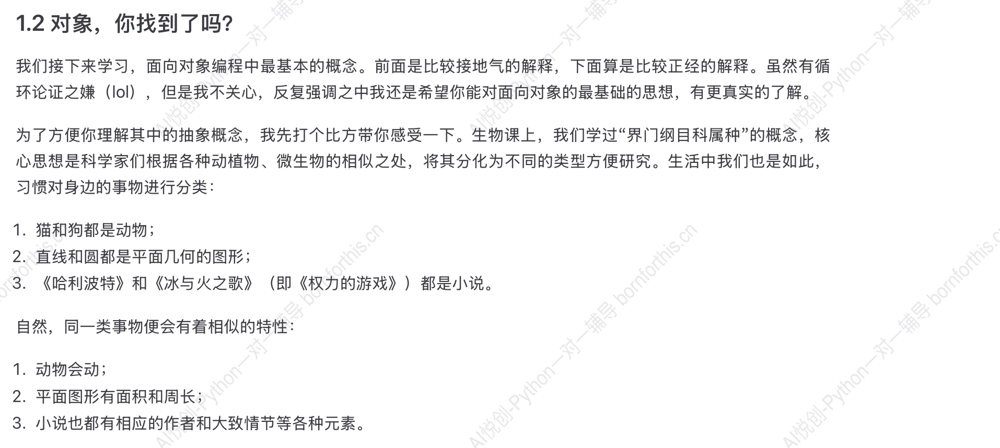

## 1. 面向对象

将程序任务涉及到的事物抽象为一个个的对象，以这些对象为中心来写程序。

### 1.1 什么是类？

**类** 和 **实例**

物以类聚，人以群分

- 狗是一类动物，具有相同、相似属性。（类）
- 两只狗，半斤和八两，出生后不会互相影响，彼此是独立的个体。（实例）
- 当类改变的时候，实例也会受到影响；但实例改变时，不会影响其他实例或者整个类。


### 1.2 对象，你找到了吗？



修改下面的代码：

```python
dog_x = 0
cat_x = 0

def dog_move():
    dog_x = dog_x + 10

def cat_move():
    cat_x = cat_x + 10

user_input = input()

if user_input == 'move':
    dog_move()
    cat_move()
```


个人修改如下：

```python
dog_x = 0
cat_x = 0

def dog_move():
    global dog_x
    dog_x = dog_x + 10
    return dog_x

def cat_move():
    global cat_x
    cat_x = cat_x + 10
    return cat_x

user_input = input()

if user_input == 'move':
    print('dog:{}, cat:{}'.format(dog_x, cat_x))
    dog_move()
    cat_move()
    print('dog:{}, cat:{}'.format(dog_x, cat_x))
   
```

return 可以不加。

为什么要加上 global？因为 `dog_x` 是全局变量，如果不加上 global，函数内的 `dog_x` 会被视为局部变量，无法修改全局变量的值。


错误修改如下，请找错：

```python
def dog_move():
    dog_x = 0
    dog_x = dog_x + 10


def cat_move():
    cat_x = 0
    cat_x = cat_x + 10


user_input = input('输入指令:')

if user_input == 'move':
    print('dog:{}, cat:{}'.format(dog_x, cat_x))
    dog_move()
    cat_move()
    print('dog:{}, cat:{}'.format(dog_x, cat_x))
```

错误一：局部变量在函数外不能使用

错误二：每次调用函数，dog_x 和 cat_x 都会被重置为 0，因此每次调用函数的时候，输出结果都是 10，一直在原地踏步。


现在，除了猫和狗，还要加一个大象，让它也像猫狗一样前进10。注意：不要机械的写代码，要好好感受一下写代码的时候有什么情绪，这对后续对象的理解有帮助。

感受：类似的东西在重复添加。我们上面定义了三个相似的函数，功能一样，只是**变量** 名称不一样，没必要创造这么多函数。例如：程序注册新用户，需要用户名、手机号、密码，那是不是要为每一个用户都创建一个函数来储存呢？

```python
# 我们现在有三个用户要注册，每个用户都要填写用户名、手机号、密码
# 如果我们不优化代码，那可能会像下面这样写：

def register_user1():
    username1 = input("请输入用户1的用户名：")
    phone1 = input("请输入用户1的手机号：")
    password1 = input("请输入用户1的密码：")
    print("用户1注册成功！用户名：{}，手机号：{}".format(username1, phone1))


def register_user2():
    username2 = input("请输入用户2的用户名：")
    phone2 = input("请输入用户2的手机号：")
    password2 = input("请输入用户2的密码：")
    print("用户2注册成功！用户名：{}，手机号：{}".format(username2, phone2))


def register_user3():
    username3 = input("请输入用户3的用户名：")
    phone3 = input("请输入用户3的手机号：")
    password3 = input("请输入用户3的密码：")
    print("用户3注册成功！用户名：{}，手机号：{}".format(username3, phone3))


# 现在我们要依次注册这三个用户
register_user1()
register_user2()
register_user3()
```

## 2. 一个例子：面向对象的方法

### 2.1 面向对象代码基础

接下来，我们要使用面向对象的方法来实现前面动物听到指令就往前跑的功能。

```python
class Animal():
    def __init__(self):
        self.x = 0
        
    def move(self):
        self.x = self.x + 10

dog = Animal()
cat = Animal()

user_input = input('输入指令：')

if user_input == 'move':
    dog.move()
    cat.move()
    print('Dog position:', dog.x)
    print('Cat position:', cat.x)
```


