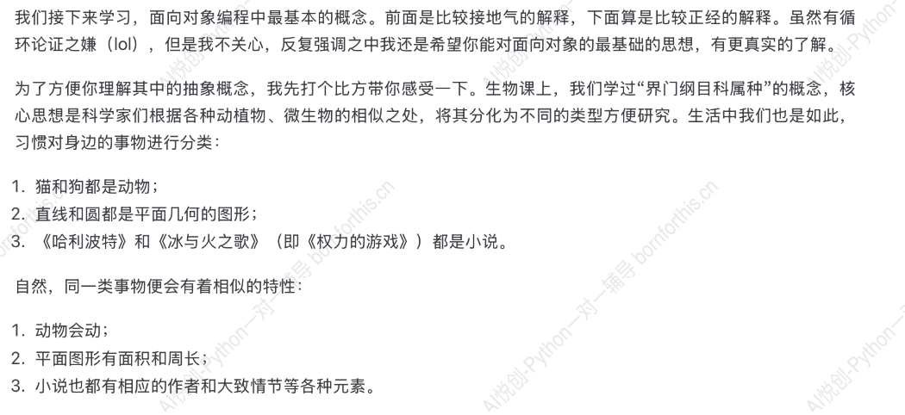
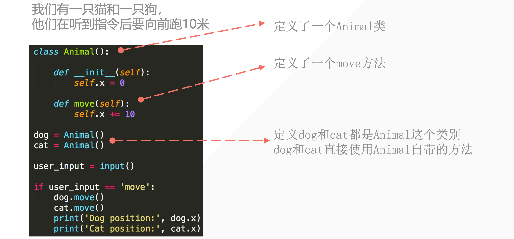
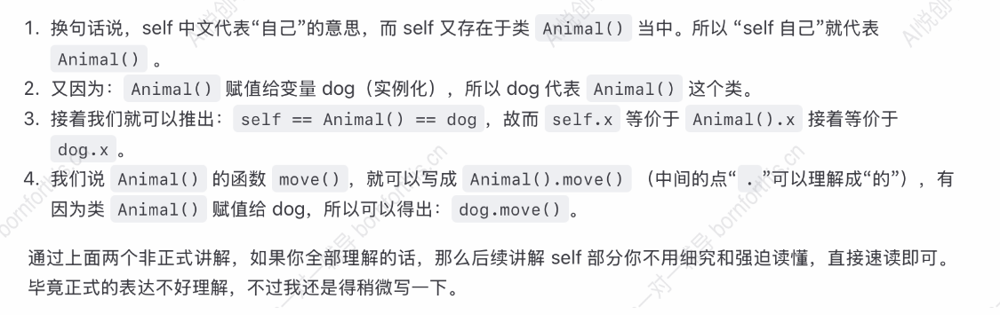
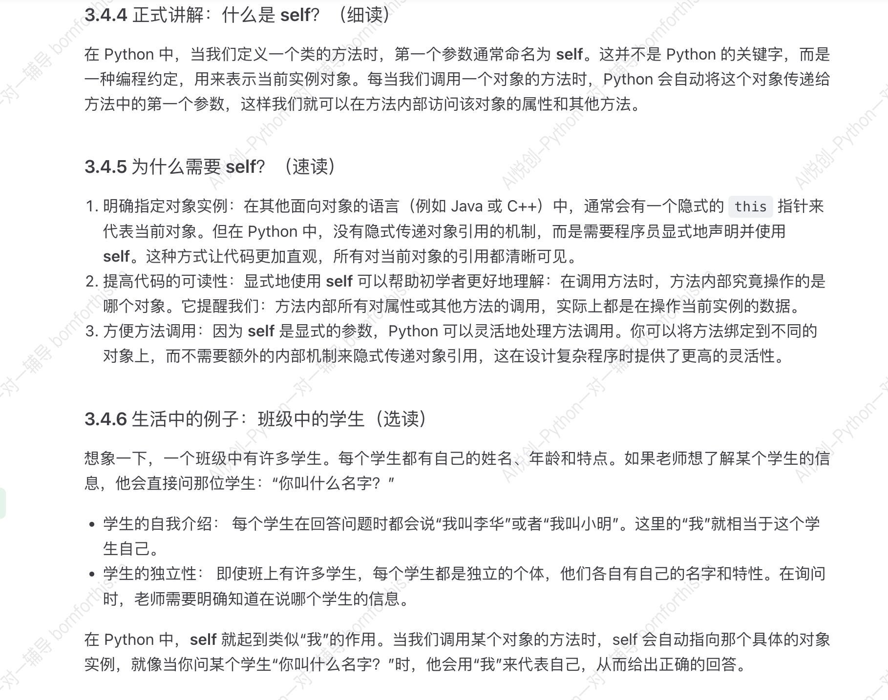
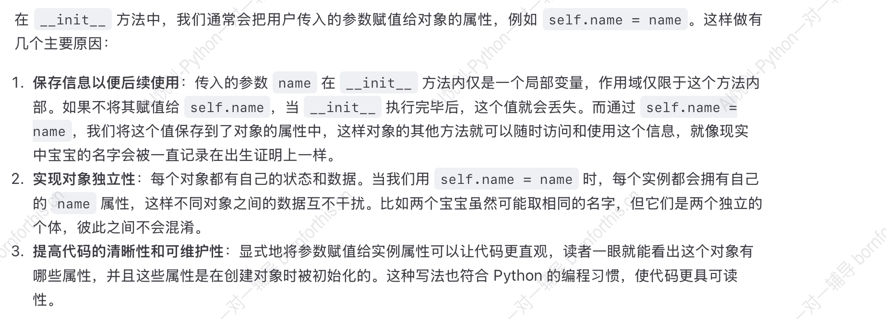
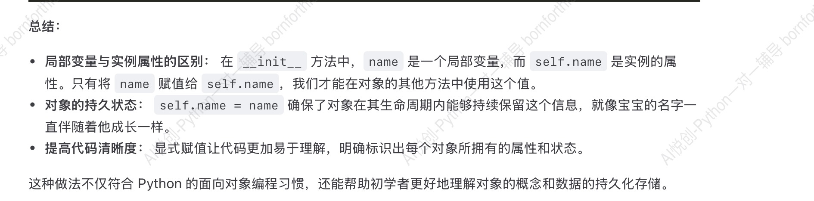
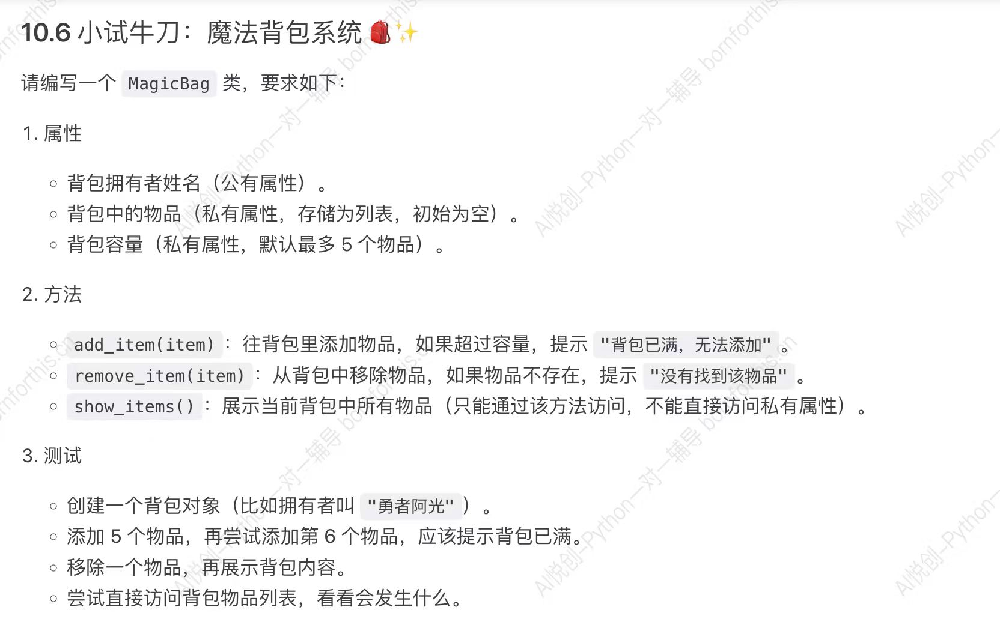
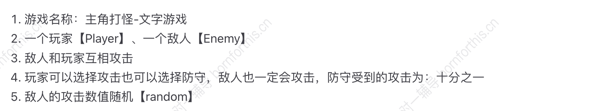
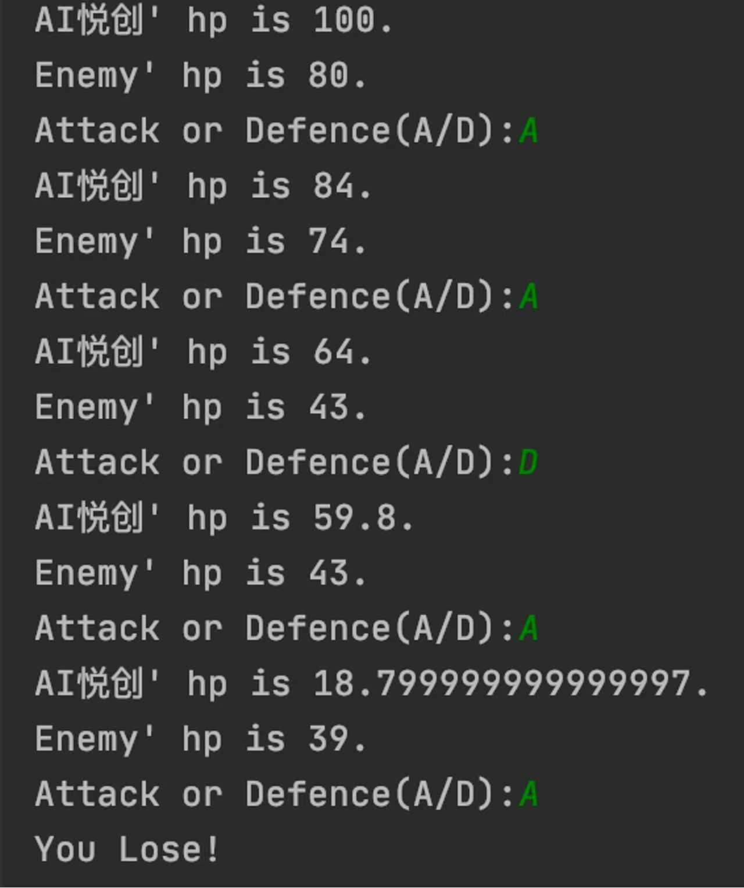
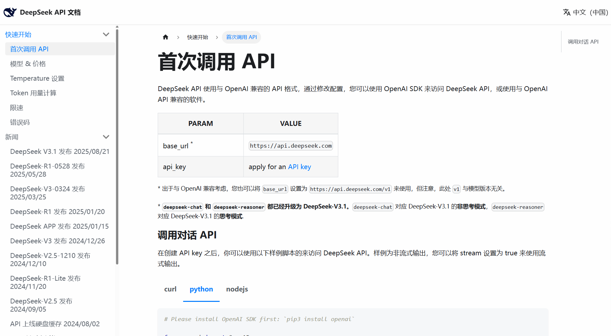

## 1. 面向对象

将程序任务涉及到的事物抽象为一个个的对象，以这些对象为中心来写程序。

### 1.1 什么是类？

**类** 和 **实例**

物以类聚，人以群分

- 狗是一类动物，具有相同、相似属性。（类）
- 两只狗，半斤和八两，出生后不会互相影响，彼此是独立的个体。（实例）
- 当类改变的时候，实例也会受到影响；但实例改变时，不会影响其他实例或者整个类。


### 1.2 对象，你找到了吗？



1. 下面是一段错误代码，`dog_x` 和 `cat_x` 分别是狗和猫的位置坐标，在检测到用户输入为 “move” 时，让猫和狗都前进 10 的长度。

原代码如下，请修改：

```python
dog_x = 0
cat_x = 0

def dog_move():
    dog_x = dog_x + 10

def cat_move():
    cat_x = cat_x + 10

user_input = input()

if user_input == 'move':
    dog_move()
    cat_move()
```


个人修改如下：

```python
dog_x = 0
cat_x = 0

def dog_move():
    global dog_x
    dog_x = dog_x + 10
    return dog_x

def cat_move():
    global cat_x
    cat_x = cat_x + 10
    return cat_x

user_input = input()

if user_input == 'move':
    print('dog:{}, cat:{}'.format(dog_x, cat_x))
    dog_move()
    cat_move()
    print('dog:{}, cat:{}'.format(dog_x, cat_x))
   
```

复盘：

- 为什么要加上 global？因为 `dog_x` 是全局变量，如果不加上 global，函数内的 `dog_x` 会被视为局部变量，无法修改全局变量的值。
- return 可以不加，因为已经声明为全局变量了，后面输出可以直接使用。


2. 下面是另一位同学的错误修改，请找出错误：

```python
def dog_move():
    dog_x = 0
    dog_x = dog_x + 10


def cat_move():
    cat_x = 0
    cat_x = cat_x + 10


user_input = input('输入指令:')

if user_input == 'move':
    print('dog:{}, cat:{}'.format(dog_x, cat_x))
    dog_move()
    cat_move()
    print('dog:{}, cat:{}'.format(dog_x, cat_x))
```

错误一：局部变量在函数外不能使用；

错误二：每次调用函数，`dog_x`  和 `cat_x`  都会被重置为 0，因此每次调用函数的时候，输出结果都是 10，一直在原地踏步。


3. 现在，除了猫和狗，还要加一个大象，让它也像猫狗一样前进 10。注意：不要机械的写代码，要好好感受一下写代码的时候有什么情绪，这对后续对象的理解有帮助。

感受：类似的东西在重复添加。我们上面定义了三个相似的函数，功能一样，只是**变量** 名称不一样，没必要创造这么多函数。例如：程序注册新用户，需要用户名、手机号、密码，那是不是要为每一个用户都创建一个函数来储存呢？

```python
# 我们现在有三个用户要注册，每个用户都要填写用户名、手机号、密码
# 如果我们不优化代码，那可能会像下面这样写：

def register_user1():
    username1 = input("请输入用户1的用户名：")
    phone1 = input("请输入用户1的手机号：")
    password1 = input("请输入用户1的密码：")
    print("用户1注册成功！用户名：{}，手机号：{}".format(username1, phone1))


def register_user2():
    username2 = input("请输入用户2的用户名：")
    phone2 = input("请输入用户2的手机号：")
    password2 = input("请输入用户2的密码：")
    print("用户2注册成功！用户名：{}，手机号：{}".format(username2, phone2))


def register_user3():
    username3 = input("请输入用户3的用户名：")
    phone3 = input("请输入用户3的手机号：")
    password3 = input("请输入用户3的密码：")
    print("用户3注册成功！用户名：{}，手机号：{}".format(username3, phone3))


# 现在我们要依次注册这三个用户
register_user1()
register_user2()
register_user3()
```

## 2. 一个例子：面向对象的方法

### 2.1 面向对象代码框架

接下来，我们要使用面向对象的方法来实现前面动物听到用户输入指令 `move` 就往前跑的功能。

```python
class Animal():
    def __init__(self):
        self.x = 0
        
    def move(self):
        self.x = self.x + 10

dog = Animal()
cat = Animal()

user_input = input('输入指令：')

if user_input == 'move':
    dog.move()
    cat.move()
    print('Dog position:', dog.x)
    print('Cat position:', cat.x)
```

上述代码包含几个内容：

- 类：一群有相似性的事物的集合，对应 Python 里的 class
- 对象：集合中的一个事物，对应 class 里生成的一个 object，比如代码中的 dog 和 cat。（其实就是上文提到的实例）
- 属性：对象的某个静态特征，是自身携带的，比如代码中的 x
- 函数：对象（实例）的某个动态能力，比如上述代码中的 `move()` 函数。





### 2.2 `_ _ init_ _(self)` 函数

自动调用函数

```python
class Animal():
    def __init__(self):                # 在一个对象生成时会被自动调用的函数
        self.x = 0
```

验证的代码如下：

```python
class Animal():
    def __init__(self):
        print('init function called')
        
dog = Animal()

#-------output-------
init function called
```

上述代码中，没有调用 `_ _init_ _()` 这个函数，但是将 dog 定义在 Animal 这个类别里的时候自动运行了这个函数，即自动调用的函数。类似于一出生就自带的天赋技能。


例子一：创建游戏角色。

每个角色一出生就会自动拥有一些天赋技能，这些技能不是手动添加的，而是角色一出生系统就帮你准备好了。

```python
class GameCharacter():
    def __init__(self):
        print('角色已创建，天赋技能已激活！')

hero = GameCharacter()

#-------output-------
角色已创建，天赋技能已激活！
```

例子二：

就像我们人类在一诞生的时候，没人教我们怎么呼吸、怎么让心脏跳动——这些能力是与生俱来的，是“出生那一刻就自动开始执行”的。Python 中的 __init__ 方法（函数），就像“呼吸”和“心跳”一样。当我们创建一个新的对象（生命、实例化）时，它会自动执行，不需要我们手动去调用。

```python
class Human():
    def __init__(self):
        print('一个新生命诞生了，正在自动启动呼吸和心跳系统。')

baby = Human()

#-------output-------
一个新生命诞生了，正在自动启动呼吸和心跳系统。
```


### 2.3 `move(self)`  函数

`move(self)` 函数就是和我们前面将的基本函数的意思、功能是一样的。

只不过这里面是属于类里面的功能函数。


### 2.4 类当中的 self

#### 2.4.1 非正式讲解1

```python
class Animal():
    def __init__(self):
        self.x = 0
        
    def move(self):
        self.x = self.x + 10

dog = Animal()

if user_input == 'move':
    dog.move()
print('Dog position:', dog.x)
```

`self` 指的是本身，在 `Animal()` 内部，指的就是  `Animal()` ，当把  `Animal()`  赋值给 `dog` 时，`dog = Animal = self` 。

因此：

- `self.x`  → `Animal().x ` → `dog.x` ，这也就解释了 `dog.x` 可以作为一个变量输出。
- 要调用 `Animal()` 里的函数，是 `Animal().move()` ，又因为上述的等价原因， `Animal().move()` = `dog.move()` 。
- 类里面的每个函数都要加上 `self` ，代表都属于类的一员，如同家族的族徽，代表都属于家族的一员。
- 有了 `self` 这个族徽，意味着家族的资源都可以互相使用。例如：家族的百万棋盘，所有家族成员都可以直接使用，如果不是同一家族的就得看情况了。所以当类里面存在变量，包括各个函数的变量，如果在变量的前面加上 `self(self.x)` ，则在类中，所有函数都可以随时调用变量 `self.x` ，在函数内外都可以访问。

注意：

- 在常规函数中，每个函数都是独立的。函数和函数之间的变量，不能互相调用，除非使用全局变量 `global` 来解决。
- 在类中的函数同理，也是独立的，函数与函数之间的变量依然不能直接共有，需要借助 `self` 来实现类里面的函数变量共用。

这里给出一个类中没有使用 `self` 创建变量，导致无法相互调用的例子：

```python
class Demo():
    def function1(self):
        string = 'Hello World'
        print(string)
        
    def function2(self):
        print(string)

demo = Demo()
demo.function1()
demo.function2()     # 此处会报错 name 'string' is not defined
```

上述代码加上 `self` 就可以了：

```python
class Demo():
    def function1(self):
        self.string = 'Hello World'
        print(self.string)

    def function2(self):
        print(self.string)

demo = Demo()
demo.function1()
demo.function2()  

#-------output-------
Hello World
Hello World
```

#### 2.4.2 非正式讲解2



**注意： ** 

**在类里面的函数，第一个参数都必须写 `self` !** 


#### 2.4.3 正式讲解：什么是 self ？




#### 2.4.4 self 存在的意义

- 原因一：代表自己
- 原因二：资源共享，没有 self 不能实现资源共享。

以下代码可以看出，dog 和 self 实际为同一个变量：

```python
class Animal():
    def __init__(self):
        self.x = 0
        print(f'self address: {self}')

dog = Animal()
print(f'dog address: {dog}')

#-------output-------
self address: <__main__.Animal object at 0x000001FB0AC48F40>
dog address: <__main__.Animal object at 0x000001FB0AC48F40>
```


### 2.5 `_ _init_ _` 初始化参数

#### 2.5.1背景

类似宝宝出生前想名字

```python
class Baby():
    def __init__(self, name):
        """
        初始化宝宝对象时，必须提供名字，
        就像是大人提前为宝宝取好名字，并在必要时办理出生证明。
        """

        self.name = name    # 宝宝的名字，相当于出生证明中的名字

    def introduce(self):
        """
        宝宝的自我介绍，展示初始化时设置的属性
        """

        print(f'大家好，我叫{self.name}')

# 宝宝出生前，大人为其取好了名字
baby1 = Baby(name='棠棠')    # 实例化
baby1.introduce()           # 输出介绍

#-------output-------
大家好，我叫棠棠
```


`_ _init_ _` 函数的所有参数，全部在类的实例化时传入。即上述代码中的 `baby1 = Baby(name='棠棠') ` 。


#### 2.5.2 为什么要写 `self.XXX = XXX` ？背后发生了什么？

问题一：为什么传进参数 name，还要把 name 赋值给 self.name

问题二：为什么不直接 name = name ，还要用 self

问题三：为什么“点”后面的变量名称和参数同名，不同名可以吗？


回答一：从外面引入一个参数，需要找到一个地方存放，所以需要使用 `self.name = name` 进行存放。

回答二：并且，这个函数需要在类内的函数间共用，因此需要一个地方来存放这个共用的函数，并且加上 self 使其能共用

回答三：叫其他变量名可以，但是本身变量名是“见名知意”，且指代的是同一个东西，因此不需要再想一个合适的变量名。示例如下：

```python
class Baby():
    def __init__(self, name):

        self.name = name
        self.username = name
        print(f'init name: {self.name}, username: {self.username}')
    
baby1 = Baby('棠棠')

#-------output-------
init name: 棠棠, username: 棠棠
```


小结：







#### 2.5.3 参数设定后必须传入

在初始化时，如果设定了参数，那么将类实例化时必须将该参数传入，否则会报错。

```python
class Baby():
    def __init__(self, name):

        self.name = name
        self.username = name
        print(f'init name: {self.name}, username: {self.username}')

baby1 = Baby()

#-------output-------
TypeError: __init__() missing 1 required positional argument: 'name'
```


#### 2.5.4 传入多个参数

```python
class Baby():
    def __init__(self, name, gender):

        self.name = name
        self.gender = gender

    def introduce(self):
        print(f'大家好，我叫 {self.name}, 我是一个{self.gender}宝宝。')

baby1 = Baby(name = '棠棠', gender = '女')
baby1.introduce()

baby2 = Baby('锦奕', '男')
baby2.introduce()

#-------output-------
大家好，我叫 棠棠, 我是一个女宝宝。
大家好，我叫 锦奕, 我是一个男宝宝。
```


#### 2.5.5 设置默认值

```python
class Baby():
    def __init__(self, name = '小悦', gender = '男'):
        print(f'大家好，我叫{name}, 我是一个{gender}宝宝。')

baby1 = Baby()

#-------output-------
大家好，我叫小悦, 我是一个男宝宝。
```

设置默认值的要求和函数一样，一旦设置了默认值，后面就必须都设置默认值，否则会报错。

默认值也可以设置为 `None` ，具体如何设置要看使用需求。


上述代码可以进一步优化：

```python
class Baby():
    def __init__(self, name, gender = None):

        self.name = name
        self.gender = gender

    def introduce(self):
        if self.gender:
            print(f'大家好，我叫{self.name}，是一个{self.gender}宝宝。')
        else:
            print(f'大家好，我叫{self.name}，性别待定。')

baby1 = Baby(name = '棠棠', gender = '女')
baby1.introduce()

baby2 = Baby('锦奕', '男')
baby2.introduce()

baby3 = Baby(name = '宝宝')
baby3.introduce()

#-------output-------
大家好，我叫棠棠，是一个女宝宝。
大家好，我叫锦奕，是一个男宝宝。
大家好，我叫宝宝，性别待定。
```


### 2.6 类实例化时：指定传参和位置传参

类的传入的三种原则：

1. 全部不指定参数

    ```python
    baby1 = Baby('棠棠', '女')
    ```

    

2. 全部指定参数

    ```python
    baby1 = Baby(name = '棠棠', gender = '女')
    ```

    

3. 部分指定参数，只能从前面不指定，一旦开始指定，后续参数都要指定，否则会报错。

    ```python
    baby1 = Baby('棠棠', gender = '女')
    ```

    下述情况会报错：

    ```python
    baby1 = Baby(name = '棠棠', '女')
    ```

    

4. 参数也可以通过变量传递进去

    ```python
    name = input("Enter your name: ")
    gender = input("Enter your gender: ")
    age = input("Enter your age: ")
    weight = input("Enter your weight: ")
    baby1 = Baby(name, gender, age, weight)
    baby2 = Baby(name=name, gender=gender, age=age, weight=weight)
    ```

    baby2 里面，`=` 左面是类内包含的变量名，`=` 右面是作为变量名，通过指定的方式传入到里面，两者长的一样，其实是不同的。


## 3. 小试牛刀

### 3.1 宠物管理系统

**题目要求：** 请你用面向对象的方式编写一个宠物管理系统的雏形，完成以下功能：

1. **创建一个类 `Pet`**
    - 属性：
        - `name`（宠物名字，字符串）
        - `age`（宠物年龄，整数）
        - `species`（宠物种类，字符串，比如“狗”、“猫”）
    - 方法：
        - `show_info()`：打印宠物的基本信息（格式自定义）。
        - `birthday()`：宠物过生日，年龄加 1，并打印“xxx 过生日啦，现在 xxx 岁了！”
2. **编写主程序**
    - 创建 2 个不同的宠物对象（属性不同）
    - 分别调用 `show_info()` 方法展示它们的基本信息
    - 给其中一个宠物调用一次 `birthday()` 方法，并再次展示它的信息

运行示例（仅供参考）：

```python
小白 这只狗今年 2 岁。
小黑 这只猫今年 3 岁。
小白 过生日啦，现在 3 岁了！
小白 这只狗今年 3 岁。
小黑 这只猫今年 3 岁。
```


回答：

```python
class Pet():
    def __init__(self,name,age, species):
        self.name = name
        self.age = age
        self.species = species

    def show_info(self):
        print(f'Pet Info: 姓名: {self.name}, 年龄: {self.age}, 种族: {self.species}')

    def birthday(self):
        self.age += 1
        print(f'{self.name}过生日啦！今年{self.age}岁了~')


cat = Pet('阿尔法', 6, 'cat')
cat.show_info()
cat.birthday()

dog = Pet('半斤', 1, 'dog')
dog.show_info()
dog.birthday()

#-------output-------
Pet Info: 姓名: 阿尔法, 年龄: 6, 种族: cat
阿尔法过生日啦！今年7岁了~
Pet Info: 姓名: 半斤, 年龄: 1, 种族: dog
半斤过生日啦！今年2岁了~
```


---

 ### 3.2 银行账户管理系统

**题目要求：** 请你使用面向对象的方式，设计一个简单的银行账户类，完成以下功能：

1. **创建一个类 `BankAccount`**
    - 属性：
        - `owner`（账户持有人姓名，字符串）
        - `balance`（账户余额，浮点数，默认 0）
    - 方法：
        - `show_balance()`：打印当前账户余额。
        - `deposit(amount)`：存钱到账户，金额必须大于 0，否则提示“存款金额必须大于 0”。
        - `withdraw(amount)`：取钱，金额必须大于 0 且不能超过当前余额，否则提示“余额不足或金额无效”。
2. **主程序**
    - 创建一个账户对象（姓名自定义，初始余额可以为 0）。
    - 进行一次存款操作（金额自定义）。
    - 进行一次取款操作（金额自定义）。
    - 最后显示账户余额。

运行示例（仅供参考）：

```
账户持有人：张三
当前余额：￥0.0
存入 ￥1000.0 成功！
当前余额：￥1000.0
取出 ￥500.0 成功！
当前余额：￥500.0
```


回答：

```python
class BankAccount():
    def __init__(self, name, balance = 0.00):
        self.name = name
        self.balance = balance

    def show_balance(self):
        print(f'{self.name}的账户当前余额为{self.balance}。')

    def deposit(self, amount):
        if amount <= 0:
            print('存款金额必须大于0')
        else:
            self.balance += amount
            print(f'{self.name}的账户已存入{amount}元，当前余额{self.balance}元。')
    def withdraw(self, amount):
        if amount >0 and amount <= self.balance:                 # 可以写成 0<amount<=self.balance
            self.balance -= amount
            print(f'{self.name}的账户取出{amount}元，当前余额{self.balance}元。')
        else:
            print('余额不足或取款金额无效')

 # 创建张三的账户
Zhangsan = BankAccount('张三')
Zhangsan.show_balance()

# 存入1000元
Zhangsan.deposit(1000)

# 取出100元
Zhangsan.withdraw(100)

# 显示最后余额
Zhangsan.show_balance()

#-------output-------
张三的账户当前余额为0.0。
张三的账户已存入1000元，当前余额1000.0元。
张三的账户取出100元，当前余额900.0元。
张三的账户当前余额为900.0。
```


### 3.3 题目：交互式银行账户系统（扩展版）

**题目要求：** 在上一个 `BankAccount` 类的基础上，编写一个**交互式控制台程序**，让用户可以自己输入指令完成存款、取款、查看余额、退出系统等操作。

1. **类 `BankAccount`**（和之前基本一样）：

    - `owner`（账户持有人姓名）
    - `balance`（账户余额，默认 0）
    - `show_balance()`：显示余额
    - `deposit(amount)`：存款
    - `withdraw(amount)`：取款

2. **主程序交互功能**：

    - 用户输入账户持有人姓名（创建账户）

    - 进入循环菜单：

        ```
        请选择操作：
        1. 存款
        2. 取款
        3. 查看余额
        4. 退出
        ```

    - 根据用户输入的选项执行对应功能

    - 用户输入 `4` 时退出系统

3. **运行示例（参考）：**

    ```python
    请输入账户持有人姓名：张三
    账户已创建，当前余额为 ￥0.0
    
    请选择操作：
    1. 存款
    2. 取款
    3. 查看余额
    4. 退出
    请输入选项：1
    请输入存款金额：1000
    存入 ￥1000.0 成功！
    
    请选择操作：
    1. 存款
    2. 取款
    3. 查看余额
    4. 退出
    请输入选项：3
    账户持有人：张三
    当前余额：￥1000.0
    ```


回答：

版本一：

```python
class BankAccount():
    def __init__(self, name, balance = 0.00):
        self.name = name
        self.balance = balance

    def show_balance(self):
        print(f'{self.name}的账户当前余额为{self.balance}。')

    def deposit(self, amount):
        if amount <= 0:
            print('存款金额必须大于0')
        else:
            self.balance += amount
            print(f'{self.name}的账户已存入{amount}元，当前余额{self.balance}元。')
    def withdraw(self, amount):
        if amount >0 and amount <= self.balance:                 # 可以写成 0<amount<=self.balance
            self.balance -= amount
            print(f'{self.name}的账户取出{amount}元，当前余额{self.balance}元。')
        else:
            print('余额不足或取款金额无效')

# 创建账户
name_input = input('请输入账户姓名：')

while name_input == '张三':
    account1 = BankAccount(name_input)

    # 显示提示语
    print()
    print('请选择操作：')
    print('1. 存款')
    print('2. 取款')
    print('3. 查看余额')
    print('4. 退出')

    # 获得用户指令
    choice = input('请输入选项：')
    if choice == '1':
        amount = float(input('请输入存款金额：'))
        account1.deposit(amount)
    if choice == '2':
        amount = float(input('请输入取款金额：'))
        account1.withdraw(amount)
    if choice == '3':
        account1.show_balance()
    if choice == '4':
        del account1
        print('账户已退出。')
```


问题：存款后信息无法保留

原因：存款之后，因为是 `while` 循环，所以又回到了 `line 26` 那里重新创建账户，所以改动无法留存。


```python
class BankAccount():
    def __init__(self, name, balance = 0.00):
        self.name = name
        self.balance = balance

    def show_balance(self):
        print(f'{self.name}的账户当前余额为{self.balance}。')

    def deposit(self, amount):
        if amount <= 0:
            print('存款金额必须大于0')
        else:
            self.balance += amount
            print(f'{self.name}的账户已存入{amount}元，当前余额{self.balance}元。')
    def withdraw(self, amount):
        if amount >0 and amount <= self.balance:                 # 可以写成 0<amount<=self.balance
            self.balance -= amount
            print(f'{self.name}的账户取出{amount}元，当前余额{self.balance}元。')
        else:
            print('余额不足或取款金额无效')

# 创建账户
name_input = input('请输入账户姓名：')
account1 = BankAccount(name_input)

while name_input:

    # 显示提示语
    print()
    print('请选择操作：')
    print('1. 存款')
    print('2. 取款')
    print('3. 查看余额')
    print('4. 退出')
# 获得用户指令
    choice = input('请输入选项：')

    if choice == '1':
        amount = float(input('请输入存款金额：'))
        account1.deposit(amount)
    if choice == '2':
        amount = float(input('请输入取款金额：'))
        account1.withdraw(amount)
    if choice == '3':
        account1.show_balance()
    if choice == '4':
        print('账户已退出。')
        name_input = False

#-------output-------
请输入账户姓名：张三

请选择操作：
1. 存款
2. 取款
3. 查看余额
4. 退出
请输入选项：1
请输入存款金额：1000
张三的账户已存入1000.0元，当前余额1000.0元。

请选择操作：
1. 存款
2. 取款
3. 查看余额
4. 退出
请输入选项：2
请输入取款金额：100
张三的账户取出100.0元，当前余额900.0元。

请选择操作：
1. 存款
2. 取款
3. 查看余额
4. 退出
请输入选项：3
张三的账户当前余额为900.0。

请选择操作：
1. 存款
2. 取款
3. 查看余额
4. 退出
请输入选项：4
账户已退出。
```


优化：将多个 `if` 连用改成 `elif` ，节省判断次数，因为多个 `if` 需要每个都判断一下，但是 `elif` 判断成立后，后面的就不会再执行了。

其他方法：

可以用 `while True`  和 `break` 搭配结束循环。


## 4. 类里面的函数传入参数

1. 传入一个参数

```python
class Dog:
    def __init__(self, name):
        self.name = name

    def bark(self, times):
        print(f'{self.name}汪 ' * times)

my_dog = Dog('小黑')
my_dog.bark(3)

#-------output-------
小黑汪 小黑汪 小黑汪 
```


2.  传入多个参数

```python
class Dog:
    def __init__(self, name):
        self.name = name

    def bark(self, times, newline):
        for _ in range(times):
            if newline:
                print(f'{self.name} 汪')
            else:
                print(f'{self.name} 汪 ', end=' ')

my_dog = Dog('小黑')

# 调用 bark 函数，传入两个函数，叫3次，并每次换行
print('每次换行：')
my_dog.bark(3, True)

# 叫3次，不换行
print('\n不换行： ')
my_dog.bark(3, False)

#-------output-------
每次换行：
小黑 汪
小黑 汪
小黑 汪

不换行： 
小黑 汪  小黑 汪  小黑 汪  
```


## 5. 通过实例化对象改属性值

修改前的信息：

```python
class Person:
    def __init__(self, name, gender = None, age = None, weight = None):
        self.name = name
        self.gender = gender
        self.age = age
        self.weight = weight

    def introduce(self):
        intro = f'大家好， 我叫 {self.name}。'
        if self.gender:
            if self.gender == '男':
                intro += '我是一个男孩。'
            else:
                intro += '我是一个女孩。'
        else:
            intro += '我的性别暂时保密哦~'
            
        if self.age:
            intro += f'我今年{self.age}岁了。'
        else:
            intro += '我的年龄保密~'

        print(intro)

person1 = Person(name= 'Bornforthis', gender= '男', age= 28, weight= 75)
person1.introduce()

#-------output-------
大家好， 我叫 Bornforthis。我是一个男孩。我今年28岁了。
```


修改：

通过直接变量赋值就可修改，如 `person1.weight = 80` 。

```python
return intro   # 上面函数不用 print 改成 return

person1 = Person(name= 'Bornforthis', gender= '男', age= 28, weight= 75)
person1.introduce()

print(person1.name, person1.gender, person1.age, person1.weight)

print('修改前：{}'.format(person1.introduce()))
person1.name = 'AI创悦'
person1.weight = 80
print('修改后：{}'.format(person1.introduce()))

#-------output-------
Bornforthis 男 28 75
修改前：大家好， 我叫 Bornforthis。我是一个男孩。我今年28岁了。 我的体重是 75 千克。
修改后：大家好， 我叫 AI创悦。我是一个男孩。我今年28岁了。 我的体重是 80 千克。
```


## 6. 类的私有属性

why 私有？例如手机密码，面部识别等，只有自己才能访问这些信息。同样，python 的类中，需要保护一些内部数据，不希望从外部就能轻易访问和修改，此时就会用到**私有属性**。

### 6.1 什么是私有属性？

在 Python 中，以双下划线（`__` ）开头的属性为私有属性，保护类内部的重要数据。我们不是希望别人完全访问不到这些数据，而是希望别人通过类的方法来间接的访问或修改这些数据，这样就能在方法中进行额外的逻辑控制，比如检查输入是否正确、访问记录日志等。

### 6.2 现实举例：手机密码与解锁

代码提示：

```python
# 创建一个手机对象，设置密码为：'123456'，私密数据为：我的秘密照片和聊天记录
my_phone = Phone("123456", "我的秘密照片和聊天记录")

# 我尝试直接访问数据，结果会失败（不能直接访问私有属性）
# print(my_phone.__data)  # 错误！无法访问，报错：AttributeError: 'Phone' object has no attribute '__data'

# 正确的访问方法：使用类提供的方法（函数）进行调用私有属性的值
data = my_phone.unlock("123456")  # 输入正确的密码
print("手机中的数据是：", data)

data = my_phone.unlock("wrong_password")  # 输入错误的密码
print("手机中的数据是：", data)
```

个人代码：

```python
class Phone():
    def __init__(self, password, data):
        self.__password = password
        self.__data = data

    def unlock(self, password):
        if password == self.__password:
            print(f'手机中的数据是：{self.__data}')
        else:
            print('密码输入错误，请重新输入！')


my_phone = Phone("123456", "我的秘密照片和聊天记录")

print(my_phone.__data)

my_phone.unlock("123456")

my_phone.unlock("wrong_password")
```


修改优化：

- 代码中更适合用 return ，而非 print，print 只是把内容显示出来而已。

```python
class Phone():
    def __init__(self, password, data):
        self.__password = password          # 私有属性，不能直接访问
        self.__data = data                  # 私有属性，保护数据

    def unlock(self, password):
        # 通过 unlock 的方法访问私有数据，进行逻辑控制
        if password == self.__password:
            print('密码正确，手机已解锁！')
            return self.__data                   # return 返回私密数据
        else:
            print('密码输入错误，请重新输入！')
            return None


# 创建新的手机对象
my_phone = Phone("123456", "我的秘密照片和聊天记录")

# 尝试直接访问数据，会报错
# print(my_phone.__data)

# 正确访问方法
data = my_phone.unlock("123456")
print('手机中的数据是：', data)

data = my_phone.unlock("wrong_password")
print('手机中的数据是：', data)

#-------output-------
密码正确，手机已解锁！
手机中的数据是： 我的秘密照片和聊天记录
密码输入错误，请重新输入！
手机中的数据是： None
```


**小贴士：** 

1. 手机密码相当于类的私有属性，外人不能轻易查看，相对应的数据也是私有属性。
2. 手机解锁的动作，相当于类规定的方法，通过这个方法可以访问未被公开的数据，这个方法也决定了哪些可以公开，哪些受到保护。


### 6.3 为何使用私有属性？

安全性：防止外人随意打开

隐私性：防止外人随意查看内容

保护性：防止里面的内容损毁

控制性：有钥匙或密码，能决定什么时候打开，什么时候关上


### 6.4 如何访问私有属性？

Python 的私有属性并非绝对私有，可以通过特殊方法访问（不建议）

```python
# 通过特殊语法访问
print(my_phone._Phone__data)    # 输出为：我的秘密照片和聊天记录
```

还可以通过这种方法来修改属性值：

```python
# 修改私有数据
my_phone._Phone__data = '新的数据'
print(my_phone._Phone__data)

#-------output-------
新的数据
```

在实际开发中，不建议这么做，这种特殊访问方式仅在调试或者特殊情况下使用。


## 7. 小试牛刀




::: code-tabs

@tab Answer

```python
class MagicBag():
    def __init__(self, name, items = [], bag_capacity = 5):
        self.name = name
        self.__items = items
        self.__bag_capacity = bag_capacity

    def add_item(self, item):
        if self.__bag_capacity >= 1:                    # 需要注意一下容量的范围
            self.__items.append(item)
            self.__bag_capacity -= 1
            return self.__items, self.__bag_capacity
        else:
            print('背包已满，无法添加！')

    def remove_item(self, item):
        if item in self.__items:
            self.__items.remove(item)
            self.__bag_capacity += 1
            print(f'{self.name}的背包中的{item}已移除')
            return self.__items, self.__bag_capacity
        else:
            print('没有找到该物品。')

    def show_items(self):
        print(f'当前背包中有：{self.__items}')

# ====== 测试代码 ======
if __name__ == "__main__":
    # 创建一个魔法背包对象
    bag = MagicBag("勇者阿光")

    # 添加 5 个物品
    bag.add_item("木剑")
    bag.add_item("皮甲")
    bag.add_item("回复药水")
    bag.add_item("火把")
    bag.add_item("干粮")

    # 再添加第 6 个物品，应该提示背包已满
    bag.add_item("铁剑")

    # 展示当前背包内容
    bag.show_items()

    # 移除一个物品
    bag.remove_item("火把")

    # 再次展示背包内容
    bag.show_items()

    # 尝试直接访问背包的私有属性（会报错）
    try:
        print(bag.__items)  # AttributeError
    except AttributeError as e:
        print("直接访问私有属性失败：", e)

    # （补充演示，不推荐这么做）通过名称改写可以访问私有属性
    # print("偷偷访问私有属性：", bag._MagicBag__items)
```


@tab init修改

```python
class MagicBag():
    def __init__(self, name):
        self.name = name
        self.__items = []
        self.__bag_capacity = 5
```


@tab add_item修改

```python
	def add_item(self, item):
        if len(self.__items) >= self.__capacity:
            print('背包已满，无法添加：', item)
            return                # return 有结束代码的作用，因此如果背包满了，则不会继续执行后面的代码，因此不需要 else
        # 否则添加物品到列表 
        self.__items.append(item)
        print(f'成功添加物品：{item}')
```


@tab remove_item修改

```python
	    def remove_item(self, item):
        if item not in self.__items:
            print('没有找到该物品', item)
            return
        # 移除指定物品
        self.__items.remove(item)
        print(f'成功移除物品：{item}')
```


@tab show_items修改

```python
    def show_items(self):
        if not self.__items:
            print('背包是空的')
        else:
            print(f'{self.name}的背包中有：{self.__items}')
```


@tab补充代码

```python
    def __repr__(self):
        '''调试用的对象显示，不会暴露私有属性名'''
        return f'MagicBag(name = {self.name}, items_count = {len(self.__items)}, capacity = {self.__bag_capacity})'
```


::: 


## 8. 类内部的变量如何共用

在类中，需要定义一些固定不变的变量，比如常量。这些常量每个对象都会用到，是否需要每次创建对象时都构建一次呢？

不需要！

只要在类的内部合适的位置定义好，就能实现类内变量共用。


### 8.1 类中的常量（类变量）

类似社团有统一的口号，python 中也有统一的口号，我们成为类变量。只需要定义一次，所有对象可以共享。

```python
class Entity:
    WELCOME_STR = '欢迎来到 Python 学习社团！'     # 类变量（常量）

    def __init__(self, name):
        self.name = name

    def say_welcome(self):
        print(f'{self.name}说：{self.WELCOME_STR}')


entity_a = Entity('Alice')
entity_b = Entity('Bob')

entity_a.say_welcome()
entity_b.say_welcome()

# 类变量也可以直接用类名访问
print(Entity.WELCOME_STR)

#-------output-------
Alice说：欢迎来到 Python 学习社团！
Bob说：欢迎来到 Python 学习社团！
欢迎来到 Python 学习社团！
```


### 8.2 函数之间的局部变量无法共用

现实生活中，人们的私有物品不能共用，函数也一样，只能在函数内部使用，无法被其他函数直接访问。

```python
def function_a():
    a = 10 
    print(f'function_a 的变量 a 是：', a)
    
def function_b():
    print(a)   # 这里会报错，因为无法访问function_a 的局部变量 a
```


加上一个全局变量就能共用，例如：

```python
BOOK_NAME = '跟AI悦创学习最前沿的编程思维和人工智能'      # 全局变量，任何函数都能造访

def function_a():
    print(f'function_a 正在读书：', BOOK_NAME)

def function_b():
    print('function_b 正在读书：', BOOK_NAME)   

function_a()
function_b()
```


### 8.3 类内部变量各个函数随意调用

示例如下：

```python
class Family:
    def __init__(self):
        self.bridge = ['草莓', '巧克力', '牛奶', '水果', '蛋糕']

    def dad_take_food(self):
        food = self.bridge.pop()
        print('爸爸拿走了：', food)

    def mam_take_food(self):
        food = self.bridge.pop()
        print('妈妈拿走了：', food)

    def child_take_food(self):
        food = self.bridge.pop()
        print('孩子拿走了：', food)
        

family = Family()
family.dad_take_food()
family.mam_take_food()
family.child_take_food()
print(family.bridge)
['草莓', '巧克力']

#-------output-------
爸爸拿走了： 蛋糕
妈妈拿走了： 水果
孩子拿走了： 牛奶
```


**使用全局变量的影响** 

不使用 self 而使用全局变量的问题：全局变量会被更改。

```python
count = 0

def increment():
    global count
    count += 1
    
def get_count():
    return count

increment()
print(get_count())    # 输出为1，而不是0
```


**小结与回顾** 

| 变量类型 | 定义位置                   | 作用域                 | 举个生活中的例子               |
| -------- | -------------------------- | ---------------------- | ------------------------------ |
| 局部变量 | 函数内部                   | 本函数内有效           | 自己的私人用品，别人不能随意拿 |
| 全局变量 | 函数外部                   | 所有函数都有效         | 公共的物品，比如图书馆的书     |
| 类变量   | 类的内部，方法之外         | 类内所有对象都有效     | 社团共有的口号                 |
| 实例变量 | 类的方法内，通过`self`定义 | 单个对象内所有方法有效 | 家庭内部共享的冰箱             |


### 8.4 类内部的函数互相调用

类内部的变量可以共享，那么类内部的函数也可以共享。

比如家里准备晚饭，有三个任务：

- 妈妈准备食材
- 爸爸烹饪
- 孩子摆放餐桌

此时，爸爸的任务中需要调用到妈妈任务中准备的食材。

#### 8.4.1 第一步：定义多个方法

```python
class FamilyDinner:
    def prepare_ingredients(self):
        print('妈妈正在准备食材：洗菜、切菜、准备调料。')
    
    def cook_food(self):
        print('爸爸开始烹饪了！')
        self.prepare_ingredients()     # 调用准备食材的方法
        print('爸爸正在烹饪菜肴：炒菜、煮汤。')
        
    def set_table(self):
        print('孩子正在摆放餐桌。')
```


#### 8.4.2 第二步：方法之间如何调用

```python
dinner = FamilyDinner()

dinner.cook_food()
dinner.set_table()

#-------output-------
爸爸开始烹饪了！
妈妈正在准备食材：洗菜、切菜、准备调料。
爸爸正在烹饪菜肴：炒菜、煮汤。
孩子正在摆放餐桌。
```

调用时，在需要调用的内部函数前添加 `self.` 即可实现类内部的函数调用，因此只需要使用类中的2个函数就可实现3个函数的功能。


#### 8.4.2 继承，是每个富二代的梦想「选学」

**提示**：接下来的继承内容，一时间看不懂学不会没有事的，完全不影响你入门 Python。

既然类是一群相似的对象的集合，那么可不可以是一群相似的类的集合呢？

接下来，我们来看第三个问题，既然类是一群相似的对象的集合，那么可不可以是一群相似的类的集合呢？

答案是，当然可以。只要抽象得好，类可以描述成任何事物的集合。当然你要小心、严谨地去定义它，不然一不小心就会引起第三次数学危机 XD（维基百科：[https://en.wikipedia.org/wiki/Russell%27s_paradox](https://en.wikipedia.org/wiki/Russell%27s_paradox)。

类的继承，顾名思义，指的是一个类既拥有另一个类的特征，也拥有不同于另一个类的独特特征。在这里的第一个类叫做子类，另一个叫做父类，特征其实就是类的属性和函数。

```python
class Entity():
    def __init__(self, object_type):
        print('parent class init called')
        self.object_type = object_type
    
    def get_context_length(self):
        raise Exception('get_context_length not implemented')     # 起到主动报错的作用
    
    def print_title(self):
        print(self.title)

class Document(Entity):
    def __init__(self, title, author, context):
        print('Document class init called')
        Entity.__init__(self, 'document')
        self.title = title
        self.author = author
        self.__context = context
    
    def get_context_length(self):
        return len(self.__context)
    
class Video(Entity):
    def __init__(self, title, author, video_length):
        print('Video class init called')
        Entity.__init__(self, 'video')
        self.title = title
        self.author = author
        self.__video_length = video_length
    
    def get_context_length(self):
        return self.__video_length

harry_potter_book = Document('Harry Potter(Book)', 'J. K. Rowling', '... Forever Do not believe any thing is capable of thinking independently ...')
harry_potter_movie = Video('Harry Potter(Movie)', 'J. K. Rowling', 120)

print(harry_potter_book.object_type)
print(harry_potter_movie.object_type)

harry_potter_book.print_title()
harry_potter_movie.print_title()

print(harry_potter_book.get_context_length())
print(harry_potter_movie.get_context_length())


# ---output---
Document class init called
parent class init called
Video class init called
parent class init called
document
video
Harry Potter(Book)
Harry Potter(Movie)
77
120
```

我们同样结合代码来学习这些概念。在这段代码中，Document 和 Video 它们有相似的地方，都有相应的标题、作者和内容等属性。我们可以从中抽象出一个叫做 Entity 的类，来作为它俩的父类。

首先需要注意的是构造函数。每个类都有构造函数，继承类在生成对象的时候，是不会自动调用父类的构造函数的，因此你必须在 `init()` 函数中显式调用父类的构造函数。它们的执行顺序是 子类的构造函数 -> 父类的构造函数。

其次需要注意父类 `get_context_length()` 函数。如果使用 Entity 直接生成对象，调用 `get_context_length()` 函数，就会 raise error 中断程序的执行。这其实是一种很好的写法，叫做函数重写，可以使子类必须重新写一遍 `get_context_length()` 函数，来覆盖掉原有函数。

最后需要注意到 `print_title()` 函数，这个函数定义在父类中，但是子类的对象可以毫无阻力地使用它来打印 title，这也就体现了继承的优势：减少重复的代码，降低系统的熵值（即复杂度）。

到这里，你对继承就有了比较详细的了解了，面向对象编程也可以说已经入门了。当然，如果你想达到更高的层次，大量练习编程，学习更多的细节知识，都是必不可少的。


## 9. 练习





### 9.1 个人回答

```python
import random

class Game():
    # 初始化玩家姓名、HP、敌人HP
    def __init__(self, player_name):
        self.player_name = player_name
        self.player_hp = 100
        self.enemy_hp = 80


    # 玩家操作攻击/防守
    def actions(self):
        self.action = input('Attack or Defense (A/D):')
        if self.action == 'A':
            self.enemy_hp -= random.randint(1, 20)
            if self.enemy_hp <=0:
                return
            self.player_hp -= random.randint(1, 20)
        elif self.action == 'D':
            self.player_hp -= random.randint(1, 20)/10
        else:
            print('Invalid action')

#  main
player_name = input('请输入玩家姓名：')
player1 = Game(player_name)             # 创建实例并完成初始化


while player1.player_hp > 0 and player1.enemy_hp >0:
    # 显示玩家和敌人血量
    print(f'{player1.player_name} HP: {player1.player_hp:.2f}')
    print(f'Enemy HP: {player1.enemy_hp:.2f}')

    # 调用操作函数，玩家选择攻击/防守
    player1.actions()

if player1.player_hp > 0:
    print('You win!')
else:
    print('You lose!')


# ---output---
请输入玩家姓名：Ran
Ran HP: 100.00
Enemy HP: 80.00
Attack or Defense (A/D):A
Ran HP: 91.00
Enemy HP: 61.00
Attack or Defense (A/D):A
Ran HP: 79.00
Enemy HP: 48.00
Attack or Defense (A/D):A
Ran HP: 70.00
Enemy HP: 30.00
Attack or Defense (A/D):D
Ran HP: 68.80
Enemy HP: 30.00
Attack or Defense (A/D):D
Ran HP: 68.10
Enemy HP: 30.00
Attack or Defense (A/D):D
Ran HP: 67.60
Enemy HP: 30.00
Attack or Defense (A/D):A
Ran HP: 47.60
Enemy HP: 27.00
Attack or Defense (A/D):A
Ran HP: 40.60
Enemy HP: 26.00
Attack or Defense (A/D):A
Ran HP: 25.60
Enemy HP: 23.00
Attack or Defense (A/D):A
Ran HP: 7.60
Enemy HP: 8.00
Attack or Defense (A/D):D
Ran HP: 7.00
Enemy HP: 8.00
Attack or Defense (A/D):D
Ran HP: 6.60
Enemy HP: 8.00
Attack or Defense (A/D):A
You win!
```


### 9.2 老师思路

优化：

- 玩家和敌人都可以当做是对象，因此初始化时可以把敌人也当做是类似对象的实例。

```python
import random

class Creature():
    def attack(self):
        attack_value = random.randint(1, 50)
        return attack_value
    
player = Creature()
enemy = Creature()
```

此处需要考虑类究竟如何使用，玩家和敌人都是类似的对象，因此可以通过类将其实例化出来。

- 游戏继续的条件是玩家和敌人都还活着，因此可以建立一个 `while` 函数，条件就是 `player.not_dead() and enemy.not_dead()` ，此处又存在共性，所以可以在类中建立一个函数看玩家和敌人是否都存活。

```python
import random

class Creature():
    def attack(self):
        attack_value = random.randint(1, 50)
        return attack_value
    
    def not_dead(self):
        pass

player = Creature()
enemy = Creature()

while player.not_dead() and enemy.not_dead():
    pass
```


- 当需要编写 `not-dead` 函数时，我们发现判断是否死亡的标准是血量，但是目前还没有血量这个参数，因此，可以在实例化的时候将血量当做参数传进去，就需要了 `init` 函数，此时再编写 `init` 函数，并加入需要的参数。

```python
import random

class Creature():
    def __init__(self, hp):                    # 根据需要设置参数，初始化
        self.hp = hp
        
        
    def attack(self):
        attack_value = random.randint(1, 50)
        return attack_value

    def not_dead(self):
        pass

player = Creature(100)                          # 传入参数
enemy = Creature(80)

while player.not_dead() and enemy.not_dead():
    pass
```


- 有了 hp 就可以编写 not_dead 这个函数了，即血量＞0 为 True。

```python
    def not_dead(self):
        if self.hp > 0:
            return True
        else:
            return False
```

继续优化：

上述代码是为了当符合某种条件时，返回我们指定的结果，从比较运算符处可知，运行的结果是**布尔类型** ，恰好和我们本身希望返回的结果是一致的，因此可以优化成直接返回比较的结果，即 `return self.hp > 0`  。

```python
    def not_dead(self):
        if self.hp <= 0:
            return False
        else:
            return True
        
        # 等价 1
        # if self.hp <= 0:
        #     return False
        # return True

        # 等价 2
        # 本身上述的写法，是为了当符合某种条件时，返回我们指定的结果
        # 而我们现在需要返回的结果，恰好和我们本身指定的结果是一致的，因此可以优化成如下代码：
        # return self.hp > 0
```


- 疑问点：是否需要写 defence？感觉逻辑复杂不通。

自己继续上述思路补充的后续代码如下：

```python
import random

class Game():
    # 初始化玩家姓名、HP、敌人HP
    def __init__(self, player_name):
        self.player_name = player_name
        self.player_hp = 100
        self.enemy_hp = 80


    # 玩家操作攻击/防守
    def actions(self):
        self.action = input('Attack or Defense (A/D):')
        if self.action == 'A':
            self.enemy_hp -= random.randint(1, 20)
            if self.enemy_hp <=0:
                return
            self.player_hp -= random.randint(1, 20)
        elif self.action == 'D':
            self.player_hp -= random.randint(1, 20)/10
        else:
            print('Invalid action')

#  main
player_name = input('请输入玩家姓名：')
player1 = Game(player_name)             # 创建实例并完成初始化


while player1.player_hp > 0 and player1.enemy_hp >0:
    # 显示玩家和敌人血量
    print(f'{player1.player_name} HP: {player1.player_hp:.2f}')
    print(f'Enemy HP: {player1.enemy_hp:.2f}')

    # 调用操作函数，玩家选择攻击/防守
    player1.actions()

if player1.player_hp > 0:
    print('You win!')
else:
    print('You lose!')
```

以上代码暂时保留，继续老师思路：

- 有hp 值，下一步可以继续实现交互

```python
 if user_input == 'A':
        player_attack_value = player.attack()
        enemy_attack_value = enemy.attack()
```

上述代码有了，我们想到，无论敌人或玩家，都有收到攻击的情节，因此可以继续写一个函 能够实现`player.being_attack(enemy_attack_value)` 。

```python
   def being_attack(self, attack_value):
        self.hp -= attack_value
```

因此，主程序处进行攻击和防守就可写成：

```python
    if user_input == 'A':
        player_attack_value = player.attack()
        enemy_attack_value = enemy.attack()

        enemy.being_attack(player_attack_value)
        player.being_attack(enemy_attack_value)

    elif user_input == 'D':
        enemy_attack_value = enemy.attack()
        player.being_attack(enemy_attack_value * 0.1)      # 因为不同软件对除法的处理略有不同，更倾向使用乘法而不是除法
```


- 运行代码后，发现没有血量、不知道游戏进程、不知道游戏何时结束。首先补充血量显示：

显示血量在什么位置呢？A or B or C or D

```python
player = Creature(100)
enemy = Creature(80)
# A
while player.not_dead() and enemy.not_dead():
    # B
    user_input = input("Attack or Defence (A/D): ")  # 操作
    # C
    if user_input == 'A':
        player_attack_value = player.attack()
        enemy_attack_value = enemy.attack()

        enemy.being_attack(player_attack_value)
        player.being_attack(enemy_attack_value)
    elif user_input == 'D':
        enemy_attack_value = enemy.attack()
        player.being_attack(enemy_attack_value * 0.1)
    # D
```

---


选择显示血量的代码位置时，首先需要判断在循环内外，由于血量需要实时更新，因此需要在循环内。

其次，在操作前要根据血量判断执行什么操作，因此放在 `user_input` 之前。

```python
while player.not_dead() and enemy.not_dead():
    # 此处添加血量显示
    print()
    user_input = input('Attack or Defence (A/D): ')          # 操作
    if user_input == 'A':
        player_attack_value = player.attack()
        enemy_attack_value = enemy.attack()

        enemy.being_attack(player_attack_value)
        player.being_attack(enemy_attack_value)

    elif user_input == 'D':
        enemy_attack_value = enemy.attack()
        player.being_attack(enemy_attack_value * 0.1)      # 因为不同软件对除法的处理略有不同，更倾向使用乘法而不是除法
```


- 可以把显示血量写成一个函数

```python
    def show_status(self):
        print(f'HP: {self.hp}')
```

主程序调用

```python
while player.not_dead() and enemy.not_dead():
    player.show_status()
    enemy.show_status()
    user_input = input('Attack or Defence (A/D): ')          # 操作
```

- 显示血量的时候发现不知道哪个是哪个的血量，如何解决？

需要名字这个变量，那就初始化的时候传进去：

```python
    def __init__(self, name, hp):
        self.name = name
        self.hp = hp
        
    def show_status(self):
        print(f"{self.name}'s HP: {self.hp}")
    
```

```python
player = Creature('Ran',100)
enemy = Creature('Monster',80)
```

- 添加判断游戏结果的代码，放在循环结束后：

```python
if player.hp > 0:
    print(f"You win! Your HP: {player.hp}")
else:
    print(f"You lose!")
```


疑问：什么时候选择写成函数？

1. 需要重复使用，存在共性的东西，比如玩家有多个，不需要写多个 `print` 来显示血量。
2. 有封装需求，方便后期统一修改维护。
3. 若写在主程序里，修改时可能需要捋前后代码逻辑，输出可能变动，若封装成函数，只要保证 return 不变，主函数的代码出错的概率将会大大减少。

---

### 9.3 对自己的代码进行修改

对自己写的代码进行修改：

- 玩家姓名可以当做参数传入类中，在初始化步骤中完成，也可对敌人起名。

```python
class Creature():
    # 初始化姓名、HP
    def __init__(self, name, hp):
        self.name = name
        self.hp = hp
```

因此，后续程序中，可以添加 `Creature(player_name, 100)` 和 `Creature(Enemy, 80)` 创建玩家和敌人。

```python
player_name = input('请输入玩家姓名：')
player = Creature(player_name, 100)             # 创建玩家并完成初始化
enemy = Creature('Monster', 80)          # 创建敌人并初始化
```

个人代码修改如下：

```python
import random


# 将玩家和敌人都抽象成一个类
class Creature():
    def __init__(self, name, hp):                          # 与玩家和敌人都相关的基本参数是姓名和血量
        self.name = name
        self.hp = hp

    def show_HP(self):                                     # 显示血量
        print(f"{self.name}'s HP: {self.hp}")

    def is_alive(self):                                    # 与两者都相关的存亡状态
        return self.hp > 0

    def defence(self, harm):                               # 自己防守时，血量只减十分之一
        self.hp -= 0.1*harm

    def being_attack(self, harm, action):                  # 被攻击，自己血量变化
        if action == "D":
            self.defence(harm)
        else:
            self.hp -= harm

    def attack(self, target, action='A'):                   # 攻击对方，为了区分玩家和敌人，需要有一个攻击对象
        harm = random.randint(0, 50)
        target.being_attack(harm, action)                   # 对方被攻击了，对方血量变动，只有被攻击和攻击分开两个函数，才能实现对方血量变动


# 游戏交互阶段开始
class Game():
    def __init__(self, player_name):                            # 玩家给出的姓名作为参数传进去
        self.player = Creature(player_name, 100)
        self.enemy = Creature('Monster', 80)          # 初始化出敌人

    def actions(self):
        while True:
            action = input('Attack or Defence (A/D): ')
            if action in ('A', 'D'):
                return action
            else:
                print("输入无效，请重新输入。")

    def play(self):
        while self.player.is_alive() and self.enemy.is_alive():
            self.player.show_HP()
            self.enemy.show_HP()

            # 玩家开始选择攻击/防守
            player_action = self.actions()
            if player_action == 'A':
                self.player.attack(self.enemy)         # 玩家攻击敌人减血，玩家防守时，敌人不减血，因此不需要操作

            # 敌方开始反击
            if self.enemy.is_alive():                  # 看看敌方还有血没，有血再打
                self.enemy.attack(self.player, player_action)

        # 结算结果
        if self.player.is_alive():
            print("\n🎉 你赢了！")
        else:
            print("\n💀 你输了！")

# main
player_name = input("请输入玩家姓名：")
game = Game(player_name)
game.play()

```

优化：

- 函数命名尽量不要用大写，修改如下

```python
def show_hp(self):                                     # 显示血量
        print(f"{self.name}'s HP: {self.hp}")
```

- 函数的注释可以直接在函数内第一行加三个双引号，如下：

```python
    def being_attack(self, harm, action):
        """
        被攻击时的血量变化
        :param harm: 伤害值
        :param action: "A" 表示攻击；"D" 表示防守
        """
        if action == "D":
            self.defence(harm)
        else:
            self.hp -= harm
```

其中，`:param` 是形参，可以对传入的参数进行注释。


### 9.4 功能扩展

#### 9.4.1 优化血量的显示效果

```python
    def show_status(self):
        print(f"{self.name}'s HP → {self.hp}")
```

#### 9.4.2 血量问题：会出现负数的情况

如何验证血量负数情况？

两个方向：扩大减血的范围，将0.1改掉；在输掉的时候显示血量。

```python
You lose! Your HP: -1.800000000000023
```

同理，也可以在结果出输出敌人血量：

```python
You win! Enemy HP: -1
```

此外，也可以修改 `while` 的条件，只保留玩家不死的条件，玩家一直攻击，敌人很快血量变复数，但是此时循环还未结束，显示血量 `show_status()` 阶段，会出现负数的敌人血量。

```python
Ran's HP → 100
Monster's HP → 80
Attack or Defence (A/D): A
Ran's HP → 70
Monster's HP → 36
Attack or Defence (A/D): A
Ran's HP → 64
Monster's HP → -6
Attack or Defence (A/D): A
Ran's HP → 36
Monster's HP → -32
```

如何修改血量是负数的情况？

思路：什么时候会出现负数？减血量的时候。

方法一：判断伤害值和剩余血量，伤害值高，血量归零，伤害值低，正常减：

```python
    def being_attack(self, attack_value):
        if attack_value >= self.hp:
            self.hp = 0
        else:
            self.hp -= attack_value
```

方法二：先进行减血，若减出负数，则进行归零处理：

```python
    def being_attack(self, attack_value):
        self.hp -= attack_value
        if self.hp <= 0:
            self.hp = 0
```

方法三：使用 `max()` 函数

`int(self.hp-attack_value)` 此处可能是负数，也可能是正数，但是 `max()` 做到了从两个元素中取最大值，因此该值是负数的时候，总会取到最大值 `0` ，因此也可以实现血量的控制。

```python
    def being_attack(self, attack_value):
        """受到伤害（向下取整避免血量显示为浮点数，并且保证了血量不会出现负数"""
        self.hp = max(0, int(self.hp-attack_value))
```


#### 9.4.3 用户输入控制

要对用户输入可能出现的空格和小写控制，并且当输入错误时，可以实现重新输入：

```python
user_input = input('Attack or Defence (A/D): ').strip().upper()
    while user_input not in ('A', 'D'):
        user_input = input('输入无效，请重新输入 A 或 D').strip().upper()
```


#### 9.4.4 敌人状态随意

敌人是随机状态，有可能是攻击，有可能是防守。如果敌人是防守状态，受到玩家伤害减半。

1. 初步实现

```python
enemy_status = random.choice(['A', 'D'])
        if enemy_status == 'D':
            enemy.being_attack(0.5 * player_attack_value)
```

2. 在玩家的操作中实现

玩家攻击时实现如下：

```python
    if user_input == 'A':
        enemy_status = random.choice(['A', 'D'])
        if enemy_status == 'D':
            print(f'{enemy.name} chose to defend!')
            player_attack_value = 0.5*player.attack()
        else:
            print(f'{enemy.name} chose to attack!')
            player_attack_value = player.attack()
            enemy_attack_value = enemy.attack()
            player.being_attack(enemy_attack_value)
            
        enemy.being_attack(player_attack_value)    
```

当玩家防守时，应该如何实现？

```python
import random

class Creature():
    # ---snip---

player = Creature('Ran',100)
enemy = Creature('Monster',80)

while player.not_dead() and enemy.not_dead():
    # ---snip---

    if user_input == 'A':
        # ---snip---

    elif user_input == 'D':
        enemy_status = random.choice(['A', 'D'])
        if enemy_status == 'D':
            print(f'{enemy.name} chose to defend!')
            print('Both defended, no damage dealt.')
        else:
            print(f'{enemy.name} chose to attack!')
            enemy_attack_value = 0.1*enemy.attack()
            player.being_attack(enemy_attack_value)

# ---snip---
```

目前完整代码：

```python
import random

class Creature():
    def __init__(self, name, hp):
        self.name = name
        self.hp = hp

    def attack(self):
        attack_value = random.randint(0, 50)
        return attack_value

    def not_dead(self):
        return self.hp > 0

    def being_attack(self, attack_value):
        """受到伤害（向下取整避免血量显示为浮点数，并且保证了血量不会出现负数"""
        self.hp = max(0, int(self.hp-attack_value))

    def show_status(self):
        print(f"{self.name}'s HP → {self.hp}")


player = Creature('Ran',100)
enemy = Creature('Monster',80)

while player.not_dead() and enemy.not_dead():
    player.show_status()
    enemy.show_status()

    user_input = input('Attack or Defence (A/D): ').strip().upper()
    while user_input not in ('A', 'D'):
        user_input = input('输入无效，请重新输入 A 或 D').strip().upper()


    if user_input == 'A':
        enemy_status = random.choice(['A', 'D'])
        if enemy_status == 'D':
            print(f'{enemy.name} chose to defend!')
            player_attack_value = 0.5*player.attack()
        else:
            print(f'{enemy.name} chose to attack!')
            player_attack_value = player.attack()
            enemy_attack_value = enemy.attack()
            player.being_attack(enemy_attack_value)

        enemy.being_attack(player_attack_value)

    elif user_input == 'D':
        enemy_status = random.choice(['A', 'D'])
        if enemy_status == 'D':
            print(f'{enemy.name} chose to defend!')
            print('Both defended, no damage dealt.')
        else:
            print(f'{enemy.name} chose to attack!')
            enemy_attack_value = 0.1*enemy.attack()
            player.being_attack(enemy_attack_value)


if player.hp > 0:
    print(f"You win! Your HP: {player.hp}")
else:
    print(f"You lose! ")
```


#### 9.4.5 改良实现

- 可优化点一：玩家进行攻击操作时，无论敌人什么状态（攻击or防守），玩家都要攻击，敌人一定会减血。

    ::: code-tabs

    @tab 优化前

    ```python
        if user_input == 'A':
            enemy_status = random.choice(['A', 'D'])
            if enemy_status == 'D':
                print(f'{enemy.name} chose to defend!')
                player_attack_value = 0.5*player.attack()
            else:
                print(f'{enemy.name} chose to attack!')
                player_attack_value = player.attack()
                enemy_attack_value = enemy.attack()
                player.being_attack(enemy_attack_value)
    
            enemy.being_attack(player_attack_value)
    ```

    @tab 优化后

    ```python
        if user_input == 'A':
            enemy_status = random.choice(['A', 'D'])
            player_attack_coefficient = 1
            if enemy_status == 'D':
                print(f'{enemy.name} chose to defend!')
                player_attack_coefficient = 0.5
            else:
                print(f'{enemy.name} chose to attack!')
                enemy_attack_value = enemy.attack()
                player.being_attack(enemy_attack_value)
                
            player_attack_value = player.attack()
            enemy.being_attack(player_attack_value * player_attack_coefficient)
    ```

    

    :::

    


- 可优化点二：玩家选择攻击后要判断敌人状态，玩家选择防守时也同样要判断敌人状态，都需要生成一个表示敌人状态的变量。

    ::: code-tabs

    @tab 优化前

    ```python
        if user_input == 'A':
            enemy_status = random.choice(['A', 'D'])
            player_attack_coefficient = 1
            if enemy_status == 'D':
                print(f'{enemy.name} chose to defend!')
                player_attack_coefficient = 0.5
            else:
                print(f'{enemy.name} chose to attack!')
                enemy_attack_value = enemy.attack()
                player.being_attack(enemy_attack_value)
    
            player_attack_value = player.attack()
            enemy.being_attack(player_attack_value * player_attack_coefficient)
    
    
        elif user_input == 'D':
            enemy_status = random.choice(['A', 'D'])
            if enemy_status == 'D':
                print(f'{enemy.name} chose to defend!')
                print('Both defended, no damage dealt.')
            else:
                print(f'{enemy.name} chose to attack!')
                enemy_attack_value = 0.1*enemy.attack()
                player.being_attack(enemy_attack_value)
    ```

    @tab 优化后

    ```python
    # 将涉及敌人状态的代码提出来
        enemy_status = random.choice(['A', 'D'])
        if user_input == 'A':
            player_attack_coefficient = 1
            if enemy_status == 'D':
                print(f'{enemy.name} chose to defend!')
                player_attack_coefficient = 0.5
            else:
                print(f'{enemy.name} chose to attack!')
                enemy_attack_value = enemy.attack()
                player.being_attack(enemy_attack_value)
    
            player_attack_value = player.attack()
            enemy.being_attack(player_attack_value * player_attack_coefficient)
    
    
        elif user_input == 'D':
            if enemy_status == 'D':
                print(f'{enemy.name} chose to defend!')
                print('Both defended, no damage dealt.')
            else:
                print(f'{enemy.name} chose to attack!')
                enemy_attack_value = 0.1*enemy.attack()
                player.being_attack(enemy_attack_value)
    ```

    

    :::


当我们优化后，发现第一个优化其实意义不大，但是在实际开发中就是如此，你更新了一个新的功能或代码，客户、用户觉得没必要，但是我们也懒得改回去。

目前完整代码：

```python
import random

class Creature():
    def __init__(self, name, hp):
        self.name = name
        self.hp = hp

    def attack(self):
        attack_value = random.randint(0, 50)
        return attack_value

    def not_dead(self):
        return self.hp > 0

    def being_attack(self, attack_value):
        """受到伤害（向下取整避免血量显示为浮点数，并且保证了血量不会出现负数"""
        self.hp = max(0, int(self.hp-attack_value))

    def show_status(self):
        print(f"{self.name}'s HP → {self.hp}")


player = Creature('Ran',100)
enemy = Creature('Monster',80)

while player.not_dead() and enemy.not_dead():
    player.show_status()
    enemy.show_status()

    user_input = input('Attack or Defence (A/D): ').strip().upper()
    while user_input not in ('A', 'D'):
        user_input = input('输入无效，请重新输入 A 或 D').strip().upper()

    enemy_status = random.choice(['A', 'D'])
    if user_input == 'A':
        player_attack_coefficient = 1
        if enemy_status == 'D':
            print(f'{enemy.name} chose to defend!')
            player_attack_coefficient = 0.5
        else:
            print(f'{enemy.name} chose to attack!')
            enemy_attack_value = enemy.attack()
            player.being_attack(enemy_attack_value)

        player_attack_value = player.attack()
        enemy.being_attack(player_attack_value * player_attack_coefficient)


    elif user_input == 'D':
        if enemy_status == 'D':
            print(f'{enemy.name} chose to defend!')
            print('Both defended, no damage dealt.')
        else:
            print(f'{enemy.name} chose to attack!')
            enemy_attack_value = 0.1*enemy.attack()
            player.being_attack(enemy_attack_value)


if player.hp > 0:
    print(f"You win! Your HP: {player.hp}")
else:
    print(f"You lose! ")
```

#### 9.4.6 游戏策略升级

当前游戏策略并不完备。

因为玩家防守时，敌人必须要攻击，不能两个人都防守。

因此优化为：玩家防守，敌人必攻击！

玩家防守情况中的代码可以还原为前面的版本，里面不再包含判断敌人状态的步骤。

```python
    elif user_input == 'D':
            print(f'{enemy.name} chose to attack!')
            enemy_attack_value = 0.1*enemy.attack()
            player.being_attack(enemy_attack_value)
```

发现：可能最开始的是最好的。

目前完整代码：

```python
import random

class Creature():
    def __init__(self, name, hp):
        self.name = name
        self.hp = hp

    def attack(self):
        attack_value = random.randint(0, 50)
        return attack_value

    def not_dead(self):
        return self.hp > 0

    def being_attack(self, attack_value):
        """受到伤害（向下取整避免血量显示为浮点数，并且保证了血量不会出现负数"""
        self.hp = max(0, int(self.hp-attack_value))

    def show_status(self):
        print(f"{self.name}'s HP → {self.hp}")


player = Creature('Ran',100)
enemy = Creature('Monster',80)

while player.not_dead() and enemy.not_dead():
    player.show_status()
    enemy.show_status()

    user_input = input('Attack or Defence (A/D): ').strip().upper()
    while user_input not in ('A', 'D'):
        user_input = input('输入无效，请重新输入 A 或 D').strip().upper()

    enemy_status = random.choice(['A', 'D'])
    if user_input == 'A':
        player_attack_coefficient = 1
        if enemy_status == 'D':
            print(f'{enemy.name} chose to defend!')
            player_attack_coefficient = 0.5
        else:
            print(f'{enemy.name} chose to attack!')
            enemy_attack_value = enemy.attack()
            player.being_attack(enemy_attack_value)

        player_attack_value = player.attack()
        enemy.being_attack(player_attack_value * player_attack_coefficient)


    elif user_input == 'D':
            print(f'{enemy.name} chose to attack!')
            enemy_attack_value = 0.1*enemy.attack()
            player.being_attack(enemy_attack_value)


if player.hp > 0:
    print(f"You win! Your HP: {player.hp}")
else:
    print(f"You lose! ")
```


#### 9.4.7 玩家回血技能

当玩家血量低于50%时，提示玩家可以输入“H”来使用治疗技能，直接回血 100% （满血）。

要求：

1. 只能使用一次！
2. 无法随时使用回血技能，只有在提示出现时才能够使用。
3. 血量低于一般按照初始化传入的参数决定，随其变化。


第一步：增加初始血量值

::: code-tabs

@tab 个人方法

```python
player = Creature('Ran',100)
enemy = Creature('Monster',80)
player_initial_hp = player.hp         # 这里是一个值，成立，若是字典/列表则需要考虑深浅拷贝问题
```

@tab 老师方法

```python
class Creature():
    def __init__(self, name, hp):
        self.name = name
        self.hp = hp
        self.max_hp = hp              # 增加 max_hp 这个变量
```


:::

第二步：类里增加一个函数

```python
    def heal_full(self):
        """直接回到初始满血"""
        self.hp = self.max_hp
```


第三步：显示血量的函数随之可以优化，显示当前血量/原始血量。

```python
    def show_status(self):
        print(f"{self.name}'s HP → {self.hp/self.max_hp}")
```


第四步：因为只能提示一次，所以增加一个变量 `heal_used` 判断是否显示过了。个人修改时纠结的问题在于，在循环内设置了这个变量，那么循环时会被覆盖，重新初始化，解决的方法就是把这个变量放到循环外面。

```python
player = Creature('Ran',100)
enemy = Creature('Monster',80)
heal_used = False
```


后面具体实现过程如下：

::: code-tabs

@tab 个人代码

```python
    if (player.hp < player.max_hp*0.5) and (not heal_used):    # 原本包含2个if ，可以通过 and 的使用进行合并
        recover = input('血量低于 50% ，可以输入 H 使用治疗技能，直接恢复满血状态：').strip().upper()
        if recover == 'H':
            player.heal_full()
        heal_used = True
```


@tab 老师代码

`````Python
# 将回血和攻击/防守进行合并

player = Creature('Ran',100)
enemy = Creature('Monster',80)
heal_used = False       # 限制回血只能用一次

while player.not_dead() and enemy.not_dead():
    player.show_status()
    enemy.show_status()

    # 是否出现治疗提示：仅当当前血量<初始值50% 并且尚未使用回血功能
    can_heal_now = (not heal_used) and (player.hp < player.max_hp * 0.5)

    if can_heal_now:
        prompt = 'Attack or Defence or Heal (A/D/H): '
        valid_inputs = {'A', 'D', 'H'}
        extra_tip = '（提示：现在可以按 H 回满血，仅此一次）'
        print(extra_tip)

    else:
        prompt = 'Attack or Defence (A/D): '
        valid_inputs = {'A', 'D'}

    user_input = input(prompt).strip().upper()
    while user_input not in valid_inputs:
        user_input = input('输入无效，请重新输入: ' + prompt).strip().upper()

    enemy_status = random.choice(['A', 'D'])

    if user_input == 'H':
        # 只有在 can_heal_now 为 True 时才会进入这里
        print('你使用了治疗技能，血量已经回满。')
        player.heal_full()
        heal_used = True

    elif user_input == 'A':

`````


:::


目前完整代码：

::: code-tabs

@tab 个人完整代码

```python
import random

class Creature():
    def __init__(self, name, hp):
        self.name = name
        self.hp = hp
        self.max_hp = hp              # 记录初始血量

    def attack(self):
        attack_value = random.randint(0, 50)
        return attack_value

    def not_dead(self):
        return self.hp > 0

    def being_attack(self, attack_value):
        """受到伤害（向下取整避免血量显示为浮点数，并且保证了血量不会出现负数"""
        self.hp = max(0, int(self.hp-attack_value))

    def show_status(self):
        print(f"{self.name}'s HP → {self.hp/self.max_hp}")

    def heal_full(self):
        """直接回到初始满血"""
        self.hp = self.max_hp


player = Creature('Ran',100)
enemy = Creature('Monster',80)
heal_used = False

while player.not_dead() and enemy.not_dead():
    player.show_status()
    enemy.show_status()

    user_input = input('Attack or Defence (A/D): ').strip().upper()
    while user_input not in ('A', 'D'):
        user_input = input('输入无效，请重新输入 A 或 D').strip().upper()

    enemy_status = random.choice(['A', 'D'])
    if user_input == 'A':
        player_attack_coefficient = 1
        if enemy_status == 'D':
            print(f'{enemy.name} chose to defend!')
            player_attack_coefficient = 0.5
        else:
            print(f'{enemy.name} chose to attack!')
            enemy_attack_value = enemy.attack()
            player.being_attack(enemy_attack_value)

        player_attack_value = player.attack()
        enemy.being_attack(player_attack_value * player_attack_coefficient)


    elif user_input == 'D':
            print(f'{enemy.name} chose to attack!')
            enemy_attack_value = 0.1*enemy.attack()
            player.being_attack(enemy_attack_value)


    if (player.hp < player.max_hp*0.5) and (not heal_used):
        recover = input('血量低于 50% ，可以输入 H 使用治疗技能，直接恢复满血状态：').strip().upper()
        if recover == 'H':
            player.heal_full()
        heal_used = True


if player.hp > 0:
    print(f"You win! Your HP: {player.hp}")
else:
    print(f"You lose! ")

```

@tab 老师完整代码

```python
import random

class Creature():
    def __init__(self, name, hp):
        self.name = name
        self.hp = hp
        self.max_hp = hp              # 记录初始血量

    def attack(self):
        attack_value = random.randint(0, 50)
        return attack_value

    def not_dead(self):
        return self.hp > 0

    def being_attack(self, attack_value):
        """受到伤害（向下取整避免血量显示为浮点数，并且保证了血量不会出现负数"""
        self.hp = max(0, int(self.hp-attack_value))

    def show_status(self):
        print(f"{self.name}'s HP → {self.hp/self.max_hp}")

    def heal_full(self):
        """直接回到初始满血"""
        self.hp = self.max_hp


player = Creature('Ran',100)
enemy = Creature('Monster',80)
heal_used = False       # 限制回血只能用一次

while player.not_dead() and enemy.not_dead():
    player.show_status()
    enemy.show_status()

    # 是否出现治疗提示：仅当当前血量<初始值50% 并且尚未使用回血功能
    can_heal_now = (not heal_used) and (player.hp < player.max_hp * 0.5)

    if can_heal_now:
        prompt = 'Attack or Defence or Heal (A/D/H): '
        valid_inputs = {'A', 'D', 'H'}
        extra_tip = '（提示：现在可以按 H 回满血，仅此一次）'
        print(extra_tip)

    else:
        prompt = 'Attack or Defence (A/D): '
        valid_inputs = {'A', 'D'}

    user_input = input(prompt).strip().upper()
    while user_input not in valid_inputs:
        user_input = input('输入无效，请重新输入: ' + prompt).strip().upper()

    enemy_status = random.choice(['A', 'D'])

    if user_input == 'H':
        # 只有在 can_heal_now 为 True 时才会进入这里
        print('你使用了治疗技能，血量已经回满。')
        player.heal_full()
        heal_used = True

    elif user_input == 'A':
        player_attack_coefficient = 1
        if enemy_status == 'D':
            print(f'{enemy.name} chose to defend!')
            player_attack_coefficient = 0.5
        else:
            print(f'{enemy.name} chose to attack!')
            enemy_attack_value = enemy.attack()
            player.being_attack(enemy_attack_value)

        player_attack_value = player.attack()
        enemy.being_attack(player_attack_value * player_attack_coefficient)


    elif user_input == 'D':
            print(f'{enemy.name} chose to attack!')
            enemy_attack_value = 0.1*enemy.attack()
            player.being_attack(enemy_attack_value)


if player.hp > 0:
    print(f"You win! Your HP: {player.hp}")
else:
    print(f"You lose! ")

```


:::

但是上述老师的代码也有个小问题，如果没有选择回血的话，就会一直提示可以使用回血。如果我们希望这个提示和回血的选择只出现一次，就是过这村没这店的情况，就可以将 `heal_used = True` 从玩家选择 `H` 的判断中提出来，可以放在提示出现后。

---

此外，在将回血功能加入时，需要考虑用户输入 `H` 的情况，那么可以在用户输入的提示语上进行修改，代码如下：

```Python
import random


class Creature():
    def __init__(self, hp, name):
        self.hp = hp
        self.max_hp = hp  # 记录初始满血
        self.name = name

    def attack(self):
        return random.randint(0, 50)

    def not_dead(self):
        return self.hp > 0

    def being_attack(self, dmg: float):
        """受到伤害（向下取整以避免浮点 HP），并保证 HP 不会掉到负数以下"""
        self.hp = max(0, int(self.hp - dmg))

    def heal_full(self):
        """直接回到初始满血"""
        self.hp = self.max_hp

    def show_status(self):
        # print(f"{self.name}'s HP → {self.hp}")
        print(f"{self.name}'s HP → {self.hp}/{self.max_hp}")


heal_used = False  # 治疗仅限一次

player = Creature(100, "AI悦创")
enemy = Creature(80, "Enemy")

while player.not_dead() and enemy.not_dead():
    player.show_status()
    enemy.show_status()

    prompt = "Attack or Defence (A/D)："

    if (player.hp < player.max_hp * 0.5) and (not heal_used):
        print("（提示：你现在可以按 H 回满血，仅此一次）")
        prompt = "Attack or Defence or Heal (A/D/H)："

    user_input = input(prompt).strip().upper()
    while user_input not in ("A", "D", "H"):
        user_input = input("输入无效，请重新输入 A 或 D：").strip().upper()

    enemy_status = ['Attack', 'Defence']
    enemy_choice = random.choice(enemy_status)
    if user_input == "A":
        player_attack_coefficient = 1  # MR 取名
        if enemy_choice == "Defence":
            print(f"{enemy.name} chose to defend!")
            player_attack_coefficient = 0.5
        else:
            print(f"{enemy.name} chose to attack!")
            enemy_attack_value = enemy.attack()
            player.being_attack(enemy_attack_value)
        player_attack_value = player.attack()
        enemy.being_attack(player_attack_value * player_attack_coefficient)

    elif user_input == "D":
        enemy_attack_value = enemy.attack() * 0.1
        player.being_attack(enemy_attack_value)

    elif user_input == "H":
        player.heal_full()
        heal_used = True
        print(f"{player.name} healed to full health!")
        prompt = "Attack or Defence (A/D)："

if player.not_dead():
    print("You Win!")
else:
    print("You Lose!")

```


#### 9.4.8 回血技能代价

回血是有代价的，如果玩家使用了回血技能，后续敌人一定会攻击，并且攻击将翻倍。

可以在敌人攻击时，判断回血技能是否使用，如果使用了，那么攻击 乘2。

下述代码是在 `heal_used = True` 放在输入是 `H` 下的判断中的情况： 

```Python
    if user_input == 'H':
        # 只有在 can_heal_now 为 True 时才会进入这里
        print('你使用了治疗技能，血量已经回满。')
        player.heal_full()
        heal_used = True

    elif user_input == 'A':
        player_attack_coefficient = 1
        if enemy_status == 'D':
            print(f'{enemy.name} chose to defend!')
            player_attack_coefficient = 0.5
        else:
            print(f'{enemy.name} chose to attack!')
            if heal_used:         # 判断是否回血治疗了
                enemy_attack_value = 2 * enemy.attack()
            else:
                enemy_attack_value = enemy.attack()
            player.being_attack(enemy_attack_value)

        player_attack_value = player.attack()
        enemy.being_attack(player_attack_value * player_attack_coefficient)


    elif user_input == 'D':
            print(f'{enemy.name} chose to attack!')
            if heal_used:         # 判断是否回血治疗了
                enemy_attack_value = 2*(0.1*enemy.attack())
            else:
                enemy_attack_value = 0.1*enemy.attack()
            player.being_attack(enemy_attack_value)
```

如果我们想要指定“过这村没这店”的情况，那么像我们上面提到过的 `heal_used = True`  被提到外面，就需要将“提示过”和“使用回血”区分开，因此需要引入一个新变量 `heal_penalty_active` ，具体代码如下：

```Python
player = Creature('Ran',100)
enemy = Creature('Monster',80)
heal_used = False       # 限制回血只能用一次
heal_penalty_active = False      # 回血代价激活状态

while player.not_dead() and enemy.not_dead():
    player.show_status()
    enemy.show_status()

    # 是否出现治疗提示：仅当当前血量<初始值50% 并且尚未使用回血功能
    can_heal_now = (not heal_used) and (player.hp < player.max_hp * 0.5)

    if can_heal_now:
        prompt = 'Attack or Defence or Heal (A/D/H): '
        valid_inputs = {'A', 'D', 'H'}
        extra_tip = '（提示：现在可以按 H 回满血，仅此一次）'
        print(extra_tip)
        heal_used = True  # 说明回血提示出现了，之后不会再出现

    else:
        prompt = 'Attack or Defence (A/D): '
        valid_inputs = {'A', 'D'}

    if heal_penalty_active:
        print('【警告】治疗代价生效中，敌人对你的伤害 ×2 ！')


    user_input = input(prompt).strip().upper()
    while user_input not in valid_inputs:
        user_input = input('输入无效，请重新输入: ' + prompt).strip().upper()

    # 敌人选择（若玩家选择 D 或者 H ，敌人都直接攻击）
    enemy_status = random.choice(['A', 'D'])

    # 当前敌人伤害倍率（是否翻倍）
    def enemy_mul():
        return 2.0 if heal_penalty_active else 1.0

    if user_input == 'H':
        # 只有在 can_heal_now 为 True 时才会进入这里
        print('你使用了治疗技能，血量已经回满。')
        player.heal_full()
        heal_penalty_active = True             # 触发治疗代价

        # 敌人回合：直接攻击，先治疗再挨打
        raw_enemy_attack_value = enemy.attack()
        damage = raw_enemy_attack_value * enemy_mul()
        print(f'{enemy.name}攻击了你，造成{int(damage)}点伤害！（原始{int(raw_enemy_attack_value)}×倍率{enemy_mul():.0f}）')
        player.being_attack(damage)


    elif user_input == 'A':
        player_attack_coefficient = 1
        if enemy_status == 'D':
            print(f'{enemy.name} chose to defend!')
            player_attack_coefficient = 0.5
        else:
            print(f'{enemy.name} chose to attack!')
            raw_enemy_attack_value = enemy.attack()
            damage = raw_enemy_attack_value * enemy_mul()
            print(f'{enemy.name}攻击了你，造成{int(damage)}点伤害！（原始{int(raw_enemy_attack_value)}×倍率{enemy_mul():.0f}）')
            player.being_attack(damage)

        player_attack_value = player.attack()
        enemy.being_attack(player_attack_value * player_attack_coefficient)


    elif user_input == 'D':
        # 防御：敌人攻击减伤为 90% ，然后再应用翻倍倍率
        print(f'{enemy.name} chose to attack!')
        raw_enemy_attack_value = enemy.attack()
        damage = (raw_enemy_attack_value*0.1) * enemy_mul()
        print(f'{enemy.name}攻击了你（被你防住大部分），造成{int(damage)}点伤害！'
              f'（原始{int(raw_enemy_attack_value)}×倍率{enemy_mul():.0f}）')
        player.being_attack(damage)
```


目前完整代码如下：

```Python
import random

class Creature():
    def __init__(self, name, hp):
        self.name = name
        self.hp = hp
        self.max_hp = hp              # 记录初始血量

    def attack(self):
        attack_value = random.randint(0, 50)
        return attack_value

    def not_dead(self):
        return self.hp > 0

    def being_attack(self, attack_value):
        """受到伤害（向下取整避免血量显示为浮点数，并且保证了血量不会出现负数"""
        self.hp = max(0, int(self.hp-attack_value))

    def show_status(self):
        print(f"{self.name}'s HP → {self.hp}/{self.max_hp}")

    def heal_full(self):
        """直接回到初始满血"""
        self.hp = self.max_hp


player = Creature('Ran',100)
enemy = Creature('Monster',80)
heal_used = False       # 限制回血只能用一次
heal_penalty_active = False      # 回血代价激活状态

while player.not_dead() and enemy.not_dead():
    player.show_status()
    enemy.show_status()

    # 是否出现治疗提示：仅当当前血量<初始值50% 并且尚未使用回血功能
    can_heal_now = (not heal_used) and (player.hp < player.max_hp * 0.5)

    if can_heal_now:
        prompt = 'Attack or Defence or Heal (A/D/H): '
        valid_inputs = {'A', 'D', 'H'}
        extra_tip = '（提示：现在可以按 H 回满血，仅此一次）'
        print(extra_tip)
        heal_used = True  # 说明回血提示出现了，之后不会再出现

    else:
        prompt = 'Attack or Defence (A/D): '
        valid_inputs = {'A', 'D'}

    if heal_penalty_active:
        print('【警告】治疗代价生效中，敌人对你的伤害 ×2 ！')


    user_input = input(prompt).strip().upper()
    while user_input not in valid_inputs:
        user_input = input('输入无效，请重新输入: ' + prompt).strip().upper()

    # 敌人选择（若玩家选择 D 或者 H ，敌人都直接攻击）
    enemy_status = random.choice(['A', 'D'])

    # 当前敌人伤害倍率（是否翻倍）
    def enemy_mul():
        return 2.0 if heal_penalty_active else 1.0

    if user_input == 'H':
        # 只有在 can_heal_now 为 True 时才会进入这里
        print('你使用了治疗技能，血量已经回满。')
        player.heal_full()
        heal_penalty_active = True             # 触发治疗代价

        # 敌人回合：直接攻击，先治疗再挨打
        raw_enemy_attack_value = enemy.attack()
        damage = raw_enemy_attack_value * enemy_mul()
        print(f'{enemy.name}攻击了你，造成{int(damage)}点伤害！（原始{int(raw_enemy_attack_value)}×倍率{enemy_mul():.0f}）')
        player.being_attack(damage)


    elif user_input == 'A':
        player_attack_coefficient = 1
        if enemy_status == 'D':
            print(f'{enemy.name} chose to defend!')
            player_attack_coefficient = 0.5
        else:
            print(f'{enemy.name} chose to attack!')
            raw_enemy_attack_value = enemy.attack()
            damage = raw_enemy_attack_value * enemy_mul()
            print(f'{enemy.name}攻击了你，造成{int(damage)}点伤害！（原始{int(raw_enemy_attack_value)}×倍率{enemy_mul():.0f}）')
            player.being_attack(damage)

        player_attack_value = player.attack()
        enemy.being_attack(player_attack_value * player_attack_coefficient)


    elif user_input == 'D':
        # 防御：敌人攻击减伤为 90% ，然后再应用翻倍倍率
        print(f'{enemy.name} chose to attack!')
        raw_enemy_attack_value = enemy.attack()
        damage = (raw_enemy_attack_value*0.1) * enemy_mul()
        print(f'{enemy.name}攻击了你（被你防住大部分），造成{int(damage)}点伤害！'
              f'（原始{int(raw_enemy_attack_value)}×倍率{enemy_mul():.0f}）')
        player.being_attack(damage)


if player.not_dead():
    print(f"You win! Your HP: {player.hp}")
else:
    print(f"You lose! ")
```

其他优化：警告只显示一次如何处理？

解决方法：将警告移到 `H` 里面即可：

```Python
    if user_input == 'H':
        # 只有在 can_heal_now 为 True 时才会进入这里
        print('你使用了治疗技能，血量已经回满。')
        player.heal_full()
        heal_penalty_active = True             # 触发治疗代价
        print('【警告】治疗代价生效中，敌人对你的伤害 ×2 ！')
```


#### 9.4.9 血量进度条

老师示例

- 完整代码：

    ```python
    import random
    import sys
    
    # ====== 终端颜色与进度条工具 ======
    RESET = "\033[0m"
    FG_RED = "\033[31m"
    FG_YELLOW = "\033[33m"
    FG_GREEN = "\033[32m"
    FG_CYAN = "\033[36m"
    FG_MAGENTA = "\033[35m"
    
    def _supports_color() -> bool:
        # 基本判断：是交互终端就上色；否则退化为无色
        return sys.stdout.isatty()
    
    def colorize(s: str, color: str) -> str:
        if _supports_color():
            return f"{color}{s}{RESET}"
        return s
    
    def hp_bar(cur: int, maxv: int, width: int = 30) -> str:
        cur = max(0, min(cur, maxv))
        ratio = cur / maxv if maxv > 0 else 0
        filled = int(round(ratio * width))
        empty = width - filled
    
        # 阈值配色：>50% 绿；20%~50% 黄；<=20% 红
        if ratio > 0.5:
            bar_color = FG_GREEN
        elif ratio > 0.2:
            bar_color = FG_YELLOW
        else:
            bar_color = FG_RED
    
        bar = "█" * filled + "░" * empty
        percent = f"{int(ratio * 100):3d}%"
        return f"[{colorize(bar, bar_color)}] {percent}  {cur}/{maxv}"
    
    # ====== 你的游戏代码（加入进度条显示） ======
    class Creature:
        def __init__(self, hp, name):
            self.hp = int(hp)
            self.max_hp = int(hp)  # 记录初始满血
            self.name = name
    
        def attack(self):
            return random.randint(0, 50)
    
        def not_dead(self):
            return self.hp > 0
    
        def being_attack(self, dmg: float):
            """受到伤害（向下取整以避免浮点 HP），并保证 HP 不会掉到负数以下"""
            self.hp = max(0, int(self.hp - dmg))
    
        def heal_full(self):
            """直接回到初始满血"""
            self.hp = self.max_hp
    
        def show_status(self):
            # 名称加一点配色区分玩家/敌人
            name_str = self.name
            if self.name == "AI悦创":
                name_str = colorize(self.name, FG_CYAN)
            elif self.name.lower().startswith("enemy"):
                name_str = colorize(self.name, FG_MAGENTA)
    
            print(f"{name_str} HP {hp_bar(self.hp, self.max_hp)}")
    
    player = Creature(100, "AI悦创")
    enemy = Creature(80, "Enemy")
    
    heal_used = False  # 治疗仅限一次
    heal_penalty_active = False  # 是否已触发“敌人攻击翻倍”的惩罚
    
    while player.not_dead() and enemy.not_dead():
        print("\n=== 状态 ===")
        player.show_status()
        enemy.show_status()
    
        # 是否出现治疗提示：仅当当前 HP < 初始 HP 的 50% 且尚未使用
        can_heal_now = (not heal_used) and (player.hp < player.max_hp * 0.5)
    
        if can_heal_now:
            prompt = 'Attack or Defence or Heal (A/D/H)：'
            valid_inputs = {"A", "D", "H"}
            print(colorize('（提示：你现在可以按 H 回满血，仅此一次）', FG_YELLOW))
        else:
            prompt = 'Attack or Defence (A/D)：'
            valid_inputs = {"A", "D"}
    
        if heal_penalty_active:
            print(colorize('【警告】治疗代价生效中：敌人对你的伤害 ×2！', FG_RED))
    
        user_input = input(prompt).strip().upper()
        while user_input not in valid_inputs:
            user_input = input("输入无效，请重新输入：" + prompt).strip().upper()
    
        # 敌人选择（对 A/D 有影响；若玩家选择 H，我们让敌人本回合直接攻击）
        enemy_status = ['Attack', 'Defence']
        enemy_choice = random.choices(enemy_status, weights=[0.7, 0.3], k=1)[0]  # 敌人更倾向于攻击
    
        # 当前敌人伤害倍率（是否翻倍）
        def enemy_mul():
            return 2.0 if heal_penalty_active else 1.0
    
        if user_input == "H":
            # 只有在 can_heal_now 为 True 时才会进入到这里（上面已限制输入选项）
            print(colorize("你使用了治疗技能！血量已回满。", FG_GREEN))
            player.heal_full()
            heal_used = True
    
            # 触发治疗代价：从现在起敌人攻击翻倍（包含本回合的随后的敌人攻击）
            heal_penalty_active = True
    
            # 敌人回合：直接攻击（先治再挨打）
            raw_enemy_attack_value = enemy.attack()
            damage = raw_enemy_attack_value * enemy_mul()
            print(f"{enemy.name} 攻击了你，造成 {int(damage)} 点伤害！（原始{int(raw_enemy_attack_value)} × 倍率{enemy_mul():.0f}）")
            player.being_attack(damage)
    
        elif user_input == "A":
            player_attack_coefficient = 1
            if enemy_choice == "Defence":
                print(f"{enemy.name} chose to defend!")
                player_attack_coefficient = 0.5
            else:
                print(f"{enemy.name} chose to attack!")
                raw_enemy_attack_value = enemy.attack()
                damage = raw_enemy_attack_value * enemy_mul()
                print(f"{enemy.name} 对你造成 {int(damage)} 点伤害！（原始{int(raw_enemy_attack_value)} × 倍率{enemy_mul():.0f}）")
                player.being_attack(damage)
    
            player_attack_value = player.attack()
            enemy.being_attack(player_attack_value * player_attack_coefficient)
            print(f"你对 {enemy.name} 造成 {int(player_attack_value * player_attack_coefficient)} 点伤害。")
    
        elif user_input == "D":
            # 防御：敌人攻击减伤为 90%，然后再应用翻倍倍率
            raw_enemy_attack_value = enemy.attack()
            damage = raw_enemy_attack_value * 0.1 * enemy_mul()
            print(f"{enemy.name} 攻击了你（被你防住大部分），造成 {int(damage)} 点伤害！"
                  f"（原始{int(raw_enemy_attack_value)} × 减伤0.1 × 倍率{enemy_mul():.0f}）")
            player.being_attack(damage)
    
    if player.not_dead():
        print(colorize("You Win!", FG_GREEN))
    else:
        print(colorize("You Lose!", FG_RED))
    ```

    

- 注释：

    ```python
    import sys  # 用于判断标准输出是否是一个“交互式终端”（TTY），从而决定是否使用颜色
    
    # ====== 终端颜色与进度条工具 ======
    RESET = "\033[0m"     # ANSI 转义序列：重置所有颜色/样式
    FG_RED = "\033[31m"   # 前景色：红
    FG_YELLOW = "\033[33m"# 前景色：黄
    FG_GREEN = "\033[32m" # 前景色：绿
    FG_CYAN = "\033[36m"  # 前景色：青（给玩家名上色用）
    FG_MAGENTA = "\033[35m"# 前景色：洋红（给敌人名上色用）
    
    def _supports_color() -> bool:
        """
        判断当前 stdout 是否是一个 TTY（交互式终端）。
        - 如果是 TTY，通常可以正确解析 ANSI 颜色转义序列 -> 返回 True。
        - 如果不是（比如写入文件、被重定向到日志系统），就不要输出颜色码 -> 返回 False。
        这样可以避免在不支持颜色的环境里看到一堆“\x1b[31m”之类的乱码。
        """
        return sys.stdout.isatty()
    
    def colorize(s: str, color: str) -> str:
        """
        根据 _supports_color() 的结果，有选择地给字符串加颜色。
        - 支持颜色：前后包裹 color 与 RESET 转义码。
        - 不支持颜色：原样返回，避免污染输出。
        """
        if _supports_color():
            return f"{color}{s}{RESET}"
        return s
    
    def hp_bar(cur: int, maxv: int, width: int = 30) -> str:
        """
        生成一个文本进度条，形如：
        [██████████░░░░░░░░░░░░░░]  40%  40/100
    
        参数：
        - cur: 当前 HP（会被限制在 0..maxv 范围，以避免越界）
        - maxv: 最大 HP（分母；注意做 0 保护）
        - width: 进度条宽度（字符数），默认 30
    
        返回：
        - 包含彩色条形、百分比和“cur/maxv”数值的字符串
        """
        # 1) 防御式编程：先把 cur 限制在 [0, maxv]，避免出现负数/超上限
        cur = max(0, min(cur, maxv))
    
        # 2) 计算比例 ratio，注意 maxv=0 的兜底（避免 ZeroDivisionError）
        ratio = cur / maxv if maxv > 0 else 0
    
        # 3) 根据比例计算“填充块”数量
        #    - round 而非 floor：让临界值（例如 100%）可以填满整条；否则容易出现 99% 看起来没满的“强迫症”效果
        #    - 再用 int 转成整数个字符
        filled = int(round(ratio * width))
        empty = width - filled  # 剩余未填充部分
    
        # 4) 阈值配色：
        #    ratio > 0.5  → 绿色（安全）
        #    0.2 < ratio <= 0.5 → 黄色（警戒）
        #    ratio <= 0.2 → 红色（危险）
        #    这样在对局中能直观感受到“健康程度”
        if ratio > 0.5:
            bar_color = FG_GREEN
        elif ratio > 0.2:
            bar_color = FG_YELLOW
        else:
            bar_color = FG_RED
    
        # 5) 使用全块 '█' 表示已填充，用浅色 '░' 表示未填充（视觉对比明显）
        #    如果你的终端或字体对这些字符支持不好，可以换成 '#' 和 '-' 等 ASCII 字符。
        bar = "█" * filled + "░" * empty
    
        # 6) 百分比显示：取整到 0..100 之间，并用 :3d 做宽度对齐（右对齐占 3 格，像 " 40%"）
        percent = f"{int(ratio * 100):3d}%"
    
        # 7) 把彩色条形 + 百分比 + “cur/maxv” 组装成最终字符串
        return f"[{colorize(bar, bar_color)}] {percent}  {cur}/{maxv}"
    ```

    

**补充知识：**

[Python 保留指定位数的小数](https://bornforthis.cn/column/Python-Programming-Course/P02-2-basequestion/radix_point.html)


四舍五入的取整 `round()` 

**个人代码：**

只对 `show_status` 这个函数进行修改。

```python
    def show_status(self):
        max_hp_bar = round(self.max_hp/10)
        now_hp_bar = round((self.hp / self.max_hp) * max_hp_bar)
        hp_bar = (now_hp_bar * '█')+((max_hp_bar-now_hp_bar) * '░')
        print(f"{self.name}'s HP → {hp_bar} {self.hp}/{self.max_hp}")
```


**老师代码：**

:::code-tabs

@tab 精简代码

```python
import random

# —— 简单无色进度条（纯 ASCII，跨平台）——
def hp_bar(cur: int, maxv: int, width: int = 20) -> str:
    """返回形如：[##########----------] 50%  50/100 的进度条文本"""
    if maxv <= 0:
        maxv = 1
    cur = max(0, min(cur, maxv))
    ratio = cur / maxv
    filled = int(ratio * width + 0.5)  # 四舍五入，因为 int 的取整是把小数点后的直接锯掉
    bar = "#" * filled + "-" * (width - filled)
    return f"[{bar}] {int(ratio * 100):3d}%  {cur}/{maxv}"


class Creature:
    # ---snip---

    def show_status(self):
        print(f"{self.name}'s HP → {hp_bar(self.hp, self.max_hp)}")
```

@tab 完整代码

```python
import random

# —— 简单无色进度条（纯 ASCII，跨平台）——
def hp_bar(cur: int, maxv: int, width: int = 20) -> str:
    """返回形如：[##########----------] 50%  5g0/100 的进度条文本"""
    if maxv <= 0:
        maxv = 1
    cur = max(0, min(cur, maxv))
    ratio = cur / maxv
    filled = int(ratio * width + 0.5)  # 四舍五入
    bar = "#" * filled + "-" * (width - filled)
    return f"[{bar}] {int(ratio * 100):3d}%  {cur}/{maxv}"


class Creature:
    def __init__(self, hp, name):
        self.hp = int(hp)
        self.max_hp = int(hp)  # 记录初始满血
        self.name = name

    def attack(self):
        return random.randint(0, 50)

    def not_dead(self):
        return self.hp > 0

    def being_attack(self, dmg: float):
        """受到伤害（向下取整以避免浮点 HP），并保证 HP 不会掉到负数以下"""
        self.hp = max(0, int(self.hp - dmg))

    def heal_full(self):
        """直接回到初始满血"""
        self.hp = self.max_hp

    def show_status(self):
        print(f"{self.name}'s HP → {hp_bar(self.hp, self.max_hp)}")


player = Creature(100, "AI悦创")
enemy = Creature(80, "Enemy")

heal_used = False  # 治疗仅限一次
heal_penalty_active = False  # 是否已触发“敌人攻击翻倍”的惩罚

while player.not_dead() and enemy.not_dead():
    player.show_status()
    enemy.show_status()

    # 是否出现治疗提示：仅当当前 HP < 初始 HP 的 50% 且尚未使用
    can_heal_now = (not heal_used) and (player.hp < player.max_hp * 0.5)

    if can_heal_now:
        prompt = 'Attack or Defence or Heal (A/D/H)：'
        valid_inputs = {"A", "D", "H"}
        print('（提示：你现在可以按 H 回满血，仅此一次）')
    else:
        prompt = 'Attack or Defence (A/D)：'
        valid_inputs = {"A", "D"}

    if heal_penalty_active:
        print('【警告】治疗代价生效中：敌人对你的伤害 ×2！')

    user_input = input(prompt).strip().upper()
    while user_input not in valid_inputs:
        user_input = input("输入无效，请重新输入：" + prompt).strip().upper()

    # 敌人选择（对 A/D 有影响；若玩家选择 H，我们让敌人本回合直接攻击）
    enemy_status = ['Attack', 'Defence']
    enemy_choice = random.choices(enemy_status, weights=[0.7, 0.3], k=1)[0]  # 敌人更倾向于攻击


    # 当前敌人伤害倍率（是否翻倍）
    def enemy_mul():
        return 2.0 if heal_penalty_active else 1.0


    if user_input == "H":
        # 只有在 can_heal_now 为 True 时才会进入到这里
        print("你使用了治疗技能！血量已回满。")
        player.heal_full()
        heal_used = True

        # 触发治疗代价：从现在起敌人攻击翻倍（包含本回合的随后的敌人攻击）
        heal_penalty_active = True

        # 敌人回合：直接攻击（先治再挨打）
        raw_enemy_attack_value = enemy.attack()
        damage = raw_enemy_attack_value * enemy_mul()
        print(f"{enemy.name} 攻击了你，造成 {int(damage)} 点伤害！（原始{int(raw_enemy_attack_value)} × 倍率{enemy_mul():.0f}）")
        player.being_attack(damage)

    elif user_input == "A":
        player_attack_coefficient = 1
        if enemy_choice == "Defence":
            print(f"{enemy.name} chose to defend!")
            player_attack_coefficient = 0.5
        else:
            print(f"{enemy.name} chose to attack!")
            raw_enemy_attack_value = enemy.attack()
            damage = raw_enemy_attack_value * enemy_mul()
            print(f"{enemy.name} 对你造成 {int(damage)} 点伤害！（原始{int(raw_enemy_attack_value)} × 倍率{enemy_mul():.0f}）")
            player.being_attack(damage)

        player_attack_value = player.attack()
        enemy.being_attack(player_attack_value * player_attack_coefficient)

    elif user_input == "D":
        # 防御：敌人攻击减伤为 90%，然后再应用翻倍倍率
        raw_enemy_attack_value = enemy.attack()
        damage = raw_enemy_attack_value * 0.1 * enemy_mul()
        print(f"{enemy.name} 攻击了你（被你防住大部分），造成 {int(damage)} 点伤害！"
              f"（原始{int(raw_enemy_attack_value)} × 减伤0.1 × 倍率{enemy_mul():.0f}）")
        player.being_attack(damage)

if player.not_dead():
    print("You Win!")
else:
    print("You Lose!")
```


:::


下面把这个**无色进度条**实现逐行、逐个设计点讲清楚。先放原函数，后面按行解释与举例：

```python
def hp_bar(cur: int, maxv: int, width: int = 20) -> str:
    """返回形如：[##########----------] 50%  50/100 的进度条文本"""
    if maxv <= 0:
        maxv = 1
    cur = max(0, min(cur, maxv))
    ratio = cur / maxv
    filled = int(ratio * width + 0.5)  # 四舍五入
    bar = "#" * filled + "-" * (width - filled)
    return f"[{bar}] {int(ratio * 100):3d}%  {cur}/{maxv}"
```

- **逐行说明**：

    1. `def hp_bar(cur: int, maxv: int, width: int = 20) -> str:`

        - `cur`：当前血量（current HP）；

        - `maxv`：最大血量（最大/满血）；

        - `width`：进度条宽度（字符格数），默认 20 格；

        - 纯 ASCII，不含颜色和特殊字符，**Mac/Windows 任何终端都能显示**。

    2. 代码：

        ```python
        if maxv <= 0:
            maxv = 1
        ```

        - **防御式编程**：避免出现 `maxv == 0` 导致后面 `cur / maxv` 除零错误。

        - 设置为 1 的意义：即便出现异常的“最大血量 ≤ 0”，也能安全渲染一个最小尺度的进度条。

    3. `cur = max(0, min(cur, maxv))`

        - **钳制（clamp）当前值**到合法范围 `[0, maxv]`：
            - 过量伤害导致的负值 → 拉回 0；
            - 加成/溢出治疗导致的超上限 → 拉回 `maxv`。
        - 这样可保证后续计算的比例和绘制不会越界。

    4. `ratio = cur / maxv`

        - 计算**当前血量占比**（0.0 ~ 1.0）。
        - 由于上一步已钳制，`ratio` 一定在合法区间内。

    5. `filled = int(ratio * width + 0.5)  # 四舍五入`

        - 计算**应该填充多少格**（`#` 的数量）。
        - `ratio * width` 给出“理想填充格数”的小数值；我们希望**四舍五入**到最近的整数。
        - 用 `int(x + 0.5)` 而不是 `round(x)` 的原因：
            - Python 的 `round` 是**银行家舍入**（`.5` 向最近的偶数靠拢），例如 `round(8.5) == 8`；
            - `int(x + 0.5)` 是更直觉的 “`.5 及以上进一`”：
                - 例：`8.5 → int(9.0) = 9`。
            - 因为 `ratio * width` 永不为负，此写法简单稳定。

    6. `bar = "#" * filled + "-" * (width - filled)`

        - 构造条形：左边 `#` 表示当前血量，右边 `-` 表示未填充部分。
        - 字符串乘法快速生成重复字符，**O(width)** 时间复杂度，足够轻量。

    7. `return f"[{bar}] {int(ratio * 100):3d}%  {cur}/{maxv}"`

        - 最终文本包含三部分：
            1. **方括号包裹的条形**：`[##########----------]`
            2. **百分比**：`{int(ratio * 100):3d}%`
                - 这里用 `int()` 而不是四舍五入：显示上更“保守”（例如 99.6% 显示 99%）。
                - `:3d` 保证宽度 3 —— “  5% /  50% / 100%”对齐更整齐。
            3. **数值形式**：`cur/maxv`（例：`50/100`），便于精确查看。

    #### 14.21.3 小例子（心算即可）

    以 `width = 20` 为例：

    - `cur=0, maxv=100`
        - `ratio=0`；`filled=int(0*20+0.5)=0`
        - 条：`[--------------------]  0%  0/100`
    - `cur=73, maxv=100`
        - `ratio=0.73`；`filled=int(0.73*20+0.5)=int(14.6+0.5)=15`
        - 条：`[###############-----] 73%  73/100`（15 个 `#`，5 个 `-`）
    - `cur=99, maxv=100`
        - `ratio=0.99`；`filled=int(19.8+0.5)=20` → **条会满格**
        - 百分比 `int(99)=99%` → 可能出现“条已满但显示 99%”的**轻微不一致**（可接受）
    - `cur=100, maxv=100`
        - `ratio=1.0`；`filled=int(20+0.5)=20`
        - 条：`[####################]100% 100/100`
    - 越界情况：`cur=-5` → 钳成 0；`cur=120` → 钳成 100。

**为什么它“跨平台稳”** 

- **只用 ASCII**（`#`、`-`、`[]`），不依赖颜色、宽字符或终端转义序列；
- 不需要检测终端是否支持 ANSI 颜色，**CMD / PowerShell / macOS 终端**都能正常显示；
- 横向对齐通过固定 `width` 和百分比字段宽度 `:3d` 达成。

**可按需的小改动（可选）** 

1. **让百分比与条形一致地“四舍五入”**（而非取整）：

    ```python
    pct = int(ratio * 100 + 0.5)
    return f"[{bar}] {pct:3d}%  {cur}/{maxv}"
    ```

    这样 99.6% 会显示为 100%。

2. **依据条形反推百分比**（绝对一致）：

    ```python
    pct = int((filled / width) * 100 + 0.5)
    ```

    这样条满一定显示 100%。

    此处考虑玩家更依赖 50/100 的血量显示，因此条形和百分比的作用类似，且重要程度相当，所以可以保持一致。

    ::: details 条形反推百分比

    ```python
    pct = int((filled / width) * 100 + 0.5)
    ```

    其实在做一件很朴素的事：**先看条形图实际“点亮了几格”（filled），再把它换算成百分比**，最后做一个**四舍五入**。

    #### 1. 一句话版

    进度条是“离散”的（比如一共 20 格，只能亮 0,1,2,…,20 格）。

    既然条形显示是按“亮了几格”来的，那**百分比也用亮格数去算**，保证两者完全一致。

    #### 2. 为什么要“依据条形反推百分比”？

    如果用**真实比例**算百分比，比如：

    ```python
    ratio = cur / maxv
    pct = int(ratio * 100)   # 或 round(ratio * 100)
    ```

    而条形格数却是：

    ```python
    filled = int(ratio * width + 0.5)   # 四舍五入到最近的格子
    ```

    这两处**独立四舍五入**，就可能出现不一致：

    - 例子1（width=20）：
         `cur=49, maxv=100 → ratio=0.49`

        - **条形格数**：`filled = int(0.49*20 + 0.5) = int(9.8 + 0.5) = 10`（亮 10/20 格 = 50% 的“视觉”）

        - **百分比（真实比例取整）**：`int(0.49*100) = 49%`

            ⇒ 条形看起来是 50%，数字却写 49% —— 违和。

    - 例子2（width=20）：
         `cur=99, maxv=100 → ratio=0.99`

        - **条形格数**：`filled = int(0.99*20 + 0.5) = 20`（满格）

        - **百分比（真实比例取整）**：`int(99) = 99%`

            ⇒ 满格但写 99% —— 又违和。

    所以，**用条形→百分比**就不会有这种分裂： `filled/width` 是条形真正表达的占比，乘以 100 就是“条形所代表的百分比”。

    #### 3. 这行代码逐词解释

    ```python
    pct = int((filled / width) * 100 + 0.5)
    ```

    - `filled / width`：条形**实际**的占比（比如 10/20 = 0.5）。

    - `* 100`：把占比变成百分数（0.5 → 50）。

    - `+ 0.5` 再 `int(...)`：对**非负数**实现“**四舍五入**”。

        （因为 `int(x+0.5)` 等价于把 x 四舍五入到最近整数。）

    > 这样得到的 `pct`，**一定**和你当前显示的格数对应的百分比一致。
    >
    > 例如 `filled = 10, width = 20 → pct = 50`；`filled = 20 → pct = 100`。

    #### 4. 何时该用这种写法？

    - 你**希望数字和进度条外观“绝对一致”**时，用它！
    - 这也意味着百分比只能是 `0, 100/width, 2*100/width, ... 100` 这几档（比如 `width=20` 就是每 5% 一档）——和你的条形“档位”完全同步。

    #### 5. 放回函数里（示例）

    ```python
    def hp_bar(cur: int, maxv: int, width: int = 20) -> str:
        if maxv <= 0:
            maxv = 1
        cur = max(0, min(cur, maxv))
        ratio = cur / maxv
        filled = int(ratio * width + 0.5)          # 先决定亮几格（条形外观）
        pct = int((filled / width) * 100 + 0.5)    # 再用“亮格比例”算百分比，确保一致
        bar = "#" * filled + "-" * (width - filled)
        return f"[{bar}] {pct:3d}%  {cur}/{maxv}"
    ```

    这样，无论 `cur/maxv` 是多少，小数怎么抖动，**条形显示和数字都会说同一个“真相”**。

    :::

    

3. **调整分辨率**：

    - 提高 `width`（如 30、40）→ 条形更“细腻”；
    - 降低 `width`（如 10）→ 更紧凑。

 **一句话总结** 

- **钳制**保证范围合法；
- **比例**决定填充；
- 用 `int(x+0.5)` **四舍五入**避免银行家舍入；
- **拼接 ASCII** 构成稳定的跨平台进度条；
- **对齐格式**让多次打印读起来更整齐。

::: details 银行家舍入

**银行家舍入**（Banker’s Rounding，也叫“**四舍六入五留双 / 五成双**”、“**round half to even**”）是一种在**恰好落在中点**时（小数部分正好是 0.5，或保留位后全是 0）把数值舍入到**最接近的偶数**的规则。它常用于金融与会计，目的是在大量数据汇总时**消除系统性偏差**（避免总是向上或总是向下）。

#### 1. 规则一眼看懂

- 小于 0.5 → 舍（向下）
- 大于 0.5 → 入（向上）
- **等于 0.5 → 向最近的“偶数”舍入**（关键！）

#### 2. 快速例子（取整）

- `1.5 → 2`（2 是偶数）
- `2.5 → 2`（2 是偶数）
- `3.5 → 4`（4 是偶数）
- `4.5 → 4`（4 是偶数）

负数也一样按“就近偶数”：

- `-1.5 → -2`（-2 是偶数）
- `-2.5 → -2`（-2 是偶数）

#### 3. 保留到指定位（看保留位后一位）

以保留两位小数为例（看“第三位”）：

- `2.345` → 第三位是 5，**第二位是 4（偶）** → `2.34`
- `2.355` → 第三位是 5，**第二位是 5（奇）** → `2.36`
- `12.1250` → 第三位是 5，**第二位是 2（偶）** → `12.12`

#### 4. 为什么这么做？

- 在大规模求和/统计中，传统“四舍五入（0.5 一律进位）”会产生**系统性偏大**；
- “五留双（中点向偶数）”让上、下的机会更均衡，**长期误差更小**，因此银行、保险、审计等常用。

#### 5. 在编程语言里的表现

- **Python 3**：`round()` 对“正好在中点”的情况使用**银行家舍入**

    ```python
    round(1.5)  # 2
    round(2.5)  # 2
    round(-1.5) # -2
    ```

    注意浮点表示误差：

    ```python
    round(2.675, 2)  # 2.67（不是 2.68）
    ```

    因为 2.675 在二进制浮点中并不精确等于 2.675。要**严格十进制舍入**可用 `decimal`：

    ```python
    from decimal import Decimal, ROUND_HALF_EVEN
    Decimal("2.675").quantize(Decimal("0.01"), rounding=ROUND_HALF_EVEN)  # Decimal('2.68')
    ```

- **Excel** 的 `ROUND` 默认是“**0.5 远离 0 方向**”而不是银行家舍入：
     `ROUND(2.5, 0) = 3`, `ROUND(-2.5, 0) = -3`。

- **.NET**：`Math.Round(x)` 默认也是“**ToEven**”（银行家舍入）。

#### 6. 和代码里的关系

在进度条里我用了：

```python
filled = int(ratio * width + 0.5)  # 四舍五入
```

这是一种**“0.5 一律进位”**的直觉四舍五入（且只针对非负数）。之所以不用 `round()`，是避免出现：

```python
round(8.5) == 8   # 银行家舍入：到偶数 8
```

对进度条视觉不符合期望（你会希望 8.5 更像 9 格）。

如果你**想**用银行家舍入来保证数学一致性，可改成：

```python
filled = round(ratio * width)  # Python 3 的 round 是“到偶数”
```

#### 7. 一句话记忆

**“五留双”= 中点就近偶数**。它让大量舍入后的总和更公平、更接近真实值。

:::


#### 9.4.10 使用 Faker 库随机生成敌人姓名

每轮游戏的敌人都应该是不同的，我们就做到名称不同即可~

Python Faker 是一个非常好用的库，可以快速生成各种“假数据”（名字、地址、电话、邮箱、公司、银行卡号。。。），在写测试、做原型、模拟数据库时特别方便。

[传播问卷调查数据不够？自己生成假数据！](https://bornforthis.cn/blog/2022/06.html)

##### 9.4.10.1 Faker 的基础使用

::: tabs

@tab 1. 安装

```python
pip install faker
```

@tab 2. 基本用法

```python
from faker import Faker

# 创建一个 Faker 实例（默认是英文环境）
fake = Faker()

print(fake.name())
print(fake.address())
print(fake.email())
print(fake.text())
```

运行结果示例：

```python
Christine Taylor
673 April Causeway
Randychester, WI 72072
ljohnson@example.org
Many toward style person daughter keep. Attorney explain use baby fine situation character.
Task task director create former walk plant collection. Hot meet past letter modern difference.
```

@tab 3. 中文环境

Faker 默认是英文，但是支持多语言。比如生成中文名字和地址：

```python
from faker import Faker

# 创建一个 Faker 实例（默认是英文环境）
fake = Faker('zh_CN')

print(fake.name())
print(fake.address())
print(fake.phone_number())
```

输出示例：

```python
葛丹丹
台湾省深圳县六枝特郑州街Z座 871973
18753320376
```

@tab 4. 常用方法

| 方法                  | 说明      | 示例输出                                   |
| --------------------- | --------- | ------------------------------------------ |
| `fake.name()`         | 姓名      | 王伟                                       |
| `fake.address()`      | 地址      | 上海市徐汇区漕溪北路...                    |
| `fake.email()`        | 邮箱      | [test@qq.com](mailto:test@qq.com)          |
| `fake.phone_number()` | 手机号    | 13912345678                                |
| `fake.company()`      | 公司      | 腾讯科技有限公司                           |
| `fake.job()`          | 职位      | 软件工程师                                 |
| `fake.date()`         | 随机日期  | 2025-09-16                                 |
| `fake.ipv4()`         | IPv4 地址 | 192.168.1.10                               |
| `fake.url()`          | URL       | [https://example.com](https://example.com) |


@tab 5. 批量生成数据

经常用在模拟数据库测试数据：

个人实现：

```python
from faker import Faker

# 创建一个 Faker 实例（默认是英文环境）
fake = Faker('zh_CN')

i = 0
while i <= 4:
    print(fake.name(), fake.phone_number(), fake.email())
    i+=1
```

老师实现：

```python
from faker import Faker

# 创建一个 Faker 实例（默认是英文环境）
fake = Faker('zh_CN')

for _ in range(5):
    print(fake.name(), fake.phone_number(), fake.email())
```


@tab 6. 结合字典/列表，做“假数据库”

```python
from faker import Faker

# 创建一个 Faker 实例（默认是英文环境）
fake = Faker('zh_CN')

data = [
    {
        'id': i,
        'name': fake.name(),
        'email': fake.email(),
        'address': fake.address(),
        'job': fake.job(),
        'company': fake.company(),
    }
    for i in range(1, 6)
]

for item in data:
    print(item)
```

输出示例：

```python
{'id': 1, 'name': '王桂兰', 'email': 'jie73@example.org', 'address': '内蒙古自治区秀英市长寿郝路L座 966460', 'job': '其他', 'company': '明腾科技有限公司'}
{'id': 2, 'name': '张玉英', 'email': 'yongfan@example.net', 'address': '江西省兰州县门头沟李街k座 529875', 'job': '理货员', 'company': '恩悌网络有限公司'}
{'id': 3, 'name': '董宇', 'email': 'csong@example.net', 'address': '安徽省浩县牧野王街U座 814580', 'job': '资金经理/主管', 'company': '方正科技网络有限公司'}
{'id': 4, 'name': '刘秀芳', 'email': 'jiayan@example.net', 'address': '湖北省霞市城北席街n座 380078', 'job': '其他', 'company': '华成育卓科技有限公司'}
{'id': 5, 'name': '徐磊', 'email': 'daimin@example.com', 'address': '山东省静市清城辽阳路a座 476086', 'job': '脚本开发工程师', 'company': '毕博诚信息有限公司'}
```


:::


::: tabs

@tab 7. 固定随机种子（保证可复现）

有时需要生成“固定不变”的假数据：

```python
from faker import Faker

Faker.seed(1234)      # 全局种子，数字随便设置
fake = Faker('zh_CN')

print(fake.name())
print(fake.name())
```

每次运行都会输出一样的结果。


@tab 8. 生成名字和邮箱里保持一致

需要名字和邮箱的姓名保持一致，比如：

```python
姓名：李娜  → 邮箱：lina@example.com
姓名：王刚  → 邮箱：wanggang@example.com
```

这个就需要在生成邮箱时，根据名字来构造，而不是让 `fake.email()` 随机生成。

 把中文名字转换成拼音，再拼接邮箱

常用方法是借助 `pypinyin` 库：

```python 
pip install pinyin
```

代码如下：

```python 
from faker import Faker
import pandas as pd
from pypinyin import lazy_pinyin

fake = Faker('zh_CN')

users = []
for i in range(1, 11):
    name = fake.name()
    # 把中文名字转成拼音（list 转成字符串）
    name_pinyin = ''.join(lazy_pinyin(name))
    email = f'{name_pinyin}@example.com'
    
    user = {
        'ID': i,
        '姓名': name,
        '邮箱': email,
        '手机号': fake.phone_number(),
        '地址': fake.address(),
    }
    users.append(user)
    
df = pd.DataFrame(users)
df.to_csv('用户表数据.csv', index=False, encoding='utf-8-sig')
print(df.head())
```


:::


##### 9.4.10.2 敌人姓名随机生成

在生成玩家和敌人时增加 `Faker` ，`Faker` 也需要先进行“实例化”，代码修改如下：

```python
from faker import Faker

#---snip---

player = Creature(100, "AI悦创")
enemy_fake = Faker('zh_CN')
enemy = Creature(80, enemy_fake.name())
```

### 9.5 大模型接入对战！

**目的：** 使我们纯python项目，可以融合其他功能。学会利用现有的 Python 基础，扩展新的功能。对于自己来说，要掌握快速上手新技术的能力。

**核心点：**

- 代码实现 🌟

- 原理探索探究 🌟🌟

- 实现思想 🌟🌟🌟

    要知道如何向大模型接力，如何跟大模型交互、对话。这些无关代码、原理。作为“各个厂家大模型的调用者”要怎么去安排工作流程、分配任务等。

**核心实现思维：** 把对战信息存储下来，发送给大模型，让大模型基于当前的血量、游戏进展给出合理的指令（攻击 or 防守）

#### 9.5.1 API 对接实战实现（DeepSeek)

##### 1. DeepSeek API 基础调用

::: tabs

@tab 1. DeepSeek API 注册

这一步主要实现 DeepSeek API 平台账号注册，API 官网链接：https://api-docs.deepseek.com/

官网界面右上角 DeepSeek Platform 进行注册、实名、充值、创建 **API Key** 。


@tab 2. API Key 的初体验

查看接口文档 https://api-docs.deepseek.com/zh-cn/




复制其中的 Python 代码：

```python
# Please install OpenAI SDK first: `pip3 install openai`   此处安装代码可微调

from openai import OpenAI

client = OpenAI(api_key="<DeepSeek API Key>", base_url="https://api.deepseek.com")

response = client.chat.completions.create(
    model="deepseek-chat",
    messages=[
        {"role": "system", "content": "You are a helpful assistant"},
        {"role": "user", "content": "Hello"},
    ],
    stream=False
)

print(response.choices[0].message.content)
```

几个修改（注意）点：

- 根据第一行提示安装 OpenAI 库：`pip3 install openai` ；

    安装失败需要换源，参考 Python pip换源所有方法：https://bornforthis.cn/posts/16.html ；

    推荐使用第三种方法，命令为：`pip config set global.index-url https://mirrors.aliyun.com/pypi/simple/`  。

    成功结果如下：

    ```python
    (.venv) D:\Coder>pip config set global.index-url https://mirrors.aliyun.com/pypi/simple/
    Writing to C:\Users\12390\AppData\Roaming\pip\pip.ini
    ```

    

- 修改 `api_key` ：修改成自己从 DeepSeek 获取到的 key；

- `model` 可以修改成自己想要使用的模型；

- `messages` ：主要的对话信息、历史对话信息都储存在 `message` 列表中；

- 对于 `message` 中的字典，key 的重要点：

    - `"role"` ：角色，大模型需要分清楚是谁给出的信息。常见的 AI 大模型角色有三种，分别是：

        - `"system"` ：可以设定大模型的规则，也就是：让大模型可以回答什么，不可以回答什么；

            >举个例子：如果有人问你：你用的是什么模型？你就回答用的是：AI创悦一对一辅导大模型，AI创悦科技有限责任公司研发。（提前定制大模型角色，以便大模型更好的伪装角色）
            >
            >（这个浅灰色部分通过英文输入法下的大于号+空格 `> ` 即可实现。）

        - `"user"` ：用户的角色，也就是用户输入的信息，以 `"user"` 提供给大模型；

        - `"assistant"` ：大模型自己的回复的信息，以 `"assistant"` 角色提供，这样大模型就知道：哦，这是我自己的回复。

    - `“content”`  ：顾名思义，就是文本内容；

- `stream=False `：回答文本是否要以一段一段、一句一句的回复（`stream=False` ），还是要以完整的一整段回复给我（`stream=True` ）。

- `response.choices[0].message.content` ：这个就是当 `stream=False` 时，提取回答内容的方式，参考以往字典中学习的内容，提取嵌套字典中的数据，原理一致。


@tab 3. 实际运行感受

使用 DeepSeek 编写 Python 九九乘法表：

```python
# Please install OpenAI SDK first: `pip3 install openai`

from openai import OpenAI

client = OpenAI(api_key="sk---snip---f", base_url="https://api.deepseek.com")  # 复制来自己的 Key，此处隐藏。

response = client.chat.completions.create(
    model="deepseek-chat",
    messages=[
        {"role": "system", "content": "You are a helpful assistant"},
        {"role": "user", "content": "给我一个 Python九九乘法表"},
    ],
    stream=False
)

print(response.choices[0].message.content)
```

输出结果如下：

````python
以下是两种常见的 Python 九九乘法表实现方式：

### 方法一：基础嵌套循环
```python
for i in range(1, 10):
    for j in range(1, i + 1):
        print(f"{j}×{i}={i*j}", end="\t")
    print()
```

### 方法二：格式化输出（更整齐）
```python
for i in range(1, 10):
    for j in range(1, i + 1):
        print(f"{j}×{i}={i*j:2d}", end="  ")
    print()
```

### 输出效果：
```
1×1= 1  
1×2= 2  2×2= 4  
1×3= 3  2×3= 6  3×3= 9  
1×4= 4  2×4= 8  3×4=12  4×4=16  
...（以此类推）
```

### 方法三：单行代码版（使用列表推导式）
```python
print('\n'.join([' '.join([f"{j}×{i}={i*j:2d}" for j in range(1, i+1)]) for i in range(1, 10)]))
```

选择任意一种方法运行即可得到完整的九九乘法表。第一种方法最易理解，第二种输出格式更整齐，第三种最简洁。
````


@tab 4. 推理模型

`deepseek-reasoner` 是支持推理模式的 DeepSeek 模型。在输出最终回答之前，模型会先输出一段思维链内容，以提升最终答案的准确性。我们的 API 向用户开放 `deepseek-reasoner` 思维链的内容，以供用户查看、展示、蒸馏使用。

在使用 `deepseek-reasoner` 时，请先升级 OpenAI SDK 以支持新参数。

```python
pip3 install -U openai
```

**API 参数**

- **输入参数**：
    - `max_tokens`：模型单次回答的最大长度（含思维链输出），默认为 32K，最大为 64K。
- **输出字段**：
    - `reasoning_content`：思维链内容，与 `content` 同级，访问方法见[访问样例](https://api-docs.deepseek.com/zh-cn/guides/reasoning_model#访问样例)。
    - `content`：最终回答内容。
- **支持的功能**：[Json Output](https://api-docs.deepseek.com/zh-cn/guides/json_mode)、[对话补全](https://api-docs.deepseek.com/zh-cn/api/create-chat-completion)，[对话前缀续写 (Beta)](https://api-docs.deepseek.com/zh-cn/guides/chat_prefix_completion)
- **不支持的功能**：Function Calling、FIM 补全 (Beta)
- **不支持的参数**：`temperature`、`top_p`、`presence_penalty`、`frequency_penalty`、`logprobs`、`top_logprobs`。请注意，为了兼容已有软件，设置 `temperature`、`top_p`、`presence_penalty`、`frequency_penalty` 参数不会报错，但也不会生效。设置 `logprobs`、`top_logprobs` 会报错。

**上下文拼接**

在每一轮对话过程中，模型会输出思维链内容（`reasoning_content`）和最终回答（`content`）。在下一轮对话中，之前轮输出的思维链内容不会被拼接到上下文中，如下图所示：


请注意，如果您在输入的 messages 序列中，传入了`reasoning_content`，API 会返回 `400` 错误。因此，请删除 API 响应中的 `reasoning_content` 字段，再发起 API 请求，方法如[访问样例](https://api-docs.deepseek.com/zh-cn/guides/reasoning_model#访问样例)所示。

**访问样例**

下面的代码以 Python 语言为例，展示了如何访问思维链和最终回答，以及如何在多轮对话中进行上下文拼接。

1. 非流式（`stream = False` ）

    ::: code-tabs

    @tab 样例

    ```python
    from openai import OpenAI
    client = OpenAI(api_key="<DeepSeek API Key>", base_url="https://api.deepseek.com")
    
    # Round 1
    messages = [{"role": "user", "content": "9.11 and 9.8, which is greater?"}]
    response = client.chat.completions.create(
        model="deepseek-reasoner",
        messages=messages
    )
    
    reasoning_content = response.choices[0].message.reasoning_content
    content = response.choices[0].message.content
    
    # Round 2
    messages.append({'role': 'assistant', 'content': content})
    messages.append({'role': 'user', 'content': "How many Rs are there in the word 'strawberry'?"})
    response = client.chat.completions.create(
        model="deepseek-reasoner",
        messages=messages
    )
    # ...
    ```

    @tab 探究代码这么写的原因

    

    

    

    

    

    :::

2. 流式（`stream = True` ）

    ::: code-tabs

    @tab 样例

    ```python
    from openai import OpenAI
    client = OpenAI(api_key="<DeepSeek API Key>", base_url="https://api.deepseek.com")
    
    # Round 1
    messages = [{"role": "user", "content": "9.11 and 9.8, which is greater?"}]
    response = client.chat.completions.create(
        model="deepseek-reasoner",
        messages=messages,
        stream=True
    )
    
    reasoning_content = ""
    content = ""
    
    for chunk in response:
        if chunk.choices[0].delta.reasoning_content:
            reasoning_content += chunk.choices[0].delta.reasoning_content
        else:
            content += chunk.choices[0].delta.content
    
    # Round 2
    messages.append({"role": "assistant", "content": content})
    messages.append({'role': 'user', 'content': "How many Rs are there in the word 'strawberry'?"})
    response = client.chat.completions.create(
        model="deepseek-reasoner",
        messages=messages,
        stream=True
    )
    # ...
    ```

    

    :::


@tab 5. 实现多轮对话

让 DeepSeek 知道我们之前的对话内容，参考学习：https://api-docs.deepseek.com/zh-cn/guides/multi_round_chat

1. 个人探索

    根据参考学习内容，跑网页上给出的代码：

    ```python
    from openai import OpenAI
    client = OpenAI(api_key="<DeepSeek API Key>", base_url="https://api.deepseek.com")
    
    # Round 1
    messages = [{"role": "user", "content": "What's the highest mountain in the world?"}]    # 第一轮的 messages
    response = client.chat.completions.create(
        model="deepseek-chat",
        messages=messages         # 将上面的 messages 传入到 API中
    )
    
    messages.append(response.choices[0].message)       # 将模型第一轮的输出添加到 messages 的结尾
    print(f"Messages Round 1: {messages}")
    
    # Round 2
    messages.append({"role": "user", "content": "What is the second?"})
    response = client.chat.completions.create(
        model="deepseek-chat",
        messages=messages
    )
    
    messages.append(response.choices[0].message)
    print(f"Messages Round 2: {messages}")
    ```

    输出结果如下：

    ```python
    Messages Round 1: [{'role': 'user', 'content': "What's the highest mountain in the world?"}, ChatCompletionMessage(content='That\'s a great question! The answer has two parts, depending on how you measure "highest."\n\n### 1. Highest Altitude Above Sea Level: Mount Everest\n\nThis is the most common answer. Located in the Mahalangur Himal sub-range of the Himalayas on the border between Nepal and the Tibet Autonomous Region of China, **Mount Everest** is the highest mountain in the world when measured by its summit\'s height above sea level.\n\n*   **Height:** **8,848.86 meters (29,031.7 feet)** (This is the latest official measurement agreed upon by China and Nepal in 2020).\n*   **First Ascent:** Sir Edmund Hillary (New Zealand) and Tenzing Norgay (Nepal) on May 29, 1953.\n\n---\n\n### 2. Tallest Mountain from Base to Summit: Mauna Kea\n\nIf you measure from the mountain\'s base to its peak, the title goes to **Mauna Kea** on the Big Island of Hawaii.\n\n*   **Height above sea level:** 4,207 meters (13,802 feet) – which is less than half the height of Everest.\n*   **Height from base to summit:** However, Mauna Kea is a volcano that rises from the bottom of the Pacific Ocean. When measured from its true base on the ocean floor, it is over **10,210 meters (33,500 feet)** tall, making it significantly taller than Mount Everest.\n\n### Summary\n\n*   **Highest Altitude:** **Mount Everest** (8,849 m / 29,032 ft)\n*   **Tallest from Base:** **Mauna Kea** (>10,200 m / 33,500 ft)\n\nSo, while Everest has the highest peak on the planet, Mauna Kea is the world\'s most massive mountain.', refusal=None, role='assistant', annotations=None, audio=None, function_call=None, tool_calls=None)]
    Messages Round 2: [{'role': 'user', 'content': "What's the highest mountain in the world?"}, ChatCompletionMessage(content='That\'s a great question! The answer has two parts, depending on how you measure "highest."\n\n### 1. Highest Altitude Above Sea Level: Mount Everest\n\nThis is the most common answer. Located in the Mahalangur Himal sub-range of the Himalayas on the border between Nepal and the Tibet Autonomous Region of China, **Mount Everest** is the highest mountain in the world when measured by its summit\'s height above sea level.\n\n*   **Height:** **8,848.86 meters (29,031.7 feet)** (This is the latest official measurement agreed upon by China and Nepal in 2020).\n*   **First Ascent:** Sir Edmund Hillary (New Zealand) and Tenzing Norgay (Nepal) on May 29, 1953.\n\n---\n\n### 2. Tallest Mountain from Base to Summit: Mauna Kea\n\nIf you measure from the mountain\'s base to its peak, the title goes to **Mauna Kea** on the Big Island of Hawaii.\n\n*   **Height above sea level:** 4,207 meters (13,802 feet) – which is less than half the height of Everest.\n*   **Height from base to summit:** However, Mauna Kea is a volcano that rises from the bottom of the Pacific Ocean. When measured from its true base on the ocean floor, it is over **10,210 meters (33,500 feet)** tall, making it significantly taller than Mount Everest.\n\n### Summary\n\n*   **Highest Altitude:** **Mount Everest** (8,849 m / 29,032 ft)\n*   **Tallest from Base:** **Mauna Kea** (>10,200 m / 33,500 ft)\n\nSo, while Everest has the highest peak on the planet, Mauna Kea is the world\'s most massive mountain.', refusal=None, role='assistant', annotations=None, audio=None, function_call=None, tool_calls=None), {'role': 'user', 'content': 'What is the second?'}, ChatCompletionMessage(content='Of course! Just like the "highest," the "second-highest" also has two answers depending on the measurement.\n\n### 1. Second-Highest Altitude Above Sea Level: K2\n\nThe undisputed second-highest mountain in the world by elevation is **K2**.\n\n*   **Height:** **8,611 meters (28,251 feet)**\n*   **Location:** The Karakoram Range, on the border between Pakistan and China.\n*   **Nickname:** "The Savage Mountain"\n*   **Why it\'s famous:** K2 is widely considered the world\'s most difficult and dangerous mountain to climb, even more so than Everest. It has a far higher fatality rate for those who attempt it. Its extreme weather, technical climbing challenges, and constant threat of avalanches make it the ultimate goal for many elite mountaineers.\n\n---\n\n### 2. Second-Tallest Mountain from Base to Summit: Mauna Loa\n\nFollowing Mauna Kea in this category is its neighbor on the Big Island of Hawaii, **Mauna Loa**.\n\n*   **Height above sea level:** 4,169 meters (13,678 feet)\n*   **Height from base to summit:** Like Mauna Kea, Mauna Loa is a massive volcano that rises from the ocean floor. From its base to its summit, it is approximately **9,170 meters (30,085 feet)** tall.\n*   **Why it\'s famous:** Mauna Loa is the world\'s largest *active* volcano by volume and one of the five volcanoes that form the Island of Hawaii.\n\n### Summary\n\n*   **Second-Highest Altitude:** **K2** (8,611 m / 28,251 ft)\n*   **Second-Tallest from Base:** **Mauna Loa** (~9,170 m / ~30,085 ft)', refusal=None, role='assistant', annotations=None, audio=None, function_call=None, tool_calls=None)]
    ```

    问题：这 messages 结果太长了，而且不能换行，不方便看。

    在**第二轮**请求时：

    1. 要将第一轮中模型的输出添加到 `messages` 末尾；
    2. 将新的提问添加到 `messages` 末尾。

    最终传递给 API 的 `messages` 为：

    ```python
    [
        {"role": "user", "content": "What's the highest mountain in the world?"},
        {"role": "assistant", "content": "The highest mountain in the world is Mount Everest."},
        {"role": "user", "content": "What is the second?"}
    ]
    ```

    从而进行上下文拼接，以实现多轮对话。

::::


#### 9.5.2 本地大模型对接（Ollama、LM Studio）

##### 1. 安装 Ollama、LM Studio

- Ollama：[https://ollama.com/](https://ollama.com/)
- LM Studio：[https://lmstudio.ai/](https://lmstudio.ai/)


