## 1. 虚拟环境

### 1.1 为什么需要虚拟环境

**背景：**

电脑的特性是，当一个 APP 存在多个版本的时候，只能卸载前一个版本，再安装其他版本，不同版本间有冲突。

**问题：**

目前有 10 个项目，都需要用到一个名叫 MR 的库，但是 project 1 需要用到 MR 1.0 版本，project 2 需要用到 MR 2.0 版本， project 3 需要用到 MR 2.6 版本。开展不同项目的时候，多次卸载安装是不现实的，因此需要给不同的项目配备不同的环境，实现 MR 多版本共存。

**解决方案：**

以 Python 为例，在大 Python 框架下，包含这 10 个项目，可以创建 10 个完备的 小 Python 框架，这 10个 小 Python 框架具有 大Python 框架具有的各种功能，可以在里面搭载不同的 MR库的版本。

类似的，`anaconda` 也起到了 大 Python 框架的作用，可以理解为包含多个环境/多个软件的平台。Anaconda 可实现虚拟环境功能，还能管理不同的 Python 版本，并集成了一些其他软件。

### 1.2 如何创建虚拟环境

1. 创建一个文件夹，用来创建虚拟环境，例如在 D 盘里创建 `environment_test` 文件夹。

    

2. 打开终端

    ::: tabs

    

    @tab 方法一

    在该文件夹内点击右键，选择在终端中打开。（不推荐）

    

    @tab 方法二

    点击上方目录栏，输入 `cmd` 打开系统自带的终端。 

    

    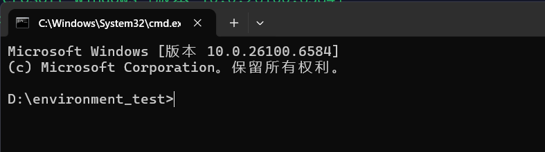

    @tab 方法三

    使用`ConEmu` 创建虚拟环境所在文件夹。

    

    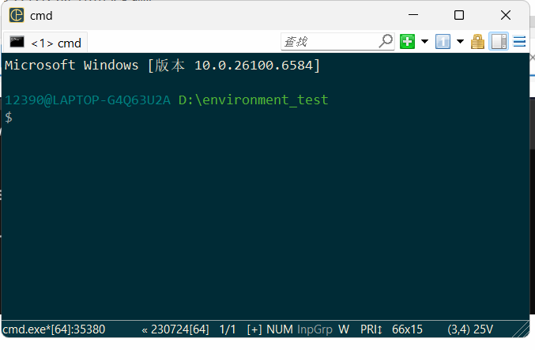

    :::

3. 创建虚拟环境

    以 ConEmu 为例。

    输入并运行代码 `python -m venv 虚拟环境名称`  ，那么在 `environment_test` 文件夹里就会出现这个环境。

    

    注意：此时输入命令 `pip list` 看到的是大环境下安装的包，并不是该虚拟环境下安装的包，因此需要启动该虚拟环境。

    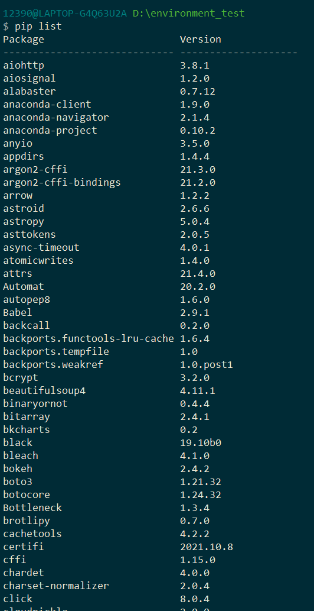

4. 启动虚拟环境

    在对应文件夹的路径下，运行命令 `.\虚拟环境名称\Scripts\activate`  。

    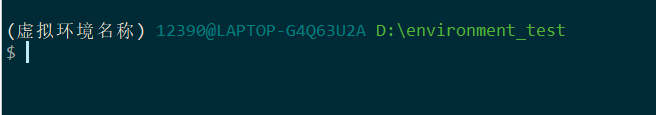

    上述图片表示虚拟环境启动成功。

5. 在虚拟环境中使用 Jupyter Notebook

    Jupyter Notebook 是一个包，因此可以从终端进行安装，并启动。安装依旧是 `pip install jupyter notebook` 。

    安装好后，在终端中输入 jupyter notebook 就可启动，弹出网页。

    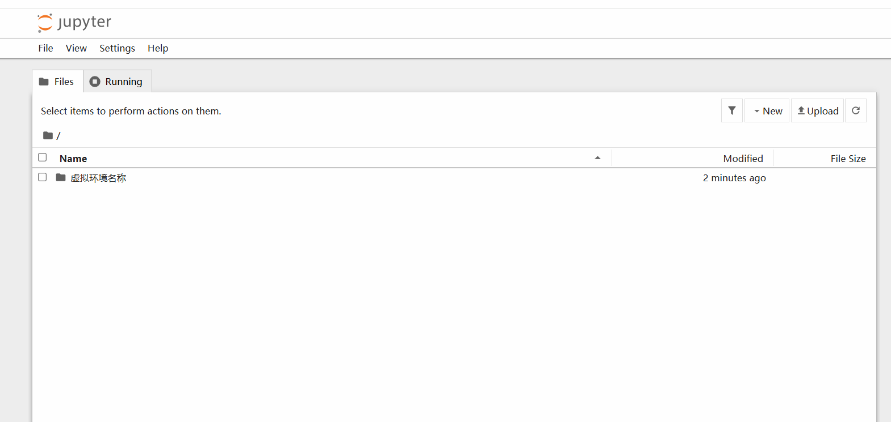

    

    
    
    
    
    
    
    ### 1.3 进入虚拟环境
    
    当我们需要在虚拟环境里启动 Jupyter Notebook 时，一定要先启动虚拟环境。如果只是在文件夹下启动，也能启动，但是环境就用的是大环境，并非需要的虚拟环境。
    
    1. 进入虚拟环境所在文件夹/创建新的文件夹。
    
        进入虚拟环境所在文件夹有2种方法：一是找到文件夹，右键选择适合的终端打开；二是打开终端，先确认在哪个盘，如果在D盘，则直接输入 `D:` 切换盘，前面无需加 `cd` ，随后可以使用 `cd` 切换到虚拟环境所在文件夹。
    
    2. 激活已经创建的虚拟环境：`.\虚拟环境名称\Scripts\activate` 
    
    3. 虚拟环境中打开 Jupyter Notebook 
    
        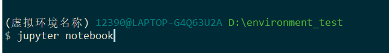

## 2. Jupyter Notebook 的使用

### 2.1 新建文件

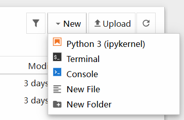

### 2.2 运行代码

方法一：

代码框输入代码，点击上方栏中的 `run`  → `run selected cell` 。

方法二：

`ctrl` + 回车 （留在当前行）

方法三：

`shift` + 回车 （运行并新建一行）

运行全部代码：

上方栏 `Run` → `Run all cells` 。

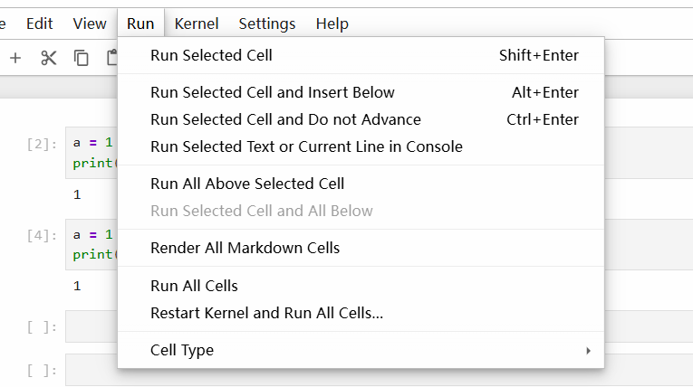

### 2.3 代码运行顺序

前后的代码会互相影响，并非按照由上到下的顺序，比如先运行了后面的 `a = 100` ，那么再运行前面 `print(a)` 的时候，就会输出 `100` 。同理，如果是在 `a = 100` 运行前运行的，那么输出的 `a` 还是等于 1 。

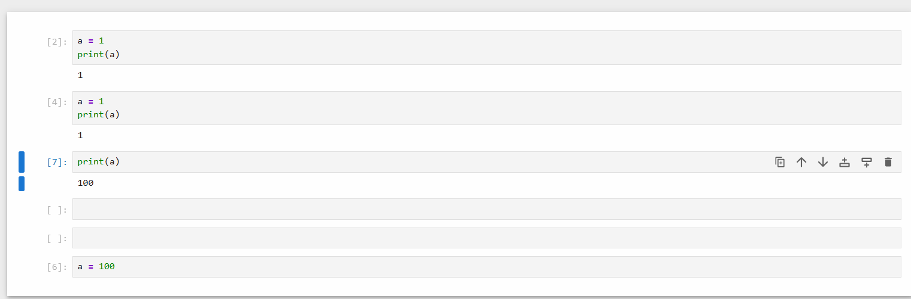

### 2.4 为何使用 Jupyter

根据需求，pycharm 里面每次运行都需要从头运行。而 Jupyter 可以分段运行，已经运行过的结果不用再次运行。

### 2.4 Jupyter 内安装包

在前面运行命令 `!pip install openai` 。

### 2.5 用其他环境打开 Jupyter Notebook

当我们把 jupyter 文件（.ipynb）移动到另一个文件夹时，原本存在的虚拟环境无法/不适合一起搬运进来，但是我们想要运行它又需要一个对应的虚拟环境，否则会默认使用系统的大环境，或者因为环境配置问题，无法使用环境/使用了错误环境，因此指定一个虚拟环境是必要的。

1. 先进入需要的虚拟环境

    打开终端，`cd + 虚拟环境所在文件夹` 切换到该环境所在文件夹，然后运行命令`.\需要的虚拟环境的名称\Scripts\activate` 进行激活。

2. 切换到 `.ipynb` 文件所在的文件夹

    同样用 `cd` 切换，例如 ` cd D:\environment_test` 切换到 `Untitled.ipynb` 文件所在的文件夹。

3. 运行 `jupyter notebook` 

### 2.6 重新打开 Jupyter 要重新运行

当重新打开 Jupyter Notebook 的时候，它会保留上次运行的结果，但是我们再运行新的代码时，会出现如下情况：

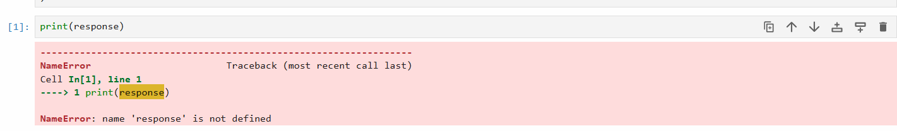

这是因为虽然保留了运行结果，但重新打开时，之前的运行其实已经清除了，因此还需要从开始再运行一遍。

## 3. Pycharm 新建项目

### 3.1 pycharm 新建项目中的设置

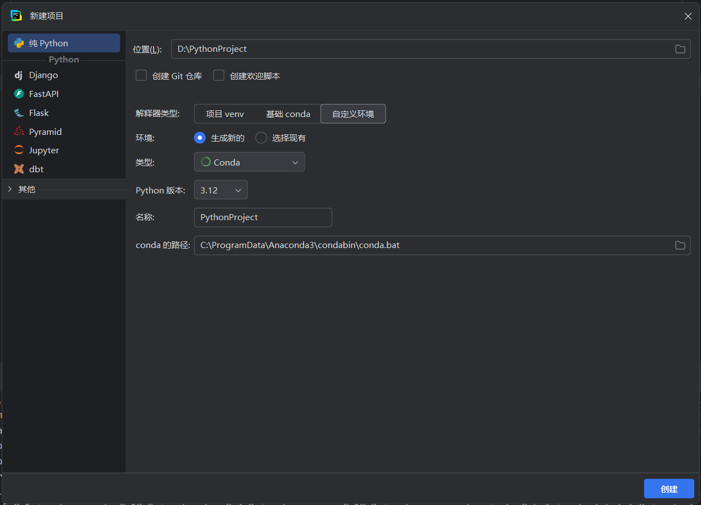

1. 位置：创建的新项目想放在哪个文件夹里。

2. 解析器类型：一般默认自定义环境。

3. 环境：可以选择直接用 pycharm 生成新的，也可以像前文自己生成好了环境去选择（好处：可控）

    - 生成新的环境时，排在前 3 位的环境最为常用。`Virtualenv`  和 `Pipenv` 的区别在于，前者是在每个文件夹里创建一个“Python”，虽然会占用一定空间，但是方便查找和维护，出现问题时也不会影响其他环境；后者将那些包的文件等拎出来，统一放在一个地方，只在对应文件夹里留存一个 txt 文件，虽然体量小，但是有一定风险。`Conda` 集成了多个 Python 版本，且含有多个人工智能和机器学习的指令，同时兼容 `pip` ，因此在相关领域选择 `Conda` 的较多。

    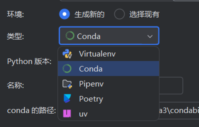

    - 选择现有环境时，要注意从哪个文件夹选取，举一反三。

        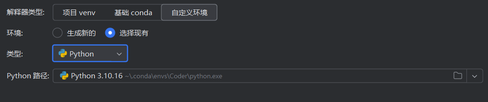

### 3.2 环境崩溃处理办法

方法一：

1. 直接删除 `.venv` 文件夹。
2. pycharm 终端按照之前整理的新建环境的命令再创建虚拟环境。

方法二：

1. 文件 → 设置 → Python 解释器

    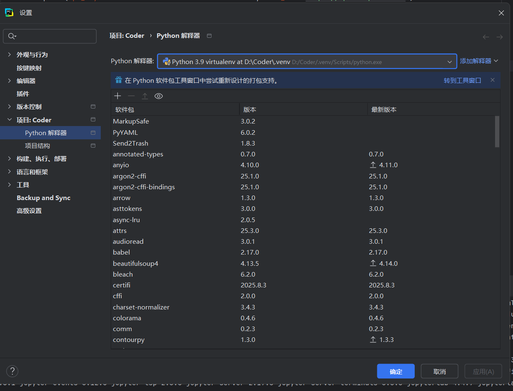

2. 选择其他的解释器（环境）或者添加解释新建环境。

