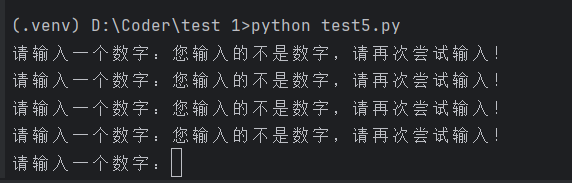
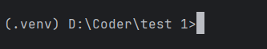

在链接大模型的时候，我们需要了 `try … except` ，这一部分进行详细讲解。

## 1. 区分语法错误和异常

### 1.1 语法错误

Python 的语法错误称之为解析错，是初学者经常碰到的，如下实例：

```python
>>> while True print('Hello world')

#------ output ------
File "D:\Coder\test 1\test5.py", line 1
    while True print('Hello world')
               ^
SyntaxError: invalid syntax
```

这个例子中，`print()` 函数检查有错误，前面缺少了一个冒号 `:` 。

语法分析器指出了出错的一行，并且在最先找到错误的地方标记了一个小箭头 `^` 。

### 1.2 异常

即使 Python 程序的语法是正确的，在运行时也可能发生错误。运行期间检测到的错误被称为异常。

大多数异常都不会被程序处理，都以错误信息的形式展现在这里：

```python
>>> 10 * (1/0)    # 0 不能作为除数，报异常

Traceback (most recent call last):
  File "D:\Coder\test 1\test5.py", line 1, in <module>
    10 * (1/0)
ZeroDivisionError: division by zero

>>> 4 + spam*3    # spam 未定义，触发异常

Traceback (most recent call last):
  File "D:\Coder\test 1\test5.py", line 1, in <module>
    4 + spam*3
NameError: name 'spam' is not defined

>>> 2 + '2'      # int 不能与 str 相加，触发异常

Traceback (most recent call last):
  File "D:\Coder\test 1\test5.py", line 1, in <module>
    2 + '2'
TypeError: unsupported operand type(s) for +: 'int' and 'str'
```

>  上述代码是为了演示异常情况，故意写的语法正确但是运行会报错的例子。实际开发过程中，有时会忽略某种特殊情况，当用户输入超出了我们开发时预测的情况，程序会报错。

异常以不同的类型出现，这些类型都作为输出信息的一部分显示出来：例子中的异常类型有：ZeroDivisionError， NameError， TypeError 。

> 错误类型不需要记忆，只要在报错时查看报错类型，接着用 try/except 进行匹配处理即可！

错误信息的前面部分展示了发生异常的上下文，并以调用栈的形式显示具体信息。


## 2. 异常处理

异常捕捉可以用 try/except 语句。


以下例子中，让用户输入一个合法的整数，但是允许用户中断这个程序（使用 `ctrl + c` 或者操作系统提供的方法）。用户中断的信息会引发一个 Keyboardinterrupt 异常。

```python
while True:
    try:
        x = int(input("请输入一个数字："))
        break
    except KeyboardInterrupt:
        print("您输入的不是数字，请再次尝试输入！")
```

上述代码，右键 `打开于` - `终端` 。在终端内运行，结果如下：



我们按 `Ctrl + c`无法退出程序，只会触发 `KeyboardInterrupt` ，因此只能关闭终端解决。

`int()` 将字符串强制转换为数字型，什么时候会报错？ ——非纯数字就会触发报错！

在不使用 try/except 的时候如何避免此类报错？

### 2.1 原始方法

```python
while True:
        x = input("请输入一个数字：").strip()
        if x.isdigit():
            x = int(x)
            break
        else:
            print("您输入的不是数字，请再次尝试输入！")
```

像上面这样的代码，本质上需要考察：预判+避免，也就是把有可能的错误进行预判，预判之后进行规避。

> 预判：我们预判用户输入的有可能不是纯数字；
>
> 避免：使用 if 来判断是否是纯数字的情况；
>
> 缺点：总有意想不到、百密一疏，造成报错。（总有考虑不到的情况）

### 2.2 try/except 方法

except 需要匹配报错类型，如何获取呢？  —— 直接写一个代码，故意让其报错，就可以从输出的报错获得报错类型：

```python
int('1a')

ValueError: invalid literal for int() with base 10: '1a'
```

得到 `ValueError` 的错误类型后，即可用 try/except 实现：

```python
while True:
    try:
        x = int(input("请输入一个数字："))
        break
    except ValueError:
            print("您输入的不是数字，请再次尝试输入！")
```

::: tip 小贴士

- **接纳与控制**：try/except 可以接受程序出现报错，并对匹配到的报错进行特定操作；
- **全面**：也可以实现无论什么报错，都可以匹配控制，防止没有预料到的错误导致程序停止。

:::


### 2.3 try/except 多个错误匹配

一个 `try` 语句可能包含多个 `except` 子句，分别来处理不同的异常，并且最多一个子句会被执行。

处理程序将只针对对应的 `try` 块中的异常进行处理，而不是处理其他的 `try` 块中的异常。

::: info 

在 Python 中，每一个 try 语句都与其后面的 except 子句形成一个**独立的异常处理结构**。

当程序在某个 try 块中运行出现异常时，Python 会仅在这个 try 对应的 except 子句中查找匹配的异常类型，并执行相应的处理逻辑。

如果该异常在当前 try 的所有 except 子句中都没有被捕获处理，它就会继续向外层传播（也就是“冒泡”），由外层的 try...except 块尝试进行处理。

而不会跳过当前层级，直接被其他并列或不相关的 `try...except` 块捕获。

因此，**每个 except 只负责处理它所属的 try 块中的异常，不会处理来自其他 try 块的错误。**

:::


#### 2.3.1 使用元组捕获多个异常

一个 except 子句可以同时处理多个异常，这些异常将被放在一个括号里形成一个元组，例如：

```python
except(RuntimeError, TypeError, NameError):
    pass
```

我们来看一个实际的代码示例：

```python
print("程序开始运行")

try:
    # 下面的代码会触发 NameError
    result = x + 5    # x 未定义
    print(result)

except (RuntimeError, TypeError, NameError):
    # 捕获三种异常之一
    print("捕获到错误，但是程序继续执行。")

print("程序继续执行。")

#------- output -------
程序开始运行
捕获到错误，但是程序继续执行。
程序继续执行。
```

这种写法主要取决于想要把多种错误汇总到一起并统一处理，不将每种错误进行特殊处理。若需要每种错误分开处理，则需要拆开代码编写。

#### 2.3.2 多个 except 捕获异常

接下来尝试拆开编写：

```python
print("程序开始运行")

try:
    result = x + 5      # x 未定义，会触发 NameError
    # result = 10/0     # 会触发 ZeroDivisionError
    # result = 'a' + 1  # 会触发 TypeError
    print(result)

except RuntimeError:
    print("捕获到 RuntimeError：运行时错误。")

except TypeError:
    print("捕获到 TypeError：类型错误")

except NameError:
    print("捕捉到 NameError：变量未定义")

print("程序继续执行。")

#------- output -------
程序开始运行
捕捉到 NameError：变量未定义
程序继续执行。
```

最后一个 except 子句可以忽略异常的名称，它被当做通配符使用。你可以使用这种方法打印一个错误信息，然后再次把异常抛出。

```python
import sys

print("程序开始运行")

try:
    result = x + 5       # x 未定义，会触发 NameError
    # result = 'a' + 1   # 会触发 TypeError
    # raise RuntimeError # 手动触发 RuntimeError

except RuntimeError as err:     # err 是变量名，可以自行随意设置
    print("捕获到 RuntimeError：", err)

except TypeError as err:
    print("捕获到 TypeError：类型错误，详情：", err)

except NameError as err:
    print("捕捉到 NameError：变量未定义，详情：", err)

except:
    # 捕获所有未被上面 except 匹配的其他异常
    print("Unexpected error:", sys.exc_info()[0])
    raise       # 重新抛出异常（不隐藏错误）

print("程序继续执行。")

#------- output -------
程序开始运行
捕捉到 NameError：变量未定义，详情： name 'x' is not defined
程序继续执行。
```

- `import sys` 是为了调用 `sys.exc_info()` 获取当前异常类型。
- 每个 `except` 独立处理一种错误类型。
- 最后的 `except` 是兜底（相当于其他错误），建议只在确实需要时使用。
- `raise` 语句用于重新抛出异常，便于调试时追踪错误。

#### 2.3.3 对比总结表

| 特点     | 拆开写法                 | 合并写法                         |
| -------- | ------------------------ | -------------------------------- |
| 可读性   | 清晰、易区分             | 简洁、紧凑                       |
| 可定制性 | 可对每种错误打印不同提示 | 所有错误同一处理逻辑             |
| 使用场景 | 需要区分不同错误时       | 错误处理逻辑相同或简单时         |
| 示例语法 | `except NameError:`      | `except (NameError, TypeError):` |


### 2.4 try/except … else

`try/except` 语句还有一个可选的 `else` 子句，如果使用这个子句，那么必须放在所有的 `except` 子句之后。

`else` 子句将在 `try` 子句没有发生任何异常的时候执行。


::: tip 类似于一群人去探险找宝物。一个公子哥就让随身的手下先去探路，并很自大的跟其他队友说到：咱们先原地休整一下，前面探路没问题了以后再一同前往。

- try ：探路的手下，没死并且活着回来。
- else：公子哥与其他队友，一起继续往前走。

:::


#### 2.4.1 例子：打开文件并读取行数

以下实例在 try 语句中判断文件是否可以打开，如果打开文件时正常、没有发生任何异常的情况下，再执行 else 这一部分的语句，读取文件内容。

::: code-tabs

@tab file1.txt

```text
Hello
World
Python
```

@tab file2.txt

```text
Ran
Pythiaroot.com
```

@tab Code

```python
import sys

'''
-sys.argv：是一个列表，包含运行 Python 脚本时的命令行参数。
-sys.argv[0]：是脚本名。
-sys.argv[1:]：是脚本名后面跟的文件名列表。

'''

for arg in sys.argv[1:]:
    try:
        f = open(arg, 'r')
    except IOError:
        # 如果文件无法打开（例如文件不存在或者权限问题），捕获 IOError 异常
        # 打印错误信息，告知无法打开哪个文件
        print('can not open', arg)
    else:
        # 如果文件成功打开，执行 else 中的代码
        # 使用 readlines() 方法读取文件的所有行，并计算其长度（即行数）
        print(arg, 'has', len(f.readlines()), 'lines')
        # 读取完成后，关闭文件以释放资源
        f.close()
```

:::


::: details 🧑‍💻 详细解释

1. **`import sys`**

    这行代码导入 Python 的 `sys` 模块，它提供了与 Python 解释器紧密相关的功能，比如 `sys.argv` 用来获取命令行参数。

2. **`for arg in sys.argv[1:]:`**

    这里的 `sys.argv` 是一个列表，包含了所有从命令行传入的参数。

    - `sys.argv[0]` 是当前脚本的名称，所以从 `sys.argv[1:]` 开始遍历，处理实际传入的文件名。

3. **`try:`**

     `try` 块用于捕获可能引发异常的代码。如果在 `try` 块中发生异常，Python 会跳到相应的 `except` 块进行处理。

4. **`f = open(arg, 'r')`**

    该行尝试以只读模式 (`'r'`) 打开 `arg` 指定的文件。

    - `arg` 是从命令行传入的文件名。
    - 如果文件存在并且没有权限问题，则会成功打开。

5. **`except IOError:`**

    如果在 `try` 块中打开文件时发生了 `IOError`（比如文件不存在、无法读取或权限问题），程序将跳到 `except` 块。

6. **`print('cannot open', arg)`**

    捕获到 `IOError` 后，打印错误信息，告知用户哪个文件无法打开。

7. **`else:`**

    如果没有异常发生，程序将跳到 `else` 块，执行文件打开成功后的操作。

8. **`print(arg, 'has', len(f.readlines()), 'lines')`**

    - `f.readlines()` 读取文件中的所有行，并返回一个列表。
    - `len(f.readlines())` 计算文件中的行数。
    - 打印文件名和行数，告诉用户该文件有多少行。

9. **`f.close()`**

    读取完文件后，调用 `f.close()` 关闭文件。

    关闭文件是一个良好的编程习惯，确保资源被释放，不会占用系统资源。

:::

::: details 🧑‍💻 进阶优化建议

如果你希望代码更简洁且现代，可以使用 `with open()` 来自动管理文件的打开和关闭，而不需要手动调用 `f.close()`。这样即使发生异常，文件也会在退出 `with` 块时自动关闭。

```python
import sys

for arg in sys.argv[1:]:
    try:
        # 使用with语句，Python会自动管理文件的关闭
        with open(arg, 'r') as f:
            # 读取文件并计算行数
            print(arg, 'has', len(f.readlines()), 'lines')
    except IOError:
        # 如果文件无法打开，捕获IOError并打印错误信息
        print('cannot open', arg)
```

在这个优化版本中，`with open` 会在 `with` 语句块结束时自动关闭文件。这样可以确保即使发生异常，文件也会被正确关闭，避免资源泄漏。

:::


#### 2.4.2 运行示例（命令行操作）

在终端中输入（假设文件都在同一目录）：

```python
python code.py file1.txt file2.txt nofile.txt
```

其中：

- `code.py` 是你的python 文件（保存上面那段代码）
- `file1.txt` 和 `file2.txt` 是存在的文件。
- `nofile.txt` 是一个不存在的文件，用来触发异常。

在 Pycharm 中选中 `code.py` 文件，右键→打开于→终端


 

路径是 `code.py` 所在文件夹，没有问题，输入上述代码即可得到：


#### 2.4.3 命令行操作路径问题处理

具体来说，`file1.txt` 和 `file2.txt` 等仅仅是文件名，而不是绝对路径，因此当文件和代码不在同一目录的时候，Python 无法在当前工作目录中找到这些文件。

- 方案一：使用绝对路径（文件与代码不在同一路径）

    在运行时，将文件的绝对路径写出来，例如：

    ```python
    python D:\Coder\test 1\code.py C:\Users\12390\Desktop\file1.txt  # 注意 Mac 系统和 Linux 都是 /
    ```

- 方案二：代码中处理相对路径问题

    修改代码以使用绝对路径，可以适配不同系统格式不同的问题。

    ```python
    import sys
    import os
    
    # 获取当前脚本的路径
    current_directory = os.path.dirname(os.path.abspath(__file__))
    
    for arg in sys.argv[1:]:
        file_path = os.path.join(current_directory, arg)  # 将文件名与当前路径拼接
        try:
            f = open(file_path, 'r')
        except IOError:
            print('cannot open', file_path)
        else:
            print(arg, 'has', len(f.readlines()), 'lines')
            f.close()
    ```

**解释**：

1. `os.path.abspath(__file__)` 获取当前脚本文件的绝对路径。

2. `os.path.dirname()` 获取当前脚本所在目录。

3. 使用 `os.path.join(current_directory, arg)` 将传入的文件名与当前目录拼接，得到绝对路径。

    这样，无论你从哪里运行脚本，都会自动处理相对路径问题，确保能找到文件。

**总结**：

- 如果你使用相对路径运行脚本时出现找不到文件的问题，请确保文件与脚本在同一目录，或者在运行命令时提供文件的绝对路径。
- 如果你想更健壮地处理路径问题，可以修改代码，自动拼接文件路径。


::: tip 现在的代码是需要终端运行，请思考如何修改成不使用终端运行，达到同样的输出结果。

:::


保命的手段：如果我们在处理文件时，系统发生错误或者文件数据出现不可预料的异常。为防止异常导致数据丢失，往往我们会在处理异常的时候添加 finally 进行最后操作，例如：报错文件操作；


