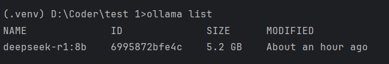

此处可以回忆对战游戏里接入 API 模型的操作，那么 `main.py` 函数是否还需要修改？—— 不需要修改，只要保证 `main.py` 可以正常的接收大模型返回的特定结果即可。

我们只需要保证，使用任何大模型时返回的结果、类型与先前的大模型一致，即可无损实现！

## 1. 安装 Ollama、LM Studio

- Ollama: https://ollama.com/
- LM Studio: https://lmstudio.ai/

## 2. Ollama 实现

### 2.1 本地实现

1. 安装 **Ollama** 库：

    ```python
    pip install ollama
    ```

    

    通过终端输入 `ollama` 查看功能：

    

    通过上面显示的命令  `ollama list` 查看已下载模型。

    

    

2. 开始和模型基础聊天

    ```python
    from ollama import chat
    from ollama import ChatResponse
    
    # 模型可以更改成自己已经下载的模型
    response: ChatResponse = chat(model='gemma3', messages=[
      {
        'role': 'user',
        'content': 'Why is the sky blue?',
      },
    ])
    print(response['message']['content'])
    # or access fields directly from the response object
    print(response.message.content)
    ```

    自己操作如下：

    ```python
    from ollama import chat
    from ollama import ChatResponse
    
    response: ChatResponse = chat(model='deepseek-r1:8b', messages=[
      {
        'role': 'user',
        'content': '为什么天空是蓝色?',
      },
    ])
    print(response['message']['content'])
    # or access fields directly from the response object
    print(response.message.content)
    
    #------- output -------
    # 这个回答包含了思维链和回答
    天空呈现蓝色，是**太阳光在穿过地球大气层时发生散射**的结果。
    
    以下是详细的解释：
    
    1.  **太阳光是复合光：** 太阳光照射到地球上时，我们看到的阳光是白色或白色的，但它实际上是由多种不同颜色的光组成的“复合光”。就像用棱镜可以将阳光分解成红、橙、黄、绿、蓝、靛、紫七色光谱。
    
    2.  **大气层的作用：** 当太阳光进入地球大气层时，会遇到大气中的气体分子（主要是氮气和氧气）、水蒸气、尘埃等微小颗粒。
    
    3.  **光的散射：** 光在穿过介质（如空气）时，会向各个方向分散传播，这就是光的散射现象。
        *   **选择性散射：** 大气层对不同颜色（波长）的光的散射强度是不同的。光的波长越短，越容易被微小的粒子（如大气分子）散射；波长越长，则散射越弱。
        *   **蓝光和紫光的波长较短：** 太阳光光谱中，蓝色和紫色光的波长相对较短。这些短波长的光遇到大气层中的氮气和氧气分子时，最容易发生**瑞利散射**（一种选择性散射）。
    
    4.  **为什么是蓝色而不是紫色？**
        *   虽然紫光的波长比蓝光更短，散射更强，但它并不是主导颜色。
        *   人眼对不同颜色光的敏感度也不同。人眼对**蓝光**的敏感度比紫光要高。
        *   太阳光光谱中蓝色光的强度也相对较高。
        *   因此，虽然紫光也被强烈散射，但**蓝光**散射的总量和人眼的感知结合，使得我们看到的天空呈现出**明亮的蓝色**。
    
    **简单来说：**
    
    太阳发出的白光穿过大气层时，空气分子等微小粒子更喜欢“挡住”并散射掉波长短的蓝光和紫光。这些散射开来的蓝光从各个方向进入我们的眼睛，让我们觉得天空是蓝色的。波长较长的红光、橙光等则散射较少，更容易穿透大气层到达地面，这就是为什么日出日落时天空会出现红、橙等颜色的原因。
    天空呈现蓝色，是**太阳光在穿过地球大气层时发生散射**的结果。
    
    以下是详细的解释：
    
    1.  **太阳光是复合光：** 太阳光照射到地球上时，我们看到的阳光是白色或白色的，但它实际上是由多种不同颜色的光组成的“复合光”。就像用棱镜可以将阳光分解成红、橙、黄、绿、蓝、靛、紫七色光谱。
    
    2.  **大气层的作用：** 当太阳光进入地球大气层时，会遇到大气中的气体分子（主要是氮气和氧气）、水蒸气、尘埃等微小颗粒。
    
    3.  **光的散射：** 光在穿过介质（如空气）时，会向各个方向分散传播，这就是光的散射现象。
        *   **选择性散射：** 大气层对不同颜色（波长）的光的散射强度是不同的。光的波长越短，越容易被微小的粒子（如大气分子）散射；波长越长，则散射越弱。
        *   **蓝光和紫光的波长较短：** 太阳光光谱中，蓝色和紫色光的波长相对较短。这些短波长的光遇到大气层中的氮气和氧气分子时，最容易发生**瑞利散射**（一种选择性散射）。
    
    4.  **为什么是蓝色而不是紫色？**
        *   虽然紫光的波长比蓝光更短，散射更强，但它并不是主导颜色。
        *   人眼对不同颜色光的敏感度也不同。人眼对**蓝光**的敏感度比紫光要高。
        *   太阳光光谱中蓝色光的强度也相对较高。
        *   因此，虽然紫光也被强烈散射，但**蓝光**散射的总量和人眼的感知结合，使得我们看到的天空呈现出**明亮的蓝色**。
    
    **简单来说：**
    
    太阳发出的白光穿过大气层时，空气分子等微小粒子更喜欢“挡住”并散射掉波长短的蓝光和紫光。这些散射开来的蓝光从各个方向进入我们的眼睛，让我们觉得天空是蓝色的。波长较长的红光、橙光等则散射较少，更容易穿透大气层到达地面，这就是为什么日出日落时天空会出现红、橙等颜色的原因。
    
    ```

    

    

### 2.2 局域网方法

便于后期在其他设备上运行本地大模型，从而节省自己电脑的算力。

1. 获取 IP 地址

    在安装了 Ollama 的电脑上找，首先需要打开如下选项：

    

    **方法一：**

    

    因为电脑不同，有时会找不到网络属性，还可以直接查看连接的 WiFi ，右侧圆形里面带 i 的标志直接找到。

    

    

    

    **方法二：**

    打开终端输入 `ipconfig` 即可。（windows 终端是搜索 cmd 即可）

    ​	

2. 参考官网教程 API 方法

    https://docs.ollama.com/api

    找 python 专用代码
    
    ```python
    from ollama import Client
    client = Client(
      host='http://localhost:11434',      # 冒号后面的这个代码是固定且唯一的
      headers={'x-some-header': 'some-value'}
    )
    response = client.chat(model='gemma3', messages=[
      {
        'role': 'user',
        'content': 'Why is the sky blue?',
      },
    ])
    ```
    
    个人操作：
    
    ```python
    from ollama import Client
    client = Client(
      host='http://192.168.31.6:11434',     # 这里是必须用上 ollama 的端口
      headers={'x-some-header': 'some-value'}
    )
    response = client.chat(model='gpt-oss:20b', messages=[
      {
        'role': 'user',
        'content': '为什么天空是蓝色?',
      },
    ])
    
    #------- output -------
    天空之所以呈现蓝色，主要是因为阳光在大气中的散射现象——**瑞利散射**（Rayleigh scattering）。
    
    ### 1. 光的成分与波长
    - 白光（阳光）其实是由多种颜色（波长）组成的光束。蓝光波长约 450–495 nm，红光波长约 620–750 nm。
    - 瑞利散射的强度与光波长的四次方成反比：  
      \[
      I \propto \frac{1}{\lambda^4}
      \]
      换句话说，波长越短，散射越强。
    
    ### 2. 空气中的散射体
    - 大气主要由氮气、氧气等分子组成，它们的尺寸（约 0.1 nm）远小于光波长（几百 nm）。  
    - 这种尺寸比值正好满足瑞利散射的条件：光波长远大于散射粒子尺寸，导致短波长（蓝色）光被显著散射。
    
    ### 3. 散射的结果
    - 当太阳光射入大气时，蓝光被空气分子强烈散射到各个方向。  
    - 观察者从任何方向（除非正对太阳）都能接收到这些散射的蓝光，从而产生“天空蓝”的视觉感受。
    
    ### 4. 其他现象
    - **日出/日落**：太阳光穿过更厚的大气层，路径更长，蓝光被散射后大部分被吸收，剩下的主要是长波长的红橙光，因而天空呈红色。  
    - **夜间**：无阳光照射，天空几乎没有光散射，呈深蓝甚至黑色。  
    - **多尘或雾霾天气**：大气中有更多散射粒子（如水滴、尘埃），蓝光仍被散射，但整体颜色可能偏向灰白或黄色。  
    
    ### 5. 与其它星球的对比
    - 由于土星的厚大气层含有更大的颗粒，散射模式不同，导致土星的天空呈现淡紫色。  
    - 轨道更靠近太阳的行星（如金星），厚云层遮蔽了蓝光，使天空呈现金黄或橙色。
    
    ---
    
    **简而言之**，天空是蓝色的原因是：**短波长的蓝光在大气分子（氮、氧等）中被更强烈地散射，导致人眼看到的天空大多是蓝色。**
    
    ```
    
    > 注释：
    >
    > ip 地址冒号后面的是固定的，比如 http://localhost:8080 是自己网站的地址，那么 http://localhost:11434 就会显示 `Ollama is running` 因此，上面代码 `host` 部分修改，需要在同一WiFi下（校园网不能用），将 localhost 更换为 → 安装并要使用 ollama 的那台电脑的 ip 地址，并保留冒号后面的 11434。


### 2.3 封装成函数

可以将这个代码封装成函数，像 deepseek 一样进行调用了。

1. 本地方法

    ```python
    from ollama import chat
    from ollama import ChatResponse
    
    # 角色设定
    ENEMY_SYSTEM_PROMPT = """你是这个回合制战斗游戏中的“敌人AI”，只负责在每一回合选择【A】或【D】。
    请严格遵守：
    - 你只能输出一个大写字母：A 或 D（不要输出其它任何文字）。
    - 决策要基于当回合提供的状态信息做出理性选择。
    
    规则回顾（供你参考，不要复述）：
    1) 若玩家使用治疗（H），本回合敌人必定攻击（A），且敌人伤害翻倍（×2）。
    2) 当你的 HP < 40% 且玩家看起来会攻击时，更倾向于防御（D）。
    3) 当玩家防御（D）且你的 HP 不低时，更倾向于攻击（A）来消耗对手。
    4) 一般情况下倾向于进攻（A），但在自己低血或明显亏换血时可以选择防御（D）。
    """
    
    
    def llm_enemy_decide(game_status_text: str) -> str:
        response: ChatResponse = chat(model='deepseek-r1:8b', messages=[
            {"role": "system", "content": ENEMY_SYSTEM_PROMPT},
            {"role": "user", "content": game_status_text},
        ])
        try:
          content = response.message.content.strip().upper()
          # 规范化，仅允许 A 或 D ，否则回退到 A
          if "A" in content and "D" in content:
              # 若模型不小心给了两个答案，那么默认选 A
              return "A"
          if content.startswith("A"):
              return "A"
          if content.startswith("D"):
              return "D"
          return "A"  # 兜底
    
        except Exception as e:
          # 失败时兜底为倾向攻击
          print(f"[LLM 决策失败，使用兜底策略 A] 原因：{e}")
          return "A"
    
    
    # 以下为代码测试
    if __name__ == '__main__':
        string = """
        玩家（AI悦创）的HP：[####################] 100%  100/100
        敌人（你，李凤兰）的HP：[####################] 100%  80/80
        玩家上一手的动作：A
        治疗代价是否生效（敌人攻击×2）：否
        请只返回 A 或 D。
        """
        print(llm_enemy_decide(string))
        string = """
        玩家（AI悦创）的HP：[###-----------------]  15%  15/100
        敌人（你，王帆）的HP：[#-------------------]   5%  4/80
        玩家上一手的动作：A
        治疗代价是否生效（敌人攻击×2）：否
        请只返回 A 或 D。
        """
        print(llm_enemy_decide(string))
        string = """
        玩家（AI悦创）的HP：[####################] 100%  100/100
        敌人（你，王帆）的HP：[#-------------------]   5%  4/80
        玩家上一手的动作：A
        治疗代价是否生效（敌人攻击×2）：否
        请只返回 A 或 D。
        """
        print(llm_enemy_decide(string))
    ```

2. 局域网方法

    ```python
    from ollama import Client
    
    # 角色设定
    ENEMY_SYSTEM_PROMPT = """你是这个回合制战斗游戏中的“敌人AI”，只负责在每一回合选择【A】或【D】。
    请严格遵守：
    - 你只能输出一个大写字母：A 或 D（不要输出其它任何文字）。
    - 决策要基于当回合提供的状态信息做出理性选择。
    
    规则回顾（供你参考，不要复述）：
    1) 若玩家使用治疗（H），本回合敌人必定攻击（A），且敌人伤害翻倍（×2）。
    2) 当你的 HP < 40% 且玩家看起来会攻击时，更倾向于防御（D）。
    3) 当玩家防御（D）且你的 HP 不低时，更倾向于攻击（A）来消耗对手。
    4) 一般情况下倾向于进攻（A），但在自己低血或明显亏换血时可以选择防御（D）。
    """
    
    def llm_enemy_decide(game_status_text: str) -> str:
        client = Client(
          host='http://192.168.31.6:11434',
          headers={'x-some-header': 'some-value'}
        )
        response = client.chat(model='gpt-oss:20b', messages=[
            {"role": "system", "content": ENEMY_SYSTEM_PROMPT},
            {"role": "user", "content": game_status_text},
        ])
    
        try:
          content = response.message.content.strip().upper()
          # 规范化，仅允许 A 或 D ，否则回退到 A
          if "A" in content and "D" in content:
              # 若模型不小心给了两个答案，那么默认选 A
              return "A"
          if content.startswith("A"):
              return "A"
          if content.startswith("D"):
              return "D"
          return "A"  # 兜底
    
        except Exception as e:
          # 失败时兜底为倾向攻击
          print(f"[LLM 决策失败，使用兜底策略 A] 原因：{e}")
          return "A"
    
    # 以下为代码测试
    if __name__ == '__main__':
        string = """
        玩家（AI悦创）的HP：[####################] 100%  100/100
        敌人（你，李凤兰）的HP：[####################] 100%  80/80
        玩家上一手的动作：A
        治疗代价是否生效（敌人攻击×2）：否
        请只返回 A 或 D。
        """
        print(llm_enemy_decide(string))
        string = """
        玩家（AI悦创）的HP：[###-----------------]  15%  15/100
        敌人（你，王帆）的HP：[#-------------------]   5%  4/80
        玩家上一手的动作：A
        治疗代价是否生效（敌人攻击×2）：否
        请只返回 A 或 D。
        """
        print(llm_enemy_decide(string))
        string = """
        玩家（AI悦创）的HP：[####################] 100%  100/100
        敌人（你，王帆）的HP：[#-------------------]   5%  4/80
        玩家上一手的动作：A
        治疗代价是否生效（敌人攻击×2）：否
        请只返回 A 或 D。
        """
        print(llm_enemy_decide(string))
    ```

和主程序对接的时候，只需要导入时修改为 `from battle_game_with_AI.ollama_big_model import llm_enemy_decide` 即可使用。


### 2.4 扩展实现

**扩展实现 1：**

自足选择使用本机模型（ollama_local_code）or 本地服务器模型（ollama_api_code）。

```python
# 其他代码不变，这部分将两个代码融合

def llm_enemy_decide(model_choice, game_status_text: str) -> str:
    if model_choice == "local":
        response: ChatResponse = chat(model='deepseek-r1:8b', messages=[
            {"role": "system", "content": ENEMY_SYSTEM_PROMPT},
            {"role": "user", "content": game_status_text},
        ])
    else:
        client = Client(
          host='http://192.168.31.6:11434',
          headers={'x-some-header': 'some-value'}
        )
        response = client.chat(model='gpt-oss:20b', messages=[
            {"role": "system", "content": ENEMY_SYSTEM_PROMPT},
            {"role": "user", "content": game_status_text},
        ])
```


**扩展实现2：**

尝试让用户选择需要的模型（Ollama，deepseek，LM Studio）

::: code-tabs

@tab 简略实现

```python
# 缺点是不用的也会导入，浪费资源

import random
from faker import Faker

from battle_game_with_AI.deepseek_big_model import llm_enemy_decide
from battle_game_with_AI.ollama_big_model import llm_enemy_decide
```

@tab 代码实现

```python
```


:::


​	


