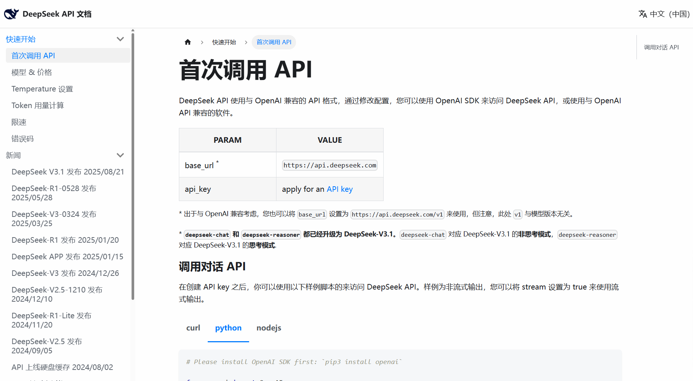

**大模型接入对战！**

**目的：** 使我们纯python项目，可以融合其他功能。学会利用现有的 Python 基础，扩展新的功能。对于自己来说，要掌握快速上手新技术的能力。

**核心点：**

- 代码实现 🌟

- 原理探索探究 🌟🌟

- 实现思想 🌟🌟🌟

    要知道如何向大模型接力，如何跟大模型交互、对话。这些无关代码、原理。作为“各个厂家大模型的调用者”要怎么去安排工作流程、分配任务等。

**核心实现思维：** 把对战信息存储下来，发送给大模型，让大模型基于当前的血量、游戏进展给出合理的指令（攻击 or 防守）

## 1. DeepSeek API 基础调用

::: tabs

@tab 1. DeepSeek API 注册

这一步主要实现 DeepSeek API 平台账号注册，API 官网链接：https://api-docs.deepseek.com/

官网界面右上角 DeepSeek Platform 进行注册、实名、充值、创建 **API Key** 。


@tab 2. API Key 的初体验

查看接口文档 https://api-docs.deepseek.com/zh-cn/




复制其中的 Python 代码：

```python
# Please install OpenAI SDK first: `pip3 install openai`   此处安装代码可微调

from openai import OpenAI

client = OpenAI(api_key="<DeepSeek API Key>", base_url="https://api.deepseek.com")

response = client.chat.completions.create(
    model="deepseek-chat",
    messages=[
        {"role": "system", "content": "You are a helpful assistant"},
        {"role": "user", "content": "Hello"},
    ],
    stream=False
)

print(response.choices[0].message.content)
```

几个修改（注意）点：

- 根据第一行提示安装 OpenAI 库：`pip3 install openai` ；

    安装失败需要换源，参考 Python pip换源所有方法：https://bornforthis.cn/posts/16.html ；

    推荐使用第三种方法，命令为：`pip config set global.index-url https://mirrors.aliyun.com/pypi/simple/`  。

    成功结果如下：

    ```python
    (.venv) D:\Coder>pip config set global.index-url https://mirrors.aliyun.com/pypi/simple/
    Writing to C:\Users\12390\AppData\Roaming\pip\pip.ini
    ```

    

- 修改 `api_key` ：修改成自己从 DeepSeek 获取到的 key；

- `model` 可以修改成自己想要使用的模型；

- `messages` ：主要的对话信息、历史对话信息都储存在 `message` 列表中；

- 对于 `message` 中的字典，key 的重要点：

    - `"role"` ：角色，大模型需要分清楚是谁给出的信息。常见的 AI 大模型角色有三种，分别是：

        - `"system"` ：可以设定大模型的规则，也就是：让大模型可以回答什么，不可以回答什么；

            >举个例子：如果有人问你：你用的是什么模型？你就回答用的是：AI创悦一对一辅导大模型，AI创悦科技有限责任公司研发。（提前定制大模型角色，以便大模型更好的伪装角色）
            >
            >（这个浅灰色部分通过英文输入法下的大于号+空格 `> ` 即可实现。）

        - `"user"` ：用户的角色，也就是用户输入的信息，以 `"user"` 提供给大模型；

        - `"assistant"` ：大模型自己的回复的信息，以 `"assistant"` 角色提供，这样大模型就知道：哦，这是我自己的回复。

    - `“content”`  ：顾名思义，就是文本内容；

- `stream=False `：回答文本是否要以一段一段、一句一句的回复（`stream=False` ），还是要以完整的一整段回复给我（`stream=True` ）。

- `response.choices[0].message.content` ：这个就是当 `stream=False` 时，提取回答内容的方式，参考以往字典中学习的内容，提取嵌套字典中的数据，原理一致。


@tab 3. 实际运行感受

使用 DeepSeek 编写 Python 九九乘法表：

```python
# Please install OpenAI SDK first: `pip3 install openai`

from openai import OpenAI

client = OpenAI(api_key="sk---snip---f", base_url="https://api.deepseek.com")  # 复制来自己的 Key，此处隐藏。

response = client.chat.completions.create(
    model="deepseek-chat",
    messages=[
        {"role": "system", "content": "You are a helpful assistant"},
        {"role": "user", "content": "给我一个 Python九九乘法表"},
    ],
    stream=False
)

print(response.choices[0].message.content)
```

输出结果如下：

````python
以下是两种常见的 Python 九九乘法表实现方式：

### 方法一：基础嵌套循环
```python
for i in range(1, 10):
    for j in range(1, i + 1):
        print(f"{j}×{i}={i*j}", end="\t")
    print()
```

### 方法二：格式化输出（更整齐）
```python
for i in range(1, 10):
    for j in range(1, i + 1):
        print(f"{j}×{i}={i*j:2d}", end="  ")
    print()
```

### 输出效果：
```
1×1= 1  
1×2= 2  2×2= 4  
1×3= 3  2×3= 6  3×3= 9  
1×4= 4  2×4= 8  3×4=12  4×4=16  
...（以此类推）
```

### 方法三：单行代码版（使用列表推导式）
```python
print('\n'.join([' '.join([f"{j}×{i}={i*j:2d}" for j in range(1, i+1)]) for i in range(1, 10)]))
```

选择任意一种方法运行即可得到完整的九九乘法表。第一种方法最易理解，第二种输出格式更整齐，第三种最简洁。
````


@tab 4. 推理模型

`deepseek-reasoner` 是支持推理模式的 DeepSeek 模型。在输出最终回答之前，模型会先输出一段思维链内容，以提升最终答案的准确性。我们的 API 向用户开放 `deepseek-reasoner` 思维链的内容，以供用户查看、展示、蒸馏使用。

在使用 `deepseek-reasoner` 时，请先升级 OpenAI SDK 以支持新参数。

```python
pip3 install -U openai
```

**API 参数**

- **输入参数**：
    - `max_tokens`：模型单次回答的最大长度（含思维链输出），默认为 32K，最大为 64K。
- **输出字段**：
    - `reasoning_content`：思维链内容，与 `content` 同级，访问方法见[访问样例](https://api-docs.deepseek.com/zh-cn/guides/reasoning_model#访问样例)。
    - `content`：最终回答内容。
- **支持的功能**：[Json Output](https://api-docs.deepseek.com/zh-cn/guides/json_mode)、[对话补全](https://api-docs.deepseek.com/zh-cn/api/create-chat-completion)，[对话前缀续写 (Beta)](https://api-docs.deepseek.com/zh-cn/guides/chat_prefix_completion)
- **不支持的功能**：Function Calling、FIM 补全 (Beta)
- **不支持的参数**：`temperature`、`top_p`、`presence_penalty`、`frequency_penalty`、`logprobs`、`top_logprobs`。请注意，为了兼容已有软件，设置 `temperature`、`top_p`、`presence_penalty`、`frequency_penalty` 参数不会报错，但也不会生效。设置 `logprobs`、`top_logprobs` 会报错。

**上下文拼接**

在每一轮对话过程中，模型会输出思维链内容（`reasoning_content`）和最终回答（`content`）。在下一轮对话中，之前轮输出的思维链内容不会被拼接到上下文中，如下图所示：


请注意，如果您在输入的 messages 序列中，传入了`reasoning_content`，API 会返回 `400` 错误。因此，请删除 API 响应中的 `reasoning_content` 字段，再发起 API 请求，方法如[访问样例](https://api-docs.deepseek.com/zh-cn/guides/reasoning_model#访问样例)所示。

**访问样例**

下面的代码以 Python 语言为例，展示了如何访问思维链和最终回答，以及如何在多轮对话中进行上下文拼接。

1. 非流式（`stream = False` ）

    样例：

    ```python
    from openai import OpenAI
    client = OpenAI(api_key="<DeepSeek API Key>", base_url="https://api.deepseek.com")
    
    # Round 1
    messages = [{"role": "user", "content": "9.11 and 9.8, which is greater?"}]
    response = client.chat.completions.create(
        model="deepseek-reasoner",
        messages=messages
    )
    
    reasoning_content = response.choices[0].message.reasoning_content
    content = response.choices[0].message.content
    
    # Round 2
    messages.append({'role': 'assistant', 'content': content})
    messages.append({'role': 'user', 'content': "How many Rs are there in the word 'strawberry'?"})
    response = client.chat.completions.create(
        model="deepseek-reasoner",
        messages=messages
    )
    # ...
    ```

    探究代码这么写的原因：

    因为用 Jupyter Notebook 探究的，因此把非流式探究结果附在此处，方便查阅

    [非流式 Jupyter Notebook 探究过程](https://pythiaroot.com/DeepSeekAPI%E5%AF%B9%E8%AF%9D%E6%8F%90%E5%8F%96%E9%80%90%E6%AD%A5%E5%88%86%E6%9E%90-%E9%9D%9E%E6%B5%81%E5%BC%8F)

    

    

2. 流式（`stream = True` ）

    样例：

    ```python
    from openai import OpenAI
    client = OpenAI(api_key="<DeepSeek API Key>", base_url="https://api.deepseek.com")
    
    # Round 1
    messages = [{"role": "user", "content": "9.11 and 9.8, which is greater?"}]
    response = client.chat.completions.create(
        model="deepseek-reasoner",
        messages=messages,
        stream=True
    )
    
    reasoning_content = ""
    content = ""
    
    for chunk in response:
        if chunk.choices[0].delta.reasoning_content:
            reasoning_content += chunk.choices[0].delta.reasoning_content
        else:
            content += chunk.choices[0].delta.content
    
    # Round 2
    messages.append({"role": "assistant", "content": content})
    messages.append({'role': 'user', 'content': "How many Rs are there in the word 'strawberry'?"})
    response = client.chat.completions.create(
        model="deepseek-reasoner",
        messages=messages,
        stream=True
    )
    # ...
    ```

    流式代码探究过程：

    [流式 Jupyter Notebook 探究过程](https://pythiaroot.com/DeepSeekAPI%E5%AF%B9%E8%AF%9D%E6%8F%90%E5%8F%96%E9%80%90%E6%AD%A5%E5%88%86%E6%9E%90-%E6%B5%81%E5%BC%8F)


@tab 5. 实现多轮对话

让 DeepSeek 知道我们之前的对话内容，参考学习：https://api-docs.deepseek.com/zh-cn/guides/multi_round_chat

1. 个人探索

    根据参考学习内容，跑网页上给出的代码：

    ```python
    from openai import OpenAI
    client = OpenAI(api_key="<DeepSeek API Key>", base_url="https://api.deepseek.com")
    
    # Round 1
    messages = [{"role": "user", "content": "What's the highest mountain in the world?"}]    # 第一轮的 messages
    response = client.chat.completions.create(
        model="deepseek-chat",
        messages=messages         # 将上面的 messages 传入到 API中
    )
    
    messages.append(response.choices[0].message)       # 将模型第一轮的输出添加到 messages 的结尾
    print(f"Messages Round 1: {messages}")
    
    # Round 2
    messages.append({"role": "user", "content": "What is the second?"})
    response = client.chat.completions.create(
        model="deepseek-chat",
        messages=messages
    )
    
    messages.append(response.choices[0].message)
    print(f"Messages Round 2: {messages}")
    ```

    输出结果如下：

    ```python
    Messages Round 1: [{'role': 'user', 'content': "What's the highest mountain in the world?"}, ChatCompletionMessage(content='That\'s a great question! The answer has two parts, depending on how you measure "highest."\n\n### 1. Highest Altitude Above Sea Level: Mount Everest\n\nThis is the most common answer. Located in the Mahalangur Himal sub-range of the Himalayas on the border between Nepal and the Tibet Autonomous Region of China, **Mount Everest** is the highest mountain in the world when measured by its summit\'s height above sea level.\n\n*   **Height:** **8,848.86 meters (29,031.7 feet)** (This is the latest official measurement agreed upon by China and Nepal in 2020).\n*   **First Ascent:** Sir Edmund Hillary (New Zealand) and Tenzing Norgay (Nepal) on May 29, 1953.\n\n---\n\n### 2. Tallest Mountain from Base to Summit: Mauna Kea\n\nIf you measure from the mountain\'s base to its peak, the title goes to **Mauna Kea** on the Big Island of Hawaii.\n\n*   **Height above sea level:** 4,207 meters (13,802 feet) – which is less than half the height of Everest.\n*   **Height from base to summit:** However, Mauna Kea is a volcano that rises from the bottom of the Pacific Ocean. When measured from its true base on the ocean floor, it is over **10,210 meters (33,500 feet)** tall, making it significantly taller than Mount Everest.\n\n### Summary\n\n*   **Highest Altitude:** **Mount Everest** (8,849 m / 29,032 ft)\n*   **Tallest from Base:** **Mauna Kea** (>10,200 m / 33,500 ft)\n\nSo, while Everest has the highest peak on the planet, Mauna Kea is the world\'s most massive mountain.', refusal=None, role='assistant', annotations=None, audio=None, function_call=None, tool_calls=None)]
    Messages Round 2: [{'role': 'user', 'content': "What's the highest mountain in the world?"}, ChatCompletionMessage(content='That\'s a great question! The answer has two parts, depending on how you measure "highest."\n\n### 1. Highest Altitude Above Sea Level: Mount Everest\n\nThis is the most common answer. Located in the Mahalangur Himal sub-range of the Himalayas on the border between Nepal and the Tibet Autonomous Region of China, **Mount Everest** is the highest mountain in the world when measured by its summit\'s height above sea level.\n\n*   **Height:** **8,848.86 meters (29,031.7 feet)** (This is the latest official measurement agreed upon by China and Nepal in 2020).\n*   **First Ascent:** Sir Edmund Hillary (New Zealand) and Tenzing Norgay (Nepal) on May 29, 1953.\n\n---\n\n### 2. Tallest Mountain from Base to Summit: Mauna Kea\n\nIf you measure from the mountain\'s base to its peak, the title goes to **Mauna Kea** on the Big Island of Hawaii.\n\n*   **Height above sea level:** 4,207 meters (13,802 feet) – which is less than half the height of Everest.\n*   **Height from base to summit:** However, Mauna Kea is a volcano that rises from the bottom of the Pacific Ocean. When measured from its true base on the ocean floor, it is over **10,210 meters (33,500 feet)** tall, making it significantly taller than Mount Everest.\n\n### Summary\n\n*   **Highest Altitude:** **Mount Everest** (8,849 m / 29,032 ft)\n*   **Tallest from Base:** **Mauna Kea** (>10,200 m / 33,500 ft)\n\nSo, while Everest has the highest peak on the planet, Mauna Kea is the world\'s most massive mountain.', refusal=None, role='assistant', annotations=None, audio=None, function_call=None, tool_calls=None), {'role': 'user', 'content': 'What is the second?'}, ChatCompletionMessage(content='Of course! Just like the "highest," the "second-highest" also has two answers depending on the measurement.\n\n### 1. Second-Highest Altitude Above Sea Level: K2\n\nThe undisputed second-highest mountain in the world by elevation is **K2**.\n\n*   **Height:** **8,611 meters (28,251 feet)**\n*   **Location:** The Karakoram Range, on the border between Pakistan and China.\n*   **Nickname:** "The Savage Mountain"\n*   **Why it\'s famous:** K2 is widely considered the world\'s most difficult and dangerous mountain to climb, even more so than Everest. It has a far higher fatality rate for those who attempt it. Its extreme weather, technical climbing challenges, and constant threat of avalanches make it the ultimate goal for many elite mountaineers.\n\n---\n\n### 2. Second-Tallest Mountain from Base to Summit: Mauna Loa\n\nFollowing Mauna Kea in this category is its neighbor on the Big Island of Hawaii, **Mauna Loa**.\n\n*   **Height above sea level:** 4,169 meters (13,678 feet)\n*   **Height from base to summit:** Like Mauna Kea, Mauna Loa is a massive volcano that rises from the ocean floor. From its base to its summit, it is approximately **9,170 meters (30,085 feet)** tall.\n*   **Why it\'s famous:** Mauna Loa is the world\'s largest *active* volcano by volume and one of the five volcanoes that form the Island of Hawaii.\n\n### Summary\n\n*   **Second-Highest Altitude:** **K2** (8,611 m / 28,251 ft)\n*   **Second-Tallest from Base:** **Mauna Loa** (~9,170 m / ~30,085 ft)', refusal=None, role='assistant', annotations=None, audio=None, function_call=None, tool_calls=None)]
    ```

    问题：这 messages 结果太长了，而且不能换行，不方便看。

    在**第二轮**请求时：

    1. 要将第一轮中模型的输出添加到 `messages` 末尾；
    2. 将新的提问添加到 `messages` 末尾。

    最终传递给 API 的 `messages` 为：

    ```python
    [
        {"role": "user", "content": "What's the highest mountain in the world?"},
        {"role": "assistant", "content": "The highest mountain in the world is Mount Everest."},
        {"role": "user", "content": "What is the second?"}
    ]
    ```

    从而进行上下文拼接，以实现多轮对话。

2. 指导探索

    - 根据探究的推理模型，实现多轮对话。

        要做到：程序运行后，可以一直问问题，模型给回答，除非用户选择退出，否则对话继续；有聊天记忆。

        [利用循环实现多轮对话](https://pythiaroot.com/%E5%AE%9E%E7%8E%B0%E5%A4%9A%E8%BD%AE%E5%AF%B9%E8%AF%9D)

    - 根据推理模型，实现特定限制

        要做到：在每个回答后都显示微信和网站；当被问到是什么大模型时，回答是MR大模型而不是 deepseek 的模型。

        [利用 system 实现特定限制](https://pythiaroot.com/%E5%AE%9E%E7%8E%B0%E7%89%B9%E5%AE%9A%E9%99%90%E5%88%B6)

:::

## 2. 正式对接游戏

正式对接游戏前，我们需要做一个流程拆分与逐步实现。（架构设计 | 指定嵌入方案）

**个人思路：**

按照 API 对话模型分为两个部分，第一部分是角色设定（ system ），第二部分是流程实现（对话）。

具体思考流程按照游戏流程一步步的增加设定和步骤。

**老师思路：**

- **步骤一：** 大模型只要回复：攻击或防守，不需要多余的废话！（角色限制：使用 system 进行设定提示词）
- **步骤二：** 要设计大模型可以接收并理解清除，游戏对战过程中的显示。并利用大模型的算力，让大模型自己思考🤔自己要出的招式；
- **步骤三：** 大模型应该被封装成一个函数，便于我们调用。思考一下：大模型函数返回值应该是什么类型以及结果？—— 字符串类型、值 A or D；
- **自己提出的额外思路：** 
    - 让大模型额外支持当用户提问游戏规则时，简要解说游戏规则！
        - 方法一：自己把游戏规则写出来，喂给大模型；
        - 方法二：不要牛马🐮🐴当多了，老想着自己亲力亲为，没必要。把程序甩给大模型，让大模型制作一份精美的游戏🎮介绍；
    - 让大模型介入，使大模型来驱动游戏是否开始；
        - 当这么思考之后，游戏和原本的设计初衷不同：
            - 原始目的：玩家和AI对战，AI 的角色是敌人；
            - 大模型驱动游戏目的：AI 了解整个游戏的逻辑，然后扮演其中的敌人角色进行交互，虽然从用户角度或许可以成功实现游戏的交互过程，但是核心不是与 AI 对战，也不符合 API 推理模型中 `role: user` 和 `role: assistant` 这种交互的角色设定，应该是将对战中的敌人角色等价于  `role: assistant`。

---

**初衷版本：** 

---

**步骤一：准备数据**

::: tabs

@tab 1. 游戏规则数据

两种方法：一种是直接去 DeepSeek 官网直接上传代码并直接对话，另一种是使用 API 。为了更好的联系技术，要求使用 API 问答得到游戏规则数据。

个人实现：

````python
from openai import OpenAI
client = OpenAI(api_key="sk-5e002cf488964cae9a5a88915228453f", base_url="https://api.deepseek.com")

code_string = '''
import random
from faker import Faker


# —— 简单无色进度条（纯 ASCII，跨平台）——
def hp_bar(cur: int, maxv: int, width: int = 20) -> str:
    """返回形如：[##########----------] 50%  5g0/100 的进度条文本"""
    if maxv <= 0:
        maxv = 1
    cur = max(0, min(cur, maxv))
    ratio = cur / maxv
    filled = int(ratio * width + 0.5)  # 四舍五入
    bar = "#" * filled + "-" * (width - filled)
    return f"[{bar}] {int(ratio * 100):3d}%  {cur}/{maxv}"


class Creature:
    def __init__(self, hp, name):
        self.hp = int(hp)
        self.max_hp = int(hp)  # 记录初始满血
        self.name = name

    def attack(self):
        return random.randint(0, 50)

    def not_dead(self):
        return self.hp > 0

    def being_attack(self, dmg: float):
        """受到伤害（向下取整以避免浮点 HP），并保证 HP 不会掉到负数以下"""
        self.hp = max(0, int(self.hp - dmg))

    def heal_full(self):
        """直接回到初始满血"""
        self.hp = self.max_hp

    def show_status(self):
        print(f"{self.name}'s HP → {hp_bar(self.hp, self.max_hp)}")

fk = Faker(locale='zh_CN')
player = Creature(100, "MR")
enemy = Creature(80, fk.name())

heal_used = False  # 治疗仅限一次
heal_penalty_active = False  # 是否已触发“敌人攻击翻倍”的惩罚

while player.not_dead() and enemy.not_dead():
    player.show_status()
    enemy.show_status()

    # 是否出现治疗提示：仅当当前 HP < 初始 HP 的 50% 且尚未使用
    can_heal_now = (not heal_used) and (player.hp < player.max_hp * 0.5)

    if can_heal_now:
        prompt = 'Attack or Defence or Heal (A/D/H)：'
        valid_inputs = {"A", "D", "H"}
        print('（提示：你现在可以按 H 回满血，仅此一次）')
    else:
        prompt = 'Attack or Defence (A/D)：'
        valid_inputs = {"A", "D"}

    if heal_penalty_active:
        print('【警告】治疗代价生效中：敌人对你的伤害 ×2！')

    user_input = input(prompt).strip().upper()
    while user_input not in valid_inputs:
        user_input = input("输入无效，请重新输入：" + prompt).strip().upper()

    # 敌人选择（对 A/D 有影响；若玩家选择 H，我们让敌人本回合直接攻击）
    enemy_status = ['Attack', 'Defence']
    enemy_choice = random.choices(enemy_status, weights=[0.7, 0.3], k=1)[0]  # 敌人更倾向于攻击


    # 当前敌人伤害倍率（是否翻倍）
    def enemy_mul():
        return 2.0 if heal_penalty_active else 1.0


    if user_input == "H":
        # 只有在 can_heal_now 为 True 时才会进入到这里
        print("你使用了治疗技能！血量已回满。")
        player.heal_full()
        heal_used = True

        # 触发治疗代价：从现在起敌人攻击翻倍（包含本回合的随后的敌人攻击）
        heal_penalty_active = True

        # 敌人回合：直接攻击（先治再挨打）
        raw_enemy_attack_value = enemy.attack()
        damage = raw_enemy_attack_value * enemy_mul()
        print(f"{enemy.name} 攻击了你，造成 {int(damage)} 点伤害！（原始{int(raw_enemy_attack_value)} × 倍率{enemy_mul():.0f}）")
        player.being_attack(damage)

    elif user_input == "A":
        player_attack_coefficient = 1
        if enemy_choice == "Defence":
            print(f"{enemy.name} chose to defend!")
            player_attack_coefficient = 0.5
        else:
            print(f"{enemy.name} chose to attack!")
            raw_enemy_attack_value = enemy.attack()
            damage = raw_enemy_attack_value * enemy_mul()
            print(f"{enemy.name} 对你造成 {int(damage)} 点伤害！（原始{int(raw_enemy_attack_value)} × 倍率{enemy_mul():.0f}）")
            player.being_attack(damage)

        player_attack_value = player.attack()
        enemy.being_attack(player_attack_value * player_attack_coefficient)

    elif user_input == "D":
        # 防御：敌人攻击减伤为 90%，然后再应用翻倍倍率
        raw_enemy_attack_value = enemy.attack()
        damage = raw_enemy_attack_value * 0.1 * enemy_mul()
        print(f"{enemy.name} 攻击了你（被你防住大部分），造成 {int(damage)} 点伤害！"
              f"（原始{int(raw_enemy_attack_value)} × 减伤0.1 × 倍率{enemy_mul():.0f}）")
        player.being_attack(damage)

if player.not_dead():
    print("You Win!")
else:
    print("You Lose!")
'''

messages = [{"role": "user", "content": code_string + "根据上述代码生成一个能提供给 API 的游戏规则描述"}]
response = client.chat.completions.create(
    model="deepseek-reasoner",
    messages=messages
)
print(response.choices[0].message.content)


# -------output-------
基于上述代码，以下是游戏规则的详细描述，适合用于API文档：

## 游戏概述
这是一个简单的回合制战斗游戏，玩家与AI敌人进行战斗。

## 游戏角色

### 玩家 (Player)
- **初始生命值**: 100 HP
- **名称**: "MR"
- **攻击力**: 随机0-50伤害

### 敌人 (Enemy)  
- **初始生命值**: 80 HP
- **名称**: 随机生成的中文名字
- **攻击力**: 随机0-50伤害

## 游戏机制

### 回合流程
每回合按以下顺序执行：
1. 显示双方当前生命状态（ASCII进度条）
2. 玩家选择行动
3. 敌人随机选择行动
4. 计算伤害并更新状态

### 玩家行动选项

#### 攻击 (Attack - A)
- 对敌人造成随机伤害（0-50）
- 如果敌人选择防御，伤害减半（×0.5）
- 如果敌人选择攻击，双方同时造成伤害

#### 防御 (Defence - D)  
- 减少受到的伤害至10%
- 计算公式：敌人攻击力 × 0.1

#### 治疗 (Heal - H) - 限制条件
- **触发条件**: 生命值低于50%且未使用过治疗
- **效果**: 立即回满生命值
- **代价**: 触发永久惩罚 - 敌人攻击力翻倍（×2.0）

### 敌人AI行为
- **攻击概率**: 70%
- **防御概率**: 30%
- 当玩家使用治疗后，敌人攻击必定造成双倍伤害

## 战斗规则

### 伤害计算
```python
# 基础攻击伤害
基础伤害 = random.randint(0, 50)

# 防御减伤
防御后伤害 = 基础伤害 × 0.1

# 治疗惩罚
惩罚后伤害 = 基础伤害 × 2.0
```

### 生命值管理
- 生命值使用整数计算
- 不会低于0
- 显示为ASCII进度条格式：`[##########----------] 50% 50/100`

## 胜负条件
- **胜利**: 敌人生命值降至0
- **失败**: 玩家生命值降至0

## 特殊机制
- 治疗技能只能使用一次
- 治疗惩罚永久生效
- 敌人行为模式固定（70%攻击，30%防御）

这个规则描述涵盖了游戏的所有核心机制，适合用于API接口文档或游戏说明。
````

发现个人实现获得的结果不够理想，因此需要更改描述。

老师实现中的描述：“为下面的代码编写一个游戏说明，也就是游戏场景中的规则介绍、操作介绍等。应用在命令行对话游戏中，要贴合、适合终端显示的 Python 字符串”。结果如下：

````python
```python
game_instructions = """
==================== 勇者斗恶龙 ====================

游戏规则说明：

【角色属性】
- 玩家：初始生命值 100
- 敌人：随机生成的角色，初始生命值 80

【战斗机制】
每回合你可以选择以下行动：

1. 攻击 (A) - 对敌人造成伤害
   - 如果敌人选择防御，你的伤害减半
   - 如果敌人选择攻击，双方同时造成伤害

2. 防御 (D) - 大幅减少受到的伤害
   - 将敌人攻击伤害降低至 10%

3. 治疗 (H) - 特殊技能（仅限一次！）
   - 条件：生命值低于 50% 时可用
   - 效果：立即恢复全部生命值
   - 代价：触发"治疗惩罚"，敌人后续攻击伤害翻倍！

【战斗流程】
1. 显示双方当前生命值状态条
2. 选择你的行动 (A/D/H)
3. 敌人随机选择攻击(70%)或防御(30%)
4. 计算本回合伤害
5. 重复直到一方生命值归零

【生命值显示】
[##########----------] 50%  50/100
 已损失生命   百分比   当前/最大

【胜利条件】
击败敌人！

==================================================
输入 A(攻击) / D(防御) / H(治疗) 开始你的冒险！
"""
```

这个游戏说明包含了：

1. **清晰的标题和分隔线** - 在终端中易于阅读
2. **完整的规则说明** - 涵盖所有游戏机制
3. **格式化的文本布局** - 适合命令行显示
4. **具体的操作指引** - 告诉玩家每个选项的作用
5. **特殊机制强调** - 治疗技能的代价用感叹号突出
6. **状态条解释** - 帮助玩家理解界面显示

使用时可以直接在游戏开始时打印：
```python
print(game_instructions)
```
````

从上面个人实现和老师实现的对比中发现，提示词是要一步步从 AI 回答的结果中反复微调，想清楚自己要什么，并清晰的表达出来，如下代码进行了更多的调整：

```python
messages = []
s1 = "为下面的代码编写一个游戏说明，也就是游戏场景中的规则介绍、操作介绍等。应用在命令行对话游戏中，要贴合、适合终端显示的 Python 字符串"
s2 = "设计时，可以适当的左右并排显示，防止规则过长"
code_string = s1 + s2 + code_string
messages.append({'role': 'user', 'content': code_string})
response = client.chat.completions.create(
    model="deepseek-chat",
    messages=messages
    )
assistant_content = response.choices[0].message.content
print(assistant_content)
```

祛魅：市面上很多所谓的提示词教学，都是智商税，语文学不明白就会变成韭菜！

调整后的输出：

````python
```python
# 游戏说明字符串设计（适合终端显示）
game_intro = """
╔══════════════════════════════════════════════════════════════════════════════╗
║                            🎮 命令行战斗游戏说明                            ║
╠══════════════════════════════════════════════════════════════════════════════╣
║                                                                              ║
║  📜 游戏规则                    │  🎯 操作指南                             ║
║  ───────────────────────────────┼──────────────────────────────────────────  ║
║  • 你 vs 随机生成的敌人         │  A / a  - 攻击 (Attack)                   ║
║  • 双方血量通过进度条显示       │  D / d  - 防御 (Defence)                  ║
║  • 先击败对方者获胜             │  H / h  - 治疗 (Heal，限一次)             ║
║  • 治疗有代价：敌人伤害×2       │                                          ║
║                                │  💡 战斗策略：                            ║
║  ⚔️ 战斗机制：                  │  • 敌人倾向攻击(70%)而非防御(30%)         ║
║  • 攻击 vs 攻击：互相造成伤害   │  • 血量低于50%时可考虑治疗                 ║
║  • 攻击 vs 防御：攻击伤害减半   │  • 防御可减少90%的伤害                    ║
║  • 防御 vs 攻击：承受10%伤害    │  • 治疗虽好，但要承担后续风险             ║
║                                │                                          ║
║  🩺 治疗规则：                  │  📊 状态显示：                           ║
║  • 仅可使用一次                 │  [##########----------] 50%  50/100      ║
║  • 血量<50%时可用               │  # = 当前血量 | - = 已损失血量            ║
║  • 使用后立即回满血             │  数字显示百分比和具体数值                 ║
║  • 触发惩罚：敌人伤害永久翻倍   │                                          ║
║                                                                              ║
╚══════════════════════════════════════════════════════════════════════════════╝
"""

# 在游戏开始前显示说明
print(game_intro)
input("按 Enter 键开始游戏...")
```

这个游戏说明设计特点：

1. **分栏布局**：左右并排显示规则和操作，充分利用终端宽度
2. **视觉分隔**：使用边框和分隔线增强可读性
3. **图标辅助**：使用emoji和符号让内容更直观
4. **重点突出**：关键规则（治疗代价、操作方式）明显标注
5. **进度条解释**：专门解释了游戏中使用的HP进度条显示方式
6. **策略提示**：包含实用的战斗策略建议

如果需要更简洁的版本，也可以提供：

```python
short_intro = """
┌──────────────────┬──────────────────┐
│     🎮 规则      │     🎯 操作      │
├──────────────────┼──────────────────┤
│ • 你 vs 随机敌人 │ A - 攻击         │
│ • 先击败者获胜   │ D - 防御         │
│ • HP<50%可治疗   │ H - 治疗(限一次) │
│ • 治疗代价：     │                  │
│   敌人伤害×2     │ 💡 敌人倾向攻击  │
└──────────────────┴──────────────────┘
"""
```
````

还可以进一步调整对齐：

```python
string = """
# =================================================================
#                     战斗游戏说明
# =================================================================
# 规则说明           │ 操作说明           │ 特殊机制
# ------------------│-------------------│--------------------------
# • 回合制战斗      │ A - 攻击          │ 治疗限制：
# • HP归零即失败    │ D - 防御          │  • HP<50%时可治疗
# • 敌人AI随机行动  │ H - 治疗(限1次)   │  • 治疗后敌人伤害×2
# • 攻防存在克制    │ 输入不区分大小写   │  
# =================================================================
# 血量显示：[##########----------] 50%  50/100
# =================================================================
"""
messages = []
s1 = "把下面的字符串中的‘竖杠‘进行对齐！’"
code_string = s1 + string
messages.append({'role': 'user', 'content': code_string})
response = client.chat.completions.create(
    model="deepseek-chat",
    messages=messages
    )
assistant_content = response.choices[0].message.content
print(assistant_content)
```

输出为：

````python
我来帮您对齐这些竖杠。问题在于不同列的文本宽度不一致，需要调整间距使竖杠对齐。

```text
# =================================================================
#                     战斗游戏说明
# =================================================================
# 规则说明           │ 操作说明           │ 特殊机制
# ------------------│-------------------│--------------------------
# • 回合制战斗      │ A - 攻击          │ 治疗限制：
# • HP归零即失败    │ D - 防御          │  • HP<50%时可治疗
# • 敌人AI随机行动  │ H - 治疗(限1次)   │  • 治疗后敌人伤害×2
# • 攻防存在克制    │ 输入不区分大小写   │  
# =================================================================
# 血量显示：[##########----------] 50%  50/100
# =================================================================
```

主要调整：
- 第一列和第二列的文本宽度保持一致
- 第三列保持原有宽度
- 所有竖杠现在都在垂直方向上对齐
- 保持了原有的分隔线和边框格式

这样看起来就整齐多了！
````

发现结果不理想，可以自己排版，尽量做到对齐。

```markdown
# =================================================================
#                     战斗游戏说明
# =================================================================
# 规则说明            │ 操作说明            │ 特殊机制
# ------------------│-------------------│--------------------------
# • 回合制战斗        │ A - 攻击           │ 治疗限制：
# • HP归零即失败      │ D - 防御           │  • HP<50%时可治疗
# • 敌人AI随机行动    │ H - 治疗(限1次)     │  • 治疗后敌人伤害×2
# • 攻防存在克制      │ 输入不区分大小写     │  
# =================================================================
# 血量显示：[##########----------] 50%  50/100
# =================================================================
```


@tab 2. 游戏实际对话记录（游戏运行结果）

```python
MR's HP → [####################] 100%  100/100
李玲's HP → [####################] 100%  80/80
Attack or Defence (A/D)：A
李玲 chose to attack!
李玲 对你造成 49 点伤害！（原始49 × 倍率1）
MR's HP → [##########----------]  51%  51/100
李玲's HP → [###################-]  92%  74/80
Attack or Defence (A/D)：D
李玲 攻击了你（被你防住大部分），造成 4 点伤害！（原始42 × 减伤0.1 × 倍率1）
MR's HP → [#########-----------]  46%  46/100
李玲's HP → [###################-]  92%  74/80
（提示：你现在可以按 H 回满血，仅此一次）
Attack or Defence or Heal (A/D/H)：H
你使用了治疗技能！血量已回满。
李玲 攻击了你，造成 98 点伤害！（原始49 × 倍率2）
MR's HP → [--------------------]   2%  2/100
李玲's HP → [###################-]  92%  74/80
【警告】治疗代价生效中：敌人对你的伤害 ×2！
Attack or Defence (A/D)：A
李玲 chose to attack!
李玲 对你造成 4 点伤害！（原始2 × 倍率2）
You Lose!
```


@tab 3. 提供给 AI 的游戏规则及玩法

**必须包含：**游戏规则、玩法、AI 可以进行的操作、以及与玩家操作绑定的敌人操作（交互）。

这一步可以交给 AI 来完成，通过对话进行微调。

1. 让 AI 一句话总结游戏规则和玩法操作。

    

2. 在此基础上，把游戏原始代码的游戏过程，也就是上一步准备的“游戏实际对话记录”给 AI ，并告知我们的目的是提供给 AI 的。

    

    deepseek 给出的结果如下：

    ```python
    好的，这是一个为AI大模型设计的、基于当前游戏状态进行决策的提示词。它将确保AI扮演的敌人只返回“A”或“D”，并且其决策是合理且符合游戏规则的。
    
    ---
    
    ### **AI敌人决策提示词**
    
    你是一个回合制战斗游戏中的敌人AI，请基于当前对战状态，分析局势并做出最合理的行动。你**只能**在“A”（攻击）或“D”（防御）中选择一个作为回应，不要有任何其他输出。
    
    **【游戏规则与决策逻辑】**
    1.  **核心机制**：这是一个回合制游戏。如果你选择“A”（攻击）而玩家选择“A”，你们会互相造成伤害；如果玩家选择“D”（防御），你的攻击伤害会大幅降低。
    2.  **你的目标**：击败玩家（将玩家的HP降至0）。
    3.  **你的决策依据**：
        *   **进攻倾向**：当你的血量健康或玩家血量较低时，积极进攻以施加压力。
        *   **防御倾向**：当你自身血量较低，需要规避风险时，选择防御来减少玩家攻击对你造成的伤害。
        *   **心理博弈**：观察玩家的行动模式。如果玩家连续攻击，你可以适时防御；如果玩家连续防御，你可以大胆进攻。
    
    **【当前游戏状态分析框架】**
    请根据以下信息进行决策：
    *   **你的血量 (Enemy HP)**：[#####---------------] 26% 21/80
        *   **分析**：你的血量非常低，处于极度危险状态。
    *   **玩家的血量 (Player HP)**：[##########----------] 48% 48/100
        *   **分析**：玩家血量低于50%，但他刚刚使用了治疗，这个威胁已解除。玩家血量仍高于你。
    *   **特殊状态**：【警告】治疗代价生效中：敌人对你的伤害×2！
        *   **分析**：这是你的巨大优势！你的每次攻击都能造成双倍伤害。
    *   **近期对战记录**：玩家在血量危急时选择了治疗，随后你利用双倍伤害一击造成64点高额伤害。上一回合玩家选择了攻击(A)。
    
    **【决策指令】**
    综合以上所有情况，你认为现在最合理的行动是什么？
    请只输出一个字母：`A` 或 `D`。
    
    ---
    
    ### **预期效果说明**
    
    当大模型接收到包含上述提示词和最新游戏状态的请求时，它会进行如下思考：
    
    1.  **分析局面**：我的血线（26%）非常低，玩家的血线（36%）比我高，但他受到我的双倍伤害威胁。
    2.  **评估风险与收益**：
        *   如果选择 **A（攻击）**：由于我有双倍伤害，即使我的攻击力不高，也能对玩家造成显著打击。如果玩家也攻击，我可能被他击败，但我有机会利用高伤害翻盘。
        *   如果选择 **D（防御）**：可以稳妥地减少玩家本轮攻击的伤害，确保我能存活到下一轮，但会浪费掉双倍伤害的进攻机会。
    3.  **做出决策**：鉴于我有“双倍伤害”的巨大优势，且玩家血量并非遥不可及，这是一个“高风险高回报”的搏命机会。**进攻（A）** 是更符合击败玩家目标的激进但合理的选择。
    
    最终，大模型将只输出：**A**
    ```

    


:::

**步骤二：大模型设定**

进行大模型角色设定时，需要在 `system` 中告知大模型游戏规则，它在游戏中充当的角色，限定大模型的回答。此时可以将我们准备好的提示词交给大模型。

**那如何应用 AI 给的提示词呢？**

两点思考：给 AI 一个怎样的设定？问 AI 什么问题？

因此，**【游戏规则与决策逻辑】** 部分是 AI 的提示词，即角色设定；**【当前游戏状态分析框架】** 是我们给大模型的问题，不能直接像玩家一样提问个 “A” 就结束了，而是应该给出具体情景；为了保证 AI 的输出是我们需要的 “A” 或 “D” ,可以在提问时继续增加限制条件，即**【决策指令】** ，请只输出一个字母：`A` 或 `D`。

测试结果如下：


我们还可以对提示词继续完善：

```markdown
ENEMY_SYSTEM_PROMPT = """你是这个回合制战斗游戏中的“敌人AI”，只负责在每一回合选择【A】或【D】。
请严格遵守：
- 你只能输出一个大写字母：A 或 D（不要输出其它任何文字）。
- 决策要基于当回合提供的状态信息做出理性选择。

规则回顾（供你参考，不要复述）：
1) 若玩家使用治疗（H），本回合敌人必定攻击（A），且敌人伤害翻倍（×2）。
2) 当你的 HP < 40% 且玩家看起来会攻击时，更倾向于防御（D）。
3) 当玩家防御（D）且你的 HP 不低时，更倾向于攻击（A）来消耗对手。
4) 一般情况下倾向于进攻（A），但在自己低血或明显亏换血时可以选择防御（D）。
"""
```


**步骤三：将大模型接口封装为一个函数**

1. AI 大模型接口作为敌人角色，它的输出就是敌人的操作，因此可以将原始游戏代码中的敌人操作部分封装成一个函数 `big_model` 。

    ```python
    from openai import OpenAI
    
    
    # 将大模型封装成一个函数，调用大模型封装成一个函数
    # 因为每次都传入新的血量和状态，因此不需要建立一个 messages = [] 的空列表来储存聊天记录
    
    # 角色设定
    ENEMY_SYSTEM_PROMPT = """你是这个回合制战斗游戏中的“敌人AI”，只负责在每一回合选择【A】或【D】。
    请严格遵守：
    - 你只能输出一个大写字母：A 或 D（不要输出其它任何文字）。
    - 决策要基于当回合提供的状态信息做出理性选择。
    
    规则回顾（供你参考，不要复述）：
    1) 若玩家使用治疗（H），本回合敌人必定攻击（A），且敌人伤害翻倍（×2）。
    2) 当你的 HP < 40% 且玩家看起来会攻击时，更倾向于防御（D）。
    3) 当玩家防御（D）且你的 HP 不低时，更倾向于攻击（A）来消耗对手。
    4) 一般情况下倾向于进攻（A），但在自己低血或明显亏换血时可以选择防御（D）。
    """
    
    # 调用大模型获取敌人决策（强制只返回 A 或 D）
    client = OpenAI(api_key="sk-5e---453f", base_url="https://api.deepseek.com")
    
    def llm_enemy_decide(game_status_text: str) -> str:
        messages = [
            {"role": "system", "content": ENEMY_SYSTEM_PROMPT},
            {"role": "user", "content": game_status_text},
        ]
        try:
            resp = client.chat.completions.create(
                model = "deepseek-chat",
                messages = messages,
                max_tokens=4, # 只要一个字符
    
            )
            content = resp.choices[0].message.content.strip().upper()
            # 规范化，仅允许 A 或 D ，否则回退到 A
            if "A" in content and "D" in content:
                # 若模型不小心给了两个答案，那么默认选 A
                return "A"
            if content.startswith("A"):
                return "A"
            if content.startswith("D"):
                return "D"
            return "A"   # 兜底
        except Exception as e:
            # 失败时兜底为倾向攻击
            print(f"[LLM 决策失败，使用兜底策略 A] 原因：{e}")
            return "A"
    ```

    函数创建完成后，即可在 `main`  文件中通过 `from battle_game_with_AI.big_model import llm_enemy_decide`  导入使用，其格式为 `from 所在文件夹.大模型文件名 import 具体的函数` 。

2. 建立 `main` 文件运行游戏代码，并在其中增加一个自定义函数，用来将对战信息整理，从而可以传递给大模型文件。

    ```python
    # 生成给大模型的“当前对局状态”的文本信息，作为大模型的“提问”
    # 大模型需要的信息有：玩家血量、敌人血量、玩家上一步操作、回血状态
    # 此处将 player 和 enemy 作为参数传进去，而不是直接传血量，因为血量也是通过 player.hp 和 enemy.hp 提取的，因此没必要重复
    def build_game_status_for_llm(player, enemy, last_player_action:str, heal_penalty_active: bool) -> str:
        """
        :param last_player_action: 玩家刚才操作 'A' / 'D' / 'H'
        :param heal_penalty_active: 回血状态
        """
        penalty_txt = '是' if heal_penalty_active else '否'
        return(
            f'玩家（MR）的 HP:{hp_bar(player.hp, player.max_hp)}\n'
            f'敌人（你，{enemy.name}）的 HP ：{hp_bar(enemy.hp, enemy.max_hp)}\n'
            f'玩家上一手的动作：{last_player_action}\n'
            f'治疗代价是否生效（敌人攻击×2）：{penalty_txt}\n'
            f'请只返回 A 或 D'
    
        )
    ```

    完整代码如下：

    ```python
    import random
    from faker import Faker
    
    from battle_game_with_AI.big_model import llm_enemy_decide    # 引用 big_model 里的函数
    
    
    # —— 简单无色进度条（纯 ASCII，跨平台）——
    def hp_bar(cur: int, maxv: int, width: int = 20) -> str:
        """返回形如：[##########----------] 50%  5g0/100 的进度条文本"""
        if maxv <= 0:
            maxv = 1
        cur = max(0, min(cur, maxv))
        ratio = cur / maxv
        filled = int(ratio * width + 0.5)  # 四舍五入
        bar = "#" * filled + "-" * (width - filled)
        return f"[{bar}] {int(ratio * 100):3d}%  {cur}/{maxv}"
    
    # 生成给大模型的“当前对局状态”的文本信息，作为大模型的“提问”
    # 大模型需要的信息有：玩家血量、敌人血量、玩家上一步操作、回血状态
    # 此处将 player 和 enemy 作为参数传进去，而不是直接传血量，因为血量也是通过 player.hp 和 enemy.hp 提取的，因此没必要重复
    def build_game_status_for_llm(player, enemy, last_player_action:str, heal_penalty_active: bool) -> str:
        """
        :param last_player_action: 玩家刚才操作 'A' / 'D' / 'H'
        :param heal_penalty_active: 回血状态
        """
        penalty_txt = '是' if heal_penalty_active else '否'
        return(
            f'玩家（MR）的 HP:{hp_bar(player.hp, player.max_hp)}\n'
            f'敌人（你，{enemy.name}）的 HP ：{hp_bar(enemy.hp, enemy.max_hp)}\n'
            f'玩家上一手的动作：{last_player_action}\n'
            f'治疗代价是否生效（敌人攻击×2）：{penalty_txt}\n'
            f'请只返回 A 或 D'
    
        )
    
    
    class Creature:
        def __init__(self, hp, name):
            self.hp = int(hp)
            self.max_hp = int(hp)  # 记录初始满血
            self.name = name
    
        def attack(self):
            return random.randint(0, 50)
    
        def not_dead(self):
            return self.hp > 0
    
        def being_attack(self, dmg: float):
            """受到伤害（向下取整以避免浮点 HP），并保证 HP 不会掉到负数以下"""
            self.hp = max(0, int(self.hp - dmg))
    
        def heal_full(self):
            """直接回到初始满血"""
            self.hp = self.max_hp
    
        def show_status(self):
            print(f"{self.name}'s HP → {hp_bar(self.hp, self.max_hp)}")
    
    fk = Faker(locale='zh_CN')
    player = Creature(100, "MR")
    enemy = Creature(80, fk.name())
    
    heal_used = False  # 治疗仅限一次
    heal_penalty_active = False  # 是否已触发“敌人攻击翻倍”的惩罚
    
    while player.not_dead() and enemy.not_dead():
        player.show_status()
        enemy.show_status()
    
        # 是否出现治疗提示：仅当当前 HP < 初始 HP 的 50% 且尚未使用
        can_heal_now = (not heal_used) and (player.hp < player.max_hp * 0.5)
    
        if can_heal_now:
            prompt = 'Attack or Defence or Heal (A/D/H)：'
            valid_inputs = {"A", "D", "H"}
            print('（提示：你现在可以按 H 回满血，仅此一次）')
        else:
            prompt = 'Attack or Defence (A/D)：'
            valid_inputs = {"A", "D"}
    
        if heal_penalty_active:
            print('【警告】治疗代价生效中：敌人对你的伤害 ×2！')
    
        user_input = input(prompt).strip().upper()
        while user_input not in valid_inputs:
            user_input = input("输入无效，请重新输入：" + prompt).strip().upper()
    
        # === MODIFIED:敌人选择由大模型驱动（除了 “玩家 H ，敌人必须 A ” 的情况）===
        # 当前敌人伤害倍率（是否翻倍）
        def enemy_mul():
            return 2.0 if heal_penalty_active else 1.0
    
        if user_input == "H":
            # 只有在 can_heal_now 为 True 时才会进入到这里
            print("你使用了治疗技能！血量已回满。")
            player.heal_full()
            heal_used = True
    
            # 触发治疗代价：从现在起敌人攻击翻倍（包含本回合的随后的敌人攻击）
            heal_penalty_active = True
    
            # 敌人回合：规则规定治疗必须直接攻击（先治再挨打）
            raw_enemy_attack_value = enemy.attack()
            damage = raw_enemy_attack_value * enemy_mul()
            print(
                f"{enemy.name} 攻击了你，造成 {int(damage)} 点伤害！（原始{int(raw_enemy_attack_value)} × 倍率{enemy_mul():.0f}）")
            player.being_attack(damage)
    
        elif user_input == "A":
            # === MODIFIED：通过 LLM 决策敌人 A/D ===
            game_status_text = build_game_status_for_llm(player, enemy, 'A', heal_penalty_active)
            enemy_decision = llm_enemy_decide(game_status_text)
    
            player_attack_coefficient = 1
            if enemy_decision == "D":
                print(f"{enemy.name} 选择了防御（LLM)!")
                player_attack_coefficient = 0.5
            else:
                print(f"{enemy.name} 选择了攻击（LLM）!")
                raw_enemy_attack_value = enemy.attack()
                damage = raw_enemy_attack_value * enemy_mul()
                print(
                    f"{enemy.name} 对你造成 {int(damage)} 点伤害！（原始{int(raw_enemy_attack_value)} × 倍率{enemy_mul():.0f}）")
                player.being_attack(damage)
    
            player_attack_value = player.attack()
            enemy.being_attack(player_attack_value * player_attack_coefficient)
    
        elif user_input == "D":
            # === MODIFIED：通过 LLM 决策敌人 A/D ，并分别处理 ===
            game_status_text = build_game_status_for_llm(player, enemy, 'D', heal_penalty_active)
            enemy_decision = llm_enemy_decide(game_status_text)
            
            if enemy_decision == 'A':
                # 防御：敌人攻击减伤为 90%，然后再应用翻倍倍率
                raw_enemy_attack_value = enemy.attack()
                damage = raw_enemy_attack_value * 0.1 * enemy_mul()
                print(f"{enemy.name} 发起了攻击（LLM），但被你防住大部分，造成 {int(damage)} 点伤害！"
                      f"（原始{int(raw_enemy_attack_value)} × 减伤0.1 × 倍率{enemy_mul():.0f}）")
                player.being_attack(damage)
            else:
                # === 敌人也选择防御是，双方观望，本回合无伤害 ===
                print(f"{enemy.name} 也选择了防御（LLM）！本回合双方均无伤害。")
                
        # （本回合结束后可以在此打印状态或进入下一轮）
    
    if player.not_dead():
        print("You Win!")
    else:
        print("You Lose!")
    ```

3. 简略版本

    > 此简略版本将 `大模型` 和 `主代码`  融合在一个文件中，并剔除了血量显示等优化，保留最核心部分，便于理解大模型的接入逻辑。

    ```python
    import random
    
    # ==================【新增】导入并初始化大模型客户端==================
    # 新增：大模型相关代码
    from openai import OpenAI  # 【新增】
    client = OpenAI(           # 【新增】
        api_key="---", 
        base_url="https://api.deepseek.com"
    )
    messages = []  # 【新增】用于存储上下文
    
    # 【新增】系统提示词，告诉模型它是“敌人”
    system_setting1 = {
        "role": "system",
        "content": """你是这个游戏中的敌人，负责做出对战中的行动决策（攻击 A 或 防御 D）。
    你每回合会拿到玩家和你自己的HP、以及玩家这回合的行动，你只需要返回 A 或 D。
    只返回一个大写字母：A 或 D。不要说其他多余的话。"""
    }
    messages.append(system_setting1)
    # ==================【新增结束】==================================
    
    
    class Creature():
        def __init__(self, hp, name):
            self.hp = hp
            self.name = name
    
        def attack(self):
            return random.randint(0, 50)
    
        def not_dead(self):
            return self.hp > 0
    
        def being_attack(self, dmg: float):
            """受到伤害（向下取整以避免浮点 HP），并保证 HP 不会掉到负数以下"""
            self.hp = max(0, int(self.hp - dmg))
    
        def show_status(self):
            print(f"{self.name}'s HP → {self.hp}")
    
    
    player = Creature(100, "AI悦创")
    enemy = Creature(80, "Enemy")
    
    
    # ==================【新增】把当前回合信息发给模型的函数==================
    def build_game_status(player_obj: Creature, enemy_obj: Creature, player_action: str) -> str:
        """【新增】构造一段给模型看的文本，描述当前局面"""
        # 这里你也可以做血条，但是文字足够用了
        txt = (
            f"玩家名称: {player_obj.name}\n"
            f"玩家HP: {player_obj.hp}/100\n"
            f"敌人名称: {enemy_obj.name}\n"
            f"敌人HP: {enemy_obj.hp}/80\n"
            f"玩家本回合的动作: {player_action}\n"
            f"请你只返回 A(攻击) 或 D(防御)。"
        )
        return txt
    
    
    def DeepSeek_Enemy(game_status: str) -> str:
        """【新增】真正去问大模型要这回合出什么招"""
        messages.append({'role': 'user', 'content': game_status})
        response = client.chat.completions.create(
            model="deepseek-chat",
            messages=messages
        )
        assistant_content = response.choices[0].message.content.strip()
        messages.append({"role": "assistant", "content": assistant_content})
    
        # 做一次简单规整：只留下首个大写字母A/D，防止模型话痨
        choice = assistant_content.upper().strip()
        if choice.startswith("A"):
            return "A"
        if choice.startswith("D"):
            return "D"
        # 如果模型给了奇怪的东西，就退回攻击
        return "A"
    # ==================【新增结束】======================================
    
    
    while player.not_dead() and enemy.not_dead():
        player.show_status()
        enemy.show_status()
    
        user_input = input("Attack or Defence (A/D)：").strip().upper()
        while user_input not in ("A", "D"):
            user_input = input("输入无效，请重新输入 A 或 D：").strip().upper()
    
        # ==================【修改】这里原来是随机敌人动作，改成问大模型==================
        # enemy_status = ['Attack', 'Defence']
        # enemy_choice = random.choice(enemy_status)
    
        # 【新增】构造这回合的状态，告诉AI“玩家这回合干了什么+双方HP”
        game_status_text = build_game_status(player, enemy, user_input)  # 【新增】
        enemy_choice = DeepSeek_Enemy(game_status_text)  # 【新增】AI 决策，返回 "A" 或 "D"
        # ==================【修改结束】========================================
    
        if user_input == "A":
            player_attack_coefficient = 1  # MR 取名
            if enemy_choice == "D":  # 【修改】这里原来是 == "Defence"
                print(f"{enemy.name} chose to defend!")
                player_attack_coefficient = 0.5
            else:  # 敌人攻击
                print(f"{enemy.name} chose to attack!")
                enemy_attack_value = enemy.attack()
                player.being_attack(enemy_attack_value)
    
            player_attack_value = player.attack()
            enemy.being_attack(player_attack_value * player_attack_coefficient)
    
        elif user_input == "D":
            # 玩家防御逻辑保持不变
            enemy_attack_value = enemy.attack() * 0.1
            player.being_attack(enemy_attack_value)
    
    if player.not_dead():
        print("You Win!")
    else:
        print("You Lose!")
    ```

    


