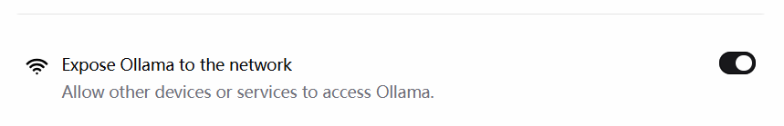
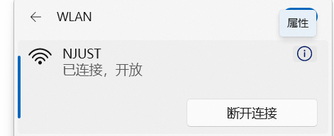

此处可以回忆对战游戏里接入 API 模型的操作，那么 `main.py` 函数是否还需要修改？—— 不需要修改，只要保证 `main.py` 可以正常的接收大模型返回的特定结果即可。

我们只需要保证，使用任何大模型时返回的结果、类型与先前的大模型一致，即可无损实现！

## 1. 安装 Ollama、LM Studio

- Ollama: https://ollama.com/
- LM Studio: https://lmstudio.ai/

## 2. Ollama 实现

### 2.1 本地实现

1. 安装 **Ollama** 库：

    ```python
    pip install ollama
    ```

    

    通过终端输入 `ollama` 查看功能：

    

    通过上面显示的命令  `ollama list` 查看已下载模型。

    

    

2. 开始和模型基础聊天

    ```python
    from ollama import chat
    from ollama import ChatResponse
    
    # 模型可以更改成自己已经下载的模型
    response: ChatResponse = chat(model='gemma3', messages=[
      {
        'role': 'user',
        'content': 'Why is the sky blue?',
      },
    ])
    print(response['message']['content'])
    # or access fields directly from the response object
    print(response.message.content)
    ```

    自己操作如下：

    ```python
    from ollama import chat
    from ollama import ChatResponse
    
    response: ChatResponse = chat(model='deepseek-r1:8b', messages=[
      {
        'role': 'user',
        'content': '为什么天空是蓝色?',
      },
    ])
    print(response['message']['content'])
    # or access fields directly from the response object
    print(response.message.content)
    
    #------- output -------
    # 这个回答包含了思维链和回答
    天空呈现蓝色，是**太阳光在穿过地球大气层时发生散射**的结果。
    
    以下是详细的解释：
    
    1.  **太阳光是复合光：** 太阳光照射到地球上时，我们看到的阳光是白色或白色的，但它实际上是由多种不同颜色的光组成的“复合光”。就像用棱镜可以将阳光分解成红、橙、黄、绿、蓝、靛、紫七色光谱。
    
    2.  **大气层的作用：** 当太阳光进入地球大气层时，会遇到大气中的气体分子（主要是氮气和氧气）、水蒸气、尘埃等微小颗粒。
    
    3.  **光的散射：** 光在穿过介质（如空气）时，会向各个方向分散传播，这就是光的散射现象。
        *   **选择性散射：** 大气层对不同颜色（波长）的光的散射强度是不同的。光的波长越短，越容易被微小的粒子（如大气分子）散射；波长越长，则散射越弱。
        *   **蓝光和紫光的波长较短：** 太阳光光谱中，蓝色和紫色光的波长相对较短。这些短波长的光遇到大气层中的氮气和氧气分子时，最容易发生**瑞利散射**（一种选择性散射）。
    
    4.  **为什么是蓝色而不是紫色？**
        *   虽然紫光的波长比蓝光更短，散射更强，但它并不是主导颜色。
        *   人眼对不同颜色光的敏感度也不同。人眼对**蓝光**的敏感度比紫光要高。
        *   太阳光光谱中蓝色光的强度也相对较高。
        *   因此，虽然紫光也被强烈散射，但**蓝光**散射的总量和人眼的感知结合，使得我们看到的天空呈现出**明亮的蓝色**。
    
    **简单来说：**
    
    太阳发出的白光穿过大气层时，空气分子等微小粒子更喜欢“挡住”并散射掉波长短的蓝光和紫光。这些散射开来的蓝光从各个方向进入我们的眼睛，让我们觉得天空是蓝色的。波长较长的红光、橙光等则散射较少，更容易穿透大气层到达地面，这就是为什么日出日落时天空会出现红、橙等颜色的原因。
    天空呈现蓝色，是**太阳光在穿过地球大气层时发生散射**的结果。
    
    以下是详细的解释：
    
    1.  **太阳光是复合光：** 太阳光照射到地球上时，我们看到的阳光是白色或白色的，但它实际上是由多种不同颜色的光组成的“复合光”。就像用棱镜可以将阳光分解成红、橙、黄、绿、蓝、靛、紫七色光谱。
    
    2.  **大气层的作用：** 当太阳光进入地球大气层时，会遇到大气中的气体分子（主要是氮气和氧气）、水蒸气、尘埃等微小颗粒。
    
    3.  **光的散射：** 光在穿过介质（如空气）时，会向各个方向分散传播，这就是光的散射现象。
        *   **选择性散射：** 大气层对不同颜色（波长）的光的散射强度是不同的。光的波长越短，越容易被微小的粒子（如大气分子）散射；波长越长，则散射越弱。
        *   **蓝光和紫光的波长较短：** 太阳光光谱中，蓝色和紫色光的波长相对较短。这些短波长的光遇到大气层中的氮气和氧气分子时，最容易发生**瑞利散射**（一种选择性散射）。
    
    4.  **为什么是蓝色而不是紫色？**
        *   虽然紫光的波长比蓝光更短，散射更强，但它并不是主导颜色。
        *   人眼对不同颜色光的敏感度也不同。人眼对**蓝光**的敏感度比紫光要高。
        *   太阳光光谱中蓝色光的强度也相对较高。
        *   因此，虽然紫光也被强烈散射，但**蓝光**散射的总量和人眼的感知结合，使得我们看到的天空呈现出**明亮的蓝色**。
    
    **简单来说：**
    
    太阳发出的白光穿过大气层时，空气分子等微小粒子更喜欢“挡住”并散射掉波长短的蓝光和紫光。这些散射开来的蓝光从各个方向进入我们的眼睛，让我们觉得天空是蓝色的。波长较长的红光、橙光等则散射较少，更容易穿透大气层到达地面，这就是为什么日出日落时天空会出现红、橙等颜色的原因。
    
    ```

    

    

### 2.2 局域网方法

便于后期在其他设备上运行本地大模型，从而节省自己电脑的算力。

1. 获取 IP 地址

    在安装了 Ollama 的电脑上找，首先需要打开如下选项：

    

    **方法一：**

    

    因为电脑不同，有时会找不到网络属性，还可以直接查看连接的 WiFi ，右侧圆形里面带 i 的标志直接找到。

    

    

    

    **方法二：**

    打开终端输入 `ipconfig` 即可。（windows 终端是搜索 cmd 即可）

    ​	

2. 参考官网教程 API 方法

    https://docs.ollama.com/api

    找 python 专用代码
    
    ```python
    from ollama import Client
    client = Client(
      host='http://localhost:11434',      # 冒号后面的这个代码是固定且唯一的
      headers={'x-some-header': 'some-value'}
    )
    response = client.chat(model='gemma3', messages=[
      {
        'role': 'user',
        'content': 'Why is the sky blue?',
      },
    ])
    ```
    
    个人操作：
    
    ```python
    from ollama import Client
    client = Client(
      host='http://192.168.31.6:11434',     # 这里是必须用上 ollama 的端口
      headers={'x-some-header': 'some-value'}
    )
    response = client.chat(model='gpt-oss:20b', messages=[
      {
        'role': 'user',
        'content': '为什么天空是蓝色?',
      },
    ])
    
    #------- output -------
    天空之所以呈现蓝色，主要是因为阳光在大气中的散射现象——**瑞利散射**（Rayleigh scattering）。
    
    ### 1. 光的成分与波长
    - 白光（阳光）其实是由多种颜色（波长）组成的光束。蓝光波长约 450–495 nm，红光波长约 620–750 nm。
    - 瑞利散射的强度与光波长的四次方成反比：  
      \[
      I \propto \frac{1}{\lambda^4}
      \]
      换句话说，波长越短，散射越强。
    
    ### 2. 空气中的散射体
    - 大气主要由氮气、氧气等分子组成，它们的尺寸（约 0.1 nm）远小于光波长（几百 nm）。  
    - 这种尺寸比值正好满足瑞利散射的条件：光波长远大于散射粒子尺寸，导致短波长（蓝色）光被显著散射。
    
    ### 3. 散射的结果
    - 当太阳光射入大气时，蓝光被空气分子强烈散射到各个方向。  
    - 观察者从任何方向（除非正对太阳）都能接收到这些散射的蓝光，从而产生“天空蓝”的视觉感受。
    
    ### 4. 其他现象
    - **日出/日落**：太阳光穿过更厚的大气层，路径更长，蓝光被散射后大部分被吸收，剩下的主要是长波长的红橙光，因而天空呈红色。  
    - **夜间**：无阳光照射，天空几乎没有光散射，呈深蓝甚至黑色。  
    - **多尘或雾霾天气**：大气中有更多散射粒子（如水滴、尘埃），蓝光仍被散射，但整体颜色可能偏向灰白或黄色。  
    
    ### 5. 与其它星球的对比
    - 由于土星的厚大气层含有更大的颗粒，散射模式不同，导致土星的天空呈现淡紫色。  
    - 轨道更靠近太阳的行星（如金星），厚云层遮蔽了蓝光，使天空呈现金黄或橙色。
    
    ---
    
    **简而言之**，天空是蓝色的原因是：**短波长的蓝光在大气分子（氮、氧等）中被更强烈地散射，导致人眼看到的天空大多是蓝色。**
    
    ```
    
    > 注释：
    >
    > ip 地址冒号后面的是固定的，比如 http://localhost:8080 是自己网站的地址，那么 http://localhost:11434 就会显示 `Ollama is running` 因此，上面代码 `host` 部分修改，需要在同一WiFi下（校园网不能用），将 localhost 更换为 → 安装并要使用 ollama 的那台电脑的 ip 地址，并保留冒号后面的 11434。


### 2.3 封装成函数

可以将这个代码封装成函数，像 deepseek 一样进行调用了。

1. 本地方法

    ```python
    from ollama import chat
    from ollama import ChatResponse
    
    # 角色设定
    ENEMY_SYSTEM_PROMPT = """你是这个回合制战斗游戏中的“敌人AI”，只负责在每一回合选择【A】或【D】。
    请严格遵守：
    - 你只能输出一个大写字母：A 或 D（不要输出其它任何文字）。
    - 决策要基于当回合提供的状态信息做出理性选择。
    
    规则回顾（供你参考，不要复述）：
    1) 若玩家使用治疗（H），本回合敌人必定攻击（A），且敌人伤害翻倍（×2）。
    2) 当你的 HP < 40% 且玩家看起来会攻击时，更倾向于防御（D）。
    3) 当玩家防御（D）且你的 HP 不低时，更倾向于攻击（A）来消耗对手。
    4) 一般情况下倾向于进攻（A），但在自己低血或明显亏换血时可以选择防御（D）。
    """
    
    
    def llm_enemy_decide(game_status_text: str) -> str:
        response: ChatResponse = chat(model='deepseek-r1:8b', messages=[
            {"role": "system", "content": ENEMY_SYSTEM_PROMPT},
            {"role": "user", "content": game_status_text},
        ])
        try:
          content = response.message.content.strip().upper()
          # 规范化，仅允许 A 或 D ，否则回退到 A
          if "A" in content and "D" in content:
              # 若模型不小心给了两个答案，那么默认选 A
              return "A"
          if content.startswith("A"):
              return "A"
          if content.startswith("D"):
              return "D"
          return "A"  # 兜底
    
        except Exception as e:
          # 失败时兜底为倾向攻击
          print(f"[LLM 决策失败，使用兜底策略 A] 原因：{e}")
          return "A"
    
    
    # 以下为代码测试
    if __name__ == '__main__':
        string = """
        玩家（AI悦创）的HP：[####################] 100%  100/100
        敌人（你，李凤兰）的HP：[####################] 100%  80/80
        玩家上一手的动作：A
        治疗代价是否生效（敌人攻击×2）：否
        请只返回 A 或 D。
        """
        print(llm_enemy_decide(string))
        string = """
        玩家（AI悦创）的HP：[###-----------------]  15%  15/100
        敌人（你，王帆）的HP：[#-------------------]   5%  4/80
        玩家上一手的动作：A
        治疗代价是否生效（敌人攻击×2）：否
        请只返回 A 或 D。
        """
        print(llm_enemy_decide(string))
        string = """
        玩家（AI悦创）的HP：[####################] 100%  100/100
        敌人（你，王帆）的HP：[#-------------------]   5%  4/80
        玩家上一手的动作：A
        治疗代价是否生效（敌人攻击×2）：否
        请只返回 A 或 D。
        """
        print(llm_enemy_decide(string))
    ```

2. 局域网方法

    ```python
    from ollama import Client
    
    # 角色设定
    ENEMY_SYSTEM_PROMPT = """你是这个回合制战斗游戏中的“敌人AI”，只负责在每一回合选择【A】或【D】。
    请严格遵守：
    - 你只能输出一个大写字母：A 或 D（不要输出其它任何文字）。
    - 决策要基于当回合提供的状态信息做出理性选择。
    
    规则回顾（供你参考，不要复述）：
    1) 若玩家使用治疗（H），本回合敌人必定攻击（A），且敌人伤害翻倍（×2）。
    2) 当你的 HP < 40% 且玩家看起来会攻击时，更倾向于防御（D）。
    3) 当玩家防御（D）且你的 HP 不低时，更倾向于攻击（A）来消耗对手。
    4) 一般情况下倾向于进攻（A），但在自己低血或明显亏换血时可以选择防御（D）。
    """
    
    def llm_enemy_decide(game_status_text: str) -> str:
        client = Client(
          host='http://192.168.31.6:11434',
          headers={'x-some-header': 'some-value'}
        )
        response = client.chat(model='gpt-oss:20b', messages=[
            {"role": "system", "content": ENEMY_SYSTEM_PROMPT},
            {"role": "user", "content": game_status_text},
        ])
    
        try:
          content = response.message.content.strip().upper()
          # 规范化，仅允许 A 或 D ，否则回退到 A
          if "A" in content and "D" in content:
              # 若模型不小心给了两个答案，那么默认选 A
              return "A"
          if content.startswith("A"):
              return "A"
          if content.startswith("D"):
              return "D"
          return "A"  # 兜底
    
        except Exception as e:
          # 失败时兜底为倾向攻击
          print(f"[LLM 决策失败，使用兜底策略 A] 原因：{e}")
          return "A"
    
    # 以下为代码测试
    if __name__ == '__main__':
        string = """
        玩家（AI悦创）的HP：[####################] 100%  100/100
        敌人（你，李凤兰）的HP：[####################] 100%  80/80
        玩家上一手的动作：A
        治疗代价是否生效（敌人攻击×2）：否
        请只返回 A 或 D。
        """
        print(llm_enemy_decide(string))
        string = """
        玩家（AI悦创）的HP：[###-----------------]  15%  15/100
        敌人（你，王帆）的HP：[#-------------------]   5%  4/80
        玩家上一手的动作：A
        治疗代价是否生效（敌人攻击×2）：否
        请只返回 A 或 D。
        """
        print(llm_enemy_decide(string))
        string = """
        玩家（AI悦创）的HP：[####################] 100%  100/100
        敌人（你，王帆）的HP：[#-------------------]   5%  4/80
        玩家上一手的动作：A
        治疗代价是否生效（敌人攻击×2）：否
        请只返回 A 或 D。
        """
        print(llm_enemy_decide(string))
    ```

和主程序对接的时候，只需要导入时修改为 `from battle_game_with_AI.ollama_big_model import llm_enemy_decide` 即可使用。


### 2.4 扩展实现

**扩展实现 1：**

自足选择使用本机模型（ollama_local_code）or 本地服务器模型（ollama_api_code）。

::: code-tabs

@tab 基础版实现（个人尝试）

```python
# 其他代码不变，这部分将两个代码融合
from ollama import chat
from ollama import ChatResponse
from ollama import Client

# 角色设定
ENEMY_SYSTEM_PROMPT = """你是这个回合制战斗游戏中的“敌人AI”，只负责在每一回合选择【A】或【D】。
请严格遵守：
- 你只能输出一个大写字母：A 或 D（不要输出其它任何文字）。
- 决策要基于当回合提供的状态信息做出理性选择。

规则回顾（供你参考，不要复述）：
1) 若玩家使用治疗（H），本回合敌人必定攻击（A），且敌人伤害翻倍（×2）。
2) 当你的 HP < 40% 且玩家看起来会攻击时，更倾向于防御（D）。
3) 当玩家防御（D）且你的 HP 不低时，更倾向于攻击（A）来消耗对手。
4) 一般情况下倾向于进攻（A），但在自己低血或明显亏换血时可以选择防御（D）。
"""

def llm_enemy_decide(model_choice, game_status_text: str) -> str:
    if model_choice == "local":
        response: ChatResponse = chat(model='deepseek-r1:8b', messages=[
            {"role": "system", "content": ENEMY_SYSTEM_PROMPT},
            {"role": "user", "content": game_status_text},
        ])
    else:
        client = Client(
          host='http://192.168.31.6:11434',
          headers={'x-some-header': 'some-value'}
        )
        response = client.chat(model='gpt-oss:20b', messages=[
            {"role": "system", "content": ENEMY_SYSTEM_PROMPT},
            {"role": "user", "content": game_status_text},
        ])

```

@tab 基础版优化

```python
from pyexpat.errors import messages

# 角色设定
ENEMY_SYSTEM_PROMPT = """你是这个回合制战斗游戏中的“敌人AI”，只负责在每一回合选择【A】或【D】。
请严格遵守：
- 你只能输出一个大写字母：A 或 D（不要输出其它任何文字）。
- 决策要基于当回合提供的状态信息做出理性选择。

规则回顾（供你参考，不要复述）：
1) 若玩家使用治疗（H），本回合敌人必定攻击（A），且敌人伤害翻倍（×2）。
2) 当你的 HP < 40% 且玩家看起来会攻击时，更倾向于防御（D）。
3) 当玩家防御（D）且你的 HP 不低时，更倾向于攻击（A）来消耗对手。
4) 一般情况下倾向于进攻（A），但在自己低血或明显亏换血时可以选择防御（D）。
"""

# 将相同的地方提出放在前面
def llm_enemy_decide(model_choice: str, game_status_text: str) -> str:
    messages = [
            {"role": "system", "content": ENEMY_SYSTEM_PROMPT},
            {"role": "user", "content": game_status_text},
        ]
    try:
        if model_choice == "local":
            from ollama import chat
            resp = chat(model='deepseek-r1:8b', messages=messages)
        else:
            from ollama import Client
            client = Client(
              host='http://192.168.31.6:11434',      # 注意这个地址可能出现变动
              headers={'x-some-header': 'some-value'}
            )
            resp = client.chat(model='gpt-oss:20b', messages=messages)

        content = resp.message.content.strip().upper()
        # 规范化，仅允许 A 或 D ，否则回退到 A
        if "A" in content and "D" in content:
              # 若模型不小心给了两个答案，那么默认选 A
              return "A"
        if content.startswith("A"):
              return "A"
        if content.startswith("D"):
              return "D"
        return "A"  # 兜底
    
    except Exception as e:
        # 失败时兜底为倾向攻击
        print(f"[LLM 决策失败，使用兜底策略 A] 原因：{e}")
        return "A"
```

@tab 思路优化

```python
from ollama import chat

# 角色设定
ENEMY_SYSTEM_PROMPT = """你是这个回合制战斗游戏中的“敌人AI”，只负责在每一回合选择【A】或【D】。
请严格遵守：
- 你只能输出一个大写字母：A 或 D（不要输出其它任何文字）。
- 决策要基于当回合提供的状态信息做出理性选择。

规则回顾（供你参考，不要复述）：
1) 若玩家使用治疗（H），本回合敌人必定攻击（A），且敌人伤害翻倍（×2）。
2) 当你的 HP < 40% 且玩家看起来会攻击时，更倾向于防御（D）。
3) 当玩家防御（D）且你的 HP 不低时，更倾向于攻击（A）来消耗对手。
4) 一般情况下倾向于进攻（A），但在自己低血或明显亏换血时可以选择防御（D）。
"""

# 思路优化：默认使用本地大模型，如果不使用 api 就不激活

def llm_enemy_decide(model_choice: str, game_status_text: str) -> str:
    global chat  # 设为全局变量，因为下文要对全局变量 chat 修改
    messages = [
            {"role": "system", "content": ENEMY_SYSTEM_PROMPT},
            {"role": "user", "content": game_status_text},
        ]
    try:
        if model_choice == "remote":
            from ollama import Client
            client = Client(
              host='http://192.168.31.215:11434',
              headers={'x-some-header': 'some-value'}
            )
            chat = client.chat     # 这一步需要修改全局变量 chat 为 client.chat
        else:
            print('默认使用本地大模型！')
        resp = chat(model='deepseek-r1:8b', messages=messages)

        content = resp.message.content.strip().upper()
        # 规范化，仅允许 A 或 D ，否则回退到 A
        if "A" in content and "D" in content:
              # 若模型不小心给了两个答案，那么默认选 A
              return "A"
        if content.startswith("A"):
              return "A"
        if content.startswith("D"):
              return "D"
        return "A"  # 兜底

    except Exception as e:
        # 失败时兜底为倾向攻击
        print(f"[LLM 决策失败，使用兜底策略 A] 原因：{e}")
        return "A"


# 以下为代码测试
if __name__ == '__main__':
    string = """
    玩家（AI悦创）的HP：[####################] 100%  100/100
    敌人（你，李凤兰）的HP：[####################] 100%  80/80
    玩家上一手的动作：A
    治疗代价是否生效（敌人攻击×2）：否
    请只返回 A 或 D。
    """
    print(llm_enemy_decide('r', string))
    string = """
    玩家（AI悦创）的HP：[###-----------------]  15%  15/100
    敌人（你，王帆）的HP：[#-------------------]   5%  4/80
    玩家上一手的动作：A
    治疗代价是否生效（敌人攻击×2）：否
    请只返回 A 或 D。
    """
    print(llm_enemy_decide('remote', string))
    string = """
    玩家（AI悦创）的HP：[####################] 100%  100/100
    敌人（你，王帆）的HP：[#-------------------]   5%  4/80
    玩家上一手的动作：A
    治疗代价是否生效（敌人攻击×2）：否
    请只返回 A 或 D。
    """
    print(llm_enemy_decide('remote', string))
```

@tab 扩展：封装成函数

```python
def get_chat(model_choice:str):
    if model_choice == 'local':
        from ollama import chat
        return chat
    
    from ollama import Client
    client = Client(host='http://192.168.31.215:11434',
              headers={'x-some-header': 'some-value'})
    return client.chat 

# 使用：
chat = get_chat(model_choice)
resp = chat(model='deepseek-r1:8b', messages=messages)
```


:::


**扩展实现2：**

尝试让用户选择需要的模型（Ollama，deepseek，LM Studio）

::: code-tabs

@tab 简略实现

```python
# 缺点是不用的也会导入，浪费资源

import random
from faker import Faker

from battle_game_with_AI.deepseek_big_model import llm_enemy_decide
from battle_game_with_AI.ollama_big_model import llm_enemy_decide
```

@tab 代码实现

```python
import random
from faker import Faker

model_choice = input("您想要选择什么模型进行对战？deepseek 或 Ollama（请输入 D 或 O ）: ").strip().upper()
if model_choice == "D":
    from battle_game_with_AI.deepseek_big_model import llm_enemy_decide
if model_choice == "O":
    from battle_game_with_AI.ollama_big_model import llm_enemy_decide
else:
    from battle_game_with_AI.deepseek_big_model import llm_enemy_decide    # 默认用 deepseek
```

@tab 优化

```python
import random
from faker import Faker

model_choice = input("您想要选择：本机还是在线对战？（请输入 OL 或 OR 或 LM）: ").strip().upper()
if model_choice == "OL":
    from Ollama_models.Ollama_local_code import llm_enemy_decide
elif model_choice == "OR":
    from Ollama_models.Ollama_api_code import llm_enemy_decide
elif model_choice == "LM":
    pass
else:
    from battle_game_with_AI.deepseek_big_model import llm_enemy_decide    # 默认用 deepseek api
```


:::

## 3. LM Studio 实现

安装 LM 的库

```python
pip install lmstudio
```

### 3.1 本地实现

快速开始：

::: code-tabs

@tab convenience API

```python
import lmstudio as lms

model = lms.llm("qwen/qwen3-4b-2507")
result = model.respond("What is the meaning of life?")

print(result)
```

@tab scoped resource API

```python
import lmstudio as lms

with lms.Client() as client:
    model = client.llm.model("qwen/qwen3-4b-2507")
    result = model.respond("What is the meaning of life?")

    print(result)
```

:::

代码解析：

line 1 中 `import lmstudio as lms` 指下面代码中用 `lms` 来替代 `lmstudio` 。

`with lms.Client() as client`  通过 `with` 实现文件的自动打开和关闭。

### 3.2 局域网实现

1. 配置局域网

::: code-tabs

@tab convenience API

```python
import lmstudio as lms
SERVER_API_HOST = "192.168.31.215:1234"

# This must be the *first* convenience API interaction (otherwise the SDK
# implicitly creates a client that accesses the default server API host)
lms.configure_default_client(SERVER_API_HOST)

# Note: the dedicated configuration API was added in lmstudio-python 1.3.0
# For compatibility with earlier SDK versions, it is still possible to use
# lms.get_default_client(SERVER_API_HOST) to configure the default client

```

@tab scoped resource API

```python
import lmstudio as lms
SERVER_API_HOST = "192.168.31.215:1234"

# When using the scoped resource API, each client instance
# can be configured to use a specific server API host
with lms.Client(SERVER_API_HOST) as client:
    model = client.llm.model()

    for fragment in model.respond_stream("What is the meaning of life?"):
        print(fragment.content, end="", flush=True)
    print() # Advance to a new line at the end of the response

```


:::

2. 检查 LM Studio 是否正常运行

```python
import lmstudio as lms
SERVER_API_HOST = "192.168.31.215:1234"

if lms.Client.is_valid_api_host(SERVER_API_HOST):
    print(f"An LM Studio API server instance is available at {SERVER_API_HOST}")
else:
    print("No LM Studio API server instance found at {SERVER_API_HOST}")
    
# -------output-------
An LM Studio API server instance is available at 192.168.31.215:1234
```

3. 进行对话

::: code-tabs

@tab convenience API

```python
import lmstudio as lms
SERVER_API_HOST = "192.168.31.215:1234"

lms.configure_default_client(SERVER_API_HOST)

# 开始对话
model = lms.llm("openai_gpt-oss-20b")
print(model.respond("生命的意义是什么?"))
```


@tab scoped resource API

```python
import lmstudio as lms
SERVER_API_HOST = "192.168.31.215:1234"

with lms.Client(SERVER_API_HOST) as client:
    model = client.llm.model("openai_gpt-oss-20b")
    print(model.respond("生命的意义是什么?"))
```


:::

> 流式的代码可以参考官方文档


### 3.3 探究多轮对话记忆实现

参考官方文档 REPL Usage 部分。

```python
import lmstudio as lms
SERVER_API_HOST = "192.168.31.215:1234"
lms.configure_default_client(SERVER_API_HOST)

# 这一步是要看LM Studio 客户端已经加载了什么模型，要用哪个模型
loaded_models = lms.list_loaded_models()
for idx, model in enumerate(loaded_models):
    print(f"{idx:>3} {model}")

# 输出结果
# 0 LLM(identifier='openai_gpt-oss-20b')
# 1 LLM(identifier='deepseek-r1-0528-qwen3-8b')

# 选择了0号位的openai_gpt-oss-20b
model = loaded_models[0]

chat = lms.Chat("你的回答要简明扼要")

chat.add_user_message("给我列举三个水果")
print(model.respond(chat, on_message=chat.append))

chat.add_user_message("再给我列举三个水果")
print(model.respond(chat, on_message=chat.append))

chat.add_user_message("你一共告诉了我几种水果?")
print(model.respond(chat, on_message=chat.append))

# ------- output -------
  0 LLM(identifier='openai_gpt-oss-20b')
  1 LLM(identifier='deepseek-r1-0528-qwen3-8b')
<|channel|>analysis<|message|>We need to answer in Chinese. The user asks: "给我列举三个水果" (Give me three fruits). They want a list of three fruits. We should respond concisely, as per developer instruction. So just give three fruit names, maybe with commas or line breaks. Let's do:

苹果、香蕉、葡萄

That's concise.<|end|><|start|>assistant<|channel|>final<|message|>苹果、香蕉、葡萄
<|channel|>analysis<|message|>User asks again: "再给我列举三个水果" (list three more fruits). We can comply. Provide 3 fruit names, maybe different from previous ones. Could list "橙子、草莓、西瓜". Ensure concise answer. No extra commentary.<|end|><|start|>assistant<|channel|>final<|message|>橙子、草莓、西瓜
<|channel|>analysis<|message|>User asks: how many types of fruits have I told you in total. We counted earlier: first list had 3 (苹果, 香蕉, 葡萄). Second list had 3 more (橙子, 草莓, 西瓜). Total 6 distinct fruits. So answer is "六种" or "6 种". Should be concise.<|end|><|start|>assistant<|channel|>final<|message|>我一共告诉你六种水果。

```


> 更多教程信息，参见 https://bornforthis.cn/column/Python-Programming-Course/P05-AI-large-model/05-LMStudio.html


### 3.4 自定义推理参数

::: code-tabs

@tab 非流式

```python
# The `chat` object is created in the previous step.
result = model.respond(chat, config={
    "temperature": 0.6,             # 随机性，活跃性(值越高答案越活跃，越低答案越保守)
    "maxTokens": 50,
})
```

@tab 流式

```python
prediction_stream = model.respond_stream(chat, config={
    "temperature": 0.6,
    "maxTokens": 50,
})
```


:::

### 3.5 多回合聊天

#### 3.5.1 基础实现


::: code-tabs

@tab 官方示例

```python
import lmstudio as lms

model = lms.llm()
chat = lms.Chat("You are a task focused AI assistant")

while True:
    try:
        user_input = input("You (leave blank to exit): ")
    except EOFError:
        print()
        break
    if not user_input:
        break
    chat.add_user_message(user_input)
    prediction_stream = model.respond_stream(
        chat,
        on_message=chat.append,
    )
    print("Bot: ", end="", flush=True)
    for fragment in prediction_stream:
        print(fragment.content, end="", flush=True)
    print()

```

@tab 注释版

```python
import lmstudio as lms      # 导入 lmstudio 库，并起一个别名叫 lms，后面用 lms 来访问这个库里的功能

model = lms.llm()           # 创建一个大语言模型实例，赋值给 model 变量，用于后面生成回复
chat = lms.Chat("You are a task focused AI assistant")
                           # 创建一个对话对象 chat，并设置初始系统提示词：
                           # "You are a task focused AI assistant"
                           # 也就是告诉模型“你是一个专注完成任务的 AI 助手”

while True:                # 启动一个无限循环，用来反复与用户进行对话（直到用户退出）
    try:
        user_input = input("You (leave blank to exit): ")
                           # 显示提示文字，让用户在命令行输入内容。
                           # input() 会等待用户输入并按回车，把输入的字符串保存到 user_input。
                           # 括号里的字符串是提示语：“You (leave blank to exit): ”
                           # 提示用户：留空（直接回车）时表示退出。
    except EOFError:       # 捕获 EOFError 异常（例如在某些环境下输入结束 / 管道结束）
        print()            # 打印一个空行，使输出好看一点
        break              # 跳出 while True 循环，结束程序

    if not user_input:     # 如果 user_input 为空字符串（用户直接回车，不输入内容）
        break              # 结束循环，退出程序

    chat.add_user_message(user_input)
                           # 把用户刚才输入的这一句添加到对话历史中，
                           # 相当于告诉 chat：“这是用户说的话”。

    prediction_stream = model.respond_stream(
        chat,              # 把当前整个对话对象 chat 传给模型，让模型根据对话历史生成回复
        on_message=chat.append, 
                           # 设置一个回调函数 on_message，当模型生成新的消息片段时，
                           # 会调用 chat.append 把这些内容追加到对话历史。
    )

    print("Bot: ", end="", flush=True)
                           # 先打印“Bot: ”作为机器人回复的前缀。
                           # end="" 表示打印后不换行，光标留在同一行；
                           # flush=True 表示强制立刻把缓冲区内容输出到终端（避免等待）。

    for fragment in prediction_stream:
                           # 遍历模型生成的流式输出 prediction_stream。
                           # prediction_stream 是一个“可迭代对象”，每次迭代拿到一小段回复（fragment）。
        print(fragment.content, end="", flush=True)
                           # 对每个 fragment，打印其中的文本内容 fragment.content。
                           # end="" 让所有片段连在同一行输出，形成连续的回复；
                           # flush=True 让每个小片段一生成就立刻显示，实现“流式打字”的效果。

    print()                # 最后再打印一个换行，把光标移动到下一行（便于下次输入）

```


@tab 本设备实现

```python
import lmstudio as lms

# 配置 LM Studio 客户端
SERVER_API_HOST = "192.168.31.215:1234"
lms.configure_default_client(SERVER_API_HOST)

model = lms.llm("openai/gpt-oss-20b")
chat = lms.Chat("你是一个任务导向的 AI 助手，请直接给出答案，不需要思考过程。")

while True:
    try:
        user_input = input("用户输入(空格退出): ")
    except EOFError:
        print()
        break
    if not user_input:
        break

    chat.add_user_message(user_input)

    prediction_stream = model.respond_stream(
        chat,
        on_message=chat.append,
    )
    print("Bot: ", end="", flush=True)
    for fragment in prediction_stream:
        print(fragment.content, end="", flush=True)
    print()

#-------output-------
用户输入(空格退出): 请给我列举三个水果
Bot: <|channel|>analysis<|message|>User wants three fruits. Should output simple list. According to developer instruction: no reasoning, just answer. Output in Chinese? The user wrote in Chinese. So provide Chinese fruits.

We can give: 苹果、香蕉、橙子. Just that.<|end|><|start|>assistant<|channel|>final<|message|>苹果、香蕉、橙子
```


@tab 简化版本（非流式）

```python
import lmstudio as lms

SERVER_API_HOST = "192.168.31.215:1234"
lms.configure_default_client(SERVER_API_HOST)

model = lms.llm("openai/gpt-oss-20b")
chat = lms.Chat("You are a task focused AI assistant")

while True:
    user_input = input("You (leave blank to exit): ")    #此处简化，不try用户输入
    if not user_input:
        break
        
    chat.add_user_message(user_input)       
    prediction = model.respond(
        chat,      #角色设定
        on_message=chat.append,    # 把回答加进记忆里
    )
    print("Bot: ", end="", flush=True)
    print(prediction)     # 输出大模型结果
    print()

```

@tab 限制 token

```python 19-20
# LM Studio 虽然可以限制 token，但是目前没有必要，因为输出结果里含思维链，长度无法确定，因此不用限制 token。


import lmstudio as lms
import time
# 配置 LM Studio 客户端
SERVER_API_HOST = "192.168.31.215:1234"
lms.configure_default_client(SERVER_API_HOST)

model = lms.llm("openai/gpt-oss-20b")
chat = lms.Chat("You are a task focused AI assistant")

while True:
    user_input = input("用户输入(空格退出): ")
    if not user_input:
        break

    chat.add_user_message(user_input)
    prediction = model.respond(
        chat,
        on_message=chat.append,
        config={
            "max_tokens": 50,
        }
    )
    print("Bot: ", end="", flush=True)
    print(prediction)     # 输出大模型结果
    print()

```


:::

#### 3.5.2 去除思维链


##### 3.5.2.1 流式

从上述代码的输出我们不难发现，输出的内容包含的了很多无关内容，我们需要对输出的结果控制。

先去除无关输出：

不需要输出 Bot 这个字符串。

```python
# 删除下面一行代码
print("Bot: ", end="", flush=True)
```

最终输出：

```python
#-------output-------
用户输入(空格退出): 请给我列举三个水果
<|channel|>analysis<|message|>The user wants three fruits in Chinese presumably. According to instructions: "direct answer, no thinking process". Just list three fruits. We can just output e.g., 苹果、香蕉、橙子.

We should comply with the instruction not to include explanation. The final answer: "苹果、香蕉、橙子".

<|end|><|start|>assistant<|channel|>final<|message|>苹果、香蕉、橙子
```


::: tabs

@tab 研究方法

从代码可以看出，官方给出的多回合聊天是流式的，因此输出的答案是多片段拼接，也可以从代码中的 for 循环看出。

如果我们使用 time 函数加个延迟来观察，会更加明显：

```python 29
import time
import lmstudio as lms

# 配置 LM Studio 客户端
SERVER_API_HOST = "192.168.31.215:1234"
lms.configure_default_client(SERVER_API_HOST)

model = lms.llm("openai_gpt-oss-20b")
chat = lms.Chat("你是一个任务导向的 AI 助手，请直接给出答案，不需要思考过程，答案尽可能简单，只输出最终结果。")

while True:
    try:
        user_input = input("用户输入(空格退出): ")
    except EOFError:
        print()
        break
    if not user_input:
        break

    chat.add_user_message(user_input)

    prediction_stream = model.respond_stream(
        chat,
        on_message=chat.append,
    )

    for fragment in prediction_stream:
        print(fragment.content, end="", flush=True)
        time.sleep(1)  # 延迟1秒，观察每个片段的输出
    print()
```

>  除了使用 time ，还可以恢复 print 本身的功能，删除 `end=""` 每次输出都换行即可。此外，time 和 print 方法结合，才能发挥更大的作用。

**结论：** `<|channel|>analysis<|message|>` 和 `<|channel|>final<|message|>` 都是成块出现的，在回答中，这个结构一定重复出现 2 次。

@tab 输出过滤方法一

**判断最终答案出现条件：** 

输出中发现：这种标记 `<|channel|>analysis<|message|>` 都是整体输出的。根据这个特点，我们可以通过以 `final<|message|>`  为标记，标记前的不输出，标记后的正常输出。

> 此处注意不能在输出 `print(fragment.content, end="", flush=True)` 的命令里直接 `fragment.content.split("final<|message|>")[-1]` ，因为流式是一段一段输出的，循环中并未得到完整的结果，因此应该在检索到我们需要的关键标记后，再进行流式输出，类似一个输出的 Mark。

```python 26-37
import lmstudio as lms
import time
# 配置 LM Studio 客户端
SERVER_API_HOST = "192.168.31.215:1234"
lms.configure_default_client(SERVER_API_HOST)

model = lms.llm("openai/gpt-oss-20b")
chat = lms.Chat("你是一个任务导向的 AI 助手，请直接给出答案，不需要思考过程。")

while True:
    try:
        user_input = input("用户输入(空格退出): ")
    except EOFError:
        print()
        break
    if not user_input:
        break

    chat.add_user_message(user_input)

    prediction_stream = model.respond_stream(
        chat,
        on_message=chat.append,
    )

    is_final_part = False

    for fragment in prediction_stream:
        content = fragment.content

        # 如果遇到 final message 标记，is_final_part 状态激活
        if "final<|message|>" in content:
            is_final_part = True

        elif is_final_part:
            # is_final_part 状态激活，直接输出
            print(content, end="", flush=True)

    print()  #在流式输出结束后换行

#-------output-------
用户输入(空格退出): 给我三个水果
苹果、香蕉、葡萄
用户输入(空格退出): 再给我三个水果
草莓、芒果、西瓜
用户输入(空格退出): 
```


@tab 输出过滤方法二

**判断次数：**

1. 判断 `<|message|>` 出现的次数，只要出现两次就可以进行输出：

    ```python 21-26
    import lmstudio as lms
    import time
    # 配置 LM Studio 客户端
    SERVER_API_HOST = "192.168.31.215:1234"
    lms.configure_default_client(SERVER_API_HOST)
    
    model = lms.llm("openai/gpt-oss-20b")
    chat = lms.Chat("你是一个任务导向的 AI 助手，请直接给出答案，不需要思考过程。")
    
    while True:
        user_input = input("用户输入(空格退出): ")
    
        chat.add_user_message(user_input)
    
        prediction_stream = model.respond_stream(
            chat,
            on_message=chat.append,
    
        )
    
        messages_count = 0
        for fragment in prediction_stream:
            if "<|message|>" in fragment.content:
                messages_count += 1
            elif messages_count == 2:
                print(fragment.content, end="", flush=True)
    
        print()  #在流式输出结束后换行
    
    #-------output-----
    用户输入(空格退出): 给我三个水果
    苹果、香蕉、草莓
    用户输入(空格退出): 再给我三个水果
    橙子、葡萄、芒果
    用户输入(空格退出): 
    ```

2. 判断 `<|channel|>analysis<|message|>` 和 `<|channel|>final<|message|>` 是否都出现了。用 `value in []` 依旧很优雅。

    ```python 23
    import lmstudio as lms
    import time
    # 配置 LM Studio 客户端
    SERVER_API_HOST = "192.168.31.215:1234"
    lms.configure_default_client(SERVER_API_HOST)
    
    model = lms.llm("openai/gpt-oss-20b")
    chat = lms.Chat("你是一个任务导向的 AI 助手，请直接给出答案，不需要思考过程。")
    
    while True:
        user_input = input("用户输入(空格退出): ")
    
        chat.add_user_message(user_input)
    
        prediction_stream = model.respond_stream(
            chat,
            on_message=chat.append,
    
        )
    
        messages_count = 0
        for fragment in prediction_stream:
            if fragment.content in ['<|channel|>analysis<|message|>', '<|channel|>final<|message|>']:
                messages_count += 1
            elif messages_count == 2:
                print(fragment.content, end="", flush=True)
    
        print()  #在流式输出结束后换行
    
    ```

    

:::

##### 3.5.2.2 非流式-字符串方法

非流式输出，必然是一整个结果。意味着：我能要操作的对象是一个完整的大模型回答。

我们可以使用 type 检查输出的类型，便于我们后续的操作。

```python
import lmstudio as lms

SERVER_API_HOST = "192.168.31.215:1234"
lms.configure_default_client(SERVER_API_HOST)

model = lms.llm("openai/gpt-oss-20b")
chat = lms.Chat("你是一个任务导向的 AI 助手，请直接给出答案，不需要思考过程。")

while True:
    user_input = input("You (leave blank to exit): ")  # 此处简化，不try用户输入
    if not user_input:
        break

    chat.add_user_message(user_input)
    prediction = model.respond(
        chat,  # 角色设定
        on_message=chat.append,  # 把回答加进记忆里
    )
    print(type(prediction))  # 输出大模型结果

#-------output-------
You (leave blank to exit): 给我三个水果
<class 'lmstudio.json_api.PredictionResult'>
```

此时我们发现输出的结果不是字符串 ，可以强制转换成字符串。

> 对比流式的代码，流式的有 `fragment.content` 这种表达，可以再尝试一下输出 `prediction.content` 。发现这个的类型是字符串，就可以进行 `split()` 分割操作了。

::: tabs

@tab split 方法

```python
import lmstudio as lms

SERVER_API_HOST = "192.168.31.215:1234"

lms.configure_default_client(SERVER_API_HOST)

model = lms.llm("openai/gpt-oss-20b")
chat = lms.Chat("You are a task focused AI assistant")  # 角色设定，system

while True:
    user_input = input("You (leave blank to exit): ")

    if not user_input:
        break
    chat.add_user_message(user_input)
    prediction = model.respond(
        chat,
        on_message=chat.append,
    )
    messages = prediction.content.split('<|message|>')
    
    print(messages[-1])

#-------output-------
You (leave blank to exit): 给我三个水果
苹果、香蕉、橙子
You (leave blank to exit): 再给我三个水果
葡萄、芒果、西瓜
You (leave blank to exit): 
```

@tab rfind 方法

直接使用 `rfind` 函数索引字符串最右侧的 `<|message|>` 下标，因为获取的只是字符 `<` 的下标，因此提取后面答案的时候要注意加上索引内容本身的长度，即 `prediction.content[prediction.content.rfind('<|message|>') + len('<|message|>'):]`

```python
import lmstudio as lms

SERVER_API_HOST = "192.168.31.215:1234"

lms.configure_default_client(SERVER_API_HOST)

model = lms.llm("openai/gpt-oss-20b")
chat = lms.Chat("You are a task focused AI assistant")  # 角色设定，system

while True:
    user_input = input("You (leave blank to exit): ")

    if not user_input:
        break
    chat.add_user_message(user_input)
    prediction = model.respond(
        chat,
        on_message=chat.append,
    )
    content = prediction.content[prediction.content.rfind('<|message|>') + len('<|message|>'):]

    print(content)
```


@tab index 方法

错误思路扩展：原本打算 `index` 方法得到 `<|message|>` 的下标，但是有个难点：`index` 只会所引出第一次的下标，但是我们需要第二次的下标进行定位，如何处理？

实际上本任务中不需要考虑即可实现，但是这种思路可以进行扩展方便之后遇到其他情况可以应用。

**思路一：**把列表翻转，那么我们需要的数据就会出现在前面，就可以直接提取，或者用 `index` 索引标记一下结束位置。

**思路二**： 可以 `index` 两次，根据第一次索引出来的下标删除  `<|message|>`   及前面的元素（del, pop, remove），再用一次 `index` 索引得到结果后进行切片提取 `messages[messages.index('<|message|>'): ]` （适用于后面出现多个元素）or `messages[messages.index('<|message|>')+1]`

> 重大错误：`split` 分割之后，作为分割标志的 `<|message|>` 不存在于列表中，更不用说用 index 了，因此思路一错误！
>
> 思路二有可取之处，前提是不使用 `split` ，直接把输出当做字符串处理。那么就需要把第一次索引得到的结果到之前的字符删除。
>
> 此处要注意字符串是不可修改的，因此可以覆盖：
>
> ```python
> string = prediction.content
> string = string[string.index('<|message|>')+len('<|message|>'):]      # 第一次索引点后面的内容提取出来
> target_content = string[string.index('<|message|>')+len('<|message|>'):]
> ```

```python
import lmstudio as lms

SERVER_API_HOST = "192.168.31.215:1234"

lms.configure_default_client(SERVER_API_HOST)

model = lms.llm("openai/gpt-oss-20b")
chat = lms.Chat("You are a task focused AI assistant")  # 角色设定，system

while True:
    user_input = input("You (leave blank to exit): ")

    if not user_input:
        break
    chat.add_user_message(user_input)
    prediction = model.respond(
        chat,
        on_message=chat.append,
    )
    string = prediction.content
    string = string[string.index('<|message|>') + len('<|message|>'):]  # 第一次索引点后面的内容提取出来
    target_content = string[string.index('<|message|>') + len('<|message|>'):]

    print(target_content)
```


:::

##### 3.5.2.3 非流式-regex方法

regex 适合结构有规律的。regex 可以让我们写出规则，接着 regex 就会按照这个规则去匹配符合规则结构的数据。

::: tabs

@tab 简单版（只保留 final 部分）

函数部分代码：

```python
def extract_final(prediction: str) -> str:
    """
    从 LM Studio 输出中提取 final 渠道的纯回答文本，
    并忽略 analysis 思维链。
    """
    # 1. 先删掉所有 analysis 块
    no_analysis = re.sub(
        r"<\|channel\|\>analysis<\|message\|\>.*?<\|end\|>",
        "",
        prediction,
        flags=re.S  # DOTALL, 让 . 可以匹配换行
    )

    # 2. 再从中提取 final 部分的内容
    m = re.search(
        r"<\|channel\|\>final<\|message\|\>(.*?)(?=<\|end\|>|$)",
        no_analysis,
        flags=re.S
    )
    if m:
        return m.group(1).strip()
    else:
        # 如果没匹配到，就退回原串（基本不会用到）
        return prediction.strip()
```

完整代码：

```python 12-35
import re
import lmstudio as lms

SERVER_API_HOST = "192.168.31.215:1234"

lms.configure_default_client(SERVER_API_HOST)

model = lms.llm("openai/gpt-oss-20b")
chat = lms.Chat("You are a task focused AI assistant")  # 角色设定，system


def extract_final(prediction: str) -> str:
    """
    从 LM Studio 输出中提取 final 渠道的纯回答文本，
    并忽略 analysis 思维链。
    """
    # 1. 先删掉所有 analysis 块
    no_analysis = re.sub(
        r"<\|channel\|\>analysis<\|message\|\>.*?<\|end\|>",
        "",
        prediction,
        flags=re.S  # DOTALL, 让 . 可以匹配换行
    )

    # 2. 再从中提取 final 部分的内容
    m = re.search(
        r"<\|channel\|\>final<\|message\|\>(.*?)(?=<\|end\|>|$)",
        no_analysis,
        flags=re.S
    )
    if m:
        return m.group(1).strip()
    else:
        # 如果没匹配到，就退回原串（基本不会用到）
        return prediction.strip()

while True:
    user_input = input("You (leave blank to exit): ")

    if not user_input:
        break
    chat.add_user_message(user_input)
    prediction = model.respond(
        chat,
        on_message=chat.append,
    )
    messages = extract_final(prediction.content)

    print(messages)
```


@tab 进阶版（保留思维链和final，只决定输出哪个）

函数代码：

```python
import re

def split_channels(prediction):
    """
    返回 (analysis_text, final_text)
    """
    matches = re.findall(
        r"<\|channel\|\>(analysis|final)<\|message\|\>(.*?)(?=<\|end\|>|<\|channel\|\>|$)",
        prediction,
        flags=re.S
    )
    analysis_text = None
    final_text = None

    for channel, content in matches:
        if channel == "analysis":
            analysis_text = (analysis_text or "") + content
        elif channel == "final":
            final_text = (final_text or "") + content

    # 去掉首尾空白
    if analysis_text is not None:
        analysis_text = analysis_text.strip()
    if final_text is not None:
        final_text = final_text.strip()

    return analysis_text, final_text
```

完整代码：

```python
import re
import lmstudio as lms

SERVER_API_HOST = "192.168.31.215:1234"

lms.configure_default_client(SERVER_API_HOST)

model = lms.llm("openai/gpt-oss-20b")
chat = lms.Chat("You are a task focused AI assistant")  # 角色设定，system

import re

def split_channels(prediction):
    """
    返回 (analysis_text, final_text)
    """
    matches = re.findall(
        r"<\|channel\|\>(analysis|final)<\|message\|\>(.*?)(?=<\|end\|>|<\|channel\|\>|$)",
        prediction,
        flags=re.S
    )
    analysis_text = None
    final_text = None

    for channel, content in matches:
        if channel == "analysis":
            analysis_text = (analysis_text or "") + content
        elif channel == "final":
            final_text = (final_text or "") + content

    # 去掉首尾空白
    if analysis_text is not None:
        analysis_text = analysis_text.strip()
    if final_text is not None:
        final_text = final_text.strip()

    return analysis_text, final_text


while True:
    user_input = input("You (leave blank to exit): ")

    if not user_input:
        break
    chat.add_user_message(user_input)
    prediction = model.respond(
        chat,
        on_message=chat.append,
    )
    messages = split_channels(prediction.content)

    print(messages)
    print(messages[0])
    print(messages[1])
```


:::

### 3.6 封装成函数

完整代码：

```python
import lmstudio as lms

# 角色设定
ENEMY_SYSTEM_PROMPT = """你是这个回合制战斗游戏中的“敌人AI”，只负责在每一回合选择【A】或【D】。
请严格遵守：
- 你只能输出一个大写字母：A 或 D（不要输出其它任何文字）。
- 决策要基于当回合提供的状态信息做出理性选择。

规则回顾（供你参考，不要复述）：
1) 若玩家使用治疗（H），本回合敌人必定攻击（A），且敌人伤害翻倍（×2）。
2) 当你的 HP < 40% 且玩家看起来会攻击时，更倾向于防御（D）。
3) 当玩家防御（D）且你的 HP 不低时，更倾向于攻击（A）来消耗对手。
4) 一般情况下倾向于进攻（A），但在自己低血或明显亏换血时可以选择防御（D）。
"""

SERVER_API_HOST = "192.168.31.215:1234"

lms.configure_default_client(SERVER_API_HOST)


def llm_enemy_decide(game_status_text: str) -> str:
    model = lms.llm("openai/gpt-oss-20b")
    chat = lms.Chat(ENEMY_SYSTEM_PROMPT)  # 角色设定，system
    chat.add_user_message(game_status_text)
    try:
        prediction = model.respond(
            chat,
        )
        content = prediction.content.split('<|message|>')[-1]
        if "A" in content and "D" in content:
                # 若模型不小心给了两个答案，那么默认选 A
            return "A"
        if content.startswith("A"):
            return "A"
        if content.startswith("D"):
            return "D"
        return "A"   # 兜底
    except Exception as e:
        # 失败时兜底为倾向攻击
        print(f"[LLM 决策失败，使用兜底策略 A] 原因：{e}")
        return "A"


# 以下为代码测试
if __name__ == '__main__':
    string = """
    玩家（AI悦创）的HP：[####################] 100%  100/100
    敌人（你，李凤兰）的HP：[####################] 100%  80/80
    玩家上一手的动作：A
    治疗代价是否生效（敌人攻击×2）：否
    请只返回 A 或 D。
    """
    print(llm_enemy_decide(string))
    string = """
    玩家（AI悦创）的HP：[###-----------------]  15%  15/100
    敌人（你，王帆）的HP：[#-------------------]   5%  4/80
    玩家上一手的动作：A
    治疗代价是否生效（敌人攻击×2）：否
    请只返回 A 或 D。
    """
    print(llm_enemy_decide(string))
    string = """
    玩家（AI悦创）的HP：[####################] 100%  100/100
    敌人（你，王帆）的HP：[#-------------------]   5%  4/80
    玩家上一手的动作：A
    治疗代价是否生效（敌人攻击×2）：否
    请只返回 A 或 D。
    """
    print(llm_enemy_decide(string))
```


​	


