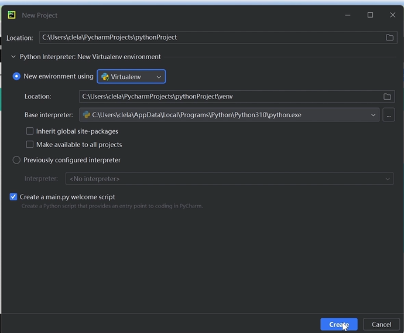
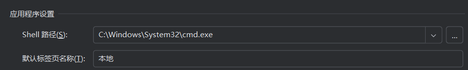

## 1. Python 安装

### 1.1 下载安装包

若没有所需版本，推荐官网下载安装包（次新版本）！

32/64 位根据 `此电脑-属性` 查看的系统情况选择。

### 1.2 安装 Python

安装程序启动，该页面选择 `add python.exe to PATH` 。

### 1.3 检查是否安装成功

`windows + R` 再输入 `cmd` 打开电脑命令提示符。

在黑框内直接输入 `python` 即可查看当前安装的 Python 版本。

## 2. Pycharm 安装

### 2.1 下载安装包

可以下载 community 版本免费使用。

### 2.2 安装 Pycharm

启动安装程序，推荐在 C 盘以外的盘安装。到选项这一步可以全选。

 

### 2.3 基础配置

打开 Pycharm，点击 `new project` 创建新项目，起一个合适的名字，当前用默认的虚拟环境创建。

> Windows 用户需要注意，在 `file-settings-tools-terminal` 中 `shell path` 需要修改为系统，不能用 `power shell` 。
>
> 

更详细教程参见：https://www.bilibili.com/video/BV1Gu411G7UA/?spm_id_from=333.1387.homepage.video_card.click&vd_source=a021c9fc952f9daa3eb4aca770bd967c

