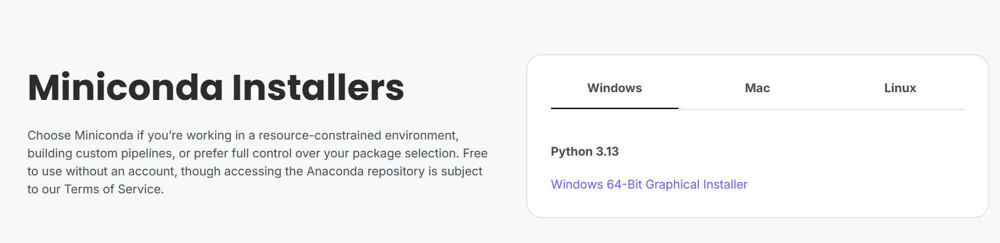
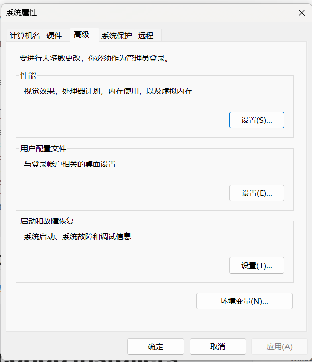
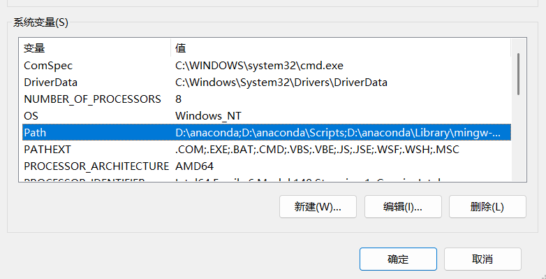
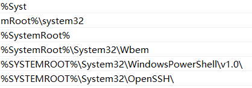
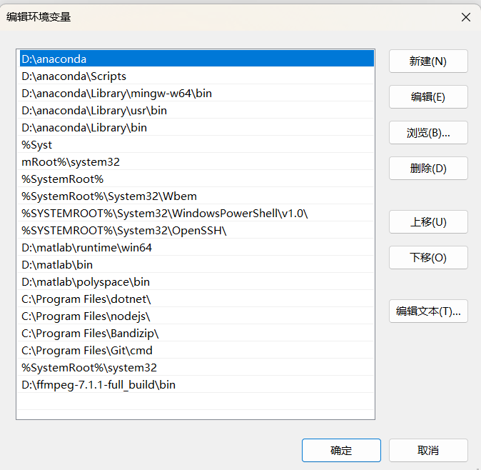
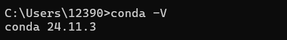
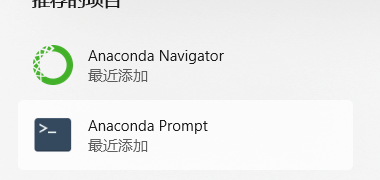

## 1. Anaconda 安装

- 官网下载安装包。

- 运行安装程序，选择想要安装到的 D 盘，需要勾选的地方默认不动即可。

## 2. 环境配置

- win 11 系统为例，打开 `设置-系统-系统信息-高级系统设置` ，找到右下角的环境变量。

- 进入环境变量，关注下半部分的系统变量，找到 `Path` 。

截图是已经配置好的情况，如果没有进行配置，`Path` 对应的 `值` 应该是系统默认，比如：

- 点击 `Path` 对应的 `值`  那一部分，右上角点击新建，将 Anaconda 的几个路径添加进去。

注意此处由于本人将 anaconda 安装在了 D 盘，因此路径是这样的，请根据自己实际的安装路径添加。

如果安装时默认安装在了 C 盘，那你的路径可能就是：`C:\users\anaconda3` ， `C:\users\anaconda3\Scripts` 等。

## 3. 验证 Anaconda 是否安装成功

`win + R` 输入 `cmd` ，命令行输入 `conda -V`。

## 4. 验证 Python 是否由 conda 配置成功

`win + R` 输入 `cmd` ，命令行输入 `python` 。

## 5. 配置国内下载源

由于 Anaconda 的下载源在国外，容易因为网络错误下载失败，因此可以增加国内的下载源，更加稳定。

- 打开 `Anaconda Prompt` 。

- 输入命令 `conda config --show channels` 查看当前下载源，应该为 `defaults` 。
- 通过命令 `conda config --add channels http://地址` 配置镜像下载源。配置成功后再次查看：

