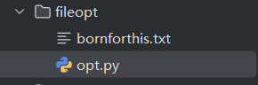

## 1. 手动创建文件

在任意地点创建一个 `.txt` 文件，只要保证后续 `.py` 文件和该 `.txt` 文件在同一目录即可。



文件内容如下：

```bash
1,2,3,4,5,6,7,8,9,0
0,9,8,7,6,5,4,3,2,1

python,c++,c,java,c#,html,css,javascript,php
社会，公正，民主，法治，文明，友善，和谐      
```

> 注意文件内容里的符号是中文/英文


## 2. 基础 open() 操作

`open()` 是默认读取模式，后面会系统讲解。

```python
file = open('bornforthis.txt')
```

> 注意：文件有打开就有关闭 `file.close()`


### 2.1 read()

用途：`read()`  可以直接读取打开的文件中的所有内容，如果需要指定字符数量，则用 `read(size)` 来指定。

::: tabs

@tab 不指定 size

```python
file = open('bornforthis.txt')
content = file.read()              # read 可以读取整个文件
print(content)
```

输出：

```python
1,2,3,4,5,6,7,8,9,0
0,9,8,7,6,5,4,3,2,1

python,c++,c,java,c#,html,css,javascript,php
绀句細锛屽叕姝ｏ紝姘戜富锛屾硶娌伙紝鏂囨槑锛屽弸鍠勶紝鍜岃皭
```

更改：

```python
file = open('bornforthis.txt', encoding='utf-8')
content = file.read()              # read 可以读取整个文件
print(content)

# -------output-------
1,2,3,4,5,6,7,8,9,0
0,9,8,7,6,5,4,3,2,1

python,c++,c,java,c#,html,css,javascript,php
社会，公正，民主，法治，文明，友善，和谐
```


@tab 指定 size

```python
file = open('bornforthis.txt', encoding='utf-8')
content = file.read(10)              # read 可以读取整个文件
print(content)

# -------output-------
1,2,3,4,5,
```

> size 将字母、数字、标点符号、换行、空格、汉字等都算进去，记为 1 个字符。

:::


####  Windows 读取乱码/编码报错

- 读取乱码

    

- 报编码错误，类似如下情况：

```python 5
Traceback (most recent call last):
  File "/Users/huangjiabao/Books/code.py", line 2, in <module>
    file.read()
  File "<frozen codecs>", line 322, in decode
UnicodeDecodeError: 'utf-8' codec can't decode byte 0xce in position 0: invalid continuation byte
```

**上述两个问题同时解决：**

通过在 open 函数中添加 `encoding='utf-8'` ，即可实现成功运行。

```python
file = open('bornforthis.txt', encoding='utf-8')
content = file.read()              # read 可以读取整个文件
print(content)
```


### 2.2 read() 优缺点

#### 2.2.1 优点

- 语句简单易用
- 便于一次性读取和处理小文件
- 无需逐行处理，`read()` 可以全部读取
- `read()` 返回的是字符串，方便对字符串进行操作
- 兼容性好

#### 2.2.2 缺点

- 处理大型文件时内存消耗过大，且容易卡死，因为该方法将整个文件一次性读取到内存中。

- 无法对文件内容分批处理

- 无法逐行处理数据

- 不适合流式读取

- 文件结束符（EOF）处理问题：使用该方法读取文件后，文件指针在文件末尾，如果需要继续读取文件时，需要手动重置文件指针到开始或指定位置。否则再次调用读取的方法可能会返回空值或抛出异常。

    ```python
    file = open('bornforthis.txt', encoding='utf-8')
    content = file.read()
    print(f'第一次读取：{content}')
    
    
    content = file.read()
    print(f'第二次读取：{content}')
    file.close()
    
    # -------output-------
    第一次读取：1,2,3,4,5,6,7,8,9,0
    0,9,8,7,6,5,4,3,2,1
    
    python,c++,c,java,c#,html,css,javascript,php
    社会，公正，民主，法治，文明，友善，和谐
    
    第二次读取：
    ```

    **解决方法1：** 再次 open 文件

    ```python
    file = open('bornforthis.txt', encoding='utf-8')
    content = file.read()
    print(f'第一次读取：{content}')
    file.close()
    
    file = open('bornforthis.txt', encoding='utf-8')
    content = file.read()
    print(f'第二次读取：{content}')
    file.close()
    
    # -------output-------
    第一次读取：1,2,3,4,5,6,7,8,9,0
    0,9,8,7,6,5,4,3,2,1
    
    python,c++,c,java,c#,html,css,javascript,php
    社会，公正，民主，法治，文明，友善，和谐
    
    第二次读取：1,2,3,4,5,6,7,8,9,0
    0,9,8,7,6,5,4,3,2,1
    
    python,c++,c,java,c#,html,css,javascript,php
    社会，公正，民主，法治，文明，友善，和谐
    ```

    **解决方法2：** 使用 seek 控制指针回到文件开头

    ```python
    file = open('bornforthis.txt', encoding='utf-8')
    content = file.read()
    print(f'第一次读取：{content}')
    
    file.seek(0)
    
    content = file.read()
    print(f'第二次读取：{content}')
    file.close()
    
    # -------output-------
    第一次读取：1,2,3,4,5,6,7,8,9,0
    0,9,8,7,6,5,4,3,2,1
    
    python,c++,c,java,c#,html,css,javascript,php
    社会，公正，民主，法治，文明，友善，和谐
    
    第二次读取：1,2,3,4,5,6,7,8,9,0
    0,9,8,7,6,5,4,3,2,1
    
    python,c++,c,java,c#,html,css,javascript,php
    社会，公正，民主，法治，文明，友善，和谐
    ```

    


### 2.3 read() 的分块读取

#### 2.3.1 手动分块读取

上文提到 `read()` 会一次性读取文件全部内容，导致内存占用过大或卡顿问题。

分块读取（chunked reading）是解决这一问题的常用方式。

```python
file = open('bornforthis.txt', encoding='utf-8')
content = file.read(10)
print(f'第一次读取：{content}')

content = file.read(10)
print(f'第二次读取：{content}')
file.close()

# -------output-------
第一次读取：1,2,3,4,5,
第二次读取：6,7,8,9,0
```


#### 2.3.2 任务：解决大文件读取问题

- **目标**：使用函数+循环的方式实现 read 的分块读取；

- **需求**：给你一个大文件，你要实现一个函数来分块读取文件所有内容。换句话说：实现的函数最后输出的内容是文件的全部内容，但是实际实现则是分块读取！

:::: tabs

@tab 循环+len() 

自动分块读取就是在手动读取的基础上添加循环，那么循环结束的标志如何确定。此处可以用 `len(content)` 小于 `size` 辅助确定。

```python
file = open('bornforthis.txt', encoding='utf-8')

i = 1
is_finished = False
while not is_finished:
    content = file.read(10)
    print(f'第{i}次读取：{content}')
    i += 1

    if len(content) < 10:
        is_finished = True

file.close()

# -------output-------
第1次读取：1,2,3,4,5,
第2次读取：6,7,8,9,0

第3次读取：0,9,8,7,6,
第4次读取：5,4,3,2,1

第5次读取：
python,c+
第6次读取：+,c,java,c
第7次读取：#,html,css
第8次读取：,javascrip
第9次读取：t,php
社会，公
第10次读取：正，民主，法治，文明
第11次读取：，友善，和谐
```

::: info 注意：空格/换行也算作 1 个字符，因此读取时需要注意格式

当在数字前增加 10 个空格时，第一次读取会将 10 个空格读取出来：

文件：

```bash
          1,2,3,4,5,6,7,8,9,0
0,9,8,7,6,5,4,3,2,1

python,c++,c,java,c#,html,css,javascript,php
社会，公正，民主，法治，文明，友善，和谐
```

读取结果：

```python
第1次读取：          
第2次读取：1,2,3,4,5,
第3次读取：6,7,8,9,0

第4次读取：0,9,8,7,6,
第5次读取：5,4,3,2,1

第6次读取：
python,c+
第7次读取：+,c,java,c
第8次读取：#,html,css
第9次读取：,javascrip
第10次读取：t,php
社会，公
第11次读取：正，民主，法治，文明
第12次读取：，友善，和谐

```

但是当我们再敲击回车换行时，pycharm 会自动默认原本第1行输入的 10 个空格不需要，第一行只保留 换行，将原本第一行的 10 个空格移到第二行的数字前，所以读取时，会**先读取换行，再读取空格** 。

文件内容：

```bash
          1,2,3,4,5,6,7,8,9,0
0,9,8,7,6,5,4,3,2,1

python,c++,c,java,c#,html,css,javascript,php
社会，公正，民主，法治，文明，友善，和谐

```

读取结果：

```python
第1次读取：
         
第2次读取： 1,2,3,4,5
第3次读取：,6,7,8,9,0
第4次读取：
0,9,8,7,6
第5次读取：,5,4,3,2,1
第6次读取：

python,c
第7次读取：++,c,java,
第8次读取：c#,html,cs
第9次读取：s,javascri
第10次读取：pt,php
社会，
第11次读取：公正，民主，法治，文
第12次读取：明，友善，和谐
```

:::


@tab 循环+检测读取内容

首先思考，当内容都读取完成后，读取出来的内容是什么？

```python
file = open('bornforthis.txt', encoding='utf-8')

content = file.read(10)
print(f'第 ? 次读取：{content}')
content = file.read(10)
print(f'第 ? 次读取：{content}')
content = file.read(10)
print(f'第 ? 次读取：{content}')
content = file.read(10)
print(f'第 ? 次读取：{content}')
content = file.read(10)
print(f'第 ? 次读取：{content}')
content = file.read(10)
print(f'第 ? 次读取：{content}')
content = file.read(10)
print(f'第 ? 次读取：{content}')
content = file.read(10)
print(f'第 ? 次读取：{content}')
content = file.read(10)
print(f'第 ? 次读取：{content}')
content = file.read(10)
print(f'第 ? 次读取：{content}')
content = file.read(10)
print(f'第 ? 次读取：{content}')
content = file.read(10)
print(f'第 ? 次读取：{content}')
content = file.read(10)
print(f'第 ? 次读取：{content}')
content = file.read(10)
print(f'第 ? 次读取：{content}')
print(f'无内容时读取的是：类型→{type(content)}, 是否有内容→{bool(content)}')

file.close()

# -------output-------
第 ? 次读取：1,2,3,4,5,
第 ? 次读取：6,7,8,9,0

第 ? 次读取：0,9,8,7,6,
第 ? 次读取：5,4,3,2,1

第 ? 次读取：
python,c+
第 ? 次读取：+,c,java,c
第 ? 次读取：#,html,css
第 ? 次读取：,javascrip
第 ? 次读取：t,php
社会，公
第 ? 次读取：正，民主，法治，文明
第 ? 次读取：，友善，和谐

第 ? 次读取：
第 ? 次读取：
第 ? 次读取：
无内容时读取的是：类型→<class 'str'>, 是否有内容→False

```

探究可知，没有内容可读取时，输出的是空字符串，且没有报错。

可以根据判断输出的内容是否为空字符串来界定边界。

```python
file = open('bornforthis.txt', encoding='utf-8')

content = ' '
while content:
    content = file.read(10)
    print(f'第xx次读取：{content}')

file.close()

# -------output-------
第xx次读取：1,2,3,4,5,
第xx次读取：6,7,8,9,0

第xx次读取：0,9,8,7,6,
第xx次读取：5,4,3,2,1

第xx次读取：
python,c+
第xx次读取：+,c,java,c
第xx次读取：#,html,css
第xx次读取：,javascrip
第xx次读取：t,php
社会，公
第xx次读取：正，民主，法治，文明
第xx次读取：，友善，和谐

第xx次读取：
```


::::


