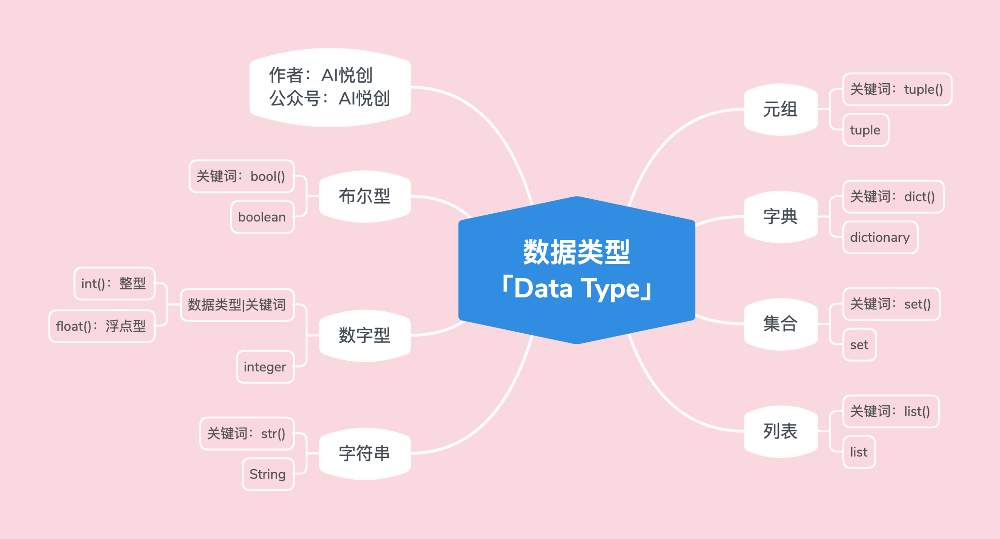

## 1.  数字型 [int, float]

::: code-tabs

@tab int

```Python
int_num = 1
t = type(int_num)
print(int_num)
print("int num type is:>>>", t)
print("直接检测数据类型，并输出：>>>", type(int_num))

#-------output-------
1
int num type is:>>> <class 'int'>
直接检测数据类型，并输出：>>> <class 'int'>
```

@tab float

```Python
float_num = 1.5
t = type(float_num)
print(float_num)
print("float num type is:>>>", t)
print("直接检测数据类型，并输出：>>>", type(float_num))

#-------output-------
1.5
float num type is:>>> <class 'float'>
直接检测数据类型，并输出：>>> <class 'float'>
```

:::

## 2. 字符串

```Python
string = "hello world"
t = type(string)
print(string)
print("string type is:>>>", t)
print("直接检测数据类型，并输出：>>>", type(string))

#-------output-------
hello world
string type is:>>> <class 'str'>
直接检测数据类型，并输出：>>> <class 'str'>
```

**字符串的性质**

1. 有序性

    - 从左到右的索引方法，下标是从 0 开始；
    - 从右到左的索引方法，下标是从 -1 开始；
    - 引号里面出现的每个字符都算一个下标，空格也算。

2. 不可变性

    不同的编程语言处理字符串的方式可能有所不同，但在大多数语言中，字符串都是不可变的，这意味着一旦创建，字符串的内容就不能改变。

    ::: important

    我们说的不可变，是指在代码运行过程中（如中间有 input ），不能对字符串修改、添加、删除之类的操作。

    :::

3. 任意字符

    - 键盘上可以输入的字符，都可以是字符串的元素；
    - 字符放到字符串中，都将成为字符串类型，即：里面的每一个元素都可以称为：子字符（子字符串）。

## 3. 列表

```Python
lst = ["Hello World", 1, 1.1, ("look", "book", 11), [12, "汉堡包"], True, False]
t = type(lst)

print(lst)
print("lst type is:>>>", t)

print("直接检测数据类型，并输出：>>>", type(lst))

#-------output-------
['Hello World', 1, 1.1, ('look', 'book', 11), [12, '汉堡包'], True, False]
lst type is:>>> <class 'list'>
直接检测数据类型，并输出：>>> <class 'list'>
```

**列表的性质**

1. 有序性

    - 从左到右的索引方法，下标是从 0 开始；

    - 从右到左的索引方法，下标是从 -1 开始；

    - 列表里的每个元素算一个；

        比如：lst = [“aiyuechuang”, 12];

        上面 lst 有两个元素，下标分别是：

        ​	`aiyuechuang` 是下标 0 （从左到右）， 也是下标 -2 （从右到左）；

        ​	`12` 是下标 1 （从左到右）， 也是下标 -1 （从右到左）；

2. 可变性：在程序运行过程中（如中间有 input ），列表可以修改、添加、删除；

3. 任意数据类型：**指的是 Python 所拥有的数据类型**。

## 4. 元组

```Python
tup = (1, 2, 3, 4, "aivc", 1.1, [1, 2, 3, 4])
t = type(tup)
print(tup)
print("tup type is: >>>", t)
print("直接检测数据类型，并输出：>>>", type(tup))

#-------output-------
(1, 2, 3, 4, 'aivc', 1.1, [1, 2, 3, 4])
tup type is: >>> <class 'tuple'>
直接检测数据类型，并输出：>>> <class 'tuple'>
```

**元组的性质**

1. 有序性

    - 从左到右的索引方法，下标是从 0 开始；

    - 从右到左的索引方法，下标是从 -1 开始；

    - 元组里的每个元素算一个；

        比如：`tup = ("aiyuechuang", 12)`;

        上面 `tup`有两个元素，下标分别是：

        ​	`aiyuechuang` 是下标 0 （从左到右）， 也是下标 -2 （从右到左）；

        ​	`12` 是下标 1 （从左到右）， 也是下标 -1 （从右到左）；

2. 不可变性

    元组被创建出来之后，就不能被改变；

    ::: important

    我们说的不可变，是指在代码运行过程中（如中间有 input ），不能对元组修改、添加、删除之类的操作。

    :::

3. 任意数据类型：**指的是 Python 所拥有的数据类型**。

    

## 5. 列表 or 元组

::: info 为什么有列表后还需要元组

:::

1. 如果储存的数据或者数量是**可变**的，比如社交平台上的一个日志功能，是统计一个用户在一周之内看了哪些用户的帖子，那么用**列表**更合适（需要一个仓库管理员）；
2. 如果储存的数据或者数量**不变**，比如一个系统/软件，用来返回一个地点的经纬度，然后直接传给用户看，那么选择**元组**更合适（不需要仓库管理员）。


