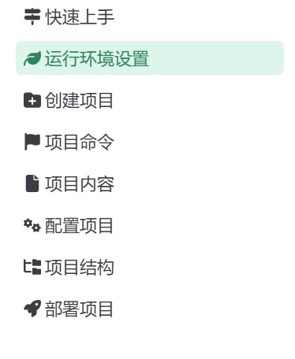
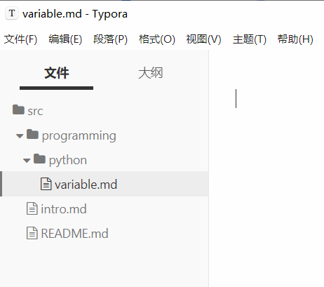
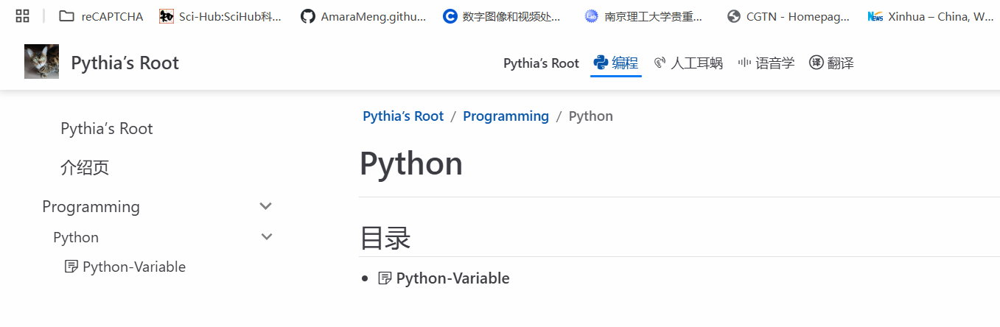
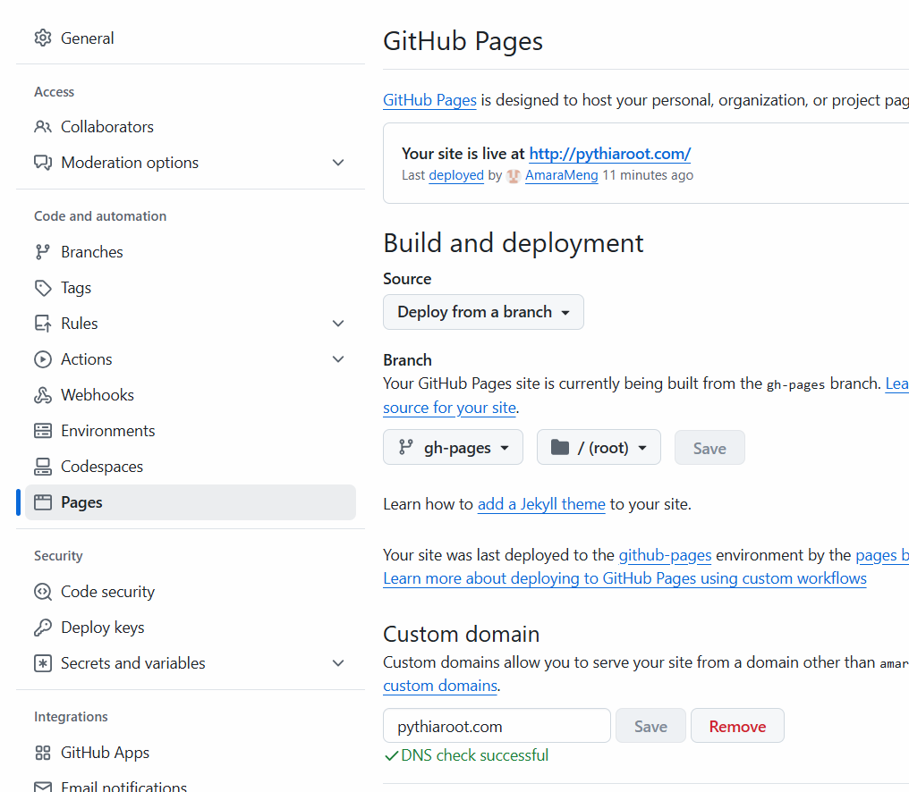
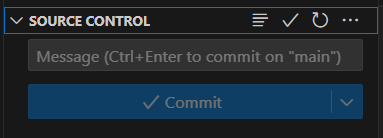
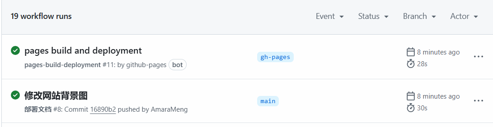

利用 VuePress Theme Hope 创建个人博客，主页点击 “快速上手” 查看参考教程。


按照 “快速上手” 中 “运行环境设置” 安装 VSCode、Node.js、pnpm（项目管理器）等。



## 1. 项目创建

### 1.1. 确定项目创建位置（确定本地路径）

选择合适的储存位置，建议纯英文路径，如：`D:\Static-Site-Build`。

### 1.2. 创建项目模板（网页模板）

打开终端 Termius，快捷键 ` Ctrl+L ` 创建新的 Local Terminal ，此时默认路径为 C 盘；

```bash
C:\Users\12390>
```

需要切换到刚刚确定的路径，即 `D:\Static-Site-Build`，由于要从 C 盘切换到 D 盘，需要先输入`d:`切换到 D 盘；

```bash
C:\Users\12390>d:
D:\>
```

然后输入 `cd+空格+文件夹` 文件夹为复制过来的路径 `D:\Static-Site-Build` 。

```bash
C:\Users\12390>d:
D:\>cd D:\Static-Site-Build
D:\Static-Site-Build>
```

切换路径完成后，按照教程，执行如下命令：

```bash
pnpm create vuepress-theme-hope my-docs
```

其中 my-docs 更改为自己要搭建的网站的域名，也是路径 `D:\Static-Site-Build`下的子文件名。

执行命令后，最终出现如下地址，`ctrl+点击local后链接`即可访问本地开发服务器。

```bash
  ➜  Local:   http://localhost:8080/
  ➜  Network: http://192.168.1.106:8080/
```

## 2. 网站配置信息修改

### 2.1. 网站本地运行

本地运行之前，必须进入到网站路径下，然后 Termius 中输入如下命令启动开发服务器，若退出，连续两次 `ctrl + c`。

```bash
pnpm run docs:dev
```

### 2.2. 网站信息修改

1. `crtl + L` 新建本地终端，进入到网站文件夹。
2. 网站文件夹下直接打开 VScode：命令行输入 `code .`（注意：code 和 点 之间有空格）

#### 2.2.1. title 和 description 修改

VScode 中 `src` 目录下 `config.ts` 文件中可以修改 title 和 description ，下文代码块中已经修改好了。

```bash
import { defineUserConfig } from "vuepress";
import theme from "./theme.js";
export default defineUserConfig({
  base: "/",
  lang: "zh-CN",
  title: "Pythia’s Root",
  description: " Snake my way to a content heart",
  theme,
  // 和 PWA 一起启用
  // shouldPrefetch: false,
});
```

#### 2.2.2. logo 修改

1. 把 logo 放入`网站路径/src/.vuepress/public/` 下。有几种方法可选：
    1. 直接放到 `public` 文件夹中；
    2. 也可以在 `public` 文件夹中新建文件夹做分类管理，方便后期增大体量进行维护。

2. VScode 中修改 `README.md` 中的 `heroImage:` 。

格式：（一开始的斜杠代表 `public` 文件夹）/ 文件夹名称（若有）/ 图片名称 . 后缀。

```bash
heroImage: /logo.jpg
```

#### 2.2.3. 网站背景图片修改

1. 将修改的图片放入到 public 文件夹中；
2. VScode 中 `README.md` 文件夹中修改，增加命令行（格式同头像上传，注意 / 前需要有空格）。

```bash
bgImage: /bgpic.jpg
```

#### 2.2.4. 增加网站搜索功能

1. 安装 search 包 （Termius）；

```bash
pnpm add -D @vuepress/plugin-search@next
```

2. VScode ，`theme.ts` 中 `plugins` 下输入如下命令；

```bash
// 在这里配置主题提供的插件
  plugins: {
    search: {
      maxSuggestions: 32,
      hotKeys: [],
      // 你的选项
      locales: {
        "/": {
          placeholder: "搜索",
        }
      }
    },
```

3. 重启本地开发；

4. 其他补充：

```bash
pnpm remove nodejs-jieba                   #卸载 nodejs-jieba 安装包
pnpm remove @vuepress/plugin-slimsearch    #卸载 slimsearch 安装包
```

#### 2.2.5. 增加网站评论功能

1. 需要借助第三方 Waline，进行到 ”绑定域名“ 步骤，教程如下：

    https://waline.js.org/guide/get-started/

2. 终端中，按照提示先安装 `@waline/client ` ，输入命令 `pnpm add -D @waline/client` 进行安装。
3. 网站相应文件夹下打开 VScode，`theme.ts`中找到 `comment` ，修改命令如下：

```typescript
// 启用之前需安装 @waline/client
// 警告: 这是一个仅供演示的测试服务，在生产环境中请自行部署并使用自己的服务！
comment: {      
  provider: "Waline",
    serverURL: "https://comments.pythiaroot.com/",      //此处为按照教程得到的自己网站评论的域名
    reaction: [
    'https://bornforthis.cn/Waline/tieba/tieba_agree.png',
    'https://bornforthis.cn/Waline/tieba/tieba_sunglasses.png',
    'https://bornforthis.cn/Waline/tieba/tieba_pick_nose.png',
    'https://bornforthis.cn/Waline/tieba/tieba_awkward.png',
    'https://bornforthis.cn/Waline/tieba/1f613.png',
    'https://bornforthis.cn/Waline/tieba/1f60f.png',
  ],
    comment: true, // 评论数统计
    pageview: true, // 浏览量统计
    noCopyright: true,
    dark: "auto",

    },
```

4. 在 github 上发布。
5. 若需要访问评论功能后台，浏览器输入 `网站域名/ui`，本网站为  comments.pythiaroot.com/ui

#### 2.2.6. 网站菜单栏修改

1. 选择自己菜单的小图标来源（此处使用阿里巴巴矢量图标库 https://www.iconfont.cn/  建立自己的项目 或 参与其他项目。）
2. 打开 VScode ， `theme.ts`文件中修改图标库链接，才能从阿里巴巴对应的图标库中调用。

```typescript
icon: {
  prefix: "iconfont icon-",
    assets: [
    //"https://bornforthis.cn/icon/iconfont.css", （别人共享的项目，此处注释掉）
    "//at.alicdn.com/t/c/font_4853525_e4k3iwioena.css"    //引号内为自己的图标库链接，图标库每次修改后，都需要更新链接，重新粘贴到此处。
  ],
```

3. `navbar.ts`文件中设置菜单，多个子集用 `children`，icon 部分从阿里巴巴图标库中复制代码， link 暂时没有用 # ，后续有文章时，放入 `src` 文件夹下，将 link 填入此处，注意若 link 到文件夹，则最后需要加 / ，如 `/demo/`。

```typescript
import { navbar } from "vuepress-theme-hope";

export default navbar([
  "/",
// {
//   text: "demo",
//   icon: "blog",
//   children: [
//     { text: "disable",  icon: "taozi", link: "/demo/disable.md" },
//     { text: "encrypt", icon: "exercise", link: "demo/encrypt.md" },
//     { text: "layout", icon: "blog", link: "demo/layout.md"},
//   ]
  
// },
{text: "编程", icon: "python", link: "#",},
{text: "人工耳蜗", icon: "rengongerwoshenqing", link: "#"},
{text: "语音学", icon: "shengboyuyinxiaoxi", link: "#"},
{text: "翻译", icon: "fanyi", link: "#"},
  
]);
```

#### 2.2.7. 上传文章

1. 所有文章都在 `src`，目录下，建议文件名都为英文。
2. 根据菜单建立 `programming/python` 文件夹，文件夹中文章内容后缀为 `.md`，在 Typora 中编辑，如下图所示：



**注意：** 如果文章没有更新到网站本地上，需要注意文章内容的后缀 `.md` 是否有。

3. Typora 中编辑文章，开始均需要输入 `--- + 回车`，内容如下：

```typescript
title: Python-Variable     //此处为文章标题，冒号后面都要加空格
date: 2025-03-11 14:48:19    //此处时间可到链接 https://autotime.bornforthis.cn/ 中生成
author: Ran
isOriginal: true
category:
    - static website          //文章分类
tag:
    - static website          //文章标签
icon: boke
sticky: false
star: false
article: false       //若不需要在主页中显示，则设置为false，若需要显示则为 ture
timeline: true
image: false
navbar: true
sidebarIcon: true

comment: true
lastUpdated: true
editLink: false
backToTop: true
toc: true
```


注：此处为信息 Frontmatter 配置，直接生成可用链接 https://autotime.bornforthis.cn/date-text 。

本地开发时，将网址 http://localhost:8080/static-website-blog/  修改为 http://localhost:8080/category/ 时，即可通过分类访问对应的文章。

4. 文章放置位置

VScode 中进入 `navbar.ts` 文件夹修改对应菜单下文章，如上述文章要放在菜单 `编程` 下的 `Python`中，则将 link 修改为：

```typescript
{text: "编程", icon: "python", link: "/programming/python/",},
```

注：python 后一定加上 `/ `才能显示如大纲一样的文章列表。



#### 2.2.8 网页菜单栏—侧边栏对应设置

自动生成侧边栏，侧边栏文章顺序默认按照数字升序排序。

1. 打开 VScode，在 `sidebar.ts` 文件内修改

```python
import { sidebar } from "vuepress-theme-hope";

export default sidebar({
    "/": "structure",                  //这是默认 src 文件夹下所有文件夹自动排序
    "/programming/": "structure",      //编程主菜单栏下自动排序
    "/sports/": "structure",           //运动主菜单栏下自动排序
    
}); 
```

2. 若需要菜单栏和文件夹/文件夹内的文章对应，则需要手动进行如下操作，优点是网站的侧边栏和文件夹对应，逻辑通畅。

```python
import { sidebar } from "vuepress-theme-hope";

export default sidebar({

  "/": [                                      // 在 src 文件夹下
     {
       text: "Python编程",                     // 名称为“Python编程”
       icon: "biancheng-01",                  // 图标
       prefix: "/programming/python",         // 对应的文件夹
       children: [
         "01-variable",                       // 第一篇文章
       ]
     },
     {
       text: "Web",                           
       icon: "site",
       prefix: "/static-website-blog/",
       children: [
         "article-typora",
       ]
     }
   ]
});
```


### 2.3. 修改网站配置未生效：

本身 vuepress 是支持热重载，意味着所作的任何修改，都会被自动刷新页面展示，不用手动关闭本地运行再重新启动。（不用重启）。如果修改后发现页面没有显示最新修改的效果，则需要如下操作：

1. 手动关闭本地运行 `CTRL + C`
2. 再次运行 `pnpm run docs : dev`
3. 出现场景（经验）：
    1. 修改侧边栏
    2. 新建文章
    3. 修改背景图片
    4. 等。。。


原则：不需要记，只需要知道出问题，如何操作。

经验会过时，原则不会

《羊皮卷》、《世界上最伟大的推销员》

## 3. 网站部署

指开发完成的网站从本地环境发布到服务器，使其能够通过互联网访问。

### 3.1. Github创建部署仓库

1. 创建 Github 特殊仓库，仓库命名格式 `AmaraMeng.github.io` 这样命名，Github 则会自动识别为部署静态网站的仓库。（类似实现了服务器功能）。
2. 配置 SSH，实现电脑和 Github 账号无需账号密码连接，教程如下：[https://bornforthis.cn/blog/2024/7month/git-ssh.html#_2-%E5%BC%80%E5%A7%8B](https://bornforthis.cn/blog/2024/7month/git-ssh.html#_2-开始)
3. 在项目路径下：

```bash
git add .   # 添加所有文件
git commit -m  "初始化网站文件"   # 说明这一次做了什么修改
```

### 3.2. 解析域名

将自己购买的域名和 github 的域名联系起来，在 github 上更新后自动发布到网站上，可以从其他渠道输入购买的域名即可访问网站。

1. github 中进入网站特殊仓库，`AmaraMeng.github.io` settings 选项中选中 pages ，Custom domain 中输入购买的域名并保存。



2. 登录阿里云，在 域名列表 中选择需要的域名，点击右侧 解析。添加记录，输入所需信息：
    1. 记录类型：CNAME；
    2. 主机记录：输入@ 或者 www（注释：www表示域名 www.pythiaroot.com；@表示主域名 pythiaroot.com）；
    3. 记录值：填写 github 域名，即`AmaraMeng.github.io` ，共需添加两条记录，分别为www.pythiaroot.com 和 pythiaroot.com。
3. 用VScode 在网站文件夹的 public 中新建 CNAME 文件，该文件中保存的是购买的域名 `pythiaroot.com`，便于下次 gitbub 部署时还需要重复解析域名这一步骤。

### 3.3. 将本地修改上传到 github 上并发布

1. VScode 点击左侧侧边栏第三项 Source Control ，输入修改内容并提交。



2. 在 github 对应的库里的 actions 中即可看到修改和发布情况。




## 4. 更新网站版本

1. 打开 VScode，找到 `package.json` 文件，找到第11行命令

```python
"docs:update-package": "pnpm dlx vp-update"
```

2. 打开终端 termius，在网站文件夹内，输入命令

```python
D:\Static-Site-Build\pythiaroot.com>pnpm dlx vp-update
```

