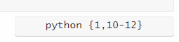
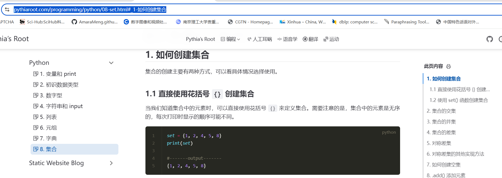

## 1. 标题编写

::: md-demo 标题示范

## 二级标题

### 三级标题

#### 四级标题

##### 五级标题

###### 六级标题

> 文章中不需要一级标题，一般从二级标题开始，因为前面 title 会被识别为文章标题，因此正文中的一级标题无法显示出来。

::: 

## 2. 代码块

::: md-demo 代码块示范

1. Markdown 语法

```python
# 一级标题
## 二级标题
### 三级标题
#### 四级标题
##### 五级标题
###### 六级标题
```

2. python 代码

```python
import random

number_to_guess = random.randint(1, 100)
guess_count = 0
max_tries = 10

print("猜数字游戏开始！尝试猜测一个在 1 到 100 之间的数字。你有 10 次机会。")

while guess_count < max_tries:
    guess_str = input("请输入你的猜测：")
    if not guess_str.isdigit():
        print("请输入一个有效数字！")
        continue
    guess = int(guess_str)
    guess_count += 1

    if guess < number_to_guess:
        print("太低了！再试一次。")
    elif guess > number_to_guess:
        print("太高了！再试一次。")
    else:
        print(f"恭喜！你猜对了数字 {number_to_guess}！你总共猜了 {guess_count} 次。")
        break
if guess != number_to_guess:
    print(f"很遗憾，你的机会已用完。正确的数字是 {number_to_guess}。")
```

3. java 代码

```java
public class HelloWorld {
    public static void main(String[] args) {
        // 输出 Hello Bornforthis 到控制台
        System.out.println("Hello, Bornforthis!");
    }
}
```

:::


## 3. 链接插入

::: md-demo 链接插入示范

`[链接名称](链接)`  此处为语法格式，按照此格式输入形成下文：

[Pythia网站](pythiaroot.com)

:::


## 4. 图片插入

::: md-demo 图片插入示范

`[图片描述](图片链接地址)`

图片直接复制即可，中括号 `[]`内修改图片描述即可。


:::


## 5. 有序序列

::: md-demo

1. 赵
2. 钱
3. 孙
    1. 你好赵
    2. 你好钱
    3. 你好孙
4. 李

:::

## 6. 无序序列

::: md-demo

- 大中华地区
    - 解放碑
    - 人民路
- 步行街
- 解放路

:::

## 7. 数学公式

### 7.1 基础演示

$$ xxx $$

$$
xxx
$$
可以通过在 `$ `之前使用`\`或在 `$` 字符后添加空格来完成转义

加空格显示为：$a = 1$ 是一个 Tex 方程，而 前面加上`\` 则只是一串字符，即 \$a = 1$。

### 7.2 行内公式语法

::: md-demo

Euler's identity $e^{i\pi}+1=0$ is a beautiful formula in $\mathbb{R}^2$.

:::

### 7.3 公式块语法

::: md-demo
$$
\frac{\partial^r}{\partial\omega^r}\left(\frac{y^{\omega}}{\omega}\right)
=\left(\frac{y^{\omega}}{\omega}\right)\left\{(\log y)^r+\sum_{i=1}^r\frac{(-1)^i r\cdots(r-i+1)(\log y)^{r-i}}{\omega^i}\right\}
$$


:::

## 8. 任务列表

::: md-demo

- [x] 计划 A
- [ ] 计划 B

:::


## 9. 选项卡

:::: md-demo

::: tabs

@tab 教学栗子

1234567890

```python
print ("1234567890")
```


@tab 实操

0987654321


@tab 作业

自己做一遍

:::

::::


## 10. 代码块分组

:::: md-demo

::: code-tabs

@tab 代码1

```python
print ("1234567890")
```

@tab 代码2

```python
a, b, c = 1, 2, 3
```

@tab 代码3

```python
a = 1
b = 2
print(a + b)
```


:::

::::


## 11. 行内代码

::: md-demo

`pnpm install XXXX`

:::


## 12. 提示容器

:::: md-demo


::: important

重要点。

:::


::: info 特殊信息！

信息点。

:::


::: note

注释点。

:::


::: tip

小技巧。

:::


::: warning

警告！

::: 


::: caution

危险！

:::


::: details

详情~

:::

::::


## 13. 高亮

::: md-demo

你好，==William==.

:::

## 14. 加密显示

::: md-demo

你好，!!William!!

:::

## 15. 自定义对齐

:::: md-demo

::: left

左对齐的内容

:::


::: center

居中的内容

:::


::: right

右对齐的内容

:::


::: justify

两端对齐的内容

:::


::::


## 16. 文章加密

::: md-demo

VScode 的 `theme.ts`文件中找到加密配置，代码如下：

```python {1,10-12}
 // 加密配置
  encrypt: {
    config: {
     
        // "/static-website-blog/": {
      //   hint: "Password: count-4-numbers",
      //   password: "1234",               
      // },
                                                   //上文注释掉部分为文件夹下所有文章加密
        "/programming/python/variable.html": {     //单个文章加密
        hint: "Password:count-4-numbers",
        password: "1234",
      }
    },
  },
```

:::


## 17. 代码块内部渲染

1. 代码内高亮、隐藏等，参见链接 https://shiki.tmrs.site/packages/transformers#transformernotationfocus

2. Typora 的代码块直接着重显示某几行代码：蓝色方框内，python 后花括号 {} 内输入代码行。

    

    

## 18. 文章内引用其他文章链接 or 引用同篇文章中的其他小节

### 18.1 引用其他文章链接

需要引用已经发布的文章的链接，如需要引用“如何创建集合”这一小节的内容，选中该小节，复制网页链接（https://pythiaroot.com/programming/python/08-set.html#_1-%E5%A6%82%E4%BD%95%E5%88%9B%E5%BB%BA%E9%9B%86%E5%90%88）到需要引用的地方。




### 18.1 同一篇文章内引用其他小节

同一篇文章不需要发布就可以直接引用，引用格式为 `[](链接)` ，需要打出此格式才能正确引用，类似图片粘贴，中括号`[]` 内为链接名称，（`(链接)`  部分为井号后的内容，但粘贴过来时需要加井号 #。例子如下


