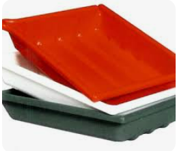
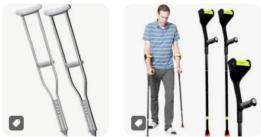

## 1. Love in the Time of Cholera — July 30

Cholera：西语的两个含义，霍乱，乱七八糟

爱是一个人的兵荒马乱

王熙凤

甄嬛传安小鸟

**CHAPTER ONE** 

 IT WAS INEVITABLE: the scent of **bitter almonds**  always reminded him of  the fate of **unrequited love** . 

- almond  /ˈɑː.mənd/ 杏仁

- bitter adj. 令人痛苦的；怨恨的；苦的

- unrequited   /ˌʌn.rɪˈkwaɪ.tɪd/ adj. （爱情）单相思的、得不到回报的

    requited love 彼此相爱 （requite v. 报答、回复）

- remind sb. of sth. 使某人想起某事

    remind sb. of doing sth. 提醒某人做过某事

    remind sb. to do sth. 提醒某人要去做某事

王熙凤

甄嬛传安小鸟

---

 Dr. Juvenal Urbino noticed it **as soon as** he entered the still **darkened** house where he **had hurried on an urgent call** to **attend a case** that for him had lost all urgency many years before. 

- as soon as 一…就…

    as soon as  + S+ V1, S+ V2

    = once S+ V1, S+ V2

    = the moment/ instant/ minute (that) S+ V1, S+ V2

    = Immediately/ Instantly/ Directly (that) S+ V1, S+ V2

    *S 可能是同一人，也可能是不同人 

     = Upon/On + V1ing, S + V2     （必为同一人）

    = S + had hardly/scarcely + pp. (V1)….when/before S + V2

    = Hardly/ Scarcely had S + pp. (V1)...when/before S + V2 

    = S + had no sooner + pp. (V1)...than S + V2

    = No sooner had S + pp. (V1)...than S + V2 

    倒装细节见链接：https://www.sunlightenglish.com/article_detail/as-soon-as

    更全的见这个链接：https://tw.elsaspeak.com/blog/as-soon-as-7297/

- darkened adj. 

    made dark, or without light 使变暗，遮暗

- had hurried on an urgent call

    on（介词）：这里表示“因为/由于”或“处于某种状态中”，类似“on duty”（在值班）的用法。

- attend a case 处理一个案子

    attend 出席，照顾

    e.g. A doctor attends a patient.

---

 The Antillean refugee Jeremiah de Saint-Amour, **disabled** war **veteran**,  photographer of children, and his most **sympathetic** opponent in chess, had escaped the torments of memory with the **aromatic** fumes of gold cyanide.

- veteran /ˈvet.ər.ən/ n. 退伍军人，老兵
- sympathetic /ˌsɪm.pəˈθet.ɪk/ adj. 有同情心的；引起共鸣的；支持的，赞同的
- aromatic /ˌær.əˈmæt.ɪk/ adj. 有香味的

---

 He found the corpse covered with a blanket on the **campaign cot** where he had always slept, and beside it was a **stool** with the **developing tray** he had used to **vaporize** the poison. 

- campaign cot 行军床

- stool 凳子

- developing tray 显影托盘

    

- vaporize  /ˈveɪ.pər.aɪz/ v. 使蒸发

---

On the floor, **tied** to a leg of the cot, **lay** the body of a black Great Dane with a snow-white chest, and next to him were  the **crutches**. 

- crutch /krʌtʃ/ n. T型拐杖

    

- 句子结构——倒装句

    地点状语前置，正常语序如下：

    The body of a black Great Dane with a snow-white chest lay on the floor, tied to a leg of the cot.

---

At one window **the splendor of dawn** was just beginning to illuminate the **stifling**, crowded room that served as both bedroom and laboratory, but there was enough light for him to recognize at once **the authority of death**.

- splendor adj. 壮丽；雄伟；辉煌
- stifling /ˈstaɪ.fəl.ɪŋ/ adj. 闷热的，热的令人窒息的；专制的，压制的
- the authority of death 死亡的震慑力

---

The other windows, as well as every other **chink** in the room, were **muffled with** rags or sealed with black cardboard, which  increased the oppressive heaviness.

