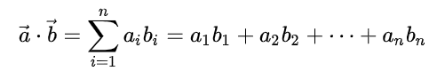

**EEG-based detection of the locus of auditory attention with convolutional neural networks**

## 摘要

In a multi-speaker scenario, the human auditory system is able to attend to one particular speaker of interest and ignore the others. It has been demonstrated that it is possible to use electroencephalography (EEG) signals to infer to which speaker someone is attending by relating the neural activity to the speech signals. However, classifying auditory attention within a short time interval remains the main challenge. We present a convolutional neural network-based approach to extract the locus of auditory attention (left/right) without knowledge of the speech envelopes. Our results show that it is possible to decode the locus of attention within 1–2 s, with a median accuracy of around 81%. These results are promising for neuro-steered noise suppression in hearing aids, in particular in scenarios where per-speaker envelopes are unavailable.

在多说话者场景中，人类的听觉系统能够专注于某个感兴趣的特定说话者并忽略其他人。研究表明，通过将神经活动与语音信号关联，可以利用脑电（EEG）信号推断听者正在关注哪位说话者。然而，在短时间隔内对听觉注意进行分类仍然是主要挑战。我们提出了一种基于卷积神经网络的方法，用来提取听觉注意的位置（左/右），且无需语音包络。结果显示，在1–2秒内解码注意位置是可行的，准确率约为81%。这些结果在助听设备中神经引导噪声抑制方面具有前景，尤其是在无法获取每位说话者语音包络的情况下。

## 1. Introduction

- **现象：**

    cocktail party problem 鸡尾酒会问题 （Cherry EC. 1953. Some experiments on the recognition of speech, with one and with two ears. The Journal of the Acoustical Society of America 25:975–979. DOI: https://doi.org/10.1121/1.1907229）

- **涉及人群：**

    听力损失人群和老年人更难分辨。

- **问题：**

    助听设备现有的策略是根据说话人音量或者听者面对的方向，应用效果不佳。

- **解决方法：**

    auditory attention decoding (AAD) 听觉注意力解码：神经活动   →解码   听觉注意

### 1.1 线性解码 VS 非线性解码问题

**线性解码** 

- **常见方法：**

    step 1: 刺激重建（用大脑活动解码并重建刺激语音的包络）;

    step 2：相关性分析（将重建的包络与原始刺激包络进行相关分析，相关性最高的那个包络属于所关注的说话者。）

    (O’Sullivan JA, Power AJ, Mesgarani N, Rajaram S, Foxe JJ, Shinn-Cunningham BG, Slaney M, Shamma SA, Lalor EC. 2015. Attentional selection in a cocktail party environment can be decoded from Single-Trial EEG. Cerebral Cortex 25:1697–1706. DOI: https://doi.org/10.1093/cercor/bht355, PMID: 24429136)

    ( Pasley BN, David SV, Mesgarani N, Flinker A, Shamma SA, Crone NE, Knight RT, Chang EF. 2012. Reconstructing speech from human auditory cortex. PLOS Biology 10:e1001251. DOI: https://doi.org/10.1371/ journal.pbio.1001251, PMID: 22303281)

- **其他方法：**

    forward modeling approach; 

    predicting EEG from the auditory stimulus;

    ( Akram S, Presacco A, Simon JZ, Shamma SA, Babadi B. 2016. Robust decoding of selective auditory attention from MEG in a competing-speaker environment via state-space modeling. NeuroImage 124:906–917. DOI: https://doi.org/10.1016/j.neuroimage.2015.09.048, PMID: 26436490) 

    (Alickovic E, Lunner T, Gustafsson F. 2016. A system identification approach to determining listening attention from EEG signals. 24th European Signal Processing Conference (EUSIPCO) 31–35.)

    canonical correlation analysis (CCA)-based methods;

    ( de Cheveigne´ A, Wong DDE, Di Liberto GM, Hjortkjær J, Slaney M, Lalor E. 2018. Decoding the auditory brain with canonical component analysis. NeuroImage 172:206–216. DOI: https://doi.org/10.1016/j.neuroimage. 2018.01.033, PMID: 29378317)

    Bayesian state-space modeling.

    ( Miran S, Akram S, Sheikhattar A, Simon JZ, Zhang T, Babadi B. 2018. Real-Time tracking of selective auditory attention from M/EEG: a bayesian filtering approach. Frontiers in Neuroscience 12:262. DOI: https://doi.org/ 10.3389/fnins.2018.00262, PMID: 29765298)

**非线性解码** 

人类听觉系统**非线性**特点（ Faure P, Korn H. 2001. Is there Chaos in the brain? I. concepts of nonlinear dynamics and methods of investigation. Comptes Rendus De l’Acade´mie Des Sciences- Series III- Sciences De La Vie 324:773–793. DOI: https://doi.org/10.1016/S0764-4469(01)01377-4）

因此采用非线性模型。

- feedforward neural network

    ( Taillez T, Kollmeier B, Meyer BT. 2017. Machine learning for decoding listeners’ attention from electroencephalography evoked by continuous speech. European Journal of Neuroscience 51:1234–1241. DOI: https://doi.org/10.1111/ejn.13790)

-  convolutional neural networks (CNNs) 方法

    优点：双说话人分离效果优于线性方法；

    缺点：长度10s 时效果好，准确率 75–85%，但时长缩短会导致性能下降。

### 1.2 决定窗时长问题

由于时长缩短会导致准确率下降，那么该如何平衡decision window 时长和准确率？

Geirnaert et al., 2020 提出了一种将两种属性结合成单一指标的方法，通过在具有稳健性约束的基于AAD的音量控制系统中寻找最佳权衡点，以最小化预期切换持续时间。通过对每次新的AAD决策使用较小的相对音量变化，可以提高对AAD错误的鲁棒性。

适合短时但准确率中等的需求。

### 1.3 位置问题

**任务转向：** 

重构的语音包络对应哪个语音刺激   →转向   语音刺激的空间位置。

**好处：** 无需干净语音。

**基础：** 

最近的研究（ Wolbers et al., 2011; Bednar and Lalor, 2018; Patel et al., 2018; O’Sullivan et al., 2019; Bednar and Lalor, 2020）表明，听觉注意的方向在神经上是编码的，这表明可能从 EEG 中解码出被注意声音的位置或轨迹。

一些使用脑磁图（MEG）的研究表明，尤其是α波段的功率可以被用来追踪听觉注意力的位置 (Frey et al., 2014; Wo¨stmann et al., 2016)。另有一项使用头皮脑电图（EEG）的研究发现β波段的功率与选择性注意力相关(Gao et al., 2017)。

**目的：**

通过 EEG 和 CNN 解码位置信息，再在分离出来的目的方向上应用 beamformer。

---

### 1.4 问题及补充知识

#### Q1：线性和非线性解码模型

introduction里面，提到了线性解码和非线性解码，为什么CNN 的方法就是非线性解码的，而前面提到的forward modeling approach等就是线性解码呢？跟模型本身有什么联系？

 

**Deepseek 回答：**

简单来说，判断一个解码方法是线性还是非线性，关键在于**模型是否能够学习和表示输入（e.g. EEG）与输出（e.g.注意方向）之间的非线性关系**。

下面我们详细拆解一下：

**线性解码模型**

论文中提到的stimulus reconstruction（刺激重建）、forward modeling（前向建模）等方法，其核心都是线性模型。

1. 工作原理：

\- 它们本质上都是在寻找一个**线性的权重过滤器**。

\- 例如，在刺激重建中，模型尝试找到一组权重，当这些权重与多通道、多时间延迟的EEG信号进行**加权求和（线性组合）**时，能够最好地重建出语音包络。

\- 这个过程可以用一个简单的公式表示：重建的包络 = W * EEG，其中 W 就是线性权重矩阵。

2. 为什么是“线性”的？

\- 因为整个变换过程是线性的。无论输入（EEG）多么复杂，输出（重建的包络或预测的EEG）始终是输入的**加权和**。

\- 它无法捕捉像“如果A通道的信号在频率X处出现峰值，同时B通道的信号在频率Y处出现谷值，那么这很可能表示注意在左侧”这样的**复杂、非加性的相互作用**。它只能学习固定的、加性的贡献。

3. 局限性：

\- 人脑的听觉处理系统是高度非线性的（如论文引言中引用的Faure & Korn, 2001）。线性模型是对这个复杂系统的一种**简化近似**，虽然有效，但可能无法捕捉到所有可用于解码注意的信息。

 

**非线性解码模型（本文的CNN方法）**

卷积神经网络是一种典型的**非线性模型**。

1. 工作原理与非线性激活函数：

\- CNN的关键组成部分是**激活函数**，如本文中使用的 ReLU。

\- ReLU 的函数是 f(x) = max(0, x)。这是一个非常简单的**非线性函数**。**只要模型中包含了任何一个非线性激活函数，整个模型就变成了非线性系统**。

\- 在卷积层之后使用ReLU，意味着模型不再是简单地对输入进行加权平均，而是可以进行**如果这个特征大于 0，就保留它；否则，就抑制它**这样的**非线性操作**。

2. 层次化特征提取：

\- CNN通过多层卷积和池化，能够**分层地**、自动地从原始EEG信号中提取特征。

\- 底层可能提取简单的时域或空域特征。

\- 高层则将这些简单特征组合成更复杂的、抽象的特征模式。

\- 这种**特征的层级组合本身就是高度非线性的**。线性模型无法实现这种层次化的特征学习和组合。

3. 模型的表达能力：

\- 正是由于这种非线性，CNN可以学习到输入数据中非常复杂和微妙的模式。

\- 在本文的任务中，这意味着CNN可以不依赖于语音包络，直接从EEG信号中发现与“注意左侧”或“注意右侧”相关的、可能遍布在不同频带、不同通道、不同时间点上的**复杂神经标记**。这些标记之间的关系可能是线性模型无法描述的。

 

**总结与类比**

 

| 特性              | 线性解码模型                                   | 非线性解码模型（CNN）                                |
| ----------------- | ---------------------------------------------- | ---------------------------------------------------- |
| **核心操作**      | 加权求和                                       | 卷积 + **非线性激活** + 池化                         |
| **输入-输出关系** | 直线/超平面                                    | 复杂的曲线/曲面                                      |
| **特征学习**      | 需要人工设计特征（如特定的频带）或隐含在权重中 | **自动学习**层次化的特征                             |
| **表达能力**      | 有限，只能捕捉线性关系                         | 强大，能捕捉复杂非线性关系                           |
| **好比**          | 用一条直线去拟合一堆数据点                     | 用一个非常灵活的函数去拟合数据点，能抓住更复杂的趋势 |

**结论：**

论文之所以强调CNN是非线性方法，是因为它的架构（特别是ReLU激活函数）赋予了它捕捉**大脑EEG信号与注意方向之间复杂、非线性映射关系**的能力。这使得它有可能超越线性模型的性能上限，特别是在数据量充足、模式复杂的情况下。这也解释了为什么CNN在**极短的决策窗口（1秒）** 内依然能保持高精度，因为它能更快地捕捉到那些具有判别性的、非线性的神经活动模式。

 

## 2. Materials and methods

### 2.1 数据来源

数据：16位正常听力被试的脑电数据

（ Das N, Biesmans W, Bertrand A, Francart T. 2016. The effect of head-related filtering and ear-specific decoding Bias on auditory attention detection. Journal of Neural Engineering 13:056014. DOI: https://doi.org/10.1088/ 1741-2560/13/5/056014, PMID: 27618842）

### 2.2 数据处理

**处理一：**

EEG 数据经过等波纹 FIR 带通滤波器（equiripple FIR bandpass filter）滤波，并已对其群延迟进行了补偿。

- 线性模型：被滤波在1到9赫兹之间（线性注意力解码的最佳频率范围）

- 非线性 CNN：1-32Hz  (Taillez et al., 2017)

效果：最大通带衰减为0.5dB，而阻带衰减在0–1Hz时为20dB，在32–64Hz时为15dB。

**处理二：下采样。**

- 线性模型：20Hz
- CNN：128Hz

**处理三：伪迹去除。**

the generic MWF-based removal algorithm（ Somers B, Francart T, Bertrand A. 2018. A generic EEG artifact removal algorithm based on the multi-channel Wiener filter. Journal of Neural Engineering 15:036007. DOI: https://doi.org/10.1088/1741-2552/aaac92, PMID: 29393057）

**处理四：从模型训练角度处理。**

1. **数据划分**： 将每个被试的数据分为训练集、验证集和测试集。

    验证集用于在训练过程中调整模型超参数、监控训练过程（如是否过拟合）和进行模型选择。模型不会直接从它这里学习。

    **“按被试进行划分”** ，意味着一个被试的所有数据只会出现在训练、验证或测试的其中一个集合中。这避免了**数据泄露**，即如果同一个被试的数据同时出现在训练和测试集中，模型可能会“记住”这个被试的特有模式而非学习通用的脑电模式，导致性能评估不真实。

2. **数据增强**： 使用滑动窗口从连续数据中生成大量数据段（样本），重合度 50%；减少信息丢失（避免重要的脑电事件e.g.一个事件相关电位 刚好被窗口边界切断）。

3. **数据标准化**： 对每个被试的数据进行缩放，以消除个体差异，但保留通道间的相对信息。

    这一步是针对训练集的操作。每个被试分开来计算。

    针对一个被试：

    - 10% trimmed mean of the squared samples：先对单个通道的所有数据点取平方值，之后去掉最高10%和最低10%的值，再计算这个通道的平均值（**排除异常值**）。
    - 因为是 64导的脑电数据，因此64个通道，有64个平均值。再取64个平均值的中位数。因为平均值最开始先取了平方值，因此再把中位数开平方，转换回振幅尺度，获得一个统一的标准化因子。
    - 用这位被试所有通道的数据点 **除** 这个标准化因子，来达到数据的归一化。

    

### 2.3 CNN

---

### 问题及补充知识

#### Q2：等均方根音强

The stimuli were set to **equal root-mean-square intensities** and were perceived as equally loud.

**Deepseek 回答：**

**均方根**是一个数学和统计学概念，英文是 **Root Mean Square**。它用来衡量一个变化信号的“有效值”或“平均功率”。

*   **为什么需要它？** 声波是一种交流信号，它的压力值在正值和负值之间快速振荡，其简单的算术平均值为零，这无法告诉我们声音的实际强度。
*   **RMS解决了什么问题？** RMS值能更准确地反映一个波动信号（如声音、电流）做功的能力或我们感知到的持续响度。

**计算RMS的步骤（以声压为例）：**
1.  **平方**： 将信号每个瞬间的样本值进行平方。这使得所有值都变为正数。
2.  **取平均**： 计算这些平方值在一段时间内的平均值。
3.  **开方根**： 对平均值进行平方根运算。

最终得到的结果就是**均方根值**，它代表了产生相同热功率的等效直流信号的值。对于声音来说，就是**声压的均方根值**。

 **equal root-mean-square intensities**  指的是：将两个或多个声音信号的均方根值调整到相同的水平。

换句话说，就是**让这些声音具有相同的平均能量或平均响度**。

>  为什么这个概念如此重要？
>
> 在比较不同声音时，如果我们只比较它们的**峰值**，可能会产生误导。一个峰值很高但持续时间很短的脉冲（如钉钉子声），其平均响度可能远低于一个峰值较低但持续不断的信号（如空调声）。

**“等均方根音强”确保了比较的公平性，因为它比较的是声音的整体能量，而不是瞬间的峰值。**

主要应用场景：

1.  **音频制作与母带处理**：
    *   当混音师将多首歌曲制作成一张专辑时，他们会使用“等均方根”响度来匹配所有歌曲的整体音量。这样听众在切换歌曲时就不会觉得某首突然特别响或特别轻。
    *   在电视广告中，法规经常要求广告的响度必须与节目的响度一致，使用的就是基于RMS的响度标准（如LUFS）。

2.  **心理声学实验**：
    *   在科学研究中，如果想比较不同频率或音色对人耳的影响，必须首先将这些声音在“等均方根音强”下进行匹配。这样才能确保被试者反应的差异是由于频率或音色本身引起的，而不是因为某个声音客观上更响。

3.  **电子设备和扬声器测试**：
    *   在测试音箱的频率响应时，工程师会输入不同频率的信号，但确保所有频率的RMS电平是相同的。这样，音箱输出的差异就能真实反映其在不同频率上的性能，而不是输入信号的强度差异。

**总结**

**等均方根音强**是一个核心概念，它意味着**将不同声音的平均能量（或持续响度）标准化到同一水平**。这样做是为了在各种音频应用中进行公平、科学和一致的比较与控制，避免被短暂的峰值所误导。

---

#### Q3：头相关传输函数（HRTF）滤波

head-related transfer function (HRTF) filtering (simulating sound coming from ± 90deg)

**Deepseek 回答：**

好的，这是一个非常专业的概念。我们来详细解释一下 **“头相关传输函数（HRTF）滤波（模拟来自±90度的声音）”**。

这其实是现代3D音频技术的核心。我们可以把它拆解成几个部分来理解。

1. **核心概念：头相关传输函数（HRTF）是什么？**

简单来说，**HRTF是一组数学滤镜，它描述了你的头部、躯干、尤其是外耳（耳廓）如何改变从空间中某个点发出的声音，然后才传入你的耳道。**

当一个声音到达你的身体时，会发生以下几件事：

*   **头部阴影效应**： 如果声音来自你的右侧，它到达右耳的路程更短、更直接。而到达左耳时，需要绕过你的头部，这会造成：
    *   **时间差**： 声音稍晚一点到达左耳。
    *   **强度差**： 由于头部的阻挡，左耳听到的声音音量会小一些（尤其是高频声音）。
*   **耳廓效应**： 这是最关键的一步。你的耳廓形状非常复杂，声音在进入耳道前会撞击耳廓的不同褶皱并产生反射和共振。这些微小的反射与原始声音混合，极大地改变了声音的频率特性。**你的大脑正是通过解读这些独特的“频谱线索”来判断声音的高度和前后位置。**

**HRTF就是所有这些声学效应的一个总和的数学模型。** 它为每个耳朵都提供了一套独特的滤波参数。

2. **HRTF滤波是什么？**

**HRTF滤波**，就是将一个普通的单声道音频信号（比如一个枪声或一个人的说话声），通过一个数字信号处理过程，分别与**左耳HRTF**和**右耳HRTF**进行卷积运算。

**处理过程如下：**

1.  你有一个单声道声音源，以及一个目标位置（例如，正右方90度）。
2.  计算机调用对应于“正右方90度”这个位置的HRTF数据。这个数据包含两套滤波器系数：一套给左耳，一套给右耳。
3.  原始的单声道声音信号分别通过这两套滤波器。
4.  输出结果是两个信号：一个给左耳耳机，一个给右耳耳机。

当你的大脑处理这两个经过“加工”的信号时，它会接收到：
*   **右耳信号**： 相对原始，音量较大。
*   **左耳信号**： 包含了由头部阻挡造成的延迟、衰减和频谱变化。

大脑会立刻识别出这些差异，并得出结论：**“这个声音来自我的右边！”**

3. **模拟来自±90度的声音**

现在我们聚焦于 **±90度** 这个特定场景。

*   **+90度**： 通常是正右方。
*   **-90度**： 通常是正左方。

**这是HRTF效果最显著、最容易感知的位置之一。** 原因如下：

*   **最大化的双耳差异**： 当声源位于正侧方时，它到达一侧耳朵是直接的，而到达另一侧耳朵则需要绕过整个头部。这时，**时间差** 和 **强度差** 都达到了最大值。
*   **典型的滤波效果**：
    *  对于**对侧耳朵**（声源在右，则左耳为对侧），由于头部阴影效应，**高频部分（特别是2000Hz以上）会被显著衰减**，听起来像是被“过滤”了，更闷。
    *  对于**同侧耳朵**，声音则相对完整。

所以，当工程师说他们在进行“HRTF滤波（模拟来自±90度的声音）”时，他们就是在**刻意地、人为地**为声音信号施加这种最强的双耳不对称性，从而在你的脑中创造一个坚不可摧的、来自正左或正右的听觉图像。

**应用场景**

*   **虚拟现实（VR）和增强现实（AR）**： 让声音物体与视觉物体在3D空间中的位置匹配，极大增强沉浸感。
*   **3D音频耳机**： 在音乐、电影和游戏中，创造出超越传统立体声的环绕声场。
*   **科研和听力诊断**： 用于研究空间听觉机制。

**总结**

**头相关传输函数（HRTF）滤波（模拟来自±90度的声音）**，其核心流程是：

**普通单声道声音 → 加载对应于正侧方（±90度）的HRTF滤波器 → 分别生成带有强烈时间差、强度差和频谱差异的左、右耳信号 → 通过耳机回放 → 大脑被“欺骗”，清晰地感知到声音来自正左或正右方。**

这是一种利用人类听觉生理和心理声学原理，通过数字信号处理来精准还原或创造三维声场的关键技术。

---

#### Q4：等波纹FIR带通滤波器和群延迟

 The EEG data was filtered with an equiripple FIR bandpass filter and its group delay was compensated for.

**Deepseek 回答：**

好的，这句话描述了脑电图数据处理中一个非常专业和重要的步骤。我们来逐词分解并详细解释它的含义。

这句话的核心在于两个操作：

- **使用等波纹FIR带通滤波器对EEG数据进行滤波。**

- **对其群延迟进行补偿。**

    

1. 使用等波纹FIR带通滤波器进行滤波

*   **EEG数据**： 脑电图信号，记录了大脑的电活动。它通常包含我们感兴趣的频率（如Alpha波：8-13 Hz）以及很多不感兴趣的噪声（如工频干扰、肌电信号、基线漂移等）。
*   **滤波**： 一个“筛选”过程，目的是**保留特定频率范围**的信号，同时**去除其他频率**的成分。
*   **带通滤波器**： 一种只允许某个特定频率带宽通过的滤波器。例如，一个0.5-40 Hz的带通滤波器会保留Delta、Theta、Alpha、Beta波，而滤除极低频的漂移和极高频的噪声。
*   **FIR滤波器**： 这是一种数字滤波器的类型。
    *   **优点**： 它是**线性相位**的，这意味着滤波器对所有频率成分造成的**时间延迟是相同的**。这个特性至关重要，是理解第二点的基础。
*   **等波纹**： 这是FIR滤波器的一种设计方法。它试图在通带和阻带之间进行一种优化：
    *   **通带**： 想要保留的频率范围。等波纹设计确保通带内的信号幅度波动非常小。
    *   **阻带**： 想要抑制的频率范围。等波纹设计确保阻带内的信号被最大限度地抑制。
    *   简单说，**等波纹设计能在通带和阻带性能之间取得一个很好的、可控的平衡**，是一种非常优秀和常用的滤波器设计方法。

**所以，第一部分的意思是：** 我们使用了一种性能优良、设计精良的数字滤波器，对原始的EEG数据进行了清理，只保留了研究所需的频率成分。

2. 群延迟补偿

这是最关键也最难理解的部分。

*   **群延迟**： 简单来说，它就是**信号通过滤波器后所产生的“时间延迟”**。想象一下，原始信号进入滤波器，处理后的信号要“晚一点”才出来。这个“晚一点”的时间就是群延迟。
*   **FIR滤波器的线性相位特性**： 正如前面所说，FIR滤波器的一个巨大优点是，它对所有频率造成的**群延迟是一个常数**。也就是说，一个包含1Hz和10Hz成分的复合信号，经过滤波器后，这两个成分的“迟到”时间是相同的，因此它们之间的相对时间关系保持不变，信号波形不会失真。
*   **为什么需要补偿？**
    *   即使信号波形没有失真，但这个**固定的时间延迟是真实存在的**。在数据采集时间轴上，滤波后的信号整体向后偏移了一段。
    *   对于需要**精确时间定位**的分析来说，这是一个严重问题。例如，在事件相关电位研究中，我们需要精确测量一个刺激出现后特定脑电成分（如P300）的峰值出现在多少毫秒。如果数据因为滤波而延迟了50毫秒，那么所有的时间测量都会出错。

*   **如何补偿？**
    *   既然延迟是固定且已知的（可以通过滤波器的阶数计算出来，通常是 `N/2` 个样本点，其中 `N` 是滤波器阶数），解决方法就很直接了：
    *   **将滤波后的信号在时间轴上向前移动，移动的量正好等于群延迟的量。**
    *   在数字信号处理中，这通常是通过截取信号中间一段稳定部分，或者直接对信号进行 `circular shift` 来实现的。

**所以，第二部分的意思是：** 我们识别并校正了由滤波过程引入的固定时间延迟，确保处理后的EEG数据在时间轴上与原始事件（如视觉/听觉刺激）精确对齐。

**总结**

整句话 **“The EEG data was filtered with an equiripple FIR bandpass filter and its group delay was compensated for.”** 描述了一个专业、严谨的EEG数据预处理流程：

1.  **滤波**： 使用一种**高性能（等波纹）、不会造成波形失真（FIR线性相位）** 的带通滤波器来净化和聚焦EEG信号。
2.  **补偿**： 主动**校正了该滤波器引入的固定时间延迟**，从而保证了后续分析中**时间信息的精确性**。

这通常是在进行事件相关电位或任何其他需要精确时序分析的研究前，必须执行的标准步骤。

---

#### Q5：通带衰减和阻带衰减

In both cases, the maximal bandpass attenuation was 0.5dB while the stopband attenuation was 20dB (at 0–1Hz) and15dB (at 32–64Hz).

**Deepseek 回答：**

- **通带最大衰减： 0.5 dB**
    - **通带** 是我们想要保留的频率范围（比如 1-32 Hz）。
    - **0.5 dB 衰减** 意味着在这个频率范围内，信号的强度最多只会被非常轻微地减弱。
    - **重要性**： 这确保了所有我们感兴趣的脑电波（如Alpha， Beta波）的振幅在通过滤波器后几乎保持不变，避免了有用的信号被过度削弱。这是一个**高性能滤波器**的标志。
- **阻带衰减： 20 dB (在 0–1 Hz) 和 15 dB (在 32–64 Hz)**
    - **阻带** 是我们想要极力抑制的频率范围。
    - **0-1 Hz 阻带**： 这个范围通常包含非常缓慢的**基线漂移**（如由出汗或身体运动引起）。**20 dB 衰减** 意味着这些频率的噪声强度被减弱到原来的约1/10（`10^(-20/20) = 0.1`）。这有效地去除了低频漂移。
    - **32-64 Hz 阻带**： 这个范围包含高频噪声，如**肌电信号**（肌肉活动）和其他环境干扰。**15 dB 衰减** 意味着这些高频噪声被减弱到原来的约1/5.6（`10^(-15/20) ≈ 0.18`）。

**简单比喻**： 这个滤波器就像一个非常精密的筛子：

- **通带**： 筛孔大小均匀，想要的颗粒（脑电信号）几乎全部通过（只损失0.5%）。
- **阻带**： 筛子边缘密封严密，能有效阻挡灰尘（低频漂移）和大颗粒杂质（高频噪声）。

---

#### Q6：降采样和奈奎斯特定理

After the bandpass filtering, the EEG data was down sampled to 20Hz (linear model) and128Hz (CNN).

**Deepseek 回答：**

- **什么是降采样？**
    降低数据的采样率。例如，如果原始数据以500 Hz采集，降采样到128 Hz意味着我们每秒只保留128个数据点，丢弃多余的点。
- **为什么这么做？**
    1. **减少计算负担**： 更低的数据量意味着更快的处理速度和更小的存储空间。
    2. **匹配信号的有效信息**： 根据奈奎斯特定理，要无失真地还原一个信号，采样率需要至少是信号最高频率的2倍。经过1-32 Hz的滤波后，信号的最高有效频率是32 Hz。因此：
        - **128 Hz** 对于32 Hz的信号是绰绰有余的（128 > 2 * 32）。
        - **20 Hz** 则是一个更具攻击性的降采样，可能用于只关注非常低频成分的模型。
- **为什么对不同模型使用不同采样率？**
    - **线性模型**： 可能只关注非常缓慢、稳定的趋势（如慢皮层电位），20 Hz的采样率足以捕捉这些变化，同时极大简化了模型。
    - **CNN**： 卷积神经网络能够学习更复杂、更细微的时间模式。保留更高的128 Hz采样率可以为CNN提供更丰富的时间细节，以提升其性能。

---

#### Q7：伪迹去除

Artifacts were removed with the generic MWF-based removal algorithm described in Somers et al., 2018.

**Deepseek 回答：**

- **伪迹**： 指EEG记录中非脑源性的污染，例如：
    - **眼电伪迹**： 眨眼、眼球运动。
    - **肌电伪迹**： 头部、颈部、下巴的肌肉紧张。
    - **心电伪迹**： 心跳。
- **MWF算法**：
    - MWF代表 **多变量维纳滤波**。
    - 它是一种先进的空间滤波技术，可以**同时分离和去除多种类型的伪迹**，而不需要像传统方法（如ICA）那样手动标记噪声成分。
    - **工作原理**： 它利用多个EEG通道的数据，通过数学方法计算出最优的滤波器，能够最好地将干净的脑电信号与伪迹分离开来。它被认为是高效、自动化的伪迹去除方法。

**引用 Somers et al., 2018** 表明研究者遵循了一个已发表的、经过验证的标准方法，增加了研究的可重复性和可靠性。

---

#### Q8：CNN 网络+梯度消失

**Deepseek 回答：**

原文这段话定义了 CNN 的四个核心部分：
1.  **卷积层（convolutional layers）**： 特征提取器，寻找局部模式。
2.  **非线性激活函数（nonlinear activation functions）**： 引入复杂性，使网络能够学习非线性关系。
3.  **池化层（pooling layers）**： 对数据进行降维和压缩，增强鲁棒性。
4.  **优化过程**： 通过最小化损失函数来训练网络，找到最佳参数。

---

详细解释（结合EEG应用）

1. **卷积层**

> “In convolutional layers, one or more convolutional filters slide over the data to extract local data features.”

* **核心思想**： **局部连接**和**权重共享**。与传统神经网络将每个输入神经元连接到每个输出神经元不同，卷积层使用一个小的**滤波器**在输入数据上滑动，只关注局部区域。

*   **“滑动”过程（卷积操作）**：
    
    * 滤波器（也叫“核”）是一个小的权重矩阵（例如 3x3 或 1x5）。
    
    * 它从输入数据的左上角开始，计算滤波器与当前覆盖的数据点的**点积**，产生一个输出值。
    
        
    
        
    
    *   然后向右移动一个步长，重复此过程，直到覆盖整个输入。
    
*   **提取什么特征？**
    
    *   在图像中： 初级滤波器可能检测边缘、角落；深层滤波器可能检测眼睛、鼻子等复杂图案。
    *   **在EEG中**：
        *   如果一个滤波器在**时间维度**上滑动，它可能学会检测特定的波形，如**棘波** 或**α波的振荡周期**。
        *   如果一个滤波器在**空间维度**（不同的EEG通道）上滑动，它可能学会检测特定脑区之间的**协同活动模式**。
        *   如果一个滤波器在**时间和空间维度**上同时滑动（2D卷积），它可以检测时空模式。

2. **非线性激活函数**

> “...a series of convolutional layers and nonlinear activation functions...”

*   **作用**： 在卷积操作之后立即引入**非线性变换**。
*   **为什么需要它？** 如果没有非线性函数，无论堆叠多少层卷积，整个网络在数学上等价于一个单层线性模型，无法学习复杂模式。非线性激活函数赋予了网络“分层次组合简单特征形成复杂特征”的能力。
*   **常见例子**： ReLU。它将所有负值置为零，保留正值。这增加了网络的稀疏性，并有助于解决梯度消失问题。

> ## 补充：梯度消失
>
> 好的，这是一个在深度学习领域非常核心且重要的概念——“梯度消失”。
>
> 我们来用一个通俗易懂的方式解释它。
>
> ### 核心思想：从“连锁反应”说起
>
> 想象一下，你正在训练一个非常深的神经网络，比如有100层。训练的过程就像是在纠正一个由100个环节串联起来的复杂机器的错误。每个环节（网络层）都需要根据最终产品的总误差（**损失函数**）来进行微调。
>
> **“梯度”**，在这里可以理解为 **“每个环节应该调整的方向和力度”**。这个信息是从最终的总误差那里，**一层一层地反向传递回去**的，这个过程就是**反向传播**。
>
> ### 什么是“梯度消失”？
>
> **梯度消失** 就是指：在反向传播的过程中，当这个“调整指令”（梯度）从网络的深层向浅层传递时，它的**强度会变得越来越弱**。等传到最开始的几层时，这个指令已经微弱到几乎为零了。
>
> 结果就是：
>
> *   **网络的深层** 得到了强烈的调整信号，学习得很好，变化很快。
> *   **网络的浅层** 几乎接收不到任何有效的调整信号，参数停滞不前，就像“学不会”一样。
>
> **这就好比一个命令从总司令（输出层）下达给一线士兵（输入层）：**
>
> *   **总司令** 说：“我们需要前进100米！”
> *   **命令传到军长** 那里，变成了“前进50米”。
> *   **传到师长** 那里，变成了“前进10米”。
> *   **传到团长** 那里，变成了“前进1米”。
> *   **等传到排长和士兵** 那里，命令已经变成了“前进0.001米”。
> *   **士兵心想：“这动了跟没动有啥区别？”于是基本保持原地不动。**
>
> 最终，只有高级军官（网络深层）在执行命令，而真正执行任务的一线士兵（网络浅层）却没有得到有效的指令。整个系统（网络）无法被有效地协同训练。
>
> ### 为什么会发生梯度消失？
>
> 主要原因与神经网络中使用的**激活函数**和**链式法则**有关。
>
> 1.  **链式法则**： 在反向传播中，计算浅层梯度需要将后面所有层的梯度**连乘**起来。
>     `梯度(浅层) = 梯度(深层) × 权重 × 激活函数的导数 × 权重 × 激活函数的导数 × ...`
>
> 2.  **激活函数的导数问题**： 早期常用的激活函数（如Sigmoid、Tanh）存在一个致命弱点——**它们的导数值总是小于1，而且在大部分区域都非常接近于0**。
>     *   例如，Sigmoid函数的导数最大值也只有0.25。
>
> 3.  **连乘效应**： 当很多个小于1的数连乘在一起时，结果会以**指数级速度**迅速趋近于零。
>     *   就像 `0.5 × 0.5 × 0.5 × ...`，乘不了几次，结果就变得微乎其微了。
>
> 因此，在深层的网络中，由于一连串的小数连乘，浅层的梯度自然就“消失”了。
>
> ### 梯度消失带来的后果
>
> 1.  **训练停滞**： 网络的前几层参数几乎不更新，导致它们无法学习到有用的特征。对于CNN处理EEG来说，这可能意味着网络无法从原始的、底层的脑电信号中提取到基本的波形特征。
> 2.  **性能瓶颈**： 网络的深度无法发挥优势。理论上更深的网络能学习更复杂的特征，但梯度消失使得增加深度变得徒劳，甚至有害。
> 3.  **模型收敛缓慢**： 整个网络的收敛速度被最慢的（浅层）部分所拖累。
>
> ### 如何解决梯度消失问题？
>
> 现代深度学习通过以下几种主要方式有效地缓解了这个问题：
>
> 1.  **使用ReLU及其变体作为激活函数**
>     *   **ReLU函数**： 当输入为正时，导数为1；输入为负时，导数为0。
>     *   **关键优势**： 当神经元处于激活状态（输入>0）时，它的导数是**1**。在链式法则中，乘以1不会削弱梯度！这极大地缓解了梯度消失问题，使得训练非常深的网络成为可能。
>     *   **变体**： Leaky ReLU, PReLU等，解决了ReLU在负半区导数为零的“神经元死亡”问题。
>
> 2.  **使用残差网络等特殊结构**
>     *   残差网络引入了“快捷连接”或“跳跃连接”，它允许梯度直接“跳过”一些层进行传播。
>     *   这相当于在“总司令”和“一线士兵”之间建立了一条直通热线，确保重要的指令不会被中间层稀释掉。
>
> 3.  **使用批量归一化等技术**
>     *   批量归一化通过规范化每一层的输入，使得数据分布更稳定，这也有助于让梯度的传播更加顺畅。
>
> ### 总结
>
> **梯度消失**是深度神经网络训练中的一个经典难题，它源于反向传播中梯度的**链式连乘效应**和某些**激活函数的饱和性**，导致网络浅层无法得到有效的学习信号。
>
> 解决这个问题的关键是：
>
> *   **换用梯度友好的激活函数（如ReLU）**。
> *   **改进网络结构（如ResNet）**。
>

---

3. **池化层**

> “...typically followed by pooling layers. Pooling layers then aggregate the output by computing, for example, the mean.”

*   **作用**： **降维**和**保持平移不变性**。
*   **如何工作**： 它在一个小窗口（例如 2x2）上对卷积层的输出进行汇总。
    *   **最大池化**： 取窗口内的最大值。这告诉网络：“只要这个特征在区域内出现了，就保留它，不管具体位置。”
    *   **平均池化**： 取窗口内的平均值，如文中所述。这是一种更平滑的降维方式。
*   **在EEG中的好处**：
    *   **减少计算量**： 降低数据维度。
    *   **增加鲁棒性**： 使网络对特征的微小时间偏移（比如一个脑电峰值稍微早出现或晚出现几毫秒）不那么敏感。

#### 4. 优化过程

> “Similar to other types of neural networks, a CNN is optimized by minimizing a loss function, and the optimal parameters are estimated with an optimization algorithm such as stochastic gradient descent.”

这是网络“学习”的过程。

*   **损失函数**： 一个衡量模型预测值与真实标签之间差距的函数。例如，在分类任务中，交叉熵损失是常用的。网络的目标就是让这个损失值尽可能小。
*   **随机梯度下降**： 一种优化算法。
    1.  网络对一批数据进行预测，并计算损失。
    2.  计算损失相对于所有滤波器权重（参数）的**梯度**。梯度指明了“为了减小损失，权重应该向哪个方向调整”。
    3.  根据梯度的反方向，以一个小步长（**学习率**）更新所有权重。
    4.  重复这个过程成千上万次，直到损失收敛到一个较小的值。

---

### 总结：一个形象的比喻

想象一下教一个CNN识别EEG中的癫痫发作：

1.  **卷积层（特征侦探）**：
    *   第一组侦探（滤波器）负责在时间线上寻找**快速而尖的波动**（可能的棘波）。
    *   另一组侦探负责寻找**特定频率的节律爆发**。
    *   他们各自拿着自己的“特征模板”（滤波器权重），在EEG数据上滑动比对。

2.  **激活函数（决策者）**： 侦探们汇报：“我这里发现了一个尖波特征，强度是0.8。” ReLU函数说：“好的，0.8是有用的，我们记下来。如果强度是负的（比如噪声），我们就忽略它（置为0）。”

3.  **池化层（经理）**： 经理听取多个侦探的汇报，然后总结说：“在过去的这1秒钟里，我们区域平均发现了大量尖波特征。” 他不需要汇报每一毫秒的细节，只给出一个汇总报告。这降低了数据的复杂度，并使得即使尖波稍微偏移了一点时间，总结报告也大致相同。

4.  **优化过程（总指挥部）**： 一开始，侦探们（滤波器）不知道要找什么，他们的“模板”是随机的。总指挥部（优化算法）根据他们是否成功识别出了癫痫发作（损失函数）来给他们反馈。经过成千上万次EEG片段的训练后，侦探们逐渐调整了自己的“模板”，变得越来越擅长捕捉与癫痫相关的关键特征。

这段话精准地描述了CNN如何通过这种**局部感知**和**层次化抽象**的机制，自动从原始或轻度处理的数据（如图像、EEG信号）中学习到有效的特征表示，从而在诸多领域取得了巨大成功。

英文表达学习：

 The desired result is increased speech intelligibility for the listener.

