 **Impact of auditory attention decoding accuracy on noise reduction systems  for hearing aids (2026)**


## 摘要

Hearing aid users often struggle to focus on a specific target speaker in multi-talker environments. Auditory attention decoding (AAD) algorithms, which extract attentional cues from electroencephalogram (EEG) signals, offer a potential solution. This study evaluates **how AAD accuracy and decision window length affect the performance of a multichannel Wiener filter noise reduction system in a speaker and story-independent scenario**. Simulations in two-speaker anechoic conditions show that, for decision windows of 1 s or less, AAD accuracies approximately above 81 % are required to meet minimum conversational speech quality (PESQ = 2.0), while accuracies approximately above 64 % suffice for intelligibility (STOI = 0.62). These results define quantitative performance targets for integrating AAD-based noise reduction into hearing aids and highlight the trade-off between decision latency, decoding accuracy, and perceptual benefit under idealized beamforming/VAD and anechoic conditions with high-density EEG.

助听器使用者在多说话者环境中常常难以专注于特定的目标说话者。听觉注意解码（AAD）算法可以从脑电图（EEG）信号中提取注意线索，提供一个潜在的解决方案。本研究评估了**AAD准确率和决策窗口长度如何影响多通道维纳滤波噪声抑制系统在说话者和故事独立场景中的性能**。双说话者无回声条件下的仿真表明，对于1秒或更短的决策窗口，AAD准确率需要大约超过81%才能达到最低的会话语音质量（PESQ = 2.0），而大约超过64%的准确率就足以满足可懂度要求（STOI = 0.62）。这些结果为将基于AAD的噪声抑制集成到助听器中设定了量化的性能目标，并突出了在理想的波束形成/VAD和无回声条件下、高密度EEG环境中决策延迟、解码准确率与感知收益之间的权衡。


## 1. Introduction

### 1.1 研究背景

1. **问题背景：**

    听力损失用户在多说话人（“鸡尾酒会”）环境中难以聚焦于目标说话人，现有助听器在此方面存在不足。

2. **现有解决方案与局限：**

    **传统方法**：依赖音量、视线方向等启发式规则，在目标源不具备这些特征时效果不佳。

    **新兴技术**：基于脑电图（EEG）的**听觉注意力解码（AAD）** 技术，可直接从大脑信号中解码用户注意力。

    *   **两大技术路径**：
        
        * **神经引导的语音提取**：使用EEG信号直接引导深度学习模型从混合语音中提取目标语音。但存在模型复杂、泛化能力差（如依赖特定说话人）等问题，不适用于现实助听器。
        
        * **分离后分类**：先分离各说话人信号（提供多个备选），再用AAD选择目标。这种方法**更易于在助听器上实现**，是本文采用的技术路径。
        
            > ### **为何“更易于在助听器上实现”？**
            >
            > 与第一种“端到端”方法相比，这种模块化设计有两大优势：
            >
            > 1. **计算负载分离与降低**：
            >     - **语音分离模块**和**EEG解码模块**可以独立优化。语音分离可以使用经典的、计算效率高的信号处理算法（如MWF）。
            >     - EEG解码虽然仍需神经网络，但它的任务被简化为一个相对简单的**分类问题**（左/右），而不是复杂的语音波形重构问题。这大大降低了模型的复杂度和计算需求。
            > 2. **系统更鲁棒、更易调试**：
            >     - 每个模块的功能明确，可以单独测试和评估。如果效果不好，可以定位问题是出在“分离不准”还是“选择不对”。
            >     - 更容易集成现有的、成熟的助听器技术（如波束成形器）。

3. **核心矛盾**：AAD的**准确率**与**决策窗口长度（延迟）** 之间存在权衡。短窗口（低延迟）是实用性的关键，但会导致准确率下降。先前研究使用了**长达30秒的决策窗口**，这在现实中**完全不实用**。

4. **前人研究局限：**

    - `[12-14]`：**MWF + AAD**（与本文系统架构几乎一致）。
    - `[15]`：**双耳波束成形 + 认知驱动**（核心思想一致，技术实现不同）。
    - `[16]`：**AAD与自适应波束成形的联合模型**（更先进的集成思路）。

    **这表明：** 将神经科学与音频处理结合以增强目标语音的**核心思想并非本文首创**。

    这些研究证明了“神经导向”在**技术原理上可行**，但它们为了达到足够高的解码精度（比如90%以上），普遍依赖于**长达30秒的决策窗口**。

5. **参考的核心文献局限**

    **贡献**：它提出了一种直接用EEG对听觉注意方位（左/右）进行分类的CNN方法，并且**关键地**，它在**约1秒的决策窗口**下，达到了与以往长窗口研究相似的准确率。

    **局限：**

    - 只评估了AAD本身的分类性能，**未集成到噪声抑制系统中**评估最终语音效果。
    - 依赖需要先验知识的**伪迹去除算法** （实用中无法预先知道并标记EEG中的伪迹，如眨眼、肌肉活动）。
    - 存在**数据泄露**问题（未严格说话人独立），导致性能评估虚高。

5. **其他局限：**

    大多数研究只报告AAD分类准确率，但助听器的适用性最终取决于**语音可懂度与质量**。

### 1.2 本文贡献

**🎯 研究目标**

1. **量化影响**：研究 **AAD算法的分类准确率** 和 **决策窗口长度** 这两个关键参数，如何影响噪声抑制系统的最终性能。
2. **确定最低要求**：找到为了达到**足够的语音可懂度（intelligibility）和质量（quality）**，所需要的**AAD准确率和决策窗口长度的最低门槛**。
3. **提供设计起点**：为未来神经导向助听器的工程设计提供**量化的性能基准和起始点**，而不仅仅是理论概念。

---

**贡献一：系统集成与在严格场景下的评估**

**做了什么**：将基于多通道维纳滤波器的噪声抑制系统与基于EEG的注意力检测算法相**结合**，并在一个**说话者和故事都独立**的场景下进行评估。

- **“结合”** 验证了完整系统链路的可行性。
- **“独立”** 意味着模型在训练时**从未见过**测试时所用的说话人和故事内容。这保证了评估结果的**严谨性和泛化能力**，证明了系统能应对真实世界中未知的说话人和对话，而不是在“作弊”。

------

**贡献二：AAD模型的个性化改进**

**做了什么**：改进了文献`[17]`中的CNN模型，提出了**三级个性化微调策略**，探索了利用助听器验配过程中收集的用户特定EEG数据来提升性能。

- 证明了**少量用户数据**（在标准验配过程中可获取）能**显著提升**AAD性能。
- 为未来产品提供了一个极具操作性的性能提升路径：**“预训练通用模型 + 验配时快速微调”**。

------

**贡献三：基于客观感知指标的系统性能分析**

**做了什么**：使用**PESQ**和**STOI**这两个客观指标来分析系统输出。

- 这代表了评估范式的转变。不再只看中间的“算法准确率”，而是关注最终的“**用户体验**”。
- **PESQ**评价语音听起来是否舒适、自然（**质量**）。
- **STOI**评价语音是否能被听懂（**可懂度**）。这两个才是助听器成功的终极标准。

------

**贡献四：建立定量的性能基准**

**做了什么**：首次定量地建立了AAD准确率、决策窗口与可接受语音质量/可懂度之间的对应关系，明确了最低性能要求。

- 这是全文的**最高价值总结**。它将前三点贡献的发现，凝结成可供工程界直接使用的“设计规格书”。
- 例如，它给出了明确答案：*“如果想让助听器在1秒内反应，并且语音质量达标，那么你的AAD算法准确率必须达到81%以上。”*
- 这为整个领域设定了清晰、量化的研发目标，让后续研究不再是盲目追求“更高的准确率”，而是有针对性地攻关“在指定延迟下达到所需准确率”。

## 2. Acoustic scenario description

### 2.1 物理场景设定

这一部分描述了一个**理想化的双说话人混响场景**：

- **设备配置（假设）**：
    - 助听器佩戴在**左耳**。
    - 左耳助听器上有 **`M/2` 个麦克风**，呈线性阵列排列。
    - 右耳有一个耳模，上面也有 **`M/2` 个麦克风**。
    - 左右耳的麦克风信号通过**无线传输**同步，共同构成一个完整的 **`M` 麦克风阵列系统**。
- **麦克风捕捉到的声源与噪声**：
    - 有 **`N` 个不同的说话人**。
    - 存在**环境噪声**，包括：
        - **环境扩散声场**（如房间混响、空调声）。
        - **电路噪声**。
- **关键假设（详情见2.2）：**
    - 语音源和噪声是**遍历的**，即语音源和噪声**完全均匀混合**，而且短时内是**平稳的**，其统计特性可以在短时窗口内估计。
    - 语音与噪声之间是**不相关的**。

**目的**：这个设定模拟了未来**双耳协同**的助听器，能利用头部两侧的麦克风获取空间信息，这是实现波束成形和声源定位的基础。


### 2.2 核心数学假设（公式推导的前提）

为了能用数学工具处理这个复杂场景，论文引入了三个关键假设，这是整个理论模型的基石：

- **假设一：线性混合**

    > “The M microphones capture a **linear mixture** of speech signals...”

    - **含义**：每个麦克风接收到的信号，是各个声源信号经过其传播路径（可能衰减、延迟）后，**简单相加**的结果。忽略回声、非线性失真等复杂效应。

    - **为什么重要**：只有线性混合，才能用公式 $$y = \sum_{i=1}^N a_i s_i + n $$  来表示，这是后续所有矩阵运算和滤波器设计（如MWF）的**根本前提**。

        > **公式详解：**
        >
        > **步骤1：单个麦克风收到什么？**
        > 对于第 `m` 个麦克风，在时频点 `(λ, k)` 上：
        >
        > $$y_m=x_{m_1}+x_{m_2}+...+x_{m_N}+n_m$$
        >
        > - $y_m$：麦克风 `m` 最终录到的**总信号**。
        > - $x_{m_i}$：第 `i` 个说话人的声音传到麦克风 `m` 这里的部分。
        > - $n_m$：环境噪声和电路噪声在麦克风 `m` 处的部分。
        >
        > **步骤2：每个说话人的声音怎么来的？**
        >
        > $$x_{m_i}=a_{m_i}∗s_i$$
        >
        > - $s_i$：第 `i` 个说话人发出的**原始、纯净的语音信号**（声源处）。
        > - $a_{m_i}$：**声学传递函数**。它描述了声音从第 `i` 个说话人的嘴巴，传播到第 `m` 个麦克风的**整个过程**所发生的变化。
        > - $x_{m_i}$：最终抵达麦克风 `m` 的第 `i` 个说话人的声音。
        >
        > **步骤3：合并成向量形式**
        > 把所有 `M` 个麦克风的信号堆叠成向量，得到更简洁的表达：
        >
        > $$\vec{y}=\vec{a_1}s_1+\vec{a_2}s_2+...+\vec{a_N}s_N+\vec{n}$$ 

- **假设二：短时遍历性**

    > “It is assumed that both source activity and noise statistics are **ergodic and estimable over short-term windows**.”

    - **含义**：语音和噪声的统计特性（如均值、方差、相关性）在短时间内（例如20-40毫秒的帧内）是**平稳且可估计的**。虽然语音整体变化剧烈，但在极短的片段内，其特性相对稳定。
    - **为什么重要**：这是所有**短时傅里叶变换**和**在线估计算法**的灵魂。它允许我们将非平稳的信号切成小段，在每一段内用统计方法处理，并相信这些估计是有效的。

- **假设三：信号不相关**

    > “Furthermore, the speech sources and noise are assumed to be **uncorrelated**.”

    - **含义**：任意两个不同的声源（例如目标说话人和干扰说话人）之间，以及任何声源与背景噪声之间，它们的信号是**统计上不相关**的。一个信号的变化无法用来预测另一个信号的变化。
    - **为什么重要**：这是**多通道维纳滤波器能够奏效的最关键假设**。MWF的核心思想是利用信号与噪声在空间特性上的差异来分离它们。如果目标语音和干扰语音高度相关（比如是同一个人说的不同句子），MWF将极难分离它们。这个假设在现实中很难完全满足，但它是理论推导和获得清晰解的**必要条件**。

### 2.2 公式解读

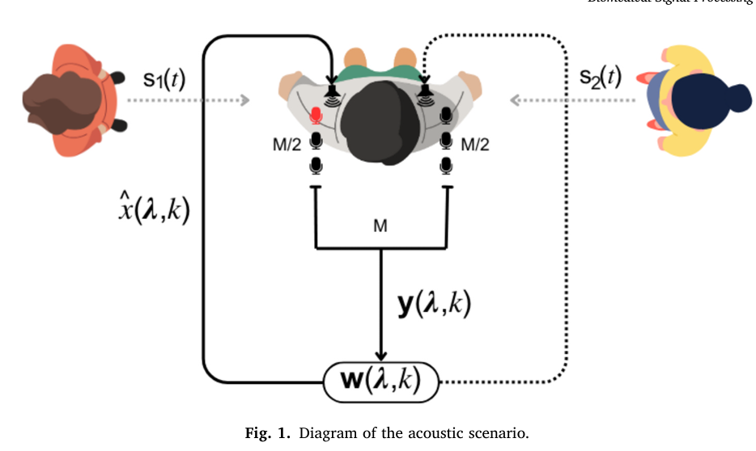

**1. 声源与角色定义**

- **`s₁(t)`**：**目标语音信号**
    - 这是听者**主动注意并想听清**的说话人。
    - 在本文的后续心理声学实验中，听者被要求始终跟随 `s₁(t)` 的内容。
- **`s₂(t)`**：**干扰语音信号**
    - 这是听者**需要忽略**的说话人。
    - 在系统中，`s₂(t)` 被视为需要被抑制的“噪声”之一。

**重要性**：这明确了系统任务的二元性——不是抑制一般的环境噪音，而是要在**两个非常相似的人类语音**中做出选择并抑制其中一个。这是“鸡尾酒会问题”的核心挑战。

---

 **2. 空间位置设定**

- **方位角**：两个声源分别位于听者左右两侧的 **±90°** 方位。
    - 例如，`s₁(t)` 在 **+90°**（听者左侧），`s₂(t)` 在 **-90°**（听者右侧）。
- **为何选择 ±90°？**
    1. **最大化空间分离**：这是双耳听觉中**空间线索最显著**的位置。左右耳的时间差和强度差最大，最有利于基于空间位置的分离算法（如波束成形）。
    2. **简化问题**：将声源置于极端两侧，避免了正前方或后方带来的空间模糊性，使研究可以专注于评估AAD和噪声抑制本身的性能，而不受声源定位模糊的干扰。
    3. **符合典型场景**：模拟了常见的对话场景，例如在餐桌两旁与人交谈。

---

**公式 (1): 单个麦克风接收到的全部信号**

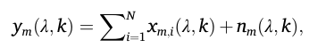

- **`yₘ(λ, k)`**：在第 `m` 个麦克风的 **时频点 `(λ, k)`** 上接收到的总信号。（`λ` 是时间帧索引，`k` 是频率点索引）
- **`Σ xₘᵢ(λ, k)`**：所有 `N` 个说话人的语音信号在第 `m` 个麦克风处叠加的结果。
- **`nₘ(λ, k)`**：在第 `m` 个麦克风处收到的环境噪声和电路噪声。

> **通俗理解**：这个公式就是说，**每个麦克风听到的声音 = 所有说话人声音的混合 + 背景噪音**。对应线性混合假设。


 **公式 (2): 单个麦克风接收到的单个说话人的语音信号**

公式(2) 是公式(1) 的一部分

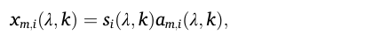

- **`sᵢ(λ, k)`**：第 `i` 个说话人发出的**纯净语音信号**。
- **`aₘᵢ(λ, k)`**：**声学传递函数**，它模拟了第 `i` 个声源发出的声音传播到第 `m` 个麦克风这个过程所发生的变化（如衰减、延迟）。
- **`xₘᵢ(λ, k)`**：最终，第 `i` 个说话人的声音被第 `m` 个麦克风捕捉到的版本。

> **通俗理解**：一个说话人的声音从嘴里发出，经过空气传播，再到被麦克风录下，这个过程会发生改变。`aₘᵢ` 就是描述这个“改变”的函数。所以，**麦克风收到的某个说话人的声音 = 他发出的原始声音 × 传播路径的影响**。


 **公式 (3): 所有麦克风信号的向量表示**

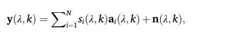

这只是把公式(1)和(2)结合起来，并用**向量形式**表示所有 `M` 个麦克风的信息，这样更简洁，也便于后续的矩阵运算。

- **`y(λ, k)`**：一个向量，包含了所有 `M` 个麦克风在时频点 `(λ, k)` 上接收到的信号 `[y₁, y₂, ..., y_M]ᵀ`。
- **`aᵢ(λ, k)`**：一个向量，包含了第 `i` 个说话人到所有 `M` 个麦克风的声学传递函数 `[a₁ᵢ, a₂ᵢ, ..., a_Mᵢ]ᵀ`。它定义了该说话人的**空间位置信息**。
- **`n(λ, k)`**：一个向量，包含了所有 `M` 个麦克风处的噪声 `[n₁, n₂, ..., n_M]ᵀ`。


 **公式 (4) & (5): 定义“期望信号”与“噪声+干扰”信号**

这里对总信号 `y(λ, k)` 进行拆分，将其明确分为“我们想要的”和“我们不想要的”两部分。

- **期望信号向量 `x(λ, k)`**：

    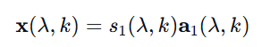

    假设第一个说话人 `s₁` 是听者关注的目标。那么，所有麦克风收到的、来自 `s₁` 的信号就是期望信号。

- **干扰噪声向量 `r(λ, k)`**：

    

    这个向量包含了**所有干扰说话人（`i=2` 到 `N`）的声音**加上**环境噪声**。在本文的双说话人场景中，`i=2` 就是那个干扰说话人。

- **总信号的最终简化形式**：

    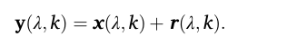

    这个公式至关重要，它将复杂的声学场景**简化为一个清晰的加法模型**：**总信号 = 期望信号 + (干扰 + 噪声)**。


**公式(6)**

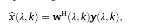

这个公式的意思是：**系统对目标语音的最终估计值 `x̂`，等于将所有麦克风的混合信号 `y`，通过一个精心设计的多通道滤波器 `w` 进行加权组合后得到的结果。**是**多通道维纳滤波器**的核心输出公式。给出了解决方案的第一步：如何利用 `w` 从 `y` 中提取 `x̂`

- **`x̂(λ, k)`**: 这是在时频点 `(λ, k)` 上，对**参考麦克风**处**目标语音** `x₁(λ, k)` 的**估计值**。也就是我们最终想得到的、增强后的信号。它的质量（PESQ/STOI）是本文评判系统成败的唯一标准。
- **`y(λ, k)`**: 这是我们熟悉的公式(3)中定义的向量，包含了所有 `M` 个麦克风在此时频点上接收到的信号 `[y₁, y₂, ..., y_M]ᵀ`。它是算法的**输入**。
- **`w(λ, k)`**: 这是**多通道维纳滤波器**在时频点 `(λ, k)` 上的**复值权重向量** `[w₁, w₂, ..., w_M]ᵀ`。每个元素 `w_m` 对应一个麦克风。这个权重向量是算法的核心，它包含了如何整合所有麦克风信息以突出目标、抑制噪声和干扰的“知识”。
- **`(·)^H`**: 表示**埃尔米特转置**（即共轭转置）。 表示把原矩阵中每个元素求共轭再转置。因为我们在处理**复值**的频域信号，所以需要共轭转置。
- **物理意义**：`w` 的每个复数权重 `w_m` 对第 `m` 个麦克风的信号执行两项操作：
    1. **幅度缩放**：放大或减小该麦克风信号的贡献。
    2. **相位旋转**：对该麦克风信号进行微小的延迟或提前。
        **这样做的终极目的**是：让所有麦克风中**来自目标方向**的信号成分**同相叠加**（建设性干涉），而让来自干扰和噪声方向的信号成分**异相抵消**（破坏性干涉）。


💡 直观理解：

您可以把这个公式想象成一个**智能的、随时空变化的“音量调节旋钮”组合**：

- **目标**：从一堆混乱的麦克风信号 `y` 中，提取出目标说话人在参考麦克风处的干净声音 `x̂`。

- **方法**：滤波器 `w` 会对每一个麦克风的信号进行一项复杂的操作：
    - **调整幅度（缩放）**
    - **调整相位（延迟）**
    
- **最终效果**：所有经过这样精心调整后的麦克风信号被加在一起。在这个过程中，**目标说话人的声音因为其特定的空间位置（由向量 `a₁` 定义）而被同相叠加、增强**；而**噪声和干扰说话人的声音则因为来自不同方向而被异相抵消、削弱**。

    

`w` 的最终目的，是**与目标声源的空间特征向量 `a₁` 匹配**。

回忆公式(2)-(3)：目标语音在各麦克风上的接收信号是：


理想情况下，如果我们知道 `a₁`，最优权重就是：`w ∝ a` ，意思就是：最优滤波器权重 `w` 应该与目标声源的空间特征 `a` 成比例。

---

### 2.3 问题

#### Q1：公式1的时频点 (λ, k)

**1. 什么是“时频点” `(λ, k)`？**

想象一下你在看一部电影的频谱图：

- **横轴 `λ`**：代表**时间**。比如 `λ=1` 代表电影开始的第10毫秒（取决于窗口长度和重叠），`λ=2` 代表第20毫秒，以此类推。它把连续的时间切成了一帧一帧的短片段。
- **纵轴 `k`**：代表**频率**。比如 `k=1` 代表0-100Hz，`k=2` 代表100-200Hz，以此类推。它表示在这一帧时间里，声音是由哪些频率成分构成的。
- **时频点 `(λ, k)`**：就是这张图上的一个**像素点**。它精确地表示在**某个特定的短暂时间片段（λ）** 内，**某个特定频率段（k）** 上的信号**强度（或能量）**。

**所以，公式 `yₘ(λ, k)` 读作：在第 `m` 个麦克风，第 `λ` 个时间帧，第 `k` 个频率 bin 上，接收到的总信号强度。**

**2. 为什么需要时频点？（核心原因）**

**① 利用“稀疏性”假设**
如上图所示，这是最根本的原因。在任意一个**非常短的时间窗口**（例如32ms）内，**多个说话人极少会在完全相同的时间、发出完全相同的频率**。这意味着，在大多数时频点 `(λ, k)` 上，其能量主要只由**一个**占主导地位的声源（目标说话人或干扰者）贡献，其他声源在该点的能量很弱甚至为零。

**② 简化处理，允许线性滤波**
在时频域中，卷积混合（在时间域是复杂的）在窄带假设下可以近似为**瞬时混合**。这就使得公式(3)中的混合模型成立，并且可以使用像**多通道维纳滤波器（MWF）** 这样的**线性滤波器** `w(λ, k)` 来进行处理。在时间域直接进行类似的线性过滤要困难得多。

**③ 契合语音和非平稳信号的特性**
语音和噪声都是**非平稳信号**，它们的统计特性随时间变化。在时频域中，我们可以针对**每一帧（λ）** 来估计和更新信号的统计信息（如协方差矩阵 `Φ_y(λ,k)`），这让算法能够自适应地跟踪声音环境的变化。

**3. 一个生动的比喻**

把整个一段语音信号想象成一幅**完整的油画**，画上是两个人物重叠在一起。

- **在时间域分离**：就像让你不借助任何工具，直接把画上的两个人完美地剥离开，这几乎是不可能的。
- **在时频域分离**：就像用一个**高倍放大镜**，逐个像素 `(λ, k)` 地去观察这幅画。你会发现，在大多数像素点上，其实只显示了一个人物的颜色。你只需要在每个像素点上做一个简单的决定：“这个像素点更可能属于人物A还是人物B？”。
- **MWF的作用**：就是这个“决策过程”。它根据麦克风阵列收到的信息，在每个时频点上计算一个最优的权重，来提取目标信号并抑制干扰。

**总结：使用“时频点” `(λ, k)` 是一种“分而治之”的策略。它将一个全局性的、高度复杂的非线性分离问题，分解成了大量局部的、相对简单的线性估计问题，从而使得实时的、高效的噪声抑制和语音增强成为可能。**

---

#### Q2：公式6的复数权重向量

**一、为什么要引入复数？—— 一个根本问题**

**问题**：如何用一个数字 **同时** 表示一个声音的：

1. **响度**（幅度/振幅）
2. **时机**（相位/时间点）

**传统实数**：`3.0` 只能表示响度，无法表示时机。
**解决方案**：使用**复数**！一个复数可以同时打包这两个信息。

------

**二、复数的直观理解：旋转箭头**

把声音想象成一个**在转盘上旋转的箭头**：

| 概念           | 在“旋转箭头”模型中的对应                   |
| :------------- | :----------------------------------------- |
| **复数的长度** | **箭头的长度** → 代表声音的**幅度/响度**   |
| **复数的角度** | **箭头的指向** → 代表声音的**相位/时间点** |
| **复平面**     | **整个转盘**                               |


```
                   复平面（想象成一个钟面）
                         ^ 虚轴 (Imaginary)
                         |
                         |  箭头 (复数 Z)
                         |   /
                         |  / 
                         | /  长度 = 幅度
                         |/ ) 角度 = 相位
        ----------+-----------> 实轴 (Real)
                         |
                         |
```


------

 **三、复数的两种表示法**

**1. 直角坐标形式：`a + jb`**

- **`a`**：实部，表示箭头在“东西方向”的投影长度
- **`b`**：虚部，表示箭头在“南北方向”的投影长度
- **`j`**：虚数单位，`j = √(-1)`，表示“旋转90度”的操作

**例如**：`3 + 4j` 表示箭头向东3单位，向北4单位。

**2. 极坐标形式：`R \* e^(jθ)`**

- **`R`**：幅度（长度），`R = √(a² + b²)`
- **`θ`**：相位（角度），`θ = arctan(b/a)`
- **`e^(jθ)`**：表示“旋转θ角度”的数学操作

**例如**：`5 * e^(j0.93)` 表示长度为5，角度为0.93弧度（约53°）的箭头。

------

**四、在声音/信号处理中的具体含义**

当我们在时频域看到一个复数 `Z = R * e^(jθ)` 时：

**物理意义：**

- **`R`**：在这个特定频率上，声音的**强度/能量**有多大。
- **`θ`**：在这个特定时间点上，该频率分量的声波处于**振动周期的哪个位置**。

**关键理解：相位是相对的时间信息**

假设有两个麦克风收到同一个声音：

```
麦克风1：信号1 = R * e^(j*θ₁)
麦克风2：信号2 = R * e^(j*θ₂)  # 同样的幅度，但相位不同
```


**相位差 `Δθ = θ₂ - θ₁` 直接告诉你声音到达两个麦克风的**时间差！

- `Δθ = 0`：同时到达
- `Δθ > 0`：麦克风2比麦克风1晚到
- `Δθ < 0`：麦克风2比麦克风1早到

------

**五、复数的运算如何对应物理操作**

**1. 复数乘法：缩放 + 旋转**

```
Z₁ * Z₂ = (R₁ * e^(jθ₁)) * (R₂ * e^(jθ₂)) = (R₁R₂) * e^(j(θ₁+θ₂))
```

**物理意义**：

- **`R₁R₂`**：幅度被缩放（调音量）
- **`θ₁+θ₂`**：相位被旋转（调时间）

**这正是权重 `w_m` 对信号 `y_m` 的作用！**

```
w_m * y_m = (幅度_w * e^(j*相位_w)) * (幅度_y * e^(j*相位_y))
          = (幅度_w * 幅度_y) * e^(j*(相位_w + 相位_y))
```


 **2. 复数加法：矢量叠加**

```
Z₁ + Z₂ = (a₁ + jb₁) + (a₂ + jb₂) = (a₁+a₂) + j(b₁+b₂)
```

**物理意义**：两个声波在空气中相遇时，它们的压力和速度就是这样**矢量相加**的。


**3. 复数共轭：`Z\* = a - jb` 或 `R \* e^(-jθ)`**

**物理意义**：**时间反转**或**相位取反**。在公式 `w^H y` 中的 `w^H`（埃尔米特转置）就包含共轭操作，这相当于对权重进行相位反向调整来对齐信号。

------

**六、为什么权重是复数向量？**

每个复数权重对应调整一个麦克风信号，几个麦克风信号同时调整，**复数权重 `w_m` 对第 m 个麦克风信号做两件事：**

```bash
w_m = A_m * e^(j*θ_m)
      ↑           ↑
  幅度缩放因子    相位旋转因子
```

- **`A_m`**（实数部分）：控制**放大或衰减**多少，调节该麦克风信号的“音量”
- **`θ_m`**（相位角）：控制**延迟或提前**多少时间，它与其他麦克风的信号在时间上对齐

**而“向量” `w` 则是：**

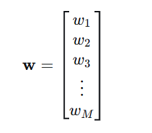

- 一个包含 `M` 个复数的列表
- 每个复数对应一个麦克风，针对性调整
- 整个向量编码了**如何利用所有麦克风的空间分布信息**来提取目标声音


## 3. AAD-based noise reduction system

相关文献[12]关注说话人分离这个步骤：

```bash
麦克风信号 → 盲源分离系统 → 分离出的两个语音流
           (ICA或DNN)       (目标语音近似 + 干扰语音近似)
```

**两种实现技术**

 **① 独立成分分析 （ICA）**

- **原理**：一种经典的统计方法。假设各个源信号在统计上**相互独立**，通过寻找一个变换矩阵，使得输出信号的独立性最大化。
- **优点**：数学理论清晰，无需训练数据。
- **缺点**：对假设敏感（现实中语音信号不完全独立，两个同时说话的人的语音信号在统计上并不完全独立，分离效果可能不理想），计算复杂，分离质量有限。

 **② 深度神经网络（DNN）**

- **原理**：使用大量带标签的混合-纯净语音数据对，训练一个神经网络直接学习从混合信号到分离信号的映射。
- **优点**：分离质量通常比ICA高，能学习复杂的声学模式。
- **缺点**：需要大量训练数据，模型复杂，可能过拟合，泛化能力存疑，可能不适合助听器上的实时处理。

---

**基于解码-相关性”的传统AAD方法**

该方法分三步走：

- **解码重建**：从所有EEG通道中，重建出用户正在关注的**目标说话人的语音包络**（声音的强度轮廓）。
- **计算相关**：将重建出的包络，分别与**两个已知的说话人**各自的语音包络计算**皮尔逊相关系数**。
- **选择目标**：**相关系数更高**的那个说话人，即被判定为用户注意的目标。

- **局限**：性能**极度依赖决策窗口长度**。

    **原因**：从EEG重建的包络**信噪比极低**，在短时间窗口下估计的相关系数**非常不稳定、噪声大**。

---

由于文献 [17] 中，通过卷积神经网络利用EEG信号检测听觉注意力的焦点，而不使用干净语音包络信息，使用大约1秒的决策窗口，也达到了相同范围的准确率。本文提出一种将多通道波束形成（MWF）与基于脑电图（EEG）的算法结合，用于检测听觉注意力位置的降噪系统。

两个信号分别位于左右两侧，一个为目标信号，一个为干扰信号。

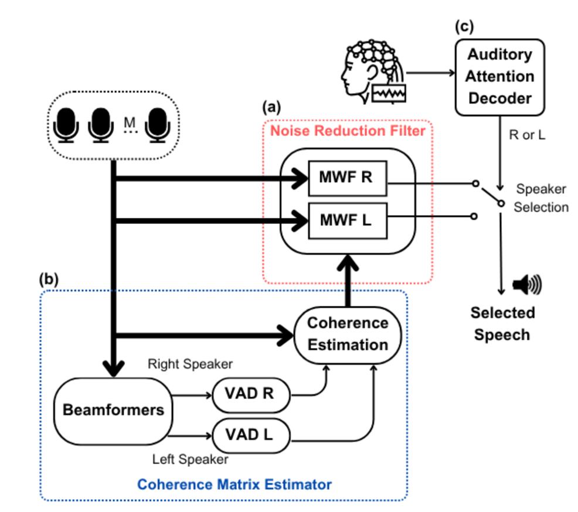


### 3.1 噪声抑制滤波器

对应图中红框部分。

这个模块负责**并行地生成两个备选的“干净”语音流**。

- **实现方式**：使用两个独立的**多通道维纳滤波器**。
    - **MWF-L**: 旨在增强来自**左侧**的说话人，并抑制右侧说话人和噪声。
    - **MWF-R**: 旨在增强来自**右侧**的说话人，并抑制左侧说话人和噪声。
- **关键点**：在此阶段，系统**并不知道**用户正在关注哪一侧。它只是“尽职”地准备好两个可能的选择，等待最终的指令。这对应于流程图中的模块 **(a)**。


 **一、 目标：我们想做什么？**

回顾公式(5)：`y = x + r`

- `y`：麦克风收到的**混合信号**（向量）
- `x`：我们想要的**目标语音**在麦克风上的信号（向量）
- `r`：我们想消除的**干扰+噪声**（向量）

**我们的终极目标**：设计一个“魔法过滤器” `w`，把它作用在混合信号 `y` 上，能最大程度地保留 `x`，同时滤除 `r`。
用数学表示，就是找到一个滤波器 `w`，使得输出：


尽可能接近我们想要的 `x₁`（即目标语音在**参考麦克风**处的信号）。

---

**二、 核心思想：如何设计最优过滤器？—— MMSE准则**

我们如何判断一个过滤器 `w` 是好是坏？需要一个**优化准则**。

论文采用工程中最经典、最直观的准则：**最小均方误差**。

> **思想**：让过滤器估计出的语音 `x̂`，与真实的干净语音 `x₁` 之间的**平均平方误差**最小。

**数学表达（公式7）**：

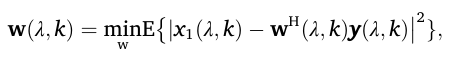

**解读**：

- `𝔼{·}`：求期望（长期平均），表示我们关心的是**统计平均性能**，而不是某一次的偶然。
- `|·|²`：取模的平方，用来度量误差的大小。
- `x₁ - w^H y`：就是**估计误差**。
- `arg min`：寻找能使这个平均平方误差最小的那个权重向量 `w`。

 **左边：`w(λ,k)`**

- 这是我们要求解的、**未知的滤波器权重向量**。
- 它本身就是我们想要的结果。

**右边：`arg min_w { ... }`**

- 这是一个**算子**，它作用于一个**函数**（大括号里的均方误差函数）。
- **`min_w`** 的意思是：找到这个函数的**最小值**。
- **`arg`** 的意思是：找到使得函数达到这个**最小值的那个参数（即 w 的值）**。

**所以，整个右边 `arg min_w { ... }` 的运算结果，就是一个特定的 w 值**。

---

**三、 理论推导：最优解是怎么来的？（公式8）**

公式7中，省略(λ,k)便于清晰推导：

- `x₁`：标量，参考麦克风处的**目标语音**（我们想估计的信号）
- `y`：`M×1` 向量，所有麦克风的**接收信号**
- `w`：`M×1` 向量，滤波器权重（待求）
- `𝔼{·}`：统计期望（均值），不能最小化**一次具体实验的误差**，而要最小化**长期的、平均的误差**。这就是引入 **`𝔼{·}`（期望/均值）** 的根本原因。


- **步骤1：展开目标函数**

定义目标函数（代价函数）：

> 代价函数是**针对整个训练集** 的误差，是所有样本损失的平均或总和，用来优化参数。损失函数针对单个样本。


展开平方项：


::: info 

因为信号是复数，复数的模平方等于它和它的共轭相乘，即

 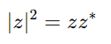

所以这里的复数是：

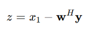

那么：

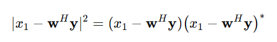

使用复共轭的性质：

1. **和差的共轭**：$(a-b)^* = a^* - b^*$
2. **共轭转置的共轭**：$(\mathbf{w}^H\mathbf{y})^* = \mathbf{y}^H \mathbf{w}$ （矩阵/向量的共轭转置规则）

因此：
$$
(x_1 - \mathbf{w}^H\mathbf{y})^* 
= x_1^* - (\mathbf{w}^H\mathbf{y})^*
= x_1^* - \mathbf{y}^H\mathbf{w}
$$
于是右边就变成：
$$
(x_1 - \mathbf{w}^H \mathbf{y})(x_1^{*} - \mathbf{y}^H \mathbf{w})
$$
:::


继续展开：

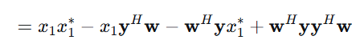

带入期望：

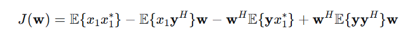


::: info

在信号处理的许多问题中（特别是线性滤波问题），**二阶统计量（相关函数、协方差）包含了我们需要的全部信息**。这是因为：

- 对于**高斯过程**，二阶统计量完全决定了其分布
- 即使对于非高斯信号（如语音），在**最小均方误差（MMSE）准则下的最优线性滤波器**也**只依赖于二阶统计量**

**二阶统计量**指的就是各种 **“相关”** 和 **“协方差”**：

上述公式拆分出 4 项：

- $\mathbb{E}[x_1 x_1^*]$：目标语音信号自身的平均功率，物理意义是**原始目标语音有多响**（平均而言）。

- $\mathbb{E}[x_1 y^H]w$：$\mathbb{E}[x_1 y^H]$ 是一个 **`1×M` 的行向量**。它的第 `m` 个元素是 $\mathbb{E}[x_1 y_m^*]$ ，表示**原始目标语音信号** `x₁` 与**第 m 个麦克风接收到的信号** $y_m$ 的**互相关**（零延迟时），总体是两个信号之间的平均相关性。

    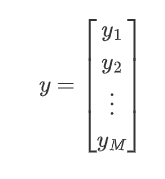

    

- $w^H\mathbb{E}[y x_1^*]$：正是第二项的共轭转置。（原理：$(a^H b)^H = b^H a$ ）

- $w^H\mathbb{E}[y y^H]w$ ：$\mathbb{E}[y y^H]$ 是一个 **`M×M` 的矩阵**。它的 `(m,n)` 元素是  $\mathbb{E}[y_m y_n^H]$ ，表示**第 m 个麦克风信号**与**第 n 个麦克风信号**的**互相关**。这个矩阵编码了**所有麦克风信号之间的空间相关结构**。

:::


**带入期望将问题从“随机变量”转化为“确定参数”**

原始问题中，`x₁` 和 `y` 是**随机变量**（每次实验都不同）。经过取期望 `𝔼{·}` 后：

- 不再是随机变量，而是**确定的数值/矩阵**（假设我们知道真实的统计量）。
- 这意味着 `J(w)` 现在只是 **`w` 的确定函数**，我们可以用标准的微积分方法求其最小值。

> **类比**：如果我们说“最小化学生的考试成绩”，这是模糊的（每个学生不同）。但如果说“最小化全班的平均成绩”，这就是一个明确的数学问题。


::: info

期望 = 随机变量在概率意义下的平均值，不是简单的算术平均，而是带有权重的平均——权重是该取值发生的概率。

在机器学习中，**期望（Expectation）** 的最重要应用之一就是 **风险最小化（Risk Minimization）**。

:::


**步骤2：引入协方差矩阵**

通过观察上述展开的公式，发现：

第一项跟 $\mathbf w$ 无关，是常数 C。

为了简洁，作者给这几个期望起名字：

$\mathbf\Phi_{yy} = \mathbb E\{\mathbf y\mathbf y^H\}$  —— 含噪声的相干矩阵（所有麦克风收到的声音，y 是向量）

$\mathbf\Phi_{xx} = \mathbb E\{\mathbf x\mathbf x^H\}$  —— 纯语音（无噪声）的相干矩阵（所有麦克风收到的目标声音，x 是向量）

还会用到 $\mathbf\Phi_{yx} = \mathbb E\{\mathbf y\mathbf x^H\}$ 等。

同时定义
$$
x_1 = \mathbf q^H\mathbf x,\quad \mathbf q=[1,0,0,\dots]^T
$$
也就是“从 $\mathbf x$ 这堆麦克风信号里，挑第 1 个出来”。

::: info

因为在双耳情况下：

- 左耳重建用左耳第一个麦克风作为 reference
- 右耳重建用右耳第一个麦克风作为 reference

为什么选第 1 个通道？
 因为那是“耳道入口最接近真实自然听感的位置”。

:::

有了 $\mathbf q$ 之后，其中两项可以写成矩阵形式（可以先当作“换个写法”）：

- 第 2 项中 $\mathbb E\{x_1\mathbf y^H\}    =\mathbf q^H\mathbb E\{\mathbf x\mathbf y^H\}    =\mathbf q^H\mathbf\Phi_{xy}$

- 第 3 项中 $\mathbb E\{\mathbf y x_1^*\}    =\mathbb E\{\mathbf y (\mathbf q^H\mathbf x)^*\}    =\mathbb E\{\mathbf y\mathbf x^H\}\mathbf q    =\mathbf\Phi_{yx}\mathbf q$ 

于是代回去：
$$
J(\mathbf w)
= C -\mathbf q^H\mathbf\Phi_{xy}\mathbf w
    -\mathbf w^H \mathbf\Phi_{yx}\mathbf q
    +\mathbf w^H \mathbf\Phi_{yy}\mathbf w
$$


**步骤3：丢掉与 $\mathbf w$ 无关的常数**

我们是在 **调节 $\mathbf w$**，让 $J(\mathbf w)$ 最小。

- 第 1 项 $C$ 完全不含 $\mathbf w$，不管 $\mathbf w$ 取什么值，C 都不变；
- 所以它不会影响“最小值出现在什么地方”。

所以我们可以 **忽略第 1 项**，只保留和 $\mathbf w$ 有关的 3 项，写成
$$
\tilde J(\mathbf w)
= -\mathbf w^H \mathbf\Phi_{yx}\mathbf q
  -\mathbf q^H\mathbf\Phi_{xy}\mathbf w
  +\mathbf w^H \mathbf\Phi_{yy}\mathbf w.
$$
只要把这个 $\tilde J(\mathbf w)$ 最小化，得到的 $\mathbf w$ 和原来的 $J(\mathbf w)$ 的最优 $\mathbf w$ 是一样的。


::: info

**用“抛物线”直觉理解最小值条件**

先用一维的直觉帮你抓住要点：

- 一维二次函数：
    $$
    f(x)=ax^2-2bx
    $$
    画出来就是个“碗形”的抛物线。

- 它的最小值出现在“斜率为 0 的地方”，也就是：
    $$
    f'(x)=2ax-2b=0 \quad\Rightarrow\quad x = \frac{b}{a}.
    $$

向量情况下，其实做的是同样的事：

- $\mathbf w$ 不再是一个数，而是一串权重（向量）；
- 斜率不再是一个数，而是一个“梯度向量”；
- “最小值点”依然满足：**梯度 = 0**。

所以我们要做的就是——**对 $\tilde J(\mathbf w)$ 对 $\mathbf w$ 求“偏导/梯度”，让它等于 0。**

先把这当成一个“操作步骤/配方”，不必深究复杂向量求导的证明。

:::


**步骤4：套用“配方”求梯度**

我们现在的目标函数（省略常数）是：
$$
\tilde J(\mathbf w)
= -\mathbf w^H \mathbf\Phi_{yx}\mathbf q
  -\mathbf q^H\mathbf\Phi_{xy}\mathbf w
  +\mathbf w^H \mathbf\Phi_{yy}\mathbf w
$$
是对 $\mathbf w$ 的函数。

第 1 项和第 2 项这种的称为“线性项” = 斜坡（推动 w 往某个方向走）

它们就是“给碗加一股推力”，让最小值不在中心，而偏向某个方向。

对于线性项来说，求导配方为：
$$
\frac{\partial}{\partial \mathbf w^*}(\mathbf w^H \mathbf a)=\mathbf a
$$
翻译成生活话：

> 如果代价函数里有“斜坡项”，它的梯度就是“斜坡方向”。

因此第 1项对 $\mathbf w^*$ 求导：
$$
\frac{\partial}{\partial \mathbf w^*}(-\mathbf w^H \mathbf\Phi_{yx}\mathbf q)
= -\mathbf\Phi_{yx}\mathbf q
$$


::: info

**为什么对 $\mathbf w^*$ 求导，而不是对 $\mathbf w^H$ 求导？**

1. **变量的自然形式**：
     我们优化的是列向量 $\mathbf w$，
     $\mathbf w^*$ 也是列向量 → 梯度形式统一。
     而 $\mathbf w^H$ 是行向量，不适合作为“变量”。
2. **复数优化的标准做法**：
     在复数场景中，把 $\mathbf w$ 和 $\mathbf w^*$ 当成独立变量，
     对实值函数 J，有
     $\displaystyle \frac{\partial J}{\partial \mathbf w^*}=0$ 作为极小条件。
     所以大家都对 $\mathbf w^*$ 求导。
3. **wᴴ 只是 w\* 的转置**：
     就像 x² 只是 x 的函数一样，
     我们不会“对 x² 求导”，而是对 x 求导。

:::


第 2 项 $-\mathbf q^H\mathbf\Phi_{xy}\mathbf w$ 对 $\mathbf w^*$ 求导：

**只含 w 的项**（比如 $-\mathbf q^H\mathbf\Phi_{xy}\mathbf w$）
 👉 对 $\mathbf w^*$ 求导 = 0

**含 w\* 的项**（比如 $-\mathbf w^H \dots$，因为 $ \mathbf w^H = (\mathbf w^*)^T$）
 👉 对 $\mathbf w^*$ 求导会产生非零结果

因此该项为 0。


第 3 项 $\mathbf w^H \mathbf\Phi_{yy}\mathbf w$ 对 $\mathbf w^*$ 求导：

因为这一项是“二次型“，套用配方公式：
$$
\frac{\partial}{\partial \mathbf w^*}(\mathbf w^H\mathbf A\mathbf w)
= \mathbf A\mathbf w +\mathbf A^H\mathbf w
$$

> 如果 A 是 Hermitian（信号处理中常常是），就变成 2Aw。

而 $\mathbf\Phi_{yy}$ 就是 Hermitian，因此：
$$
\frac{\partial}{\partial \mathbf w^*}(\mathbf w^H\mathbf\Phi_{yy}\mathbf w)
= 2\mathbf\Phi_{yy}\mathbf w
$$


所以最后总梯度是：
$$
\frac{\partial \tilde J}{\partial \mathbf w^*}
= \underbrace{-\mathbf\Phi_{yx}\mathbf q}_{\text{来自第 1 项}}
  \;+\; \underbrace{0}_{\text{第 2 项}}
  \;+\; \underbrace{2\mathbf\Phi_{yy}\mathbf w}_{\text{第 3 项}}
$$
**步骤5：极小值条件即让梯度 = 0**

“找到最优的 $\mathbf w$” 等价于“找到让代价函数最小的点”，
 对二次函数来说，就是让梯度为 0：
$$
\frac{\partial \tilde J}{\partial \mathbf w^*} = 0
$$
所以有：
$$
-\mathbf\Phi_{yx}\mathbf q
+ \mathbf\Phi_{yy}\mathbf w = 0
$$
把式子整理一下：
$$
\mathbf\Phi_{yy}\mathbf w
= \mathbf\Phi_{yx}\mathbf q
$$
这就是一个**线性方程组**，未知量是 $\mathbf w$（一个 M 维列向量）。

- $\mathbf\Phi_{yy}$：$M\times M$ 矩阵
- $\mathbf w$：$M\times 1$
- $\mathbf\Phi_{yx}\mathbf q$：$M\times 1$


解这个线性方程组：得到 w 的闭式解。

和一维情况类似：

- 一维：$a x = b \Rightarrow x = a^{-1} b$（前提是 a≠0）
- 矩阵版本：$\mathbf A \mathbf w = \mathbf b \Rightarrow \mathbf w = \mathbf A^{-1} \mathbf b$（前提是 $\mathbf A$ 可逆）

这里直接套用：
$$
\mathbf\Phi_{yy}\mathbf w
= \mathbf\Phi_{yx}\mathbf q
\quad\Rightarrow\quad
\mathbf w^{\text{opt}}
= \mathbf\Phi_{yy}^{-1}\mathbf\Phi_{yx}\mathbf q
$$
这就是**在均方误差意义下的最优滤波器**（多通道 Wiener 形式）。


**步骤6：从$\mathbf\Phi_{yx}\mathbf q$ 变成 $\mathbf\Phi_{xx}\mathbf q$**

回顾公式 5：
$$
\mathbf y = \mathbf x + \mathbf r
$$
回顾定义：
$$
\mathbf\Phi_{yx}
= \mathbb E\{\mathbf y \mathbf x^H\}
$$
把 $\mathbf y = \mathbf x + \mathbf r$ 代进去：
$$
\mathbf\Phi_{yx}
= \mathbb E\{(\mathbf x+\mathbf r)\mathbf x^H\}
= \mathbb E\{\mathbf x\mathbf x^H\}
 +\mathbb E\{\mathbf r\mathbf x^H\}
$$

- 第二项：$\mathbb E\{\mathbf r\mathbf x^H\}$
     因为“目标语音”和“噪声/干扰”假设不相关 → 这一项 ≈ 0
- 第一项：$\mathbb E\{\mathbf x\mathbf x^H\}$
     就是目标语音的相干矩阵：

$$
\mathbf\Phi_{xx}
= \mathbb E\{\mathbf x\mathbf x^H\}
$$

于是：
$$
\mathbf\Phi_{yx} \approx \mathbf\Phi_{xx}
$$
代回 w 的公式：
$$
\mathbf w^{\text{opt}}
= \mathbf\Phi_{yy}^{-1}\mathbf\Phi_{yx}\mathbf q
\approx \mathbf\Phi_{yy}^{-1}\mathbf\Phi_{xx}\mathbf q
$$


这一步我们得到滤波器的最优解。

把最优的 $\mathbf w^{\text{opt}}$ 代进去：

代入：
$$
\hat x_1 
= (\mathbf w^{\text{opt}})^H\,\mathbf y
= (\mathbf\Phi_{yy}^{-1}\mathbf\Phi_{xx}\mathbf q)^H \mathbf y.
$$
注意到：

- $(AB)^H = B^H A^H$
- $\mathbf\Phi_{yy}$、$\mathbf\Phi_{xx}$ 是协方差 / 相干矩阵 → Hermitian：$\mathbf\Phi^H = \mathbf\Phi$
- $\mathbf\Phi_{yy}^{-1}$ 也是 Hermitian 的逆，所以 $(\mathbf\Phi_{yy}^{-1})^H = \mathbf\Phi_{yy}^{-1}$

于是：
$$
(\mathbf\Phi_{yy}^{-1}\mathbf\Phi_{xx}\mathbf q)^H
= \mathbf q^H \mathbf\Phi_{xx} \mathbf\Phi_{yy}^{-1}.
$$
所以：
$$
\boxed{
\hat x_1
= \mathbf q^H \mathbf\Phi_{xx}\mathbf\Phi_{yy}^{-1} \mathbf y
}
$$
这就是“最优 $\mathbf w$”代回去后的显式形式。


$\hat x_1$ 就是：
 用全部麦克风的观测 $\mathbf y$
 通过一组线性权重 $\mathbf w^{\text{opt}}$ 加权之后，
 **去尽可能逼近 “第 1 个麦克风上，只存在目标语音时的信号 $x_1$”**。

---

### 3.2 相干矩阵估计器

对应图中蓝框的 b  部分。

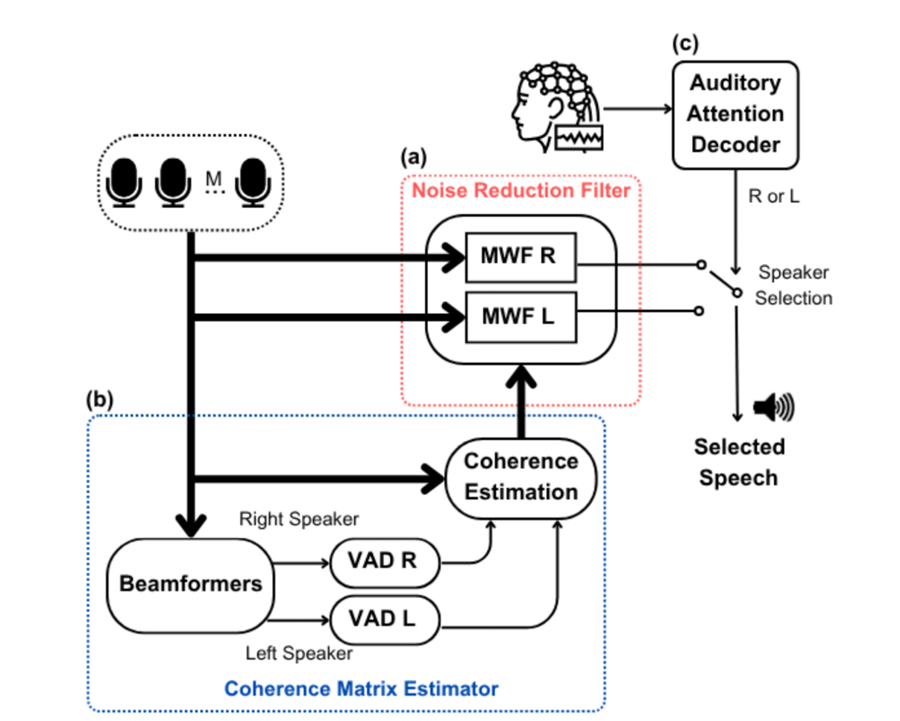


- 有一套 MWF 专门估计“左边说话人”的 $\hat x_1^{(L)}$
- 另一套 MWF 专门估计“右边说话人”的 $\hat x_1^{(R)}$

它们都是用刚刚推到的那种形式：
$$
\mathbf w^{\text{opt}} = \Phi_{yy}^{-1}\Phi_{xx}\mathbf q
$$
只不过：

- 对“左 MWF”，$\Phi_{xx}$ 是“左说话人”作为目标时的协方差
- 对“右 MWF”，$\Phi_{xx}$ 是“右说话人”作为目标时的协方差

要算出这个 $\mathbf w^{\text{opt}}$，你至少得知道：

- $\Phi_{yy}(\lambda,k)$：观测的协方差（从麦克风信号 y 来）
- $\Phi_{xx}(\lambda,k)$ 或 $\Phi_{rr}(\lambda,k)$：目标和/或噪声的协方差

**这一步（两个 beamformer + 两个 VAD + whitening）干的事就是：帮每个 MWF把它那份  $\Phi_{rr}$（噪声协方差）估出来**。


::: info

在实验里 ，我们事先知道 $\Phi_{xx}$ ，也知道噪声  $\Phi_{rr}$。

 **“oracle（上帝视角）MWF”**，很多论文会用它来当 **性能上限**。
 比如：

- 直接用干净的 $\mathbf x$ 算 $\Phi_{xx}$
- 用干净的 $\mathbf r$ 算 $\Phi_{rr}$
- 然后算出“理想 MWF”


但是**算法在真实工作时是看不到这些的**，它只能看到的是：
 👉 麦克风阵列的观测 $\mathbf y = \mathbf x + \mathbf r$。

所以：**观测 y 是现实世界里唯一能用的输入**。

:::

---

**为什么要“两个 beamformer + 两个 VAD”？**

系统里有两个说话人：左 & 右，每一侧各有一个 MWF：

- 左 MWF：目标 = 左说话人，噪声 = 右说话人 + 背景
- 右 MWF：目标 = 右说话人，噪声 = 左说话人 + 背景

那么：

- 左 MWF 需要一份 “**从左的视角看** 的噪声协方差” $\Phi_{rr}^{(L)}$
- 右 MWF 需要一份 “**从右的视角看** 的噪声协方差” $\Phi_{rr}^{(R)}$

而你实际能观测的，只有多通道混合 $\mathbf y$。
 于是他们做了这样一个工程套路：

1. **两个固定波束形成器：**
    - BF-L：指向左，压制右
    - BF-R：指向右，压制左
         → 目的是：得到两个“更偏向某一边”的观测通道
2. **每个 BF 输出上挂一个 VAD：**
    - VAD-L：在 BF-L 输出上，分出
        - “有左说话人”帧
        - “只有右说话人/噪声”帧（可视为左视角的“噪声段”）
    - VAD-R 同理
3. **用这些“噪声段”的 STFT 统计 → 估计对应的 Φ_rr(λ,k)**
    - 左 MWF 用左视角的 Φ_rr^(L)
    - 右 MWF 用右视角的 Φ_rr^(R)

所以这一整步的作用可以一句话概括为：

> 用“会看左/看右的两个 beamformer + 各自的 VAD”
>  把时频点分成“属于这一侧说话人 / 不属于”
>  再用“属于噪声的一堆帧”去算协方差，
>  **从而为每个 MWF 提供它所需的噪声统计。**


因为想知道 AAD + MWF 这个框架，最多能做到什么程度。又想**尽量避免**“实际 VAD、实际 BF 估得很烂”带来的干扰，
 所以在实验中假设：

- 波束形成器是理想的
- VAD 也是理想的
     → 这样就尽可能保证 $\Phi_{rr}$ 估计得很好。

---

### 3.3. 听觉注意解码器

**AAD 在干嘛？**

原文：

> The AAD (Fig. 2c) applies a decoding procedure, employing the
>  available EEG channels, to detect which side (left/right) is of interest to
>  the hearing aid user.

翻成大白话：

- AAD = Auditory Attention Decoding：**听觉注意解码**。
- 它的输入是：**多个 EEG 通道**（脑电信号）。
- 它的输出是：**用户现在在注意哪一边（左还是右）**。

也就是：

> 用脑电信号“读心”：判断你是在听左边的人还是右边的人。


**整条链现在可以这样看：**

1. 麦克风阵列 → 两个 MWF（左/右） → 两路增强语音：
    - $\hat x^{(L)}$
    - $\hat x^{(R)}$
2. 同时，大脑对左/右说话人的注意 → 反映在 EEG 中 → AAD 解码
3. AAD 用一个固定长度的时间窗口（比如 N 秒）去**持续判断**：
    - 这 N 秒内，用户更注意左还是右？
4. AAD 的判断结果（左/右）是一个二值信号，
     → 用来控制“到底播 $\hat x^{(L)}$ 还是 $\hat x^{(R)}$”。
5. 因为要等完 N 秒的数据才能做一次决策 → 产生约 N 秒的延迟。

---

### 3.5 问题

#### Q3：噪声抑制滤波器和相干矩阵估计器的区别

🎨 核心比喻：**厨师 vs. 食材处理员**

想象一个高级餐厅的厨房，要为客人准备两道主菜（左声道和右声道）。

---

👨‍🍳 **3.1 噪声抑制滤波器 - 主厨**

*   **角色**：**两位主厨**
    *   **主厨-左**：专门烹饪左声道这道菜。
    *   **主厨-右**：专门烹饪右声道这道菜。
*   **职责**：**负责“烹饪”出最终端给客人的菜肴**。他们拿到处理好的食材，运用他们高超的厨艺（**MWF算法**），做出一道美味、干净、没有异味的菜。
*   **工作内容**：他们遵循一个固定的、最优的食谱（**公式 w^opt = Φ_yy⁻¹ Φ_xx q**）。这个食谱告诉他们如何精确地调配各种原料（麦克风信号），才能最好地突出主料（目标语音），掩盖或去除不好的味道（噪声和干扰）。
*   **关键**：他们是**最终产品的产出者**。系统最终的语音质量（PESQ）和可懂度（STOI）直接由他们的“厨艺”决定。

---

🥬 **3.2 相干矩阵估计器 - 食材处理员**

*   **角色**：**一位资深的食材处理员**
*   **职责**：**负责为主厨准备最核心的、处理好的食材**，而不是直接做菜。他的任务是：
    1.  分辨出什么是“上等主肉”（纯净的 **`Φ_xx`** - 目标语音的统计特征）。
    2.  分辨出什么是“需要剔除的筋膜和边角料”（纯净的 **`Φ_rr`** - 噪声和干扰的统计特征）。
*   **工作内容**：
    *   他使用特殊的工具（**固定波束成形器**）来对混合在一起的原始食材进行**粗分离**。
    *   他依靠经验（**语音活动检测器 VAD**）来判断什么时候拿到的是纯主肉，什么时候拿到的是纯边角料。
    *   他将这些分析好的、代表食材特征的“样品”（`Φ_xx` 和 `Φ_rr`）交给两位主厨。
*   **关键**：他是**服务和支持者**。他工作的**准确性**直接决定了主厨拿到的食谱（公式里的 `Φ_xx` 和 `Φ_rr`）是否靠谱，进而影响菜肴的最终品质。**如果他提供的食材特征有误，主厨厨艺再高也做不出好菜。**

---

💡 总结与类比

| 特性               | **3.1 噪声抑制滤波器 (主厨)**              | **3.2 相干矩阵估计器 (食材处理员)**                          |
| :----------------- | :----------------------------------------- | :----------------------------------------------------------- |
| **核心任务**       | **产出**最终增强后的语音信号。             | **估计和提供**计算所需的**统计特征**（协方差矩阵）。         |
| **在公式中的位置** | 执行公式 **`x̂ = w^H y`**，是**最终输出**。 | 计算公式 **`w^opt = Φ_yy⁻¹ Φ_xx q`** 中的 **`Φ_xx` 和 `Φ_rr`**，是**中间输入**。 |
| **依赖关系**       | 依赖于3.2提供的准确统计信息。              | 依赖于原始的麦克风信号和VAD/波束成形的性能。                 |
| **比喻**           | **烹饪**                                   | **准备食材**                                                 |

**所以，它们的根本区别是：**
*   **3.2 是“信息提供者”**，它回答“**是什么？**”（What is the target? What is the noise?）
*   **3.1 是“命令执行者”**，它回答“**怎么做？**”（How to extract the target and suppress the noise?）

在本文的实验中，作者假设 **“食材处理员”是完美的**（理想波束成形和VAD），这样就能确保如果最终“菜肴”不好吃，那问题一定不是出在食材上，而很可能是出在**决定上哪道菜的“大堂经理”（3.3 AAD）** 身上，或者“主厨”的算法本身。这就隔离了变量，让作者能专注于研究AAD的性能影响。


## 4. Methodology

本节介绍了基于 MWF 和 AAD 的降噪架构在 N=2 说话者情况下的潜在性能评估。

### 4.1 数据集规格

KU Leuven 的开源数据集。见参考文献 [25]、[26]。

有 **16 个被试（subjects 1–16）** 的 EEG 信号。

每个被试在听 **4 个故事（story 1,2,3,4）** 的时候录了 EEG。

这 4 个故事由 **3 个说话人**朗读，其中：story 3 和 story 4 是同一个说话人讲的。

### 4.2 AAD 模型

文献 [17] 中的方法。


### 4.3 数据处理

**EEG 信号同之前文献，也做归一化，只是不做伪迹去除。**


**决策窗口设置：**

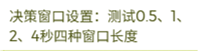

窗口越长 → 判得越准 → 但延迟也越大。

因为重叠 50% 因此：对某个长度为 T 的 EEG 窗口做 AAD 决策，延迟为 T/2。

> 我们用一个具体例子看最清楚：
>  假设 T = 2 s，50% overlap。
>
> ### 窗口与时间线
>
> - 第 1 个窗口：$0, 2$，中心在 1 s
> - 第 2 个窗口：$1, 3$，中心在 2 s
> - 第 3 个窗口：$2, 4$，中心在 3 s
> - …
>
> 对每个窗口：
>
> - 你要等“窗口的右端”到来（比如 2 s）
> - 才能用这一整段 EEG 去做一次 AAD 决策
>
> 所以：
>
> - **第 1 次决策真实“算出来”的时间是 t = 2 s**
>
> - 但它是基于 EEG 的窗口 $[0,2]$，
>      **我们把这次决策“归属”到这个窗口的中点 t = 1 s**，代表：
>
>     > 在第 0~2 秒这一段里，这 1 秒附近“整体上”你注意的是哪一边。
>
> 于是延迟怎么算？
>
> > 这次决策“代表”的时间点：1 s（窗口中心）
> >  这次决策真正“算出来”的时间：2 s
> >  延迟 = 2 s − 1 s = **1 s = T/2**
>
> 所以：
>
> - ❌ 不是在 T/2 = 1 s 时就做出了决策
> - ✅ 是在 T = 2 s 时做出决策，但**它被认为是“1 秒时刻的注意力判断”，所以对那个时刻来说延迟是 T/2**

所以**每个决策相对它“描述的时间点”的延迟 = T/2**

::: info

**在真实设备上，这个延迟是怎么体现在“声音”上的？**

想象真实在线系统要这样工作：

1. EEG 和声音都在时间 0 开始流进来。
2. 系统一边缓冲 EEG，一边缓冲声音。
3. 到 t = T 时：
    - 系统拿到了 [0,T] 这一段 EEG → 算出第 1 个 AAD 决策（代表大约 0~2 秒中间，也就是 1 秒附近的注意侧）。
    - 同时也已经缓冲了对应的音频。
4. 系统一旦做出“注意左/右”的决定，就用这个决定去控制：
     → 把大约“1 秒附近那一段声音”（其实是中点附近的一段音频）从左/右 MWF 输出中选出来，
     → 然后播放出去。

于是，对于“1 秒那一瞬间发生的声音”来说：

- 它在现实世界发生时间 = 1 秒
- 你在助听器里真正听到“为它选好通道的增强版本”的时间 ≈ 2 秒
- 所以**感知延迟 ≈ 1 秒 = T/2**

:::

### 4.4 网络架构


### 4.5 在说话者和故事上进行交叉验证

对每一小段 EEG，都有一个标签：比如“注意左/右说话人”或者类似的 AAD 标签。

**重要：**所有训练/验证/测试划分操作，都是在“EEG 片段 + 对应注意标签”这个层面上做的，只是会根据“故事/说话人/被试是谁”来决定这些 EEG 片段属于 train / val / test。

为了防止脑电信号受到讲故事的人和故事内容的影响，也为了剔除特定被试的脑电模式影响，即预防信息泄露。

如果**训练集和测试集用的是同一个故事内容**：

- 大脑对这个故事的节奏、语义结构等会有相似的反应模式
- 模型可能部分“记住”某个故事的 EEG 模式，而不是学习真正的“注意解码规律”

如果**训练集和测试集用的是同一个说话人**：

- 同一个人声的音色、节奏，会引发相似的听觉皮层反应
- 模型可能偷偷利用“这是某个特定说话人的 EEG 模式”，而不是真正学会泛化的 AAD 解码

所以他们要求：

> **同一份“EEG 模型训练/验证数据”和“EEG 测试数据”之间，不能有相同的故事，也不能有相同的说话人。**

这样测试才能真正反映：
 在**新故事 + 新说话人**上，EEG-AAD 模型还能不能工作。

#### 数据集划分

✅ 测试集（test）

- 评估 subject 1 时：
    - **测试集 = subject 1 听 story 3 和 story 4 时的 EEG 片段**
    - 这两篇故事是同一个说话人讲的，但只出现在 test 里

✅ 训练 + 验证集（train / val）

- 来自 **subjects 2–16**（也就是除了被评估的 subject 1 以外的其他 15 人）
- 这些人只贡献他们听 **story 1 和 story 2** 时的 EEG
- 然后在这些 EEG 片段基础上做 85%/15% 划分（每个 subject 都是 85% train + 15% val），再汇总成整体的 train / val 集合

✅ 被评估的这个人（subject 1）的 story 1 和 2 的 EEG？

严格按文中描述：**是不参与训练和验证的**。
 也就是说：

- subject 1 的 EEG 完整地“留给测试”，但只用 story 3 & 4 做 test
- subject 1 的 story 1 & 2 不进 train / val，也不进 test，但是可以用在针对其他被试的模型训练中。

这一套对每个 subject 重复一遍：
 评 subject 2 时，train/val 用 subjects 1,3–16 的 story 1&2；test 用 subject 2 的 story 3&4，以此类推。

::: important

总结：

对每个被试 X：

- 用 **其他 15 个被试** 在听 story 1&2 时的 EEG 做训练/验证（每人 85/15 切分）；
- 用 **被试 X** 自己听 story 3&4 的 EEG 做测试；
- 被试 X 自己听 story 1&2 的 EEG 直接舍弃不用。

:::

#### 三种情况

**Case 1（通用模型）**

- 训练时：卷积 + FC(5→5) + FC(5→2) 全部一起训练
- 测试时：所有用户共用这一套参数

**Case 2（只调输出层）**

- 先按 Case 1 得到一个“通用模型”
- 针对每个具体用户（用 subject X 自己听 story 1&2 的 EEG 的数据）：
    - 冻结：卷积层 + **FC(5→5)**
    - 只微调：**FC(5→2)** 这两个输出神经元的权重

**Case 3（调输出层 + FC）**

- 同样先有 Case 1 的通用模型
- 针对每个用户：
    - 冻结：卷积层
    - 微调：**FC(5→5)** + **FC(5→2)**

#### AAD 评价指标

对每一种决策窗口长度（0.5s, 1s, 2s, 4s），在三个训练 Case（1/2/3）下都分别算了：

- accuracy
- confusion matrix
- F1 分数

> 假设一共做了 200 次 AAD 决策（200 个窗口）：
>
> - 真实注意左：100 次
> - 真实注意右：100 次
>
> 那么混淆矩阵可以写成（真实在行，预测在列）：
>
> |                       | 预测左 (pred Left) | 预测右 (pred Right) |
> | --------------------- | ------------------ | ------------------- |
> | **真左 (true Left)**  | 80                 | 20                  |
> | **真右 (true Right)** | 15                 | 85                  |
>
> 通过混淆矩阵也能知道准确率。
>
> F1 值其实就是一个综合「查准率（Precision）」和「查全率（Recall）」的指标，专门用来评价**分类器对某一类的识别情况**，特别是在**二分类、数据可能不平衡**时比单纯看准确率更靠谱。
>
> 以「注意左」这一类举例（正类）：
>
> - **TP（True Positive）**：真左 → 预测左
> - **FN（False Negative）**：真左 → 预测右（漏判）
> - **FP（False Positive）**：真右 → 预测左（误判）
> - **TN（True Negative）**：真右 → 预测右
>
> **Precision（精确率）**
>  在所有被模型预测为“左”的里面，**有多少真的是左**：
> $$
> \text{Precision} = \frac{TP}{TP+FP}
> $$
> **Recall（召回率 / 查全率）**
>  在所有真实是“左”的里面，**有多少被模型成功找出来了**：
> $$
> \text{Recall} = \frac{TP}{TP+FN}
> $$
> F1 = Precision 和 Recall 的调和平均：
> $$
> \boxed{
> \text{F1} = 2\cdot
> \frac{\text{Precision}\cdot\text{Recall}}
> {\text{Precision}+\text{Recall}}
> }
> $$
> 特点：
>
> - Precision 或 Recall 有一个很低，F1 就会被拉得很低
> - 只有两者都不错时，F1 才高
>      → 所以 F1 是“既不想多误判，也不想多漏判”的一个综合衡量。

### 4.6 超参数

**进行了网格搜索以优化学习率和训练轮数。学习率为 0.005 且训练100 轮时表现最佳。**

::: info

### 一、Epoch 是什么？

**Epoch：把整个训练集完整“学一遍”** 就叫 1 个 epoch。

比如：

- 你有 1000 个训练样本（1000 个 EEG 窗口）
- 每次拿 100 个出来训练（一个 batch）
- 1000 / 100 = 10 个 batch
- 当这 10 个 batch 都被网络训练过一次
     → 就说“完成了 1 个 epoch”。

如果训练 100 个 epoch，就是把这些数据来回看了 100 遍。

### 二、学习率（learning rate）是啥？

每次训练时，网络会算一个“梯度”（告诉你“往哪个方向调旋钮会更好”），
 然后更新参数：
$$
\text{新参数} = \text{旧参数} - \text{学习率} \times \text{梯度}
$$
**学习率（learning rate）**就像“每次拧旋钮拧多大”。

- 学习率太大：
     每次拧得太猛，可能会来回乱震，甚至训练发散
- 学习率太小：
     每次动一点点，训练很慢，可能 100 epoch 还没收敛好

 **一般从多大范围开始试？**

经验上，深度学习里常见的学习率大概在：

- **0.1 ~ 0.00001** 之间

对于这个 EEG-CNN 这种“小网络、输入幅度也不算离谱”的情况：

- **从 0.001 ~ 0.01 这个区间开始试** 通常比较合理
- 他们最后选 0.005，其实就正好在这个区间中间

这篇文章要做一个**grid search（网格搜索）**来尝试不同的组合。

### 三、Grid search（网格搜索）是啥？

就是**穷举组合试一圈，看哪个好**。

比如说：

- 备选学习率：[0.001, 0.005, 0.01]
- 备选 epoch 数：[50, 100, 200]

就试：

- (0.001, 50)、(0.001, 100)、(0.001, 200)
- (0.005, 50)、(0.005, 100)、(0.005, 200)
- (0.01, 50)、(0.01, 100)、(0.01, 200)

每一对组合都训练一次，看 **验证集（validation set）** 上哪个效果最好，选中它作为最终配置。

:::

**还尝试了批量归一化和dropout，但对验证结果的提升不明显。**

::: info

### 一、Batch 是啥？Batch normalization 又是啥？

**1）Batch（小批次）**

训练不会一次把所有样本都丢进网络，而是分成一小块一小块的：

- 每次拿 N 个样本（比如 32、64 个 EEG 窗），叫一个 **batch**
- 对这个 batch 算一次梯度，更新一次参数
- 再拿下一个 batch…

好处：显存够用、训练更稳定。

**2）Batch normalization（批归一化）**

在每一层后面加一个操作，大概是：

> 在一个 batch 里，
>  把这一层的输出做“标准化”（减均值、除以标准差），
>  再乘上一个缩放参数、加一个偏置参数。

目的：

- 让每层的输入分布更稳定
- 训练更容易、更快收敛

但在这篇论文里，他们说：

> 我们试过加 BN 和 dropout，但在验证集上没明显提升 → 就没当成关键技巧。

### 二、Dropout 是啥？

**Dropout：训练时随机“关掉”一部分神经元。**

比如一层有 100 个神经元：

- 每次训练时随机选 20 个不工作（输出强制为 0）
- 下一次训练，又随机关掉另一批

目的：

- 防止网络“过于依赖”某几个神经元
- 起到正则化、防止过拟合的作用

可以理解成：

> 让网络学会“多条路都能走到正确答案”，而不是死记一条路径。

:::

**在 Case2 和 Case3中，仅重新训练了全连接神经网络的参数，使用的学习率为0.0001，训练轮数为100。**


### 4.7 声学场景

这一节就是在说明 **MWF（多通道语音增强/分离模块）那边的输入是怎么合成出来的**。

**声学环境**：

- 用的是**理想无响室**模拟（不考虑混响）。
- 背景噪声是咖啡馆里的多人说话声（babble noise），当作**弥散噪声**加入。
- 噪声相对于目标语音的 **SNR = 20 dB**，文献指出这是比较符合正常对话场景的水平。

**声学渲染方式（怎么从单通道变成双耳多麦）**：

- 干净语音先和一个**双耳助听器（共 6 个麦克风，左右各 3 个）**的头相关脉冲响应（HRIR）做卷积。
- 左耳的前置麦克风当作**参考麦克风**。
- **0°** 是听者正前方，
    - 目标说话人放在 **+90°（右侧）**
    - 干扰说话人放在 **−90°（左侧）**。

**说话人之间的相对强度（SIR 条件）**：

- 设了两个 SIR 场景：
    - **0 dB SIR**：目标和干扰说话人音量一样大；
    - **5 dB SIR**：目标比干扰大 5 dB（更接近真实多说话人场景）。
- 他们假设：在 0 dB 和 5 dB 这两种 SIR 下，**声级差不会明显影响 EEG 中反映的“注意目标语音”的信息**，所以可以直接比较这两种条件下的 AAD 表现。

### 4.8 时频域

他们用 16 kHz 采样、32 ms 窗长、50% 重叠的 STFT（512 点），得到 31.25 Hz 的频率分辨率，这个设置在“语音局部平稳性、频率细节”和“实时性”之间比较均衡，很适合 MWF 这种频域处理。


### 4.9 语音质量和可懂度的客观标准

**目的：**评估测试集中，MWF 分离开，又经 AAD 选出来的那路增强语音到底好不好听 / 好不好懂。

1️⃣ **为啥先用 4 秒一段来算 PESQ / STOI？**

引用 [37]，之前的工作里，在类似任务上用“约 4 秒长度的片段计算 PESQ/STOI”是合理的、常用的做法。

> PESQ、STOI 这类指标：
>
> - 不是一两个音节就能算出稳定值的
> - 需要一段**相对完整的语音片段**，模型里才有足够的信息去判断“质量/可懂度”
>
> 如果只在**整段几分钟**的试次上算一个 PESQ/STOI：
>
> - 虽然稳定，但太粗了，看不到“随着时间 / 注意力切换，效果怎么变化”
> - 也很难和 AAD 的决策（0.5–4s 窗口）做更细的关系分析

2️⃣ 为什么又要“12 个片段平均成 48 秒”？

**目的：**在一段时间内，AAD 准确率高 / 低，对应的 PESQ/STOI 大概是什么水平？AAD 判对/判错的多少，会不会真的影响最后听到的语音质量（PESQ）和可懂度（STOI）？

所以需要在“某一段时间内”同时知道三件事：

1. 这段时间里 AAD 的**平均准确率**是多少？
2. 这段时间里输出语音的**平均 PESQ** 是多少？
3. 同一段时间里输出语音的**平均 STOI** 是多少？

然后看：准确率高的时间段，PESQ/STOI 是否也明显更高？

**但如果在 4 秒级别上直接看 AAD 平均准确率，会太“粗”。**

关键问题在这里👇：

- AAD 是用 **0.5 / 1 / 2 / 4 s** 的决策窗口 + 50% 重叠
- 比如：**决策窗口 = 2 s，步长 = 1 s**
     → 在一个 4 秒片段里，最多只有 4 次决策

那这 4 秒段里 AAD 的“平均准确率”就只能出现以下5种情况，5个离散刻度：

- 0/4 判对   → 0%
- 1/4 判对   → 25%
- 2/4 判对   → 50%
- 3/4 判对   → 75%
- 4/4 判对   → 100%

::: important 截取的是语音信号

4 秒分段只是在做“评估统计”的时候切出来的，并不意味着 AAD 的决策窗口也被裁成只看 0–4 s。

**AAD 决策是先在整条 EEG 上算好的**。

想要对“这段 4 秒对应的 AAD 准确率”做个统计，就要数一数：在这 4 秒对应的时间范围里，有几次 AAD 决策是对的？

:::

于是他们做了一步“时间上的汇总 / 平滑”：

**12 个连续的 4 秒片段 → 合并成一个 48 秒时间块**

对每个 **48 秒块**，做三件事：

**这 48 秒的平均 PESQ**

- 这段里有 12 个 4 秒片段，对应 12 个 PESQ 值：
     $\text{PESQ}_1, \text{PESQ}_2, \dots, \text{PESQ}_{12}$
- 直接取平均：

$$
\overline{\text{PESQ}} = \frac{1}{12}\sum_{i=1}^{12} \text{PESQ}_i
$$

**这 48 秒的平均 STOI**

同理，对 12 个 STOI 值取平均：
$$
\overline{\text{STOI}} = \frac{1}{12}\sum_{i=1}^{12} \text{STOI}_i
$$
**这 48 秒里的 AAD 平均准确率**

在这 48 秒内：

- AAD 每隔 Δt 做一次决定（比如 2 s 窗 + 50% overlap → 每秒一次）
- 假设一共做了 N 次决策，其中有 K 次“注意方向预测正确”

那么：
$$
\text{Acc}_{48s} = \frac{K}{N}
$$
因为 N 很大（比如 48 秒内每 1 秒决策一次 → N≈48），
 所以准确率可以取很多不同的值，比如 62.5%、68.75%、72.9%…
 → 不再只有 0/25/50/75/100 这种粗粒度。

------

**最后他们拿到的是一堆这样的三元组**

对每个试次、每个被试、每种 Case、每种决策窗口，
 都可以得到很多个 48 秒块。

对每个块，有一个三元组：
$$
\Big(
\text{Acc}_{48s}, \overline{\text{PESQ}}, \overline{\text{STOI}}
\Big)
$$
3️⃣**Friedman 检验 和 Bonferroni 校正**

 **Friedman 检验是干嘛的？**

可以理解为：

> **Friedman test = 适合做“重复测量、非正态假设”情况下的多条件比较**，
>  有点像“配对 ANOVA 的非参数版本”。

为什么适合他们的情况？

- 每个 subject 都在多个条件下都有一组 PESQ/STOI（比如 Case1、Case2、Case3、不同窗口）
- 这些条件是“**同一批人重复测量**” → 有相关性
- 又不能保证 PESQ/STOI 完全服从高斯分布
     → 用 Friedman 比传统 ANOVA 更保险。

Friedman 检验能回答的问题是：

> “在所有被试整体上看，这几种条件（比如 Case1/2/3 或不同决策窗口）的评分分布**是否有显著差异**？”

如果 Friedman 的结果“显著”，就说明：

> 至少有某些条件之间“真的不一样”。

**那 Bonferroni 校正又是干嘛的？**

一旦 Friedman 检验告诉你“有差异”，
 接下来大家通常会问：

> “到底是哪个和哪个不一样？
>  Case1 vs Case2？
>  Case1 vs Case3？
>  Case2 vs Case3？”

这就需要做**多次成对比较（pairwise comparison）**，比如 3 个条件要比 3 组：

- Case1 vs Case2
- Case1 vs Case3
- Case2 vs Case3

问题是：

> 你做的比较次数越多，“撞上一个偶然显著”的概率越大，
>  也就是所谓的“多重比较问题”。

**Bonferroni correction** 就是最常见、最简单的一种修正方法：

- 如果你总共做了 m 次比较

- 原本的显著性阈值是 α（比如 0.05）

- 那就把每次比较的阈值改成：
    $$
    \alpha' = \frac{\alpha}{m}
    $$

- 这样可以控制整体“家族错误率（Family-wise error rate）”在原来的 α 以内，
     减少“瞎猫碰上死耗子”的假显著。

::: info

Bonferroni = 不让你“随便说有差异”，
 但代价是“很多本来就有点差异的地方，也会被当成没差异”。

**那为什么很多论文还是愿意用 Bonferroni？**

因为它给的承诺很干脆：

> “在这一大堆比较里，我几乎可以保证：
>  若原本没有任何真实差异，
>  我宣称‘有差异’的概率 ≤ 5%。”

对审稿人、读者来说，这是**很安全的选择**：

- 特别是样本量不大（比如 16 个被试）、结果噪声不小的时候
- 他们宁愿：
    - 只保留“证据特别强”的那些显著（p 很小，即使用 Bonferroni 也能活下来）
    - 也不想冒险：写了一堆“显著差异”，结果有一半是运气好

换句话说：

> 在这篇 AAD+MWF 的论文里，作者想要的是：
>  “我们敢说的显著，都是经得起最挑剔标准考验的。”
>  而不是：
>  “尽可能挖出所有可能存在的细微效果。”

常见一些替代方案（以后做自己的实验可以考虑）：

- **Holm–Bonferroni**：
     一种比 Bonferroni **不那么保守**，但仍控制家族错误率的逐步方法
- **FDR（False Discovery Rate，比如 Benjamini–Hochberg）**：
     不再严格保证“至少错一次”，
     而是控制“所有你标为显著的结果里，平均有多少比例是假的”

:::


