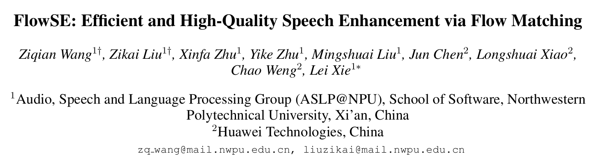

**FlowSE: Efficient and High-Quality Speech Enhancement via Flow Matching**

**Interspeech 2025**

## 摘要

Generative models **have excelled in** audio tasks using approaches such as language models, diffusion, and flow matching. However, existing generative approaches for speech enhancement (SE) face notable challenges: language model-based methods suffer from quantization loss, leading to compromised speaker similarity and intelligibility, while diffusion models require complex training and high inference latency. To address these challenges, we propose FlowSE, a flow-matching-based model for SE. Flow matching learns a continuous transformation between noisy and clean speech distributions in a single pass, significantly reducing inference latency while maintaining high-quality reconstruction. Specifically, FlowSE trains on noisy mel spectrograms and optional character sequences, optimizing a condition flow matching loss with ground-truth mel spectrograms as supervision. It implicitly learns speech’s temporal-spectral structure and text-speech alignment. During inference, FlowSE can operate with or without textual information, achieving impressive results in both scenarios, with further improvements when transcripts are available. Extensive experiments demonstrate that FlowSE significantly outper forms state-of-the-art generative methods, establishing a new paradigm for generative-based SE and demonstrating the potential of flow matching to advance the field. Our code, pre-trained checkpoints, and audio samples are available at https://github.com/Honee-W/FlowSE/.
Index Terms: flow matching, generative models, speech enhancement

生成模型在音频任务中表现出色，采用了语言模型、扩散模型和流匹配等方法。然而，现有的语音增强（SE）生成方法仍面临显著挑战：基于语言模型的方法存在量化损失，导致说话人相似性和可懂度受损，而扩散模型则需要复杂的训练且推理延迟高。为了解决这些问题，我们提出了FlowSE，一种基于流匹配的语音增强模型。流匹配通过单次处理学习噪声语音与干净语音分布之间的连续变换，可显著降低推理延迟，同时保持高质量重建。具体而言，FlowSE在噪声梅尔频谱图和可选的字符序列上进行训练，使用真实梅尔频谱图作为监督，优化条件流匹配损失。它隐式地学习语音的时-频结构和文本-语音对齐。在推理过程中，FlowSE可以有文本信息或无文本信息两种模式运行，在两种情况下都能取得出色效果，并且在有文字转录时效果会进一步提升。大量实验表明，FlowSE显著优于现有的生成方法，建立了生成式语音增强的新范式，并展示了流匹配推进该领域发展的潜力。我们的代码、预训练检查点和音频样例可在 https://github.com/Honee-W/FlowSE/ 获取。

### 问题

#### Q1：生成式模型和传统回归式模型

在语音增强（SE）里，“传统回归式模型”和“生成式模型”主要差在：它们怎么定义输出、怎么训练、推理时怎么产生结果。

**传统回归式模型（regression / discriminative）**

把 SE 当成一个“确定性的映射问题”：

- **形式**：给定带噪输入 $x$，直接预测一个输出 $\hat{y}=f_\theta(x)$。
     输出通常是：
    - 干净语音波形 / 干净频谱（mel、STFT 幅度等）
    - 或者一个 **mask**（如 ratio mask），再用 $x \times \text{mask}$ 得到增强结果
- **训练目标**：让预测结果尽量接近真值 $y$，比如 L1/L2、STFT loss、SI-SDR loss 等（本质是“拟合”）。
- **推理特点**：**一次前向**就出结果（快、稳定）。
- **优缺点直觉**：
    - 优点：简单、高效、延迟低。
    - 局限：它学的是“平均意义下最像”的点估计，遇到噪声很强或信息缺失时，可能会产生**过度平滑**、细节不够自然，或者在不同可能的干净解之间难以“选一个更合理的”。

一句话：**回归式模型 = 直接预测一个最可能/最接近的答案。**

> 训练损失：**L1/L2、STFT loss、SI-SDR loss**。它们都是“让输出更接近干净语音”的误差度量，但关注点不同。
>
> ## L1 / L2 loss（点对点误差）
>
> - **L1（MAE）**：$\; \| \hat{y}-y \|_1$
>      更“抗异常值”，倾向保留尖峰/细节，听感上有时比 L2 不那么糊。
> - **L2（MSE）**：$\; \| \hat{y}-y \|_2^2$
>      惩罚大误差更狠，容易得到“平均化”的解，可能更平滑。
>
> 用在 SE 里：可以在**波形**上算，也可以在**谱/梅尔谱**上算。
>
> ## STFT loss（频域一致性损失）
>
> 核心：不只比波形点对点，而是比较 **短时傅里叶变换（STFT）** 后的差异，尤其能约束 **频谱形状** 。
>
> 常见写法是组合：
>
> - **谱幅度（magnitude）差**：$\|\,|\text{STFT}(\hat{y})|-|\text{STFT}(y)|\,\|$
> - **log 幅度差**：$\|\log|\text{STFT}(\hat{y})|-\log|\text{STFT}(y)|\|$
>
> 很多工作还用 **multi-resolution STFT loss**：用多个窗长/hop 同时算，兼顾细节与整体。
>
> 直觉：更贴近人耳对“频率结构/谐波”的敏感性，比纯 L1/L2 更不容易“音色跑偏”。
>
> ## SI-SDR loss（尺度不变的信号失真比）
>
> SI-SDR 是评价/训练里很常见的语音分离/增强指标，衡量：$\hat{y}$ 在**允许整体增益缩放**的情况下，和 $y$ 有多一致。
>
> 做法直觉：
>
> 1. 先把 $\hat{y}$ 投影到 $y$ 的方向（找一个最佳缩放系数 $\alpha$）
> 2. 把投影部分当“目标”，剩下当“失真/噪声”
> 3. 比它们的能量比（dB）
>
> 训练时通常用 **$-\text{SI-SDR}$** 当 loss（越大越好，所以取负号最小化）。
>
> 直觉：更关注“整体波形结构/可懂度相关的失真”，而不纠结于纯粹的幅度标定。

**生成式模型（generative）**

把 SE 当成“从条件分布里采样”的问题：

- **形式**：学习条件分布 $p_\theta(y\mid x)$，即“给定带噪语音 $x$，干净语音 $y$ 可能有哪些样子”。
     推理时不是直接算 $f(x)$，而是**从模型里生成/采样**一个 $y$。

- **训练目标**：不只是做点对点拟合，而是让模型学会这个分布。不同生成式方法的训练目标不同：

    > 1. **扩散模型（Diffusion）：反复“擦干净”**
    >
    > 把干净语音想成一张清晰照片。扩散的生成过程像这样：
    >
    > - **训练时**：故意把干净语音一步步加噪，模型学习“在第 t 步怎么把噪声去掉一点点”。
    > - **推理时**：从“很乱的噪声”开始，**一步一步去噪**，比如 50、100 步……每一步都小幅变干净，最后得到增强语音。
    >
    > 直觉：**像拿橡皮擦一点点擦干净**。效果常很好，但**步数多就慢**。
    >
    > 2) **Flow Matching / Normalizing Flow：学一条“连续的清洗路线”** 
    >
    > 这类方法不是学“一步一步擦”，而是学一条“从噪声走到干净”的**连续路线**：
    >
    > - 你可以想象有一条河流/传送带：把“噪声样子”平滑地“搬运”到“干净样子”。
    > - 模型学的是：在任意时刻应该朝哪个方向走、走多快（就像速度/方向的导航）。
    > - **推理时**：用一个 ODE 求解器（常微分方程 ODE, Ordinary Differential Equation），沿着这条路线走一小段一小段（通常 **10–20 步**左右），就到干净结果。
    >
    > 直觉：**像跟着导航走一条平滑的路线到目的地**。通常比扩散需要的步数少，所以更快。
    >
    > 3) **LM + 离散 token：先“变成文字码”，再生成码，最后还原**
    >
    > 这条路线会先把语音变成离散符号（token），类似把音频“压缩成一串编号”：
    >
    > - **第一步：量化/编码**
    >      把语音切成一块块，每块用一个编号表示（token）。
    > - **第二步：用语言模型生成 token 序列**
    >      像做文本生成那样，预测下一个 token 是什么，从而生成“干净 token 序列”。
    > - **第三步：解码还原成语音**
    >      把 token 序列再还原成波形/频谱。
    >
    > 直觉：**先把音乐变成“简谱编号”，再生成更好的编号，再演奏出来**。
    >  缺点是：这一步“变成编号”会丢掉一些细节（量化损失），可能影响音质/说话人相似度，很容易“像换了个人/口齿糊”。

- **推理特点**：通常需要“采样过程”（多步迭代或 ODE 求解），所以历史上常比回归慢。

- **优缺点**：
    - 优点：更擅长生成**自然细节**、处理“不确定/缺失信息”，在主观听感上可能更好。
    - 局限：采样带来额外复杂度；有些路线（如离散 token）还会引入量化损失。

一句话：**生成式模型 = 学“可能性空间”，推理时通过采样生成一个合理的答案。**

## 1. Introduction

**传统确定性方法缺点**

在具有挑战的场景下**自然度** 不够，而**生成式** 更有潜力做高保真语音增强。

> **把“自然度”具体化：**
>
> - 不能只把噪声压下去，还得避免“金属音/机器人音/失真”；
> - 这往往和模型有没有学到“干净语音的分布结构”有关。

---

**两条主要生成式路线的缺陷**

语言模型 LM 路线：量化过程信息丢失 → artifact（伪影） → 影响说话人相似度和可懂度。 FlowSE Efficient and HighQualit…
 扩散 diffusion 路线：迭代随机去噪 → 计算重、延迟高。

---

**flow matching 优点** 

高效的“一次式（one-shot）”生成范式：它学习一个连续的“速度场（velocity field）”，把简单的噪声分布转换到复杂的数据分布。

> **“simple noise distribution”** 通常就是高斯噪声（很好采样、数学简单）。
>
> **“complex data distribution”** 就是真实语音（或语音的 mel 频谱）在空间里的分布：结构复杂、带强先验（谐波、共振峰、语音节律等）。
>
> **“velocity field（速度场）”** 是一个函数 $v_\theta(z,t)$：告诉你“当前状态 $z$ 在时间 $t$ 应该往哪里走、走多快”。
>
> **“one-shot”** 在这里更像“训练目标是直接学这个连续速度场”，不是像扩散那样围绕随机去噪链条设计很多步的噪声日程/采样；但注意：**推理仍然可能要走多步（用 ODE solver 积分）**，只是通常步数少很多。

 **high fidelity（音质/细节） + fast sampling（推理快）**

---

**FlowSE 架构** 

**rectified flow matching + DiT backbone 组合** 

- **flow matching**：核心是学一个速度场 $v_\theta(\cdot)$，用 ODE 把起点分布推到终点分布。
- **DiT backbone**：DiT 就是用 Transformer（注意力）当主干来预测这个速度场。

**要抓住的点**：Flow matching 决定了“训练/采样范式”，DiT 决定了“用什么神经网络来实现 $v_\theta$”

**训练输入：** noisy mel + 可选 transcript

**优化：** condition flow matching loss

**FlowSE 优点**

- 不像以前用 U-Net 或 VAE，Transformer 更能抓**长距离依赖**，从而有助于保留说话人身份。

    > 语音的结构经常是**长程的**：
    >
    > - 时间上：一句话里前后几百毫秒甚至几秒的能量/韵律/发音位置有联系
    > - 频率上：谐波结构会跨多个频带相关
    >
    > 作者的观点是：Transformer 的自注意力更擅长把这些远距离关系“连起来”，从而更好重建复杂语音模式。

- flow matching 学习的是一个连续变换/速度场（一个模型搞定），不走 **LM 的离散 token**（避免量化损失），也不走 **diffusion 的长链迭代**（避免很多步的去噪采样）

---

作者总结说：FlowSE 是一个 **rectified flow matching + DiT backbone** 的框架，目标是**高保真**且**推理更快**，并且强调能**保留说话人身份**；实验上改善质量、可懂度、说话人相似度，同时降低延迟。

---

::: info 思考三个问题：

**快**：到底快多少？用什么指标量化？

**好**：好在哪里？是主观质量、还是可懂度、还是说话人保持？

**为什么**：这些优势是来自 **flow matching** 还是来自 **DiT** 还是来自 **mel+vocoder** 的工程分解？

:::

## 2. Related Work

### 2.1 生成式语音增强

传统 vs 生成式：

- 传统（CNN/RNN 等）主要做“确定性重建”，即输入 noisy，网络直接输出一个 clean（点估计）。
- 生成式模型学习 clean speech 的“分布”，因此对未知噪声的泛化更强。

早期生成式缺点：VAE / GAN

- **VAE**：有潜在建模优势，但常“过平滑”，不够锐利/高保真。
- **GAN**：感知质量可能更好，但训练不稳定、可能训崩/不稳定。

近年两大生成式主流：LM token 路线、diffusion 路线

- **LM + 离散 token**：编码成 token 再用 LM 预测，但量化会丢信息，产生 artifact，伤害说话人相似度和可懂度。FlowSE Efficient and HighQualit…

- **Diffusion**：随机去噪迭代，极端噪声下强，但计算重、推理慢，不利实时。

### 2.2 生成式建模的流匹配

作者先给出 flow matching 的定义：学习连续时间的概率流，把简单噪声分布变成复杂目标分布；并强调它直接学“确定性的、随时间变化的速度场”。FlowSE Efficient and HighQualit…

然后列举它在语音生成/增强/分离的成功应用：TTS（MATCHA-TTS、E2-TTS、F5-TTS）、增强（GF-VAE、FlowAVSE）、分离（FlowSep）。

最后一句很关键：这些工作要么依赖 U-Net/VAE，要么依赖视觉输入或 latent 映射；**“纯音频 + Transformer + 可选文本条件”的框架还没被探索**。这就是 FlowSE 的**创新定位**。

## 3. Proposed Approach

### 3.1 整体框架

语音增强：从带噪语音 $y\in\mathbb{R}^T$ 里恢复干净语音 $x\in\mathbb{R}^T$。

作者提醒：要做好这件事，不仅要建模声学信号，还要利用“可用的辅助信息”（比如文本转写）。

**FlowSE 有三个关键组件:** 

**组件 A：文本编码器 $T$** （可选）

**组件 B：Flow-matching 生成模块 $F$（核心）**

**组件 C：声码器 $V$** 

---

**Figure 1 的数据流：训练和推理分别喂什么、产出什么**

**训练阶段（Figure 1 左边）**

模型会同时看到三类输入：

1. **带噪声的梅尔谱 noisy mel**：$M_y$
2. **插值梅尔谱 interpolated mel**：$M_t$（由 **干净语音的 mel + 高斯噪声** 混合得到）
3. **可选文本**：转写 $C$

流程是：

- 文本 $C$ 先过组件 $T$ 得到文本 embedding；
- 文本 embedding 会和音频 embedding **拼接（concatenate）**；
- DiT-based flow model $F$ 预测概率 flow，并通过梯度更新训练，让它能重建干净 mel $M_x$。

> 可以先把 $M_t$ 理解成“训练时的人造中间状态”：模型学习“从中间状态往干净方向推”。（为什么要这样做，3.2 会用公式讲清楚）

**推理阶段（Figure 1 右边）**

推理输入是：

1. noisy mel：$M_y$
2. 初始高斯噪声：$M_0$
3. 可选文本：$C$

然后：

- 模型预测的 flow 会“指导 ODE solver”生成增强后的 mel $\hat M_x$；
- 最后用 vocoder 把 $\hat M_x$ 变回波形。

> 关键点（别搞混）：**noisy mel 是条件输入**，而 **$M_0$ 是生成过程的随机起点**。

### 3.2 用于语音增强的流匹配

**目的：** 把“带噪分布”连续变成“干净分布”。

作者先把 SE 写成一个“分布变换”问题：把源分布 $p(y)$（比如 noisy speech）映射到目标分布 $p(x)$（比如 clean speech）。

> 不是直接学一个固定的 $x=f(y)$，而是学一条“从 noisy 走向 clean 的路径”。
>
>  **“学分布”不是背地图，是学“怎么把点搬过去”** 
>
> 关键是：我们要的不只是知道终点长啥样，而是要一个办法：
>
> > 给我一个高斯里随机抽到的点 z，
> >  我能按某种规则，把它“推着走”，最后它会落到双峰那两团里。
>
> 这条“走的过程”就是论文说的**路径**：$z_t$ 随着 $t\in[0,1]$ 连续变化。

---

**公式 (1)：ODE = 这条“路径”的数学表达** 

论文给出核心 ODE：
$$
\frac{dz_t}{dt} = v_\theta(z_t,t),\quad z_0=y,\; z_1=x \tag{1}
$$
横坐标是时间 $t$，纵坐标是状态 $z_t$ ，对 t 求导就是看这一时刻的瞬时斜率/瞬时变化率，就是我们说的速度场。

含义逐个拆开：

- **边界：** $z_0=y$ 是起点（noisy），$z_1=x$ 是终点（clean）。

- $z_t$：**中间状态**。比如 $t\in[0,1]$ 时，你从 noisy 逐渐变到 clean 的中间状态。
- $v_\theta(z_t,t)$：**速度场**（方向+速度）。模型学的就是它：在“当前状态、当前时间”下，下一瞬间该往哪走。

>  $z_t$ 是 3.2 用来讲“通用 flow matching”的抽象符号；**$M_t$** 是 FlowSE 在 mel 域里的具体实例。它们说的是同一个“中间状态”，只是记号不同。作者先不限定你是在波形域、STFT 域还是 mel 域做，只想表达一个通用事实。这里 $z_t$ 就表示“从源分布到目标分布过程中任意时刻的状态”。

### 3.5 问题

#### Q2：ODE 常微分方程

ODE 是 **常微分方程**（Ordinary Differential Equation）。

它描述的是：**一个量会随着“时间”连续变化，而它变化的速度由某个规则决定**。

**例子** 

- 位置 $x(t)$ 随时间变
- 速度 $v(t)$ 决定位置怎么变
     这就是：

$$
\frac{dx(t)}{dt} = v(t)
$$

左边 $\frac{dx}{dt}$ 叫“导数”，也就是“变化速度”。

