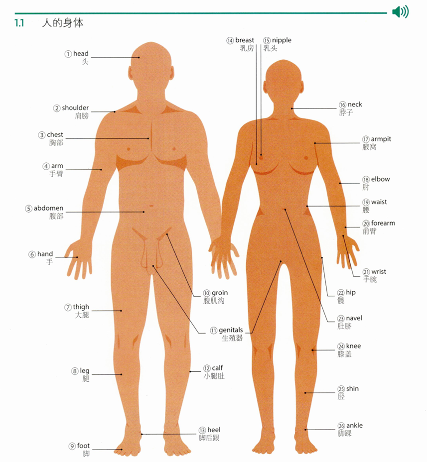

学习笔记

## 01. 身体各部分

### 1.1 人的身体

**1. head**  

`/hed/` 

---

**noun (body part)** 

A1. [c]

the part of the body above the neck where the eyes, nose, mouth, ears, and brain are

- She nodded/shook her head (= showed her agreement/disagreement).

---

A1. [s]

a person or animal when considered as a unit

- I did a quick head count (= calculated how many people there were).

---

A1. [s]

a measure of length or height equal to the size of a head

- Her horse won by a head.

---

**noun (mind)** 

B1. [c]

the mind and mental abilities

- Harriet has a (good) head for figures (= she is very good at calculating numbers).

- (UK) Do you have a head for heights (= are you able to be in high places without fear)?

---

**noun (leader)** 

A2. [c] mainly UK

a headteacher

head boy/girl: a boy or girl who often represents his or her school on formal occasions. （学生代表）

- There is no doubt that she was the most popular head girl in the history of the school.

---

B1. [c]

someone in charge of or leading an organization, group, etc.

- his first season as head coach

---

**noun (top part)** 

C2 [s]

the top part or beginning of something

- Diana, the guest of honour, sat at the head of the table (= the most important end of it). 戴安娜作为贵宾坐在上座。

